# Cherry Studio 知识管理服务

<cite>
**本文档中引用的文件**
- [KnowledgeService.ts](file://src/main/services/KnowledgeService.ts)
- [dify-knowledge.ts](file://src/main/mcpServers/dify-knowledge.ts)
- [factory.ts](file://src/main/mcpServers/factory.ts)
- [MCPService.ts](file://src/main/services/MCPService.ts)
- [knowledge.ts](file://src/main/utils/knowledge.ts)
- [index.ts](file://src/main/knowledge/embedjs/loader/index.ts)
- [knowledge.ts](file://src/renderer/src/types/knowledge.ts)
- [index.ts](file://src/renderer/src/types/index.ts)
- [useKnowledge.ts](file://src/renderer/src/hooks/useKnowledge.ts)
- [KnowledgePage.tsx](file://src/renderer/src/pages/knowledge/KnowledgePage.tsx)
- [AddKnowledgeBasePopup.tsx](file://src/renderer/src/pages/knowledge/components/AddKnowledgeBasePopup.tsx)
</cite>

## 目录
1. [简介](#简介)
2. [系统架构概览](#系统架构概览)
3. [核心组件分析](#核心组件分析)
4. [知识库本地存储管理](#知识库本地存储管理)
5. [内存中的RAG应用实例映射](#内存中的rag应用实例映射)
6. [数据库连接池管理](#数据库连接池管理)
7. [工作负载管理和并发控制](#工作负载管理和并发控制)
8. [资源清理机制](#资源清理机制)
9. [MCP服务器集成](#mcp服务器集成)
10. [知识库生命周期管理](#知识库生命周期管理)
11. [对话中的知识库引用](#对话中的知识库引用)
12. [故障排除指南](#故障排除指南)
13. [总结](#总结)

## 简介

Cherry Studio的知识管理服务是一个基于RAG（检索增强生成）技术的智能知识库管理系统。该服务负责创建、管理和查询各种类型的知识库，包括文件、目录、URL、站点地图和笔记等数据源。通过与MCP（Model Context Protocol）服务器的深度集成，特别是dify-knowledge服务器，实现了本地和远程知识库的统一管理。

## 系统架构概览

知识管理服务采用分层架构设计，主要包含以下核心层次：

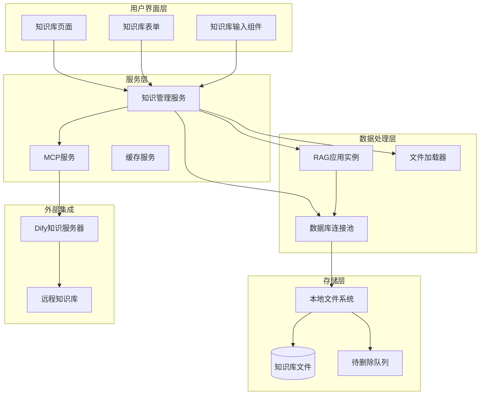

**图表来源**
- [KnowledgeService.ts](file://src/main/services/KnowledgeService.ts#L98-L120)
- [MCPService.ts](file://src/main/services/MCPService.ts#L136-L200)

## 核心组件分析

### KnowledgeService 类结构

KnowledgeService是整个知识管理系统的核心类，负责协调所有知识库相关的操作：

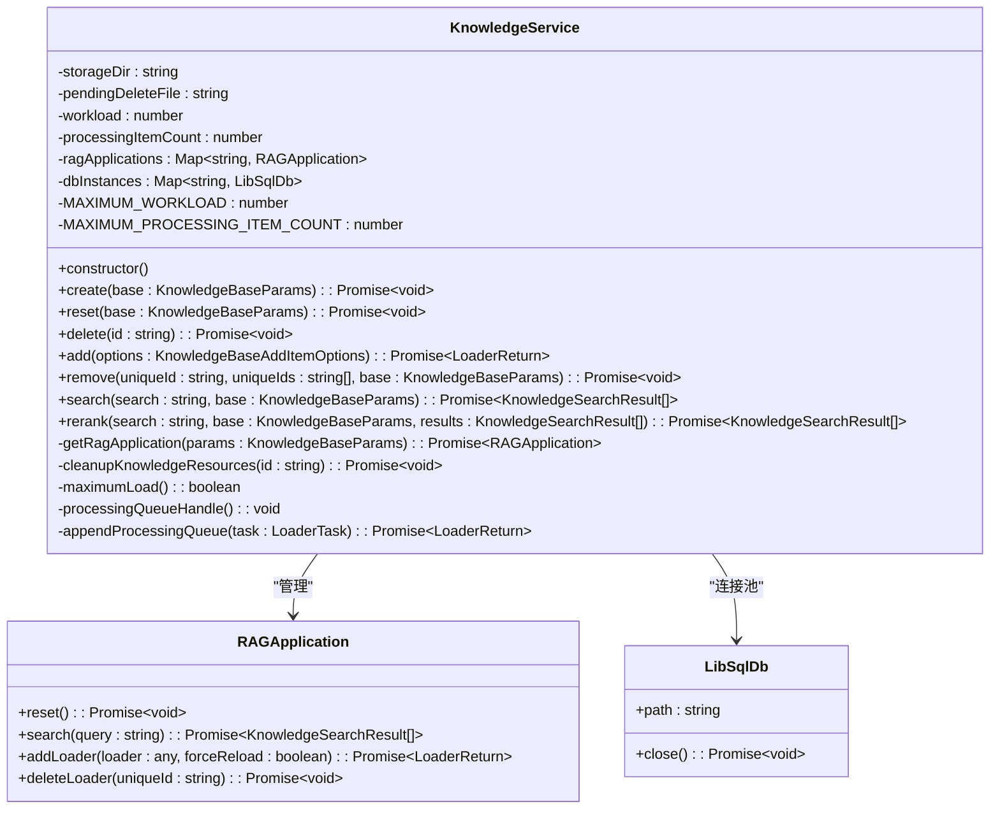

**图表来源**
- [KnowledgeService.ts](file://src/main/services/KnowledgeService.ts#L98-L115)

**章节来源**
- [KnowledgeService.ts](file://src/main/services/KnowledgeService.ts#L98-L316)

## 知识库本地存储管理

### getDataPath() 实现

知识库的本地存储采用集中式管理策略，通过getDataPath()方法确定存储位置：

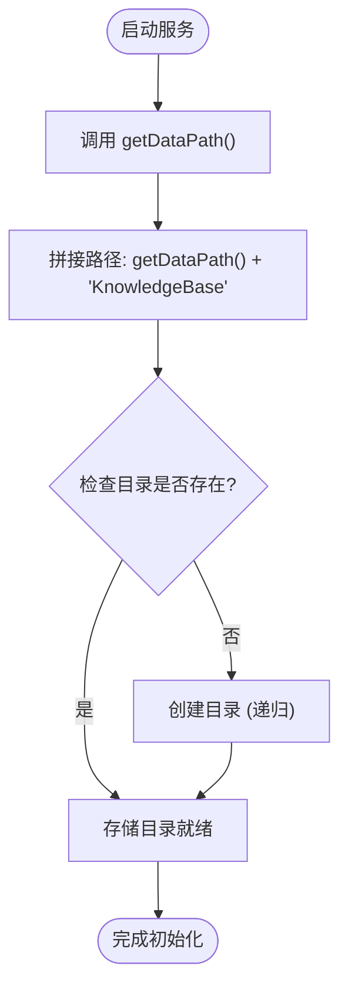

**图表来源**
- [KnowledgeService.ts](file://src/main/services/KnowledgeService.ts#L99-L100)
- [KnowledgeService.ts](file://src/main/services/KnowledgeService.ts#L122-L126)

### 存储目录结构

知识库文件按照以下结构组织：
- **主目录**: `{getDataPath}/KnowledgeBase`
- **知识库文件**: `{id}.db` (SQLite数据库文件)
- **待删除队列**: `knowledge_pending_delete.json`

**章节来源**
- [KnowledgeService.ts](file://src/main/services/KnowledgeService.ts#L99-L100)
- [KnowledgeService.ts](file://src/main/services/KnowledgeService.ts#L101-L102)

## 内存中的RAG应用实例映射

### ragApplications 映射表

RAG应用实例采用懒加载模式，在首次请求时创建并缓存：

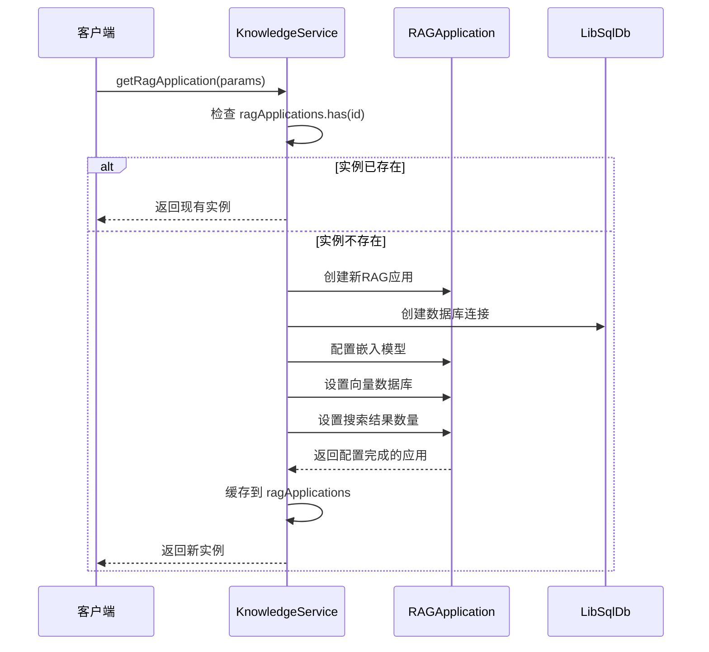

**图表来源**
- [KnowledgeService.ts](file://src/main/services/KnowledgeService.ts#L237-L271)

### RAG应用配置参数

每个RAG应用实例都根据知识库参数进行个性化配置：

| 参数 | 类型 | 描述 | 默认值 |
|------|------|------|--------|
| id | string | 知识库唯一标识符 | 必需 |
| embedApiClient | ApiClient | 嵌入模型客户端 | 必需 |
| dimensions | number | 向量维度 | 可选 |
| documentCount | number | 搜索结果数量 | 30 |
| chunkSize | number | 文本块大小 | 可选 |
| chunkOverlap | number | 文本块重叠 | 可选 |

**章节来源**
- [KnowledgeService.ts](file://src/main/services/KnowledgeService.ts#L237-L271)

## 数据库连接池管理

### dbInstances 连接池

数据库连接池采用LRU（最近最少使用）策略管理多个知识库的数据库连接：

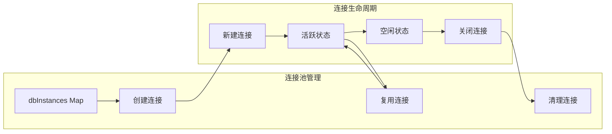

**图表来源**
- [KnowledgeService.ts](file://src/main/services/KnowledgeService.ts#L105-L106)

### 数据库文件管理

每个知识库对应一个独立的SQLite数据库文件，文件命名规则为：`{sanitized_id}.db`

**章节来源**
- [KnowledgeService.ts](file://src/main/services/KnowledgeService.ts#L105-L106)
- [KnowledgeService.ts](file://src/main/services/KnowledgeService.ts#L151-L154)

## 工作负载管理和并发控制

### 并发处理机制

系统实现了智能的工作负载管理和并发控制机制：

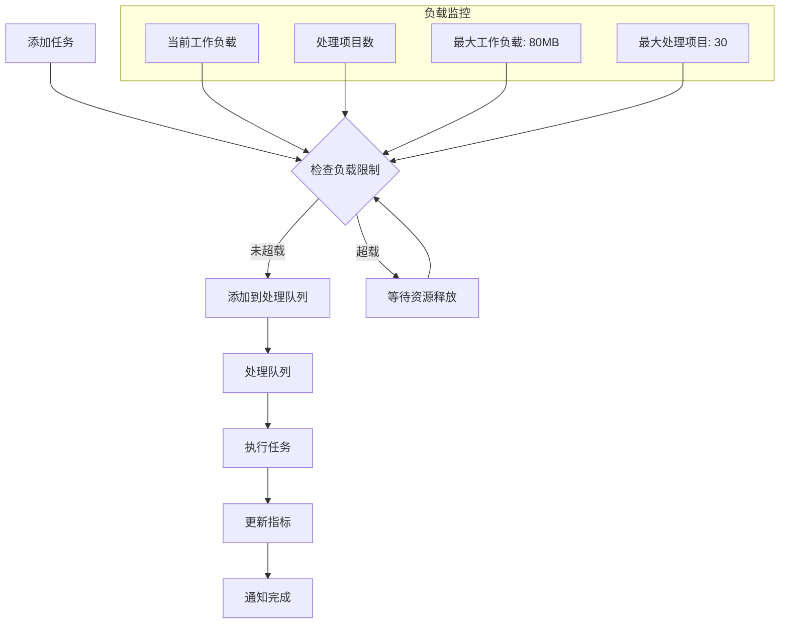

**图表来源**
- [KnowledgeService.ts](file://src/main/services/KnowledgeService.ts#L296-L301)
- [KnowledgeService.ts](file://src/main/services/KnowledgeService.ts#L551-L596)

### 负载限制参数

| 参数 | 值 | 单位 | 说明 |
|------|-----|------|------|
| MAXIMUM_WORKLOAD | 80 * MB | 字节 | 最大允许的工作负载 |
| MAXIMUM_PROCESSING_ITEM_COUNT | 30 | 个 | 最大并发处理项目数 |

### 任务队列处理

系统采用优先级队列机制处理不同类型的任务：

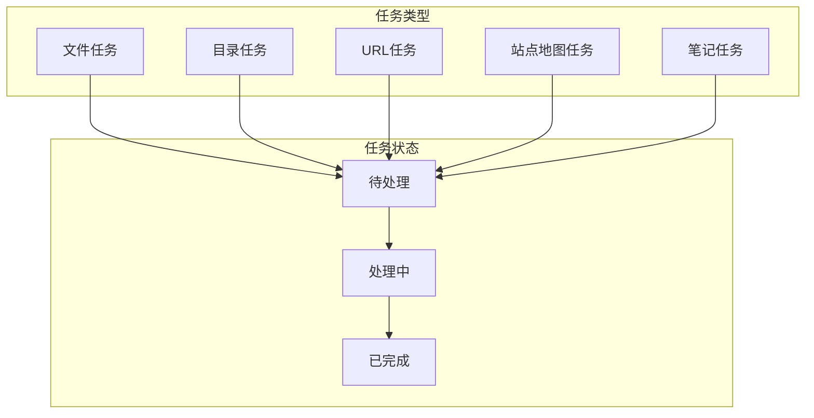

**图表来源**
- [KnowledgeService.ts](file://src/main/services/KnowledgeService.ts#L63-L73)

**章节来源**
- [KnowledgeService.ts](file://src/main/services/KnowledgeService.ts#L296-L301)
- [KnowledgeService.ts](file://src/main/services/KnowledgeService.ts#L551-L596)

## 资源清理机制

### 自动清理流程

系统实现了多层次的资源清理机制：

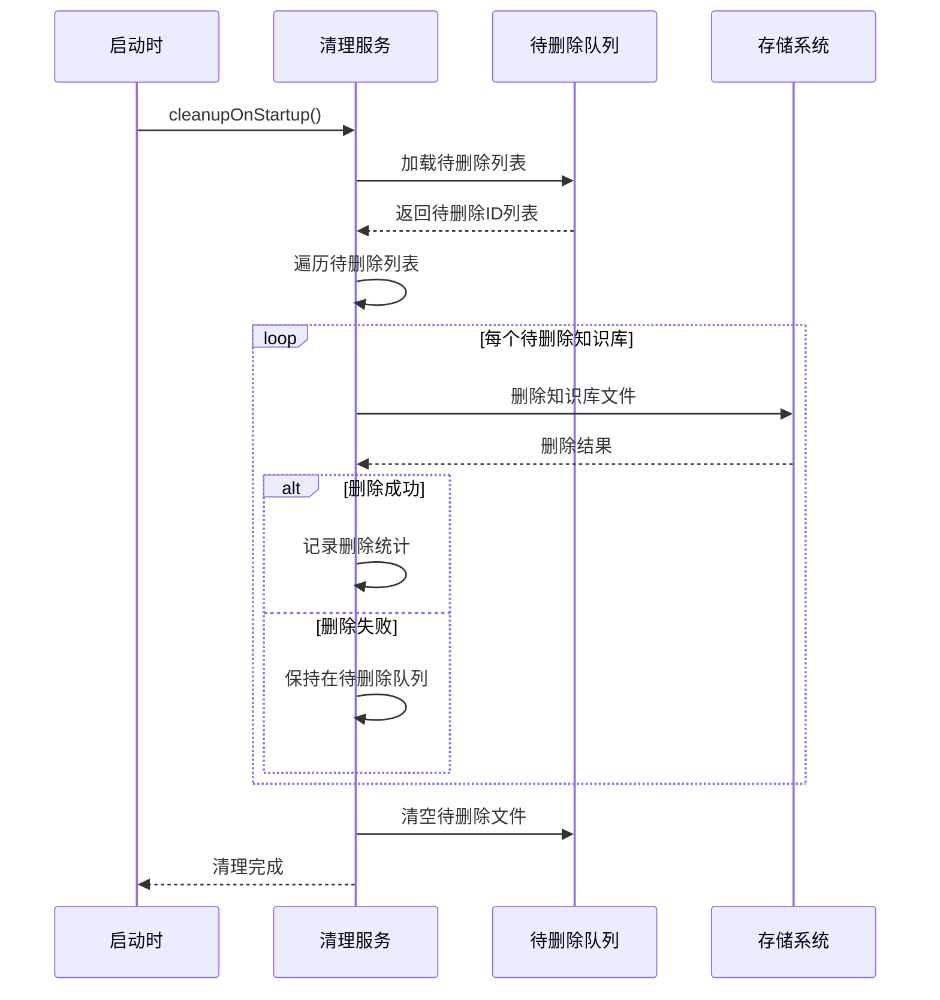

**图表来源**
- [KnowledgeService.ts](file://src/main/services/KnowledgeService.ts#L218-L235)

### 手动清理机制

当知识库删除失败时，系统会自动将其加入待删除队列：

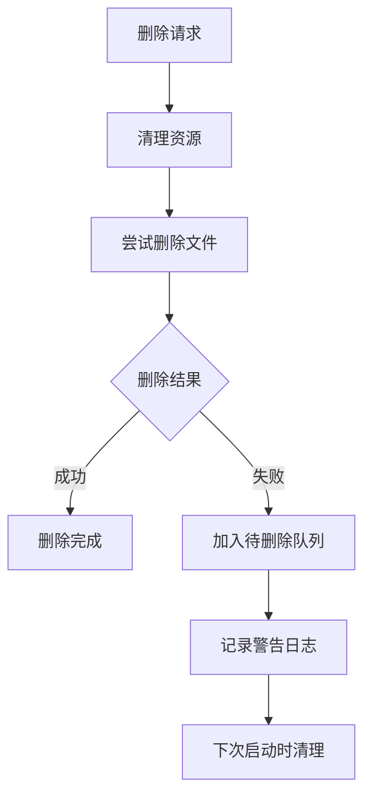

**图表来源**
- [KnowledgeService.ts](file://src/main/services/KnowledgeService.ts#L282-L294)

**章节来源**
- [KnowledgeService.ts](file://src/main/services/KnowledgeService.ts#L128-L149)
- [KnowledgeService.ts](file://src/main/services/KnowledgeService.ts#L218-L235)

## MCP服务器集成

### Dify知识服务器

Cherry Studio通过MCP协议集成了Dify知识服务器，实现远程知识库的访问和操作：

```mermaid
graph TB
subgraph "MCP服务器架构"
Factory[MCP工厂]
DifyServer[Dify知识服务器]
Transport[传输层]
end
subgraph "Dify服务器功能"
ListTools[列出知识库]
SearchTool[搜索知识库]
Auth[身份验证]
end
subgraph "API交互"
GET[GET /datasets]
POST[POST /datasets/{id}/retrieve]
Response[响应处理]
end
Factory --> DifyServer
DifyServer --> Transport
DifyServer --> ListTools
DifyServer --> SearchTool
DifyServer --> Auth
ListTools --> GET
SearchTool --> POST
GET --> Response
POST --> Response
```

**图表来源**
- [dify-knowledge.ts](file://src/main/mcpServers/dify-knowledge.ts#L53-L133)
- [factory.ts](file://src/main/mcpServers/factory.ts#L40-L42)

### MCP工具接口

Dify知识服务器提供了两个主要的MCP工具：

| 工具名称 | 功能描述 | 输入参数 | 输出格式 |
|----------|----------|----------|----------|
| list_knowledges | 列出所有可用知识库 | 无 | 知识库列表文本 |
| search_knowledge | 搜索特定知识库内容 | id, query, topK | 搜索结果文本 |

### 远程知识库访问流程

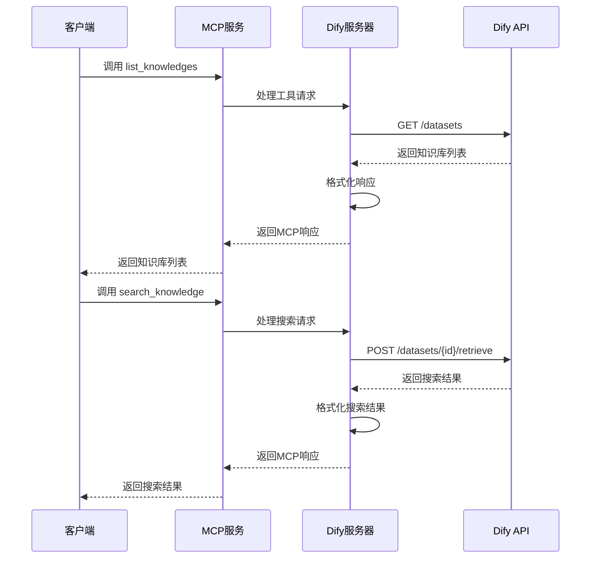

**图表来源**
- [dify-knowledge.ts](file://src/main/mcpServers/dify-knowledge.ts#L101-L133)

**章节来源**
- [dify-knowledge.ts](file://src/main/mcpServers/dify-knowledge.ts#L53-L260)
- [factory.ts](file://src/main/mcpServers/factory.ts#L40-L42)

## 知识库生命周期管理

### 创建流程

知识库的创建遵循严格的生命周期管理：

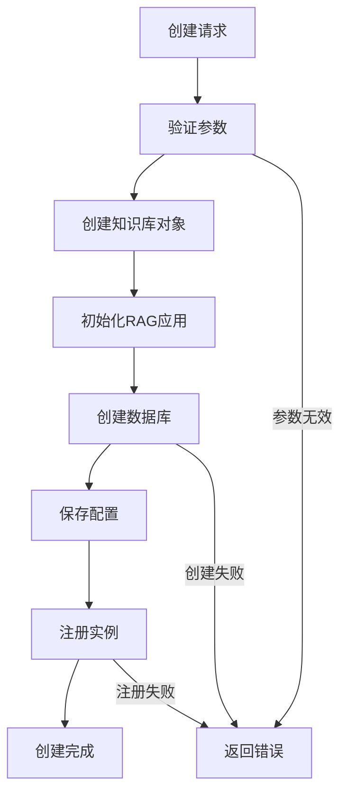

**图表来源**
- [KnowledgeService.ts](file://src/main/services/KnowledgeService.ts#L273-L275)

### 更新和删除流程

知识库的更新和删除操作涉及多个步骤的协调：

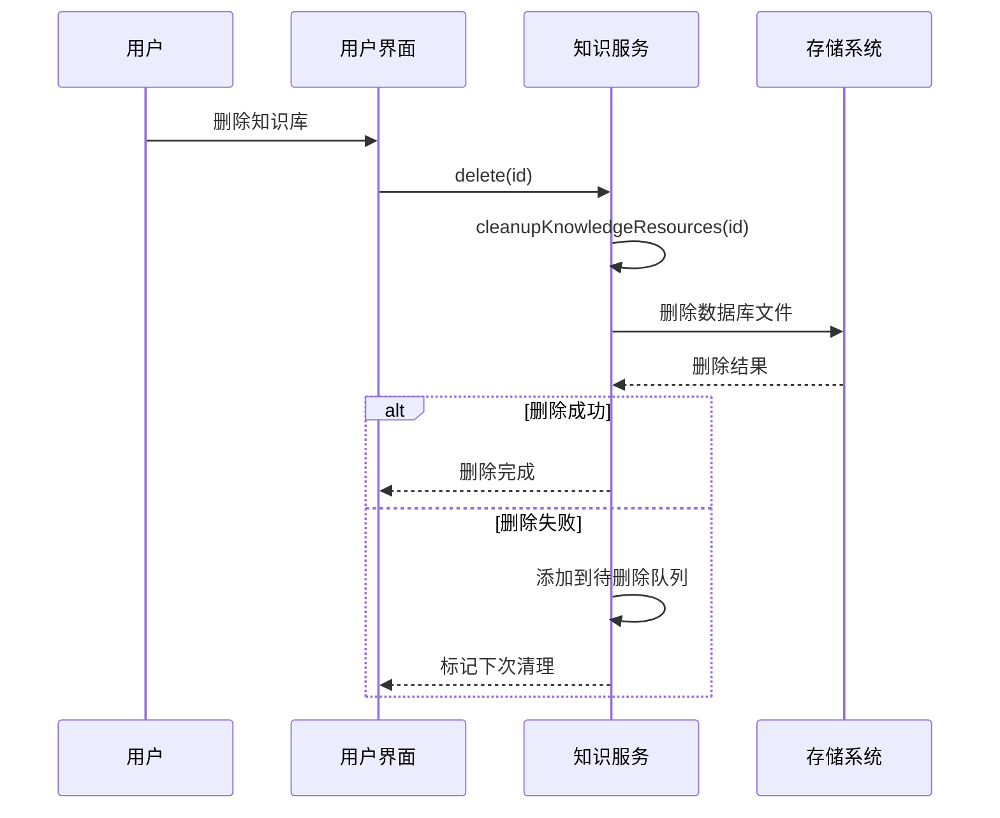

**图表来源**
- [KnowledgeService.ts](file://src/main/services/KnowledgeService.ts#L282-L294)

**章节来源**
- [KnowledgeService.ts](file://src/main/services/KnowledgeService.ts#L273-L294)
- [useKnowledge.ts](file://src/renderer/src/hooks/useKnowledge.ts#L345-L394)

## 对话中的知识库引用

### 知识库引用机制

在对话过程中，知识库可以通过多种方式被引用和使用：

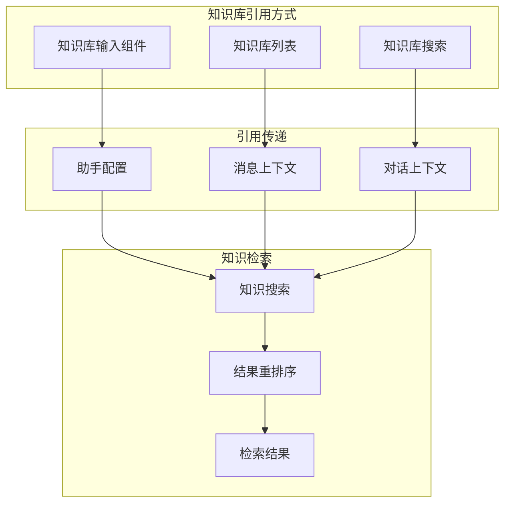

**图表来源**
- [KnowledgeBaseInput.tsx](file://src/renderer/src/pages/home/Inputbar/KnowledgeBaseInput.tsx#L8-L24)

### 知识库配置集成

知识库可以作为助手配置的一部分被引用：

| 集成点 | 作用 | 配置方式 |
|--------|------|----------|
| 助手配置 | 为特定助手指定知识库 | knowledge_bases 数组 |
| 对话上下文 | 在对话中动态引用知识库 | 消息元数据 |
| 主题关联 | 为主题关联知识库 | 主题配置 |

**章节来源**
- [KnowledgeBaseInput.tsx](file://src/renderer/src/pages/home/Inputbar/KnowledgeBaseInput.tsx#L8-L35)
- [index.ts](file://src/renderer/src/types/index.ts#L28-L41)

## 故障排除指南

### 常见问题及解决方案

#### 1. 知识库创建失败

**症状**: 知识库创建后无法正常工作

**可能原因**:
- 嵌入模型配置错误
- 数据库文件权限问题
- 磁盘空间不足

**解决步骤**:
1. 检查嵌入模型配置是否正确
2. 验证存储目录权限
3. 检查磁盘可用空间

#### 2. 并发处理超载

**症状**: 知识库添加任务长时间挂起

**可能原因**:
- 当前工作负载达到上限
- 处理项目数超过限制

**解决步骤**:
1. 等待现有任务完成
2. 减少同时处理的知识库数量
3. 增加系统资源

#### 3. 远程知识库连接失败

**症状**: 无法连接到Dify知识服务器

**可能原因**:
- 网络连接问题
- API密钥配置错误
- 服务器地址配置错误

**解决步骤**:
1. 检查网络连接状态
2. 验证API密钥有效性
3. 确认服务器地址正确性

### 性能优化建议

#### 1. 存储优化
- 定期清理不再使用的知识库
- 监控存储空间使用情况
- 考虑使用SSD存储提高性能

#### 2. 内存优化
- 合理设置最大工作负载限制
- 监控RAG应用实例数量
- 及时清理不需要的数据库连接

#### 3. 网络优化
- 配置适当的超时时间
- 使用连接池减少连接开销
- 实施重试机制处理临时故障

## 总结

Cherry Studio的知识管理服务是一个功能完整、架构合理的智能知识库管理系统。它通过以下关键特性实现了高效的知识管理：

1. **模块化架构**: 清晰的分层设计使得系统易于维护和扩展
2. **智能资源管理**: 通过工作负载控制和资源清理机制确保系统稳定性
3. **多源数据支持**: 支持文件、URL、目录等多种数据源的统一管理
4. **远程集成能力**: 通过MCP协议实现与外部知识库系统的无缝集成
5. **用户友好界面**: 直观的用户界面和完善的生命周期管理

该系统为Cherry Studio提供了强大的知识管理基础，支持复杂的AI应用场景，是构建智能对话系统的重要基础设施。