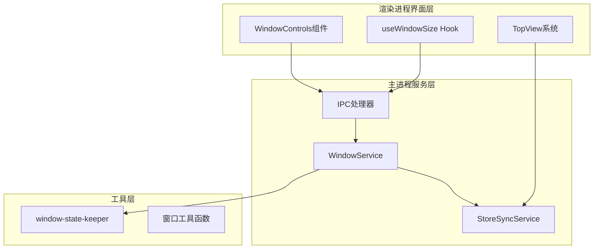
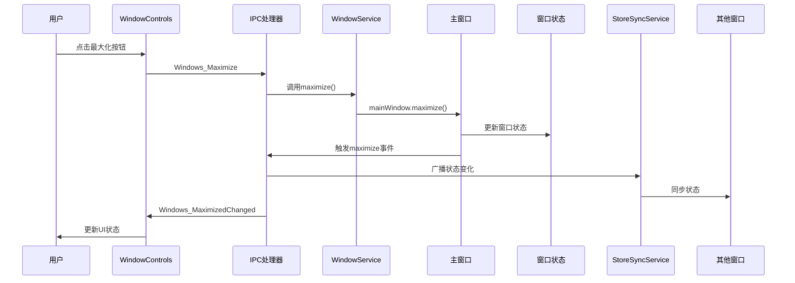
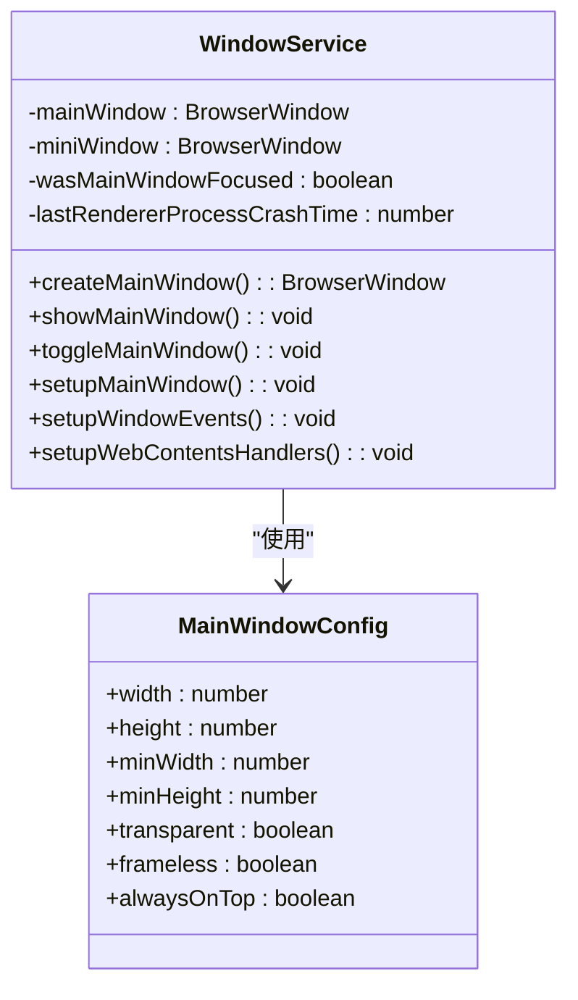
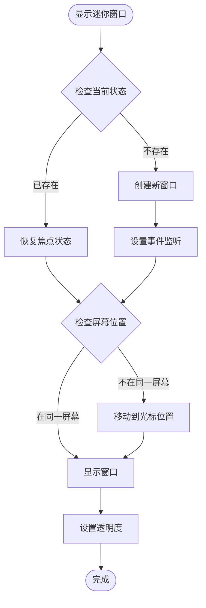
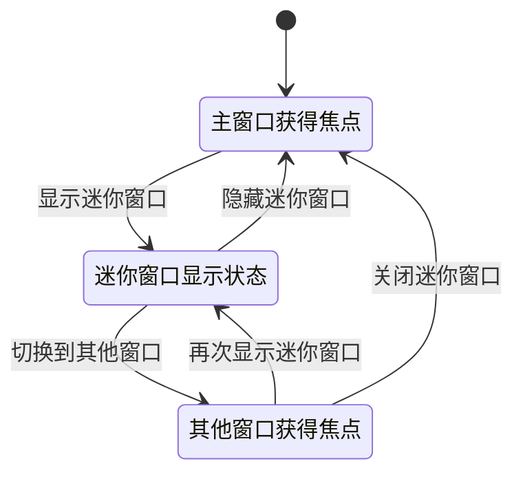
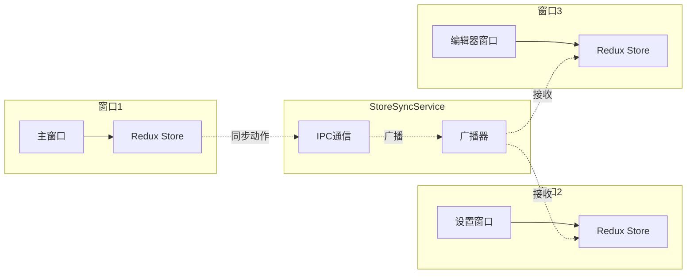
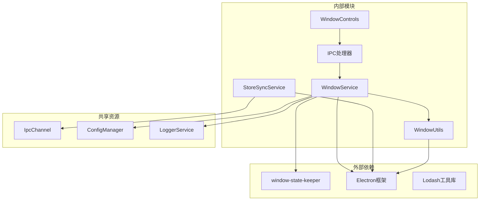

# 窗口管理服务

<cite>
**本文档中引用的文件**
- [WindowService.ts](file://src/main/services/WindowService.ts)
- [IpcChannel.ts](file://packages/shared/IpcChannel.ts)
- [ipc.ts](file://src/main/ipc.ts)
- [windowUtil.ts](file://src/main/utils/windowUtil.ts)
- [StoreSyncService.ts](file://src/main/services/StoreSyncService.ts)
- [index.tsx](file://src/renderer/src/components/WindowControls/index.tsx)
- [useWindowSize.ts](file://src/renderer/src/hooks/useWindowSize.ts)
</cite>

## 目录
1. [简介](#简介)
2. [项目结构](#项目结构)
3. [核心组件](#核心组件)
4. [架构概览](#架构概览)
5. [详细组件分析](#详细组件分析)
6. [依赖关系分析](#依赖关系分析)
7. [性能考虑](#性能考虑)
8. [故障排除指南](#故障排除指南)
9. [结论](#结论)

## 简介

Cherry Studio的窗口管理服务是一个复杂而精密的系统，负责管理应用程序中的主窗口和迷你窗口的生命周期、状态持久化、焦点管理和多窗口协同工作。该服务基于Electron框架构建，利用window-state-keeper库实现窗口位置和大小的状态持久化，并通过IPC通道提供统一的窗口控制接口。

服务的核心设计理念是为用户提供流畅的窗口操作体验，同时确保窗口状态的一致性和可靠性。它支持多种窗口操作，包括最小化、最大化、还原和关闭，并能够智能地处理窗口焦点切换和状态同步。

## 项目结构

Cherry Studio的窗口管理系统采用分层架构设计，主要包含以下关键组件：



**图表来源**
- [WindowService.ts](file://src/main/services/WindowService.ts#L26-L41)
- [StoreSyncService.ts](file://src/main/services/StoreSyncService.ts#L15-L32)
- [ipc.ts](file://src/main/ipc.ts#L690-L739)

**章节来源**
- [WindowService.ts](file://src/main/services/WindowService.ts#L1-L685)
- [StoreSyncService.ts](file://src/main/services/StoreSyncService.ts#L1-L133)

## 核心组件

### WindowService类

WindowService是整个窗口管理系统的核心控制器，采用单例模式确保全局唯一性。该类负责管理主窗口和迷你窗口的创建、显示、隐藏和销毁等生命周期操作。

主要特性：
- **单例模式管理**：确保全局只有一个窗口服务实例
- **双窗口架构**：同时管理主窗口和迷你窗口
- **状态持久化**：利用window-state-keeper保存窗口位置和大小
- **焦点管理**：智能处理窗口焦点切换和恢复
- **异常处理**：完善的渲染进程崩溃检测和恢复机制

### IPC通信接口

系统提供了完整的IPC通信接口，通过IpcChannel枚举定义了所有可用的窗口控制命令：

| IPC通道 | 功能描述 | 参数类型 | 返回值类型 |
|---------|----------|----------|------------|
| Windows_Minimize | 最小化主窗口 | 无 | void |
| Windows_Maximize | 最大化主窗口 | 无 | void |
| Windows_Unmaximize | 取消最大化 | 无 | void |
| Windows_Close | 关闭主窗口 | 无 | void |
| Windows_IsMaximized | 检查是否最大化 | 无 | boolean |
| Windows_MaximizedChanged | 状态变化通知 | boolean | void |
| Windows_Resize | 窗口调整通知 | [width, height] | void |

### StoreSyncService

StoreSyncService负责在多个窗口之间同步Redux状态，确保用户在不同窗口间操作时的状态一致性。该服务使用白名单机制控制需要同步的动作类型。

**章节来源**
- [WindowService.ts](file://src/main/services/WindowService.ts#L26-L685)
- [IpcChannel.ts](file://packages/shared/IpcChannel.ts#L136-L146)
- [StoreSyncService.ts](file://src/main/services/StoreSyncService.ts#L15-L133)

## 架构概览

窗口管理系统采用事件驱动的架构模式，通过观察者模式实现组件间的松耦合通信：



**图表来源**
- [ipc.ts](file://src/main/ipc.ts#L712-L715)
- [WindowService.ts](file://src/main/services/WindowService.ts#L43-L48)
- [StoreSyncService.ts](file://src/main/services/StoreSyncService.ts#L90-L97)

## 详细组件分析

### 主窗口管理

主窗口是Cherry Studio的核心界面，具有丰富的功能特性和复杂的生命周期管理：



**图表来源**
- [WindowService.ts](file://src/main/services/WindowService.ts#L26-L41)
- [WindowService.ts](file://src/main/services/WindowService.ts#L43-L106)

主窗口的关键配置特性：
- **自适应标题栏**：根据操作系统自动选择原生标题栏或自定义控件
- **透明效果**：在macOS上启用毛玻璃效果
- **焦点管理**：智能跟踪和恢复窗口焦点状态
- **渲染进程监控**：检测并处理渲染进程崩溃

### 迷你窗口管理

迷你窗口作为快速助手界面，具有独特的设计目标和交互模式：



**图表来源**
- [WindowService.ts](file://src/main/services/WindowService.ts#L472-L559)
- [WindowService.ts](file://src/main/services/WindowService.ts#L561-L622)

迷你窗口的独特特性：
- **始终置顶**：使用`alwaysOnTop`属性确保可见性
- **透明背景**：在macOS上启用半透明效果
- **智能定位**：自动移动到鼠标所在屏幕
- **焦点策略**：支持固定模式和自动隐藏

### 状态持久化机制

系统利用window-state-keeper库实现窗口状态的持久化存储：

```mermaid
erDiagram
WINDOW_STATE {
string file_name
number x
number y
number width
number height
boolean fullScreen
boolean maximize
}
MAIN_WINDOW_STATE {
string file "mainWindow-state.json"
number default_width
number default_height
}
MINI_WINDOW_STATE {
string file "miniWindow-state.json"
number default_width 550
number default_height 400
}
WINDOW_STATE ||--|| MAIN_WINDOW_STATE : "主窗口状态"
WINDOW_STATE ||--|| MINI_WINDOW_STATE : "迷你窗口状态"
```

**图表来源**
- [WindowService.ts](file://src/main/services/WindowService.ts#L50-L55)
- [WindowService.ts](file://src/main/services/WindowService.ts#L477-L481)

### 窗口焦点管理

窗口焦点管理系统确保用户在多窗口环境中的操作体验：



**图表来源**
- [WindowService.ts](file://src/main/services/WindowService.ts#L31-L34)
- [WindowService.ts](file://src/main/services/WindowService.ts#L568-L570)

**章节来源**
- [WindowService.ts](file://src/main/services/WindowService.ts#L43-L685)
- [windowUtil.ts](file://src/main/utils/windowUtil.ts#L1-L78)

### 多窗口协同工作

StoreSyncService实现了跨窗口的状态同步机制：



**图表来源**
- [StoreSyncService.ts](file://src/main/services/StoreSyncService.ts#L15-L32)
- [StoreSyncService.ts](file://src/main/services/StoreSyncService.ts#L73-L100)

**章节来源**
- [StoreSyncService.ts](file://src/main/services/StoreSyncService.ts#L1-L133)

## 依赖关系分析

窗口管理系统的依赖关系体现了清晰的分层架构：



**图表来源**
- [WindowService.ts](file://src/main/services/WindowService.ts#L1-L20)
- [StoreSyncService.ts](file://src/main/services/StoreSyncService.ts#L1-L5)

**章节来源**
- [WindowService.ts](file://src/main/services/WindowService.ts#L1-L20)
- [StoreSyncService.ts](file://src/main/services/StoreSyncService.ts#L1-L5)

## 性能考虑

窗口管理系统在设计时充分考虑了性能优化：

### 渲染进程监控
系统实现了智能的渲染进程崩溃检测机制，避免频繁重启导致用户体验下降。

### 窗口状态缓存
通过window-state-keeper实现的状态持久化减少了不必要的磁盘I/O操作。

### 事件防抖处理
使用Lodash的防抖函数优化窗口大小变化事件的处理频率。

### 内存管理
及时清理不再使用的窗口引用，防止内存泄漏。

## 故障排除指南

### 常见问题及解决方案

#### 窗口状态丢失
**症状**：应用程序重启后窗口位置和大小恢复默认值
**原因**：window-state-keeper配置错误或权限问题
**解决**：检查数据目录写入权限，验证状态文件格式

#### 迷你窗口无法显示
**症状**：调用显示迷你窗口功能无响应
**原因**：窗口创建失败或事件监听器异常
**解决**：检查窗口配置参数，验证IPC通信状态

#### 焦点管理异常
**症状**：窗口焦点切换不正常
**原因**：焦点状态记录不准确或事件处理冲突
**解决**：重置焦点状态变量，检查事件监听器优先级

**章节来源**
- [WindowService.ts](file://src/main/services/WindowService.ts#L133-L146)
- [WindowService.ts](file://src/main/services/WindowService.ts#L339-L392)

## 结论

Cherry Studio的窗口管理服务展现了现代桌面应用程序窗口管理的最佳实践。通过精心设计的架构和完善的机制，该系统成功地解决了多窗口环境下的状态同步、焦点管理和用户体验优化等挑战。

系统的主要优势包括：
- **可靠性**：完善的错误处理和状态恢复机制
- **性能**：优化的事件处理和资源管理
- **扩展性**：模块化的架构便于功能扩展
- **用户体验**：流畅的窗口操作和智能的状态管理

未来的改进方向可能包括更智能的窗口布局算法、更好的多显示器支持以及更精细的性能监控机制。这个窗口管理系统为Cherry Studio提供了坚实的基础，支撑着整个应用程序的窗口交互体验。