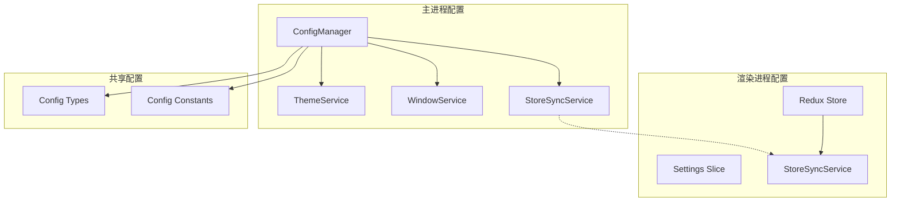
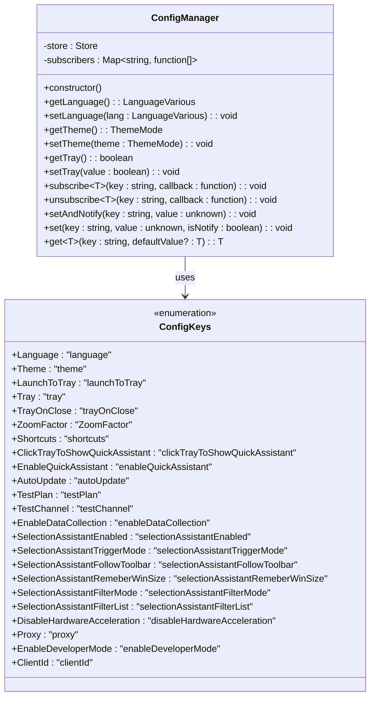
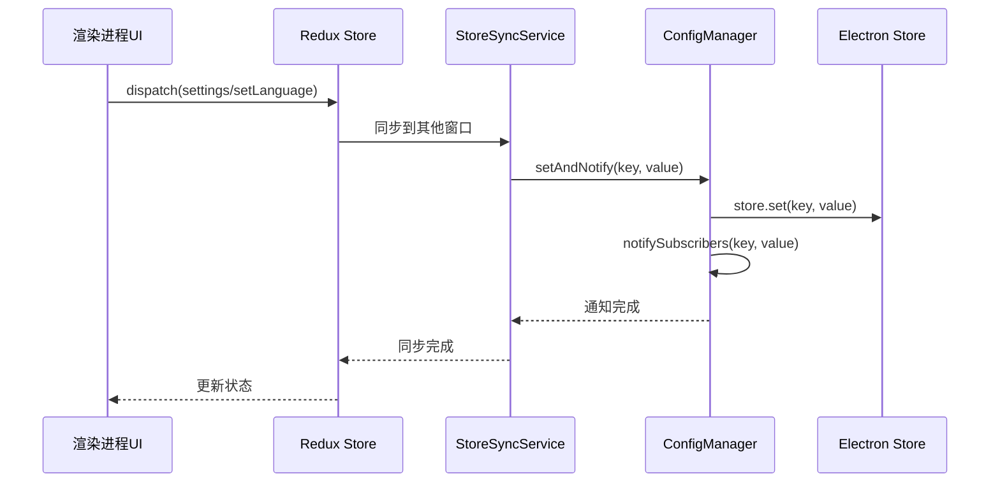
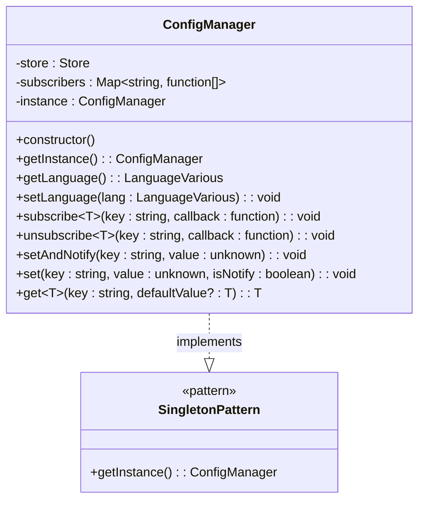
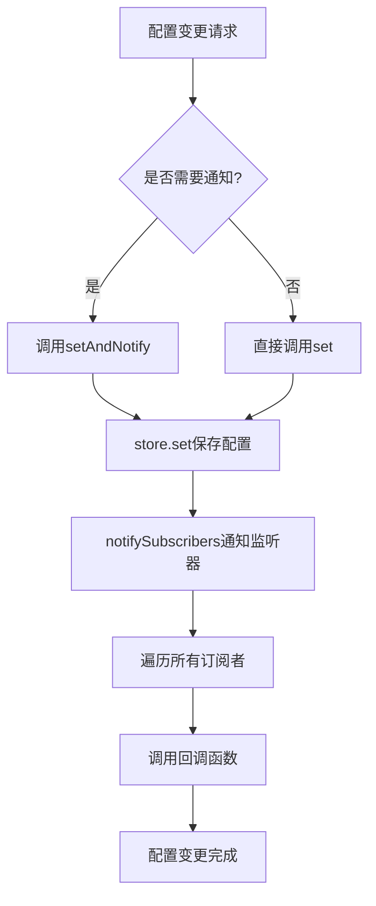
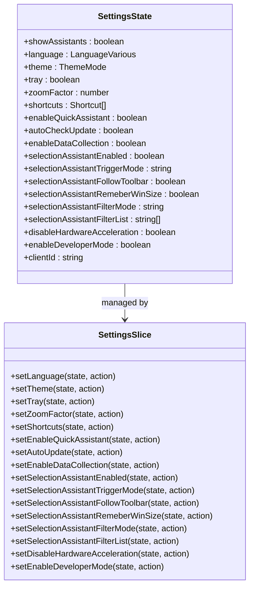
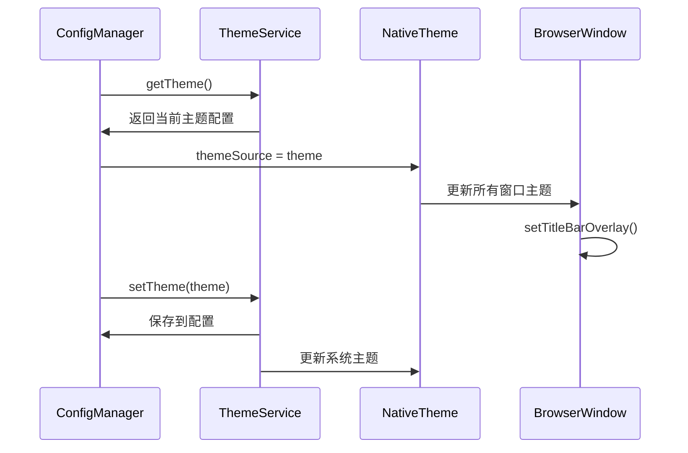
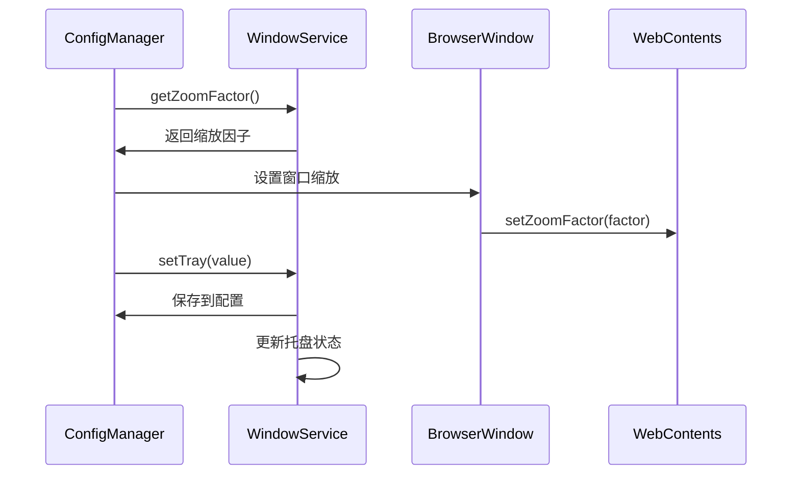
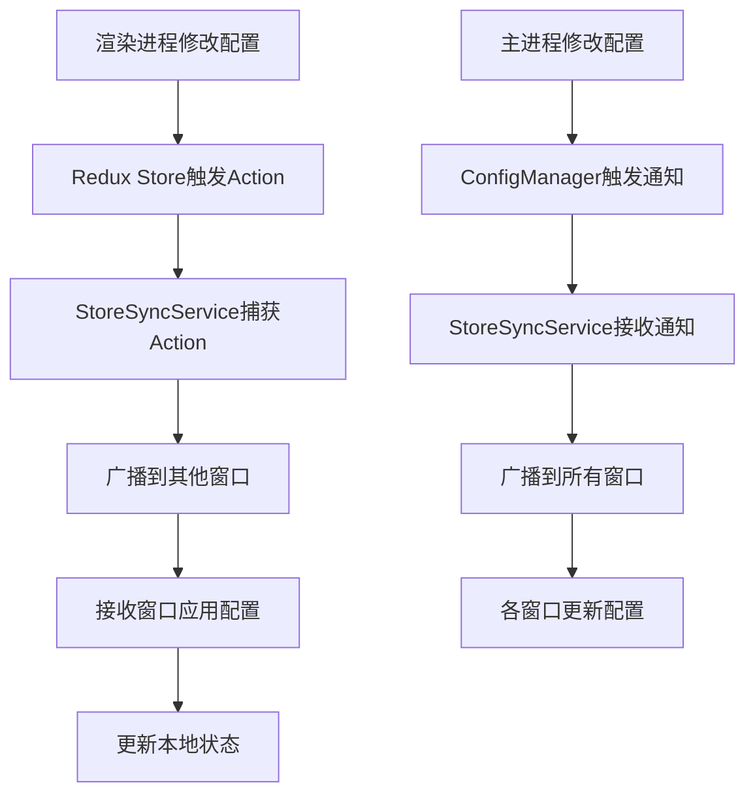
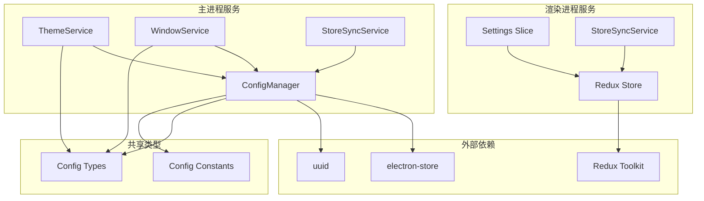

# Cherry Studio配置管理服务

<cite>
**本文档引用的文件**
- [ConfigManager.ts](file://src/main/services/ConfigManager.ts)
- [settings.ts](file://src/renderer/src/store/settings.ts)
- [config.ts](file://src/main/config.ts)
- [types.ts](file://packages/shared/config/types.ts)
- [constant.ts](file://packages/shared/config/constant.ts)
- [ThemeService.ts](file://src/main/services/ThemeService.ts)
- [WindowService.ts](file://src/main/services/WindowService.ts)
- [StoreSyncService.ts](file://src/main/services/StoreSyncService.ts)
- [ReduxService.ts](file://src/main/services/ReduxService.ts)
- [index.ts](file://src/renderer/src/store/index.ts)
</cite>

## 目录
1. [简介](#简介)
2. [项目结构](#项目结构)
3. [核心组件](#核心组件)
4. [架构概览](#架构概览)
5. [详细组件分析](#详细组件分析)
6. [依赖关系分析](#依赖关系分析)
7. [性能考虑](#性能考虑)
8. [故障排除指南](#故障排除指南)
9. [结论](#结论)

## 简介

Cherry Studio的配置管理服务是一个基于Electron Store的持久化存储系统，负责管理应用程序的所有用户配置和偏好设置。该服务采用单例模式设计，提供了统一的配置访问接口，支持配置变更通知机制，并与主题服务、窗口服务等多个核心模块紧密集成。

配置管理服务的主要功能包括：
- 基于Electron Store的持久化存储
- 类型安全的配置项管理
- 配置变更事件通知系统
- 跨进程配置同步
- 安全的数据存储策略

## 项目结构

配置管理系统在Cherry Studio中的组织结构如下：

**图表来源**
- [ConfigManager.ts](file://src/main/services/ConfigManager.ts#L36-L266)
- [ThemeService.ts](file://src/main/services/ThemeService.ts#L8-L48)
- [WindowService.ts](file://src/main/services/WindowService.ts#L1-L24)

**章节来源**
- [ConfigManager.ts](file://src/main/services/ConfigManager.ts#L1-L270)
- [settings.ts](file://src/renderer/src/store/settings.ts#L1-L800)

## 核心组件

### ConfigManager类

ConfigManager是配置管理的核心类，采用单例模式设计，提供统一的配置访问和管理接口。

#### 主要特性

1. **基于Electron Store的持久化存储**
   - 使用electron-store作为底层存储引擎
   - 自动处理配置文件的读写操作
   - 支持默认值机制

2. **类型安全的配置访问**
   - 泛型方法确保类型安全
   - 枚举类型的配置键管理
   - 编译时类型检查

3. **配置变更通知系统**
   - 订阅-发布模式的事件通知
   - 支持多个监听器同时订阅同一配置项
   - 自动化的变更传播机制

#### 配置键枚举

**图表来源**
- [ConfigManager.ts](file://src/main/services/ConfigManager.ts#L10-L34)
- [ConfigManager.ts](file://src/main/services/ConfigManager.ts#L36-L266)

**章节来源**
- [ConfigManager.ts](file://src/main/services/ConfigManager.ts#L36-L266)

## 架构概览

配置管理系统采用分层架构设计，实现了主进程和渲染进程之间的配置同步：

**图表来源**
- [StoreSyncService.ts](file://src/main/services/StoreSyncService.ts#L44-L88)
- [ConfigManager.ts](file://src/main/services/ConfigManager.ts#L235-L266)

## 详细组件分析

### 配置管理器实现

#### 单例模式设计

ConfigManager采用单例模式确保全局唯一性：

**图表来源**
- [ConfigManager.ts](file://src/main/services/ConfigManager.ts#L36-L266)

#### 配置类型定义

配置系统支持多种配置类型，包括基础类型、复杂对象和枚举类型：

| 配置类型 | 示例 | 默认值 | 描述 |
|---------|------|--------|------|
| 基础类型 | `boolean`, `number`, `string` | 用户指定 | 简单的布尔、数值或字符串配置 |
| 枚举类型 | `ThemeMode`, `UpgradeChannel` | 系统预设 | 预定义的选项集合 |
| 复杂对象 | `Shortcut[]`, `UserTheme` | 对象字面量 | 包含多个属性的复合配置 |
| 数组类型 | `string[]`, `number[]` | 空数组 | 存储列表或集合数据 |

#### 配置变更通知机制

配置变更通知系统实现了观察者模式：

**图表来源**
- [ConfigManager.ts](file://src/main/services/ConfigManager.ts#L93-L116)
- [ConfigManager.ts](file://src/main/services/ConfigManager.ts#L235-L266)

**章节来源**
- [ConfigManager.ts](file://src/main/services/ConfigManager.ts#L93-L116)
- [ConfigManager.ts](file://src/main/services/ConfigManager.ts#L235-L266)

### Redux Store集成

渲染进程使用Redux Store管理配置状态，通过StoreSyncService实现与主进程的同步：

#### Store结构设计

**图表来源**
- [settings.ts](file://src/renderer/src/store/settings.ts#L40-L222)
- [settings.ts](file://src/renderer/src/store/settings.ts#L420-L600)

**章节来源**
- [settings.ts](file://src/renderer/src/store/settings.ts#L40-L222)
- [settings.ts](file://src/renderer/src/store/settings.ts#L420-L600)

### 服务集成关系

配置管理服务与多个核心服务存在紧密的集成关系：

#### 主题服务集成

**图表来源**
- [ThemeService.ts](file://src/main/services/ThemeService.ts#L8-L48)
- [ConfigManager.ts](file://src/main/services/ConfigManager.ts#L54-L60)

#### 窗口服务集成

**图表来源**
- [WindowService.ts](file://src/main/services/WindowService.ts#L1-L24)
- [ConfigManager.ts](file://src/main/services/ConfigManager.ts#L86-L92)

**章节来源**
- [ThemeService.ts](file://src/main/services/ThemeService.ts#L8-L48)
- [WindowService.ts](file://src/main/services/WindowService.ts#L1-L24)

### 跨进程配置同步

StoreSyncService负责主进程和渲染进程之间的配置同步：

#### 同步机制

**图表来源**
- [StoreSyncService.ts](file://src/main/services/StoreSyncService.ts#L44-L88)
- [StoreSyncService.ts](file://src/main/services/StoreSyncService.ts#L99-L137)

**章节来源**
- [StoreSyncService.ts](file://src/main/services/StoreSyncService.ts#L44-L88)
- [StoreSyncService.ts](file://src/main/services/StoreSyncService.ts#L99-L137)

## 依赖关系分析

配置管理系统的依赖关系图展示了各个组件之间的相互依赖：

**图表来源**
- [ConfigManager.ts](file://src/main/services/ConfigManager.ts#L1-L10)
- [settings.ts](file://src/renderer/src/store/settings.ts#L1-L20)

**章节来源**
- [ConfigManager.ts](file://src/main/services/ConfigManager.ts#L1-L10)
- [settings.ts](file://src/renderer/src/store/settings.ts#L1-L20)

## 性能考虑

### 存储优化

1. **延迟加载**: 配置项按需加载，避免一次性加载所有配置
2. **批量更新**: 支持批量配置更新以减少存储操作次数
3. **内存缓存**: 在内存中缓存频繁访问的配置项

### 通知优化

1. **防抖机制**: 避免频繁的配置变更导致过多的通知
2. **选择性通知**: 只通知相关的监听器，减少不必要的计算
3. **异步处理**: 配置变更通知采用异步方式处理

### 跨进程通信优化

1. **增量同步**: 只同步发生变化的配置项
2. **压缩传输**: 对大型配置对象进行压缩传输
3. **连接池**: 维护稳定的IPC连接以减少建立连接的开销

## 故障排除指南

### 常见问题及解决方案

#### 配置丢失问题

**症状**: 应用程序启动时配置重置为默认值

**原因分析**:
- Electron Store存储文件损坏
- 权限问题导致无法写入配置文件
- 应用程序路径变化导致配置文件位置改变

**解决方案**:
1. 检查配置文件是否存在：`app.getPath('userData')/config.json`
2. 验证文件权限是否正确
3. 尝试删除配置文件让应用重新生成

#### 配置同步失败

**症状**: 主进程和渲染进程的配置不一致

**原因分析**:
- StoreSyncService未正确初始化
- IPC通信中断
- 网络防火墙阻止通信

**解决方案**:
1. 检查StoreSyncService的状态
2. 验证IPC通道是否正常工作
3. 检查网络连接和防火墙设置

#### 性能问题

**症状**: 配置操作响应缓慢

**原因分析**:
- 配置项数量过多
- 频繁的配置变更
- 内存泄漏导致性能下降

**解决方案**:
1. 优化配置项结构，减少嵌套层级
2. 实现配置变更的防抖机制
3. 定期清理不再使用的配置监听器

**章节来源**
- [ConfigManager.ts](file://src/main/services/ConfigManager.ts#L247-L257)
- [StoreSyncService.ts](file://src/main/services/StoreSyncService.ts#L44-L88)

## 结论

Cherry Studio的配置管理服务是一个设计精良的系统，它成功地解决了跨平台桌面应用的配置管理需求。通过采用单例模式、观察者模式和分层架构，该系统实现了以下关键目标：

1. **统一的配置访问接口**: 提供了一致的编程模型，简化了配置管理的复杂性
2. **类型安全**: 通过TypeScript的类型系统确保配置操作的正确性
3. **实时同步**: 实现了主进程和渲染进程之间的配置实时同步
4. **扩展性**: 易于添加新的配置项和配置类型
5. **可靠性**: 提供了完善的错误处理和恢复机制

该配置管理系统为Cherry Studio提供了坚实的基础，支持了应用程序的各种功能需求，包括主题切换、窗口管理、快捷键配置等。未来的发展方向可以考虑引入配置版本控制、导入导出功能以及云端同步等高级特性。