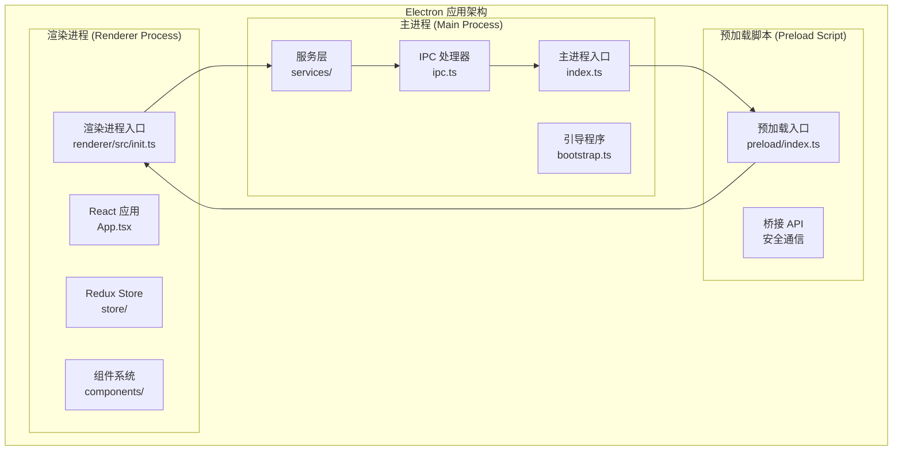
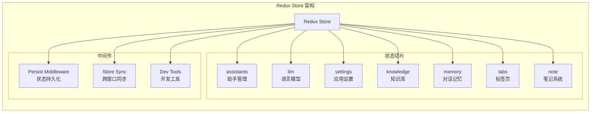
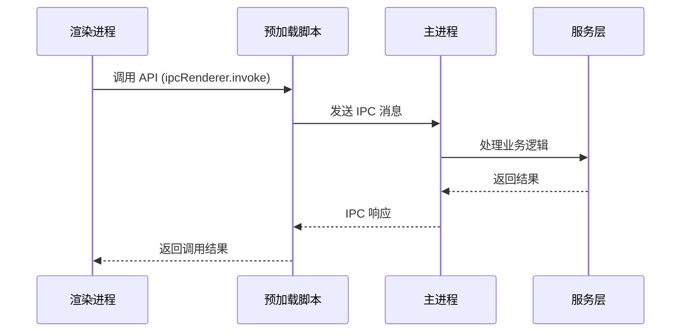
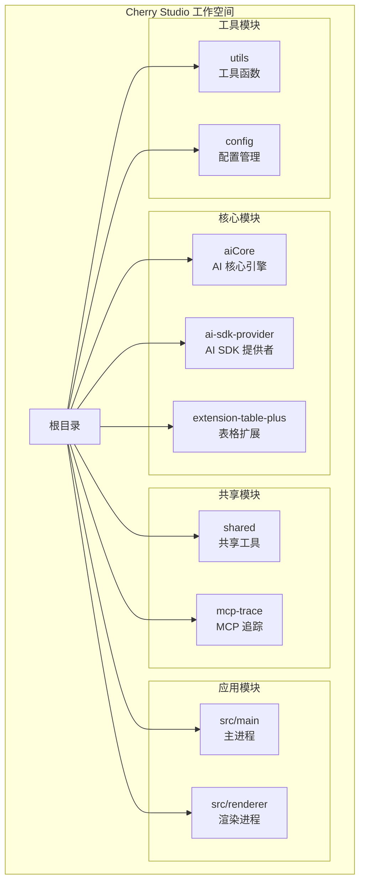
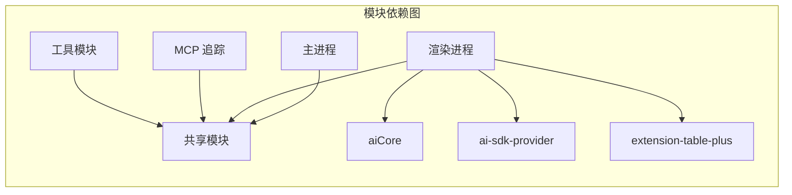
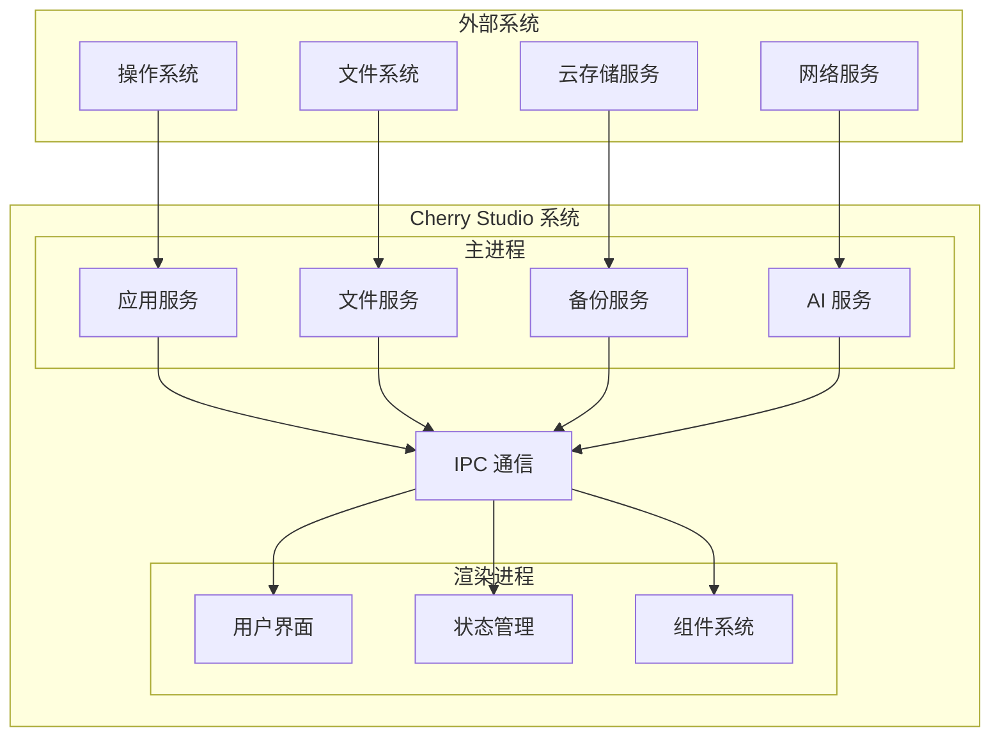
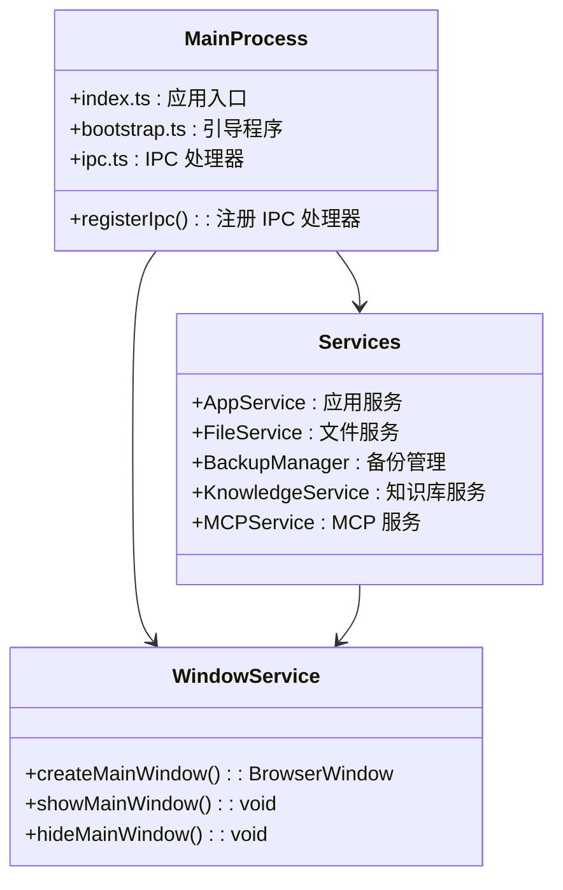
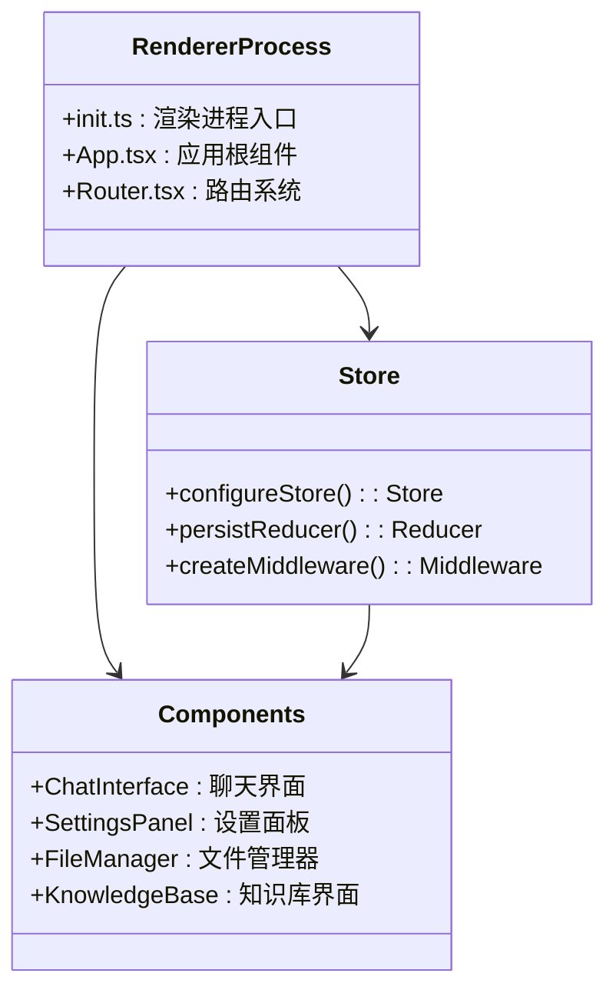
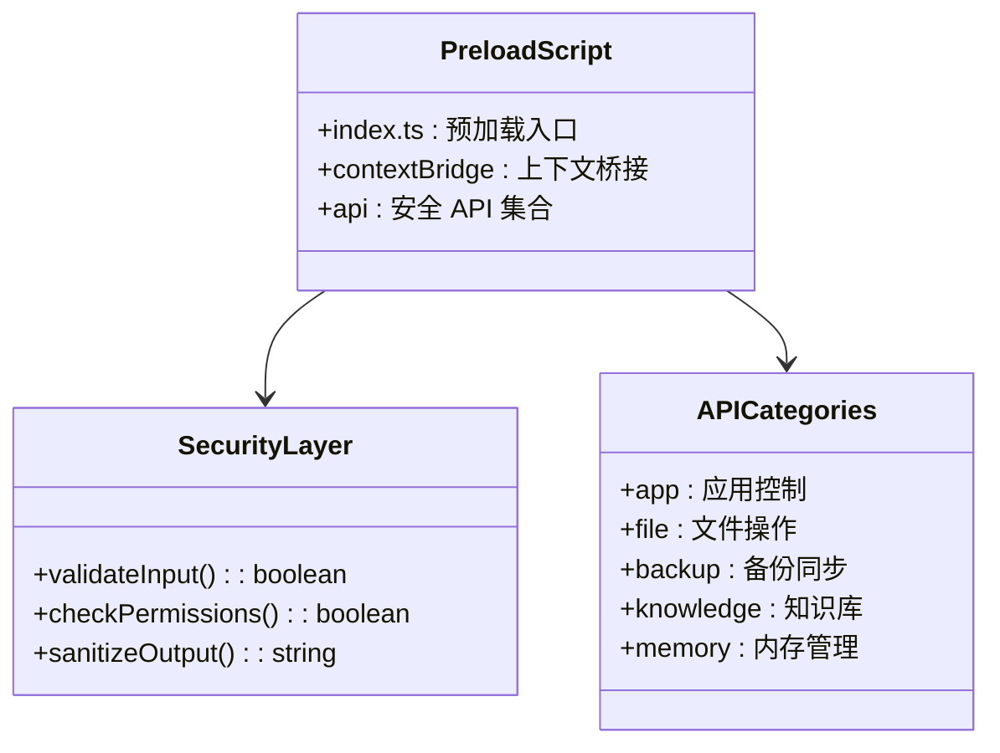

# Cherry Studio 架构设计

<cite>
**本文档引用的文件**
- [package.json](file://package.json)
- [electron.vite.config.ts](file://electron.vite.config.ts)
- [src/main/index.ts](file://src/main/index.ts)
- [src/preload/index.ts](file://src/preload/index.ts)
- [src/renderer/src/init.ts](file://src/renderer/src/init.ts)
- [src/main/ipc.ts](file://src/main/ipc.ts)
- [src/renderer/src/store/index.ts](file://src/renderer/src/store/index.ts)
- [packages/aiCore/src/index.ts](file://packages/aiCore/src/index.ts)
- [packages/ai-sdk-provider/src/index.ts](file://packages/ai-sdk-provider/src/index.ts)
- [packages/extension-table-plus/src/index.ts](file://packages/extension-table-plus/src/index.ts)
- [packages/shared/IpcChannel.ts](file://packages/shared/IpcChannel.ts)
- [packages/shared/config/constant.ts](file://packages/shared/config/constant.ts)
- [src/main/bootstrap.ts](file://src/main/bootstrap.ts)
</cite>

## 目录
1. [项目概述](#项目概述)
2. [整体架构](#整体架构)
3. [进程架构](#进程架构)
4. [状态管理系统](#状态管理系统)
5. [IPC通信机制](#ipc通信机制)
6. [模块化设计](#模块化设计)
7. [核心组件分析](#核心组件分析)
8. [系统上下文图](#系统上下文图)
9. [组件分解图](#组件分解图)
10. [总结](#总结)

## 项目概述

Cherry Studio 是一个基于 Electron 框架构建的 AI 助手桌面应用，采用现代化的前端技术栈和模块化架构设计。项目使用 TypeScript 开发，结合 React、Redux 和 Vite 构建高性能的桌面应用程序。

### 技术栈特点
- **主进程**: 使用 TypeScript 和 Node.js 进行系统级操作
- **渲染进程**: 基于 React 19 和 TypeScript 的现代前端框架
- **预加载脚本**: 安全的进程间通信桥梁
- **状态管理**: Redux Toolkit + Redux Persist 实现全局状态管理
- **构建工具**: Vite 提供快速的开发体验和高效的生产构建

## 整体架构

Cherry Studio 采用典型的 Electron 应用架构，包含三个主要进程：主进程、渲染进程和预加载脚本。这种架构确保了应用的安全性、性能和可维护性。

**图表来源**
- [src/main/index.ts](file://src/main/index.ts#L1-L257)
- [src/preload/index.ts](file://src/preload/index.ts#L1-L594)
- [src/renderer/src/init.ts](file://src/renderer/src/init.ts#L1-L42)

## 进程架构

### 主进程 (Main Process)

主进程是 Electron 应用的核心，负责系统级操作和应用生命周期管理。

#### 核心职责
- **应用生命周期管理**: 初始化、启动、关闭和更新
- **窗口管理**: 创建和管理主窗口和其他辅助窗口
- **系统集成**: 文件系统访问、网络请求、系统通知
- **安全控制**: 权限管理和沙箱隔离

#### 关键特性
- **单实例锁定**: 确保只有一个应用实例运行
- **硬件加速控制**: 可选的硬件加速禁用
- **崩溃报告**: 自动化的崩溃检测和报告
- **协议处理**: 自定义协议注册和处理

**章节来源**
- [src/main/index.ts](file://src/main/index.ts#L1-L257)
- [src/main/bootstrap.ts](file://src/main/bootstrap.ts#L1-L34)

### 渲染进程 (Renderer Process)

渲染进程承载用户界面和业务逻辑，提供丰富的交互体验。

#### 架构特点
- **React 19**: 利用最新 React 特性提升性能
- **TypeScript**: 强类型支持确保代码质量
- **模块化组件**: 可复用的 UI 组件系统
- **状态持久化**: Redux Persist 实现状态持久化

#### 核心功能
- **用户界面**: 聊天界面、设置面板、文件管理
- **AI 交互**: 与 AI 服务的集成和对话管理
- **文件操作**: 文档编辑、文件上传下载
- **主题系统**: 支持深色/浅色主题切换

**章节来源**
- [src/renderer/src/init.ts](file://src/renderer/src/init.ts#L1-L42)

### 预加载脚本 (Preload Script)

预加载脚本作为主进程和渲染进程之间的安全桥梁，提供受限的 API 访问。

#### 安全机制
- **上下文隔离**: 禁用 Node.js 集成防止恶意代码执行
- **API 暴露**: 通过 contextBridge 安全地暴露必要 API
- **权限控制**: 严格的权限验证和访问控制

#### 核心 API 类别
- **应用控制**: 重启、退出、代理设置
- **文件系统**: 文件读写、目录操作
- **备份同步**: 多种云存储服务集成
- **知识库**: AI 知识库管理
- **内存管理**: 对话记忆和上下文存储

**章节来源**
- [src/preload/index.ts](file://src/preload/index.ts#L1-L594)

## 状态管理系统

Cherry Studio 使用 Redux Toolkit 作为状态管理解决方案，结合 Redux Persist 实现状态持久化。

### Redux 架构设计

**图表来源**
- [src/renderer/src/store/index.ts](file://src/renderer/src/store/index.ts#L38-L64)

### 状态切片设计

#### 主要状态切片
- **assistants**: 助手配置和管理
- **llm**: 语言模型参数和配置
- **settings**: 应用全局设置
- **knowledge**: 知识库内容和索引
- **memory**: 对话记忆和上下文
- **tabs**: 标签页状态管理
- **note**: 笔记系统状态

#### 持久化策略
- **黑名单**: runtime、messages、messageBlocks 等临时状态不持久化
- **版本控制**: 支持状态迁移和版本兼容性
- **选择性同步**: 重要状态跨窗口同步

**章节来源**
- [src/renderer/src/store/index.ts](file://src/renderer/src/store/index.ts#L66-L76)

## IPC通信机制

Cherry Studio 使用 Electron 的 IPC（进程间通信）机制实现主进程和渲染进程之间的安全通信。

### IPC 通道设计

**图表来源**
- [src/preload/index.ts](file://src/preload/index.ts#L61-L67)
- [src/main/ipc.ts](file://src/main/ipc.ts#L115-L117)

### IPC 通道分类

#### 应用控制通道
- `app:info`: 获取应用信息
- `app:quit`: 退出应用
- `app:reload`: 重新加载应用
- `app:proxy`: 设置代理

#### 文件操作通道
- `file:open`: 打开文件
- `file:save`: 保存文件
- `file:delete`: 删除文件
- `file:upload`: 上传文件

#### 知识库通道
- `knowledge-base:create`: 创建知识库
- `knowledge-base:search`: 搜索知识库
- `knowledge-base:add`: 添加知识项

#### 备份同步通道
- `backup:backup`: 备份数据
- `backup:restore`: 恢复数据
- `backup:listWebdavFiles`: 列出 WebDAV 文件

**章节来源**
- [packages/shared/IpcChannel.ts](file://packages/shared/IpcChannel.ts#L1-L379)

### 安全通信机制

#### 数据验证
- **输入验证**: 所有 IPC 调用都进行严格的数据验证
- **权限检查**: 确保只有授权的操作才能执行
- **错误处理**: 统一的错误处理和用户友好的错误消息

#### 性能优化
- **异步处理**: 所有 IPC 调用都是异步的
- **批量操作**: 支持批量文件操作和状态更新
- **缓存机制**: 智能缓存减少重复计算

**章节来源**
- [src/main/ipc.ts](file://src/main/ipc.ts#L104-L107)

## 模块化设计

Cherry Studio 采用工作空间（Workspace）模式进行模块化管理，将不同功能划分为独立的模块包。

### 工作空间结构

**图表来源**
- [package.json](file://package.json#L12-L26)
- [electron.vite.config.ts](file://electron.vite.config.ts#L18-L129)

### 核心模块详解

#### aiCore 模块
- **功能**: AI 核心引擎，提供统一的 AI 服务接口
- **特性**: 
  - 基于 Vercel AI SDK 的统一 Provider 接口
  - 支持多种 AI 服务提供商
  - 插件系统和中间件架构
- **导出接口**:
  - `generateText`: 文本生成
  - `streamText`: 流式文本生成
  - `generateObject`: 对象生成
  - `generateImage`: 图像生成

**章节来源**
- [packages/aiCore/src/index.ts](file://packages/aiCore/src/index.ts#L1-L47)

#### ai-sdk-provider 模块
- **功能**: AI SDK 提供者封装
- **特性**:
  - CherryIn 提供商集成
  - 统一的 API 接口
  - 错误处理和重试机制

**章节来源**
- [packages/ai-sdk-provider/src/index.ts](file://packages/ai-sdk-provider/src/index.ts#L1-L2)

#### extension-table-plus 模块
- **功能**: 表格扩展组件
- **特性**:
  - 高度可定制的表格组件
  - 支持单元格、行、列操作
  - 数据可视化和交互功能

**章节来源**
- [packages/extension-table-plus/src/index.ts](file://packages/extension-table-plus/src/index.ts#L1-L7)

### 模块间依赖关系

**图表来源**
- [electron.vite.config.ts](file://electron.vite.config.ts#L22-L61)

## 核心组件分析

### AI 核心引擎

AI 核心引擎是 Cherry Studio 的核心组件，提供统一的 AI 服务接口。

#### 架构设计
- **Provider 抽象层**: 支持多种 AI 服务提供商
- **插件系统**: 可扩展的功能插件
- **中间件管道**: 请求处理管道
- **流式处理**: 支持流式 AI 响应

#### 核心功能
- **文本生成**: 基础的文本生成能力
- **流式响应**: 实时的流式文本输出
- **对象生成**: 结构化数据生成
- **图像生成**: AI 图像生成功能

### 知识库系统

知识库系统为 AI 助手提供结构化的知识存储和检索能力。

#### 核心特性
- **向量搜索**: 基于向量相似度的知识检索
- **多模态支持**: 文本、图像等多种内容类型
- **智能排序**: 重排序算法提升搜索质量
- **配额管理**: 使用量限制和计费

### 备份同步系统

多云备份同步系统确保用户数据的安全性和可访问性。

#### 支持的服务
- **WebDAV**: 通用云存储协议
- **S3**: Amazon S3 兼容存储
- **本地备份**: 本地磁盘备份
- **Nutstore**: 国内云存储服务

## 系统上下文图

**图表来源**
- [src/main/index.ts](file://src/main/index.ts#L1-L257)
- [src/renderer/src/init.ts](file://src/renderer/src/init.ts#L1-L42)

## 组件分解图

### 主进程组件分解

**图表来源**
- [src/main/index.ts](file://src/main/index.ts#L17-L18)
- [src/main/ipc.ts](file://src/main/ipc.ts#L115-L117)

### 渲染进程组件分解

**图表来源**
- [src/renderer/src/init.ts](file://src/renderer/src/init.ts#L1-L42)
- [src/renderer/src/store/index.ts](file://src/renderer/src/store/index.ts#L92-L136)

### 预加载脚本组件分解

**图表来源**
- [src/preload/index.ts](file://src/preload/index.ts#L61-L594)

## 总结

Cherry Studio 的架构设计体现了现代 Electron 应用的最佳实践，具有以下核心优势：

### 架构优势
1. **清晰的职责分离**: 主进程、渲染进程和预加载脚本各司其职，确保应用的安全性和稳定性
2. **模块化设计**: 采用工作空间模式，便于功能扩展和维护
3. **强大的状态管理**: Redux Toolkit 提供了高效的状态管理解决方案
4. **安全的 IPC 通信**: 通过预加载脚本实现安全的进程间通信
5. **可扩展的 AI 集成**: 基于 Provider 模式的 AI 服务抽象层

### 技术特色
- **现代化技术栈**: React 19、TypeScript、Vite 等前沿技术
- **高性能构建**: Vite 提供快速的开发体验和高效的生产构建
- **跨平台兼容**: 支持 Windows、macOS 和 Linux 平台
- **云端同步**: 多种云存储服务集成，确保数据安全

### 发展方向
- **AI 功能增强**: 持续优化 AI 服务集成和用户体验
- **性能优化**: 进一步提升应用性能和响应速度
- **功能扩展**: 基于模块化架构添加更多功能模块
- **生态建设**: 完善开发者工具和第三方集成支持

Cherry Studio 的架构设计为构建高质量的 AI 桌面应用提供了坚实的基础，其模块化和可扩展的设计理念为未来的功能扩展和技术演进奠定了良好的基础。