# AI Core 模块

<cite>
**本文档引用的文件**   
- [index.ts](file://packages/aiCore/src/index.ts)
- [types.ts](file://packages/aiCore/src/types.ts)
- [package.json](file://packages/aiCore/package.json)
- [README.md](file://packages/aiCore/README.md)
- [AI_SDK_ARCHITECTURE.md](file://packages/aiCore/AI_SDK_ARCHITECTURE.md)
- [runtime/index.ts](file://packages/aiCore/src/core/runtime/index.ts)
- [plugins/index.ts](file://packages/aiCore/src/core/plugins/index.ts)
- [providers/index.ts](file://packages/aiCore/src/core/providers/index.ts)
- [models/index.ts](file://packages/aiCore/src/core/models/index.ts)
- [plugins/types.ts](file://packages/aiCore/src/core/plugins/types.ts)
- [schemas.ts](file://packages/aiCore/src/core/providers/schemas.ts)
- [options/index.ts](file://packages/aiCore/src/core/options/index.ts)
- [plugins/manager.ts](file://packages/aiCore/src/core/plugins/manager.ts)
- [executor.ts](file://packages/aiCore/src/core/runtime/executor.ts)
- [plugins/README.md](file://packages/aiCore/src/core/plugins/README.md)
</cite>

## 目录
1. [简介](#简介)
2. [架构设计](#架构设计)
3. [核心组件](#核心组件)
4. [多Provider支持机制](#多provider支持机制)
5. [插件系统](#插件系统)
6. [使用模式](#使用模式)
7. [与AI SDK原生Provider Registry的兼容性](#与ai-sdk原生provider-registry的兼容性)

## 简介

AI Core 模块是基于 Vercel AI SDK 的统一 AI Provider 接口包，为 AI 应用提供强大的抽象层和插件化架构。该模块通过简化分层架构（模型层→运行时层）的设计理念，实现了函数式优先、类型安全和最小包装的设计原则。通过直接复用 AI SDK 的类型系统，确保了高性能和类型安全。

该模块支持多种 AI Provider，包括 OpenAI、Anthropic、Google 等内置 Provider，并通过注册 API 支持扩展自定义 Provider。插件系统提供了 First、Sequential、Parallel 三种钩子类型，可在请求生命周期中应用不同的扩展功能。

**Section sources**
- [README.md](file://packages/aiCore/README.md#L1-L434)
- [AI_SDK_ARCHITECTURE.md](file://packages/aiCore/AI_SDK_ARCHITECTURE.md#L1-L515)

## 架构设计

AI Core 模块采用简化的两层架构设计：模型层（models）和运行时层（runtime）。这种设计实现了清晰的职责分离，模型层专注于模型创建和配置管理，而运行时层专注于执行和用户面向的 API 接口。

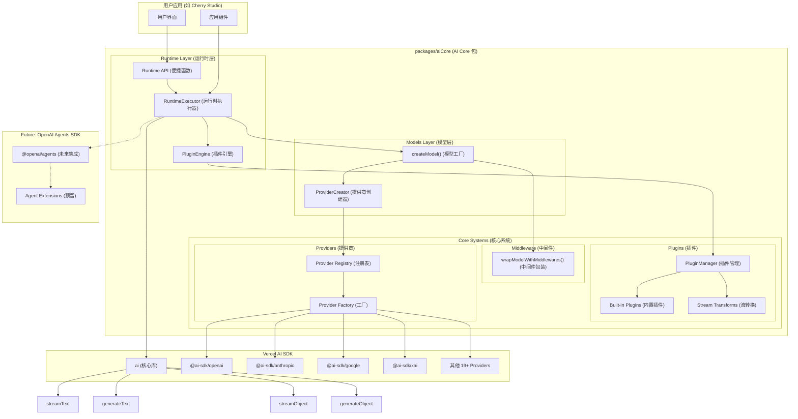

**Diagram sources **
- [AI_SDK_ARCHITECTURE.md](file://packages/aiCore/AI_SDK_ARCHITECTURE.md#L29-L108)

**Section sources**
- [AI_SDK_ARCHITECTURE.md](file://packages/aiCore/AI_SDK_ARCHITECTURE.md#L1-L515)

## 核心组件

AI Core 模块的核心组件包括模型层、运行时层、插件系统、中间件系统和提供商系统。这些组件共同构成了模块的基础架构。

### 模型层

模型层负责统一的模型创建和配置管理。它提供了函数式设计的模型工厂函数，避免了不必要的类抽象。模型层支持统一的模型配置接口和自动处理中间件应用。

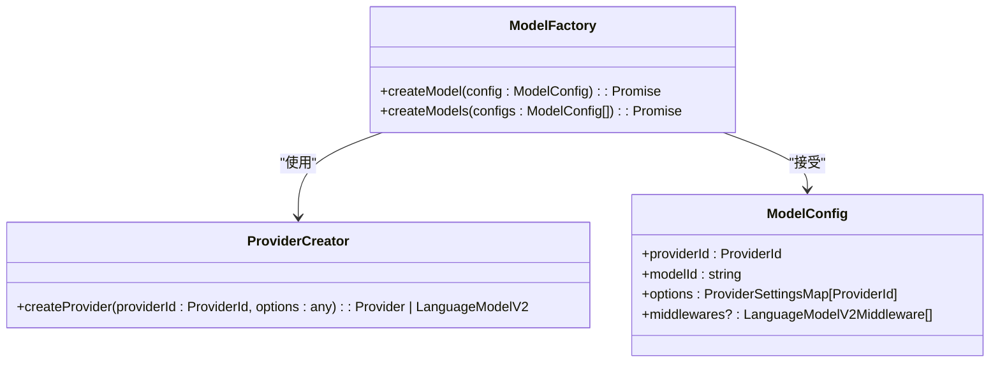

**Diagram sources **
- [AI_SDK_ARCHITECTURE.md](file://packages/aiCore/AI_SDK_ARCHITECTURE.md#L174-L200)
- [models/index.ts](file://packages/aiCore/src/core/models/index.ts#L1-L10)

### 运行时层

运行时层专注于运行时插件化 AI 调用处理。它提供了三种使用方式：类实例、静态工厂和函数式调用，满足不同场景的需求。

```mermaid
classDiagram
class RuntimeExecutor {
-config : RuntimeConfig
+pluginEngine : PluginEngine
+streamText(params : streamTextParams, options? : { middlewares? : LanguageModelV2Middleware[] }) : Promise<StreamTextResult>
+generateText(params : generateTextParams, options? : { middlewares? : LanguageModelV2Middleware[] }) : Promise<GenerateTextResult>
+streamObject(params : streamObjectParams, options? : { middlewares? : LanguageModelV2Middleware[] }) : Promise<StreamObjectResult>
+generateObject(params : generateObjectParams, options? : { middlewares? : LanguageModelV2Middleware[] }) : Promise<GenerateObjectResult>
+generateImage(params : generateImageParams) : Promise<GenerateImageResult>
+static create<T extends ProviderId>(providerId : T, options : ProviderSettingsMap[T], plugins? : AiPlugin[]) : RuntimeExecutor<T>
+static createOpenAICompatible(options : ProviderSettingsMap['openai-compatible'], plugins : AiPlugin[]) : RuntimeExecutor<'openai-compatible'>
}
class PluginEngine {
+executeWithPlugins<T, R>(methodName : string, params : T, executor : (resolvedModel : LanguageModel, transformedParams : T) => Promise<R>) : Promise<R>
+executeStreamWithPlugins<T, R>(methodName : string, params : T, executor : (resolvedModel : LanguageModel, transformedParams : T, streamTransforms : TransformStream[]) => Promise<R>) : Promise<R>
+executeImageWithPlugins<T, R>(methodName : string, params : T, executor : (resolvedModel : ImageModelV2, transformedParams : T) => Promise<R>) : Promise<R>
}
RuntimeExecutor --> PluginEngine : "包含"
```

**Diagram sources **
- [AI_SDK_ARCHITECTURE.md](file://packages/aiCore/AI_SDK_ARCHITECTURE.md#L208-L234)
- [runtime/index.ts](file://packages/aiCore/src/core/runtime/index.ts#L1-L118)
- [executor.ts](file://packages/aiCore/src/core/runtime/executor.ts#L1-L311)

### 插件系统

插件系统提供了可扩展的插件架构，支持请求全生命周期的扩展。它借鉴了 Rollup 的钩子分类设计，支持流转换（experimental_transform）和内置常用插件（日志、计数等）。

```mermaid
classDiagram
class AiPlugin {
+name : string
+enforce? : 'pre' | 'post'
+resolveModel?(modelId : string, context : AiRequestContext) : Promise<LanguageModel | ImageModelV2 | null> | LanguageModel | ImageModelV2 | null
+loadTemplate?(templateName : string, context : AiRequestContext) : any | null | Promise<any | null>
+configureContext?(context : AiRequestContext) : void | Promise<void>
+transformParams?<T>(params : T, context : AiRequestContext) : T | Promise<T>
+transformResult?<T>(result : T, context : AiRequestContext) : T | Promise<T>
+onRequestStart?(context : AiRequestContext) : void | Promise<void>
+onRequestEnd?(context : AiRequestContext, result : any) : void | Promise<void>
+onError?(error : Error, context : AiRequestContext) : void | Promise<void>
+transformStream?(params : any, context : AiRequestContext) : <TOOLS extends ToolSet>(options? : { tools : TOOLS, stopStream : () => void }) => TransformStream<TextStreamPart<TOOLS>, TextStreamPart<TOOLS>>
}
class AiRequestContext {
+providerId : ProviderId
+model : LanguageModel | ImageModelV2
+originalParams : any
+metadata : Record<string, any>
+startTime : number
+requestId : string
+recursiveCall : RecursiveCallFn
+isRecursiveCall? : boolean
+mcpTools? : ToolSet
}
class PluginManager {
-plugins : AiPlugin[]
+use(plugin : AiPlugin) : this
+remove(pluginName : string) : this
+executeFirst<T>(hookName : 'resolveModel' | 'loadTemplate', arg : any, context : AiRequestContext) : Promise<T | null>
+executeSequential<T>(hookName : 'transformParams' | 'transformResult', initialValue : T, context : AiRequestContext) : Promise<T>
+executeConfigureContext(context : AiRequestContext) : Promise<void>
+executeParallel(hookName : 'onRequestStart' | 'onRequestEnd' | 'onError', context : AiRequestContext, result? : any, error? : Error) : Promise<void>
+collectStreamTransforms(params : any, context : AiRequestContext) : Array<<TOOLS extends ToolSet>(options? : { tools : TOOLS, stopStream : () => void }) => TransformStream<TextStreamPart<TOOLS>, TextStreamPart<TOOLS>>>
+getPlugins() : AiPlugin[]
+getStats() : PluginStats
}
PluginManager --> AiPlugin : "管理"
PluginManager --> AiRequestContext : "使用"
```

**Diagram sources **
- [AI_SDK_ARCHITECTURE.md](file://packages/aiCore/AI_SDK_ARCHITECTURE.md#L266-L285)
- [plugins/types.ts](file://packages/aiCore/src/core/plugins/types.ts#L1-L80)
- [plugins/manager.ts](file://packages/aiCore/src/core/plugins/manager.ts#L1-L185)

### 中间件系统

中间件系统直接使用 AI SDK 的 wrapLanguageModel 功能，与插件系统分离，职责明确。它采用函数式设计，简化了使用方式。

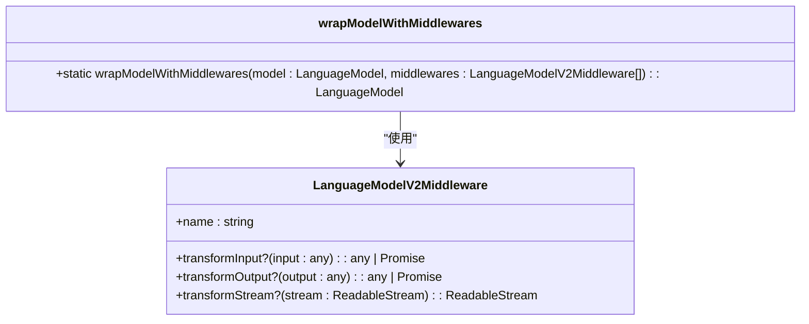

**Diagram sources **
- [AI_SDK_ARCHITECTURE.md](file://packages/aiCore/AI_SDK_ARCHITECTURE.md#L303-L304)

### 提供商系统

提供商系统负责 AI Provider 注册表和动态导入。它支持 19+ AI SDK 官方支持的 providers，包括 OpenAI、Anthropic、Google、XAI、Azure OpenAI、Amazon Bedrock、Google Vertex、Groq、Together.ai、Fireworks、DeepSeek 等。

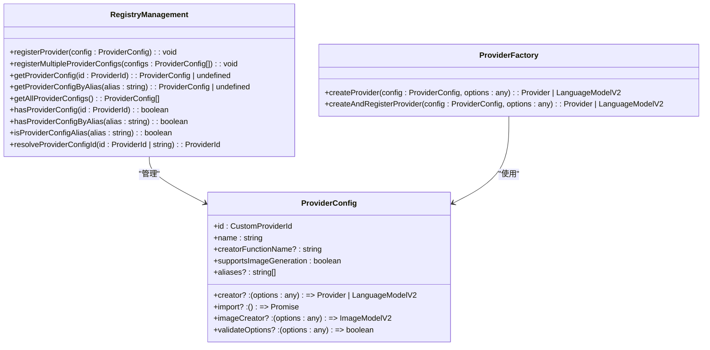

**Diagram sources **
- [AI_SDK_ARCHITECTURE.md](file://packages/aiCore/AI_SDK_ARCHITECTURE.md#L312-L320)
- [providers/index.ts](file://packages/aiCore/src/core/providers/index.ts#L1-L84)
- [schemas.ts](file://packages/aiCore/src/core/providers/schemas.ts#L1-L219)

## 多Provider支持机制

AI Core 模块支持多种 AI Provider，包括内置 Provider 和通过注册 API 扩展的自定义 Provider。

### 内置Provider

模块内置支持以下 Provider：

- OpenAI
- Anthropic
- Google Generative AI
- OpenAI-Compatible
- xAI (Grok)
- Azure OpenAI
- DeepSeek

这些 Provider 作为基础数据源，避免了重复维护。

```mermaid
graph TD
A[AI Core 模块] --> B[OpenAI]
A --> C[Anthropic]
A --> D[Google Generative AI]
A --> E[OpenAI-Compatible]
A --> F[xAI (Grok)]
A --> G[Azure OpenAI]
A --> H[DeepSeek]
```

**Diagram sources **
- [README.md](file://packages/aiCore/README.md#L57-L63)
- [schemas.ts](file://packages/aiCore/src/core/providers/schemas.ts#L23-L35)

### 自定义Provider扩展

对于非内置的 providers，可以通过注册 API 扩展支持。支持两种注册方式：直接导入和动态导入。

#### 直接导入方式

```typescript
import { registerProvider, AiCore } from '@cherrystudio/ai-core'

// 导入并注册第三方 provider
import { createGroq } from '@ai-sdk/groq'

registerProvider({
  id: 'groq',
  name: 'Groq',
  creator: createGroq,
  supportsImageGeneration: false
})

// 现在可以使用 Groq
const groqExecutor = AiCore.create('groq', { apiKey: 'groq-key' })
```

#### 动态导入方式

```typescript
import { registerProvider, AiCore } from '@cherrystudio/ai-core'

// 动态导入方式注册
registerProvider({
  id: 'mistral',
  name: 'Mistral AI',
  import: () => import('@ai-sdk/mistral'),
  creatorFunctionName: 'createMistral'
})

const mistralExecutor = AiCore.create('mistral', { apiKey: 'mistral-key' })
```

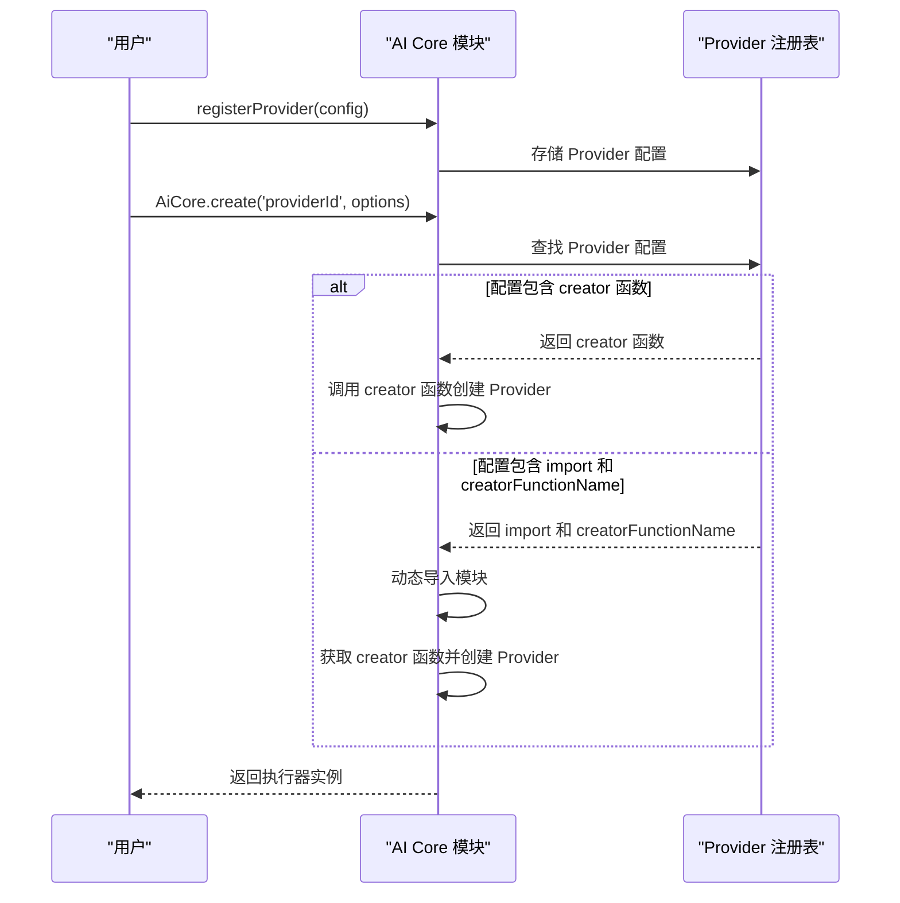

**Diagram sources **
- [README.md](file://packages/aiCore/README.md#L156-L179)
- [providers/index.ts](file://packages/aiCore/src/core/providers/index.ts#L38-L42)

**Section sources**
- [README.md](file://packages/aiCore/README.md#L151-L180)
- [providers/index.ts](file://packages/aiCore/src/core/providers/index.ts#L1-L84)
- [schemas.ts](file://packages/aiCore/src/core/providers/schemas.ts#L1-L219)

## 插件系统

AI Core 模块提供了强大的插件系统，支持请求全生命周期的扩展。插件系统支持四种钩子类型：First、Sequential、Parallel 和 Stream。

### 钩子类型

#### First 钩子 - 首个有效结果

First 钩子只执行第一个返回值的插件，用于解析和查找操作。当某个插件返回非 null/undefined 值时，执行立即停止，返回该值。

```typescript
// 只执行第一个返回值的插件，用于解析和查找
resolveModel?: (modelId: string, context: AiRequestContext) => string | null
loadTemplate?: (templateName: string, context: AiRequestContext) => any | null
```

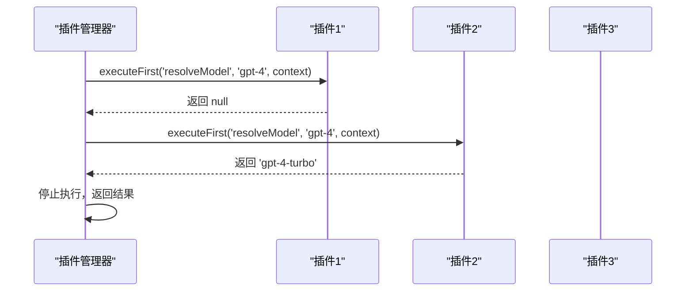

#### Sequential 钩子 - 链式数据转换

Sequential 钩子按顺序链式执行，每个插件可以修改数据。前一个插件的输出作为后一个插件的输入，形成数据转换链。

```typescript
// 按顺序链式执行，每个插件可以修改数据
transformParams?: (params: any, context: AiRequestContext) => any
transformResult?: (result: any, context: AiRequestContext) => any
```

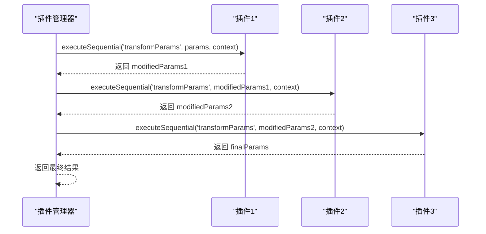

#### Parallel 钩子 - 并行副作用

Parallel 钩子并发执行，用于日志、监控等副作用操作。所有插件都会执行，不依赖执行顺序。

```typescript
// 并发执行，用于日志、监控等副作用
onRequestStart?: (context: AiRequestContext) => void
onRequestEnd?: (context: AiRequestContext, result: any) => void
onError?: (error: Error, context: AiRequestContext) => void
```

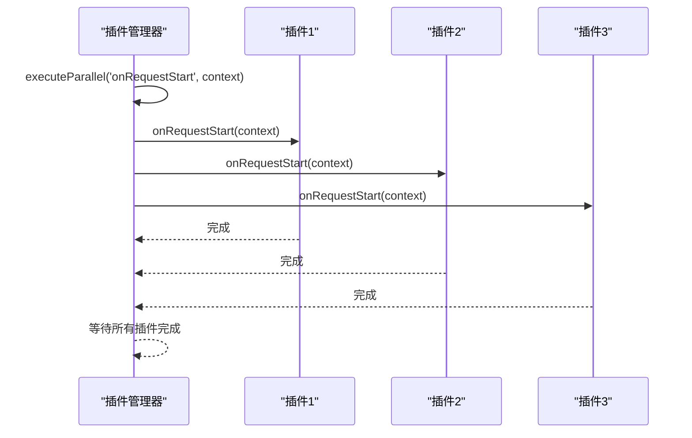

#### Stream 钩子 - 流处理

Stream 钩子直接使用 AI SDK 的 TransformStream，用于流式数据处理。

```typescript
// 直接使用 AI SDK 的 TransformStream
transformStream?: () => (options) => TransformStream<TextStreamPart, TextStreamPart>
```

### 内置插件

AI Core 模块提供了多个内置插件，开箱即用。

#### webSearchPlugin - 网络搜索插件

为不同 AI Provider 提供统一的网络搜索能力。

```typescript
import { webSearchPlugin } from '@cherrystudio/ai-core/built-in/plugins'

const executor = AiCore.create('openai', { apiKey: 'your-key' }, [
  webSearchPlugin({
    openai: {
      /* OpenAI 搜索配置 */
    },
    anthropic: { maxUses: 5 },
    google: {
      /* Google 搜索配置 */
    },
    xai: {
      mode: 'on',
      returnCitations: true,
      maxSearchResults: 5,
      sources: [{ type: 'web' }, { type: 'x' }, { type: 'news' }]
    }
  })
])
```

#### loggingPlugin - 日志插件

提供详细的请求日志记录。

```typescript
import { createLoggingPlugin } from '@cherrystudio/ai-core/built-in/plugins'

const executor = AiCore.create('openai', { apiKey: 'your-key' }, [
  createLoggingPlugin({
    logLevel: 'info',
    includeParams: true,
    includeResult: false
  })
])
```

#### promptToolUsePlugin - 提示工具使用插件

为不支持原生 Function Call 的模型提供 prompt 方式的工具调用。

```typescript
import { createPromptToolUsePlugin } from '@cherrystudio/ai-core/built-in/plugins'

// 对于不支持 function call 的模型
const executor = AiCore.create(
  'providerId',
  {
    apiKey: 'your-key',
    baseURL: 'https://your-model-endpoint'
  },
  [
    createPromptToolUsePlugin({
      enabled: true,
      // 可选：自定义系统提示符构建
      buildSystemPrompt: (userPrompt, tools) => {
        return `${userPrompt}\n\nAvailable tools: ${Object.keys(tools).join(', ')}`
      }
    })
  ]
)
```

### 自定义插件

创建自定义插件非常简单：

```typescript
import { definePlugin } from '@cherrystudio/ai-core'

const customPlugin = definePlugin({
  name: 'custom-plugin',
  enforce: 'pre', // 'pre' | 'post' | undefined

  // 在请求开始时记录日志
  onRequestStart: async (context) => {
    console.log(`Starting request for model: ${context.modelId}`)
  },

  // 转换请求参数
  transformParams: async (params, context) => {
    // 添加自定义系统消息
    if (params.messages) {
      params.messages.unshift({
        role: 'system',
        content: 'You are a helpful assistant.'
      })
    }
    return params
  },

  // 处理响应结果
  transformResult: async (result, context) => {
    // 添加元数据
    if (result.text) {
      result.metadata = {
        processedAt: new Date().toISOString(),
        modelId: context.modelId
      }
    }
    return result
  }
})

// 使用自定义插件
const executor = AiCore.create('openai', { apiKey: 'your-key' }, [customPlugin])
```

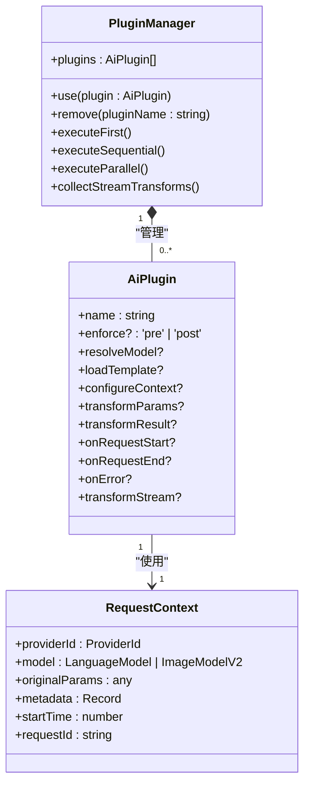

**Diagram sources **
- [plugins/README.md](file://packages/aiCore/src/core/plugins/README.md#L1-L45)
- [plugins/types.ts](file://packages/aiCore/src/core/plugins/types.ts#L1-L80)
- [plugins/manager.ts](file://packages/aiCore/src/core/plugins/manager.ts#L1-L185)

**Section sources**
- [README.md](file://packages/aiCore/README.md#L182-L299)
- [plugins/README.md](file://packages/aiCore/src/core/plugins/README.md#L1-L45)
- [plugins/types.ts](file://packages/aiCore/src/core/plugins/types.ts#L1-L80)
- [plugins/manager.ts](file://packages/aiCore/src/core/plugins/manager.ts#L1-L185)

## 使用模式

AI Core 模块提供了多种使用模式，满足不同场景的需求。

### 函数式调用

适合简单场景的直接函数调用。

```typescript
import { streamText, generateText } from '@cherrystudio/ai-core/runtime'

// 直接函数调用
const stream = await streamText(
  'anthropic',
  { apiKey: 'your-api-key' },
  'claude-3',
  { messages: [{ role: 'user', content: 'Hello!' }] },
  [loggingPlugin]
)
```

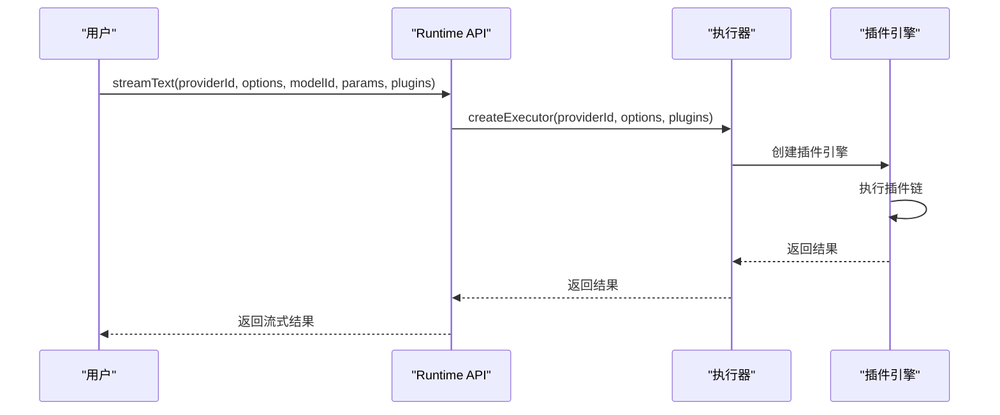

### 执行器实例

适合复杂场景的可复用执行器。

```typescript
import { createExecutor } from '@cherrystudio/ai-core/runtime'

// 创建可复用的执行器
const executor = createExecutor('openai', { apiKey: 'your-api-key' }, [plugin1, plugin2])

// 多次使用
const stream = await executor.streamText('gpt-4', {
  messages: [{ role: 'user', content: 'Hello!' }]
})

const result = await executor.generateText('gpt-4', {
  messages: [{ role: 'user', content: 'How are you?' }]
})
```

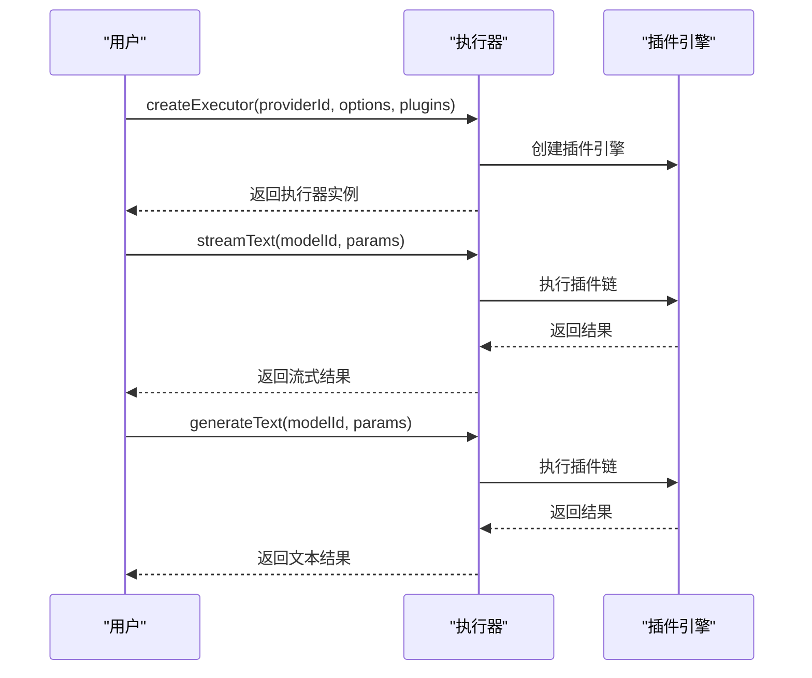

### 静态工厂方法

便捷的静态创建方法。

```typescript
import { RuntimeExecutor } from '@cherrystudio/ai-core/runtime'

// 静态创建
const executor = RuntimeExecutor.create('anthropic', { apiKey: 'your-api-key' })
await executor.streamText('claude-3', { messages: [...] })
```

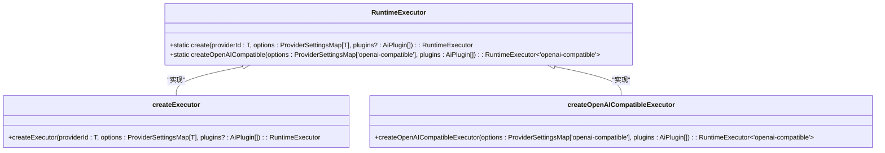

**Diagram sources **
- [README.md](file://packages/aiCore/README.md#L324-L354)
- [runtime/index.ts](file://packages/aiCore/src/core/runtime/index.ts#L23-L39)
- [executor.ts](file://packages/aiCore/src/core/runtime/executor.ts#L285-L309)

**Section sources**
- [README.md](file://packages/aiCore/README.md#L104-L137)
- [runtime/index.ts](file://packages/aiCore/src/core/runtime/index.ts#L1-L118)
- [executor.ts](file://packages/aiCore/src/core/runtime/executor.ts#L1-L311)

## 与AI SDK原生Provider Registry的兼容性

AI Core 模块完全兼容 AI SDK 原生的 Provider Registry，支持灵活的使用方式。

### 基本用法示例

```typescript
import { createClient } from '@cherrystudio/ai-core'
import { createProviderRegistry } from 'ai'
import { createOpenAI } from '@ai-sdk/openai'
import { anthropic } from '@ai-sdk/anthropic'

// 1. 创建 AI SDK 原生注册表
export const registry = createProviderRegistry({
  // register provider with prefix and default setup:
  anthropic,

  // register provider with prefix and custom setup:
  openai: createOpenAI({
    apiKey: process.env.OPENAI_API_KEY
  })
})

// 2. 创建client,'openai'可以传空或者传providerId(内建的provider)
const client = PluginEnabledAiClient.create('openai', {
  apiKey: process.env.OPENAI_API_KEY
})

// 3. 方式1：使用内建逻辑（传统方式）
const result1 = await client.streamText('gpt-4', {
  messages: [{ role: 'user', content: 'Hello with built-in logic!' }]
})

// 4. 方式2：使用自定义注册表（灵活方式）
const result2 = await client.streamText({
  model: registry.languageModel('openai:gpt-4'),
  messages: [{ role: 'user', content: 'Hello with custom registry!' }]
})

// 5. 支持的重载方法
await client.generateObject({
  model: registry.languageModel('openai:gpt-4'),
  schema: z.object({ name: z.string() }),
  messages: [{ role: 'user', content: 'Generate a user' }]
})

await client.streamObject({
  model: registry.languageModel('anthropic:claude-3-opus-20240229'),
  schema: z.object({ items: z.array(z.string()) }),
  messages: [{ role: 'user', content: 'Generate a list' }]
})
```

### 与插件系统配合使用

更强大的是，还可以将自定义注册表与 Cherry Studio 的插件系统结合使用：

```typescript
import { PluginEnabledAiClient } from '@cherrystudio/ai-core'
import { createProviderRegistry } from 'ai'
import { createOpenAI } from '@ai-sdk/openai'
import { anthropic } from '@ai-sdk/anthropic'

// 1. 创建带插件的客户端
const client = PluginEnabledAiClient.create(
  'openai',
  {
    apiKey: process.env.OPENAI_API_KEY
  },
  [LoggingPlugin, RetryPlugin]
)

// 2. 创建自定义注册表
const registry = createProviderRegistry({
  openai: createOpenAI({ apiKey: process.env.OPENAI_API_KEY }),
  anthropic: anthropic({ apiKey: process.env.ANTHROPIC_API_KEY })
})

// 3. 方式1：使用内建逻辑 + 完整插件系统
await client.streamText('gpt-4', {
  messages: [{ role: 'user', content: 'Hello with plugins!' }]
})

// 4. 方式2：使用自定义注册表 + 有限插件支持
await client.streamText({
  model: registry.languageModel('anthropic:claude-3-opus-20240229'),
  messages: [{ role: 'user', content: 'Hello from Claude!' }]
})

// 5. 支持的方法
await client.generateObject({
  model: registry.languageModel('openai:gpt-4'),
  schema: z.object({ name: z.string() }),
  messages: [{ role: 'user', content: 'Generate a user' }]
})

await client.streamObject({
  model: registry.languageModel('openai:gpt-4'),
  schema: z.object({ items: z.array(z.string()) }),
  messages: [{ role: 'user', content: 'Generate a list' }]
})
```

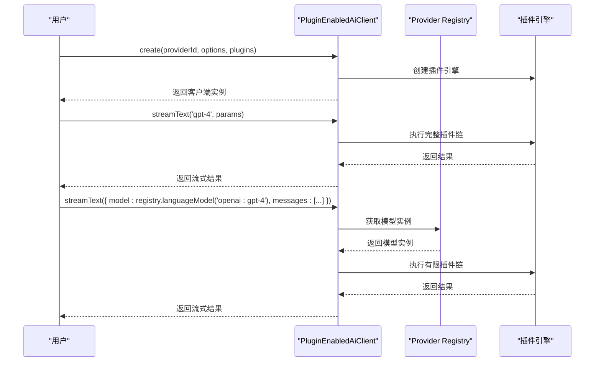

**Diagram sources **
- [README.md](file://packages/aiCore/README.md#L310-L399)
- [AI_SDK_ARCHITECTURE.md](file://packages/aiCore/AI_SDK_ARCHITECTURE.md#L306-L310)

**Section sources**
- [README.md](file://packages/aiCore/README.md#L301-L412)
- [AI_SDK_ARCHITECTURE.md](file://packages/aiCore/AI_SDK_ARCHITECTURE.md#L306-L310)