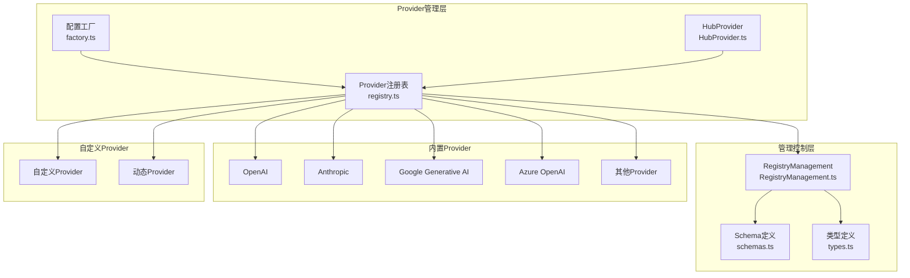
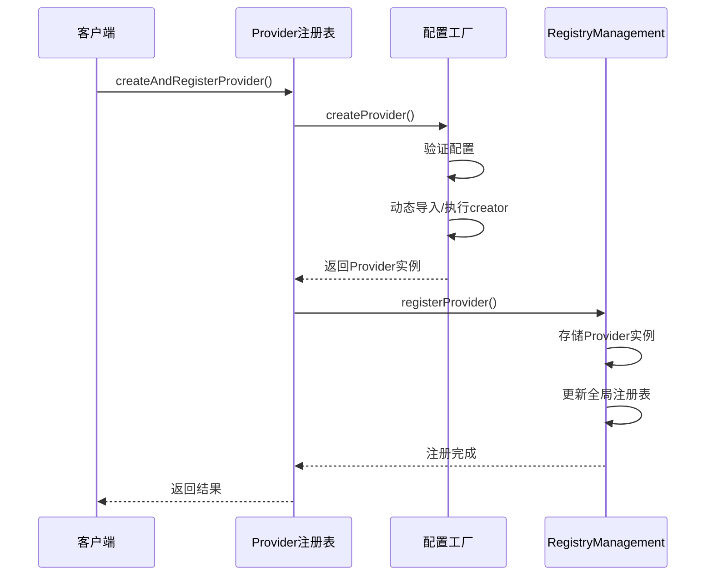
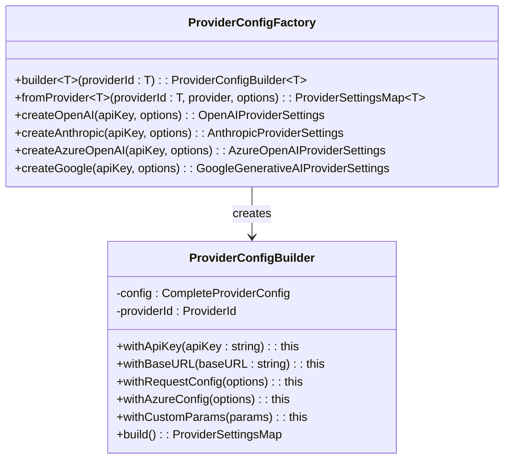
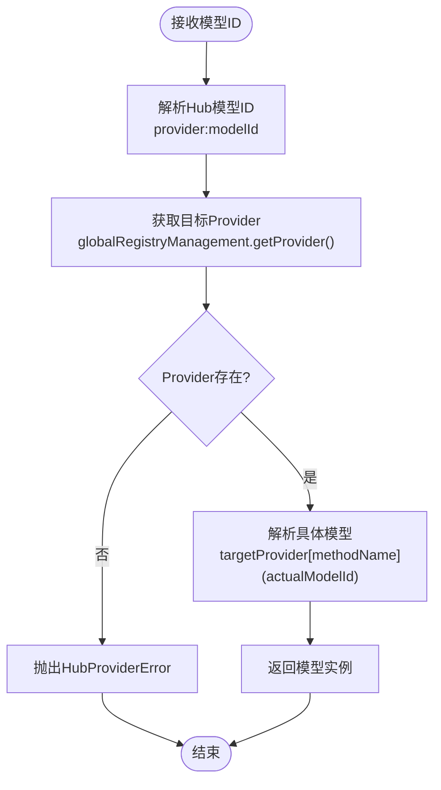
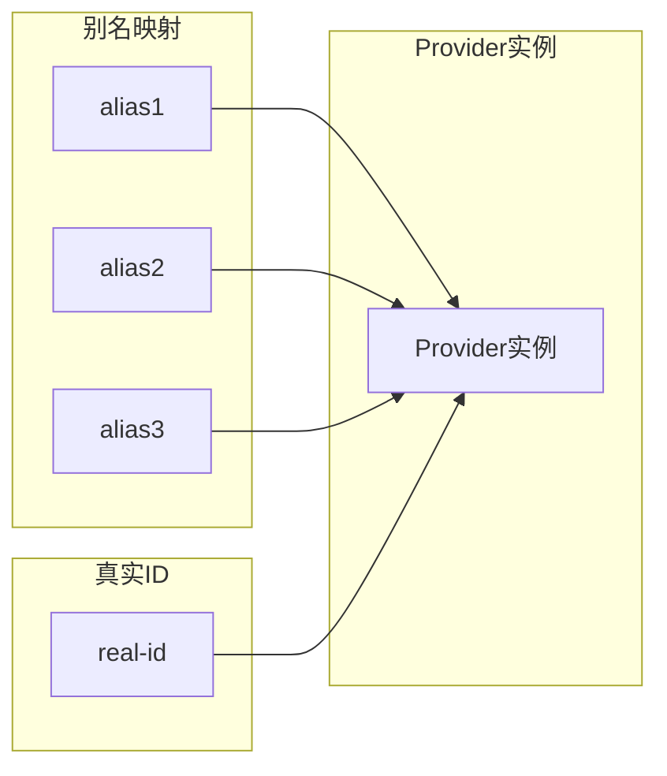
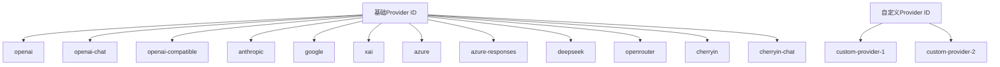

# Provider管理

<cite>
**本文档中引用的文件**
- [packages/aiCore/src/core/providers/registry.ts](file://packages/aiCore/src/core/providers/registry.ts)
- [packages/aiCore/src/core/providers/factory.ts](file://packages/aiCore/src/core/providers/factory.ts)
- [packages/aiCore/src/core/providers/RegistryManagement.ts](file://packages/aiCore/src/core/providers/RegistryManagement.ts)
- [packages/aiCore/src/core/providers/schemas.ts](file://packages/aiCore/src/core/providers/schemas.ts)
- [packages/aiCore/src/core/providers/types.ts](file://packages/aiCore/src/core/providers/types.ts)
- [packages/aiCore/src/core/providers/utils.ts](file://packages/aiCore/src/core/providers/utils.ts)
- [packages/aiCore/src/core/providers/HubProvider.ts](file://packages/aiCore/src/core/providers/HubProvider.ts)
- [src/renderer/src/aiCore/provider/factory.ts](file://src/renderer/src/aiCore/provider/factory.ts)
- [src/renderer/src/aiCore/provider/providerConfig.ts](file://src/renderer/src/aiCore/provider/providerConfig.ts)
- [src/renderer/src/aiCore/provider/providerInitialization.ts](file://src/renderer/src/aiCore/provider/providerInitialization.ts)
- [packages/aiCore/src/core/providers/__tests__/registry-functionality.test.ts](file://packages/aiCore/src/core/providers/__tests__/registry-functionality.test.ts)
</cite>

## 目录
1. [简介](#简介)
2. [系统架构概览](#系统架构概览)
3. [Provider注册表（registry.ts）](#provider注册表registryts)
4. [工厂模式（factory.ts）](#工厂模式factoryts)
5. [HubProvider封装](#hubprovider封装)
6. [RegistryManagement动态注册](#registrymanagement动态注册)
7. [内置Provider实现](#内置provider实现)
8. [自定义Provider开发指南](#自定义provider开发指南)
9. [最佳实践](#最佳实践)
10. [故障排除](#故障排除)

## 简介

AI Core模块的Provider管理系统是一个高度模块化和可扩展的架构，负责统一管理各种AI服务提供商。该系统通过三层设计实现了Provider的标准化接入、动态注册和灵活扩展，为上层应用提供了统一的AI服务访问接口。

系统的核心设计理念是：
- **统一抽象**：通过AI SDK Provider接口统一不同AI服务的API差异
- **动态扩展**：支持运行时注册自定义Provider
- **类型安全**：基于Zod Schema的配置验证和TypeScript类型推导
- **别名支持**：提供灵活的Provider ID映射和别名机制

## 系统架构概览



**图表来源**
- [packages/aiCore/src/core/providers/registry.ts](file://packages/aiCore/src/core/providers/registry.ts#L1-L50)
- [packages/aiCore/src/core/providers/RegistryManagement.ts](file://packages/aiCore/src/core/providers/RegistryManagement.ts#L1-L50)

## Provider注册表（registry.ts）

Provider注册表是整个系统的核心入口点，负责Provider的生命周期管理和统一访问。

### 核心功能

#### 1. Provider配置管理
- **配置存储**：维护Provider配置的全局映射表
- **别名支持**：支持配置别名映射，简化用户使用
- **验证机制**：基于Zod Schema的配置验证

#### 2. Provider创建流程
系统采用三阶段创建模式：



**图表来源**
- [packages/aiCore/src/core/providers/registry.ts](file://packages/aiCore/src/core/providers/registry.ts#L212-L225)

#### 3. 内置Provider初始化
系统在启动时自动初始化所有内置Provider配置：

```typescript
// 初始化内置配置示例
function initializeBuiltInConfigs(): void {
  baseProviders.forEach((provider) => {
    const config: ProviderConfig = {
      id: provider.id,
      name: provider.name,
      creator: provider.creator as any,
      supportsImageGeneration: provider.supportsImageGeneration || false
    }
    providerConfigs.set(provider.id, config)
  })
}
```

**节来源**
- [packages/aiCore/src/core/providers/registry.ts](file://packages/aiCore/src/core/providers/registry.ts#L67-L88)

### 关键API

#### Provider查询接口
- `getSupportedProviders()`：获取支持的Provider列表
- `getInitializedProviders()`：获取已初始化的Provider列表
- `hasInitializedProviders()`：检查是否存在已初始化的Provider

#### 配置管理接口
- `registerProviderConfig(config)`：注册Provider配置
- `getProviderConfig(id)`：获取指定Provider配置
- `hasProviderConfig(id)`：检查Provider配置是否存在

**节来源**
- [packages/aiCore/src/core/providers/registry.ts](file://packages/aiCore/src/core/providers/registry.ts#L38-L63)

## 工厂模式（factory.ts）

Provider配置工厂提供了类型安全的Provider配置构建能力，支持多种创建方式。

### 配置构建器模式



**图表来源**
- [packages/aiCore/src/core/providers/factory.ts](file://packages/aiCore/src/core/providers/factory.ts#L42-L121)

### 快速创建方法

工厂提供了针对常见Provider的快速创建方法：

#### OpenAI配置创建
```typescript
// 基础OpenAI配置
const openaiConfig = ProviderConfigFactory.createOpenAI(apiKey, {
  baseURL: 'https://api.openai.com',
  organization: 'org-xxx',
  project: 'proj-xxx'
})

// 类型安全的OpenAI配置
const openaiChatConfig = ProviderConfigFactory.createOpenAI(apiKey, {
  organization: 'org-xxx'
})
```

#### Anthropic配置创建
```typescript
// Anthropic配置
const anthropicConfig = ProviderConfigFactory.createAnthropic(apiKey, {
  baseURL: 'https://api.anthropic.com'
})
```

#### Azure OpenAI配置创建
```typescript
// Azure OpenAI配置
const azureConfig = ProviderConfigFactory.createAzureOpenAI(apiKey, {
  baseURL: 'https://your-resource.openai.azure.com',
  apiVersion: '2024-02-15-preview',
  resourceName: 'your-resource-name'
})
```

**节来源**
- [packages/aiCore/src/core/providers/factory.ts](file://packages/aiCore/src/core/providers/factory.ts#L184-L241)

### 配置处理器模式

系统采用了优雅的配置处理器模式来处理不同Provider的特定配置：

```typescript
const configHandlers: {
  [K in ProviderId]?: ConfigHandler<K>
} = {
  azure: (builder, provider) => {
    const azureBuilder = builder as ProviderConfigBuilder<'azure'>
    const azureProvider = provider as CompleteProviderConfig<'azure'>
    azureBuilder.withAzureConfig({
      apiVersion: azureProvider.apiVersion,
      resourceName: azureProvider.resourceName
    })
  }
}
```

**节来源**
- [packages/aiCore/src/core/providers/factory.ts](file://packages/aiCore/src/core/providers/factory.ts#L29-L41)

## HubProvider封装

HubProvider提供了统一的多Provider路由能力，支持在单一接口下管理多个底层Provider。

### 核心特性

#### 1. 模型ID解析
HubProvider使用特殊的模型ID格式来路由请求：

```
格式: hubId:providerId:modelId
示例: aihubmix:anthropic:claude-3.5-sonnet
```

#### 2. 动态路由机制



**图表来源**
- [packages/aiCore/src/core/providers/HubProvider.ts](file://packages/aiCore/src/core/providers/HubProvider.ts#L75-L90)

#### 3. 错误处理
HubProvider提供了专门的错误类型来处理各种异常情况：

```typescript
export class HubProviderError extends Error {
  constructor(
    message: string,
    public readonly hubId: string,
    public readonly providerId?: string,
    public readonly originalError?: Error
  ) {
    super(message)
    this.name = 'HubProviderError'
  }
}
```

**节来源**
- [packages/aiCore/src/core/providers/HubProvider.ts](file://packages/aiCore/src/core/providers/HubProvider.ts#L21-L31)

## RegistryManagement动态注册

RegistryManagement是纯粹的Provider实例管理器，负责存储和检索已配置好的Provider实例。

### 核心功能

#### 1. Provider存储机制
- **实例存储**：直接存储Provider实例引用
- **别名管理**：支持别名到真实Provider的映射
- **内存优化**：相同Provider的不同别名共享同一实例

#### 2. 注册表重建机制
每次Provider变更都会触发注册表的重建：

```typescript
private rebuildRegistry(): void {
  if (Object.keys(this.providers).length === 0) {
    this.registry = null
    return
  }

  this.registry = createProviderRegistry<PROVIDERS, SEPARATOR>(this.providers, {
    separator: this.separator
  })
}
```

**节来源**
- [packages/aiCore/src/core/providers/RegistryManagement.ts](file://packages/aiCore/src/core/providers/RegistryManagement.ts#L95-L104)

### 别名系统



**图表来源**
- [packages/aiCore/src/core/providers/RegistryManagement.ts](file://packages/aiCore/src/core/providers/RegistryManagement.ts#L29-L39)

### 查询接口

RegistryManagement提供了丰富的查询接口：

- `getProvider(id)`：获取指定Provider实例
- `getRegisteredProviders()`：获取所有已注册的Provider ID
- `hasProviders()`：检查是否存在Provider
- `resolveProviderId(id)`：解析Provider的真实ID

**节来源**
- [packages/aiCore/src/core/providers/RegistryManagement.ts](file://packages/aiCore/src/core/providers/RegistryManagement.ts#L48-L168)

## 内置Provider实现

系统内置了12个主要的AI服务提供商，每个都有其独特的实现模式。

### Provider ID体系



**图表来源**
- [packages/aiCore/src/core/providers/schemas.ts](file://packages/aiCore/src/core/providers/schemas.ts#L23-L36)

### 特殊Provider处理

某些Provider需要特殊的处理逻辑：

#### OpenAI变体处理
```typescript
if (providerId === 'openai') {
  // 注册默认 openai
  globalRegistryManagement.registerProvider(providerId, provider, aliases)
  
  // 创建并注册 openai-chat 变体
  const openaiChatProvider = customProvider({
    fallbackProvider: {
      ...provider,
      languageModel: (modelId: string) => provider.chat(modelId)
    }
  })
  globalRegistryManagement.registerProvider(`${providerId}-chat`, openaiChatProvider)
}
```

#### Azure Provider处理
```typescript
if (providerId === 'azure') {
  globalRegistryManagement.registerProvider(`${providerId}-chat`, provider, aliases)
  
  const azureResponsesProvider = customProvider({
    fallbackProvider: {
      ...provider,
      languageModel: (modelId: string) => provider.responses(modelId)
    }
  })
  globalRegistryManagement.registerProvider(providerId, azureResponsesProvider)
}
```

**节来源**
- [packages/aiCore/src/core/providers/registry.ts](file://packages/aiCore/src/core/providers/registry.ts#L177-L202)

### Schema定义

Provider配置基于Zod Schema进行严格的类型验证：

```typescript
export const providerConfigSchema = z.object({
  id: customProviderIdSchema, // 只允许自定义ID
  name: z.string().min(1),
  creator: z.function().optional(),
  import: z.function().optional(),
  creatorFunctionName: z.string().optional(),
  supportsImageGeneration: z.boolean().default(false),
  aliases: z.array(z.string()).optional()
}).refine((data) => data.creator || (data.import && data.creatorFunctionName), {
  message: '必须提供creator函数或导入配置'
})
```

**节来源**
- [packages/aiCore/src/core/providers/schemas.ts](file://packages/aiCore/src/core/providers/schemas.ts#L182-L201)

## 自定义Provider开发指南

### 接口契约

自定义Provider必须遵循以下接口契约：

#### 1. Provider配置接口
```typescript
export interface ProviderConfig {
  id: CustomProviderId
  name: string
  creator?: (options: any) => Provider | LanguageModelV2
  import?: () => Promise<{ [key: string]: any }>
  creatorFunctionName?: string
  supportsImageGeneration?: boolean
  aliases?: string[]
  validateOptions?: (options: any) => void
}
```

#### 2. Provider设置映射
```typescript
export interface ExtensibleProviderSettingsMap {
  openai: OpenAIProviderSettings
  anthropic: AnthropicProviderSettings
  google: GoogleGenerativeAIProviderSettings
  azure: AzureOpenAIProviderSettings
  // ... 其他内置Provider
}
```

### 开发步骤

#### 1. 定义Provider配置

```typescript
const customProviderConfig: ProviderConfig = {
  id: 'my-custom-provider',
  name: 'My Custom Provider',
  creator: (options) => {
    // 实现自定义Provider创建逻辑
    return createCustomProvider(options)
  },
  supportsImageGeneration: true,
  aliases: ['custom', 'my-provider']
}
```

#### 2. 注册Provider配置

```typescript
import { registerProviderConfig } from '@cherrystudio/ai-core/provider'

// 注册配置
registerProviderConfig(customProviderConfig)

// 或批量注册
registerMultipleProviderConfigs([config1, config2, config3])
```

#### 3. 创建Provider实例

```typescript
import { createAndRegisterProvider } from '@cherrystudio/ai-core/provider'

// 创建并注册
await createAndRegisterProvider('my-custom-provider', {
  apiKey: 'your-api-key',
  baseURL: 'https://api.example.com'
})
```

### 认证处理

#### 1. API Key认证
```typescript
function createAuthProvider(options: { apiKey: string }) {
  return {
    headers: {
      'Authorization': `Bearer ${options.apiKey}`,
      'Content-Type': 'application/json'
    }
  }
}
```

#### 2. OAuth认证
```typescript
async function createOAuthProvider(options: { clientId: string, clientSecret: string }) {
  const token = await getOAuthToken(options.clientId, options.clientSecret)
  return {
    headers: {
      'Authorization': `Bearer ${token}`,
      'Content-Type': 'application/json'
    }
  }
}
```

#### 3. 自定义认证
```typescript
function createCustomAuthProvider(options: { customToken: string }) {
  return {
    headers: {
      'X-Custom-Token': options.customToken,
      'X-Auth-Version': '2.0'
    }
  }
}
```

### 错误映射

#### 1. Provider错误类型
```typescript
export class ProviderError extends Error {
  constructor(
    message: string,
    public providerId: string,
    public code?: string,
    public cause?: Error
  ) {
    super(message)
    this.name = 'ProviderError'
  }
}
```

#### 2. 错误处理示例
```typescript
try {
  const response = await fetch(url, {
    method: 'POST',
    headers: authHeaders,
    body: JSON.stringify(data)
  })
  
  if (!response.ok) {
    const errorData = await response.json()
    throw new ProviderError(
      errorData.message || 'API request failed',
      providerId,
      errorData.code,
      errorData
    )
  }
  
  return response.json()
} catch (error) {
  if (error instanceof ProviderError) {
    // 处理Provider特定错误
    throw error
  }
  
  // 转换为Provider错误
  throw new ProviderError(
    'Network error occurred',
    providerId,
    'NETWORK_ERROR',
    error
  )
}
```

### 验证函数

```typescript
const customProviderConfig: ProviderConfig = {
  id: 'validated-provider',
  name: 'Validated Provider',
  creator: createProvider,
  validateOptions: (options) => {
    // 参数验证
    if (!options.apiKey) {
      throw new Error('API key is required')
    }
    
    if (options.timeout && (options.timeout < 1000 || options.timeout > 30000)) {
      throw new Error('Timeout must be between 1000 and 30000 milliseconds')
    }
    
    // 自定义验证逻辑
    if (options.model && !isValidModel(options.model)) {
      throw new Error('Invalid model specified')
    }
  }
}
```

**节来源**
- [packages/aiCore/src/core/providers/types.ts](file://packages/aiCore/src/core/providers/types.ts#L41-L50)
- [packages/aiCore/src/core/providers/schemas.ts](file://packages/aiCore/src/core/providers/schemas.ts#L182-L201)

## 最佳实践

### 1. Provider扩展策略

#### 优先使用工厂方法
```typescript
// 推荐：使用工厂方法
const config = ProviderConfigFactory.createOpenAI(apiKey, {
  baseURL: 'https://api.openai.com'
})

// 避免：手动构建配置
const manualConfig = {
  apiKey: apiKey,
  baseURL: 'https://api.openai.com',
  // 缺少类型安全和验证
}
```

#### 利用别名系统
```typescript
const providerConfig: ProviderConfig = {
  id: 'production-provider',
  name: 'Production Provider',
  creator: createProductionProvider,
  aliases: ['prod', 'production', 'main']
}
```

### 2. 运行时替换

#### 动态Provider切换
```typescript
// 检查Provider可用性
if (hasProviderConfig('custom-provider')) {
  // 创建新Provider
  await createAndRegisterProvider('custom-provider', newOptions)
  
  // 清理旧Provider（可选）
  clearAllProviders()
}
```

#### 条件Provider加载
```typescript
async function loadConditionalProvider(condition: boolean) {
  const configs = condition 
    ? [conditionalProviderConfig] 
    : [fallbackProviderConfig]
    
  registerMultipleProviderConfigs(configs)
}
```

### 3. 性能优化

#### 配置缓存
```typescript
// 缓存Provider配置
const providerCache = new Map<string, Provider>()

function getCachedProvider(id: string, options: any): Provider {
  const cacheKey = `${id}-${JSON.stringify(options)}`
  
  if (!providerCache.has(cacheKey)) {
    providerCache.set(cacheKey, createProvider(id, options))
  }
  
  return providerCache.get(cacheKey)!
}
```

#### 异步初始化
```typescript
// 异步Provider初始化
async function initializeProviders() {
  const promises = providerConfigs.map(config => 
    createAndRegisterProvider(config.id, config.options)
  )
  
  await Promise.all(promises)
}
```

### 4. 错误处理最佳实践

#### 分层错误处理
```typescript
class ProviderManager {
  async executeWithRetry<T>(
    operation: () => Promise<T>,
    maxRetries: number = 3
  ): Promise<T> {
    let lastError: Error
    
    for (let i = 0; i < maxRetries; i++) {
      try {
        return await operation()
      } catch (error) {
        lastError = error
        
        if (i < maxRetries - 1) {
          await this.delay(2 ** i * 1000) // 指数退避
        }
      }
    }
    
    throw new ProviderError(
      `Operation failed after ${maxRetries} retries`,
      this.currentProviderId,
      'OPERATION_FAILED',
      lastError
    )
  }
}
```

## 故障排除

### 常见问题及解决方案

#### 1. Provider未找到错误

**问题**：`Provider "provider-id" is not initialized`

**原因**：
- Provider未正确注册
- Provider配置缺失
- Provider创建失败

**解决方案**：
```typescript
// 检查Provider配置
console.log('Available providers:', getSupportedProviders())
console.log('Initialized providers:', getInitializedProviders())

// 验证配置
const config = getProviderConfig('provider-id')
if (!config) {
  console.error('Provider config not found')
}

// 重新注册
await createAndRegisterProvider('provider-id', options)
```

#### 2. 配置验证失败

**问题**：Provider配置Schema验证失败

**原因**：
- 缺少必需字段
- 字段类型不匹配
- ID冲突

**解决方案**：
```typescript
// 检查配置Schema
import { providerConfigSchema } from '@cherrystudio/ai-core/provider'

const result = providerConfigSchema.safeParse(config)
if (!result.success) {
  console.error('Validation errors:', result.error.errors)
}
```

#### 3. 动态导入失败

**问题**：Provider的import函数执行失败

**原因**：
- 模块不存在
- 导入路径错误
- 运行时环境限制

**解决方案**：
```typescript
const providerConfig: ProviderConfig = {
  id: 'dynamic-provider',
  name: 'Dynamic Provider',
  import: async () => {
    try {
      return await import('./custom-provider-module')
    } catch (error) {
      console.error('Failed to import provider module:', error)
      throw error
    }
  },
  creatorFunctionName: 'createProvider'
}
```

#### 4. 别名解析问题

**问题**：Provider别名无法解析

**原因**：
- 别名配置错误
- 别名循环引用
- 别名冲突

**解决方案**：
```typescript
// 检查别名映射
console.log('All aliases:', getAllProviderConfigAliases())
console.log('Resolved ID:', resolveProviderConfigId('alias-name'))

// 验证别名配置
const config = getProviderConfigByAlias('alias-name')
if (config) {
  console.log('Real ID:', config.id)
}
```

### 调试工具

#### Provider状态检查
```typescript
function debugProviderStatus() {
  console.log('=== Provider Debug Info ===')
  console.log('Supported providers:', getSupportedProviders())
  console.log('Initialized providers:', getInitializedProviders())
  console.log('Provider configs:', getAllProviderConfigs())
  console.log('Alias mappings:', getAllProviderConfigAliases())
}
```

#### 配置验证工具
```typescript
function validateProviderConfig(config: ProviderConfig) {
  const result = providerConfigSchema.safeParse(config)
  
  if (result.success) {
    console.log('✅ Configuration is valid')
    return true
  } else {
    console.error('❌ Configuration validation failed:')
    result.error.errors.forEach(error => {
      console.error(`- ${error.path.join('.')}: ${error.message}`)
    })
    return false
  }
}
```

**节来源**
- [packages/aiCore/src/core/providers/__tests__/registry-functionality.test.ts](file://packages/aiCore/src/core/providers/__tests__/registry-functionality.test.ts#L67-L100)