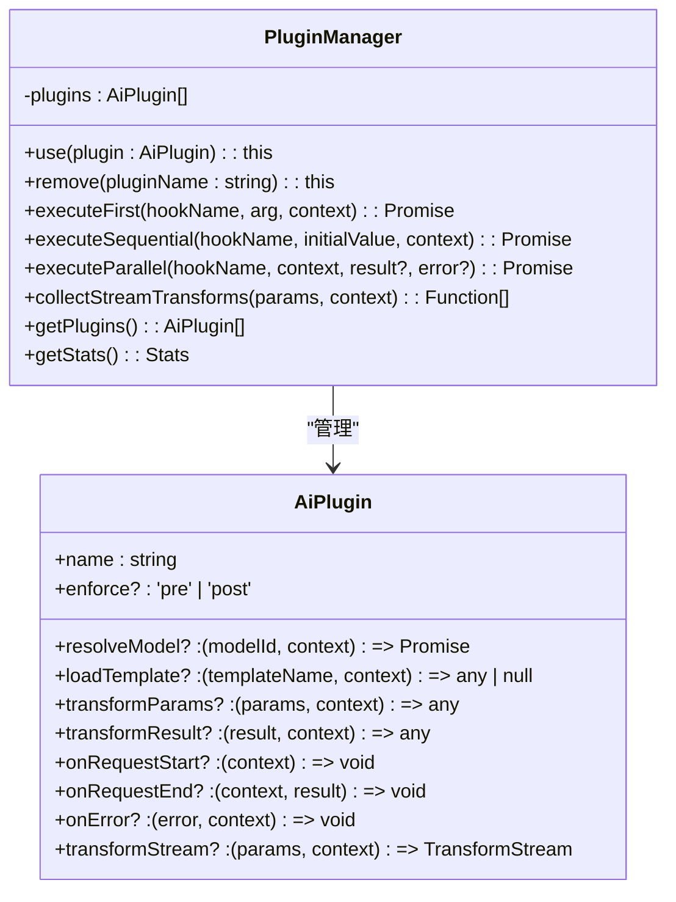
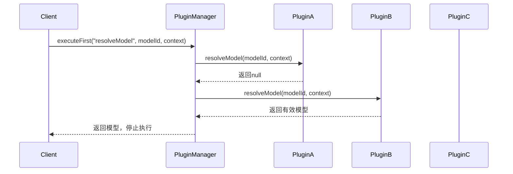
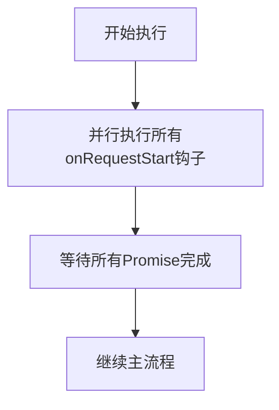
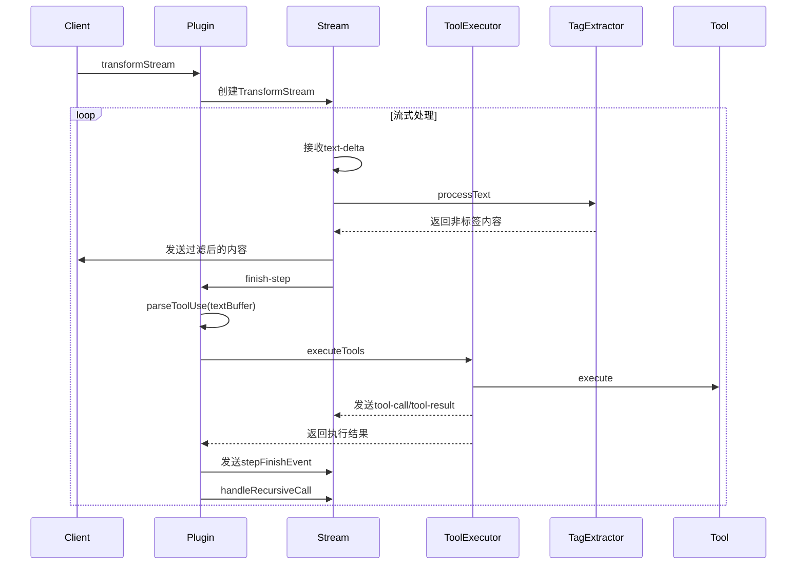
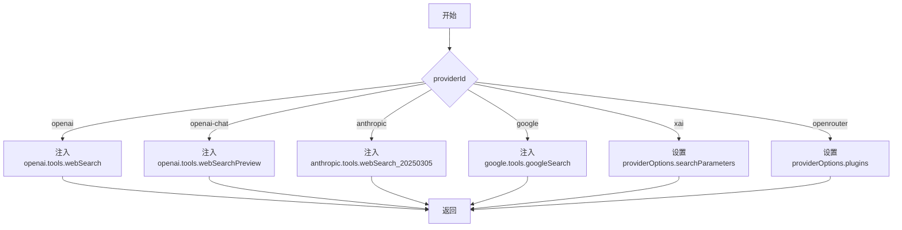
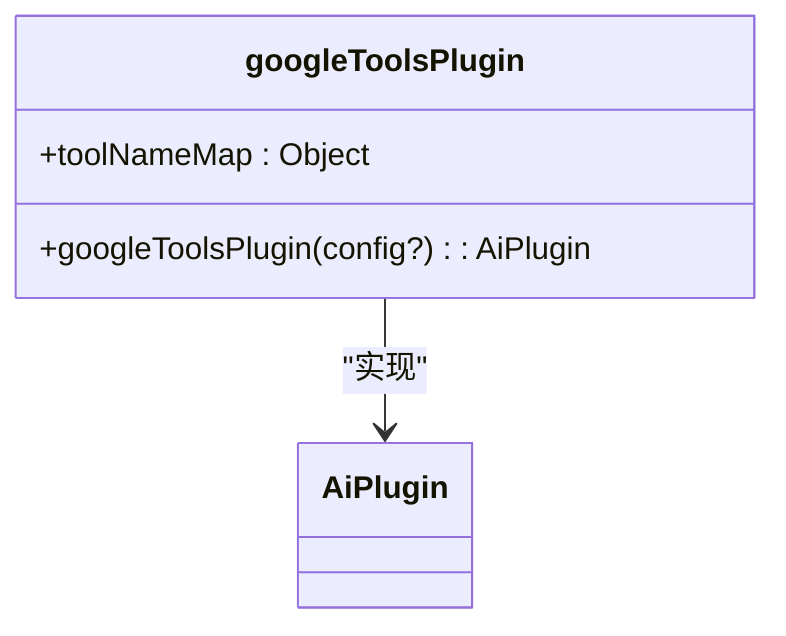
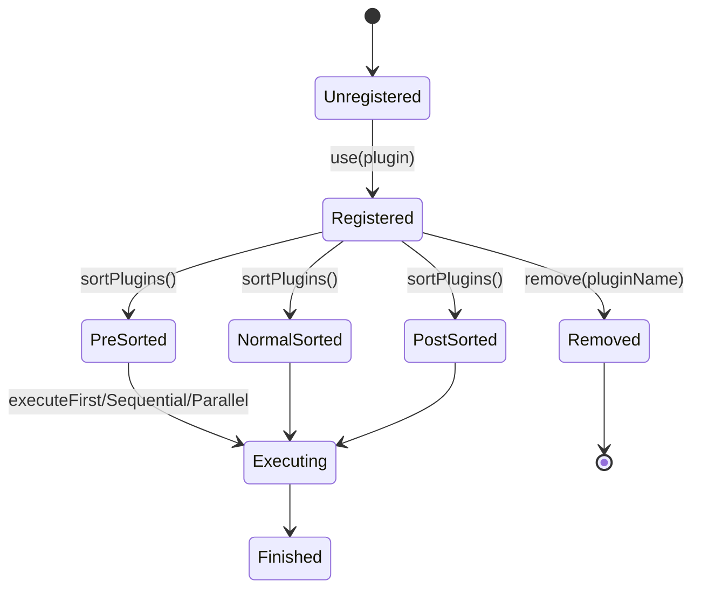
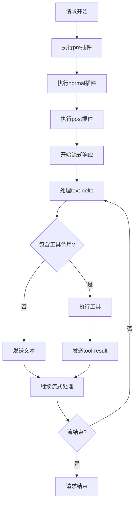

# 插件系统

<cite>
**本文档引用的文件**  
- [manager.ts](file://packages/aiCore/src/core/plugins/manager.ts)
- [types.ts](file://packages/aiCore/src/core/plugins/types.ts)
- [README.md](file://packages/aiCore/src/core/plugins/README.md)
- [promptToolUsePlugin.ts](file://packages/aiCore/src/core/plugins/built-in/toolUsePlugin/promptToolUsePlugin.ts)
- [webSearchPlugin/index.ts](file://packages/aiCore/src/core/plugins/built-in/webSearchPlugin/index.ts)
- [helper.ts](file://packages/aiCore/src/core/plugins/built-in/webSearchPlugin/helper.ts)
- [googleToolsPlugin/index.ts](file://packages/aiCore/src/core/plugins/built-in/googleToolsPlugin/index.ts)
- [index.ts](file://packages/aiCore/src/core/plugins/index.ts)
</cite>

## 目录
1. [插件系统概述](#插件系统概述)
2. [插件管理器工作原理](#插件管理器工作原理)
3. [钩子类型执行语义](#钩子类型执行语义)
4. [内置插件实现机制](#内置插件实现机制)
5. [插件注册与生命周期](#插件注册与生命周期)
6. [错误传播策略](#错误传播策略)
7. [自定义插件开发指南](#自定义插件开发指南)
8. [插件链组合与调试](#插件链组合与调试)

## 插件系统概述

AI Core模块的插件系统是一个基于TypeScript的扩展框架，支持四种钩子类型：First、Sequential、Parallel和Stream。该系统设计注重语义清晰、类型安全、性能优化和易于扩展。插件系统通过enforce排序机制和功能分类来组织插件执行顺序，为AI核心功能提供了灵活而高效的扩展能力。

**Section sources**
- [README.md](file://packages/aiCore/src/core/plugins/README.md#L1-L258)

## 插件管理器工作原理

插件管理器（PluginManager）是插件系统的核心组件，负责插件的注册、排序和执行。管理器通过sortPlugins方法实现插件排序，遵循pre → normal → post的优先级顺序。当添加新插件时，管理器会重新排序所有插件以确保正确的执行顺序。

插件管理器提供了多种执行方法，包括executeFirst、executeSequential、executeParallel和collectStreamTransforms，分别对应不同的钩子类型。管理器还提供getPlugins和getStats方法用于获取插件信息和统计信息，便于系统监控和调试。



**Diagram sources**
- [manager.ts](file://packages/aiCore/src/core/plugins/manager.ts#L6-L185)
- [types.ts](file://packages/aiCore/src/core/plugins/types.ts#L31-L63)

## 钩子类型执行语义

插件系统支持四种不同语义的钩子类型，每种类型适用于特定的使用场景。

### First钩子 - 首个有效结果

First钩子用于只需要第一个有效结果的场景，如模型解析和模板加载。执行时会按顺序遍历插件，一旦某个插件返回非null/undefined的值，立即返回该结果并停止后续插件的执行。这种短路机制避免了不必要的计算，提高了性能。



**Diagram sources**
- [manager.ts](file://packages/aiCore/src/core/plugins/manager.ts#L53-L68)
- [types.ts](file://packages/aiCore/src/core/plugins/types.ts#L36-L40)

### Sequential钩子 - 链式数据转换

Sequential钩子用于需要按顺序进行数据转换的场景。所有注册了相应钩子的插件都会被执行，每个插件可以修改前一个插件处理后的数据。这种链式执行保证了数据转换的顺序性，适用于参数转换和结果转换等场景。


**Diagram sources**
- [manager.ts](file://packages/aiCore/src/core/plugins/manager.ts#L73-L88)
- [types.ts](file://packages/aiCore/src/core/plugins/types.ts#L43-L45)

### Parallel钩子 - 并行副作用

Parallel钩子用于执行不依赖顺序的副作用操作，如请求开始、结束和错误处理。这些钩子会并发执行，不会阻塞主流程。通过Promise.all实现并发执行，让插件错误能够正常抛出，便于错误处理。



**Diagram sources**
- [manager.ts](file://packages/aiCore/src/core/plugins/manager.ts#L105-L129)
- [types.ts](file://packages/aiCore/src/core/plugins/types.ts#L47-L50)

## 内置插件实现机制

### toolUsePlugin - 工具调用拦截

toolUsePlugin为不支持原生Function Call的模型提供基于提示词（prompt）的工具调用能力。插件通过transformParams钩子修改请求参数，在系统提示中注入工具使用说明和可用工具列表。同时通过transformStream钩子拦截流式响应，解析XML格式的工具调用标签并执行相应工具。

插件使用TagExtractor类处理标签提取，确保正确识别和分离工具调用内容与普通文本。ToolExecutor类负责实际的工具执行，发送tool-call和tool-result事件，并处理执行结果。



**Diagram sources**
- [promptToolUsePlugin.ts](file://packages/aiCore/src/core/plugins/built-in/toolUsePlugin/promptToolUsePlugin.ts#L254-L446)
- [ToolExecutor.ts](file://packages/aiCore/src/core/plugins/built-in/toolUsePlugin/ToolExecutor.ts#L31-L152)
- [tagExtraction.ts](file://packages/aiCore/src/core/plugins/built-in/toolUsePlugin/tagExtraction.ts#L58-L197)

### webSearchPlugin - 搜索结果注入

webSearchPlugin为不同AI提供商提供统一的网络搜索能力。插件通过transformParams钩子在请求参数中注入相应的搜索工具。根据providerId的不同，插件会调用switchWebSearchTool函数，为OpenAI、Anthropic、Google等不同提供商配置相应的搜索工具。

插件支持多种搜索配置，包括OpenAI的webSearch和webSearchPreview、Anthropic的webSearch_20250305、Google的googleSearch等。配置通过WebSearchPluginConfig接口定义，允许开发者自定义搜索参数。



**Diagram sources**
- [webSearchPlugin/index.ts](file://packages/aiCore/src/core/plugins/built-in/webSearchPlugin/index.ts#L16-L32)
- [helper.ts](file://packages/aiCore/src/core/plugins/built-in/webSearchPlugin/helper.ts#L100-L150)

### googleToolsPlugin - Google特定功能适配

googleToolsPlugin为Google AI提供商提供特定功能适配，包括Google搜索、URL上下文和代码执行等工具。插件通过transformParams钩子在请求参数中注入相应的Google工具。

插件使用toolNameMap常量映射配置键与工具名称，确保类型安全。当providerId为'google'且配置存在时，插件会遍历配置对象，为启用的每个工具注入相应的Google SDK工具实例。



**Diagram sources**
- [googleToolsPlugin/index.ts](file://packages/aiCore/src/core/plugins/built-in/googleToolsPlugin/index.ts#L1-L38)

## 插件注册与生命周期

插件通过PluginManager的use方法进行注册。注册时，管理器会调用sortPlugins方法对所有插件进行排序，确保pre、normal和post三类插件按正确顺序排列。插件的enforce属性决定了其执行优先级：'pre'表示优先执行，'post'表示最后执行，未指定则为正常执行顺序。

插件的生命周期从注册开始，到被remove方法移除结束。在执行过程中，插件根据其定义的钩子类型参与相应的执行流程。First钩子在找到第一个有效结果后立即停止执行；Sequential钩子按顺序链式执行；Parallel钩子并发执行；Stream钩子在流式处理过程中持续作用。



**Section sources**
- [manager.ts](file://packages/aiCore/src/core/plugins/manager.ts#L16-L27)
- [types.ts](file://packages/aiCore/src/core/plugins/types.ts#L33-L34)

## 错误传播策略

插件系统的错误传播策略根据不同钩子类型而异。对于Parallel钩子，系统使用Promise.all而非allSettled，这意味着任何一个插件抛出错误都会导致整个Promise链拒绝，错误会被正常传播到调用者。这种设计确保了错误不会被静默忽略。

对于Sequential钩子，每个插件的执行都包含在try-catch块中，捕获的错误会被记录但不会中断后续插件的执行，保证了链式转换的完整性。First钩子在执行过程中会捕获并忽略单个插件的错误，继续尝试后续插件，直到找到有效结果或遍历完所有插件。

Stream钩子在流式处理过程中，工具执行错误会通过ToolExecutor的handleToolError方法处理，发送标准的tool-error事件，并将错误信息格式化为Cherry Studio标准格式。

**Section sources**
- [manager.ts](file://packages/aiCore/src/core/plugins/manager.ts#L127-L128)
- [ToolExecutor.ts](file://packages/aiCore/src/core/plugins/built-in/toolUsePlugin/ToolExecutor.ts#L120-L149)

## 自定义插件开发指南

### 接口定义与类型约束

自定义插件需要实现AiPlugin接口，该接口定义了所有可用的钩子类型。开发者可以根据需要实现一个或多个钩子。插件必须包含name属性，可选enforce属性用于指定执行优先级。

```typescript
interface AiPlugin {
  name: string
  enforce?: 'pre' | 'post'
  resolveModel?: (modelId: string, context: AiRequestContext) => Promise<Model | null>
  loadTemplate?: (templateName: string, context: AiRequestContext) => any | null
  transformParams?: <T>(params: T, context: AiRequestContext) => T
  transformResult?: <T>(result: T, context: AiRequestContext) => T
  onRequestStart?: (context: AiRequestContext) => void
  onRequestEnd?: (context: AiRequestContext, result: any) => void
  onError?: (error: Error, context: AiRequestContext) => void
  transformStream?: (params: any, context: AiRequestContext) => TransformStream
}
```

### 开发示例

创建自定义插件可以使用definePlugin辅助函数：

```typescript
import { definePlugin } from '@cherrystudio/ai-core'

const myPlugin = definePlugin({
  name: 'my-custom-plugin',
  enforce: 'pre',
  transformParams: (params, context) => {
    // 修改请求参数
    return { ...params, customField: 'value' }
  },
  onRequestEnd: (context, result) => {
    // 记录请求结束
    console.log('Request completed:', context.requestId)
  }
})
```

### 测试方法

测试自定义插件时，建议使用单元测试验证各个钩子的行为。可以创建模拟的AiRequestContext和参数对象，调用插件的钩子函数并验证返回结果。对于Stream钩子，需要测试TransformStream的转换逻辑，确保正确处理各种流式数据。

**Section sources**
- [index.ts](file://packages/aiCore/src/core/plugins/index.ts#L30-L35)
- [types.ts](file://packages/aiCore/src/core/plugins/types.ts#L31-L63)

## 插件链组合与调试

### 插件链组合

插件链的组合应遵循功能分离和关注点分离的原则。通常将插件按功能分类，如预处理插件（enforce: 'pre'）、核心处理插件（无enforce）和后处理插件（enforce: 'post'）。例如，一个典型的插件链可能包含：

1. webSearchPlugin（pre）- 注入搜索工具
2. toolUsePlugin（normal）- 处理工具调用
3. loggingPlugin（post）- 记录请求日志

### 调试技巧

调试插件链时，可以利用PluginManager的getStats方法获取插件统计信息，包括插件总数、各类插件数量和各钩子的使用情况。还可以在关键钩子中添加日志记录，跟踪数据转换过程。

对于流式处理插件，建议使用详细的事件日志，记录text-start、text-delta、tool-call等事件的触发情况。可以创建专门的调试插件，监听onRequestStart和onRequestEnd钩子，输出请求的完整生命周期信息。



**Section sources**
- [manager.ts](file://packages/aiCore/src/core/plugins/manager.ts#L143-L184)
- [README.md](file://packages/aiCore/src/core/plugins/README.md#L250-L257)