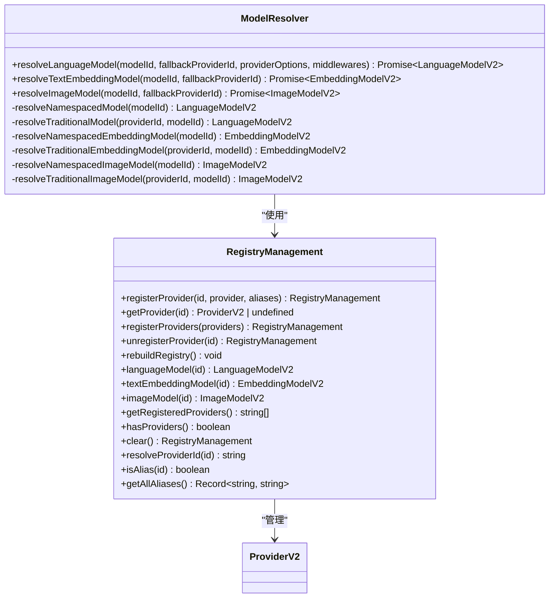
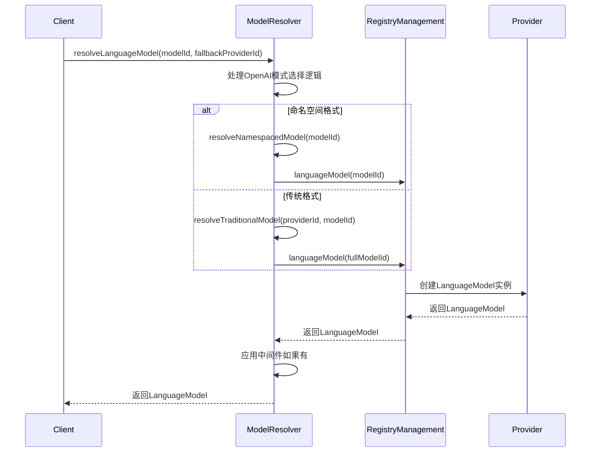
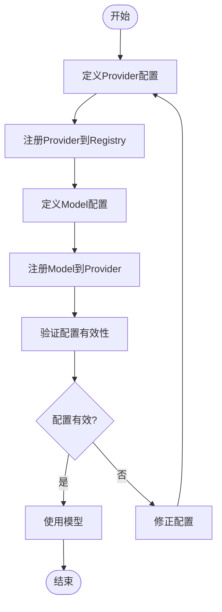
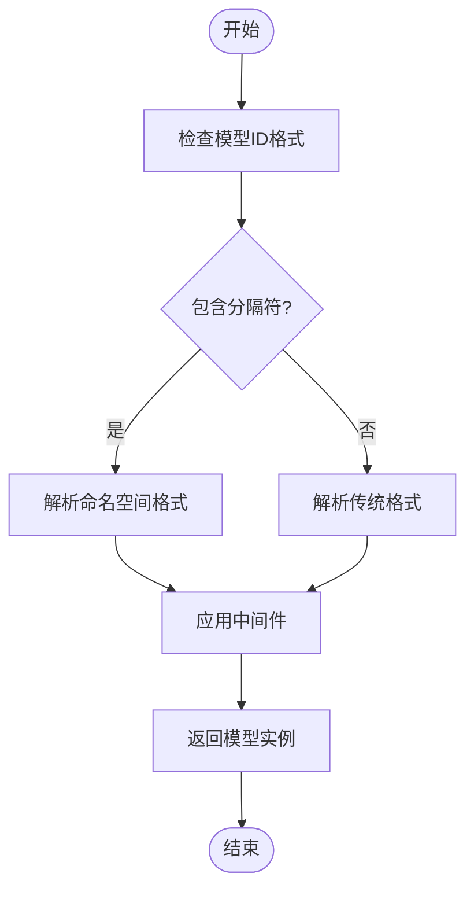
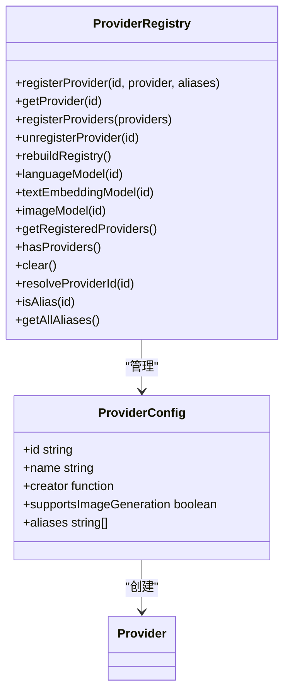
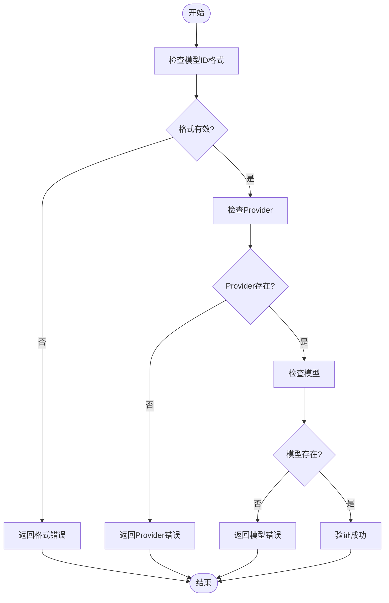
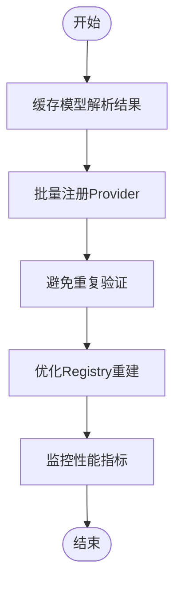

# 模型管理

<cite>
**本文档引用的文件**  
- [ModelResolver.ts](file://packages/aiCore/src/core/models/ModelResolver.ts)
- [types.ts](file://packages/aiCore/src/core/models/types.ts)
- [RegistryManagement.ts](file://packages/aiCore/src/core/providers/RegistryManagement.ts)
- [schemas.ts](file://packages/aiCore/src/core/providers/schemas.ts)
- [models.ts](file://src/main/apiServer/services/models.ts)
- [index.ts](file://src/renderer/src/config/models/index.ts)
</cite>

## 目录
1. [引言](#引言)
2. [模型解析器设计](#模型解析器设计)
3. [模型注册与发现机制](#模型注册与发现机制)
4. [类型安全的模型定义系统](#类型安全的模型定义系统)
5. [模型配置示例](#模型配置示例)
6. [动态解析策略](#动态解析策略)
7. [Provider Registry集成](#provider-registry集成)
8. [常见配置错误](#常见配置错误)
9. [性能优化建议](#性能优化建议)

## 引言

模型管理子系统是AI Core模块的核心组件，负责模型的注册、发现、解析和路由。该系统通过ModelResolver类作为核心组件，实现了高效的模型解析和路由功能。系统支持传统格式和命名空间格式的模型ID，能够根据配置和元数据匹配最优模型。本文档将深入分析ModelResolver类的设计与实现，阐述其作为模型解析和路由核心组件的作用。

**Section sources**
- [ModelResolver.ts](file://packages/aiCore/src/core/models/ModelResolver.ts)

## 模型解析器设计

ModelResolver类是模型管理子系统的核心，负责将模型ID解析为AI SDK的LanguageModel实例。该类支持传统格式（如'gpt-4'）和命名空间格式（如'anthropic>claude-3'）的模型ID解析。



**Diagram sources**
- [ModelResolver.ts](file://packages/aiCore/src/core/models/ModelResolver.ts)
- [RegistryManagement.ts](file://packages/aiCore/src/core/providers/RegistryManagement.ts)

**Section sources**
- [ModelResolver.ts](file://packages/aiCore/src/core/models/ModelResolver.ts)
- [RegistryManagement.ts](file://packages/aiCore/src/core/providers/RegistryManagement.ts)

## 模型注册与发现机制

模型注册与发现机制通过Provider Registry实现，支持基础Provider和自定义Provider的注册。系统使用RegistryManagement类管理已注册的Provider实例，提供存储和检索功能。



**Diagram sources**
- [ModelResolver.ts](file://packages/aiCore/src/core/models/ModelResolver.ts)
- [RegistryManagement.ts](file://packages/aiCore/src/core/providers/RegistryManagement.ts)

**Section sources**
- [ModelResolver.ts](file://packages/aiCore/src/core/models/ModelResolver.ts)
- [RegistryManagement.ts](file://packages/aiCore/src/core/providers/RegistryManagement.ts)

## 类型安全的模型定义系统

类型安全的模型定义系统通过ModelConfig接口实现，确保模型配置的类型安全。系统支持模型能力标记（如vision、tool-use、reasoning等）的处理逻辑。

```mermaid
classDiagram
class ModelConfig {
+providerId ProviderId
+modelId string
+providerSettings ProviderSettingsMap[T] & { mode? : 'chat' | 'responses' }
+middlewares LanguageModelV2Middleware[]
+extraModelConfig Record~string, any~
}
class ProviderId {
+baseProviderIds string[]
+customProviderIdSchema z.ZodString
+providerIdSchema z.ZodUnion
}
class ModelCapability {
+type 'vision' | 'tool-use' | 'reasoning' | 'embedding' | 'rerank' | 'web_search' | 'function_calling'
+isUserSelected boolean
}
ModelConfig --> ProviderId : "使用"
ModelConfig --> ModelCapability : "包含"
```

**Diagram sources**
- [types.ts](file://packages/aiCore/src/core/models/types.ts)
- [schemas.ts](file://packages/aiCore/src/core/providers/schemas.ts)

**Section sources**
- [types.ts](file://packages/aiCore/src/core/models/types.ts)
- [schemas.ts](file://packages/aiCore/src/core/providers/schemas.ts)

## 模型配置示例

模型配置示例展示了如何定义和注册模型。系统支持通过ProviderConfig配置Provider，并使用ModelConfig定义模型。



**Diagram sources**
- [schemas.ts](file://packages/aiCore/src/core/providers/schemas.ts)
- [RegistryManagement.ts](file://packages/aiCore/src/core/providers/RegistryManagement.ts)

**Section sources**
- [schemas.ts](file://packages/aiCore/src/core/providers/schemas.ts)
- [RegistryManagement.ts](file://packages/aiCore/src/core/providers/RegistryManagement.ts)

## 动态解析策略

动态解析策略通过ModelResolver的resolveLanguageModel方法实现，根据模型ID格式选择不同的解析路径。系统支持命名空间格式和传统格式的模型ID解析。



**Diagram sources**
- [ModelResolver.ts](file://packages/aiCore/src/core/models/ModelResolver.ts)

**Section sources**
- [ModelResolver.ts](file://packages/aiCore/src/core/models/ModelResolver.ts)

## Provider Registry集成

Provider Registry集成通过RegistryManagement类实现，提供Provider的注册、管理和检索功能。系统支持别名机制，允许为Provider配置别名。



**Diagram sources**
- [RegistryManagement.ts](file://packages/aiCore/src/core/providers/RegistryManagement.ts)
- [schemas.ts](file://packages/aiCore/src/core/providers/schemas.ts)

**Section sources**
- [RegistryManagement.ts](file://packages/aiCore/src/core/providers/RegistryManagement.ts)
- [schemas.ts](file://packages/aiCore/src/core/providers/schemas.ts)

## 常见配置错误

常见配置错误包括模型ID格式错误、Provider未注册、模型不存在等。系统通过validateModelId函数验证模型ID的有效性。



**Diagram sources**
- [models.ts](file://src/main/apiServer/services/models.ts)
- [index.ts](file://src/renderer/src/config/models/index.ts)

**Section sources**
- [models.ts](file://src/main/apiServer/services/models.ts)
- [index.ts](file://src/renderer/src/config/models/index.ts)

## 性能优化建议

性能优化建议包括缓存模型解析结果、批量注册Provider、避免重复验证等。系统通过rebuildRegistry方法优化Registry重建性能。



**Diagram sources**
- [RegistryManagement.ts](file://packages/aiCore/src/core/providers/RegistryManagement.ts)
- [ModelResolver.ts](file://packages/aiCore/src/core/models/ModelResolver.ts)

**Section sources**
- [RegistryManagement.ts](file://packages/aiCore/src/core/providers/RegistryManagement.ts)
- [ModelResolver.ts](file://packages/aiCore/src/core/models/ModelResolver.ts)