# 运行时执行

<cite>
**本文档引用的文件**   
- [executor.ts](file://packages/aiCore/src/core/runtime/executor.ts)
- [pluginEngine.ts](file://packages/aiCore/src/core/runtime/pluginEngine.ts)
- [types.ts](file://packages/aiCore/src/core/runtime/types.ts)
- [errors.ts](file://packages/aiCore/src/core/runtime/errors.ts)
- [manager.ts](file://packages/aiCore/src/core/plugins/manager.ts)
- [types.ts](file://packages/aiCore/src/core/plugins/types.ts)
</cite>

## 目录
1. [引言](#引言)
2. [核心架构](#核心架构)
3. [执行器核心实现](#执行器核心实现)
4. [核心方法调用流程](#核心方法调用流程)
5. [插件引擎机制](#插件引擎机制)
6. [错误处理机制](#错误处理机制)
7. [执行上下文管理](#执行上下文管理)
8. [性能监控与类型系统](#性能监控与类型系统)

## 引言
运行时执行子系统是AI Core模块的核心组件，负责处理所有AI模型的请求调度和响应处理。该子系统通过executor.ts中的RuntimeExecutor类实现，作为请求调度和响应处理的中枢，为上层应用提供统一的AI调用接口。本文档将深入分析该子系统的实现细节，包括核心方法的调用流程、插件引擎的注入机制、错误处理策略以及执行上下文管理。

## 核心架构
运行时执行子系统采用分层架构设计，主要由RuntimeExecutor（执行器）和PluginEngine（插件引擎）两个核心组件构成。执行器作为外部调用的入口，封装了所有AI调用方法；插件引擎则负责在执行过程中注入中间件逻辑，实现功能扩展和流程控制。

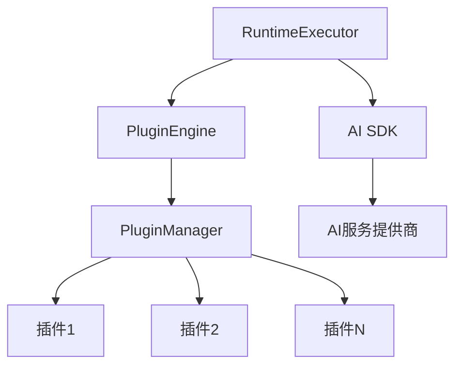

**图表来源**
- [executor.ts](file://packages/aiCore/src/core/runtime/executor.ts#L30-L311)
- [pluginEngine.ts](file://packages/aiCore/src/core/runtime/pluginEngine.ts#L19-L304)

## 执行器核心实现
RuntimeExecutor类是运行时执行子系统的核心，它通过插件化的方式处理AI调用请求。执行器的实现遵循单一职责原则，专注于请求的调度和响应的处理，而将扩展功能交由插件引擎处理。

### 构造函数与初始化
执行器在初始化时接收运行时配置，包括提供商ID、提供商设置和插件列表。这些配置决定了执行器的行为和功能。

**代码段来源**
- [executor.ts](file://packages/aiCore/src/core/runtime/executor.ts#L35-L45)

### 内部辅助方法
执行器包含多个私有辅助方法，用于处理模型解析和上下文配置。这些方法通过插件机制实现，确保了灵活性和可扩展性。

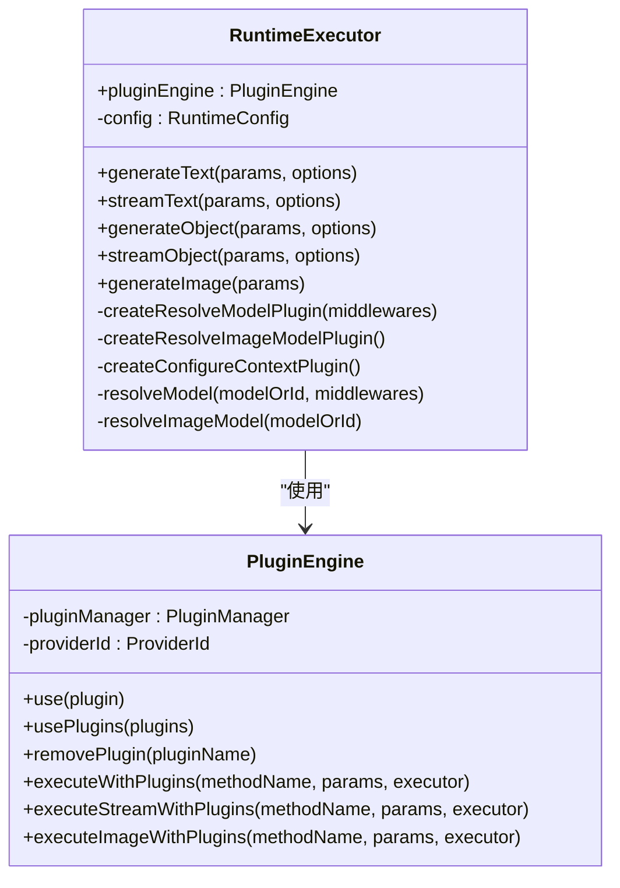

**图表来源**
- [executor.ts](file://packages/aiCore/src/core/runtime/executor.ts#L30-L311)
- [pluginEngine.ts](file://packages/aiCore/src/core/runtime/pluginEngine.ts#L19-L304)

## 核心方法调用流程
运行时执行子系统提供了多种AI调用方法，包括同步和流式调用。这些方法的调用流程遵循统一的模式，确保了一致性和可预测性。

### generateText方法
generateText方法用于生成文本内容，是系统中最常用的AI调用方法之一。该方法的调用流程包括参数验证、插件处理、模型解析、请求执行和结果返回。

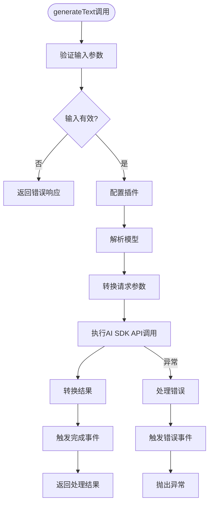

**图表来源**
- [executor.ts](file://packages/aiCore/src/core/runtime/executor.ts#L123-L146)
- [pluginEngine.ts](file://packages/aiCore/src/core/runtime/pluginEngine.ts#L72-L144)

### streamText方法
streamText方法用于流式文本生成，支持实时响应和渐进式内容输出。该方法的调用流程与generateText类似，但增加了流转换器的处理。

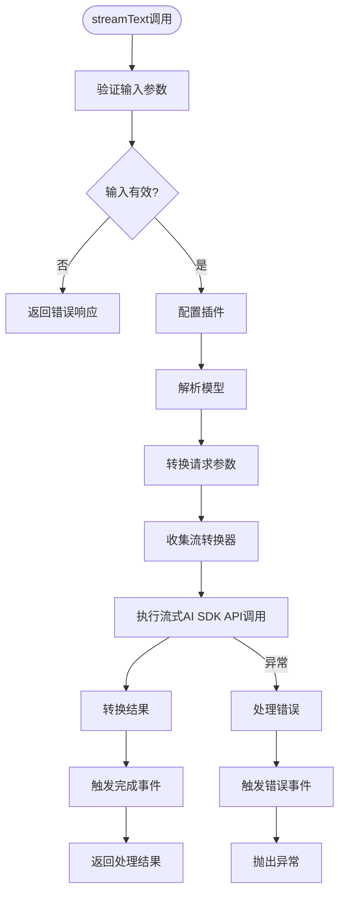

**图表来源**
- [executor.ts](file://packages/aiCore/src/core/runtime/executor.ts#L84-L116)
- [pluginEngine.ts](file://packages/aiCore/src/core/runtime/pluginEngine.ts#L228-L302)

### generateImage方法
generateImage方法用于生成图像内容，其调用流程与其他方法类似，但针对图像生成进行了专门的错误处理。

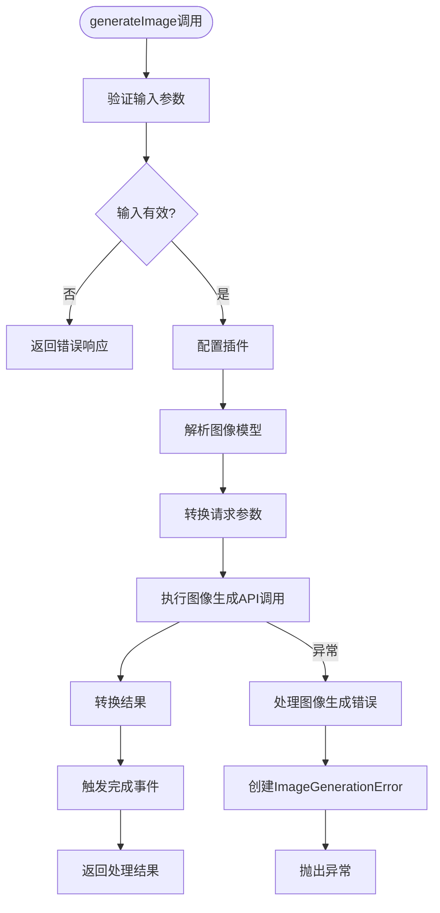

**图表来源**
- [executor.ts](file://packages/aiCore/src/core/runtime/executor.ts#L205-L231)
- [pluginEngine.ts](file://packages/aiCore/src/core/runtime/pluginEngine.ts#L150-L222)

## 插件引擎机制
插件引擎是运行时执行子系统的核心扩展机制，它允许在不修改核心代码的情况下添加新的功能和行为。

### 插件生命周期
插件引擎定义了完整的插件生命周期，包括请求开始、参数转换、结果转换和请求结束等阶段。每个阶段都有相应的钩子函数，插件可以通过实现这些钩子来注入自定义逻辑。

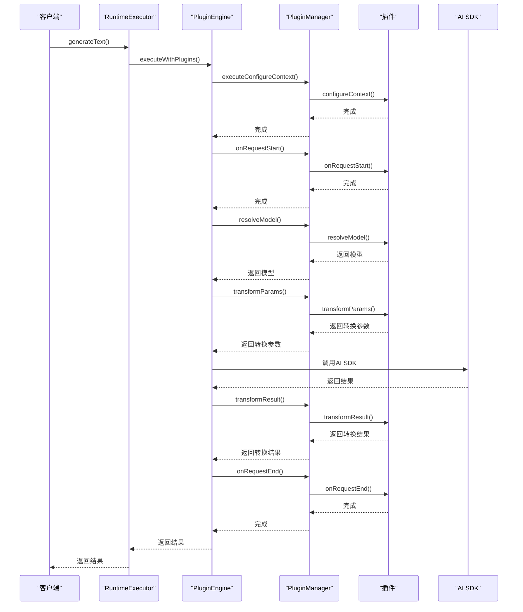

**图表来源**
- [pluginEngine.ts](file://packages/aiCore/src/core/runtime/pluginEngine.ts#L72-L144)
- [manager.ts](file://packages/aiCore/src/core/plugins/manager.ts#L6-L185)

### 插件类型与执行顺序
插件引擎支持多种类型的插件，包括前置插件（pre）、普通插件（normal）和后置插件（post）。这些插件按照特定的顺序执行，确保了逻辑的一致性和可预测性。

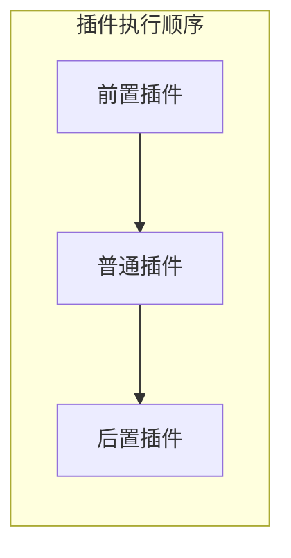

**图表来源**
- [manager.ts](file://packages/aiCore/src/core/plugins/manager.ts#L32-L48)

## 错误处理机制
运行时执行子系统实现了完善的错误处理机制，确保了系统的稳定性和可靠性。

### 错误分类
系统定义了多种错误类型，包括图像生成错误（ImageGenerationError）和图像模型解析错误（ImageModelResolutionError）。这些错误类型继承自标准的Error类，并添加了特定的属性。

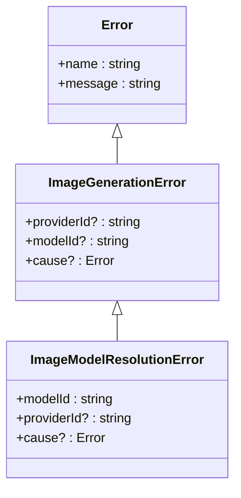

**图表来源**
- [errors.ts](file://packages/aiCore/src/core/runtime/errors.ts#L8-L38)

### 错误处理流程
当发生错误时，系统会触发onError插件钩子，允许插件对错误进行处理或记录。然后，错误会被重新抛出，供上层调用者处理。

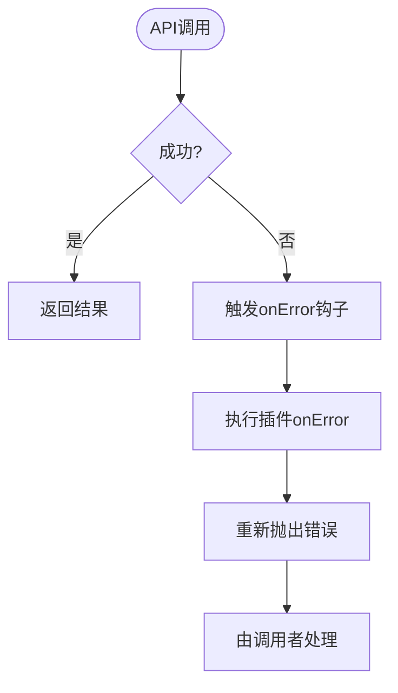

**图表来源**
- [pluginEngine.ts](file://packages/aiCore/src/core/runtime/pluginEngine.ts#L140-L143)
- [executor.ts](file://packages/aiCore/src/core/runtime/executor.ts#L219-L230)

## 执行上下文管理
执行上下文是运行时执行子系统中的重要概念，它在请求的整个生命周期中传递相关信息。

### 上下文结构
执行上下文包含了请求的元数据，如提供商ID、模型、原始参数、开始时间、请求ID等。这些信息对于插件的正常工作至关重要。

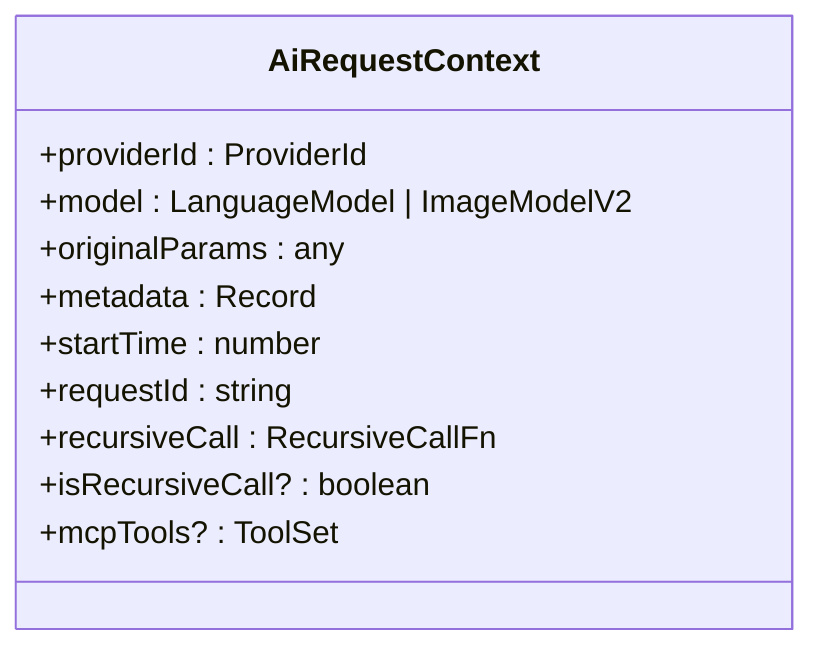

**图表来源**
- [types.ts](file://packages/aiCore/src/core/plugins/types.ts#L15-L26)

### 上下文生命周期
执行上下文在请求开始时创建，在请求结束时销毁。在整个请求处理过程中，上下文可以被插件修改和扩展。

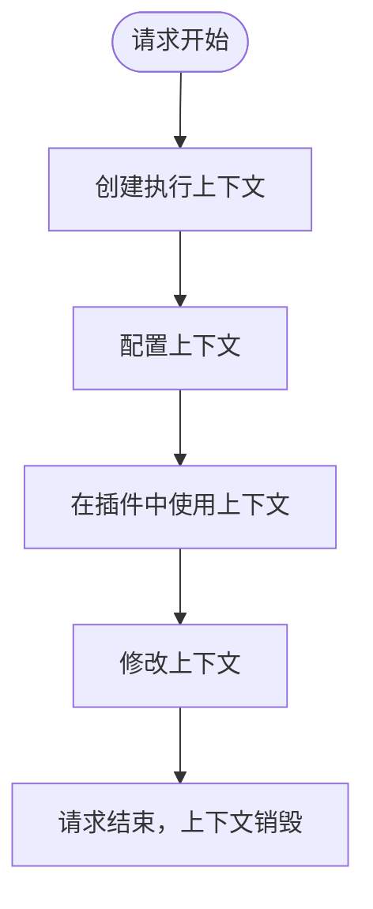

**图表来源**
- [pluginEngine.ts](file://packages/aiCore/src/core/runtime/pluginEngine.ts#L95-L98)
- [types.ts](file://packages/aiCore/src/core/plugins/types.ts#L15-L26)

## 性能监控与类型系统
运行时执行子系统通过类型系统和性能监控点确保了输入输出的一致性和系统的可观察性。

### 类型系统
系统使用TypeScript的类型系统来确保API调用的类型安全。通过泛型和接口定义，系统能够提供精确的类型检查和代码补全。

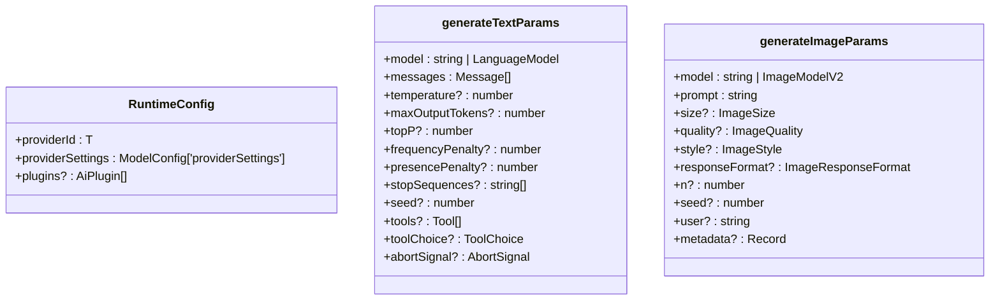

**图表来源**
- [types.ts](file://packages/aiCore/src/core/runtime/types.ts#L14-L27)
- [types.ts](file://packages/aiCore/src/core/plugins/types.ts#L31-L63)

### 性能监控
系统在关键位置设置了性能监控点，包括请求开始时间、执行时间等。这些监控点为性能分析和优化提供了数据支持。

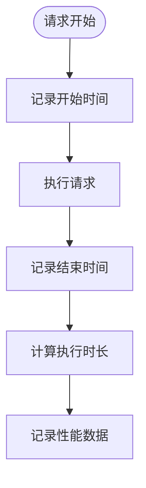

**图表来源**
- [types.ts](file://packages/aiCore/src/core/plugins/types.ts#L21)
- [pluginEngine.ts](file://packages/aiCore/src/core/runtime/pluginEngine.ts#L95)