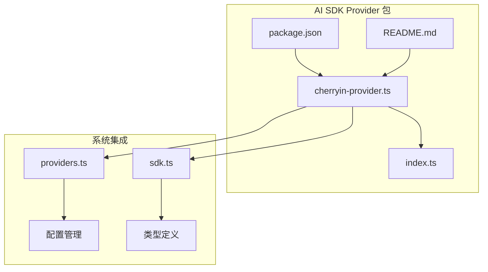
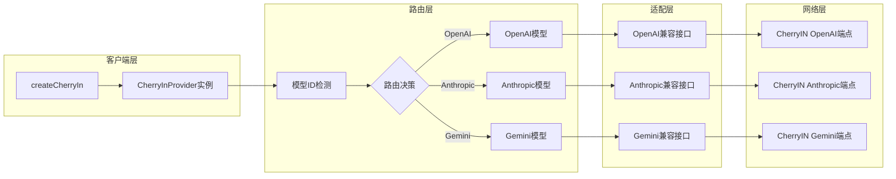
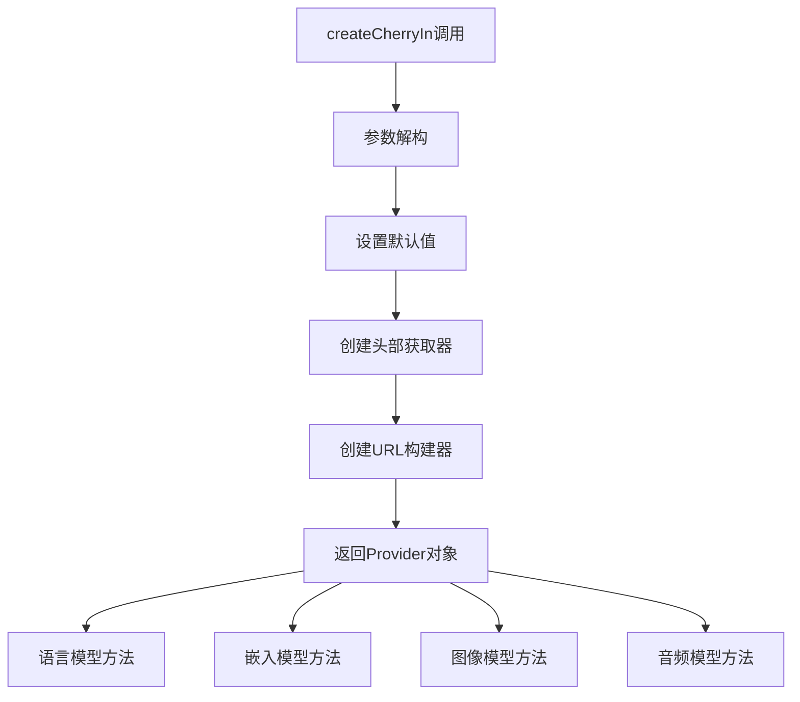
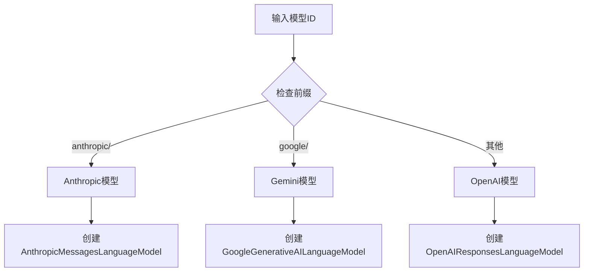
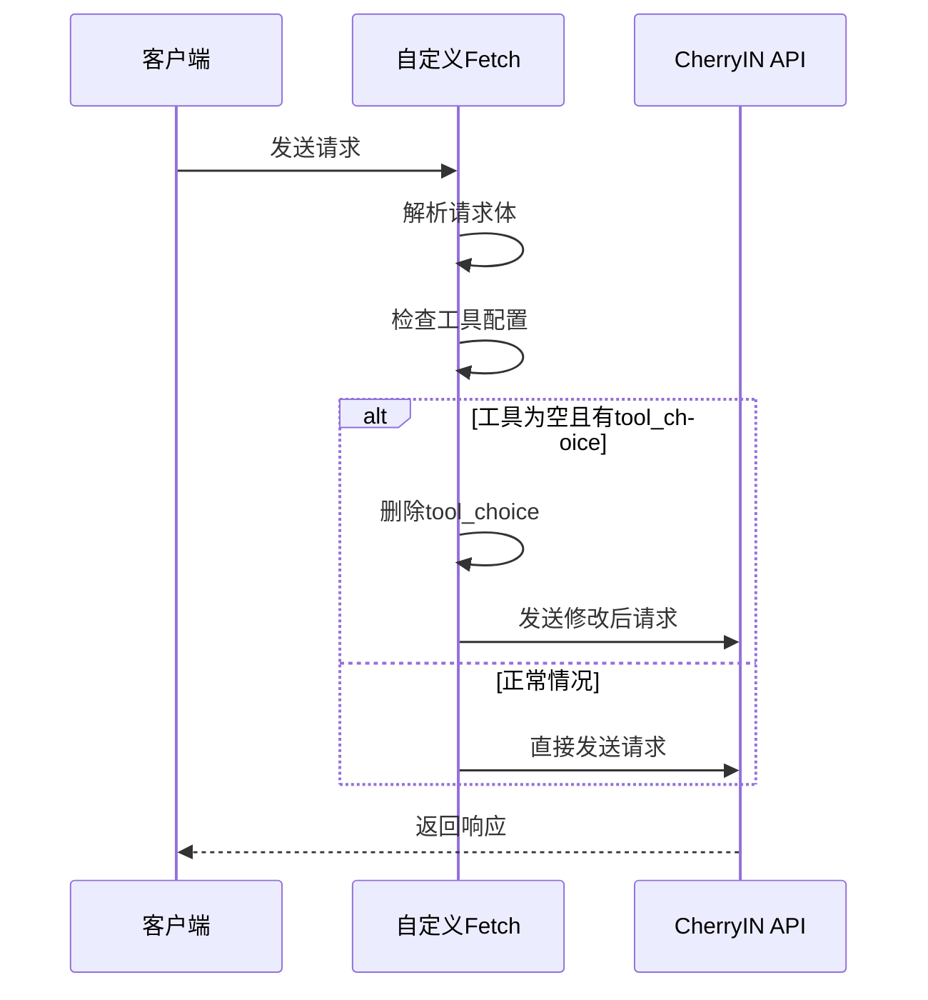
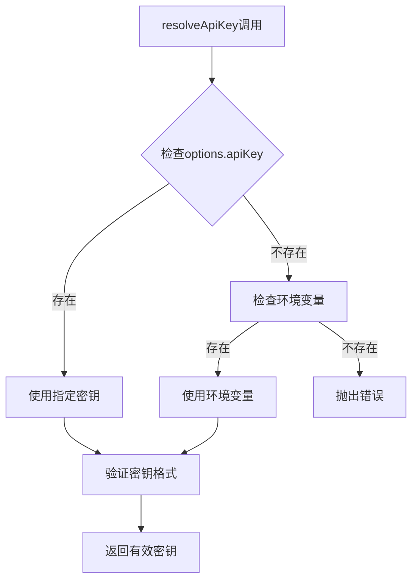
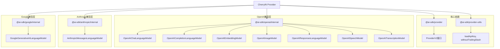

# AI SDK Provider 模块

<cite>
**本文档中引用的文件**
- [packages/ai-sdk-provider/src/cherryin-provider.ts](file://packages/ai-sdk-provider/src/cherryin-provider.ts)
- [packages/ai-sdk-provider/src/index.ts](file://packages/ai-sdk-provider/src/index.ts)
- [packages/ai-sdk-provider/package.json](file://packages/ai-sdk-provider/package.json)
- [packages/ai-sdk-provider/README.md](file://packages/ai-sdk-provider/README.md)
- [src/renderer/src/config/providers.ts](file://src/renderer/src/config/providers.ts)
- [src/renderer/src/types/sdk.ts](file://src/renderer/src/types/sdk.ts)
</cite>

## 目录
1. [简介](#简介)
2. [项目结构](#项目结构)
3. [核心组件](#核心组件)
4. [架构概览](#架构概览)
5. [详细组件分析](#详细组件分析)
6. [依赖关系分析](#依赖关系分析)
7. [性能考虑](#性能考虑)
8. [故障排除指南](#故障排除指南)
9. [结论](#结论)

## 简介

CherryIN Provider模块是Vercel AI SDK的一个捆绑包提供商，专门设计用于与CherryIN平台集成。该模块通过暴露OpenAI兼容的入口点，并智能地将Anthropic和Gemini模型ID动态路由到CherryIN上游等效项，为开发者提供统一的AI服务访问接口。

### 主要特性

- **统一API接口**：通过单一提供商接口访问多种AI服务
- **智能模型路由**：基于模型ID前缀自动路由到对应的服务端点
- **多格式支持**：支持聊天、完成、嵌入、图像生成、转录和语音合成等多种AI功能
- **灵活配置**：提供丰富的配置选项以适应不同的部署需求
- **错误处理**：内置完善的错误处理和环境变量管理机制

## 项目结构

**图表来源**
- [packages/ai-sdk-provider/src/cherryin-provider.ts](file://packages/ai-sdk-provider/src/cherryin-provider.ts#L1-L349)
- [packages/ai-sdk-provider/src/index.ts](file://packages/ai-sdk-provider/src/index.ts#L1-L2)

**章节来源**
- [packages/ai-sdk-provider/src/cherryin-provider.ts](file://packages/ai-sdk-provider/src/cherryin-provider.ts#L1-L349)
- [packages/ai-sdk-provider/package.json](file://packages/ai-sdk-provider/package.json#L1-L65)

## 核心组件

### CherryInProvider 接口

CherryInProvider接口扩展了标准的ProviderV2，提供了以下核心方法：

- **语言模型方法**：`languageModel()`、`chat()`、`completion()`、`responses()`
- **嵌入模型方法**：`embedding()`、`textEmbedding()`、`textEmbeddingModel()`
- **图像模型方法**：`image()`、`imageModel()`
- **音频模型方法**：`transcription()`、`transcriptionModel()`、`speech()`、`speechModel()`

### 配置选项

CherryInProviderSettings接口定义了所有可配置的选项：

| 参数名 | 类型 | 默认值 | 描述 |
|--------|------|--------|------|
| `apiKey` | `string` | `undefined` | CherryIN API密钥，如果省略则从环境变量读取 |
| `fetch` | `FetchFunction` | `undefined` | 可选的自定义fetch实现 |
| `baseURL` | `string` | `'https://open.cherryin.net/v1'` | OpenAI兼容CherryIN端点的基础URL |
| `anthropicBaseURL` | `string` | `'https://open.cherryin.net/v1'` | Anthropic兼容端点的基础URL |
| `geminiBaseURL` | `string` | `'https://open.cherryin.net/v1beta/models'` | Gemini兼容端点的基础URL |
| `headers` | `HeadersInput` | `undefined` | 应用于每个请求的静态头部 |
| `endpointType` | `'openai' \| 'openai-response' \| 'anthropic' \| 'gemini' \| 'image-generation' \| 'jina-rerank'` | `undefined` | 可选的端点类型区分 |

**章节来源**
- [packages/ai-sdk-provider/src/cherryin-provider.ts](file://packages/ai-sdk-provider/src/cherryin-provider.ts#L37-L75)
- [packages/ai-sdk-provider/src/cherryin-provider.ts](file://packages/ai-sdk-provider/src/cherryin-provider.ts#L77-L92)

## 架构概览

**图表来源**
- [packages/ai-sdk-provider/src/cherryin-provider.ts](file://packages/ai-sdk-provider/src/cherryin-provider.ts#L214-L253)
- [packages/ai-sdk-provider/src/cherryin-provider.ts](file://packages/ai-sdk-provider/src/cherryin-provider.ts#L168-L201)

## 详细组件分析

### createCherryIn 函数

createCherryIn函数是整个模块的核心工厂函数，负责创建CherryInProvider实例。

#### 函数签名和参数处理

**图表来源**
- [packages/ai-sdk-provider/src/cherryin-provider.ts](file://packages/ai-sdk-provider/src/cherryin-provider.ts#L154-L166)
- [packages/ai-sdk-provider/src/cherryin-provider.ts](file://packages/ai-sdk-provider/src/cherryin-provider.ts#L318-L346)

#### 模型路由机制

模块实现了智能的模型ID前缀检测机制：

**图表来源**
- [packages/ai-sdk-provider/src/cherryin-provider.ts](file://packages/ai-sdk-provider/src/cherryin-provider.ts#L101-L102)
- [packages/ai-sdk-provider/src/cherryin-provider.ts](file://packages/ai-sdk-provider/src/cherryin-provider.ts#L214-L229)

### 辅助函数详解

#### 头部处理函数

模块提供了两个关键的头部处理函数：

1. **createJsonHeadersGetter**：用于需要JSON内容类型的请求
2. **createAuthHeadersGetter**：用于认证相关的请求

这些函数确保每次请求都包含正确的认证信息和内容类型。

#### 自定义Fetch处理

模块实现了自定义的fetch处理逻辑，特别针对工具调用进行了优化：

**图表来源**
- [packages/ai-sdk-provider/src/cherryin-provider.ts](file://packages/ai-sdk-provider/src/cherryin-provider.ts#L104-L119)

**章节来源**
- [packages/ai-sdk-provider/src/cherryin-provider.ts](file://packages/ai-sdk-provider/src/cherryin-provider.ts#L139-L153)
- [packages/ai-sdk-provider/src/cherryin-provider.ts](file://packages/ai-sdk-provider/src/cherryin-provider.ts#L104-L119)

### 错误处理和环境变量管理

#### API密钥加载机制

**图表来源**
- [packages/ai-sdk-provider/src/cherryin-provider.ts](file://packages/ai-sdk-provider/src/cherryin-provider.ts#L94-L99)

#### 环境变量配置

模块支持以下环境变量：
- `CHERRYIN_API_KEY`：CherryIN API密钥（推荐方式）
- `CHERRYIN_BASE_URL`：自定义基础URL（通过配置覆盖）

**章节来源**
- [packages/ai-sdk-provider/src/cherryin-provider.ts](file://packages/ai-sdk-provider/src/cherryin-provider.ts#L94-L99)

## 依赖关系分析

### 外部依赖

**图表来源**
- [packages/ai-sdk-provider/src/cherryin-provider.ts](file://packages/ai-sdk-provider/src/cherryin-provider.ts#L1-L12)
- [packages/ai-sdk-provider/package.json](file://packages/ai-sdk-provider/package.json#L37-L46)

### 内部模块依赖

模块采用简洁的设计，主要依赖于外部AI SDK库，内部只包含必要的类型定义和配置常量。

**章节来源**
- [packages/ai-sdk-provider/package.json](file://packages/ai-sdk-provider/package.json#L37-L46)

## 性能考虑

### 请求优化

1. **连接复用**：通过自定义fetch实现支持HTTP/2和连接池
2. **缓存策略**：合理利用浏览器和CDN缓存
3. **并发控制**：避免过多并发请求导致的性能问题

### 内存管理

- 使用工厂模式减少内存占用
- 及时清理不再使用的模型实例
- 合理配置超时和重试机制

### 网络优化

- 支持自定义fetch实现以优化网络行为
- 提供代理和负载均衡支持
- 实现智能重试机制

## 故障排除指南

### 常见问题和解决方案

#### API密钥问题

**问题**：`Missing API key` 或 `Invalid API key`

**解决方案**：
1. 确保正确设置了`CHERRYIN_API_KEY`环境变量
2. 检查API密钥格式是否正确
3. 验证API密钥是否有足够的权限

#### 路由问题

**问题**：模型ID无法正确路由

**解决方案**：
1. 确认模型ID前缀符合预期格式
2. 检查`endpointType`配置是否正确
3. 验证基础URL配置是否正确

#### 网络连接问题

**问题**：请求超时或连接失败

**解决方案**：
1. 检查网络连接状态
2. 验证防火墙设置
3. 尝试使用自定义fetch实现

### 调试技巧

1. **启用详细日志**：在开发环境中启用详细的请求日志
2. **检查网络请求**：使用浏览器开发者工具监控网络请求
3. **验证响应格式**：确保响应数据格式符合预期

**章节来源**
- [packages/ai-sdk-provider/src/cherryin-provider.ts](file://packages/ai-sdk-provider/src/cherryin-provider.ts#L94-L99)

## 结论

CherryIN Provider模块为Vercel AI SDK提供了一个强大而灵活的集成解决方案。通过智能的模型路由机制、完善的配置选项和robust的错误处理，它成功地将多个AI服务整合到一个统一的接口中。

### 主要优势

1. **简化集成**：开发者只需配置一次即可访问多种AI服务
2. **透明路由**：自动识别和路由不同类型的模型请求
3. **灵活配置**：丰富的配置选项满足各种部署需求
4. **性能优化**：内置的fetch优化和错误处理机制
5. **易于维护**：清晰的代码结构和完善的类型定义

### 最佳实践建议

1. **环境变量管理**：始终使用环境变量存储敏感信息
2. **错误处理**：实现完善的错误处理和用户反馈机制
3. **性能监控**：定期监控API调用性能和成功率
4. **版本管理**：保持与最新版本的同步
5. **安全考虑**：定期轮换API密钥，限制权限范围

这个模块为现代AI应用开发提供了一个可靠的基础，使得开发者能够专注于业务逻辑而非底层集成细节。