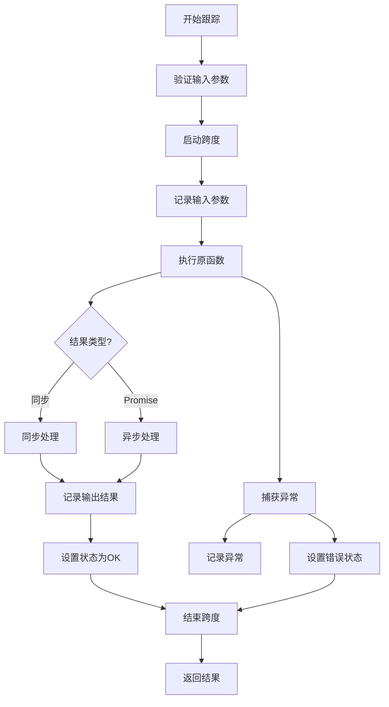
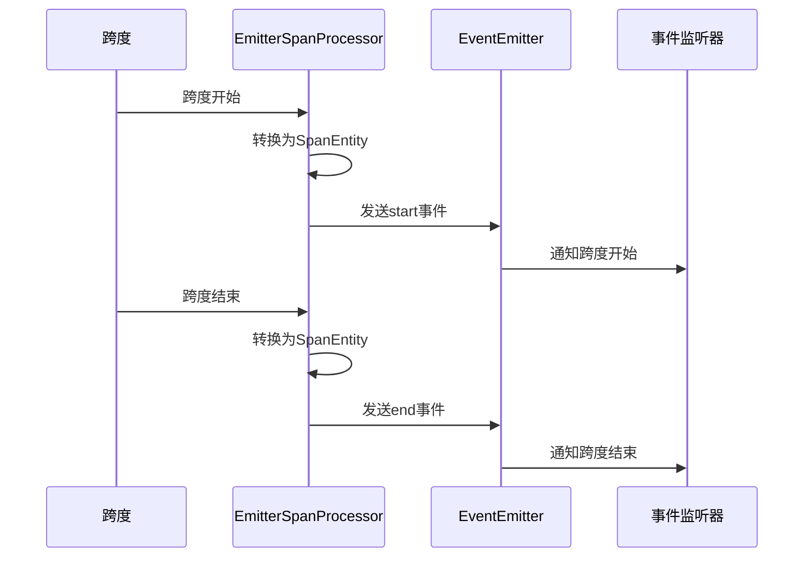
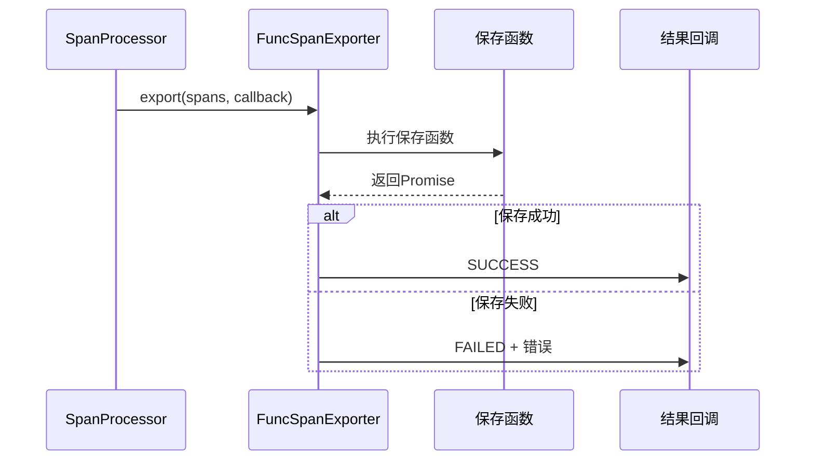
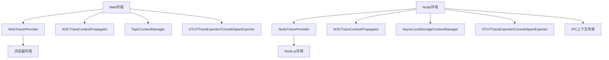
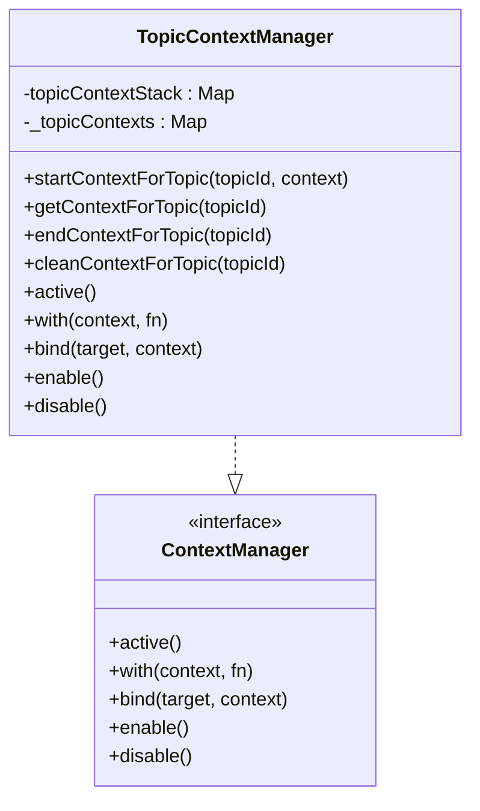
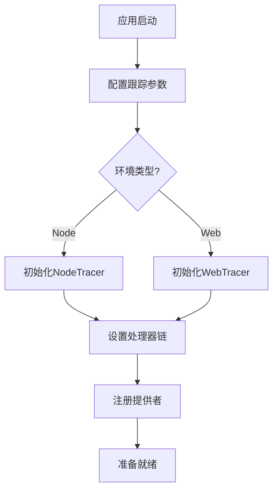

# MCP 跟踪模块

<cite>
**本文档中引用的文件**  
- [spanConvert.ts](file://packages/mcp-trace/trace-core/core/spanConvert.ts)
- [traceCache.ts](file://packages/mcp-trace/trace-core/core/traceCache.ts)
- [traceMethod.ts](file://packages/mcp-trace/trace-core/core/traceMethod.ts)
- [FuncSpanExporter.ts](file://packages/mcp-trace/trace-core/exporters/FuncSpanExporter.ts)
- [CacheSpanProcessor.ts](file://packages/mcp-trace/trace-core/processors/CacheSpanProcessor.ts)
- [EmitterSpanProcessor.ts](file://packages/mcp-trace/trace-core/processors/EmitterSpanProcessor.ts)
- [FuncSpanProcessor.ts](file://packages/mcp-trace/trace-core/processors/FuncSpanProcessor.ts)
- [config.ts](file://packages/mcp-trace/trace-core/types/config.ts)
- [webTracer.ts](file://packages/mcp-trace/trace-web/webTracer.ts)
- [TopicContextManager.ts](file://packages/mcp-trace/trace-web/TopicContextManager.ts)
- [nodeTracer.ts](file://packages/mcp-trace/trace-node/nodeTracer.ts)
- [NodeTraceService.ts](file://src/main/services/NodeTraceService.ts)
- [WebTraceService.ts](file://src/renderer/src/services/WebTraceService.ts)
</cite>

## 目录
1. [简介](#简介)
2. [核心功能实现](#核心功能实现)
3. [跟踪处理器体系结构](#跟踪处理器体系结构)
4. [数据导出机制](#数据导出机制)
5. [Web与Node环境差异](#web与node环境差异)
6. [上下文管理](#上下文管理)
7. [集成指南](#集成指南)
8. [性能监控策略](#性能监控策略)

## 简介
MCP跟踪模块为Cherry Studio应用提供完整的分布式跟踪能力，基于OpenTelemetry标准实现。该模块支持在Web和Node.js环境中进行跟踪数据采集、处理和导出，能够全面监控应用的性能特征和调用链路。模块通过装饰器、函数包装等机制简化跟踪代码的集成，同时提供灵活的处理器链和导出器配置，满足不同场景下的监控需求。

## 核心功能实现

### spanConvert功能
`spanConvert`模块提供了将OpenTelemetry SDK生成的`ReadableSpan`对象转换为应用特定的`SpanEntity`数据结构的功能。该转换过程包括跨度ID、跟踪ID、父跨度ID、名称、时间戳、属性、状态、事件、类型和链接等信息的映射。时间戳从纳秒精度转换为毫秒精度，状态码和跨度类型从数值转换为可读字符串，便于后续处理和展示。

**Section sources**
- [spanConvert.ts](file://packages/mcp-trace/trace-core/core/spanConvert.ts#L1-L27)

### traceCache功能
`traceCache`定义了跟踪缓存的接口规范，包含创建跨度、结束跨度和清除缓存三个基本操作。该接口为跟踪数据的临时存储提供了抽象层，允许不同的实现根据具体需求管理跟踪数据的生命周期。缓存机制对于在内存中暂存跟踪数据、支持实时监控和调试场景至关重要。

**Section sources**
- [traceCache.ts](file://packages/mcp-trace/trace-core/core/traceCache.ts#L1-L8)

### traceMethod功能
`traceMethod`模块提供了基于装饰器的跟踪功能，支持方法和属性级别的跟踪。通过`@TraceMethod`装饰器，开发者可以轻松地为类方法添加跟踪功能，自动记录方法的输入参数、输出结果和执行异常。模块还提供了`withSpanFunc`函数，用于包装普通函数并为其添加跟踪能力。跟踪数据包括输入输出的序列化表示，便于调试和性能分析。

**Diagram sources**
- [traceMethod.ts](file://packages/mcp-trace/trace-core/core/traceMethod.ts#L1-L164)

## 跟踪处理器体系结构

### CacheSpanProcessor
`CacheSpanProcessor`是基于OpenTelemetry的`BatchSpanProcessor`扩展的处理器，专门用于将跟踪数据缓存到指定的`TraceCache`实例中。当跨度开始时，处理器调用缓存的`createSpan`方法；当跨度结束时，调用`endSpan`方法。这种设计允许应用在内存中维护跟踪数据的完整生命周期，支持实时查看和调试。

**Section sources**
- [CacheSpanProcessor.ts](file://packages/mcp-trace/trace-core/processors/CacheSpanProcessor.ts#L1-L43)

### EmitterSpanProcessor
`EmitterSpanProcessor`是事件驱动的跟踪处理器，当跨度开始或结束时，通过Node.js的`EventEmitter`发出事件。处理器使用`spanConvert`功能将`ReadableSpan`转换为`SpanEntity`后再发送，支持`start`和`end`两种事件类型。这种机制便于在应用的不同部分订阅跟踪事件，实现灵活的监控和分析功能。

**Diagram sources**
- [EmitterSpanProcessor.ts](file://packages/mcp-trace/trace-core/processors/EmitterSpanProcessor.ts#L1-L30)

### FuncSpanProcessor
`FuncSpanProcessor`提供了函数回调式的跟踪处理器，允许开发者自定义跨度开始和结束时的处理逻辑。处理器接收两个函数参数：`start`函数在跨度开始时调用，`end`函数在跨度结束时调用。这种设计提供了最大的灵活性，适用于需要自定义处理逻辑的复杂场景。

**Section sources**
- [FuncSpanProcessor.ts](file://packages/mcp-trace/trace-core/processors/FuncSpanProcessor.ts#L1-L45)

## 数据导出机制

### FuncSpanExporter
`FuncSpanExporter`是函数式的跨度导出器，将跟踪数据导出到用户提供的保存函数中。导出器实现了OpenTelemetry的`SpanExporter`接口，当有批量跨度数据需要导出时，调用配置的`SaveFunction`。导出过程是异步的，支持Promise处理，成功时回调`SUCCESS`，失败时回调`FAILED`并传递错误信息。这种设计使得导出目标可以是任何支持函数调用的系统，如数据库、消息队列或外部API。

**Diagram sources**
- [FuncSpanExporter.ts](file://packages/mcp-trace/trace-core/exporters/FuncSpanExporter.ts#L1-L28)

## Web与Node环境差异

### Web环境实现
Web环境下的跟踪器`WebTracer`基于`WebTracerProvider`实现，使用`W3CTraceContextPropagator`进行上下文传播。当配置了端点时，使用`OTLPTraceExporter`将跟踪数据发送到远程收集器；否则使用`ConsoleSpanExporter`输出到控制台。Web环境的跟踪器与`TopicContextManager`集成，支持基于话题ID的上下文管理。

**Section sources**
- [webTracer.ts](file://packages/mcp-trace/trace-web/webTracer.ts#L1-L49)

### Node环境实现
Node环境下的跟踪器`NodeTracer`基于`NodeTracerProvider`实现，使用`AsyncLocalStorageContextManager`管理异步上下文。与Web环境类似，支持OTLP导出和控制台导出两种模式。Node环境的跟踪器在初始化时设置默认跟踪器，便于全局访问。通过`ipcMain.handle`的包装，实现了跨进程调用的跟踪上下文传递。

**Diagram sources**
- [nodeTracer.ts](file://packages/mcp-trace/trace-node/nodeTracer.ts#L1-L50)

## 上下文管理

### TopicContextManager
`TopicContextManager`是专门为话题上下文设计的上下文管理器，实现了OpenTelemetry的`ContextManager`接口。管理器使用`Map`数据结构维护话题ID到上下文的映射，支持为不同话题独立管理跟踪上下文。通过`startContextForTopic`、`getContextForTopic`、`endContextForTopic`和`cleanContextForTopic`等方法，实现了话题级别的上下文生命周期管理。管理器不支持全局活动上下文，要求显式传递上下文，避免了上下文污染问题。

**Diagram sources**
- [TopicContextManager.ts](file://packages/mcp-trace/trace-web/TopicContextManager.ts#L1-L77)

## 集成指南

### 初始化配置
在应用启动时初始化跟踪模块，配置服务名称、端点和默认跟踪器名称等参数。Node环境通过`NodeTraceService`初始化，Web环境通过`WebTracer`初始化。可以自定义处理器链，如使用`CacheBatchSpanProcessor`将数据缓存到`SpanCacheService`。

**Section sources**
- [NodeTraceService.ts](file://src/main/services/NodeTraceService.ts#L1-L123)
- [WebTraceService.ts](file://src/renderer/src/services/WebTraceService.ts)

### 跟踪范围定义
使用`@TraceMethod`装饰器或`withSpanFunc`函数定义需要跟踪的代码范围。对于类方法，直接在方法上添加装饰器；对于普通函数，使用`withSpanFunc`包装。可以通过参数指定跨度名称、跟踪器名称和标签，便于后续查询和分析。

**Section sources**
- [traceMethod.ts](file://packages/mcp-trace/trace-core/core/traceMethod.ts#L14-L164)

## 性能监控策略

### 数据采集策略
采用批量处理和异步导出的策略，减少对应用性能的影响。`BatchSpanProcessor`收集一定数量的跨度后一次性导出，避免频繁的I/O操作。导出过程在后台异步执行，不阻塞主线程。对于关键路径，可以使用`CacheSpanProcessor`在内存中暂存数据，支持实时监控。

### 资源管理
通过`TraceCache`接口抽象缓存实现，可以根据内存使用情况动态调整缓存策略。对于长时间运行的应用，建议定期清理过期的跟踪数据，防止内存泄漏。在生产环境中，可以配置采样率，只跟踪部分请求，平衡监控需求和性能开销。

### 错误处理
跟踪模块内置了完善的错误处理机制，捕获并记录跟踪过程中发生的异常。通过`recordException`方法记录异常详情，设置跨度状态为ERROR，便于问题排查。导出器的错误通过回调函数传递，允许应用根据错误类型采取相应的恢复措施。

**Section sources**
- [NodeTraceService.ts](file://src/main/services/NodeTraceService.ts#L1-L123)
- [WebTraceService.ts](file://src/renderer/src/services/WebTraceService.ts)