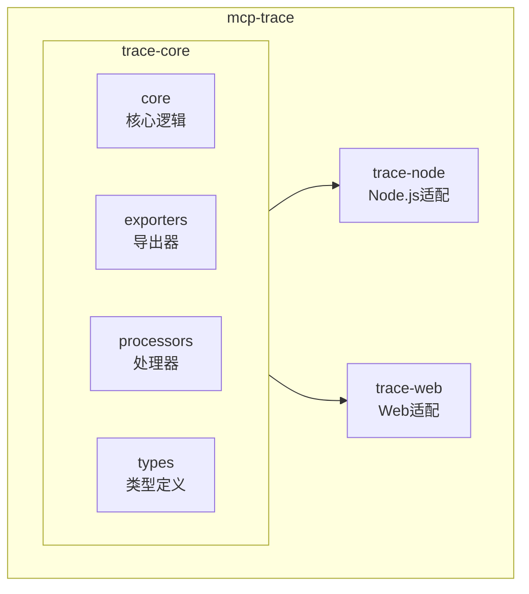
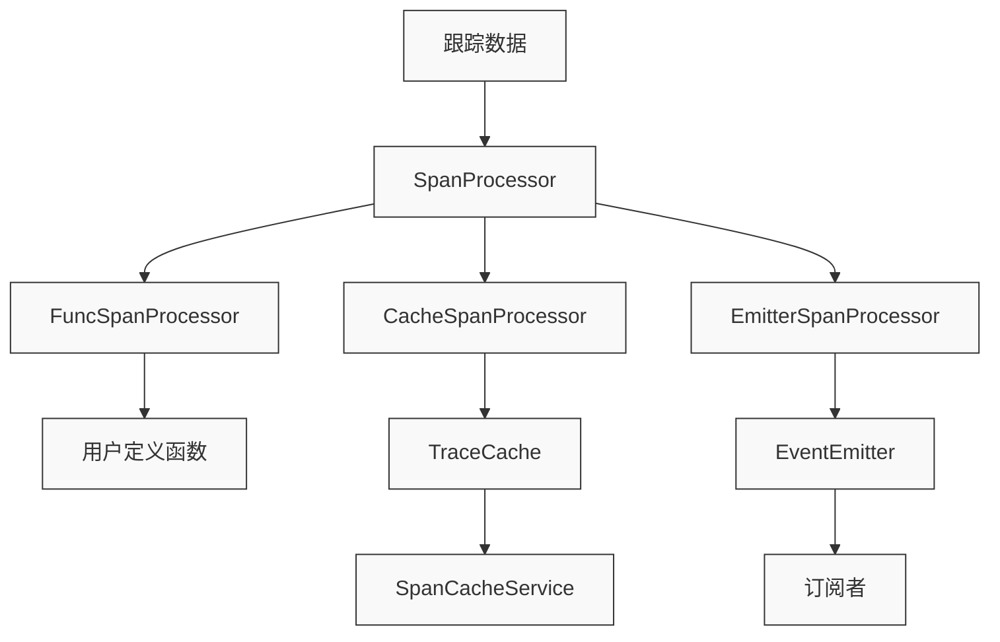
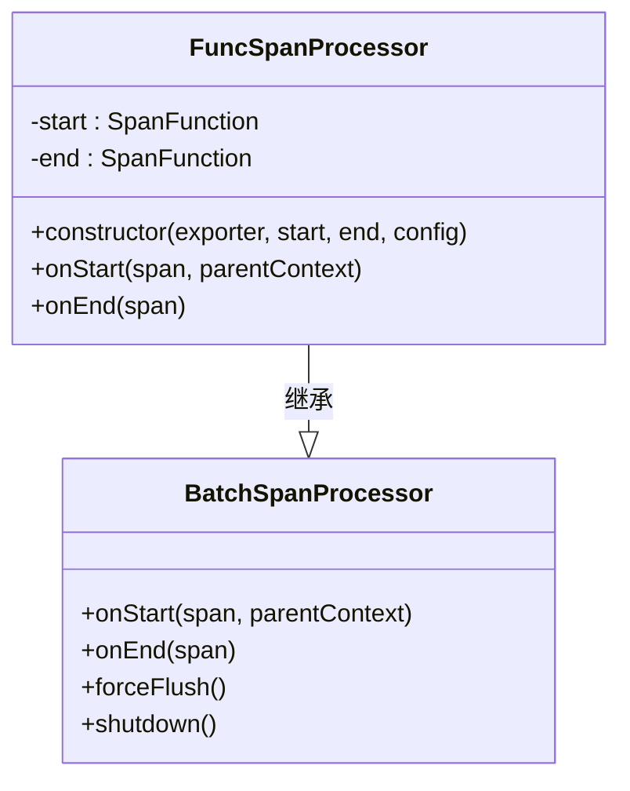
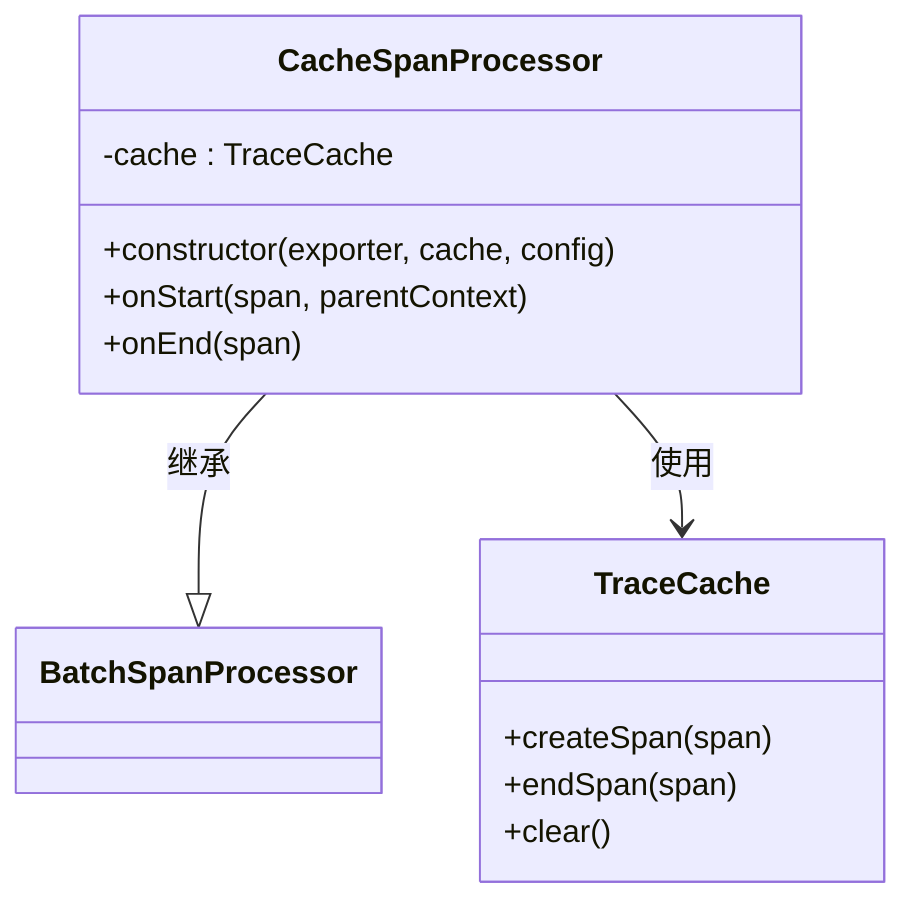
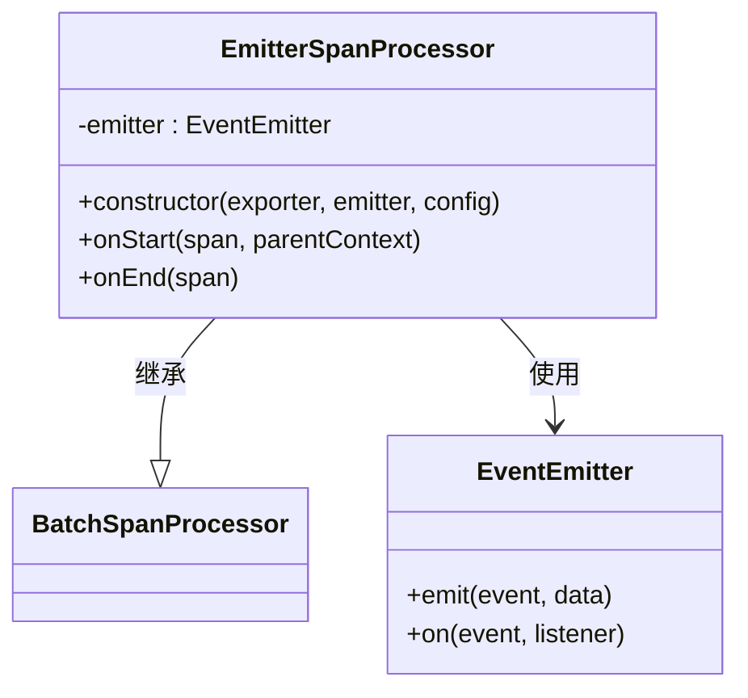
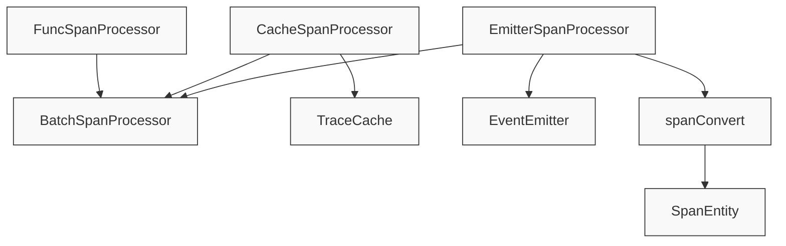

# 跟踪处理器

<cite>
**本文档中引用的文件**  
- [FuncSpanProcessor.ts](file://packages/mcp-trace/trace-core/processors/FuncSpanProcessor.ts)
- [CacheSpanProcessor.ts](file://packages/mcp-trace/trace-core/processors/CacheSpanProcessor.ts)
- [EmitterSpanProcessor.ts](file://packages/mcp-trace/trace-core/processors/EmitterSpanProcessor.ts)
- [spanConvert.ts](file://packages/mcp-trace/trace-core/core/spanConvert.ts)
- [traceCache.ts](file://packages/mcp-trace/trace-core/core/traceCache.ts)
- [config.ts](file://packages/mcp-trace/trace-core/types/config.ts)
- [FuncSpanExporter.ts](file://packages/mcp-trace/trace-core/exporters/FuncSpanExporter.ts)
- [nodeTracer.ts](file://packages/mcp-trace/trace-node/nodeTracer.ts)
- [NodeTraceService.ts](file://src/main/services/NodeTraceService.ts)
- [SpanCacheService.ts](file://src/main/services/SpanCacheService.ts)
</cite>

## 目录
1. [简介](#简介)
2. [项目结构](#项目结构)
3. [核心组件](#核心组件)
4. [架构概述](#架构概述)
5. [详细组件分析](#详细组件分析)
6. [依赖分析](#依赖分析)
7. [性能考虑](#性能考虑)
8. [故障排除指南](#故障排除指南)
9. [结论](#结论)

## 简介
本文档详细介绍了MCP跟踪处理器体系的实现机制。该体系基于OpenTelemetry标准构建，提供了三种核心处理器：FuncSpanProcessor、CacheSpanProcessor和EmitterSpanProcessor，用于处理分布式跟踪数据。这些处理器通过组合使用，实现了灵活的跟踪数据处理流水线，支持自定义处理逻辑、本地缓存和事件分发等功能，为系统的可观测性提供了坚实基础。

## 项目结构
MCP跟踪处理器体系位于`packages/mcp-trace`目录下，采用模块化设计，分为多个子包：

**图源**  
- [processors](file://packages/mcp-trace/trace-core/processors)
- [core](file://packages/mcp-trace/trace-core/core)

**本节来源**  
- [项目结构](file://project_structure)

## 核心组件
MCP跟踪处理器体系的核心组件包括三种处理器：FuncSpanProcessor用于执行用户定义的处理函数，CacheSpanProcessor用于实现跟踪数据的本地缓存，EmitterSpanProcessor用于将跟踪数据通过事件机制分发给订阅者。这些组件共同构成了一个灵活的跟踪数据处理流水线。

**本节来源**  
- [FuncSpanProcessor.ts](file://packages/mcp-trace/trace-core/processors/FuncSpanProcessor.ts)
- [CacheSpanProcessor.ts](file://packages/mcp-trace/trace-core/processors/CacheSpanProcessor.ts)
- [EmitterSpanProcessor.ts](file://packages/mcp-trace/trace-core/processors/EmitterSpanProcessor.ts)

## 架构概述
MCP跟踪处理器体系采用分层架构设计，各组件之间的关系如下：

**图源**  
- [nodeTracer.ts](file://packages/mcp-trace/trace-node/nodeTracer.ts)
- [SpanCacheService.ts](file://src/main/services/SpanCacheService.ts)

## 详细组件分析

### FuncSpanProcessor 分析
FuncSpanProcessor作为基础处理器，继承自OpenTelemetry的BatchSpanProcessor，允许用户定义在跟踪跨度开始和结束时执行的自定义函数。

**图源**  
- [FuncSpanProcessor.ts](file://packages/mcp-trace/trace-core/processors/FuncSpanProcessor.ts)

**本节来源**  
- [FuncSpanProcessor.ts](file://packages/mcp-trace/trace-core/processors/FuncSpanProcessor.ts)

### CacheSpanProcessor 分析
CacheSpanProcessor实现了跟踪数据的本地缓存功能，通过与TraceCache接口协作，将跟踪数据存储在内存中，并提供清除和查询功能。

**图源**  
- [CacheSpanProcessor.ts](file://packages/mcp-trace/trace-core/processors/CacheSpanProcessor.ts)
- [traceCache.ts](file://packages/mcp-trace/trace-core/core/traceCache.ts)

**本节来源**  
- [CacheSpanProcessor.ts](file://packages/mcp-trace/trace-core/processors/CacheSpanProcessor.ts)
- [traceCache.ts](file://packages/mcp-trace/trace-core/core/traceCache.ts)

### EmitterSpanProcessor 分析
EmitterSpanProcessor将跟踪数据通过事件机制分发给订阅者，支持实时监控和分析功能。

**图源**  
- [EmitterSpanProcessor.ts](file://packages/mcp-trace/trace-core/processors/EmitterSpanProcessor.ts)

**本节来源**  
- [EmitterSpanProcessor.ts](file://packages/mcp-trace/trace-core/processors/EmitterSpanProcessor.ts)

## 依赖分析
MCP跟踪处理器体系的依赖关系如下：

**图源**  
- [processors](file://packages/mcp-trace/trace-core/processors)
- [core](file://packages/mcp-trace/trace-core/core)
- [types](file://packages/mcp-trace/trace-core/types)

**本节来源**  
- [processors](file://packages/mcp-trace/trace-core/processors)
- [core](file://packages/mcp-trace/trace-core/core)
- [types](file://packages/mcp-trace/trace-core/types)

## 性能考虑
MCP跟踪处理器体系在性能方面进行了优化，主要体现在以下几个方面：
- 批量处理：所有处理器都继承自BatchSpanProcessor，支持批量处理跟踪数据，减少I/O操作
- 内存管理：CacheSpanProcessor通过TraceCache接口管理内存，支持按主题清除缓存
- 异步处理：EmitterSpanProcessor通过事件机制异步分发数据，避免阻塞主线程
- 条件启用：在非开发者模式下，缓存功能会被禁用，减少不必要的内存占用

## 故障排除指南
在使用MCP跟踪处理器体系时，可能会遇到以下常见问题：

**本节来源**  
- [SpanCacheService.ts](file://src/main/services/SpanCacheService.ts)
- [NodeTraceService.ts](file://src/main/services/NodeTraceService.ts)

### 缓存数据未保存
如果发现跟踪数据未正确保存到缓存中，请检查：
- 是否启用了开发者模式
- SpanCacheService是否正确初始化
- 跟踪ID和主题ID是否正确绑定

### 事件分发失败
如果事件分发功能无法正常工作，请检查：
- EventEmitter是否正确传递给EmitterSpanProcessor
- 订阅者是否正确注册了事件监听器
- 事件名称是否匹配（TRACE_DATA_EVENT、ON_START、ON_END）

### 处理器未生效
如果自定义处理器未按预期执行，请检查：
- 处理器是否已正确注册到TracerProvider
- 处理函数是否正确实现
- 错误处理机制是否完善

## 结论
MCP跟踪处理器体系通过FuncSpanProcessor、CacheSpanProcessor和EmitterSpanProcessor三种核心组件，构建了一个灵活、可扩展的跟踪数据处理框架。该体系不仅支持自定义处理逻辑，还提供了本地缓存和事件分发功能，满足了复杂应用场景下的跟踪需求。通过合理配置和组合使用这些处理器，可以实现高效的跟踪数据处理流水线，为系统的可观测性和性能优化提供有力支持。