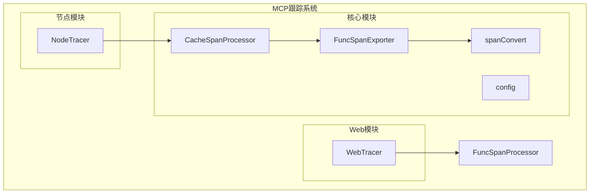
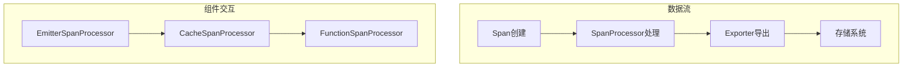
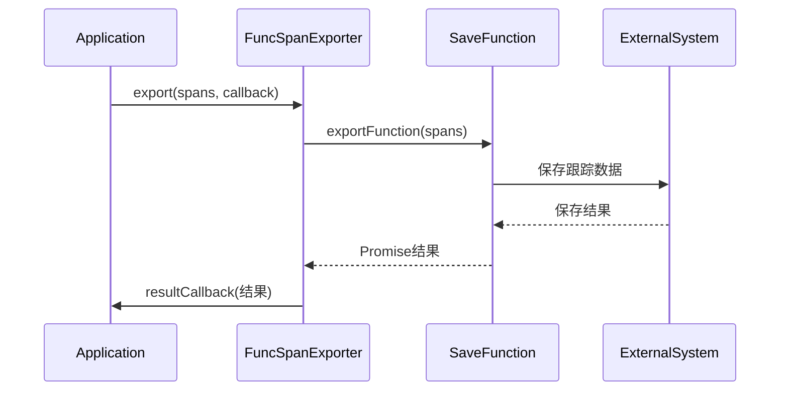
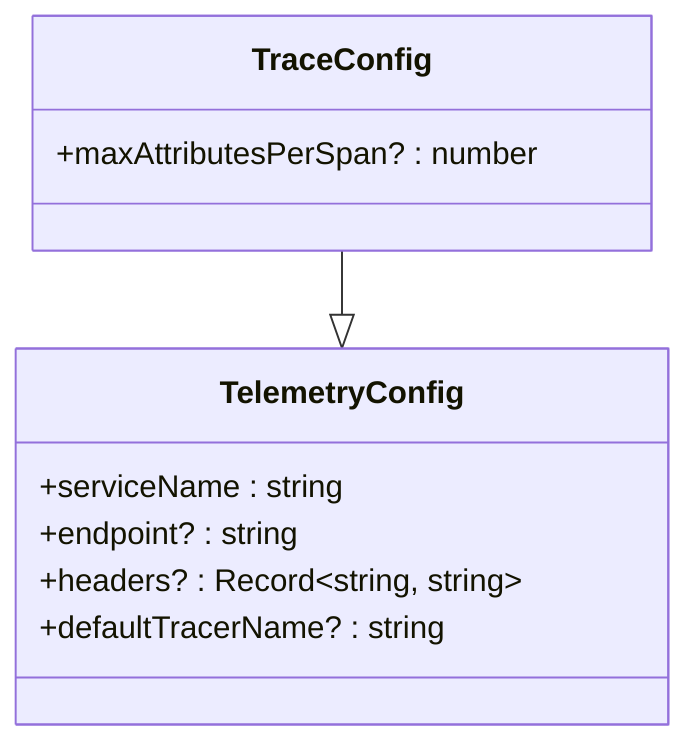
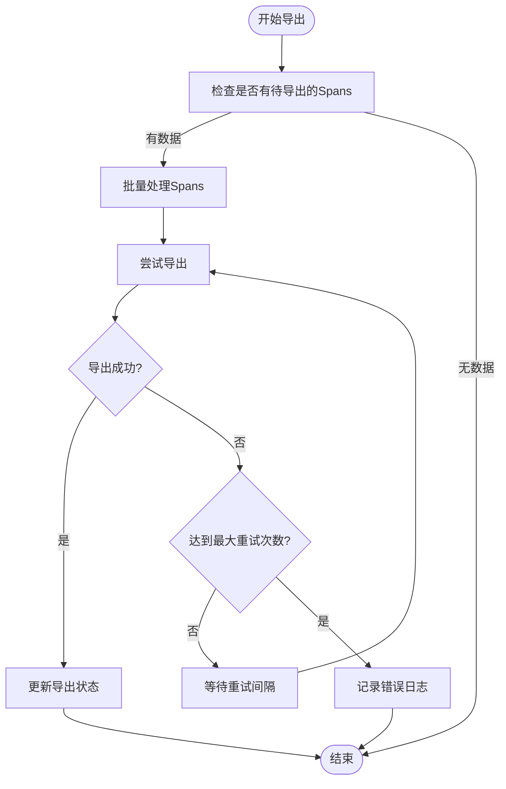
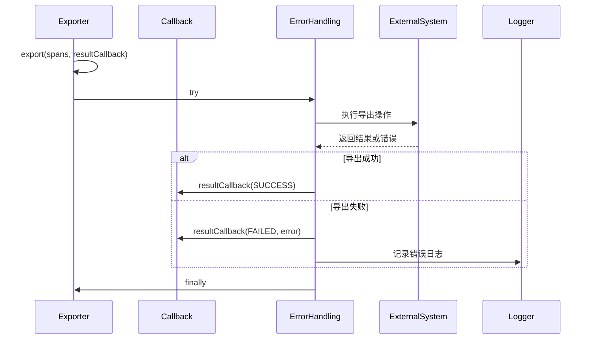
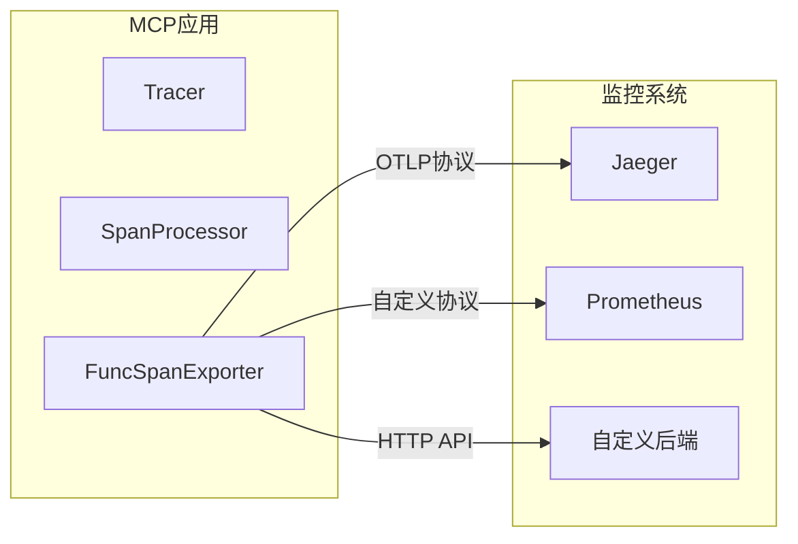
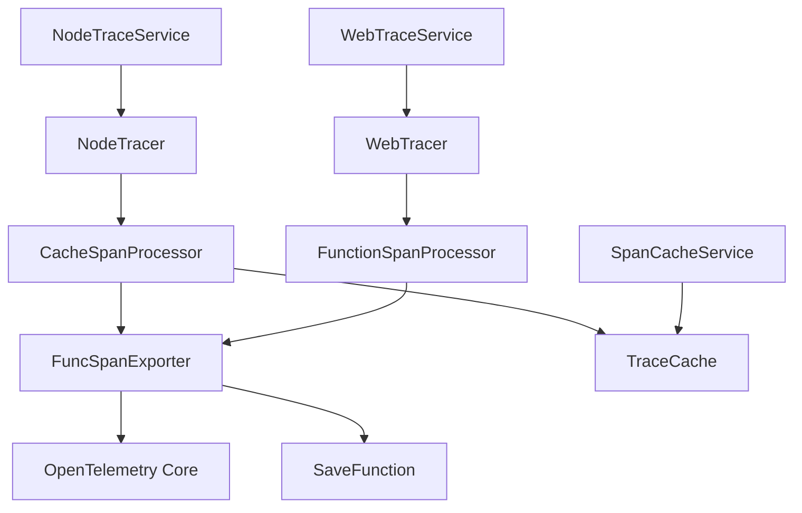

# 跟踪导出器

<cite>
**本文档引用的文件**
- [FuncSpanExporter.ts](file://packages/mcp-trace/trace-core/exporters/FuncSpanExporter.ts)
- [config.ts](file://packages/mcp-trace/trace-core/types/config.ts)
- [spanConvert.ts](file://packages/mcp-trace/trace-core/core/spanConvert.ts)
- [CacheSpanProcessor.ts](file://packages/mcp-trace/trace-core/processors/CacheSpanProcessor.ts)
- [NodeTracer.ts](file://packages/mcp-trace/trace-node/nodeTracer.ts)
- [webTracer.ts](file://packages/mcp-trace/trace-web/webTracer.ts)
- [SpanCacheService.ts](file://src/main/services/SpanCacheService.ts)
- [NodeTraceService.ts](file://src/main/services/NodeTraceService.ts)
- [WebTraceService.ts](file://src/renderer/src/services/WebTraceService.ts)
</cite>

## 目录
1. [简介](#简介)
2. [项目结构](#项目结构)
3. [核心组件](#核心组件)
4. [架构概述](#架构概述)
5. [详细组件分析](#详细组件分析)
6. [依赖分析](#依赖分析)
7. [性能考虑](#性能考虑)
8. [故障排除指南](#故障排除指南)
9. [结论](#结论)

## 简介
本文档详细介绍了MCP跟踪导出器的设计原理和实现机制。该系统基于OpenTelemetry标准构建，提供了一套完整的分布式跟踪解决方案，用于收集、处理和导出应用程序的跟踪数据。导出器的核心是FuncSpanExporter，它负责将处理后的跟踪数据导出到外部系统。

## 项目结构
MCP跟踪系统采用分层架构设计，主要分为核心模块、节点模块和Web模块。核心模块包含跟踪数据处理和导出的基础功能，节点和Web模块则针对不同运行环境提供特定的实现。



**图示来源**
- [FuncSpanExporter.ts](file://packages/mcp-trace/trace-core/exporters/FuncSpanExporter.ts)
- [CacheSpanProcessor.ts](file://packages/mcp-trace/trace-core/processors/CacheSpanProcessor.ts)
- [NodeTracer.ts](file://packages/mcp-trace/trace-node/nodeTracer.ts)
- [webTracer.ts](file://packages/mcp-trace/trace-web/webTracer.ts)

**本节来源**
- [FuncSpanExporter.ts](file://packages/mcp-trace/trace-core/exporters/FuncSpanExporter.ts)
- [CacheSpanProcessor.ts](file://packages/mcp-trace/trace-core/processors/CacheSpanProcessor.ts)

## 核心组件
MCP跟踪导出器的核心组件包括FuncSpanExporter、CacheSpanProcessor和spanConvert工具。这些组件协同工作，实现跟踪数据的收集、转换和导出功能。

**本节来源**
- [FuncSpanExporter.ts](file://packages/mcp-trace/trace-core/exporters/FuncSpanExporter.ts)
- [spanConvert.ts](file://packages/mcp-trace/trace-core/core/spanConvert.ts)
- [CacheSpanProcessor.ts](file://packages/mcp-trace/trace-core/processors/CacheSpanProcessor.ts)

## 架构概述
MCP跟踪系统的架构基于OpenTelemetry标准，采用模块化设计。系统通过SpanProcessor处理跟踪数据，使用Exporter导出数据，并通过ContextManager管理跟踪上下文。



**图示来源**
- [NodeTracer.ts](file://packages/mcp-trace/trace-node/nodeTracer.ts)
- [webTracer.ts](file://packages/mcp-trace/trace-web/webTracer.ts)
- [CacheSpanProcessor.ts](file://packages/mcp-trace/trace-core/processors/CacheSpanProcessor.ts)

## 详细组件分析

### FuncSpanExporter分析
FuncSpanExporter是MCP跟踪系统的核心导出组件，负责将处理后的跟踪数据导出到外部系统。它实现了OpenTelemetry的SpanExporter接口，提供了一种灵活的导出机制。

```mermaid
classDiagram
class SpanExporter {
<<interface>>
+export(spans : ReadableSpan[], resultCallback : (result : ExportResult) => void) : void
+shutdown() : Promise~void~
}
class FunctionSpanExporter {
-exportFunction : SaveFunction
+constructor(fn : SaveFunction)
+export(spans : ReadableSpan[], resultCallback : (result : ExportResult) => void) : void
+shutdown() : Promise~void~
}
class SaveFunction {
<<type>>
(spans : ReadableSpan[]) => Promise~void~
}
FunctionSpanExporter ..|> SpanExporter
FunctionSpanExporter --> SaveFunction
```

**图示来源**
- [FuncSpanExporter.ts](file://packages/mcp-trace/trace-core/exporters/FuncSpanExporter.ts)

#### 设计原理
FuncSpanExporter的设计基于策略模式，通过注入不同的保存函数来实现不同的导出策略。这种设计使得导出器具有很高的灵活性和可扩展性。



**图示来源**
- [FuncSpanExporter.ts](file://packages/mcp-trace/trace-core/exporters/FuncSpanExporter.ts)

**本节来源**
- [FuncSpanExporter.ts](file://packages/mcp-trace/trace-core/exporters/FuncSpanExporter.ts)

### 配置选项
MCP跟踪导出器提供了丰富的配置选项，包括目标端点、认证方式、数据格式和传输协议等。



**图示来源**
- [config.ts](file://packages/mcp-trace/trace-core/types/config.ts)

#### 配置参数说明
| 参数 | 类型 | 描述 | 默认值 |
|------|------|------|--------|
| serviceName | string | 服务名称 | "default" |
| endpoint | string | 导出目标端点 | undefined |
| headers | Record<string, string> | 请求头信息 | {} |
| defaultTracerName | string | 默认追踪器名称 | "default" |
| maxAttributesPerSpan | number | 每个Span的最大属性数 | undefined |

**本节来源**
- [config.ts](file://packages/mcp-trace/trace-core/types/config.ts)

### 批量导出与重试机制
MCP跟踪系统实现了批量导出和重试机制，确保数据的可靠传输。



**本节来源**
- [NodeTracer.ts](file://packages/mcp-trace/trace-node/nodeTracer.ts)
- [webTracer.ts](file://packages/mcp-trace/trace-web/webTracer.ts)

### 错误处理策略
系统实现了完善的错误处理策略，确保在导出失败时能够正确处理并记录错误信息。



**图示来源**
- [FuncSpanExporter.ts](file://packages/mcp-trace/trace-core/exporters/FuncSpanExporter.ts)

**本节来源**
- [FuncSpanExporter.ts](file://packages/mcp-trace/trace-core/exporters/FuncSpanExporter.ts)

### 与监控系统集成
MCP跟踪导出器可以与多种监控系统集成，如Prometheus、Jaeger或自定义后端。



**本节来源**
- [NodeTracer.ts](file://packages/mcp-trace/trace-node/nodeTracer.ts)
- [webTracer.ts](file://packages/mcp-trace/trace-web/webTracer.ts)

## 依赖分析
MCP跟踪系统依赖于OpenTelemetry SDK和其他核心组件，形成了一个完整的依赖关系网络。



**图示来源**
- [FuncSpanExporter.ts](file://packages/mcp-trace/trace-core/exporters/FuncSpanExporter.ts)
- [CacheSpanProcessor.ts](file://packages/mcp-trace/trace-core/processors/CacheSpanProcessor.ts)
- [NodeTracer.ts](file://packages/mcp-trace/trace-node/nodeTracer.ts)
- [webTracer.ts](file://packages/mcp-trace/trace-web/webTracer.ts)
- [SpanCacheService.ts](file://src/main/services/SpanCacheService.ts)

**本节来源**
- [FuncSpanExporter.ts](file://packages/mcp-trace/trace-core/exporters/FuncSpanExporter.ts)
- [CacheSpanProcessor.ts](file://packages/mcp-trace/trace-core/processors/CacheSpanProcessor.ts)
- [NodeTracer.ts](file://packages/mcp-trace/trace-node/nodeTracer.ts)

## 性能考虑
MCP跟踪系统在设计时充分考虑了性能因素，通过批量处理、异步导出和缓存机制来优化性能。

**本节来源**
- [NodeTracer.ts](file://packages/mcp-trace/trace-node/nodeTracer.ts)
- [CacheSpanProcessor.ts](file://packages/mcp-trace/trace-core/processors/CacheSpanProcessor.ts)

## 故障排除指南
当遇到跟踪数据导出问题时，可以按照以下步骤进行排查：

1. 检查配置中的endpoint是否正确
2. 验证网络连接是否正常
3. 检查认证信息是否正确
4. 查看日志中的错误信息
5. 确认SpanProcessor是否正确注册

**本节来源**
- [FuncSpanExporter.ts](file://packages/mcp-trace/trace-core/exporters/FuncSpanExporter.ts)
- [NodeTracer.ts](file://packages/mcp-trace/trace-node/nodeTracer.ts)

## 结论
MCP跟踪导出器提供了一套完整、灵活且可靠的分布式跟踪解决方案。通过FuncSpanExporter的设计，系统能够适应不同的导出需求，并与各种监控系统集成。批量导出、重试机制和错误处理策略确保了数据的可靠传输，为应用程序的性能监控和故障排查提供了有力支持。