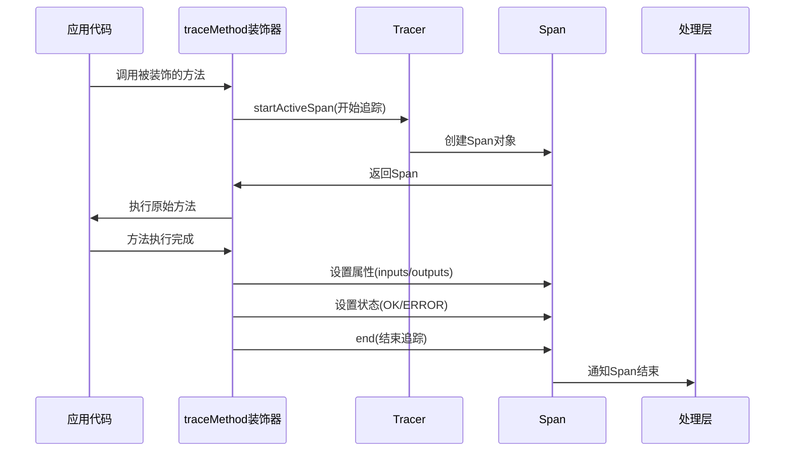
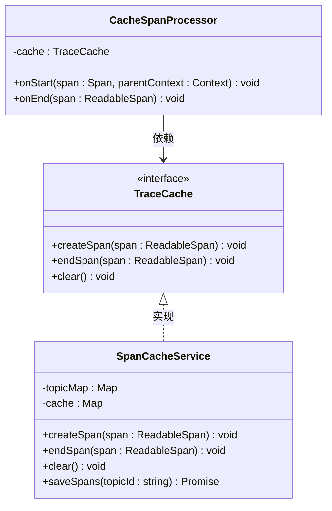
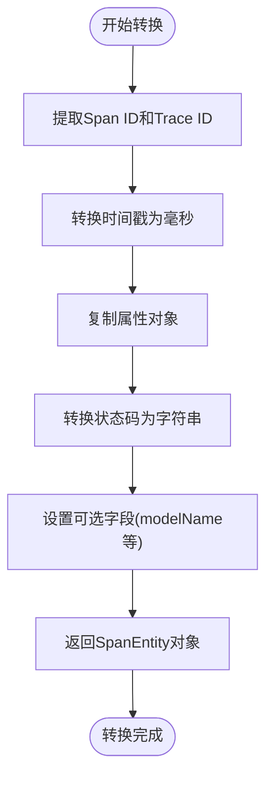

# 跟踪核心

<cite>
**本文档中引用的文件**  
- [traceMethod.ts](file://packages/mcp-trace/trace-core/core/traceMethod.ts)
- [traceCache.ts](file://packages/mcp-trace/trace-core/core/traceCache.ts)
- [spanConvert.ts](file://packages/mcp-trace/trace-core/core/spanConvert.ts)
- [config.ts](file://packages/mcp-trace/trace-core/types/config.ts)
- [CacheSpanProcessor.ts](file://packages/mcp-trace/trace-core/processors/CacheSpanProcessor.ts)
- [FuncSpanProcessor.ts](file://packages/mcp-trace/trace-core/processors/FuncSpanProcessor.ts)
- [FuncSpanExporter.ts](file://packages/mcp-trace/trace-core/exporters/FuncSpanExporter.ts)
- [SpanCacheService.ts](file://src/main/services/SpanCacheService.ts)
- [MCPService.ts](file://src/main/services/MCPService.ts)
</cite>

## 目录
1. [引言](#引言)
2. [核心组件](#核心组件)
3. [架构概述](#架构概述)
4. [详细组件分析](#详细组件分析)
5. [依赖分析](#依赖分析)
6. [性能考虑](#性能考虑)
7. [故障排除指南](#故障排除指南)
8. [结论](#结论)

## 引言
本文档深入解析MCP跟踪系统的核心功能，重点阐述`@traceMethod`装饰器的实现原理、`traceCache`机制的性能优化策略、`spanConvert`工具函数的数据转换能力，以及这些组件如何协同工作以实现高效的分布式追踪。文档还提供了在实际业务方法中使用这些功能的完整示例，并说明了核心模块与其他系统组件的集成方式。

## 核心组件
MCP跟踪系统由三个核心组件构成：`traceMethod`装饰器用于自动捕获方法调用的上下文信息；`traceCache`机制通过缓存Span对象来优化性能；`spanConvert`工具函数负责将内部跟踪数据结构转换为标准格式。这些组件共同构成了一个高效、可扩展的追踪解决方案。

**核心组件**
- [traceMethod.ts](file://packages/mcp-trace/trace-core/core/traceMethod.ts#L1-L164)
- [traceCache.ts](file://packages/mcp-trace/trace-core/core/traceCache.ts#L1-L8)
- [spanConvert.ts](file://packages/mcp-trace/trace-core/core/spanConvert.ts#L1-L27)

## 架构概述
MCP跟踪系统采用分层架构设计，从上到下分为装饰器层、处理层、缓存层和导出层。装饰器层提供`@traceMethod`等API，用于标记需要追踪的方法；处理层包含`CacheSpanProcessor`和`FunctionSpanProcessor`，负责处理Span的生命周期事件；缓存层通过`SpanCacheService`实现Span对象的高效缓存；导出层使用`FunctionSpanExporter`将追踪数据导出到外部系统。

```mermaid
graph TD
A[装饰器层] --> B[处理层]
B --> C[缓存层]
C --> D[导出层]
A --> |@traceMethod| B
B --> |onStart/onEnd| C
C --> |saveSpans| D
```

**图示来源**
- [traceMethod.ts](file://packages/mcp-trace/trace-core/core/traceMethod.ts#L14-L110)
- [CacheSpanProcessor.ts](file://packages/mcp-trace/trace-core/processors/CacheSpanProcessor.ts#L8-L43)
- [SpanCacheService.ts](file://src/main/services/SpanCacheService.ts#L15-L57)

## 详细组件分析

### traceMethod装饰器分析
`@traceMethod`装饰器是MCP跟踪系统的核心入口，它通过AOP（面向切面编程）方式自动捕获方法调用的开始时间、结束时间和执行结果。该装饰器利用TypeScript的装饰器语法，在方法执行前后插入追踪逻辑，实现了对业务代码的无侵入式监控。



**图示来源**
- [traceMethod.ts](file://packages/mcp-trace/trace-core/core/traceMethod.ts#L14-L53)
- [config.ts](file://packages/mcp-trace/trace-core/types/config.ts#L61-L65)

#### 实现原理
`@traceMethod`装饰器的实现基于TypeScript的装饰器工厂模式。它接收一个`SpanDecoratorOptions`配置对象，返回一个实际的装饰器函数。该函数通过`Object.getOwnPropertyDescriptor`获取目标方法的描述符，并用一个包装函数替换原始方法的`value`属性。这个包装函数在调用原始方法前后，通过OpenTelemetry API创建和管理Span对象。

**核心功能包括：**
- **自动时间捕获**：通过`startActiveSpan`和`span.end()`自动记录方法调用的开始和结束时间
- **输入输出记录**：使用`span.setAttribute`记录方法的输入参数和返回结果
- **错误处理**：在`catch`块中捕获异常，通过`span.recordException`和`span.setStatus`记录错误信息
- **配置灵活性**：支持自定义Span名称、追踪器名称和标签

**代码路径**
- [traceMethod.ts](file://packages/mcp-trace/trace-core/core/traceMethod.ts#L14-L53)

### traceCache机制分析
`traceCache`机制通过缓存Span对象来优化性能，避免了在高并发场景下频繁创建和销毁跟踪上下文所带来的性能开销。该机制定义了`TraceCache`接口，包含`createSpan`、`endSpan`和`clear`三个核心方法，为Span的生命周期管理提供了标准化的缓存接口。



**图示来源**
- [traceCache.ts](file://packages/mcp-trace/trace-core/core/traceCache.ts#L3-L7)
- [CacheSpanProcessor.ts](file://packages/mcp-trace/trace-core/processors/CacheSpanProcessor.ts#L8-L43)
- [SpanCacheService.ts](file://src/main/services/SpanCacheService.ts#L15-L57)

#### 性能优化策略
`traceCache`机制通过以下方式优化性能：
1. **内存缓存**：使用`Map`数据结构缓存Span对象，提供O(1)的查找性能
2. **批量处理**：`CacheSpanProcessor`在`onEnd`时才将Span写入缓存，减少了I/O操作频率
3. **条件启用**：只有在开发者模式启用时才进行缓存操作，避免生产环境的性能损耗
4. **资源清理**：提供`cleanTopic`和`cleanLocalData`方法，及时清理过期的追踪数据

**代码路径**
- [SpanCacheService.ts](file://src/main/services/SpanCacheService.ts#L25-L57)

### spanConvert工具函数分析
`spanConvert`工具函数负责将OpenTelemetry SDK的`ReadableSpan`对象转换为系统内部的`SpanEntity`标准格式，支持跨系统数据交换。该函数通过`convertSpanToSpanEntity`方法实现，将Span的各种属性（如ID、时间戳、属性、状态等）进行标准化转换。



**图示来源**
- [spanConvert.ts](file://packages/mcp-trace/trace-core/core/spanConvert.ts#L11-L26)
- [config.ts](file://packages/mcp-trace/trace-core/types/config.ts#L43-L59)

#### 数据转换逻辑
`spanConvert`工具函数的转换逻辑包括：
- **ID转换**：直接映射`spanContext().spanId`和`traceId`
- **时间转换**：将高精度时间戳（纳秒级）转换为毫秒级时间戳
- **属性复制**：深拷贝`attributes`对象，确保数据完整性
- **状态转换**：将`SpanStatusCode`枚举值转换为对应的字符串表示
- **类型断言**：使用`as SpanEntity`确保返回值类型正确

**代码路径**
- [spanConvert.ts](file://packages/mcp-trace/trace-core/core/spanConvert.ts#L11-L26)

## 依赖分析
MCP跟踪系统与其他组件通过清晰的接口进行集成，形成了一个松耦合的架构。核心依赖关系包括：

```mermaid
graph LR
A[@traceMethod装饰器] --> B[OpenTelemetry API]
B --> C[Tracer]
C --> D[Span]
D --> E[CacheSpanProcessor]
E --> F[SpanCacheService]
F --> G[FunctionSpanExporter]
G --> H[外部系统]
I[MCPService] --> A
J[KnowledgeService] --> A
K[FileSystemService] --> A
```

**图示来源**
- [traceMethod.ts](file://packages/mcp-trace/trace-core/core/traceMethod.ts#L3-L5)
- [CacheSpanProcessor.ts](file://packages/mcp-trace/trace-core/processors/CacheSpanProcessor.ts#L2-L4)
- [FuncSpanExporter.ts](file://packages/mcp-trace/trace-core/exporters/FuncSpanExporter.ts#L1-L3)

### 与处理器的集成
`CacheSpanProcessor`继承自OpenTelemetry的`BatchSpanProcessor`，并在`onStart`和`onEnd`生命周期方法中注入缓存逻辑。当Span开始时，它调用`traceCache.createSpan`创建缓存条目；当Span结束时，它先调用父类的`onEnd`方法进行批量处理，然后调用`traceCache.endSpan`更新缓存中的Span状态。

**代码路径**
- [CacheSpanProcessor.ts](file://packages/mcp-trace/trace-core/processors/CacheSpanProcessor.ts#L16-L42)

### 与导出器的集成
`FunctionSpanExporter`实现了OpenTelemetry的`SpanExporter`接口，将待导出的Span数组传递给用户定义的`SaveFunction`。这种设计使得导出逻辑完全可定制，可以轻松集成到不同的持久化系统中。

**代码路径**
- [FuncSpanExporter.ts](file://packages/mcp-trace/trace-core/exporters/FuncSpanExporter.ts#L7-L27)

## 性能考虑
在高并发场景下，MCP跟踪系统通过多种策略确保性能稳定：
- **异步处理**：所有追踪操作（如缓存、导出）都采用异步方式，避免阻塞主线程
- **批量导出**：`BatchSpanProcessor`累积一定数量的Span后才进行导出，减少I/O开销
- **内存优化**：使用`Map`数据结构进行高效缓存，避免频繁的垃圾回收
- **条件启用**：通过`configManager.getEnableDeveloperMode()`控制追踪功能的启用状态，避免生产环境的性能损耗

## 故障排除指南
当遇到追踪功能异常时，可以按照以下步骤进行排查：
1. 确认`@traceMethod`装饰器已正确应用到目标方法
2. 检查开发者模式是否已启用（`configManager.getEnableDeveloperMode()`）
3. 验证`SpanCacheService`的缓存目录是否存在且可写
4. 检查`FunctionSpanExporter`的导出函数是否正确实现
5. 查看日志中是否有相关的错误信息

**代码路径**
- [SpanCacheService.ts](file://src/main/services/SpanCacheService.ts#L26-L28)
- [traceMethod.ts](file://packages/mcp-trace/trace-core/core/traceMethod.ts#L20-L22)

## 结论
MCP跟踪系统通过`@traceMethod`装饰器、`traceCache`机制和`spanConvert`工具函数的协同工作，实现了高效、灵活的分布式追踪功能。该系统采用AOP方式自动捕获方法调用信息，通过缓存机制优化性能，并提供标准化的数据转换接口，为系统的可观测性提供了强有力的支持。在实际应用中，开发者可以轻松地将追踪功能集成到业务代码中，而无需修改核心逻辑，极大地提高了开发效率和系统可维护性。