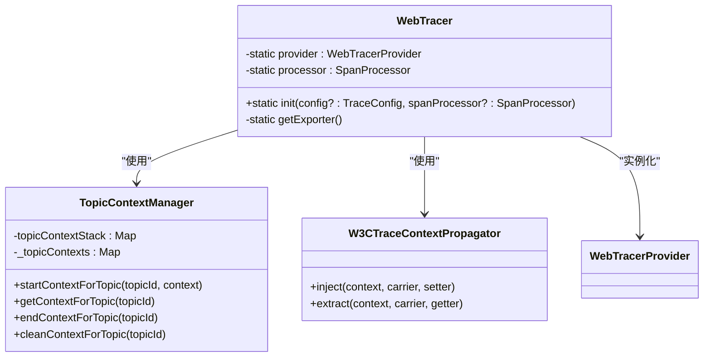
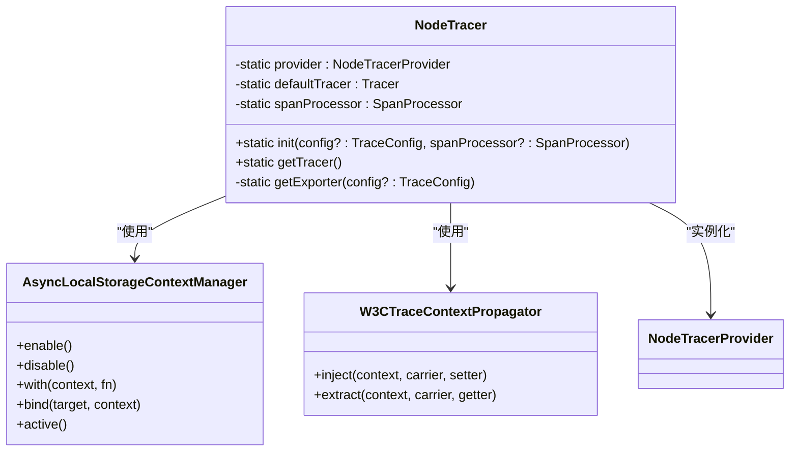
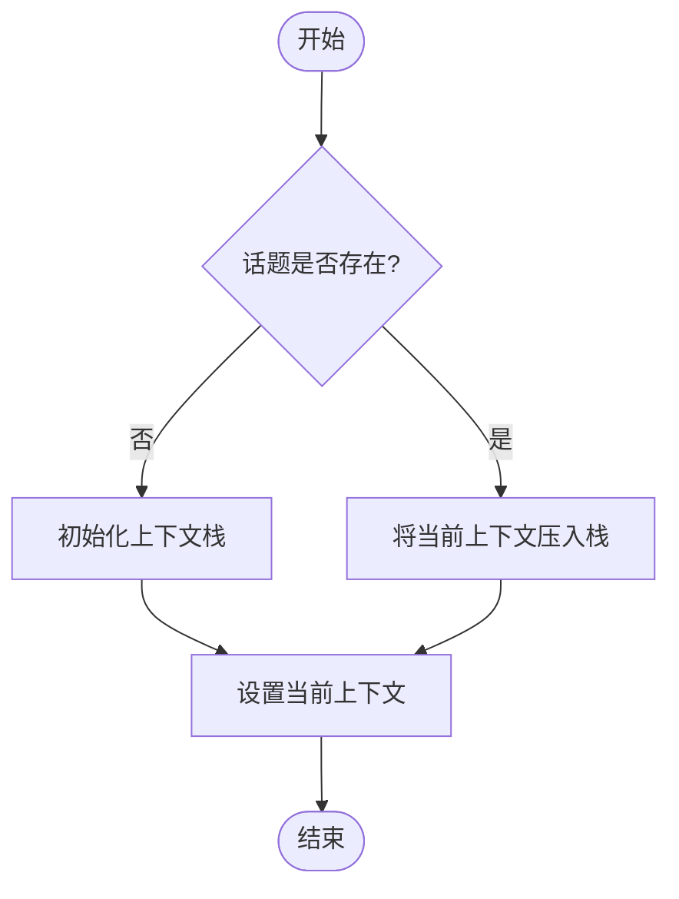
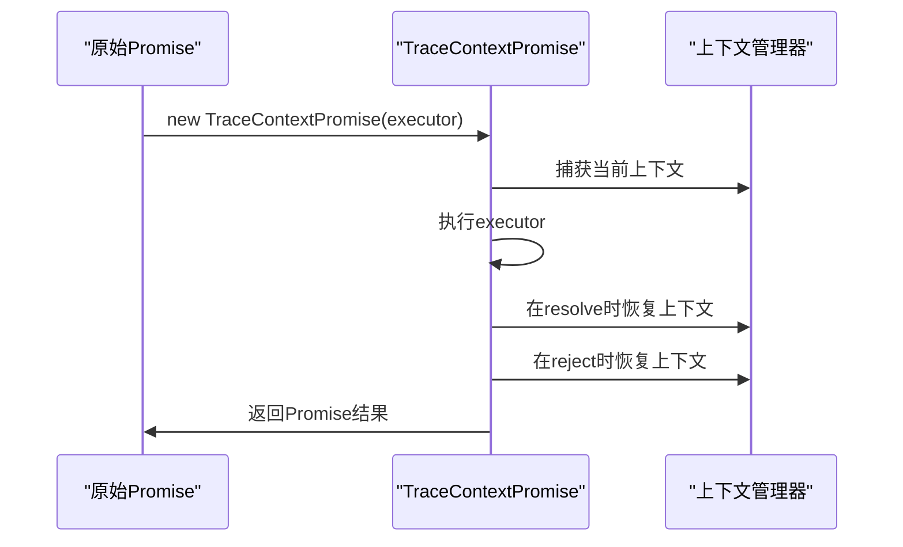
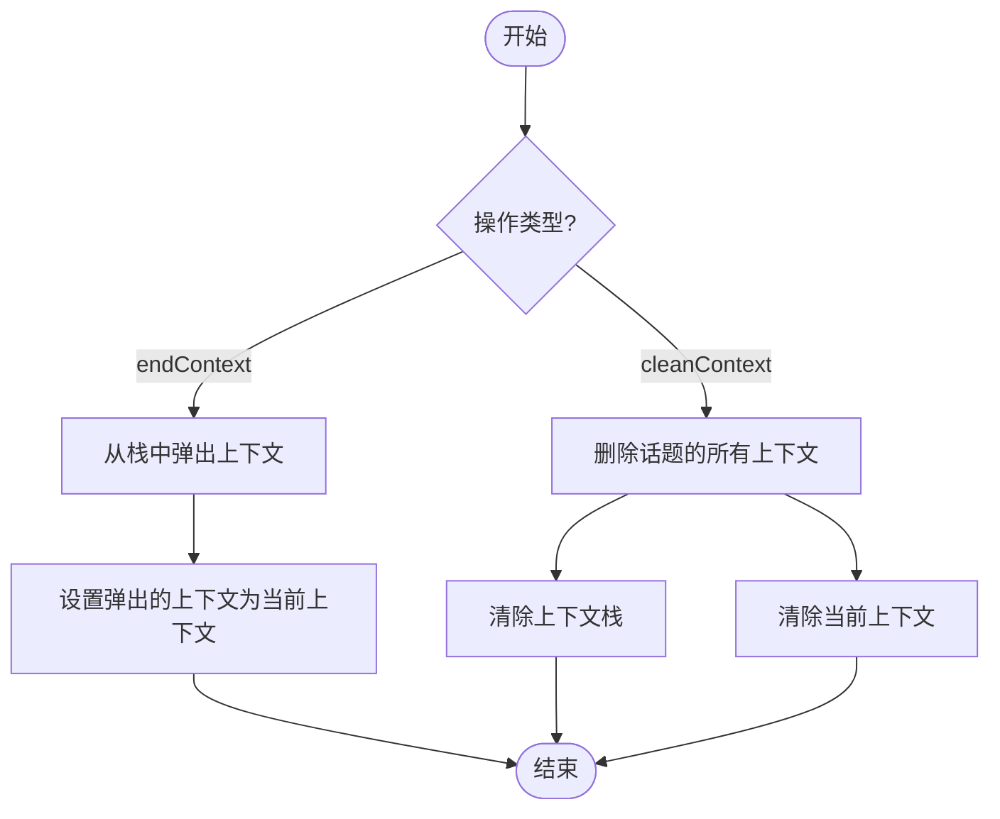
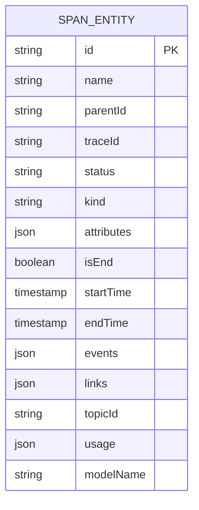
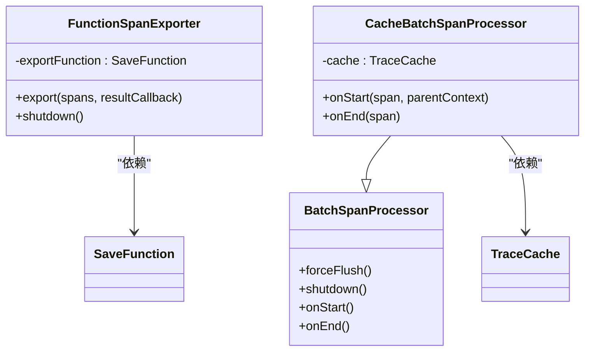
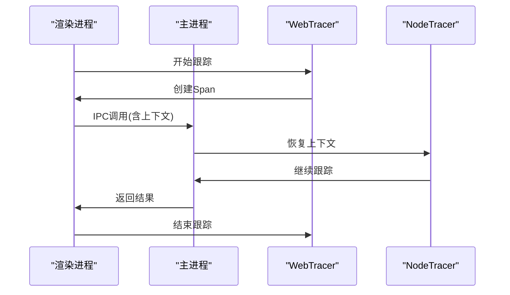
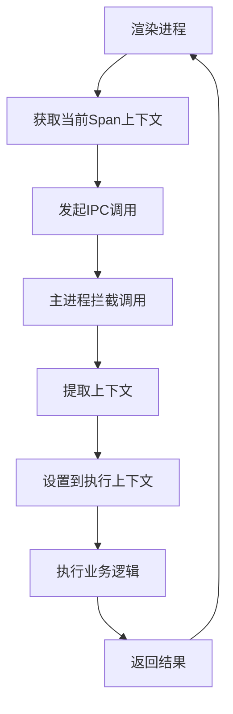
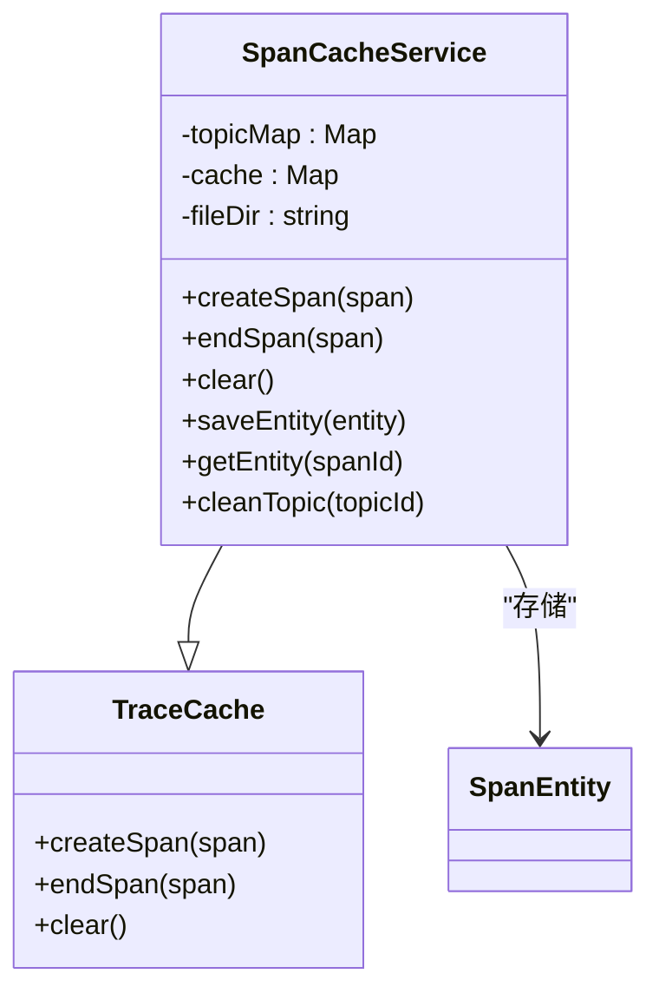

# 跨平台支持

<cite>
**本文档中引用的文件**  
- [webTracer.ts](file://packages/mcp-trace/trace-web/webTracer.ts)
- [nodeTracer.ts](file://packages/mcp-trace/trace-node/nodeTracer.ts)
- [TopicContextManager.ts](file://packages/mcp-trace/trace-web/TopicContextManager.ts)
- [traceContextPromise.ts](file://packages/mcp-trace/trace-web/traceContextPromise.ts)
- [config.ts](file://packages/mcp-trace/trace-core/types/config.ts)
- [NodeTraceService.ts](file://src/main/services/NodeTraceService.ts)
- [WebTraceService.ts](file://src/renderer/src/services/WebTraceService.ts)
- [CacheSpanProcessor.ts](file://packages/mcp-trace/trace-core/processors/CacheSpanProcessor.ts)
- [FuncSpanExporter.ts](file://packages/mcp-trace/trace-core/exporters/FuncSpanExporter.ts)
- [spanConvert.ts](file://packages/mcp-trace/trace-core/core/spanConvert.ts)
- [traceMethod.ts](file://packages/mcp-trace/trace-core/core/traceMethod.ts)
- [SpanCacheService.ts](file://src/main/services/SpanCacheService.ts)
</cite>

## 目录
1. [引言](#引言)
2. [Web与Node.js环境下的跟踪实现差异](#web与nodejs环境下的跟踪实现差异)
3. [TopicContextManager在Web环境中的上下文管理机制](#topiccontextmanager在web环境中的上下文管理机制)
4. [跨平台跟踪数据格式统一策略](#跨平台跟踪数据格式统一策略)
5. [Electron应用中的集成方案](#electron应用中的集成方案)
6. [平台特定的性能优化技巧和常见问题解决方案](#平台特定的性能优化技巧和常见问题解决方案)

## 引言
本文档详细阐述了MCP（Multi-Component Platform）在跨平台环境下的跟踪支持机制。系统基于OpenTelemetry标准构建了统一的跟踪框架，通过`webTracer`和`nodeTracer`分别实现了Web前端和Node.js后端的跟踪功能。该系统特别针对Electron架构的应用进行了优化，实现了主进程与渲染进程之间的无缝跟踪集成。文档将深入分析不同环境下的实现差异、上下文管理机制、数据格式统一策略以及在复杂应用场景下的集成方案。

## Web与Node.js环境下的跟踪实现差异

### Web环境下的webTracer实现
在Web环境中，`webTracer`利用浏览器API和Web特性实现了前端跟踪。其核心实现位于`packages/mcp-trace/trace-web/webTracer.ts`文件中。

`webTracer`基于`@opentelemetry/sdk-trace-web`构建，使用`WebTracerProvider`作为跟踪提供者。它通过`W3CTraceContextPropagator`实现W3C跟踪上下文传播标准，确保跨服务的跟踪链路完整性。与Node.js环境不同，Web环境的跟踪器使用`TopicContextManager`作为自定义的上下文管理器，而非OpenTelemetry默认的全局上下文管理。

**图源**  
- [webTracer.ts](file://packages/mcp-trace/trace-web/webTracer.ts#L13-L49)
- [TopicContextManager.ts](file://packages/mcp-trace/trace-web/TopicContextManager.ts#L4-L77)

**本节源码**  
- [webTracer.ts](file://packages/mcp-trace/trace-web/webTracer.ts#L1-L49)

### Node.js环境下的nodeTracer实现
在Node.js环境中，`nodeTracer`利用Node.js的异步特性实现了后端跟踪，其实现在`packages/mcp-trace/trace-node/nodeTracer.ts`文件中。

`nodeTracer`基于`@opentelemetry/sdk-trace-node`构建，使用`NodeTracerProvider`作为跟踪提供者。与Web环境的关键区别在于，它使用`AsyncLocalStorageContextManager`作为上下文管理器，这是Node.js特有的异步本地存储机制，能够在线程和异步操作中保持上下文的一致性。

**图源**  
- [nodeTracer.ts](file://packages/mcp-trace/trace-node/nodeTracer.ts#L13-L50)
- [AsyncLocalStorageContextManager](https://opentelemetry.io/docs/instrumentation/js/manual/#context-propagation)

**本节源码**  
- [nodeTracer.ts](file://packages/mcp-trace/trace-node/nodeTracer.ts#L1-L50)

## TopicContextManager在Web环境中的上下文管理机制

### 上下文创建机制
`TopicContextManager`是专为Web环境设计的上下文管理器，解决了浏览器环境中全局上下文管理的局限性。它通过`topicId`来管理不同话题的跟踪上下文，实现了基于话题的上下文隔离。

上下文创建通过`startContextForTopic`方法实现，该方法接收`topicId`和`context`作为参数，将上下文与特定话题关联。系统维护两个数据结构：`topicContextStack`用于保存上下文栈，`_topicContexts`用于保存当前上下文。

**图源**  
- [TopicContextManager.ts](file://packages/mcp-trace/trace-web/TopicContextManager.ts#L15-L23)

### 上下文传播机制
上下文传播是跟踪系统的核心功能，`TopicContextManager`通过`bind`方法实现显式上下文绑定。该方法将上下文直接附加到目标对象的`__ot_context`属性上，避免了全局`active`上下文的依赖。

在Promise处理方面，系统通过`traceContextPromise.ts`文件中的`TraceContextPromise`类实现了上下文传播。该类扩展了原生Promise，捕获创建时的上下文，并在`resolve`和`reject`时恢复该上下文，确保异步操作中的上下文一致性。

**图源**  
- [traceContextPromise.ts](file://packages/mcp-trace/trace-web/traceContextPromise.ts#L6-L101)
- [TopicContextManager.ts](file://packages/mcp-trace/trace-web/TopicContextManager.ts#L62-L66)

### 上下文清理机制
上下文清理通过`endContextForTopic`和`cleanContextForTopic`方法实现。`endContextForTopic`从上下文栈中弹出前一个上下文并设置为当前上下文，实现上下文的回退。`cleanContextForTopic`则完全清除指定话题的所有上下文信息，包括上下文栈和当前上下文。

**图源**  
- [TopicContextManager.ts](file://packages/mcp-trace/trace-web/TopicContextManager.ts#L30-L38)

**本节源码**  
- [TopicContextManager.ts](file://packages/mcp-trace/trace-web/TopicContextManager.ts#L4-L77)

## 跨平台跟踪数据格式统一策略

### 统一的数据模型
为了确保前后端跟踪数据的无缝集成，系统定义了统一的`SpanEntity`数据模型。该模型在`packages/mcp-trace/trace-core/types/config.ts`文件中定义，包含了跟踪数据的所有必要字段。

**图源**  
- [config.ts](file://packages/mcp-trace/trace-core/types/config.ts#L43-L59)

### 数据转换机制
系统通过`spanConvert.ts`文件中的`convertSpanToSpanEntity`函数实现OpenTelemetry原生`ReadableSpan`到统一`SpanEntity`的转换。该函数处理了时间戳的格式转换（从纳秒到毫秒）、状态码的字符串化以及属性的深拷贝。

**图源**  
- [spanConvert.ts](file://packages/mcp-trace/trace-core/core/spanConvert.ts#L11-L27)

### 数据导出与处理
系统实现了统一的导出和处理机制，通过`FuncSpanExporter`和`CacheSpanProcessor`等组件确保数据的一致性处理。

`FuncSpanExporter`是一个函数式导出器，允许用户传入自定义的保存函数，实现了灵活的数据持久化策略。`CacheSpanProcessor`则是一个缓存处理器，继承自`BatchSpanProcessor`，在批处理的基础上增加了缓存功能。

**图源**  
- [FuncSpanExporter.ts](file://packages/mcp-trace/trace-core/exporters/FuncSpanExporter.ts#L7-L28)
- [CacheSpanProcessor.ts](file://packages/mcp-trace/trace-core/processors/CacheSpanProcessor.ts#L8-L43)

**本节源码**  
- [config.ts](file://packages/mcp-trace/trace-core/types/config.ts#L1-L66)
- [spanConvert.ts](file://packages/mcp-trace/trace-core/core/spanConvert.ts#L1-L27)
- [FuncSpanExporter.ts](file://packages/mcp-trace/trace-core/exporters/FuncSpanExporter.ts#L1-L28)
- [CacheSpanProcessor.ts](file://packages/mcp-trace/trace-core/processors/CacheSpanProcessor.ts#L1-L43)

## Electron应用中的集成方案

### 主进程与渲染进程的跟踪集成
在Electron应用中，系统通过`NodeTraceService`和`WebTraceService`分别在主进程和渲染进程中初始化跟踪器。`NodeTraceService`位于`src/main/services/NodeTraceService.ts`，`WebTraceService`位于`src/renderer/src/services/WebTraceService.ts`。

主进程通过`ipcMain.handle`的装饰，实现了IPC调用的上下文传递。当渲染进程发起IPC调用时，可以将跟踪上下文作为参数传递，主进程接收后恢复该上下文，确保跟踪链路的连续性。

**图源**  
- [NodeTraceService.ts](file://src/main/services/NodeTraceService.ts#L33-L46)
- [WebTraceService.ts](file://src/renderer/src/services/WebTraceService.ts#L11-L44)

### 进程间跟踪上下文传递
进程间上下文传递通过IPC机制实现。当渲染进程调用主进程的API时，可以将当前的Span上下文作为参数传递。主进程通过`ipcMain.handle`的装饰器拦截这些调用，提取上下文并设置到当前执行上下文中。

**图源**  
- [NodeTraceService.ts](file://src/main/services/NodeTraceService.ts#L33-L46)

### 数据聚合策略
系统通过`SpanCacheService`实现跟踪数据的聚合和持久化。该服务位于`src/main/services/SpanCacheService.ts`，实现了`TraceCache`接口，负责将跟踪数据缓存到内存并持久化到文件系统。

数据聚合策略包括：
1. 按`topicId`组织跟踪数据
2. 内存缓存与磁盘持久化结合
3. 异步批量写入提高性能
4. 完整的生命周期管理（创建、更新、清理）

**图源**  
- [SpanCacheService.ts](file://src/main/services/SpanCacheService.ts#L15-L409)

**本节源码**  
- [NodeTraceService.ts](file://src/main/services/NodeTraceService.ts#L1-L123)
- [WebTraceService.ts](file://src/renderer/src/services/WebTraceService.ts#L1-L44)
- [SpanCacheService.ts](file://src/main/services/SpanCacheService.ts#L1-L409)

## 平台特定的性能优化技巧和常见问题解决方案

### Web环境性能优化
在Web环境中，主要的性能优化技巧包括：
1. **Promise上下文传播优化**：通过`TraceContextPromise`避免频繁的上下文切换
2. **批量处理**：使用`BatchSpanProcessor`减少I/O操作次数
3. **内存管理**：及时清理不再需要的上下文，防止内存泄漏
4. **异步操作**：所有持久化操作都采用异步方式，避免阻塞主线程

### Node.js环境性能优化
在Node.js环境中，性能优化策略包括：
1. **异步本地存储**：利用`AsyncLocalStorageContextManager`高效管理上下文
2. **缓存处理器**：`CacheBatchSpanProcessor`在批处理的同时更新缓存
3. **文件系统优化**：批量写入和适当的缓冲策略减少磁盘I/O
4. **资源管理**：合理配置批处理的大小和时间间隔

### 常见问题及解决方案
#### 上下文丢失问题
**问题**：在异步操作中上下文丢失，导致跟踪链路中断。
**解决方案**：确保所有异步操作都通过`context.with()`方法执行，或使用`TraceContextPromise`包装Promise。

#### 内存泄漏问题
**问题**：长时间运行的应用中，跟踪数据占用过多内存。
**解决方案**：实现合理的清理机制，定期清理已完成的跟踪数据，特别是通过`cleanContextForTopic`方法清理特定话题的上下文。

#### 跨进程跟踪中断
**问题**：在Electron的IPC调用中跟踪链路中断。
**解决方案**：确保在IPC调用时传递上下文，并在主进程正确恢复上下文，如`NodeTraceService`中的实现。

#### 数据格式不一致
**问题**：前后端跟踪数据格式不一致，难以聚合分析。
**解决方案**：使用统一的`SpanEntity`数据模型和`convertSpanToSpanEntity`转换函数，确保数据格式的一致性。

**本节源码**  
- [traceMethod.ts](file://packages/mcp-trace/trace-core/core/traceMethod.ts#L1-L164)
- [SpanCacheService.ts](file://src/main/services/SpanCacheService.ts#L1-L409)
- [NodeTraceService.ts](file://src/main/services/NodeTraceService.ts#L1-L123)