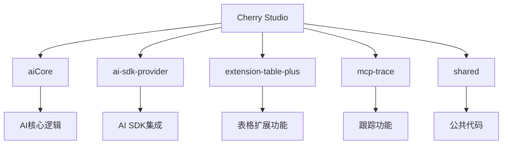
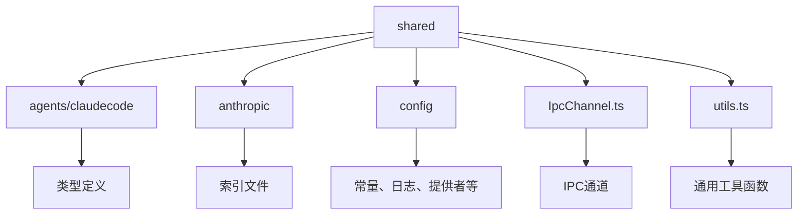
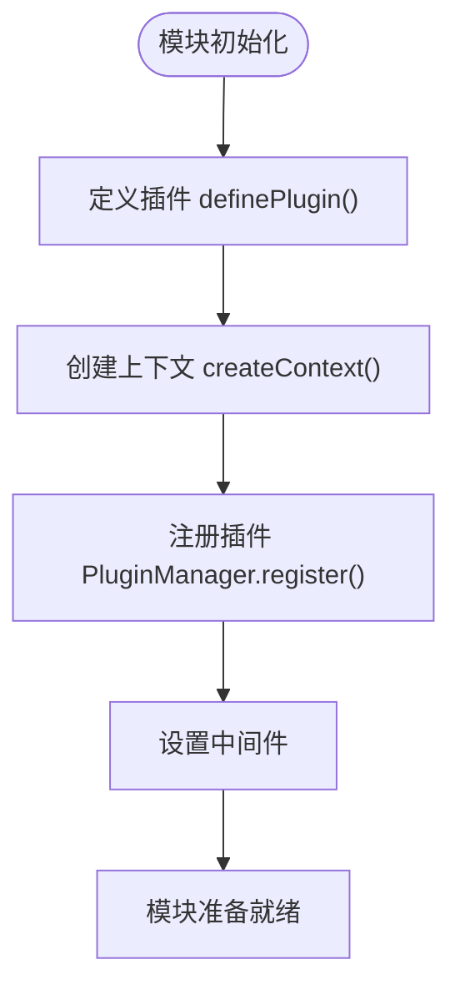

# 模块化架构

<cite>
**本文档引用的文件**  
- [package.json](file://package.json)
- [aiCore/package.json](file://packages/aiCore/package.json)
- [ai-sdk-provider/package.json](file://packages/ai-sdk-provider/package.json)
- [extension-table-plus/package.json](file://packages/extension-table-plus/package.json)
- [mcp-trace/trace-core/index.ts](file://packages/mcp-trace/trace-core/index.ts)
- [shared/utils.ts](file://packages/shared/utils.ts)
- [aiCore/src/index.ts](file://packages/aiCore/src/index.ts)
- [ai-sdk-provider/src/index.ts](file://packages/ai-sdk-provider/src/index.ts)
- [extension-table-plus/src/index.ts](file://packages/extension-table-plus/src/index.ts)
- [aiCore/src/core/plugins/index.ts](file://packages/aiCore/src/core/plugins/index.ts)
</cite>

## 目录
1. [项目结构](#项目结构)
2. [核心模块职责](#核心模块职责)
3. [模块依赖关系](#模块依赖关系)
4. [共享包机制](#共享包机制)
5. [模块初始化与注册](#模块初始化与注册)
6. [模块化优势](#模块化优势)

## 项目结构

Cherry Studio采用Yarn Workspaces进行多包管理，项目根目录的package.json中定义了workspaces配置，将packages目录下的所有子包作为工作区。这种架构支持独立开发、测试和发布各个模块，同时保持代码库的统一管理。



**图表来源**  
- [package.json](file://package.json#L12-L24)

**本节来源**  
- [package.json](file://package.json#L1-L430)

## 核心模块职责

### aiCore模块
aiCore模块是Cherry Studio的AI核心处理引擎，基于Vercel AI SDK构建统一的AI Provider接口。该模块负责处理所有AI相关的核心逻辑，包括文本生成、图像生成、对象生成等功能。通过createExecutor、streamText等API提供统一的执行接口。

**本节来源**  
- [aiCore/package.json](file://packages/aiCore/package.json#L1-L87)
- [aiCore/src/index.ts](file://packages/aiCore/src/index.ts#L1-L47)

### ai-sdk-provider模块
ai-sdk-provider模块提供AI SDK集成能力，特别是CherryIN路由功能。作为AI SDK的提供者捆绑包，它封装了与不同AI服务提供商的集成，为上层应用提供一致的接口访问各种AI服务。

**本节来源**  
- [ai-sdk-provider/package.json](file://packages/ai-sdk-provider/package.json#L1-L65)
- [ai-sdk-provider/src/index.ts](file://packages/ai-sdk-provider/src/index.ts#L1-L2)

### extension-table-plus模块
extension-table-plus模块提供表格扩展功能，基于tiptap的表格扩展进行二次开发。该模块为编辑器提供强大的表格操作能力，包括单元格、行、列的管理，以及表格视图的渲染和交互。

**本节来源**  
- [extension-table-plus/package.json](file://packages/extension-table-plus/package.json#L1-L94)
- [extension-table-plus/src/index.ts](file://packages/extension-table-plus/src/index.ts#L1-L7)

### mcp-trace模块
mcp-trace模块实现跟踪功能，包含核心跟踪逻辑、导出器和处理器。该模块负责收集、处理和导出AI调用的跟踪数据，支持FuncSpanExporter等导出方式，为系统提供可观测性能力。

**本节来源**  
- [mcp-trace/trace-core/index.ts](file://packages/mcp-trace/trace-core/index.ts#L1-L9)

## 模块依赖关系

各模块之间通过明确的依赖关系进行通信。aiCore模块作为核心依赖ai-sdk-provider提供的SDK集成能力，同时其他模块可以根据需要引用aiCore的功能。这种依赖关系在各模块的package.json中通过peerDependencies和dependencies进行声明。

```mermaid
graph LR
A[aiCore] --> B[ai-sdk-provider]
A --> C[@ai-sdk/anthropic]
A --> D[@ai-sdk/openai]
A --> E[zod]
F[extension-table-plus] --> G[@tiptap/core]
F --> H[@tiptap/pm]
I[mcp-trace] --> J[@opentelemetry/api]
I --> K[@opentelemetry/sdk-trace-base]
```

**图表来源**  
- [aiCore/package.json](file://packages/aiCore/package.json#L35-L50)
- [ai-sdk-provider/package.json](file://packages/ai-sdk-provider/package.json#L37-L46)
- [extension-table-plus/package.json](file://packages/extension-table-plus/package.json#L79-L82)

**本节来源**  
- [aiCore/package.json](file://packages/aiCore/package.json#L1-L87)
- [ai-sdk-provider/package.json](file://packages/ai-sdk-provider/package.json#L1-L65)
- [extension-table-plus/package.json](file://packages/extension-table-plus/package.json#L1-L94)

## 共享包机制

shared包作为公共代码提取层，存放各模块间共享的工具函数和类型定义。这种设计避免了代码重复，提高了维护效率。例如，shared/utils.ts中定义了defaultAppHeaders等通用工具函数，可供所有模块引用。



**图表来源**  
- [shared/utils.ts](file://packages/shared/utils.ts#L1-L38)

**本节来源**  
- [shared/utils.ts](file://packages/shared/utils.ts#L1-L38)

## 模块初始化与注册

模块的初始化和注册通过插件化架构实现。aiCore模块提供了PluginManager和definePlugin等API，允许动态注册和管理插件。通过createContext创建请求上下文，实现插件的灵活组合和调用。



**图表来源**  
- [aiCore/src/core/plugins/index.ts](file://packages/aiCore/src/core/plugins/index.ts#L1-L36)

**本节来源**  
- [aiCore/src/core/plugins/index.ts](file://packages/aiCore/src/core/plugins/index.ts#L1-L36)
- [aiCore/src/index.ts](file://packages/aiCore/src/index.ts#L21-L25)

## 模块化优势

Cherry Studio的模块化架构带来了显著优势：

1. **代码复用**：通过shared包提取公共代码，避免重复实现
2. **独立开发**：各模块可独立开发、测试和发布，提高开发效率
3. **测试便利性**：模块边界清晰，便于编写单元测试和集成测试
4. **灵活扩展**：新功能可以作为独立模块添加，不影响现有系统
5. **版本管理**：各模块可独立版本控制，支持渐进式升级

这种架构设计使得Cherry Studio能够快速迭代和扩展，同时保持代码库的整洁和可维护性。

**本节来源**  
- [package.json](file://package.json#L1-L430)
- [aiCore/package.json](file://packages/aiCore/package.json#L1-L87)
- [ai-sdk-provider/package.json](file://packages/ai-sdk-provider/package.json#L1-L65)
- [extension-table-plus/package.json](file://packages/extension-table-plus/package.json#L1-L94)