# 表格扩展模块

<cite>
**本文档中引用的文件**  
- [index.ts](file://packages/extension-table-plus/src/index.ts)
- [table.ts](file://packages/extension-table-plus/src/table/table.ts)
- [TableView.ts](file://packages/extension-table-plus/src/table/TableView.ts)
- [table-cell.ts](file://packages/extension-table-plus/src/cell/table-cell.ts)
- [table-header.ts](file://packages/extension-table-plus/src/header/table-header.ts)
- [table-row.ts](file://packages/extension-table-plus/src/row/table-row.ts)
- [createTable.ts](file://packages/extension-table-plus/src/table/utilities/createTable.ts)
- [createCell.ts](file://packages/extension-table-plus/src/table/utilities/createCell.ts)
- [createColGroup.ts](file://packages/extension-table-plus/src/table/utilities/createColGroup.ts)
- [selectionBounds.ts](file://packages/extension-table-plus/src/table/utilities/selectionBounds.ts)
- [colStyle.ts](file://packages/extension-table-plus/src/table/utilities/colStyle.ts)
- [getBorderWidth.ts](file://packages/extension-table-plus/src/table/utilities/getBorderWidth.ts)
- [isCellSelection.ts](file://packages/extension-table-plus/src/table/utilities/isCellSelection.ts)
- [deleteTableWhenAllCellsSelected.ts](file://packages/extension-table-plus/src/table/utilities/deleteTableWhenAllCellsSelected.ts)
- [getTableNodeTypes.ts](file://packages/extension-table-plus/src/table/utilities/getTableNodeTypes.ts)
- [types.ts](file://packages/extension-table-plus/src/types.ts)
- [kit/index.ts](file://packages/extension-table-plus/src/kit/index.ts)
</cite>

## 目录
1. [简介](#简介)
2. [核心组件](#核心组件)
3. [表格视图渲染机制](#表格视图渲染机制)
4. [选择边界处理逻辑](#选择边界处理逻辑)
5. [实用函数详解](#实用函数详解)
6. [用户交互操作处理](#用户交互操作处理)
7. [编辑器集成示例](#编辑器集成示例)
8. [跨浏览器兼容性](#跨浏览器兼容性)

## 简介
表格扩展模块是基于Tiptap（ProseMirror的无头包装器）构建的富文本WYSIWYG编辑器组件，提供了完整的表格功能。该模块允许用户在文档中创建和编辑表格，支持表格的创建、删除、合并、拆分等操作。模块通过扩展Tiptap的核心功能，实现了表格的可视化编辑和交互式操作。

**Section sources**
- [table.ts](file://packages/extension-table-plus/src/table/table.ts#L231-L234)

## 核心组件

### 表格 (Table)
表格组件是整个模块的核心，负责管理表格的整体结构和行为。它定义了表格的HTML属性、可调整大小的配置、单元格最小宽度等选项。表格组件通过`Node.create`方法创建，设置了表格的内容为一个或多个表格行（tableRow），并提供了插入表格、添加/删除行列、合并/拆分单元格等命令。

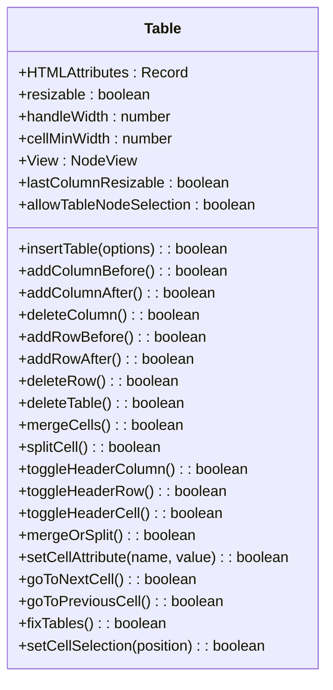

**Diagram sources**
- [table.ts](file://packages/extension-table-plus/src/table/table.ts#L32-L227)

**Section sources**
- [table.ts](file://packages/extension-table-plus/src/table/table.ts#L235-L486)

### 表头 (TableHeader)
表头组件用于创建表格中的表头单元格。它继承自Tiptap的Node类，定义了表头单元格的HTML属性和内容结构。表头单元格可以包含一个或多个段落，支持跨列和跨行属性。

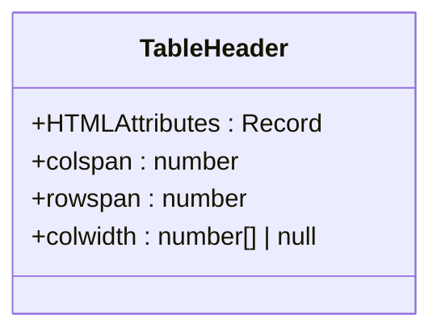

**Diagram sources**
- [table-header.ts](file://packages/extension-table-plus/src/header/table-header.ts#L5-L60)

**Section sources**
- [table-header.ts](file://packages/extension-table-plus/src/header/table-header.ts#L18-L60)

### 表行 (TableRow)
表行组件用于创建表格中的行。它定义了行的HTML属性和内容结构，可以包含多个表格单元格（tableCell）或表头单元格（tableHeader）。表行组件确保了表格结构的完整性。

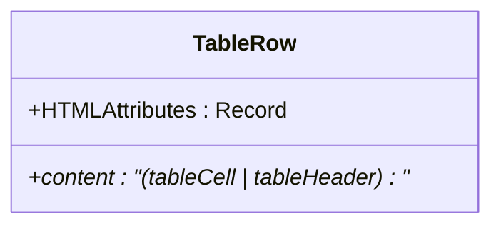

**Diagram sources**
- [table-row.ts](file://packages/extension-table-plus/src/row/table-row.ts#L5-L38)

**Section sources**
- [table-row.ts](file://packages/extension-table-plus/src/row/table-row.ts#L18-L38)

### 单元格 (TableCell)
单元格组件用于创建表格中的普通单元格。它支持嵌套节点的配置，允许在单元格中包含段落、图片等内容。单元格组件还实现了单元格选择的装饰功能，当单元格被选中时会添加相应的CSS类。

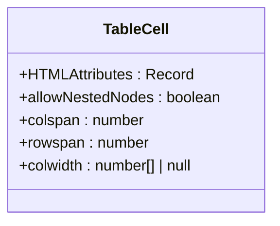

**Diagram sources**
- [table-cell.ts](file://packages/extension-table-plus/src/cell/table-cell.ts#L10-L150)

**Section sources**
- [table-cell.ts](file://packages/extension-table-plus/src/cell/table-cell.ts#L96-L150)

## 表格视图渲染机制

### TableView类
TableView类实现了ProseMirror的NodeView接口，负责表格的可视化渲染和交互。它创建了一个包含表格容器、添加行/列按钮和操作端点的包装器。TableView通过`updateColumns`函数动态更新表格列的宽度，确保表格布局的正确性。

```mermaid
classDiagram
class TableView {
+node : ProseMirrorNode
+cellMinWidth : number
+dom : HTMLDivElement
+table : HTMLTableElement
+colgroup : HTMLTableColElement
+contentDOM : HTMLTableSectionElement
+view : EditorView
+addRowButton : HTMLButtonElement
+addColumnButton : HTMLButtonElement
+tableContainer : HTMLDivElement
+rowEndpoint : HTMLButtonElement
+colEndpoint : HTMLButtonElement
+overlayUpdateRafId : number | null
+actionCallbacks : { onRowActionClick, onColumnActionClick }
+constructor(node, cellMinWidth, view, actionCallbacks)
+update(node) : boolean
+ignoreMutation(mutation) : boolean
+isEditable() : boolean
+syncEditableState()
+createHoverButtons()
+addTableRowOrColumn(isRow)
+setupEventListeners()
+bindOverlayHandlers()
+startSelectionWatcher()
+scheduleOverlayUpdate()
+updateOverlayPositions()
+setSelectionToTable()
+setSelectionToLastRow()
+setSelectionToLastColumn()
+hasTableCellSelection() : boolean
+selectRow(rowIndex)
+selectColumn(colIndex)
+destroy()
}
```

**Diagram sources**
- [TableView.ts](file://packages/extension-table-plus/src/table/TableView.ts#L81-L558)

**Section sources**
- [TableView.ts](file://packages/extension-table-plus/src/table/TableView.ts#L1-L558)

### 列宽更新机制
`updateColumns`函数负责更新表格列的宽度。它遍历表格的第一行，根据每个单元格的`colwidth`属性计算总宽度，并动态创建或更新`<col>`元素的样式。如果所有列都有固定宽度，则设置表格的宽度；否则设置表格的最小宽度。

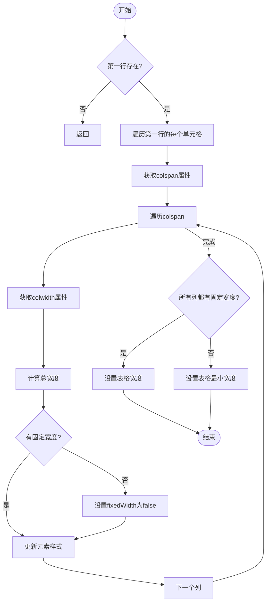

**Diagram sources**
- [TableView.ts](file://packages/extension-table-plus/src/table/TableView.ts#L11-L73)
- [createColGroup.ts](file://packages/extension-table-plus/src/table/utilities/createColGroup.ts#L22-L68)

**Section sources**
- [TableView.ts](file://packages/extension-table-plus/src/table/TableView.ts#L11-L73)
- [createColGroup.ts](file://packages/extension-table-plus/src/table/utilities/createColGroup.ts#L22-L68)

## 选择边界处理逻辑

### 单元格选择边界计算
`getCellSelectionBounds`函数用于计算当前单元格选择的边界。它首先检查当前选择是否为`CellSelection`，然后遍历选中的单元格，确定最小和最大的行索引、列索引以及左上角和右上角的位置。

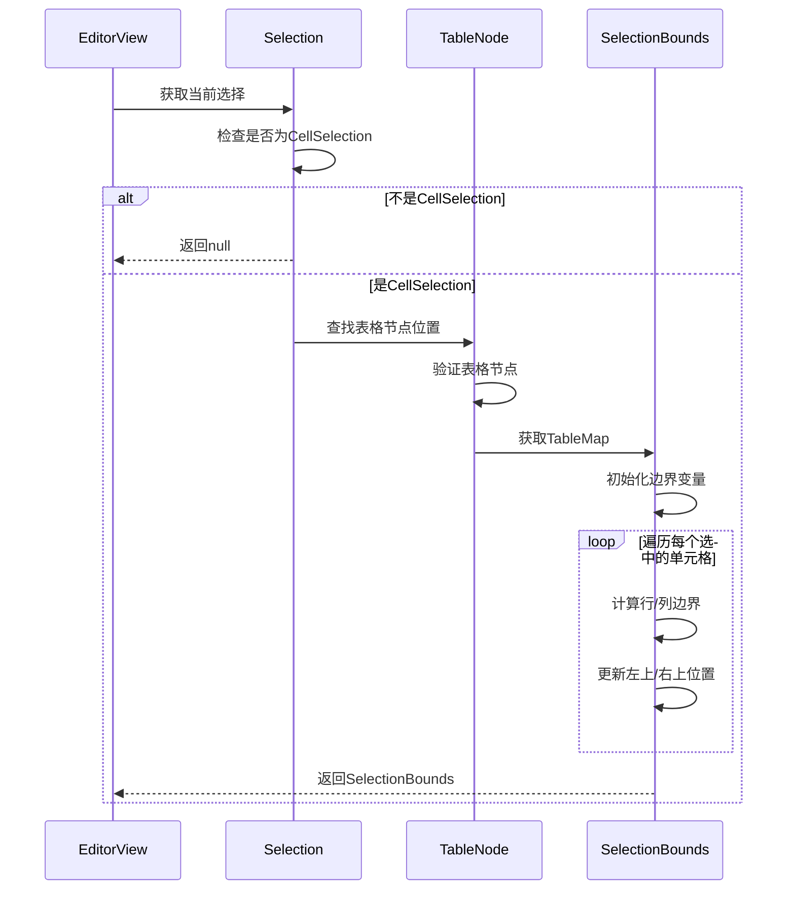

**Diagram sources**
- [selectionBounds.ts](file://packages/extension-table-plus/src/table/utilities/selectionBounds.ts#L21-L68)

**Section sources**
- [selectionBounds.ts](file://packages/extension-table-plus/src/table/utilities/selectionBounds.ts#L21-L68)

### 选择状态监听
TableView通过`startSelectionWatcher`方法监听文档的选择变化事件。当选择发生变化时，它会调度一个`requestAnimationFrame`来更新覆盖层的位置，确保操作端点（rowEndpoint和colEndpoint）正确显示在选中区域的边缘。

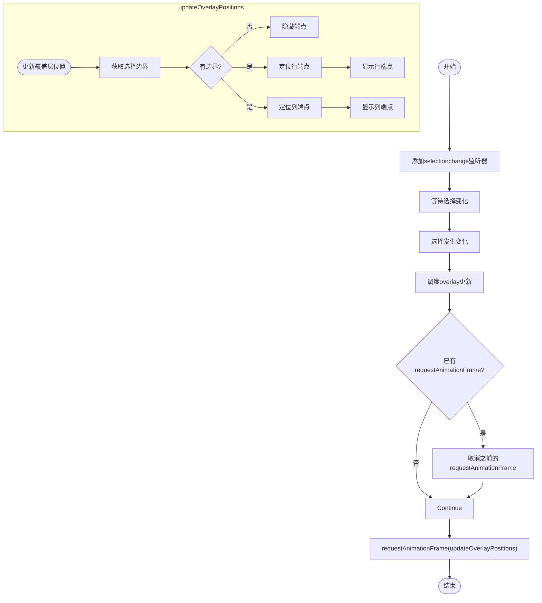

**Diagram sources**
- [TableView.ts](file://packages/extension-table-plus/src/table/TableView.ts#L353-L369)
- [TableView.ts](file://packages/extension-table-plus/src/table/TableView.ts#L371-L419)

**Section sources**
- [TableView.ts](file://packages/extension-table-plus/src/table/TableView.ts#L353-L419)

## 实用函数详解

### createTable函数
`createTable`函数用于创建一个新的表格节点。它接受schema、行数、列数、是否包含表头行以及单元格内容作为参数，返回一个ProseMirror节点。

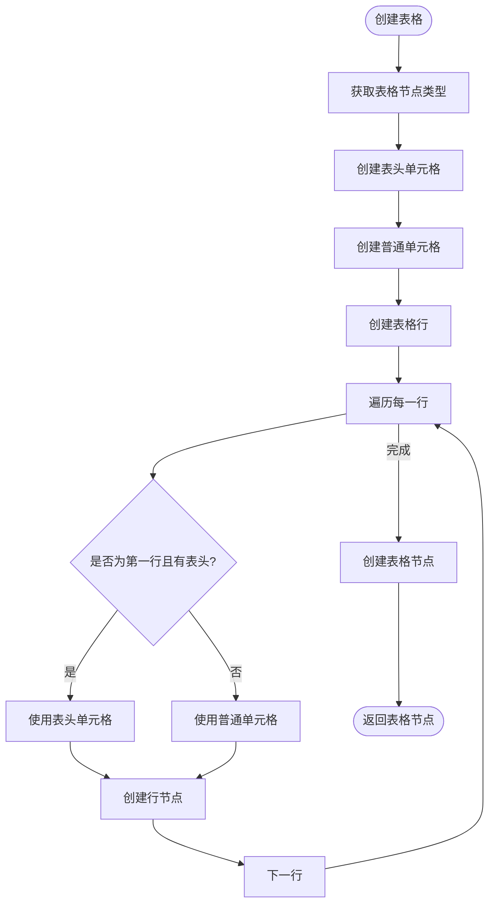

**Diagram sources**
- [createTable.ts](file://packages/extension-table-plus/src/table/utilities/createTable.ts#L6-L40)

**Section sources**
- [createTable.ts](file://packages/extension-table-plus/src/table/utilities/createTable.ts#L6-L40)

### createCell函数
`createCell`函数用于创建一个单元格节点。它接受单元格类型和可选的单元格内容作为参数，如果提供了内容则使用`createChecked`方法创建，否则使用`createAndFill`方法创建。

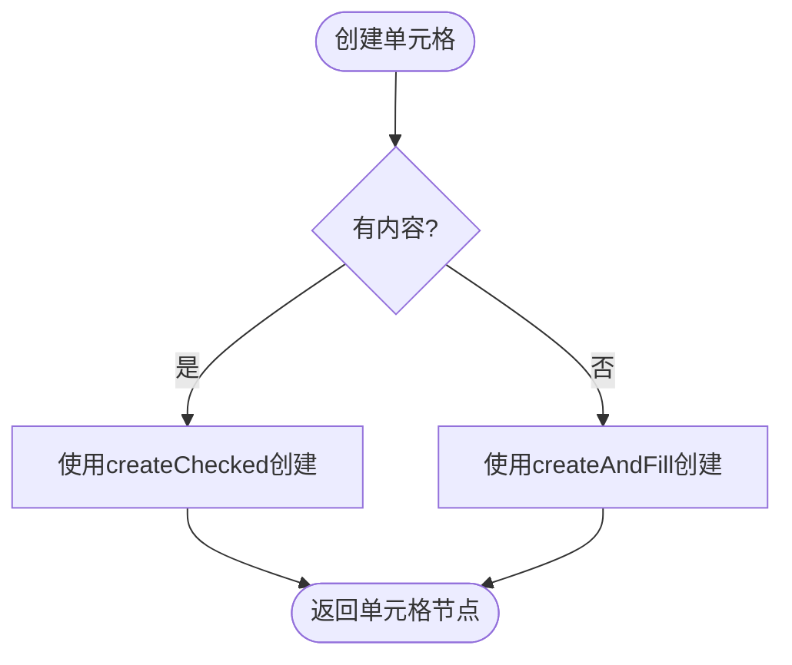

**Diagram sources**
- [createCell.ts](file://packages/extension-table-plus/src/table/utilities/createCell.ts#L3-L12)

**Section sources**
- [createCell.ts](file://packages/extension-table-plus/src/table/utilities/createCell.ts#L3-L12)

## 用户交互操作处理

### 添加行/列操作
添加行/列操作通过`addTableRowOrColumn`方法实现。该方法首先检查编辑器是否可编辑，然后保存当前选择信息，设置选择到最后一行或最后一列，最后执行添加行或列的命令。

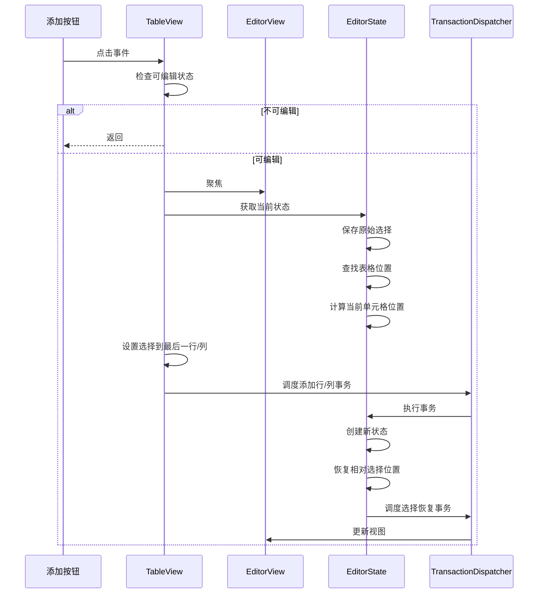

**Diagram sources**
- [TableView.ts](file://packages/extension-table-plus/src/table/TableView.ts#L224-L307)

**Section sources**
- [TableView.ts](file://packages/extension-table-plus/src/table/TableView.ts#L224-L307)

### 行/列选择操作
行/列选择操作通过`selectRow`和`selectColumn`方法实现。这些方法首先查找表格位置，然后计算选中行或列的第一个和最后一个单元格位置，最后创建一个`CellSelection`并设置到编辑器状态中。

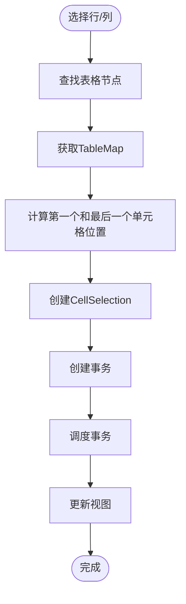

**Diagram sources**
- [TableView.ts](file://packages/extension-table-plus/src/table/TableView.ts#L496-L548)

**Section sources**
- [TableView.ts](file://packages/extension-table-plus/src/table/TableView.ts#L496-L548)

## 编辑器集成示例

### 基本集成
要将表格功能集成到编辑器中，可以使用TableKit扩展，它包含了表格相关的所有组件。

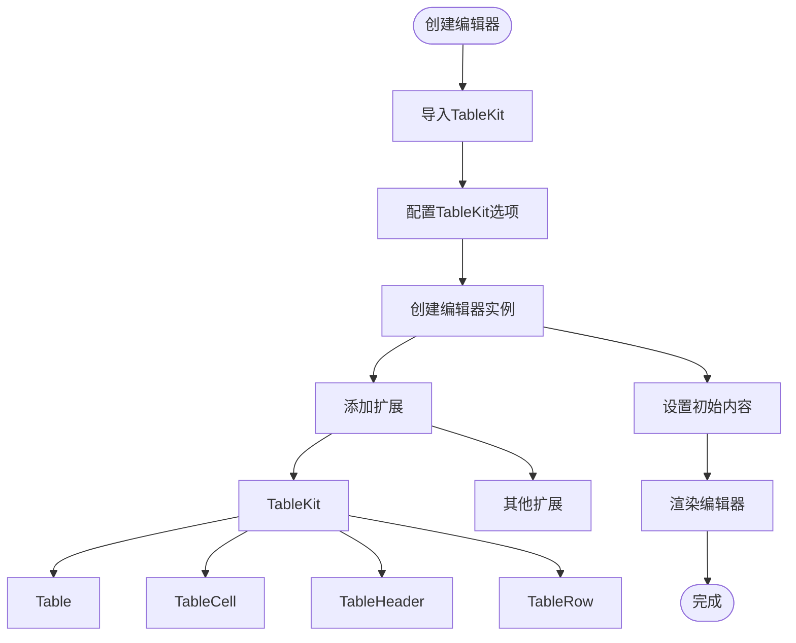

**Diagram sources**
- [kit/index.ts](file://packages/extension-table-plus/src/kit/index.ts#L41-L65)
- [table.ts](file://packages/extension-table-plus/src/table/table.ts#L235-L486)

**Section sources**
- [kit/index.ts](file://packages/extension-table-plus/src/kit/index.ts#L41-L65)

### 工具栏按钮配置
可以通过配置TableKit的选项来定制工具栏按钮的行为，例如启用或禁用某些功能。

```typescript
import { TableKit } from 'extension-table-plus'

const editor = new Editor({
  extensions: [
    TableKit.configure({
      table: {
        resizable: true,
        cellMinWidth: 50,
        allowTableNodeSelection: true
      },
      tableCell: {
        allowNestedNodes: true
      }
    })
  ]
})
```

**Section sources**
- [kit/index.ts](file://packages/extension-table-plus/src/kit/index.ts#L13-L34)
- [table.ts](file://packages/extension-table-plus/src/table/table.ts#L32-L86)

### 快捷键设置
表格扩展模块内置了常用的快捷键，如Tab键移动到下一个单元格，Shift+Tab键移动到上一个单元格，Backspace键删除整个表格等。

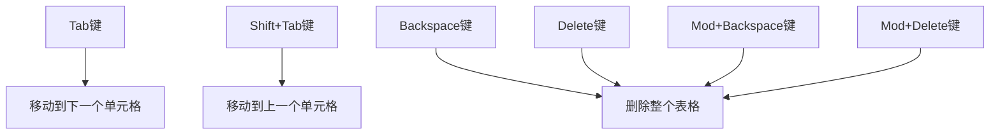

**Diagram sources**
- [table.ts](file://packages/extension-table-plus/src/table/table.ts#L433-L451)

**Section sources**
- [table.ts](file://packages/extension-table-plus/src/table/table.ts#L433-L451)

## 跨浏览器兼容性
表格扩展模块通过使用标准的ProseMirror API和CSS样式来确保跨浏览器兼容性。TableView类使用标准的DOM操作方法创建和更新表格元素，避免使用浏览器特定的API。列宽计算和更新使用标准的CSS样式属性，确保在不同浏览器中表现一致。

**Section sources**
- [TableView.ts](file://packages/extension-table-plus/src/table/TableView.ts#L1-L558)
- [createColGroup.ts](file://packages/extension-table-plus/src/table/utilities/createColGroup.ts#L22-L68)