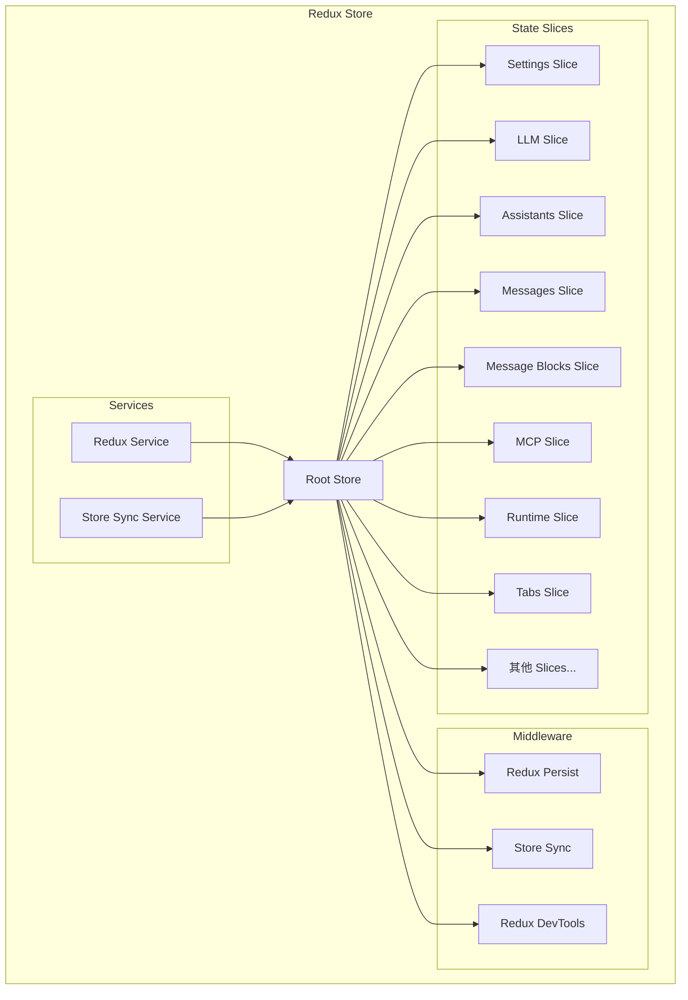
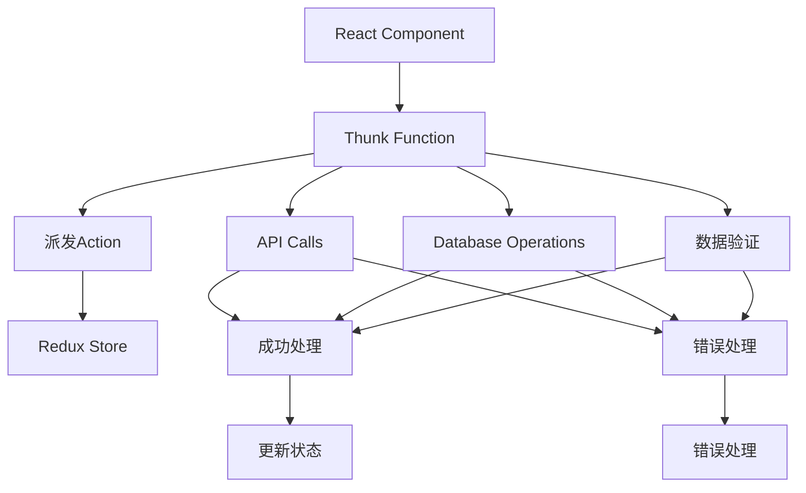
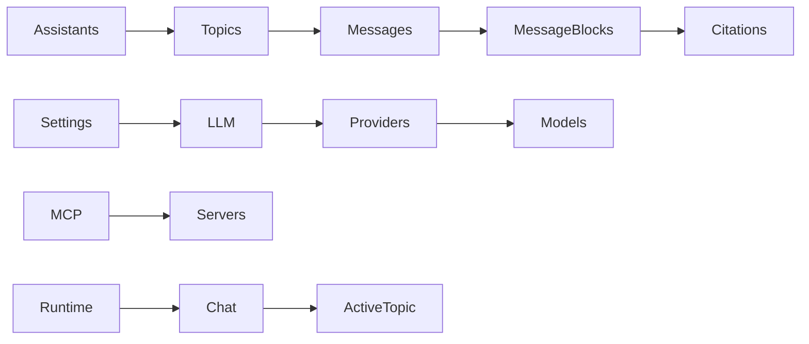

# Cherry Studio Store设计与状态分片

<cite>
**本文档中引用的文件**
- [src/renderer/src/store/index.ts](file://src/renderer/src/store/index.ts)
- [src/renderer/src/store/settings.ts](file://src/renderer/src/store/settings.ts)
- [src/renderer/src/store/llm.ts](file://src/renderer/src/store/llm.ts)
- [src/renderer/src/store/messageBlock.ts](file://src/renderer/src/store/messageBlock.ts)
- [src/renderer/src/store/mcp.ts](file://src/renderer/src/store/mcp.ts)
- [src/renderer/src/store/assistants.ts](file://src/renderer/src/store/assistants.ts)
- [src/renderer/src/store/runtime.ts](file://src/renderer/src/store/runtime.ts)
- [src/renderer/src/store/tabs.ts](file://src/renderer/src/store/tabs.ts)
- [src/renderer/src/store/thunk/knowledgeThunk.ts](file://src/renderer/src/store/thunk/knowledgeThunk.ts)
- [src/renderer/src/store/thunk/messageThunk.ts](file://src/renderer/src/store/thunk/messageThunk.ts)
- [src/main/services/ReduxService.ts](file://src/main/services/ReduxService.ts)
- [src/renderer/src/services/StoreSyncService.ts](file://src/renderer/src/services/StoreSyncService.ts)
</cite>

## 目录
1. [概述](#概述)
2. [Redux Store架构](#redux-store架构)
3. [ConfigureStore配置](#configurestore配置)
4. [状态分片设计理念](#状态分片设计理念)
5. [核心Slice分析](#核心slice分析)
6. [Slice Reducer组织方式](#slice-reducer组织方式)
7. [异步操作与Thunk](#异步操作与thunk)
8. [状态规范化策略](#状态规范化策略)
9. [跨窗口状态同步](#跨窗口状态同步)
10. [最佳实践与优化建议](#最佳实践与优化建议)

## 概述

Cherry Studio采用基于Redux Toolkit的现代状态管理架构，通过模块化的方式将应用状态划分为多个独立的slice。这种设计不仅提高了代码的可维护性，还实现了状态的高效管理和组件间的解耦。

### 架构特点

- **模块化设计**：每个功能领域对应独立的state slice
- **类型安全**：充分利用TypeScript确保类型安全
- **性能优化**：采用实体适配器和选择器优化状态访问
- **跨窗口同步**：支持多窗口间的状态同步
- **异步操作**：完善的Thunk机制处理复杂异步逻辑

## Redux Store架构

### 整体架构图



**图表来源**
- [src/renderer/src/store/index.ts](file://src/renderer/src/store/index.ts#L38-L63)

**章节来源**
- [src/renderer/src/store/index.ts](file://src/renderer/src/store/index.ts#L1-L137)

## ConfigureStore配置

### 基础配置

Cherry Studio的Store配置体现了现代Redux的最佳实践：

```typescript
// Store配置概览
const store = configureStore({
  reducer: persistedReducer as typeof rootReducer,
  middleware: (getDefaultMiddleware) => {
    return getDefaultMiddleware({
      serializableCheck: {
        ignoredActions: [FLUSH, REHYDRATE, PAUSE, PERSIST, PURGE, REGISTER]
      }
    }).concat(storeSyncService.createMiddleware())
  },
  devTools: true
})
```

### 关键配置特性

1. **持久化存储**：使用redux-persist保存重要状态
2. **序列化检查**：忽略特定的持久化相关动作
3. **中间件链**：集成Store同步中间件
4. **开发工具**：启用Redux DevTools

### 黑名单配置

```typescript
const persistedReducer = persistReducer({
  key: 'cherry-studio',
  storage,
  version: 179,
  blacklist: ['runtime', 'messages', 'messageBlocks', 'tabs', 'toolPermissions'],
  migrate
})
```

**章节来源**
- [src/renderer/src/store/index.ts](file://src/renderer/src/store/index.ts#L66-L102)

## 状态分片设计理念

### 分片原则

Cherry Studio遵循以下状态分片原则：

1. **功能边界**：每个slice负责单一功能域
2. **状态隔离**：减少slice间的直接依赖
3. **可测试性**：独立的slice便于单元测试
4. **性能优化**：按需加载和更新状态

### 分片职责划分

| Slice名称 | 主要职责 | 数据类型 | 更新频率 |
|-----------|----------|----------|----------|
| settings | 应用配置和用户偏好 | 复杂嵌套对象 | 低频更新 |
| llm | 大语言模型配置 | Provider和Model集合 | 中等频率 |
| assistants | 助手和对话管理 | Assistant和Topic数组 | 高频更新 |
| messages | 消息内容存储 | 实体适配器模式 | 最高频更新 |
| messageBlocks | 消息块和引用 | 实体适配器模式 | 高频更新 |
| mcp | MCP服务器管理 | 服务器配置列表 | 中等频率 |
| runtime | 运行时状态 | UI状态和临时数据 | 实时更新 |
| tabs | 标签页管理 | Tab对象数组 | 中等频率 |

## 核心Slice分析

### Settings Slice - 应用配置管理

Settings slice是应用的核心配置中心，包含大量用户偏好设置：

#### 数据结构设计

```typescript
export interface SettingsState {
  showAssistants: boolean
  language: LanguageVarious
  proxyMode: 'system' | 'custom' | 'none'
  theme: ThemeMode
  userTheme: UserTheme
  codeEditor: {
    enabled: boolean
    themeLight: string
    themeDark: string
  }
  // ... 更多配置项
}
```

#### Reducer实现特点

- **批量更新**：支持部分字段更新
- **嵌套对象处理**：合理处理深层嵌套状态
- **默认值管理**：统一的初始化策略

**章节来源**
- [src/renderer/src/store/settings.ts](file://src/renderer/src/store/settings.ts#L40-L226)

### LLM Slice - 大语言模型管理

LLM slice负责管理AI服务提供商和模型配置：

#### 核心数据结构

```typescript
export interface LlmState {
  providers: Provider[]
  defaultModel: Model
  quickModel: Model
  translateModel: Model
  settings: LlmSettings
}
```

#### 特色功能

- **动态提供商管理**：支持添加、删除和更新提供商
- **模型生命周期**：管理模型的启用/禁用状态
- **配置验证**：确保配置的有效性

**章节来源**
- [src/renderer/src/store/llm.ts](file://src/renderer/src/store/llm.ts#L36-L80)

### MessageBlocks Slice - 消息块管理

MessageBlocks slice采用实体适配器模式，专门处理消息块和引用：

#### 实体适配器使用

```typescript
const messageBlocksAdapter = createEntityAdapter<MessageBlockEntity>()

const initialState = messageBlocksAdapter.getInitialState({
  loadingState: 'idle' as 'idle' | 'loading' | 'succeeded' | 'failed',
  error: null as string | null
})
```

#### 核心操作

- **CRUD操作**：upsert、remove、update等
- **批量处理**：支持批量添加和删除
- **状态管理**：加载状态和错误处理

**章节来源**
- [src/renderer/src/store/messageBlock.ts](file://src/renderer/src/store/messageBlock.ts#L15-L31)

### MCP Slice - MCP服务器管理

MCP slice管理Model Context Protocol服务器：

#### 内置服务器配置

```typescript
export const builtinMCPServers: BuiltinMCPServer[] = [
  {
    id: nanoid(),
    name: BuiltinMCPServerNames.memory,
    type: 'inMemory',
    isActive: true,
    provider: 'CherryAI',
    installSource: 'builtin',
    isTrusted: true
  }
  // ... 更多内置服务器
]
```

**章节来源**
- [src/renderer/src/store/mcp.ts](file://src/renderer/src/store/mcp.ts#L73-L178)

## Slice Reducer组织方式

### createSlice简化模式

Cherry Studio广泛使用createSlice来简化action和reducer的定义：

```typescript
const settingsSlice = createSlice({
  name: 'settings',
  initialState,
  reducers: {
    setLanguage: (state, action: PayloadAction<LanguageVarious>) => {
      state.language = action.payload
    },
    setTheme: (state, action: PayloadAction<ThemeMode>) => {
      state.theme = action.payload
    },
    // ... 更多reducer
  }
})
```

### Reducer函数实现模式

1. **不可变更新**：直接修改state对象
2. **类型安全**：利用PayloadAction确保类型正确
3. **组合更新**：支持复杂对象的部分更新

### Selector集成

每个slice都提供专门的选择器：

```typescript
export const selectMCP = (state: { mcp: MCPConfig }) => state.mcp
export const { getActiveServers, getAllServers } = mcpSlice.selectors
```

**章节来源**
- [src/renderer/src/store/settings.ts](file://src/renderer/src/store/settings.ts#L420-L800)
- [src/renderer/src/store/mcp.ts](file://src/renderer/src/store/mcp.ts#L13-L64)

## 异步操作与Thunk

### Thunk架构

Cherry Studio使用Thunk处理复杂的异步操作：



**图表来源**
- [src/renderer/src/store/thunk/knowledgeThunk.ts](file://src/renderer/src/store/thunk/knowledgeThunk.ts#L44-L88)

### 知识库Thunk示例

```typescript
export const addNoteThunk = (baseId: string, content: string) => async (dispatch: AppDispatch) => {
  const noteId = uuidv4()
  const note = createKnowledgeItem('note', content, { id: noteId })
  
  // 存储完整笔记到数据库
  await db.knowledge_notes.add(note)
  
  // 在store中只存储引用
  const noteRef = { ...note, content: '' }
  dispatch(updateNotes({ baseId, item: noteRef }))
}
```

### 消息处理Thunk

消息处理涉及复杂的流式传输和状态管理：

```typescript
export const sendMessageThunk = (params: SendMessageParams) => async (
  dispatch: AppDispatch,
  getState: () => RootState
) => {
  // 流式处理逻辑
  // 状态更新
  // 错误处理
}
```

**章节来源**
- [src/renderer/src/store/thunk/knowledgeThunk.ts](file://src/renderer/src/store/thunk/knowledgeThunk.ts#L54-L70)
- [src/renderer/src/store/thunk/messageThunk.ts](file://src/renderer/src/store/thunk/messageThunk.ts#L1-L200)

## 状态规范化策略

### 实体适配器使用

Cherry Studio大量使用实体适配器来规范化状态结构：

```typescript
// 消息状态规范化
const messagesAdapter = createEntityAdapter<Message>({
  selectId: (message) => message.id,
  sortComparer: (a, b) => b.createdAt.localeCompare(a.createdAt)
})

// 消息块状态规范化
const messageBlocksAdapter = createEntityAdapter<MessageBlockEntity>()
```

### 状态规范化优势

1. **查询优化**：O(1)时间复杂度的查找
2. **批量操作**：高效的批量CRUD操作
3. **内存优化**：避免重复数据存储
4. **选择器友好**：便于构建复杂查询

### 数据依赖关系



**图表来源**
- [src/renderer/src/store/assistants.ts](file://src/renderer/src/store/assistants.ts#L12-L19)
- [src/renderer/src/store/messageBlock.ts](file://src/renderer/src/store/messageBlock.ts#L12-L14)

### 避免状态冗余

1. **引用关系**：使用ID引用而非嵌套对象
2. **计算属性**：通过selector计算派生状态
3. **缓存策略**：LRU缓存常用计算结果
4. **懒加载**：按需加载大型数据集

**章节来源**
- [src/renderer/src/store/messageBlock.ts](file://src/renderer/src/store/messageBlock.ts#L15-L31)

## 跨窗口状态同步

### Store同步服务

Cherry Studio实现了跨窗口的状态同步机制：

```typescript
// 同步配置
storeSyncService.setOptions({
  syncList: ['assistants/', 'settings/', 'llm/', 'selectionStore/', 'note/']
})
```

### 同步中间件

```typescript
public createMiddleware(): Middleware {
  return () => (next) => (action) => {
    const result = next(action)
    
    const syncAction = action as StoreSyncAction
    if (!syncAction.meta?.fromSync && this.shouldSyncAction(syncAction.type)) {
      if (window.api?.storeSync) {
        window.api.storeSync.onUpdate(syncAction)
      }
    }
    
    return result
  }
}
```

### 同步策略

1. **白名单机制**：指定需要同步的slice
2. **防环控制**：防止同步循环
3. **增量更新**：只同步变更的部分
4. **版本兼容**：处理不同版本间的兼容性

**章节来源**
- [src/renderer/src/store/index.ts](file://src/renderer/src/store/index.ts#L88-L90)
- [src/renderer/src/services/StoreSyncService.ts](file://src/renderer/src/services/StoreSyncService.ts#L55-L70)

## 最佳实践与优化建议

### 性能优化策略

1. **选择器优化**
   - 使用createSelector进行记忆化
   - 避免在渲染中创建新对象
   - 合理使用浅比较

2. **状态结构优化**
   - 保持扁平化状态树
   - 避免深层嵌套
   - 使用实体适配器

3. **异步操作优化**
   - 合理使用Thunk
   - 实现适当的错误处理
   - 提供加载状态反馈

### 类型安全实践

1. **严格类型定义**
   ```typescript
   export type AppDispatch = typeof store.dispatch
   export type RootState = ReturnType<typeof rootReducer>
   ```

2. **PayloadAction使用**
   ```typescript
   setLanguage: (state, action: PayloadAction<LanguageVarious>) => {
     state.language = action.payload
   }
   ```

3. **接口继承**
   ```typescript
   interface SettingsState extends BaseSettings {
     // 扩展字段
   }
   ```

### 开发体验优化

1. **Redux DevTools集成**
2. **类型推导增强**
3. **自动生成代码**
4. **错误边界处理**

### 维护性考虑

1. **模块化设计**：清晰的功能边界
2. **文档化**：完整的类型注释
3. **测试覆盖**：充分的单元测试
4. **版本控制**：合理的迁移策略

通过以上设计和实现，Cherry Studio建立了一个健壮、可扩展且易于维护的状态管理系统，为复杂的AI应用提供了坚实的基础架构支撑。