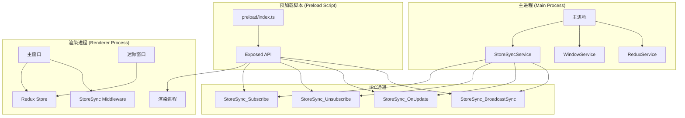
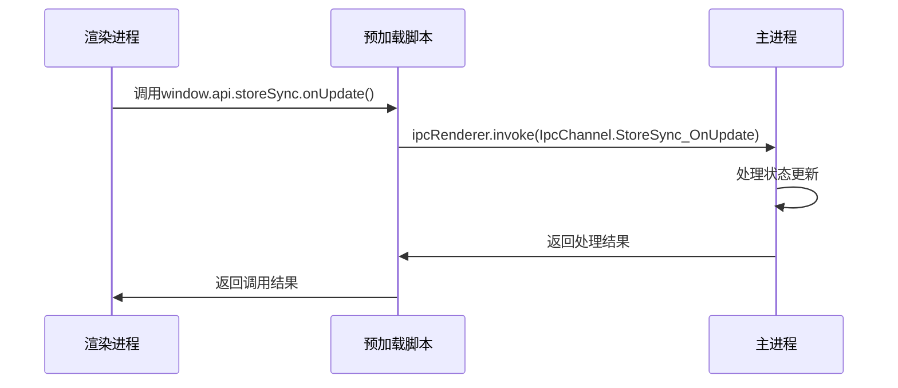
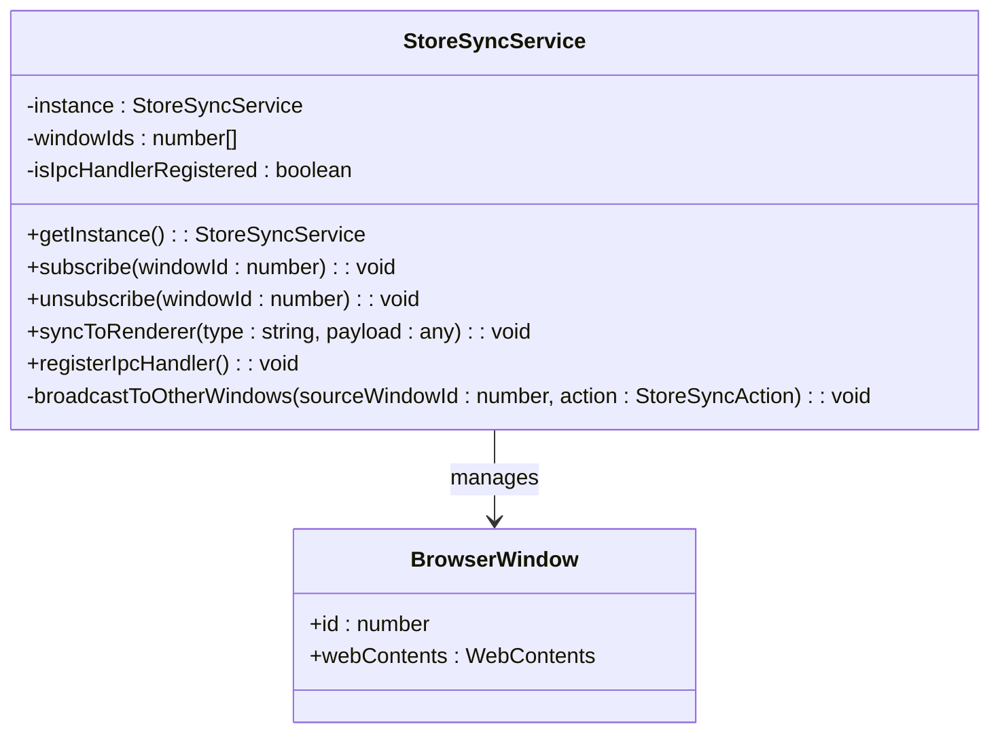
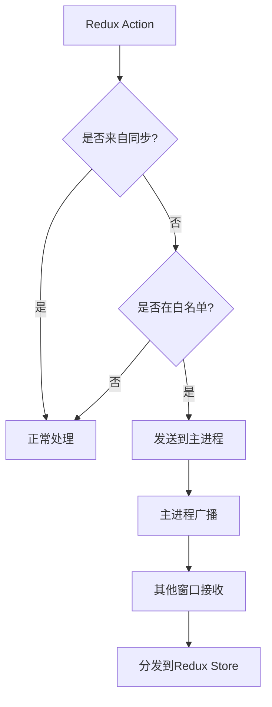
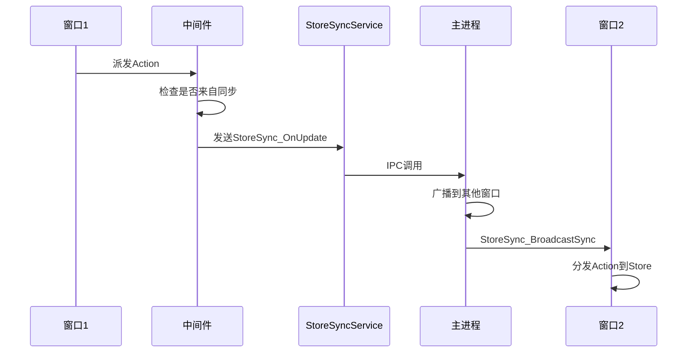
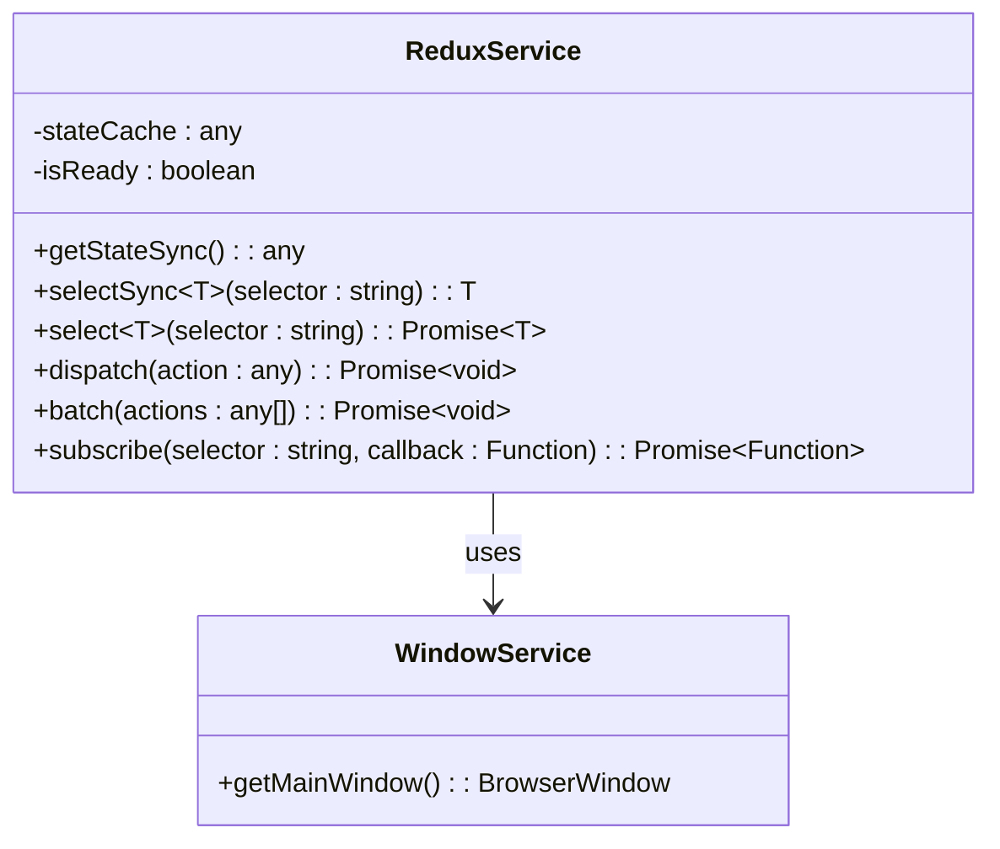

# Cherry Studio主渲染进程IPC通信机制

<cite>
**本文档引用的文件**
- [IpcChannel.ts](file://packages/shared/IpcChannel.ts)
- [ipc.ts](file://src/main/ipc.ts)
- [index.ts](file://src/preload/index.ts)
- [StoreSyncService.ts](file://src/main/services/StoreSyncService.ts)
- [StoreSyncService.ts](file://src/renderer/src/services/StoreSyncService.ts)
- [WindowService.ts](file://src/main/services/WindowService.ts)
- [ReduxService.ts](file://src/main/services/ReduxService.ts)
- [index.ts](file://src/renderer/src/store/index.ts)
- [bootstrap.ts](file://src/main/bootstrap.ts)
</cite>

## 目录
1. [概述](#概述)
2. [IPC通信架构](#ipc通信架构)
3. [预加载脚本安全桥接](#预加载脚本安全桥接)
4. [StoreSync通信机制](#storesync通信机制)
5. [Redux状态同步实现](#redux状态同步实现)
6. [通信安全性考虑](#通信安全性考虑)
7. [高级通信模式](#高级通信模式)
8. [故障排除指南](#故障排除指南)
9. [最佳实践建议](#最佳实践建议)

## 概述

Cherry Studio采用基于Electron的多进程架构，通过精心设计的IPC（Inter-Process Communication）机制实现主进程与渲染进程之间的安全通信。该系统的核心是StoreSync服务，它负责在多个窗口实例之间同步Redux状态，确保用户界面的一致性。

### 核心特性

- **安全的跨进程通信**：通过预加载脚本建立安全的API桥接
- **Redux状态同步**：自动在多窗口间同步状态变更
- **白名单过滤**：可配置的action类型白名单机制
- **无限循环防护**：防止状态同步过程中的无限循环
- **上下文隔离**：利用Electron的上下文隔离功能增强安全性

## IPC通信架构

### 整体架构图



**图表来源**
- [StoreSyncService.ts](file://src/main/services/StoreSyncService.ts#L1-L133)
- [WindowService.ts](file://src/main/services/WindowService.ts#L1-L685)
- [index.ts](file://src/preload/index.ts#L1-L594)

### IPC通道枚举

系统定义了专门的IPC通道用于StoreSync通信：

| 通道名称 | 方向 | 描述 |
|---------|------|------|
| `StoreSync_Subscribe` | 渲染进程 → 主进程 | 请求订阅StoreSync服务 |
| `StoreSync_Unsubscribe` | 渲染进程 → 主进程 | 请求取消订阅StoreSync服务 |
| `StoreSync_OnUpdate` | 渲染进程 → 主进程 | 发送状态更新请求 |
| `StoreSync_BroadcastSync` | 主进程 → 渲染进程 | 广播状态同步消息 |

**章节来源**
- [IpcChannel.ts](file://packages/shared/IpcChannel.ts#L269-L274)

## 预加载脚本安全桥接

### 安全桥接机制

预加载脚本作为主进程与渲染进程之间的安全桥梁，提供了受控的API访问接口：



**图表来源**
- [index.ts](file://src/preload/index.ts#L433-L437)

### API暴露策略

预加载脚本采用选择性API暴露策略：

```typescript
// 安全的API暴露
if (process.contextIsolated) {
  try {
    contextBridge.exposeInMainWorld('electron', electronAPI)
    contextBridge.exposeInMainWorld('api', api)
  } catch (error) {
    console.error('[Preload]Failed to expose APIs:', error as Error)
  }
} else {
  window.electron = electronAPI
  window.api = api
}
```

**章节来源**
- [index.ts](file://src/preload/index.ts#L578-L594)

## StoreSync通信机制

### 主进程StoreSync服务

主进程的StoreSyncService负责管理窗口订阅和广播同步：



**图表来源**
- [StoreSyncService.ts](file://src/main/services/StoreSyncService.ts#L15-L133)

### 渲染进程StoreSync服务

渲染进程的StoreSyncService提供Redux中间件和IPC监听：



**图表来源**
- [StoreSyncService.ts](file://src/renderer/src/services/StoreSyncService.ts#L55-L70)

**章节来源**
- [StoreSyncService.ts](file://src/main/services/StoreSyncService.ts#L1-L133)
- [StoreSyncService.ts](file://src/renderer/src/services/StoreSyncService.ts#L1-L137)

## Redux状态同步实现

### 中间件集成

StoreSync中间件被集成到Redux配置中：

```typescript
const store = configureStore({
  reducer: persistedReducer as typeof rootReducer,
  middleware: (getDefaultMiddleware) => {
    return getDefaultMiddleware({
      serializableCheck: {
        ignoredActions: [FLUSH, REHYDRATE, PAUSE, PERSIST, PURGE, REGISTER]
      }
    }).concat(storeSyncService.createMiddleware())
  },
  devTools: true
})
```

**章节来源**
- [index.ts](file://src/renderer/src/store/index.ts#L92-L103)

### 状态同步流程



**图表来源**
- [StoreSyncService.ts](file://src/renderer/src/services/StoreSyncService.ts#L55-L70)
- [StoreSyncService.ts](file://src/main/services/StoreSyncService.ts#L90-L97)

### 白名单配置

系统支持通过白名单控制哪些action需要同步：

```typescript
private shouldSyncAction(actionType: string): boolean {
  if (!this.options.syncList.length) {
    return false
  }
  
  return this.options.syncList.some((prefix) => {
    return actionType.startsWith(prefix)
  })
}
```

**章节来源**
- [StoreSyncService.ts](file://src/renderer/src/services/StoreSyncService.ts#L78-L88)

## 通信安全性考虑

### 上下文隔离

系统充分利用Electron的上下文隔离功能：

```typescript
// 检查上下文隔离状态
if (process.contextIsolated) {
  // 使用contextBridge安全暴露API
  contextBridge.exposeInMainWorld('api', api)
}
```

### API暴露最佳实践

1. **最小权限原则**：只暴露必要的API
2. **参数验证**：对所有输入参数进行验证
3. **错误处理**：完善的错误捕获和处理机制
4. **资源清理**：及时清理IPC监听器和订阅

### 防止无限循环

系统通过meta字段防止状态同步过程中的无限循环：

```typescript
const syncAction = {
  ...action,
  meta: {
    ...action.meta,
    fromSync: true,
    source: `windowId:${sourceWindowId}`
  }
}
```

**章节来源**
- [index.ts](file://src/preload/index.ts#L578-L594)
- [StoreSyncService.ts](file://src/main/services/StoreSyncService.ts#L108-L116)

## 高级通信模式

### tracedInvoke函数

系统提供了tracedInvoke函数用于带有追踪上下文的通信：

```typescript
export function tracedInvoke(channel: string, spanContext: SpanContext | undefined, ...args: any[]) {
  if (spanContext) {
    const data = { type: 'trace', context: spanContext }
    return ipcRenderer.invoke(channel, ...args, data)
  }
  return ipcRenderer.invoke(channel, ...args)
}
```

### ReduxService高级功能

ReduxService提供了多种高级通信模式：



**图表来源**
- [ReduxService.ts](file://src/main/services/ReduxService.ts#L41-L231)

**章节来源**
- [index.ts](file://src/preload/index.ts#L61-L67)
- [ReduxService.ts](file://src/main/services/ReduxService.ts#L1-L231)

## 故障排除指南

### 常见问题及解决方案

1. **StoreSync服务未初始化**
   - 检查StoreSyncService是否正确注册
   - 确认IPC通道是否已建立

2. **状态同步失败**
   - 验证action类型是否在白名单中
   - 检查窗口订阅状态

3. **无限循环问题**
   - 确认action的meta.fromSync字段正确设置
   - 检查中间件执行顺序

### 调试技巧

```typescript
// 启用调试日志
const logger = loggerService.withContext('StoreSyncService')

// 检查StoreSync状态
console.log('StoreSync options:', storeSyncService.options)
console.log('Window IDs:', storeSyncService.windowIds)
```

## 最佳实践建议

### 开发建议

1. **合理配置白名单**：只同步必要的状态变更
2. **及时清理资源**：在组件卸载时取消订阅
3. **错误处理**：为所有IPC调用添加适当的错误处理
4. **性能优化**：避免频繁的状态同步操作

### 安全建议

1. **参数验证**：对所有IPC参数进行严格验证
2. **权限控制**：限制不必要的API访问
3. **审计日志**：记录重要的状态变更操作
4. **定期审查**：定期检查IPC通信的安全性

### 维护建议

1. **版本兼容性**：确保IPC协议的向后兼容性
2. **监控指标**：监控IPC通信的性能指标
3. **测试覆盖**：编写全面的IPC通信测试
4. **文档维护**：保持IPC通信文档的更新

通过这套精心设计的IPC通信机制，Cherry Studio实现了安全、高效的多窗口状态同步，为用户提供了一致的使用体验。该系统的设计充分考虑了安全性、性能和可维护性，是现代Electron应用开发的优秀范例。