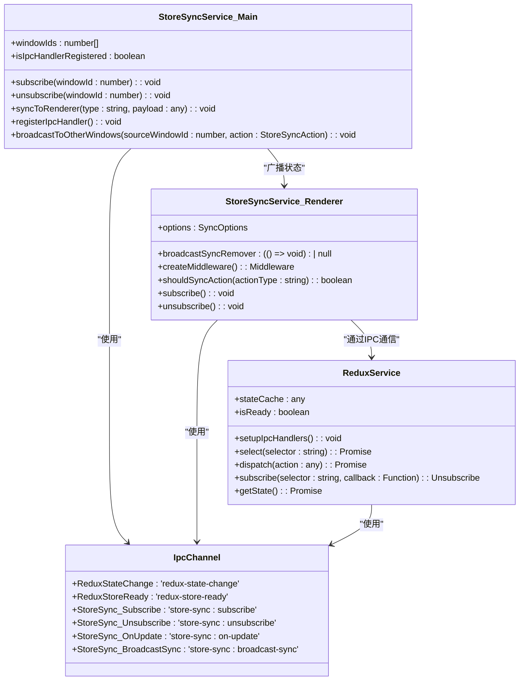
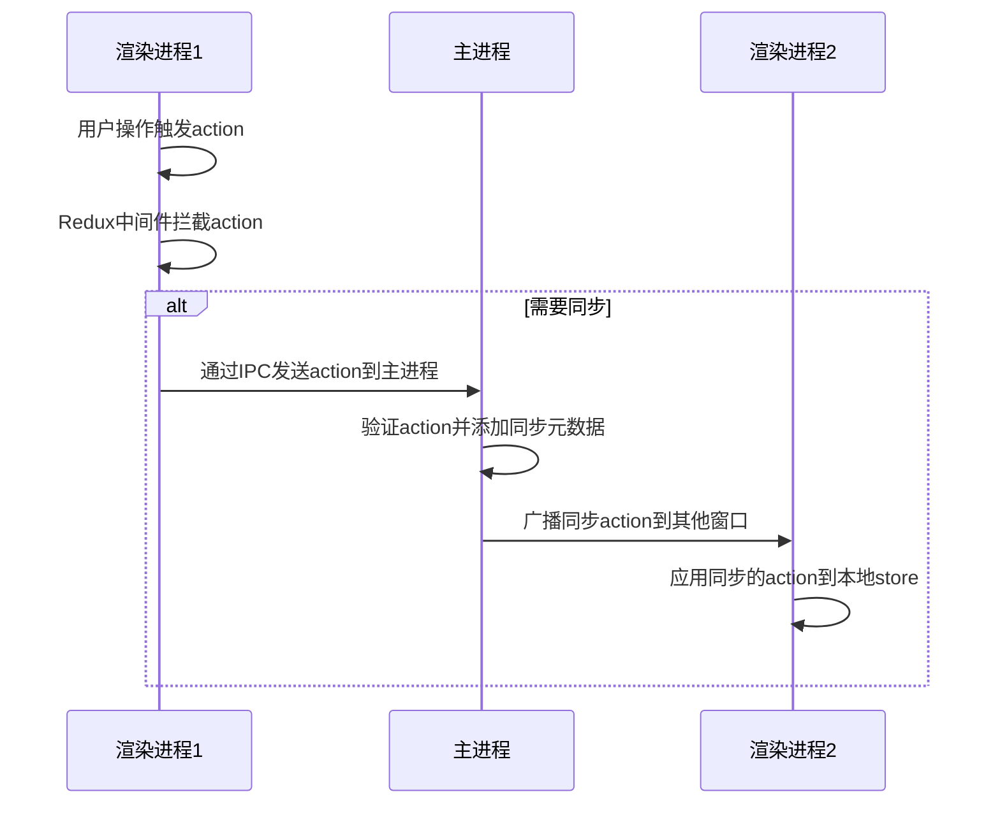
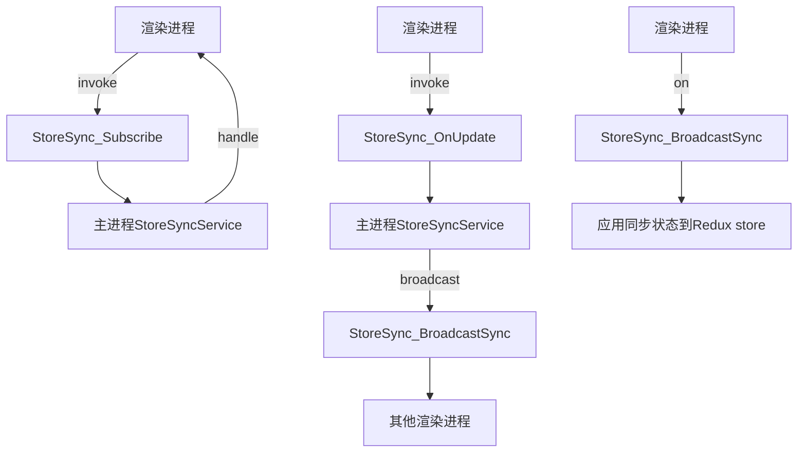
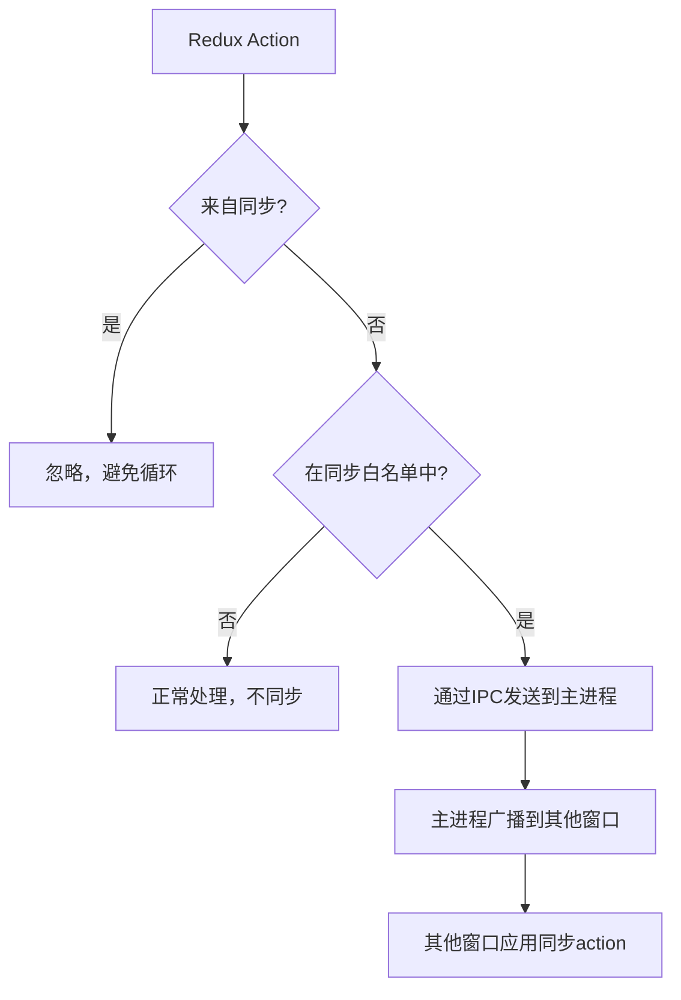
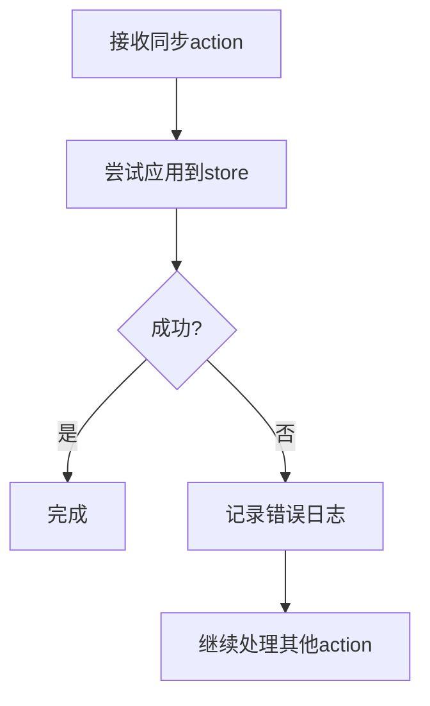

# 主渲染进程状态同步

<cite>
**本文档引用的文件**   
- [ReduxService.ts](file://src/main/services/ReduxService.ts)
- [StoreSyncService.ts](file://src/main/services/StoreSyncService.ts)
- [StoreSyncService.ts](file://src/renderer/src/services/StoreSyncService.ts)
- [IpcChannel.ts](file://packages/shared/IpcChannel.ts)
- [index.ts](file://src/preload/index.ts)
</cite>

## 目录
1. [简介](#简介)
2. [核心组件](#核心组件)
3. [状态同步机制](#状态同步机制)
4. [IPC通信机制](#ipc通信机制)
5. [同步策略与优化](#同步策略与优化)
6. [错误处理与竞态条件](#错误处理与竞态条件)
7. [序列化与反序列化](#序列化与反序列化)
8. [性能优化](#性能优化)

## 简介
Cherry Studio采用Electron框架构建，其架构包含主进程（main process）和渲染进程（renderer process）。为了实现多窗口间的状态一致性，系统通过Electron的IPC（进程间通信）机制实现了Redux状态的双向同步。本文档详细阐述了主进程与渲染进程之间的状态同步机制，包括ReduxService作为状态中心的作用、StoreSyncService如何监听状态变化并广播到各个窗口、同步策略的选择以及性能优化和错误处理机制。

**Section sources**
- [ReduxService.ts](file://src/main/services/ReduxService.ts#L1-L232)
- [StoreSyncService.ts](file://src/main/services/StoreSyncService.ts#L1-L133)

## 核心组件

Cherry Studio的状态同步机制主要由两个核心组件构成：ReduxService和StoreSyncService。

ReduxService位于主进程中，作为全局状态中心，负责管理应用的状态。它通过EventEmitter模式提供状态订阅功能，并通过IPC与渲染进程通信。ReduxService维护一个状态缓存，当接收到渲染进程发送的状态变化时，会更新缓存并通知所有订阅者。

StoreSyncService则负责在多个渲染进程之间同步Redux状态。该服务在主进程和渲染进程中都有实现，通过IPC通道协调状态同步。在主进程中，StoreSyncService管理所有参与同步的窗口ID，并负责将状态变更广播到其他窗口；在渲染进程中，StoreSyncService通过Redux中间件拦截需要同步的action，并通过IPC发送到主进程。

**Diagram sources **
- [ReduxService.ts](file://src/main/services/ReduxService.ts#L1-L232)
- [StoreSyncService.ts](file://src/main/services/StoreSyncService.ts#L1-L133)
- [StoreSyncService.ts](file://src/renderer/src/services/StoreSyncService.ts#L1-L137)
- [IpcChannel.ts](file://packages/shared/IpcChannel.ts#L1-L379)

**Section sources**
- [ReduxService.ts](file://src/main/services/ReduxService.ts#L1-L232)
- [StoreSyncService.ts](file://src/main/services/StoreSyncService.ts#L1-L133)
- [StoreSyncService.ts](file://src/renderer/src/services/StoreSyncService.ts#L1-L137)

## 状态同步机制

Cherry Studio的状态同步机制基于Redux架构，通过IPC在主进程和渲染进程之间传递状态变更。整个同步流程分为三个主要阶段：状态变更捕获、状态变更广播和状态变更应用。

在渲染进程中，StoreSyncService通过创建Redux中间件来拦截所有action。当一个action被分发时，中间件首先让其正常执行，然后检查该action是否需要同步。判断依据是action的类型是否在同步白名单中，以及该action是否来自同步过程（避免循环同步）。如果action需要同步，它将通过preload脚本中的API发送到主进程。

主进程中的StoreSyncService接收到同步请求后，会将该action广播到所有其他渲染窗口。在广播前，会为action添加元数据，标记其来自同步过程，并记录源窗口ID。这确保了接收窗口能够识别同步来源，并避免再次广播造成循环。

**Diagram sources **
- [StoreSyncService.ts](file://src/renderer/src/services/StoreSyncService.ts#L55-L70)
- [StoreSyncService.ts](file://src/main/services/StoreSyncService.ts#L90-L129)

**Section sources**
- [StoreSyncService.ts](file://src/renderer/src/services/StoreSyncService.ts#L55-L137)
- [StoreSyncService.ts](file://src/main/services/StoreSyncService.ts#L90-L133)

## IPC通信机制

Cherry Studio使用Electron的IPC机制在主进程和渲染进程之间进行通信。系统定义了多个IPC通道来支持状态同步功能，这些通道在IpcChannel枚举中统一管理。

主进程与渲染进程之间的通信采用双向模式。对于需要响应的请求，使用`ipcMain.handle`和`ipcRenderer.invoke`；对于单向通知，使用`ipcMain.on`和`webContents.send`。这种设计既保证了通信的可靠性，又避免了不必要的等待。

状态同步相关的IPC通道包括：
- `StoreSync_Subscribe`：窗口订阅状态同步服务
- `StoreSync_Unsubscribe`：窗口取消订阅状态同步服务  
- `StoreSync_OnUpdate`：渲染进程通知主进程有状态更新
- `StoreSync_BroadcastSync`：主进程向渲染进程广播同步状态

**Diagram sources **
- [IpcChannel.ts](file://packages/shared/IpcChannel.ts#L269-L273)
- [StoreSyncService.ts](file://src/main/services/StoreSyncService.ts#L76-L97)
- [StoreSyncService.ts](file://src/renderer/src/services/StoreSyncService.ts#L99-L111)

**Section sources**
- [IpcChannel.ts](file://packages/shared/IpcChannel.ts#L269-L273)
- [StoreSyncService.ts](file://src/main/services/StoreSyncService.ts#L76-L129)
- [StoreSyncService.ts](file://src/renderer/src/services/StoreSyncService.ts#L99-L111)

## 同步策略与优化

Cherry Studio的状态同步采用增量更新策略而非全量同步。这种策略只同步发生变化的action，而不是整个状态树，大大减少了IPC通信的数据量和频率。

同步白名单机制是关键优化之一。StoreSyncService允许配置需要同步的action类型前缀，只有匹配这些前缀的action才会被同步。这避免了不必要的状态同步，提高了性能。例如，UI状态变化通常不需要跨窗口同步，而设置项变更则需要。

为了处理竞态条件，系统在action中添加了`fromSync`元数据标记。这确保了同步的action不会再次触发同步，避免了无限循环。同时，每个同步action都包含源窗口ID，便于调试和问题追踪。

**Section sources**
- [StoreSyncService.ts](file://src/renderer/src/services/StoreSyncService.ts#L78-L87)
- [StoreSyncService.ts](file://src/main/services/StoreSyncService.ts#L108-L115)

## 错误处理与竞态条件

状态同步机制包含完善的错误处理机制。在渲染进程中，当应用同步action时使用try-catch包裹，捕获并记录任何错误，避免因单个action处理失败而影响整个应用。

对于窗口生命周期管理，StoreSyncService在窗口关闭时自动清理相关资源。通过监听`beforeunload`事件，确保窗口在关闭前取消订阅同步服务，防止向已销毁的窗口发送消息。

当检测到目标窗口已销毁时，StoreSyncService会自动将其从同步列表中移除，避免向不存在的窗口发送消息。这种机制确保了系统的健壮性，即使在异常情况下也能保持稳定运行。

**Section sources**
- [StoreSyncService.ts](file://src/renderer/src/services/StoreSyncService.ts#L102-L109)
- [StoreSyncService.ts](file://src/main/services/StoreSyncService.ts#L121-L126)

## 序列化与反序列化

在IPC通信过程中，Redux action需要进行序列化和反序列化。Electron的IPC机制自动处理JavaScript对象的序列化，包括基本类型、数组和普通对象。

复杂对象（如包含函数或特殊类型的对象）可能无法正确序列化。为了解决这个问题，系统确保所有需要同步的action都只包含可序列化的数据。action的payload应仅包含基本类型、数组和普通对象，避免包含函数、Symbol或特殊对象。

在主进程广播action时，使用扩展操作符创建action副本，并添加同步元数据。这确保了原始action不受影响，同时为同步过程添加必要的信息。

**Section sources**
- [StoreSyncService.ts](file://src/main/services/StoreSyncService.ts#L108-L116)

## 性能优化

Cherry Studio的状态同步机制经过多项性能优化：

1. **状态缓存**：ReduxService维护状态缓存，当状态未变化时直接返回缓存值，避免重复计算。
2. **选择性同步**：通过白名单机制只同步必要的action，减少IPC通信量。
3. **异步处理**：所有IPC通信都采用异步方式，避免阻塞主线程。
4. **批量处理**：在可能的情况下，将多个小的同步操作合并为批量操作。

对于大量状态同步场景，系统优先使用增量更新而非全量同步。全量同步需要传输整个状态树，数据量大且频率高，而增量更新只传输变化的部分，效率更高。

此外，系统提供了同步选项配置，允许根据具体场景调整同步策略。例如，可以设置不同的同步频率、选择性地启用或禁用某些类型的状态同步等。

**Section sources**
- [ReduxService.ts](file://src/main/services/ReduxService.ts#L60-L74)
- [StoreSyncService.ts](file://src/renderer/src/services/StoreSyncService.ts#L47-L49)