# Cherry Studio主进程Redux服务

<cite>
**本文档中引用的文件**
- [ReduxService.ts](file://src/main/services/ReduxService.ts)
- [WindowService.ts](file://src/main/services/WindowService.ts)
- [config.ts](file://src/main/apiServer/config.ts)
- [index.ts](file://src/main/apiServer/utils/index.ts)
- [mcp.ts](file://src/main/apiServer/utils/mcp.ts)
- [LoggerService.ts](file://src/main/services/LoggerService.ts)
</cite>

## 目录
1. [简介](#简介)
2. [架构概述](#架构概述)
3. [核心组件分析](#核心组件分析)
4. [核心方法详解](#核心方法详解)
5. [同步与异步方法对比](#同步与异步方法对比)
6. [服务初始化与使用](#服务初始化与使用)
7. [错误处理机制](#错误处理机制)
8. [多窗口应用中的状态管理](#多窗口应用中的状态管理)
9. [性能优化策略](#性能优化策略)
10. [最佳实践指南](#最佳实践指南)

## 简介

Cherry Studio的ReduxService是一个专为主进程设计的单一状态源管理服务，它作为Electron应用中主进程与渲染进程之间Redux状态管理的核心桥梁。该服务提供了统一的状态访问接口，支持状态读取、派发动作、状态订阅和批量操作等功能，确保在整个应用中保持状态的一致性和可预测性。

ReduxService的设计理念是为多窗口应用提供一个集中化的状态管理中心，通过IPC通信机制实现主进程对Redux store的完全控制，同时维护状态的实时同步和一致性。

## 架构概述

ReduxService采用事件驱动的架构模式，基于Node.js的EventEmitter构建，通过IPC通道与渲染进程进行通信。其核心架构包含以下关键组件：

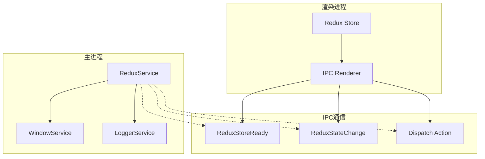

**图表来源**
- [ReduxService.ts](file://src/main/services/ReduxService.ts#L13-L36)
- [WindowService.ts](file://src/main/services/WindowService.ts#L26-L41)

**章节来源**
- [ReduxService.ts](file://src/main/services/ReduxService.ts#L1-L36)

## 核心组件分析

### ReduxService类结构

ReduxService继承自Node.js的EventEmitter，提供了完整的Redux状态管理功能：

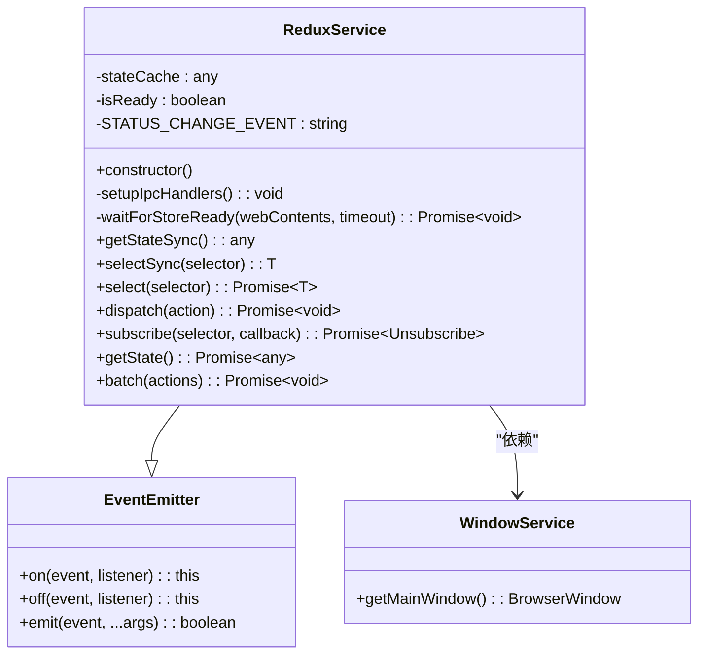

**图表来源**
- [ReduxService.ts](file://src/main/services/ReduxService.ts#L13-L189)
- [WindowService.ts](file://src/main/services/WindowService.ts#L26-L41)

### 状态缓存机制

ReduxService维护了一个本地状态缓存，用于优化状态访问性能：

- **stateCache**: 存储从渲染进程获取的最新状态快照
- **isReady**: 标识Redux store是否已准备好接受操作
- **STATUS_CHANGE_EVENT**: 状态变化事件标识符

**章节来源**
- [ReduxService.ts](file://src/main/services/ReduxService.ts#L14-L18)

## 核心方法详解

### select方法 - 状态选择器

select方法是ReduxService的核心功能之一，提供了灵活的状态选择能力：

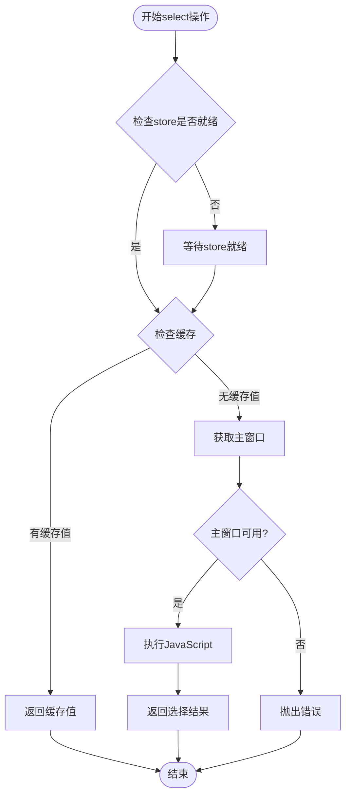

**图表来源**
- [ReduxService.ts](file://src/main/services/ReduxService.ts#L77-L103)

### dispatch方法 - 动作派发

dispatch方法负责向Redux store派发动作：

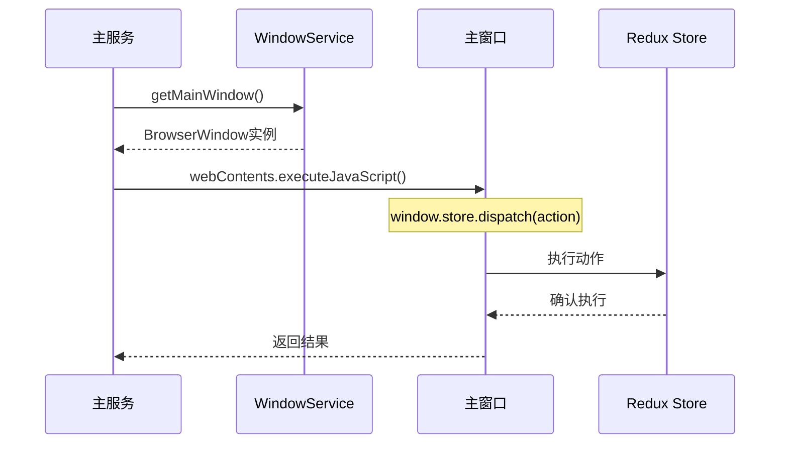

**图表来源**
- [ReduxService.ts](file://src/main/services/ReduxService.ts#L106-L120)

### subscribe方法 - 状态订阅

subscribe方法实现了状态变化的实时监听：

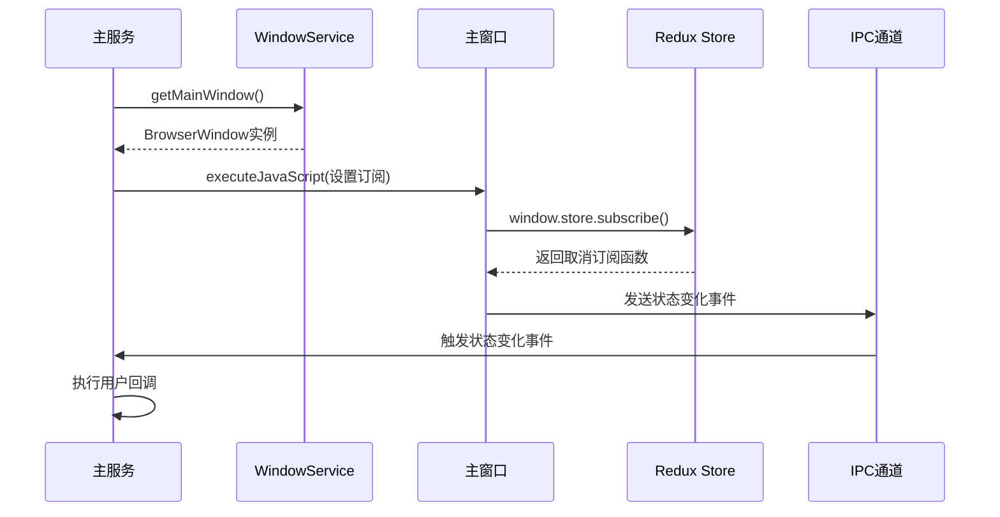

**图表来源**
- [ReduxService.ts](file://src/main/services/ReduxService.ts#L123-L164)

### batch方法 - 批量操作

batch方法允许一次性执行多个动作，提高操作效率：

**章节来源**
- [ReduxService.ts](file://src/main/services/ReduxService.ts#L77-L188)

## 同步与异步方法对比

ReduxService提供了同步和异步两种状态访问方式，各有其适用场景和性能特征：

### selectSync vs select 性能对比

| 特性 | selectSync | select |
|------|------------|---------|
| **响应时间** | 极快（直接从缓存获取） | 较慢（需要IPC通信） |
| **数据一致性** | 可能不是最新（存在缓存延迟） | 始终最新（直接从store获取） |
| **使用场景** | 非关键路径、频繁调用 | 关键路径、需要最新状态 |
| **错误处理** | 调试级别日志 | 错误级别日志 |
| **资源消耗** | 最低 | 中等（IPC开销） |

### 性能权衡分析

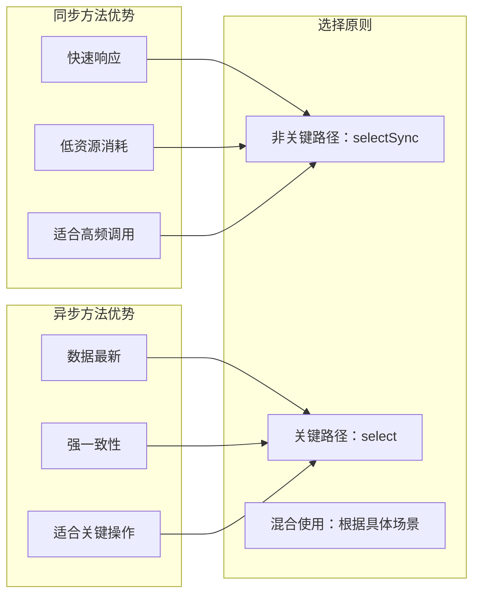

**章节来源**
- [ReduxService.ts](file://src/main/services/ReduxService.ts#L59-L103)

## 服务初始化与使用

### 服务初始化流程

ReduxService采用单例模式，在应用启动时自动初始化：

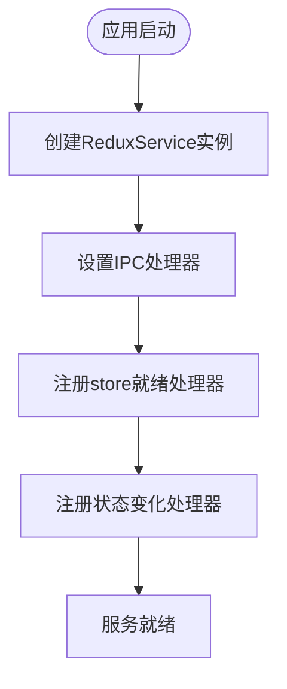

**图表来源**
- [ReduxService.ts](file://src/main/services/ReduxService.ts#L19-L22)

### 基本使用示例

以下是ReduxService在实际项目中的典型使用模式：

#### 状态读取示例

```typescript
// 读取配置设置
const settings = await reduxService.select('state.settings')
console.log('当前设置:', settings)

// 读取特定字段
const apiKey = await reduxService.select('state.settings.apiKey')
console.log('API密钥:', apiKey)
```

#### 动作派发示例

```typescript
// 更新API密钥
await reduxService.dispatch({
  type: 'settings/updateApiKey',
  payload: 'new-api-key'
})

// 批量更新多个设置
await reduxService.batch([
  { type: 'settings/setTheme', payload: 'dark' },
  { type: 'settings/setLanguage', payload: 'zh-CN' }
])
```

#### 状态订阅示例

```typescript
// 订阅API密钥变化
const unsubscribe = await reduxService.subscribe('state.settings.apiKey', (newValue) => {
  console.log('API密钥已更新:', newValue)
  // 执行相关逻辑
})

// 后续取消订阅
unsubscribe()
```

**章节来源**
- [ReduxService.ts](file://src/main/services/ReduxService.ts#L193-L231)

## 错误处理机制

ReduxService实现了完善的错误处理和日志记录机制：

### 错误分类与处理策略

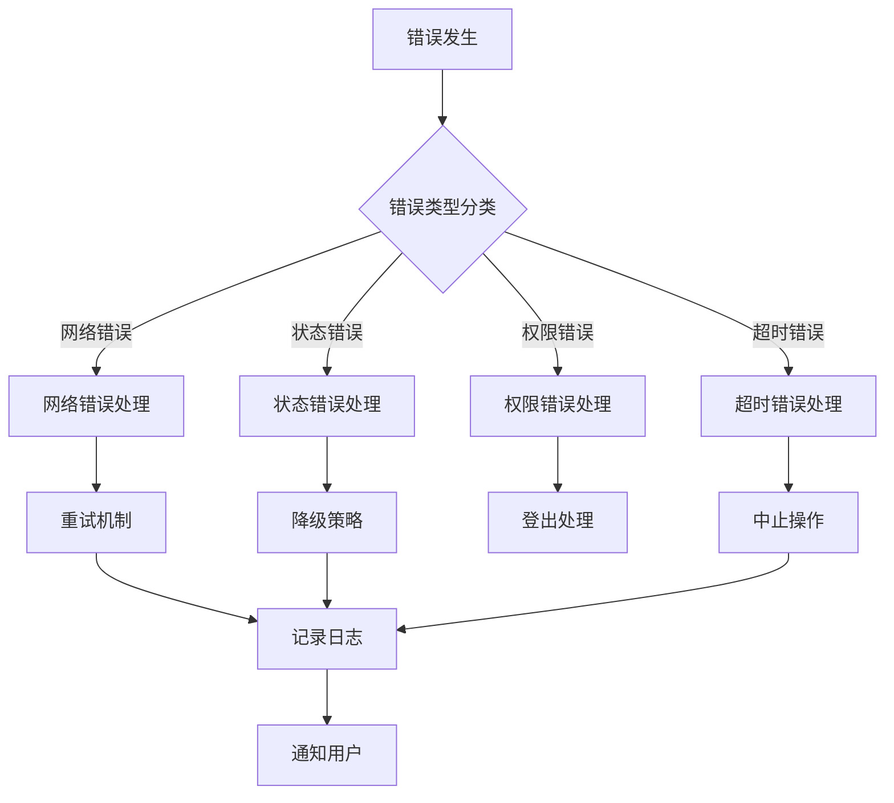

### 日志记录策略

ReduxService使用分层日志系统，根据错误严重程度采用不同的日志级别：

| 日志级别 | 使用场景 | 示例 |
|----------|----------|------|
| **ERROR** | 严重错误，影响功能 | store连接失败、动作派发失败 |
| **WARN** | 警告信息，潜在问题 | 缓存失效、状态不一致 |
| **DEBUG** | 调试信息，开发阶段 | 选择器执行、内部状态变化 |
| **INFO** | 一般信息，正常流程 | 服务启动、状态更新 |

### 错误恢复机制

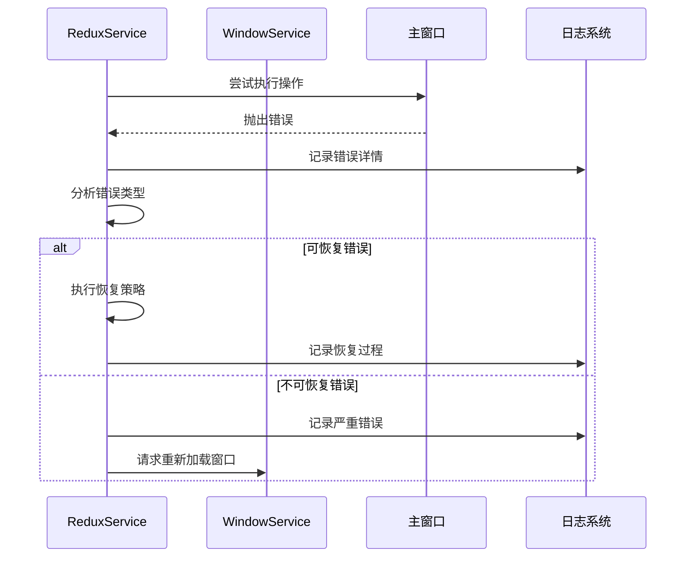

**图表来源**
- [ReduxService.ts](file://src/main/services/ReduxService.ts#L100-L120)
- [LoggerService.ts](file://src/main/services/LoggerService.ts#L45-L391)

**章节来源**
- [ReduxService.ts](file://src/main/services/ReduxService.ts#L100-L120)

## 多窗口应用中的状态管理

### 状态同步机制

在多窗口架构中，ReduxService通过以下机制确保状态一致性：

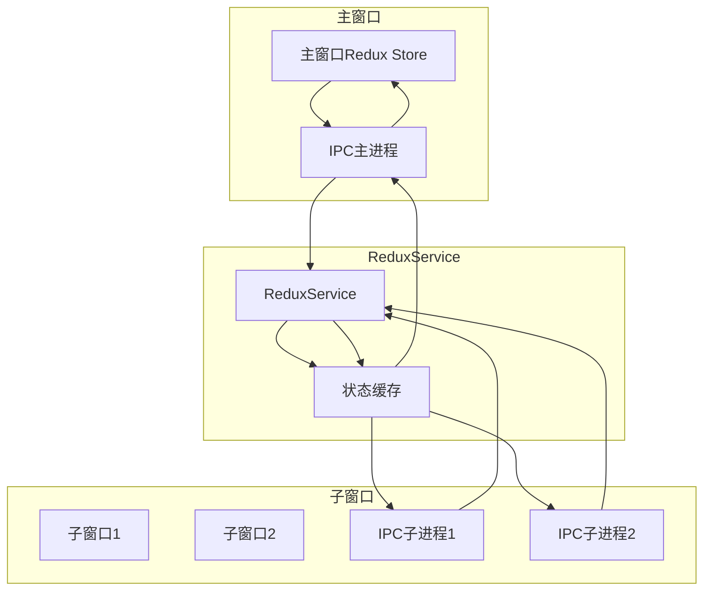

### 窗口间通信协议

ReduxService定义了标准的IPC通信协议：

| 通信类型 | 方向 | 描述 |
|----------|------|------|
| **ReduxStoreReady** | 渲染进程 → 主进程 | 通知Redux store已就绪 |
| **ReduxStateChange** | 渲染进程 → 主进程 | 通知状态发生变化 |
| **Dispatch Action** | 主进程 → 渲染进程 | 派发Redux动作 |

### 状态一致性保证

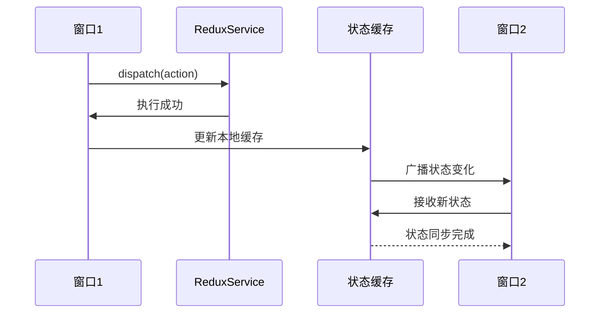

**章节来源**
- [ReduxService.ts](file://src/main/services/ReduxService.ts#L25-L35)

## 性能优化策略

### 缓存策略

ReduxService采用了多层次的缓存策略来提升性能：

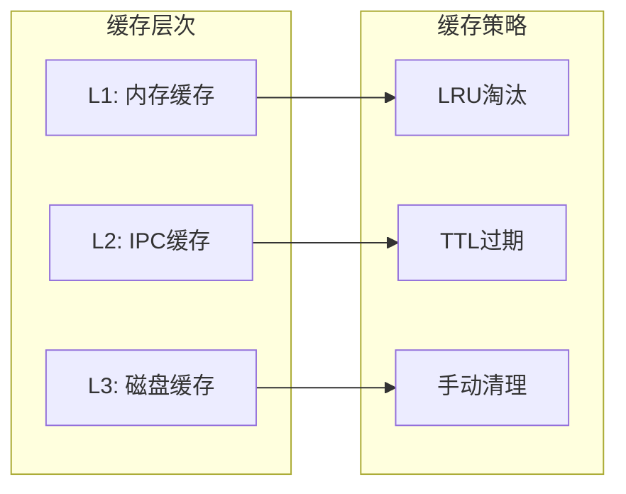

### 性能监控指标

| 指标 | 目标值 | 监控方法 |
|------|--------|----------|
| **状态读取延迟** | < 10ms | selectSync调用计时 |
| **状态写入延迟** | < 50ms | dispatch调用计时 |
| **内存使用** | < 100MB | 进程内存监控 |
| **IPC通信频率** | < 100次/秒 | 通信统计 |

### 优化建议

1. **合理使用同步方法**：对于非关键路径的操作，优先使用selectSync
2. **批量操作**：将多个相关操作合并为batch调用
3. **及时清理**：定期清理不需要的状态数据
4. **选择器优化**：使用精确的选择器减少不必要的状态遍历

## 最佳实践指南

### 使用模式推荐

#### 1. 状态读取最佳实践

```typescript
// ✅ 推荐：使用selectSync进行非关键读取
const theme = reduxService.selectSync('state.settings.theme')
console.log('当前主题:', theme)

// ✅ 推荐：使用select获取关键状态
const apiKey = await reduxService.select('state.settings.apiKey')
if (apiKey) {
  // 执行需要最新状态的操作
}

// ❌ 避免：在循环中频繁使用select
for (let i = 0; i < 1000; i++) {
  await reduxService.select('state.data.items') // 性能问题
}
```

#### 2. 动作派发最佳实践

```typescript
// ✅ 推荐：使用batch进行批量操作
await reduxService.batch([
  { type: 'settings/setTheme', payload: 'dark' },
  { type: 'settings/setLanguage', payload: 'zh-CN' },
  { type: 'ui/setLoading', payload: false }
])

// ✅ 推荐：使用try-catch处理可能失败的操作
try {
  await reduxService.dispatch({
    type: 'user/updateProfile',
    payload: userProfile
  })
} catch (error) {
  logger.error('更新用户资料失败:', error)
}
```

#### 3. 状态订阅最佳实践

```typescript
// ✅ 推荐：正确管理订阅生命周期
const unsubscribe = await reduxService.subscribe('state.settings.apiKey', (newValue) => {
  // 处理状态变化
  updateRelatedComponents(newValue)
})

// 在组件卸载时取消订阅
useEffect(() => {
  return () => {
    unsubscribe()
  }
}, [])
```

### 常见陷阱避免

1. **避免循环依赖**：不要在状态订阅回调中触发可能导致状态变化的动作
2. **注意内存泄漏**：确保及时取消不再需要的订阅
3. **处理异步竞态**：在异步操作中考虑状态可能的变化
4. **错误边界处理**：为ReduxService调用设置适当的错误边界

### 调试技巧

```typescript
// 启用调试日志
const debugLogger = loggerService.withContext('ReduxService', { 
  debug: true 
})

// 监控状态变化
reduxService.on('statusChange', (newState) => {
  debugLogger.debug('状态变化:', {
    keys: Object.keys(newState),
    timestamp: new Date().toISOString()
  })
})
```

通过遵循这些最佳实践，开发者可以充分发挥ReduxService的优势，构建高性能、可维护的多窗口Electron应用。