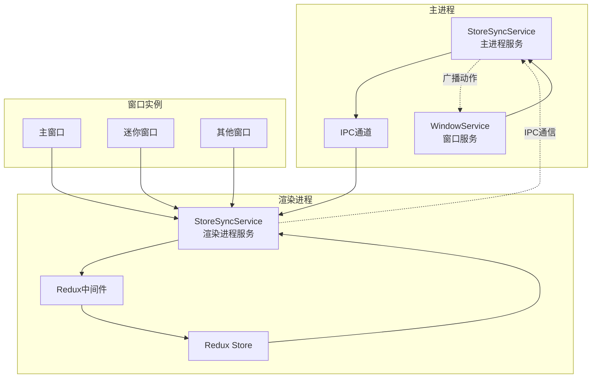
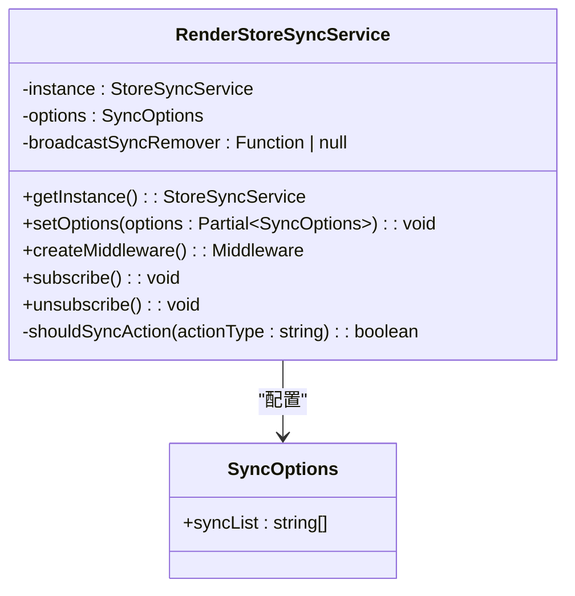
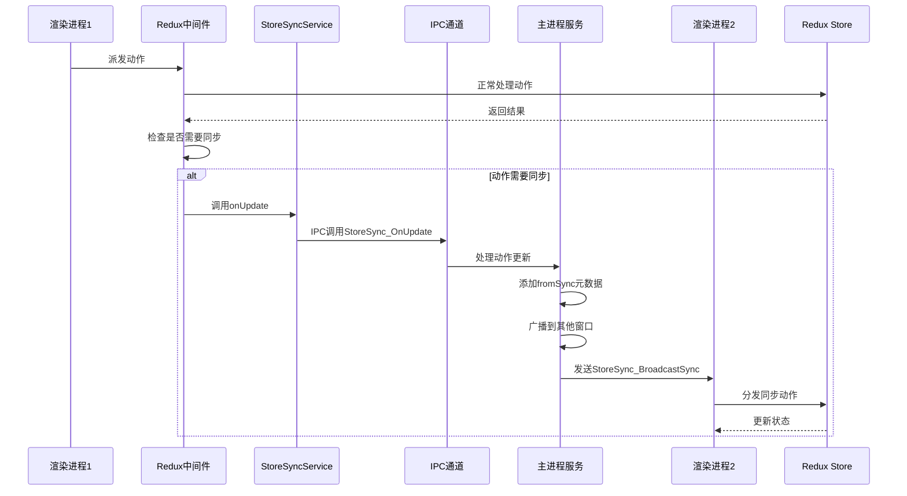
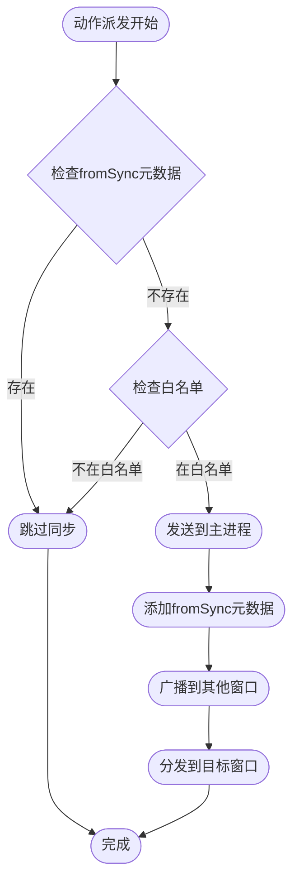
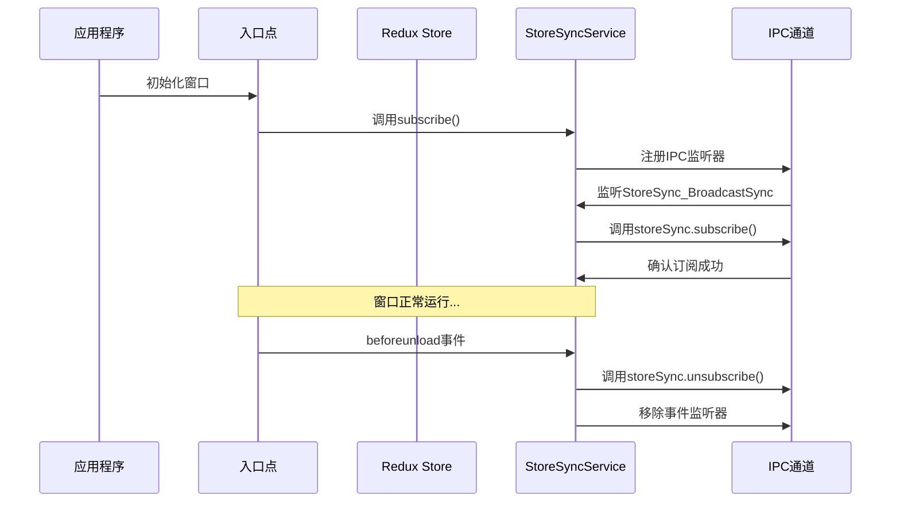
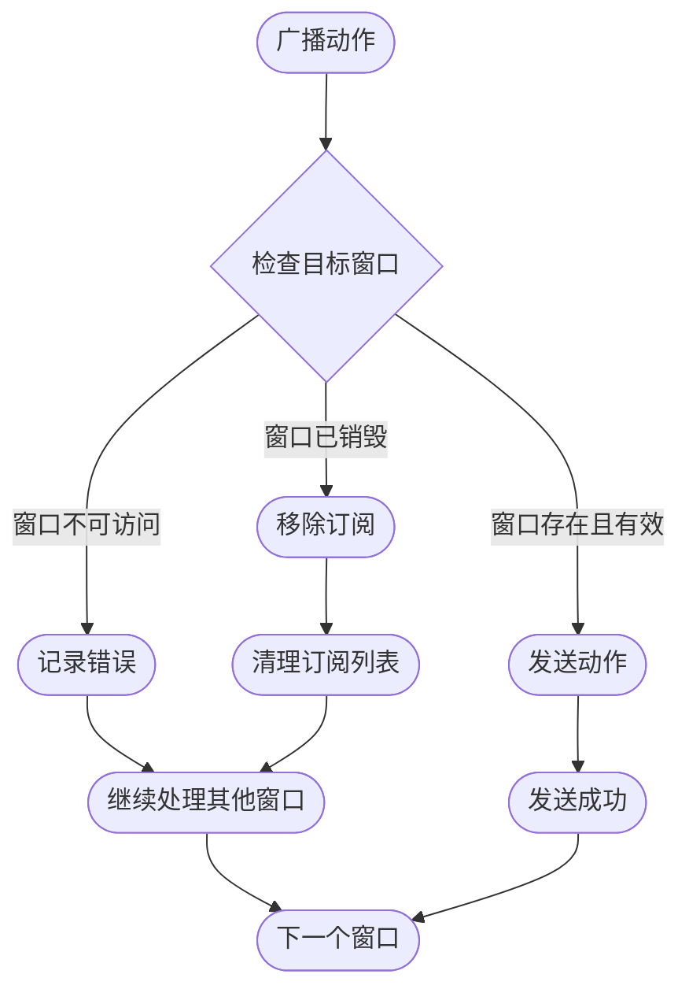

# Cherry Studio状态同步机制

<cite>
**本文档引用的文件**
- [StoreSyncService.ts](file://src/main/services/StoreSyncService.ts)
- [StoreSyncService.ts](file://src/renderer/src/services/StoreSyncService.ts)
- [index.ts](file://src/renderer/src/store/index.ts)
- [IpcChannel.ts](file://packages/shared/IpcChannel.ts)
- [index.ts](file://src/renderer/src/types/index.ts)
- [WindowService.ts](file://src/main/services/WindowService.ts)
- [entryPoint.tsx](file://src/renderer/src/windows/mini/entryPoint.tsx)
- [App.tsx](file://src/renderer/src/App.tsx)
</cite>

## 目录
1. [概述](#概述)
2. [系统架构](#系统架构)
3. [核心组件分析](#核心组件分析)
4. [同步机制详解](#同步机制详解)
5. [窗口生命周期管理](#窗口生命周期管理)
6. [异常处理机制](#异常处理机制)
7. [性能考虑](#性能考虑)
8. [故障排除指南](#故障排除指南)
9. [总结](#总结)

## 概述

Cherry Studio的状态同步机制是一个复杂而精密的系统，负责在多个窗口之间保持Redux状态的一致性。该机制通过主进程的StoreSyncService和渲染进程的StoreSyncService协同工作，实现了跨窗口的状态同步功能。

### 主要特性

- **跨窗口状态同步**：确保所有打开的窗口共享相同的应用状态
- **动作白名单过滤**：通过syncList配置精确控制需要同步的动作类型
- **循环同步防护**：使用fromSync元数据防止无限同步循环
- **窗口生命周期管理**：自动处理窗口的订阅和退订
- **异常恢复机制**：自动清理无效的窗口订阅

## 系统架构



**图表来源**
- [StoreSyncService.ts](file://src/main/services/StoreSyncService.ts#L15-L129)
- [StoreSyncService.ts](file://src/renderer/src/services/StoreSyncService.ts#L21-L133)
- [WindowService.ts](file://src/main/services/WindowService.ts#L26-L685)

## 核心组件分析

### 主进程StoreSyncService

主进程的StoreSyncService负责管理所有窗口的订阅列表，并处理来自渲染进程的动作广播请求。

#### 关键功能

1. **窗口订阅管理**
   - 维护活跃窗口ID列表
   - 自动添加新窗口到订阅列表
   - 清理已销毁窗口的订阅

2. **动作广播机制**
   - 接收渲染进程的动作更新
   - 添加fromSync元数据防止循环
   - 将动作广播到所有其他窗口

3. **IPC通信处理**
   - 注册窗口订阅/退订处理器
   - 处理动作更新请求
   - 管理IPC通道注册状态

#### 核心方法

```mermaid
classDiagram
class StoreSyncService {
-instance : StoreSyncService
-windowIds : number[]
-isIpcHandlerRegistered : boolean
+getInstance() : StoreSyncService
+subscribe(windowId : number) : void
+unsubscribe(windowId : number) : void
+syncToRenderer(type : string, payload : any) : void
+registerIpcHandler() : void
-broadcastToOtherWindows(sourceWindowId : number, action : StoreSyncAction) : void
}
class StoreSyncAction {
+type : string
+payload : any
+meta? : {
fromSync? : boolean
source? : string
}
}
StoreSyncService --> StoreSyncAction : "处理"
```

**图表来源**
- [StoreSyncService.ts](file://src/main/services/StoreSyncService.ts#L15-L129)

**章节来源**
- [StoreSyncService.ts](file://src/main/services/StoreSyncService.ts#L1-L133)

### 渲染进程StoreSyncService

渲染进程的StoreSyncService负责拦截Redux动作并决定是否需要同步到其他窗口。

#### 关键功能

1. **Redux中间件集成**
   - 拦截Redux动作分发
   - 检查动作是否需要同步
   - 发送动作到主进程

2. **动作过滤机制**
   - 基于syncList的白名单过滤
   - 检测fromSync元数据防止循环
   - 支持精确的命名空间匹配

3. **窗口订阅管理**
   - 自动订阅窗口事件
   - 处理窗口生命周期事件
   - 清理资源和事件监听器

#### 核心方法



**图表来源**
- [StoreSyncService.ts](file://src/renderer/src/services/StoreSyncService.ts#L21-L133)

**章节来源**
- [StoreSyncService.ts](file://src/renderer/src/services/StoreSyncService.ts#L1-L137)

## 同步机制详解

### 动作同步流程

状态同步遵循严格的流程，确保数据一致性和防止循环同步：



**图表来源**
- [StoreSyncService.ts](file://src/renderer/src/services/StoreSyncService.ts#L55-L70)
- [StoreSyncService.ts](file://src/main/services/StoreSyncService.ts#L89-L96)

### 白名单过滤机制

系统使用syncList配置来精确控制哪些动作需要同步：

| 配置项 | 描述 | 示例 |
|--------|------|------|
| `assistants/` | 同步助手相关的所有状态变更 | `assistants/setActiveAssistant` |
| `settings/` | 同步设置相关的状态变更 | `settings/setTheme` |
| `llm/` | 同步语言模型相关的状态变更 | `llm/setModel` |
| `selectionStore/` | 同步选择相关的状态变更 | `selectionStore/setSelectedText` |
| `note/` | 同步笔记相关的状态变更 | `note/createNote` |

### 循环同步防护

系统通过fromSync元数据防止动作在窗口间无限循环：



**图表来源**
- [StoreSyncService.ts](file://src/renderer/src/services/StoreSyncService.ts#L60-L66)
- [StoreSyncService.ts](file://src/main/services/StoreSyncService.ts#L108-L115)

**章节来源**
- [index.ts](file://src/renderer/src/store/index.ts#L88-L90)
- [StoreSyncService.ts](file://src/renderer/src/services/StoreSyncService.ts#L74-L87)

## 窗口生命周期管理

### 窗口订阅流程

每个窗口在启动时会自动订阅状态同步服务：



**图表来源**
- [entryPoint.tsx](file://src/renderer/src/windows/mini/entryPoint.tsx#L26-L27)
- [StoreSyncService.ts](file://src/renderer/src/services/StoreSyncService.ts#L93-L117)

### 窗口退订机制

当窗口关闭时，系统会自动清理相关资源：

1. **自动清理**：窗口关闭时自动调用unsubscribe()
2. **资源释放**：移除IPC事件监听器
3. **内存管理**：清理相关回调函数引用

**章节来源**
- [StoreSyncService.ts](file://src/renderer/src/services/StoreSyncService.ts#L119-L133)
- [entryPoint.tsx](file://src/renderer/src/windows/mini/entryPoint.tsx#L1-L30)

## 异常处理机制

### 窗口销毁检测

主进程服务会定期检测窗口的有效性：



**图表来源**
- [StoreSyncService.ts](file://src/main/services/StoreSyncService.ts#L118-L128)

### 错误恢复策略

1. **自动清理**：检测到无效窗口时自动从订阅列表中移除
2. **优雅降级**：即使部分窗口失效，仍能正常同步其他窗口
3. **日志记录**：详细记录同步过程中的错误信息

**章节来源**
- [StoreSyncService.ts](file://src/main/services/StoreSyncService.ts#L124-L126)

## 性能考虑

### 同步粒度控制

系统通过白名单机制实现细粒度的同步控制：

- **精确匹配**：支持完整的动作类型匹配
- **命名空间匹配**：支持前缀匹配（如`settings/`）
- **动态配置**：运行时可修改同步配置

### 内存优化

1. **单例模式**：确保全局只有一个StoreSyncService实例
2. **事件监听器管理**：及时清理不需要的事件监听器
3. **窗口状态跟踪**：避免重复处理已销毁的窗口

### 网络开销最小化

- **增量同步**：只同步必要的状态变更
- **批量处理**：减少IPC调用频率
- **条件过滤**：避免不必要的动作传播

## 故障排除指南

### 常见问题及解决方案

| 问题描述 | 可能原因 | 解决方案 |
|----------|----------|----------|
| 状态不同步 | syncList配置错误 | 检查store/index.ts中的syncList配置 |
| 循环同步 | fromSync元数据缺失 | 确保主进程正确添加fromSync标记 |
| 窗口无响应 | IPC通道阻塞 | 检查窗口订阅状态和IPC连接 |
| 内存泄漏 | 事件监听器未清理 | 确保窗口关闭时正确调用unsubscribe() |

### 调试技巧

1. **启用调试日志**：查看详细的同步日志信息
2. **监控窗口状态**：检查窗口订阅列表是否正确
3. **验证动作类型**：确认动作类型在白名单中
4. **检查IPC连接**：确保主进程和渲染进程间的IPC通道正常

**章节来源**
- [StoreSyncService.ts](file://src/renderer/src/services/StoreSyncService.ts#L101-L109)

## 总结

Cherry Studio的状态同步机制是一个设计精良的系统，通过主进程和渲染进程的协同工作，实现了高效、可靠的状态同步功能。其主要优势包括：

1. **可靠性**：完善的异常处理和自动清理机制
2. **灵活性**：可配置的同步策略和白名单机制
3. **性能**：细粒度的同步控制和优化的网络传输
4. **易维护**：清晰的架构设计和模块化的组件结构

该机制为多窗口应用提供了强大的状态一致性保障，是现代桌面应用程序架构的重要组成部分。通过合理配置和使用，开发者可以构建出响应迅速、用户体验良好的多窗口应用程序。