# Cherry Studio Thunk实现与异步操作

<cite>
**本文档中引用的文件**
- [knowledgeThunk.ts](file://src/renderer/src/store/thunk/knowledgeThunk.ts)
- [messageThunk.ts](file://src/renderer/src/store/thunk/messageThunk.ts)
- [messageThunk.v2.ts](file://src/renderer/src/store/thunk/messageThunk.v2.ts)
- [knowledgeThunk.test.ts](file://src/renderer/src/store/thunk/__tests__/knowledgeThunk.test.ts)
- [knowledge.ts](file://src/renderer/src/store/knowledge.ts)
- [newMessage.ts](file://src/renderer/src/store/newMessage.ts)
- [useKnowledge.ts](file://src/renderer/src/hooks/useKnowledge.ts)
- [MessageEditor.tsx](file://src/renderer/src/pages/home/Messages/MessageEditor.tsx)
- [abortController.ts](file://src/renderer/src/utils/abortController.ts)
- [ReduxService.ts](file://src/main/services/ReduxService.ts)
</cite>

## 目录
1. [简介](#简介)
2. [项目架构概览](#项目架构概览)
3. [Redux Thunk基础概念](#redux-thunk基础概念)
4. [Knowledge Thunk实现](#knowledge-thunk实现)
5. [Message Thunk实现](#message-thunk实现)
6. [异步操作生命周期管理](#异步操作生命周期管理)
7. [错误处理与重试机制](#错误处理与重试机制)
8. [组件中的使用模式](#组件中的使用模式)
9. [性能优化策略](#性能优化策略)
10. [最佳实践与总结](#最佳实践与总结)

## 简介

Cherry Studio采用Redux Thunk作为主要的异步操作处理机制，通过精心设计的Thunk函数来管理复杂的状态变更和API交互。本文档深入分析了项目中两个核心的Thunk实现：`knowledgeThunk`和`messageThunk`，展示了如何使用Redux Thunk处理复杂的异步操作，包括请求生命周期管理、错误处理、重试机制和性能优化策略。

## 项目架构概览

Cherry Studio的异步操作架构采用分层设计，主要包含以下层次：

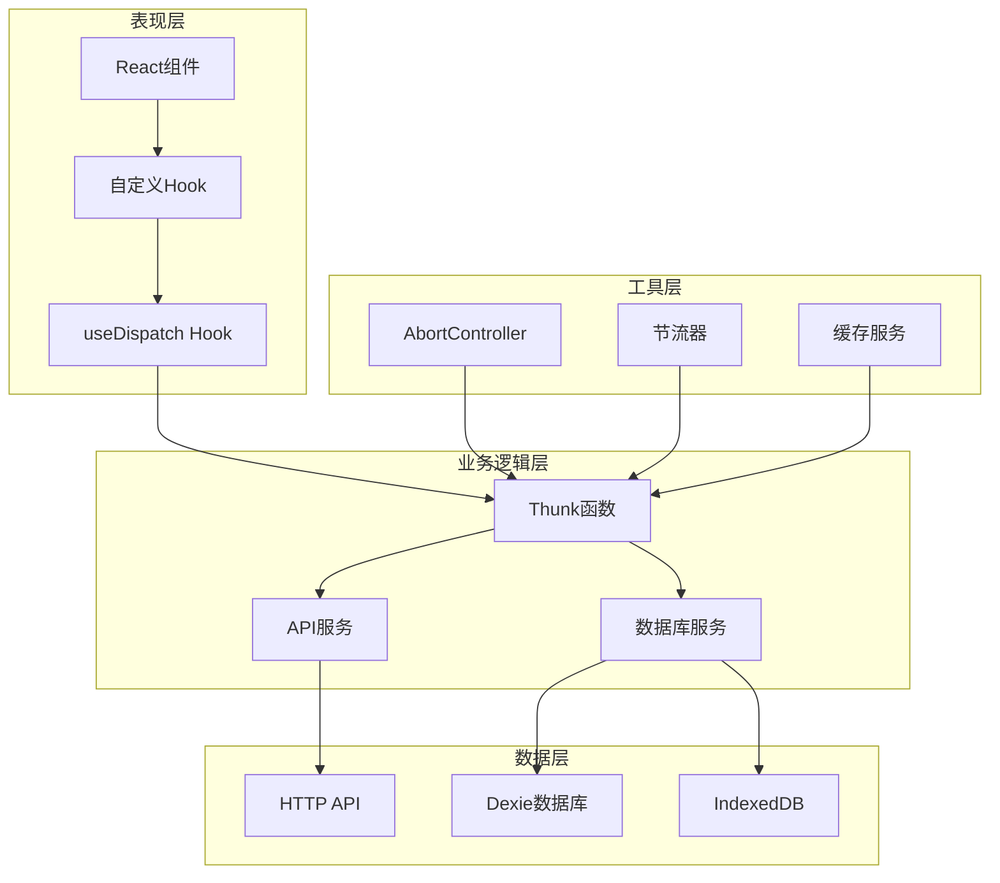

**图表来源**
- [messageThunk.ts](file://src/renderer/src/store/thunk/messageThunk.ts#L1-L50)
- [knowledgeThunk.ts](file://src/renderer/src/store/thunk/knowledgeThunk.ts#L1-L30)

## Redux Thunk基础概念

### Thunk函数的基本结构

Redux Thunk允许我们编写返回函数的action creator，这个函数接收`dispatch`和`getState`作为参数：

```typescript
// 基本的Thunk函数结构
const myThunk = (params) => (dispatch, getState) => {
  // 异步操作逻辑
  dispatch({ type: 'REQUEST_START' })
  
  try {
    const result = await apiCall(params)
    dispatch({ type: 'REQUEST_SUCCESS', payload: result })
  } catch (error) {
    dispatch({ type: 'REQUEST_FAILURE', payload: error })
  }
}
```

### 异步操作的三态模式

在Cherry Studio中，所有的异步操作都遵循标准的三态模式：

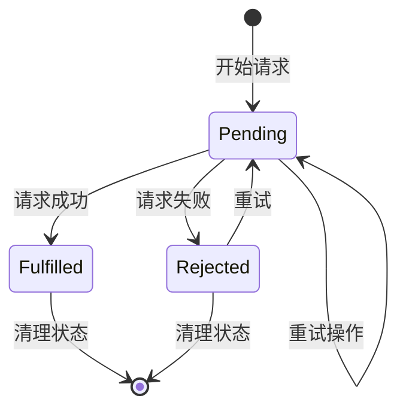

## Knowledge Thunk实现

### 核心功能概述

Knowledge Thunk负责管理知识库相关的异步操作，包括文件添加、笔记创建和知识项管理。

### 主要Thunk函数

#### 1. addFilesThunk - 批量文件添加

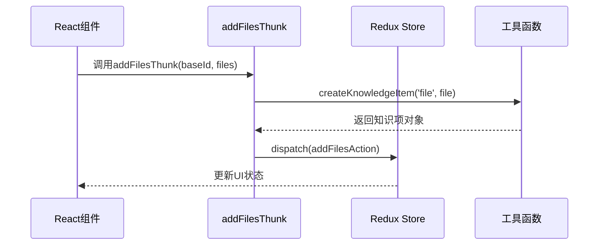

**图表来源**
- [knowledgeThunk.ts](file://src/renderer/src/store/thunk/knowledgeThunk.ts#L44-L47)

#### 2. addNoteThunk - 笔记创建

addNoteThunk是一个典型的异步Thunk实现，展示了完整的错误处理和状态管理：

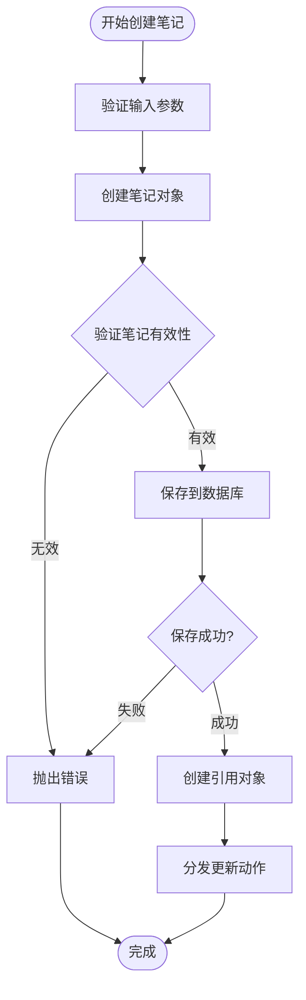

**图表来源**
- [knowledgeThunk.ts](file://src/renderer/src/store/thunk/knowledgeThunk.ts#L54-L70)

#### 3. addItemThunk - 通用知识项添加

这个函数展示了如何处理不同类型的知识项，具有良好的扩展性。

**章节来源**
- [knowledgeThunk.ts](file://src/renderer/src/store/thunk/knowledgeThunk.ts#L1-L89)

### 知识项创建工厂函数

项目提供了统一的知识项创建工厂函数，确保所有知识项都具有标准的初始状态：

```typescript
export const createKnowledgeItem = (
  type: KnowledgeItem['type'],
  content: KnowledgeItem['content'],
  overrides: Partial<KnowledgeItem> = {}
): KnowledgeItem => {
  const timestamp = Date.now()
  return {
    id: uuidv4(),
    type,
    content,
    created_at: timestamp,
    updated_at: timestamp,
    processingStatus: 'pending',
    processingProgress: 0,
    processingError: '',
    retryCount: 0,
    ...overrides
  }
}
```

**章节来源**
- [knowledgeThunk.ts](file://src/renderer/src/store/thunk/knowledgeThunk.ts#L19-L37)

## Message Thunk实现

### 核心架构

Message Thunk是项目中最复杂的异步操作实现，负责处理聊天消息的完整生命周期，包括流式响应、块管理、状态同步等。

### 流式消息处理架构

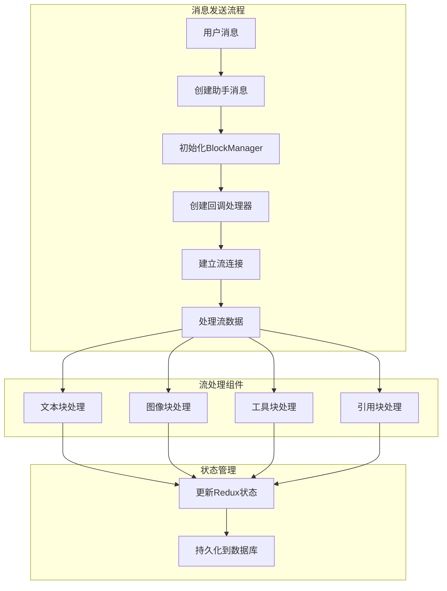

**图表来源**
- [messageThunk.ts](file://src/renderer/src/store/thunk/messageThunk.ts#L530-L560)

### 关键异步操作

#### 1. fetchAndProcessAgentResponseImpl - 代理响应处理

这是Message Thunk的核心函数，负责处理来自代理服务器的流式响应：

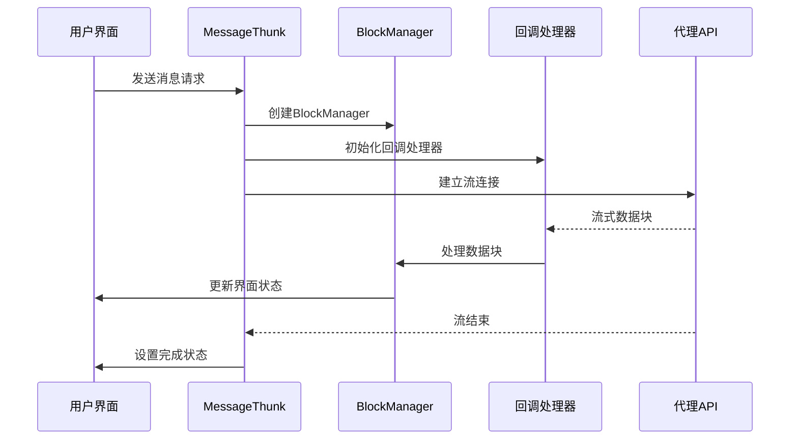

**图表来源**
- [messageThunk.ts](file://src/renderer/src/store/thunk/messageThunk.ts#L530-L687)

#### 2. 节流更新机制

为了优化性能，Message Thunk实现了智能的节流更新机制：

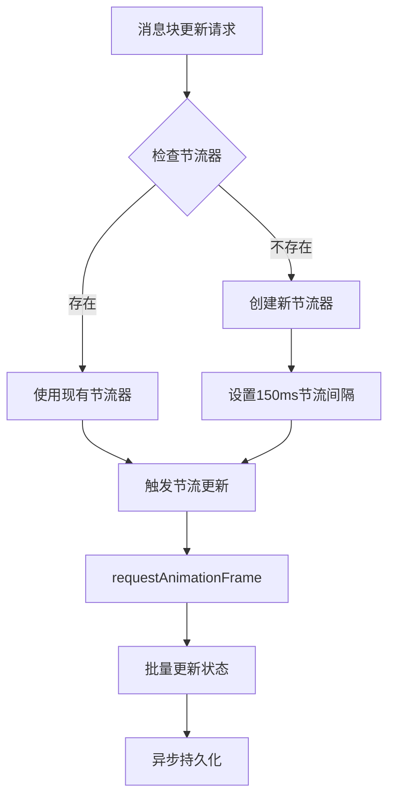

**图表来源**
- [messageThunk.ts](file://src/renderer/src/store/thunk/messageThunk.ts#L406-L427)

**章节来源**
- [messageThunk.ts](file://src/renderer/src/store/thunk/messageThunk.ts#L1-L800)
- [messageThunk.v2.ts](file://src/renderer/src/store/thunk/messageThunk.v2.ts#L1-L234)

## 异步操作生命周期管理

### 请求状态管理

Cherry Studio使用标准化的状态管理模式来跟踪异步操作的生命周期：

| 状态阶段 | 描述 | Redux Action | 数据库操作 |
|---------|------|-------------|-----------|
| `loading` | 请求进行中 | `setTopicLoading({ topicId, loading: true })` | 无 |
| `fulfilled` | 请求成功完成 | `setTopicFulfilled({ topicId, fulfilled: true })` | 持久化数据 |
| `error` | 请求失败 | `setError({ topicId, error: errorMessage })` | 清理临时数据 |
| `idle` | 空闲状态 | `setTopicLoading({ topicId, loading: false })` | 无 |

### 生命周期状态转换图

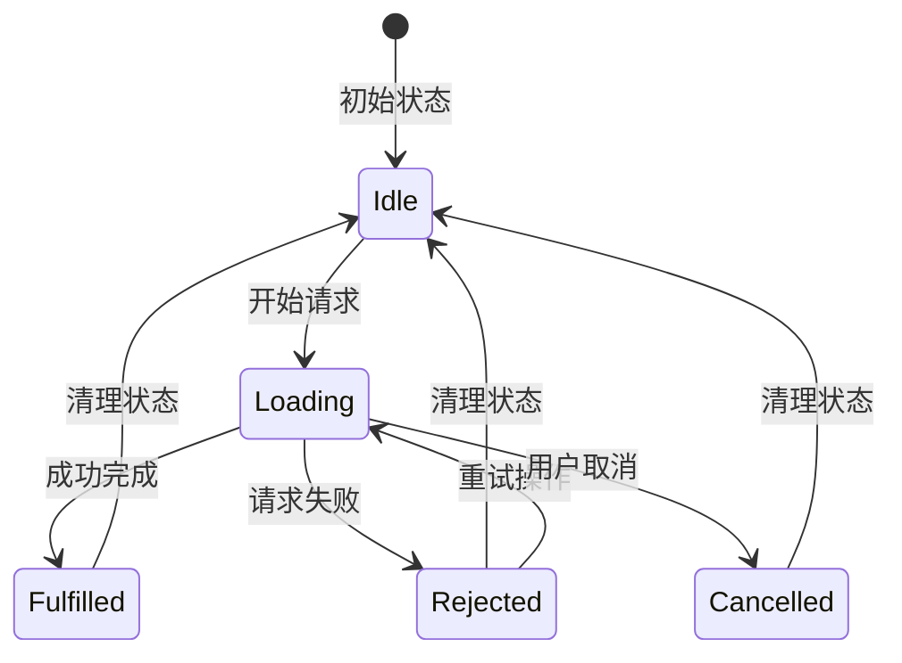

**章节来源**
- [newMessage.ts](file://src/renderer/src/store/newMessage.ts#L38-L47)

## 错误处理与重试机制

### AbortController集成

Cherry Studio广泛使用AbortController来管理异步操作的取消和超时：

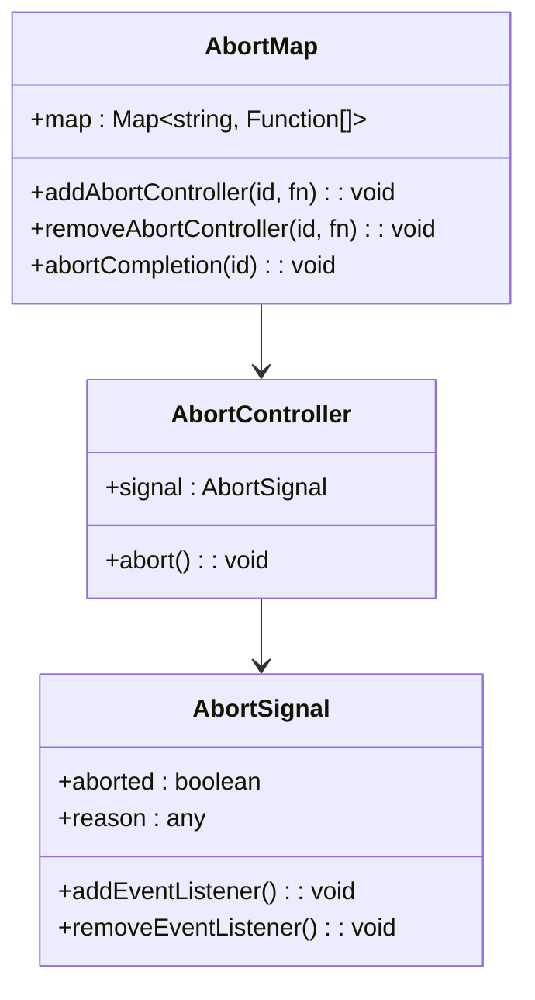

**图表来源**
- [abortController.ts](file://src/renderer/src/utils/abortController.ts#L1-L74)

### 错误处理策略

#### 1. 分层错误处理

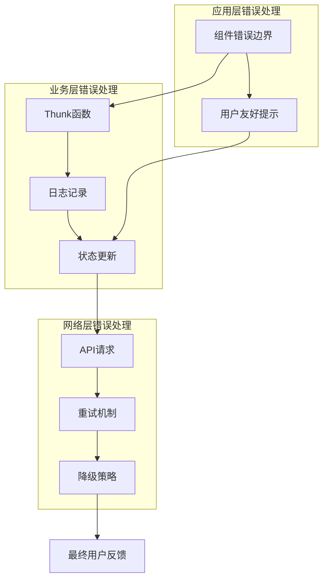

#### 2. 重试机制实现

项目中的重试机制包括：

- **指数退避重试**：随着重试次数增加，等待时间呈指数增长
- **最大重试次数限制**：防止无限重试导致资源浪费
- **条件重试**：根据错误类型决定是否重试

**章节来源**
- [abortController.ts](file://src/renderer/src/utils/abortController.ts#L1-L74)

## 组件中的使用模式

### 自定义Hook模式

Cherry Studio大量使用自定义Hook来封装Thunk的使用：

```typescript
// useKnowledge Hook示例
export const useKnowledge = (baseId: string) => {
  const dispatch = useAppDispatch()
  const base = useSelector((state: RootState) => 
    state.knowledge.bases.find((b) => b.id === baseId)
  )

  const addNote = useCallback(async (content: string) => {
    await dispatch(addNoteThunk(baseId, content))
    // 手动触发队列检查
    KnowledgeQueue.checkAllBases()
  }, [dispatch, baseId])

  return { base, addNote }
}
```

### 组件使用示例

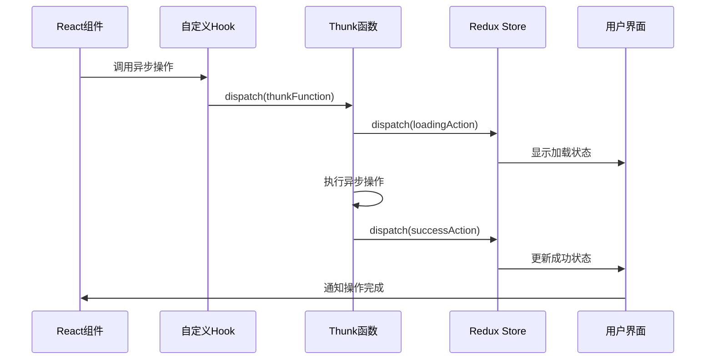

**图表来源**
- [useKnowledge.ts](file://src/renderer/src/hooks/useKnowledge.ts#L32-L395)

**章节来源**
- [useKnowledge.ts](file://src/renderer/src/hooks/useKnowledge.ts#L1-L395)
- [MessageEditor.tsx](file://src/renderer/src/pages/home/Messages/MessageEditor.tsx#L1-L200)

## 性能优化策略

### 1. 节流更新机制

Message Thunk实现了智能的节流更新系统，避免频繁的状态更新：

```typescript
// 节流器配置
const getBlockThrottler = (id: string) => {
  if (!blockUpdateThrottlers.has(id)) {
    const throttler = throttle(async (blockUpdate: any) => {
      // 使用requestAnimationFrame优化渲染
      const rafId = requestAnimationFrame(() => {
        store.dispatch(updateOneBlock({ id, changes: blockUpdate }))
        blockUpdateRafs.delete(id)
      })
      
      blockUpdateRafs.set(id, rafId)
      await updateSingleBlockV2(id, blockUpdate)
    }, 150) // 150ms节流间隔
    
    blockUpdateThrottlers.set(id, throttler)
  }
  
  return blockUpdateThrottlers.get(id)!
}
```

### 2. 内存管理

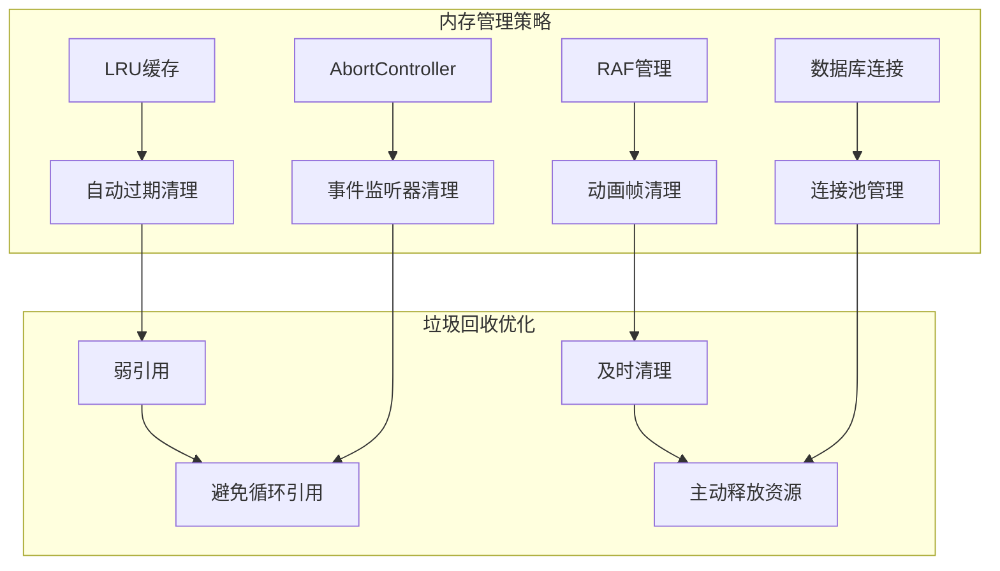

### 3. 数据库优化

项目采用了分层的数据库访问模式：

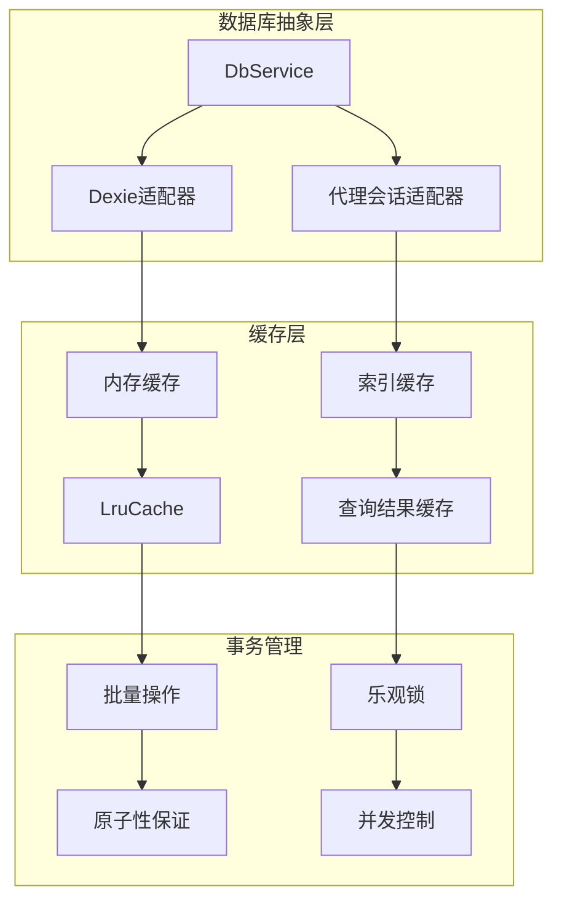

**图表来源**
- [messageThunk.v2.ts](file://src/renderer/src/store/thunk/messageThunk.v2.ts#L1-L50)

**章节来源**
- [messageThunk.ts](file://src/renderer/src/store/thunk/messageThunk.ts#L406-L462)

## 最佳实践与总结

### 设计原则

1. **单一职责原则**：每个Thunk专注于特定的业务领域
2. **状态不可变性**：所有状态更新都是不可变的
3. **错误边界处理**：完善的错误捕获和恢复机制
4. **性能优先**：智能的节流和缓存策略
5. **可测试性**：清晰的依赖注入和模拟支持

### 架构优势

```mermaid
mindmap
root((Cherry Studio Thunk架构))
异步操作管理
Redux Thunk集成
状态生命周期管理
错误处理机制
性能优化
节流更新
内存管理
数据库优化
可维护性
清晰的职责分离
完善的测试覆盖
文档化的设计决策
扩展性
模块化设计
插件化架构
版本兼容性
```

### 技术亮点

1. **流式处理**：支持实时的数据流处理和增量更新
2. **智能缓存**：基于LRU的智能缓存策略
3. **优雅降级**：在网络异常时的优雅降级处理
4. **用户体验**：流畅的加载状态和即时反馈

### 总结

Cherry Studio的Thunk实现展现了现代前端应用中异步操作处理的最佳实践。通过精心设计的架构，项目成功地平衡了功能复杂性、性能要求和开发可维护性。这种实现方式不仅适用于当前的业务场景，也为未来的功能扩展奠定了坚实的基础。