# 异步操作与中间件

<cite>
**本文档中引用的文件**
- [messageThunk.ts](file://src/renderer/src/store/thunk/messageThunk.ts)
- [knowledgeThunk.ts](file://src/renderer/src/store/thunk/knowledgeThunk.ts)
- [messageThunk.v2.ts](file://src/renderer/src/store/thunk/messageThunk.v2.ts)
- [auth.ts](file://src/main/apiServer/middleware/auth.ts)
- [error.ts](file://src/main/apiServer/middleware/error.ts)
- [StoreSyncService.ts](file://src/renderer/src/services/StoreSyncService.ts)
- [ReduxService.ts](file://src/main/services/ReduxService.ts)
- [abortController.ts](file://src/renderer/src/utils/abortController.ts)
- [useMessageOperations.ts](file://src/renderer/src/hooks/useMessageOperations.ts)
- [knowledgeThunk.test.ts](file://src/renderer/src/store/thunk/__tests__/knowledgeThunk.test.ts)
- [auth.test.ts](file://src/main/apiServer/middleware/__tests__/auth.test.ts)
</cite>

## 目录
1. [简介](#简介)
2. [项目架构概览](#项目架构概览)
3. [Redux Thunk 异步操作](#redux-thunk-异步操作)
4. [中间件系统](#中间件系统)
5. [异步操作实现详解](#异步操作实现详解)
6. [错误处理与重试机制](#错误处理与重试机制)
7. [性能优化策略](#性能优化策略)
8. [最佳实践指南](#最佳实践指南)
9. [故障排除](#故障排除)
10. [总结](#总结)

## 简介

Cherry Studio采用现代化的异步操作架构，通过Redux Thunk处理复杂的异步逻辑，结合自定义中间件实现请求拦截、认证验证和状态同步。本文档详细阐述了项目的异步操作体系，包括消息处理、知识库操作、API认证和状态管理等核心功能。

## 项目架构概览

Cherry Studio的异步操作架构分为三个主要层次：

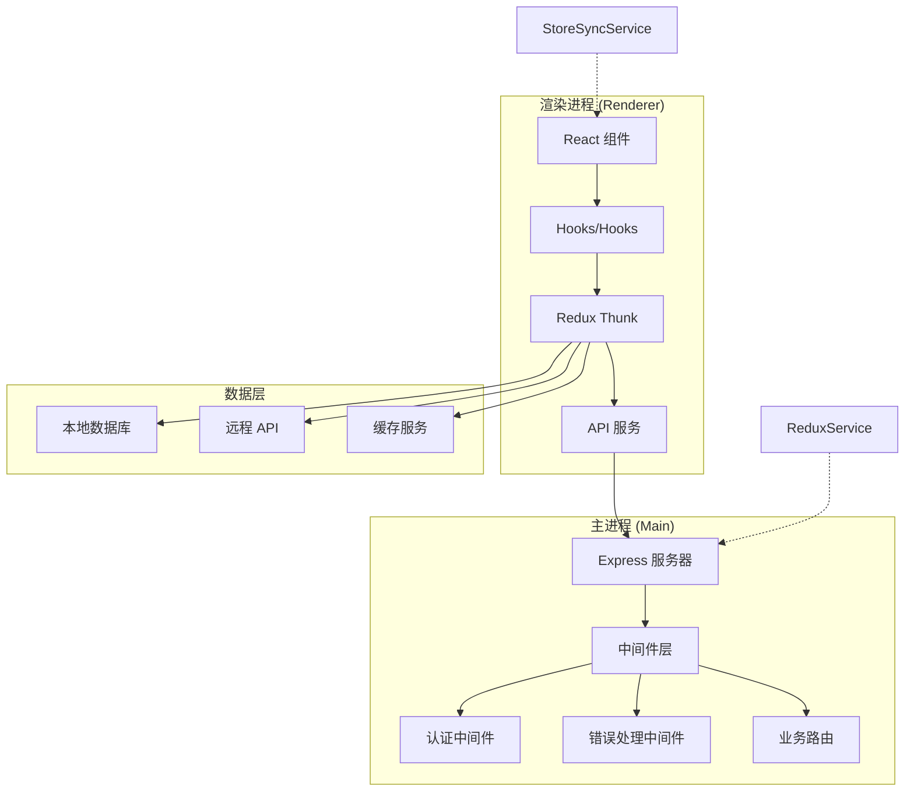

**图表来源**
- [messageThunk.ts](file://src/renderer/src/store/thunk/messageThunk.ts#L1-L50)
- [auth.ts](file://src/main/apiServer/middleware/auth.ts#L1-L30)
- [StoreSyncService.ts](file://src/renderer/src/services/StoreSyncService.ts#L1-L50)

## Redux Thunk 异步操作

### Thunk 基本概念

Redux Thunk 是一个中间件，允许在 Redux store 中执行异步操作。在 Cherry Studio中，thunk负责处理复杂的异步流程，包括API调用、数据库操作和状态更新。

### 核心 Thunk 实现

#### 消息处理 Thunk

消息处理是 Cherry Studio的核心功能，涉及复杂的异步流程：

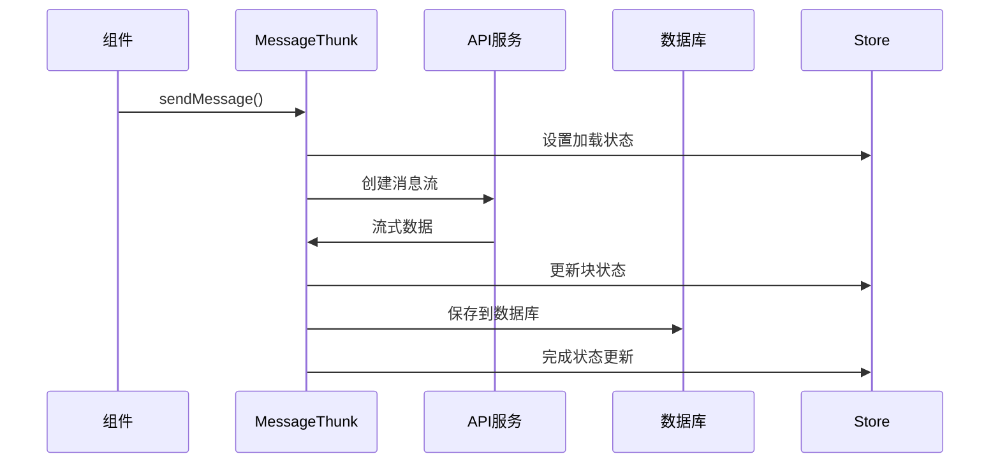

**图表来源**
- [messageThunk.ts](file://src/renderer/src/store/thunk/messageThunk.ts#L844-L900)

#### 知识库 Thunk

知识库操作提供了简洁的异步接口：

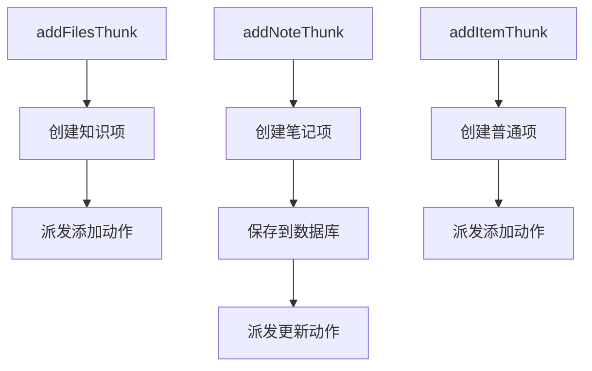

**图表来源**
- [knowledgeThunk.ts](file://src/renderer/src/store/thunk/knowledgeThunk.ts#L44-L89)

**章节来源**
- [messageThunk.ts](file://src/renderer/src/store/thunk/messageThunk.ts#L1-L100)
- [knowledgeThunk.ts](file://src/renderer/src/store/thunk/knowledgeThunk.ts#L1-L89)

## 中间件系统

### 主进程认证中间件

Cherry Studio的主进程实现了强大的认证中间件，支持多种认证方式：

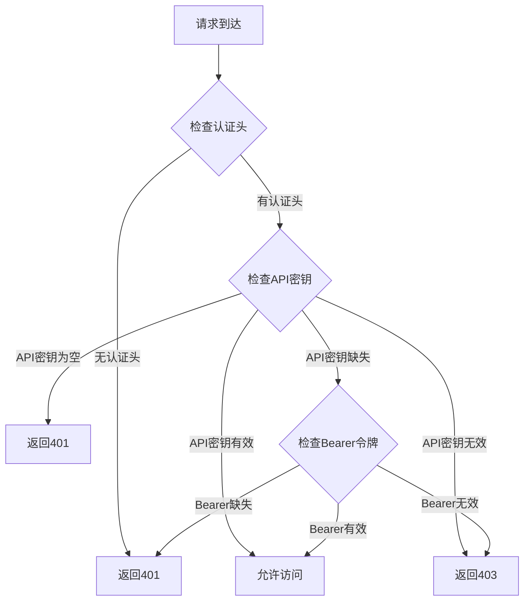

**图表来源**
- [auth.ts](file://src/main/apiServer/middleware/auth.ts#L15-L67)

### 错误处理中间件

统一的错误处理机制确保系统的稳定性：

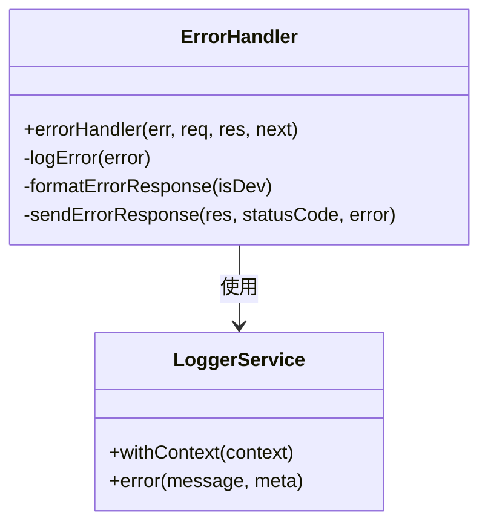

**图表来源**
- [error.ts](file://src/main/apiServer/middleware/error.ts#L1-L22)

### Store 同步中间件

跨窗口状态同步机制：

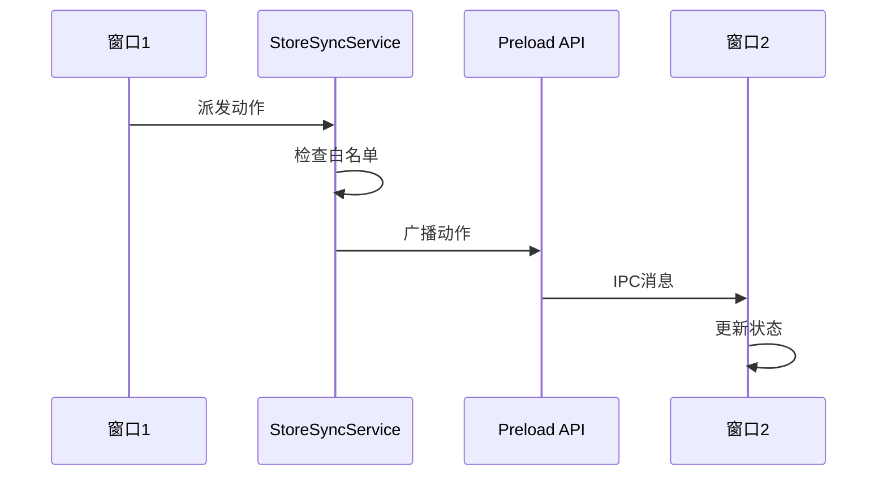

**图表来源**
- [StoreSyncService.ts](file://src/renderer/src/services/StoreSyncService.ts#L55-L70)

**章节来源**
- [auth.ts](file://src/main/apiServer/middleware/auth.ts#L1-L67)
- [error.ts](file://src/main/apiServer/middleware/error.ts#L1-L22)
- [StoreSyncService.ts](file://src/renderer/src/services/StoreSyncService.ts#L1-L138)

## 异步操作实现详解

### 消息流处理

消息处理是系统中最复杂的异步操作之一，涉及实时流式数据处理：

#### 流式数据处理架构

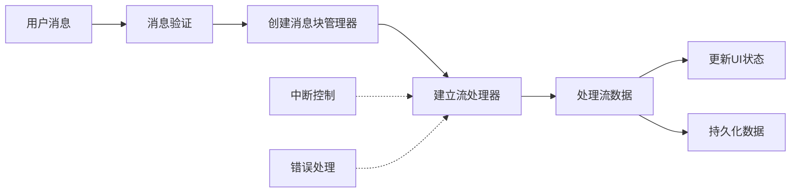

**图表来源**
- [messageThunk.ts](file://src/renderer/src/store/thunk/messageThunk.ts#L530-L687)

#### 块级更新优化

系统实现了智能的块级更新机制：

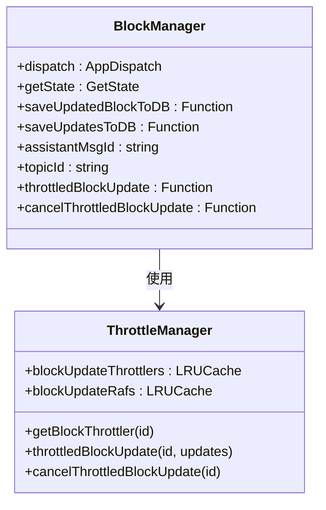

**图表来源**
- [messageThunk.ts](file://src/renderer/src/store/thunk/messageThunk.ts#L383-L453)

### 知识库异步操作

知识库操作提供了简单而强大的异步接口：

#### 知识项创建流程

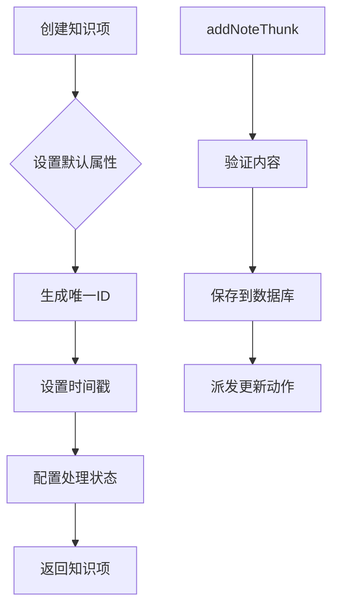

**图表来源**
- [knowledgeThunk.ts](file://src/renderer/src/store/thunk/knowledgeThunk.ts#L19-L37)

**章节来源**
- [messageThunk.ts](file://src/renderer/src/store/thunk/messageThunk.ts#L530-L700)
- [knowledgeThunk.ts](file://src/renderer/src/store/thunk/knowledgeThunk.ts#L1-L89)

## 错误处理与重试机制

### 中断控制器系统

Cherry Studio实现了完善的中断控制系统：

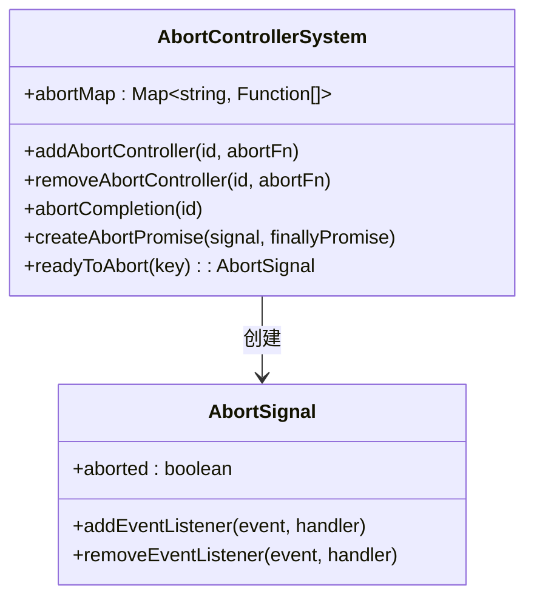

**图表来源**
- [abortController.ts](file://src/renderer/src/utils/abortController.ts#L1-L73)

### 错误恢复策略

系统实现了多层次的错误恢复机制：

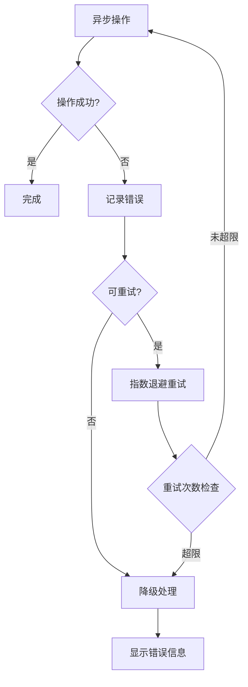

**章节来源**
- [abortController.ts](file://src/renderer/src/utils/abortController.ts#L1-L73)

## 性能优化策略

### 缓存机制

系统实现了多层缓存策略：

#### LRU 缓存优化

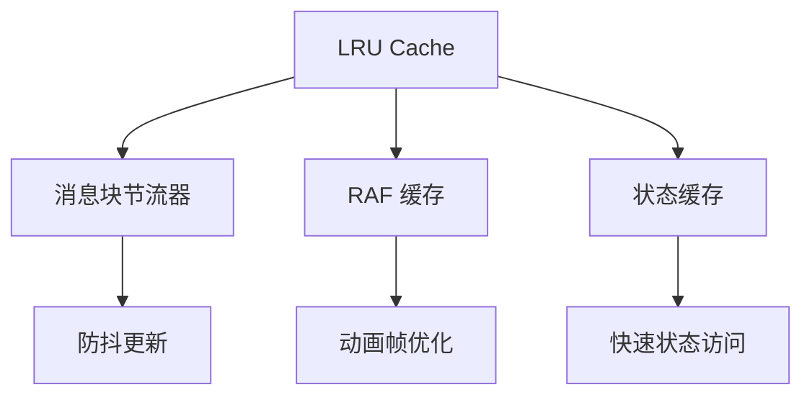

**图表来源**
- [messageThunk.ts](file://src/renderer/src/store/thunk/messageThunk.ts#L387-L427)

### 批量操作优化

系统支持批量操作以提高性能：

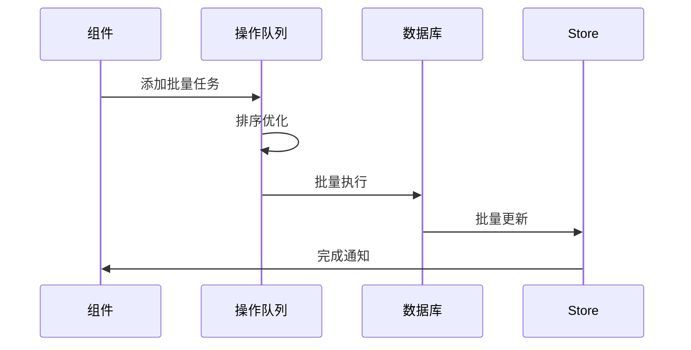

**章节来源**
- [messageThunk.ts](file://src/renderer/src/store/thunk/messageThunk.ts#L383-L453)

## 最佳实践指南

### 使用 Redux Thunk 的最佳实践

1. **保持 thunk 简洁**：每个 thunk 应该专注于单一职责
2. **适当的错误处理**：始终包含错误捕获和用户友好的错误信息
3. **状态更新时机**：在适当的时候更新加载状态和错误状态
4. **资源清理**：及时清理中断的请求和订阅

### 中间件开发指南

1. **单一关注点**：每个中间件应该处理单一类型的请求
2. **错误传播**：正确处理和传播错误
3. **性能考虑**：避免在中间件中执行耗时操作
4. **日志记录**：记录关键的操作和错误信息

### 组件集成建议

1. **Hook 使用**：优先使用自定义 Hook 来封装异步逻辑
2. **加载状态管理**：合理使用 loading 状态来提升用户体验
3. **错误边界**：在组件层面实现错误边界处理
4. **取消机制**：为长时间运行的操作提供取消选项

**章节来源**
- [useMessageOperations.ts](file://src/renderer/src/hooks/useMessageOperations.ts#L1-L100)

## 故障排除

### 常见问题及解决方案

#### 消息流中断问题

**症状**：消息流意外中断，无法接收完整响应

**原因分析**：
- 网络连接不稳定
- 服务器端流关闭
- 客户端中断控制器触发

**解决方案**：
1. 检查网络连接状态
2. 实现自动重连机制
3. 优化中断控制器逻辑

#### 状态同步延迟

**症状**：跨窗口状态更新存在明显延迟

**原因分析**：
- IPC 通信延迟
- 白名单配置不当
- 广播频率过高

**解决方案**：
1. 优化 IPC 通信路径
2. 调整同步白名单配置
3. 实现批量广播机制

#### 内存泄漏问题

**症状**：长时间运行后内存使用持续增长

**原因分析**：
- 事件监听器未正确清理
- 缓存策略不当
- 中断控制器未清理

**解决方案**：
1. 确保事件监听器的正确清理
2. 优化缓存大小和过期策略
3. 实现自动清理机制

**章节来源**
- [abortController.ts](file://src/renderer/src/utils/abortController.ts#L23-L31)
- [StoreSyncService.ts](file://src/renderer/src/services/StoreSyncService.ts#L90-L138)

## 总结

Cherry Studio的异步操作与中间件系统展现了现代前端应用的最佳实践。通过Redux Thunk处理复杂的异步逻辑，结合自定义中间件实现请求拦截和认证验证，系统实现了高性能、高可靠性的异步操作架构。

### 关键特性

1. **模块化设计**：清晰的职责分离和模块化架构
2. **性能优化**：多层缓存和批量操作优化
3. **错误处理**：完善的错误恢复和用户反馈机制
4. **可扩展性**：灵活的中间件系统和插件架构
5. **跨平台支持**：同时支持渲染进程和主进程的异步操作

### 技术优势

- **实时性**：流式数据处理和即时状态更新
- **可靠性**：多重错误处理和自动重试机制
- **可维护性**：清晰的代码结构和完善的测试覆盖
- **用户体验**：流畅的交互和及时的状态反馈

这套异步操作与中间件系统为 Cherry Studio提供了坚实的技术基础，支撑了复杂的消息处理、知识库管理和实时协作等功能需求。