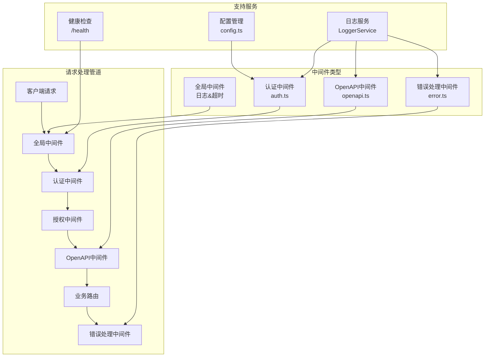
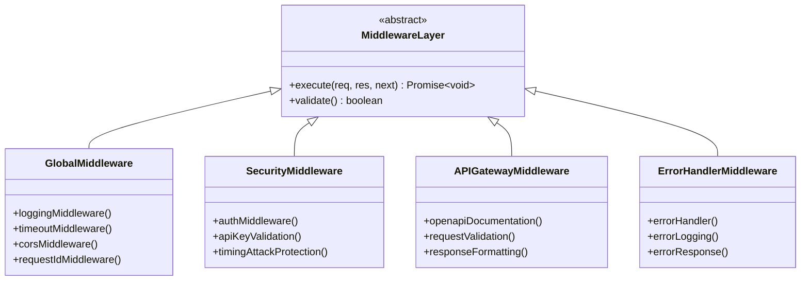
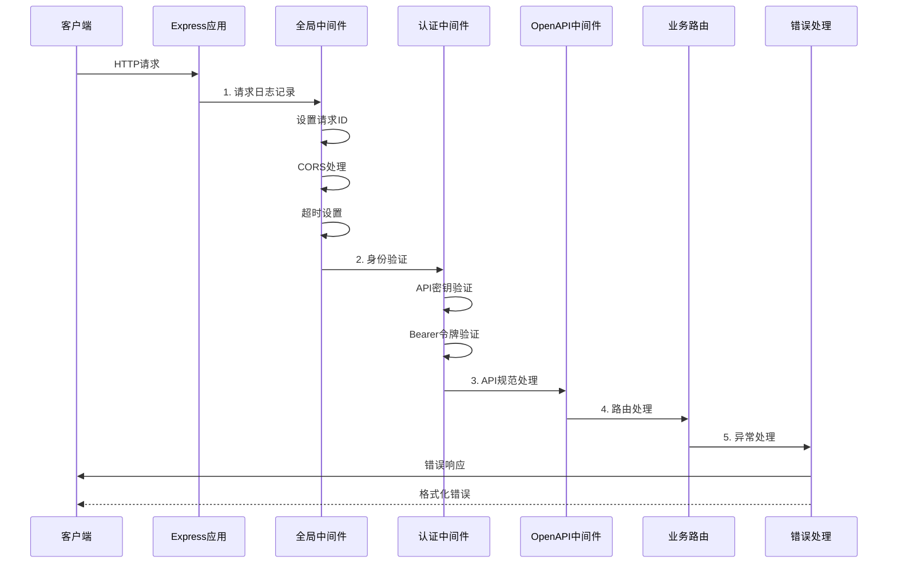
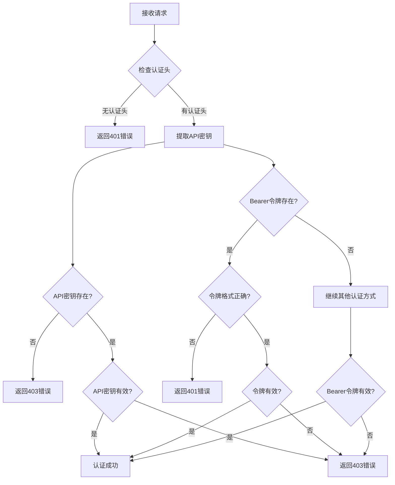
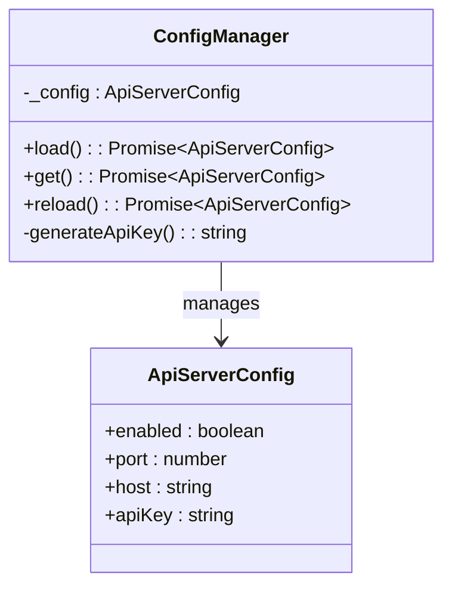
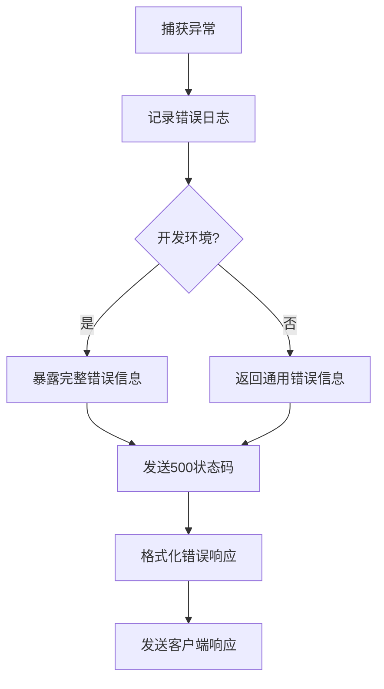
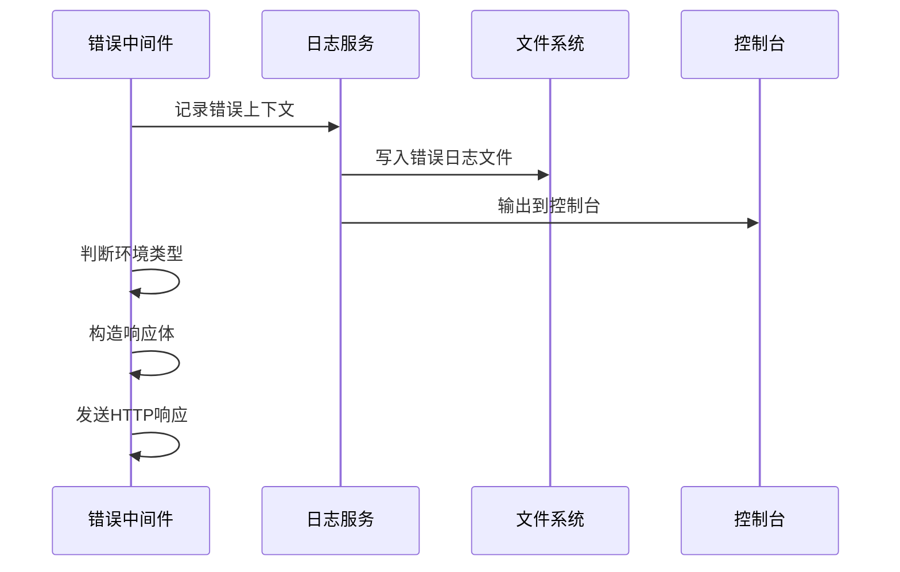
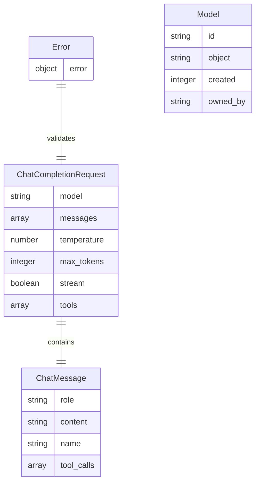
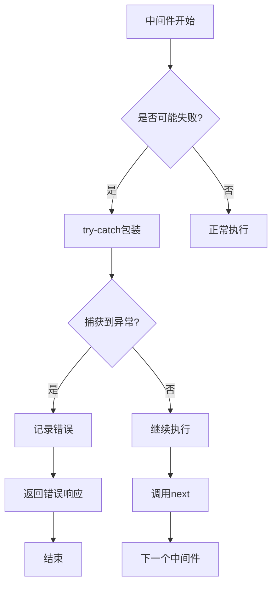
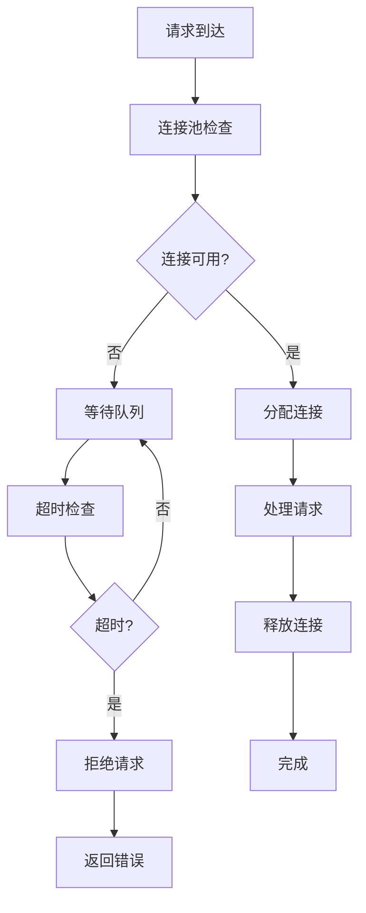

# Cherry Studio自定义中间件架构

<cite>
**本文档中引用的文件**
- [auth.ts](file://src/main/apiServer/middleware/auth.ts)
- [error.ts](file://src/main/apiServer/middleware/error.ts)
- [openapi.ts](file://src/main/apiServer/middleware/openapi.ts)
- [app.ts](file://src/main/apiServer/app.ts)
- [server.ts](file://src/main/apiServer/server.ts)
- [config.ts](file://src/main/apiServer/config.ts)
- [chat.ts](file://src/main/apiServer/routes/chat.ts)
- [LoggerService.ts](file://src/main/services/LoggerService.ts)
- [auth.test.ts](file://src/main/apiServer/middleware/__tests__/auth.test.ts)
</cite>

## 目录
1. [概述](#概述)
2. [中间件架构设计](#中间件架构设计)
3. [核心中间件组件](#核心中间件组件)
4. [中间件注册与执行流程](#中间件注册与执行流程)
5. [认证中间件详解](#认证中间件详解)
6. [错误处理中间件](#错误处理中间件)
7. [OpenAPI中间件](#openapi中间件)
8. [中间件最佳实践](#中间件最佳实践)
9. [性能优化与监控](#性能优化与监控)
10. [故障排除指南](#故障排除指南)
11. [总结](#总结)

## 概述

Cherry Studio采用了一套精心设计的自定义中间件架构，为API服务器提供了强大的请求处理能力和安全保障。这套架构基于Express框架，但扩展了传统的中间件模式，增加了专门的身份验证、错误处理和API规范验证功能。

### 架构特点

- **模块化设计**：每个中间件职责单一，易于维护和测试
- **安全性优先**：内置多重认证机制和安全防护
- **可观测性**：完整的日志记录和性能监控
- **可扩展性**：支持动态中间件链管理和条件执行

## 中间件架构设计



**图表来源**
- [app.ts](file://src/main/apiServer/app.ts#L24-L149)
- [auth.ts](file://src/main/apiServer/middleware/auth.ts#L15-L67)
- [error.ts](file://src/main/apiServer/middleware/error.ts#L7-L22)

## 核心中间件组件

### 中间件层次结构

Cherry Studio的中间件系统采用分层架构，每层承担特定职责：



**图表来源**
- [app.ts](file://src/main/apiServer/app.ts#L24-L149)
- [auth.ts](file://src/main/apiServer/middleware/auth.ts#L15-L67)
- [error.ts](file://src/main/apiServer/middleware/error.ts#L7-L22)

**章节来源**
- [app.ts](file://src/main/apiServer/app.ts#L24-L149)
- [auth.ts](file://src/main/apiServer/middleware/auth.ts#L1-L67)
- [error.ts](file://src/main/apiServer/middleware/error.ts#L1-L22)

## 中间件注册与执行流程

### 注册顺序与依赖关系

中间件的注册遵循严格的顺序，确保正确的执行链：



**图表来源**
- [app.ts](file://src/main/apiServer/app.ts#L24-L149)
- [server.ts](file://src/main/apiServer/server.ts#L19-L97)

### 执行流程详解

中间件的执行遵循Express的标准模式，但增加了额外的安全和监控功能：

1. **全局中间件阶段**：设置通用功能如CORS、超时、请求ID等
2. **安全中间件阶段**：执行身份验证和授权检查
3. **API网关阶段**：处理OpenAPI规范和请求验证
4. **业务逻辑阶段**：路由到具体的业务处理器
5. **错误处理阶段**：统一处理所有异常情况

**章节来源**
- [app.ts](file://src/main/apiServer/app.ts#L24-L149)
- [server.ts](file://src/main/apiServer/server.ts#L19-L97)

## 认证中间件详解

### 身份验证机制

认证中间件实现了双重认证机制，支持API密钥和Bearer令牌两种方式：



**图表来源**
- [auth.ts](file://src/main/apiServer/middleware/auth.ts#L15-L67)

### 安全特性

认证中间件包含多项安全特性：

| 特性 | 描述 | 实现位置 |
|------|------|----------|
| 时间安全比较 | 使用`crypto.timingSafeEqual`防止时序攻击 | [auth.ts](file://src/main/apiServer/middleware/auth.ts#L6-L13) |
| 多重认证方式 | 支持API密钥和Bearer令牌 | [auth.ts](file://src/main/apiServer/middleware/auth.ts#L30-L65) |
| 空白字符处理 | 自动清理认证头中的空白字符 | [auth.ts](file://src/main/apiServer/middleware/auth.ts#L32-L33) |
| 优先级控制 | API密钥优先于Bearer令牌 | [auth.ts](file://src/main/apiServer/middleware/auth.ts#L30-L42) |
| 错误信息保护 | 生产环境隐藏详细错误信息 | [auth.ts](file://src/main/apiServer/middleware/auth.ts#L40-L41) |

### 配置管理

认证中间件依赖于集中式的配置管理系统：



**图表来源**
- [config.ts](file://src/main/apiServer/config.ts#L12-L66)

**章节来源**
- [auth.ts](file://src/main/apiServer/middleware/auth.ts#L1-L67)
- [config.ts](file://src/main/apiServer/config.ts#L1-L66)
- [auth.test.ts](file://src/main/apiServer/middleware/__tests__/auth.test.ts#L1-L369)

## 错误处理中间件

### 错误处理机制

错误处理中间件采用统一的错误处理策略，确保所有异常都能得到妥善处理：



**图表来源**
- [error.ts](file://src/main/apiServer/middleware/error.ts#L7-L22)

### 错误响应格式

错误处理中间件返回标准化的错误响应格式：

| 字段 | 类型 | 描述 | 示例值 |
|------|------|------|--------|
| error.message | string | 错误消息 | "Internal server error" |
| error.type | string | 错误类型 | "server_error" |
| error.code | string | 错误代码 | "internal_error" |
| stack | string (开发环境) | 调用栈信息 | "Error: ..." |

### 日志记录策略

错误处理中间件集成了完整的日志记录功能：



**图表来源**
- [error.ts](file://src/main/apiServer/middleware/error.ts#L7-L22)
- [LoggerService.ts](file://src/main/services/LoggerService.ts#L1-L392)

**章节来源**
- [error.ts](file://src/main/apiServer/middleware/error.ts#L1-L22)
- [LoggerService.ts](file://src/main/services/LoggerService.ts#L1-L392)

## OpenAPI中间件

### API规范验证

OpenAPI中间件负责生成和提供API文档，同时验证请求的合法性：

```mermaid
graph LR
A[Swagger配置] --> B[API规范生成]
B --> C[JSON文档端点]
B --> D[UI文档界面]
C --> E[/api-docs.json]
D --> F[/api-docs]
E --> G[客户端访问]
F --> G
```

**图表来源**
- [openapi.ts](file://src/main/apiServer/middleware/openapi.ts#L177-L208)

### 文档生成配置

OpenAPI中间件使用Swagger JS Doc生成详细的API文档：

| 配置项 | 值 | 说明 |
|--------|-----|------|
| openapi | 3.0.0 | OpenAPI规范版本 |
| title | Cherry Studio API | API标题 |
| version | 1.0.0 | API版本号 |
| description | OpenAI兼容API | API描述 |
| servers.url | http://localhost:23333 | 服务器地址 |

### 数据模型定义

中间件定义了完整的数据模型用于API规范：



**图表来源**
- [openapi.ts](file://src/main/apiServer/middleware/openapi.ts#L9-L208)

**章节来源**
- [openapi.ts](file://src/main/apiServer/middleware/openapi.ts#L1-L208)

## 中间件最佳实践

### 性能考虑

1. **中间件顺序优化**
   - 将快速失败的中间件放在前面
   - 避免不必要的计算和数据库查询
   - 使用缓存减少重复操作

2. **内存管理**
   - 及时释放中间件中的资源
   - 避免闭包导致的内存泄漏
   - 合理使用异步操作

3. **并发处理**
   - 确保中间件是线程安全的
   - 避免共享可变状态
   - 使用适当的同步机制

### 错误边界



### 日志记录最佳实践

1. **结构化日志**
   ```typescript
   logger.info('API请求完成', {
     method: req.method,
     path: req.path,
     statusCode: res.statusCode,
     durationMs: duration
   })
   ```

2. **敏感信息保护**
   - 不要记录完整的认证凭据
   - 对用户输入进行适当脱敏
   - 区分不同级别的日志信息

3. **性能监控**
   - 记录请求处理时间
   - 监控中间件执行效率
   - 设置性能阈值告警

**章节来源**
- [app.ts](file://src/main/apiServer/app.ts#L32-L44)
- [LoggerService.ts](file://src/main/services/LoggerService.ts#L1-L392)

## 性能优化与监控

### 请求超时管理

Cherry Studio实现了多层次的超时控制：

| 超时类型 | 默认值 | 用途 |
|----------|--------|------|
| 请求超时 | 5分钟 | 整个请求处理时间 |
| 头部超时 | 5分钟+5秒 | HTTP头部传输时间 |
| Keep-Alive超时 | 1分钟 | 连接保持时间 |

### 并发控制



### 监控指标

中间件系统收集以下关键指标：

- **请求量统计**：每种HTTP方法的请求数量
- **响应时间分布**：请求处理时间的百分位数
- **错误率监控**：各类错误的发生频率
- **认证成功率**：身份验证的成功比例

**章节来源**
- [server.ts](file://src/main/apiServer/server.ts#L12-L15)
- [app.ts](file://src/main/apiServer/app.ts#L18-L22)

## 故障排除指南

### 常见问题诊断

1. **认证失败**
   - 检查API密钥是否正确配置
   - 验证请求头格式是否符合要求
   - 确认认证中间件是否正确加载

2. **OpenAPI文档无法访问**
   - 检查Swagger配置是否正确
   - 验证路由注册顺序
   - 确认文档生成过程是否成功

3. **错误处理失效**
   - 检查错误处理中间件的位置
   - 验证异常是否被正确捕获
   - 查看日志输出确认错误记录

### 调试技巧

1. **启用详细日志**
   ```bash
   export CSLOGGER_MAIN_LEVEL=silly
   ```

2. **检查中间件执行顺序**
   - 在每个中间件中添加日志标记
   - 使用浏览器开发者工具查看网络请求
   - 分析服务器日志中的执行路径

3. **单元测试覆盖**
   - 编写针对每个中间件的测试用例
   - 测试边界条件和异常情况
   - 验证错误处理逻辑

**章节来源**
- [auth.test.ts](file://src/main/apiServer/middleware/__tests__/auth.test.ts#L1-L369)
- [LoggerService.ts](file://src/main/services/LoggerService.ts#L1-L392)

## 总结

Cherry Studio的自定义中间件架构展现了现代Web应用中间件设计的最佳实践。通过模块化的设计、严格的安全措施和完善的监控体系，这套架构为API服务器提供了可靠、高效和可维护的基础。

### 关键优势

1. **安全性**：多重认证机制和时间安全比较
2. **可维护性**：清晰的职责分离和模块化设计
3. **可观测性**：完整的日志记录和性能监控
4. **扩展性**：灵活的中间件链管理和动态配置

### 发展方向

随着应用的发展，这套中间件架构可以进一步优化：

- **分布式追踪**：集成更高级的分布式追踪系统
- **智能限流**：基于机器学习的智能请求限流
- **自动化测试**：更全面的中间件自动化测试框架
- **云原生支持**：更好的容器化和微服务支持

这套中间件架构不仅满足了当前的功能需求，也为未来的扩展奠定了坚实的基础。