# Cherry Studio 状态持久化

<cite>
**本文档引用的文件**
- [ConfigManager.ts](file://src/main/services/ConfigManager.ts)
- [BackupManager.ts](file://src/main/services/BackupManager.ts)
- [StoreSyncService.ts](file://src/renderer/src/services/StoreSyncService.ts)
- [index.ts](file://src/renderer/src/store/index.ts)
- [FileStorage.ts](file://src/main/services/FileStorage.ts)
- [config.ts](file://src/main/config.ts)
- [bootstrap.ts](file://src/main/bootstrap.ts)
- [utils/index.ts](file://src/main/utils/index.ts)
- [BackupService.ts](file://src/renderer/src/services/BackupService.ts)
- [DexieMessageDataSource.ts](file://src/renderer/src/services/db/DexieMessageDataSource.ts)
- [MemoryService.ts](file://src/main/services/memory/MemoryService.ts)
</cite>

## 目录
1. [简介](#简介)
2. [系统架构概览](#系统架构概览)
3. [ConfigManager 配置管理](#configmanager-配置管理)
4. [状态同步机制](#状态同步机制)
5. [数据持久化策略](#数据持久化策略)
6. [备份与恢复机制](#备份与恢复机制)
7. [文件存储系统](#文件存储系统)
8. [错误处理与安全保障](#错误处理与安全保障)
9. [性能优化考虑](#性能优化考虑)
10. [最佳实践建议](#最佳实践建议)

## 简介

Cherry Studio 采用多层次的状态持久化架构，确保用户配置、应用设置和重要数据能够在不同场景下安全可靠地保存和恢复。该系统通过 ConfigManager 进行配置管理，结合 Redux Persist 实现状态持久化，并通过 BackupManager 提供完整的备份恢复功能。

## 系统架构概览

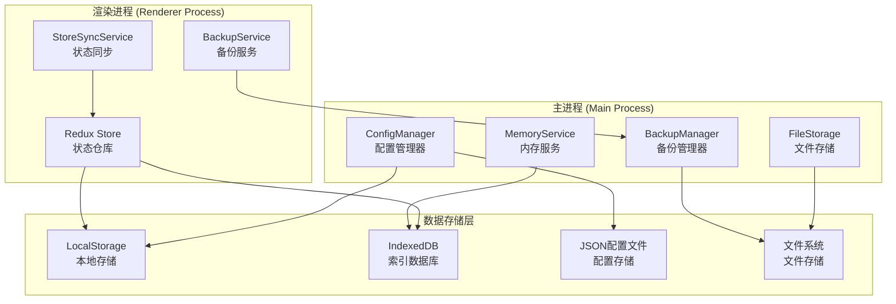
```mermaid
graph TB
subgraph "主进程 (Main Process)"
CM[ConfigManager<br/>配置管理器]
BM[BackupManager<br/>备份管理器]
FS[FileStorage<br/>文件存储]
MS[MemoryService<br/>内存服务]
end
subgraph "渲染进程 (Renderer Process)"
RS[Redux Store<br/>状态仓库]
SS[StoreSyncService<br/>状态同步]
BS[BackupService<br/>备份服务]
end
subgraph "数据存储层"
LS[LocalStorage<br/>本地存储]
IDB[IndexedDB<br/>索引数据库]
JSON[JSON配置文件<br/>配置存储]
FILES[文件系统<br/>文件存储]
end
CM --> JSON
BM --> FILES
FS --> FILES
MS --> IDB
RS --> LS
RS --> IDB
SS --> RS
BS --> BM
CM --> LS
```

**图表来源**
- [ConfigManager.ts](file://src/main/services/ConfigManager.ts#L37-L270)
- [BackupManager.ts](file://src/main/services/BackupManager.ts#L20-L773)
- [StoreSyncService.ts](file://src/renderer/src/services/StoreSyncService.ts#L22-L138)

## ConfigManager 配置管理

### 核心功能架构

ConfigManager 是 Cherry Studio 的核心配置管理组件，基于 electron-store 提供可靠的配置持久化能力。

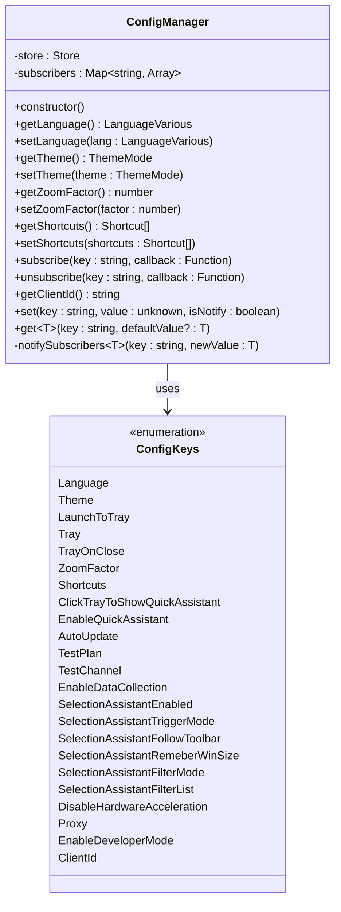
```mermaid
classDiagram
class ConfigManager {
-store : Store
-subscribers : Map~string, Array~
+constructor()
+getLanguage() LanguageVarious
+setLanguage(lang : LanguageVarious)
+getTheme() ThemeMode
+setTheme(theme : ThemeMode)
+getZoomFactor() number
+setZoomFactor(factor : number)
+getShortcuts() Shortcut[]
+setShortcuts(shortcuts : Shortcut[])
+subscribe(key : string, callback : Function)
+unsubscribe(key : string, callback : Function)
+getClientId() string
+set(key : string, value : unknown, isNotify : boolean)
+get~T~(key : string, defaultValue? : T)
-notifySubscribers~T~(key : string, newValue : T)
}
class ConfigKeys {
<<enumeration>>
Language
Theme
LaunchToTray
Tray
TrayOnClose
ZoomFactor
Shortcuts
ClickTrayToShowQuickAssistant
EnableQuickAssistant
AutoUpdate
TestPlan
TestChannel
EnableDataCollection
SelectionAssistantEnabled
SelectionAssistantTriggerMode
SelectionAssistantFollowToolbar
SelectionAssistantRemeberWinSize
SelectionAssistantFilterMode
SelectionAssistantFilterList
DisableHardwareAcceleration
Proxy
EnableDeveloperMode
ClientId
}
ConfigManager --> ConfigKeys : uses
```

**图表来源**
- [ConfigManager.ts](file://src/main/services/ConfigManager.ts#L11-L35)
- [ConfigManager.ts](file://src/main/services/ConfigManager.ts#L37-L270)

### 配置键值定义

系统定义了全面的配置键值枚举，涵盖以下类别：

| 配置类别 | 配置项 | 类型 | 默认值 | 描述 |
|---------|--------|------|--------|------|
| 用户界面 | Language | LanguageVarious | 系统语言 | 应用界面语言设置 |
| 用户界面 | Theme | ThemeMode | system | 主题模式（浅色/深色/跟随系统） |
| 用户界面 | ZoomFactor | number | 1 | 界面缩放比例 |
| 用户界面 | Shortcuts | Shortcut[] | 默认快捷键 | 自定义键盘快捷键配置 |
| 系统行为 | LaunchToTray | boolean | false | 启动时最小化到托盘 |
| 系统行为 | TrayOnClose | boolean | true | 关闭窗口时最小化到托盘 |
| 助手功能 | EnableQuickAssistant | boolean | false | 启用快速助手功能 |
| 助手功能 | SelectionAssistantEnabled | boolean | false | 启用选择助手功能 |
| 数据收集 | EnableDataCollection | boolean | true | 启用数据收集功能 |
| 开发者选项 | EnableDeveloperMode | boolean | false | 启用开发者模式 |
| 网络设置 | Proxy | string | - | 代理服务器配置 |
| 硬件加速 | DisableHardwareAcceleration | boolean | false | 禁用硬件加速 |

**节来源**
- [ConfigManager.ts](file://src/main/services/ConfigManager.ts#L11-L35)

### 配置读写机制

ConfigManager 提供了完善的配置读写机制：

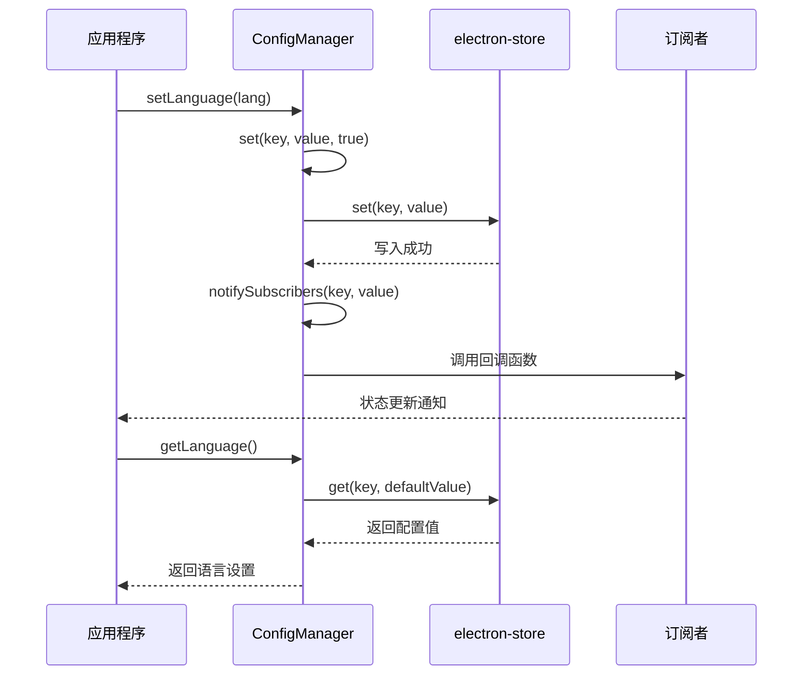
```mermaid
sequenceDiagram
participant App as 应用程序
participant CM as ConfigManager
participant Store as electron-store
participant Sub as 订阅者
App->>CM : setLanguage(lang)
CM->>CM : set(key, value, true)
CM->>Store : set(key, value)
Store-->>CM : 写入成功
CM->>CM : notifySubscribers(key, value)
CM->>Sub : 调用回调函数
Sub-->>App : 状态更新通知
App->>CM : getLanguage()
CM->>Store : get(key, defaultValue)
Store-->>CM : 返回配置值
CM-->>App : 返回语言设置
```

**图表来源**
- [ConfigManager.ts](file://src/main/services/ConfigManager.ts#L236-L266)

### 订阅者模式实现

ConfigManager 实现了观察者模式，支持配置变更的实时通知：

```typescript
// 订阅配置变更
configManager.subscribe(ConfigKeys.Language, (newLang) => {
  // 更新UI语言
  updateUILanguage(newLang);
});

// 取消订阅
configManager.unsubscribe(ConfigKeys.Language, callback);
```

**节来源**
- [ConfigManager.ts](file://src/main/services/ConfigManager.ts#L94-L116)

## 状态同步机制

### StoreSyncService 架构

StoreSyncService 负责在多窗口间同步 Redux 状态，确保用户体验的一致性。

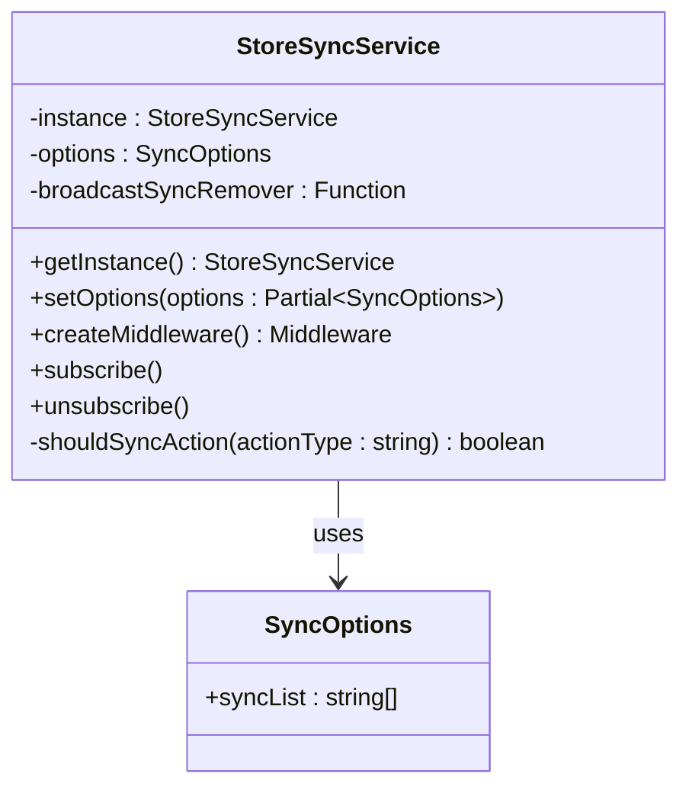
```mermaid
classDiagram
class StoreSyncService {
-instance : StoreSyncService
-options : SyncOptions
-broadcastSyncRemover : Function
+getInstance() StoreSyncService
+setOptions(options : Partial~SyncOptions~)
+createMiddleware() Middleware
+subscribe()
+unsubscribe()
-shouldSyncAction(actionType : string) boolean
}
class SyncOptions {
+syncList : string[]
}
StoreSyncService --> SyncOptions : uses
```

**图表来源**
- [StoreSyncService.ts](file://src/renderer/src/services/StoreSyncService.ts#L22-L138)

### 状态同步流程

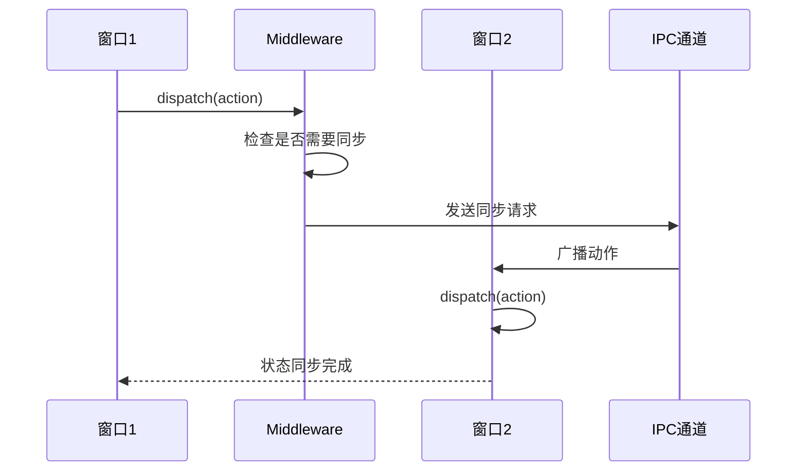
```mermaid
sequenceDiagram
participant W1 as 窗口1
participant MW as Middleware
participant W2 as 窗口2
participant IPC as IPC通道
W1->>MW : dispatch(action)
MW->>MW : 检查是否需要同步
MW->>IPC : 发送同步请求
IPC->>W2 : 广播动作
W2->>W2 : dispatch(action)
W2-->>W1 : 状态同步完成
```

**图表来源**
- [StoreSyncService.ts](file://src/renderer/src/services/StoreSyncService.ts#L55-L70)

### 同步白名单配置

系统支持精确控制哪些状态切片需要在窗口间同步：

```typescript
// 设置需要同步的状态切片
storeSyncService.setOptions({
  syncList: [
    'assistants/',    // 助手相关状态
    'settings/',      // 设置状态
    'llm/',           // LLM相关状态
    'selectionStore/',// 选择状态
    'note/'           // 笔记状态
  ]
});
```

**节来源**
- [StoreSyncService.ts](file://src/renderer/src/services/StoreSyncService.ts#L88-L90)

## 数据持久化策略

### Redux Persist 配置

应用使用 Redux Persist 实现状态的自动持久化：

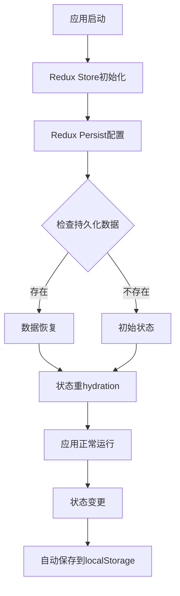
```mermaid
flowchart TD
A[应用启动] --> B[Redux Store初始化]
B --> C[Redux Persist配置]
C --> D{检查持久化数据}
D --> |存在| E[数据恢复]
D --> |不存在| F[初始状态]
E --> G[状态重hydration]
F --> G
G --> H[应用正常运行]
H --> I[状态变更]
I --> J[自动保存到localStorage]
```

**图表来源**
- [index.ts](file://src/renderer/src/store/index.ts#L66-L75)

### 持久化配置详情

| 配置项 | 值 | 说明 |
|--------|-----|------|
| key | 'cherry-studio' | 存储键名前缀 |
| storage | localStorage | 存储引擎 |
| version | 179 | 版本号，用于迁移 |
| blacklist | runtime, messages, messageBlocks, tabs, toolPermissions | 不持久化的状态切片 |
| migrate | migrate | 状态迁移函数 |

**节来源**
- [index.ts](file://src/renderer/src/store/index.ts#L66-L75)

### 数据库持久化

对于大型数据集，系统采用 IndexedDB 进行持久化：

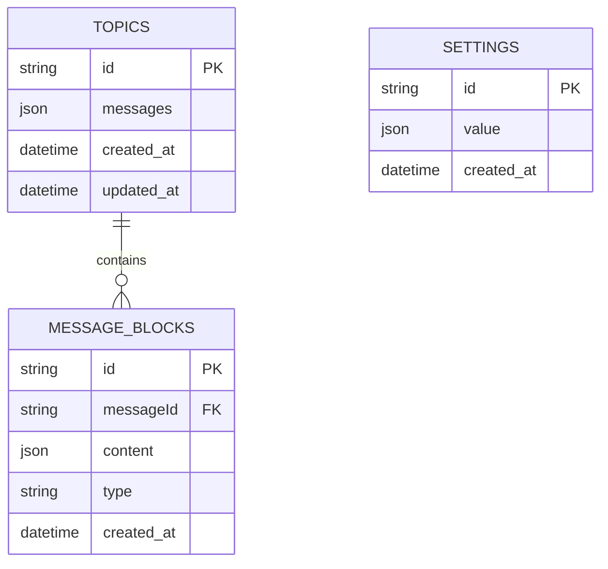
```mermaid
erDiagram
TOPICS {
string id PK
json messages
datetime created_at
datetime updated_at
}
MESSAGE_BLOCKS {
string id PK
string messageId FK
json content
string type
datetime created_at
}
SETTINGS {
string id PK
json value
datetime created_at
}
TOPICS ||--o{ MESSAGE_BLOCKS : contains
```

**图表来源**
- [DexieMessageDataSource.ts](file://src/renderer/src/services/db/DexieMessageDataSource.ts#L17-L42)

## 备份与恢复机制

### BackupManager 核心架构

BackupManager 提供了完整的备份恢复解决方案，支持多种存储后端。

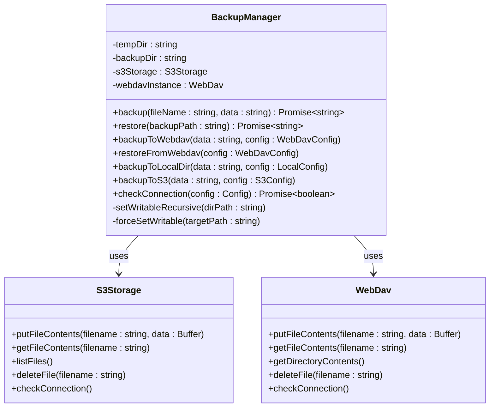
```mermaid
classDiagram
class BackupManager {
-tempDir : string
-backupDir : string
-s3Storage : S3Storage
-webdavInstance : WebDav
+backup(fileName : string, data : string) Promise~string~
+restore(backupPath : string) Promise~string~
+backupToWebdav(data : string, config : WebDavConfig)
+restoreFromWebdav(config : WebDavConfig)
+backupToLocalDir(data : string, config : LocalConfig)
+backupToS3(data : string, config : S3Config)
+checkConnection(config : Config) Promise~boolean~
-setWritableRecursive(dirPath : string)
-forceSetWritable(targetPath : string)
}
class S3Storage {
+putFileContents(filename : string, data : Buffer)
+getFileContents(filename : string)
+listFiles()
+deleteFile(filename : string)
+checkConnection()
}
class WebDav {
+putFileContents(filename : string, data : Buffer)
+getFileContents(filename : string)
+getDirectoryContents()
+deleteFile(filename : string)
+checkConnection()
}
BackupManager --> S3Storage : uses
BackupManager --> WebDav : uses
```

**图表来源**
- [BackupManager.ts](file://src/main/services/BackupManager.ts#L20-L773)

### 备份数据结构

备份文件包含以下核心数据：

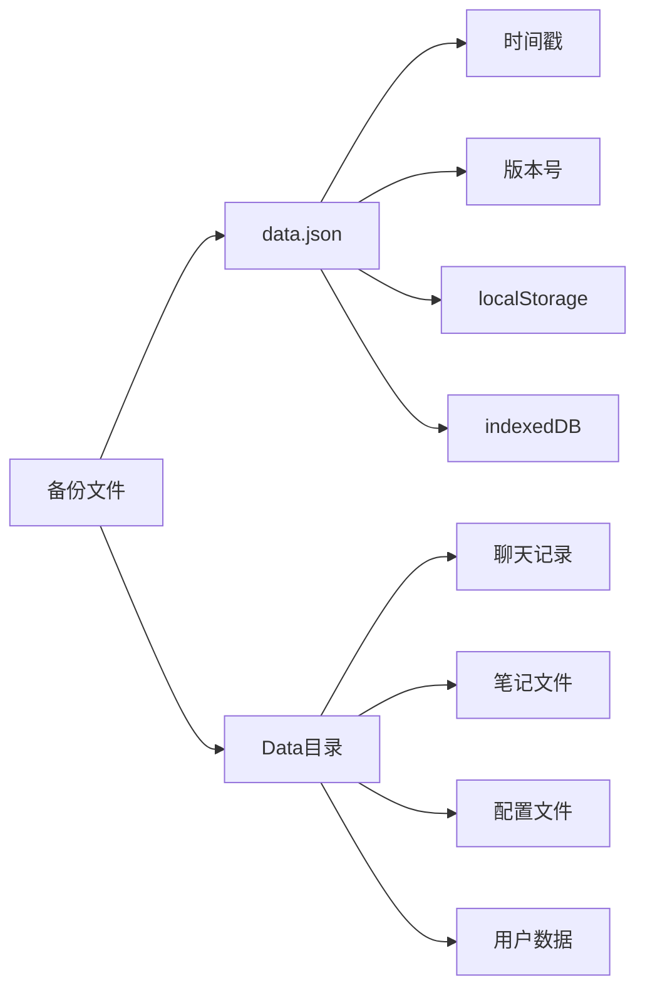
```mermaid
graph LR
A[备份文件] --> B[data.json]
A --> C[Data目录]
B --> D[时间戳]
B --> E[版本号]
B --> F[localStorage]
B --> G[indexedDB]
C --> H[聊天记录]
C --> I[笔记文件]
C --> J[配置文件]
C --> K[用户数据]
```

**图表来源**
- [BackupService.ts](file://src/renderer/src/services/BackupService.ts#L823-L830)

### 备份流程

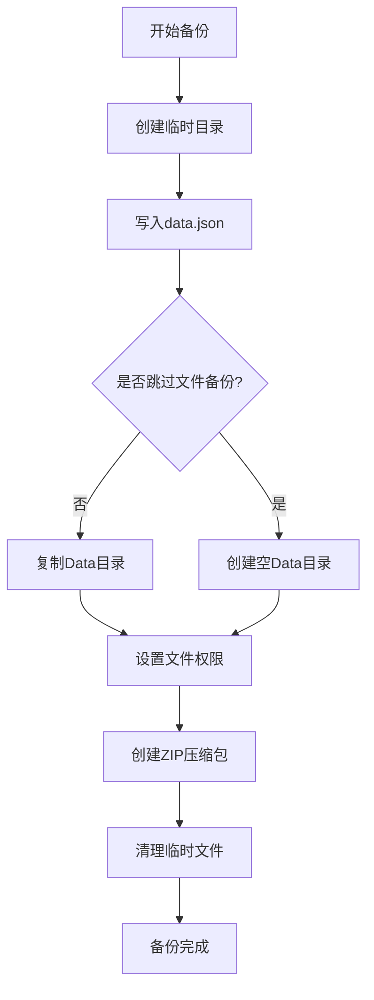
```mermaid
flowchart TD
A[开始备份] --> B[创建临时目录]
B --> C[写入data.json]
C --> D{是否跳过文件备份?}
D --> |否| E[复制Data目录]
D --> |是| F[创建空Data目录]
E --> G[设置文件权限]
F --> G
G --> H[创建ZIP压缩包]
H --> I[清理临时文件]
I --> J[备份完成]
```

**图表来源**
- [BackupManager.ts](file://src/main/services/BackupManager.ts#L193-L351)

### 恢复流程

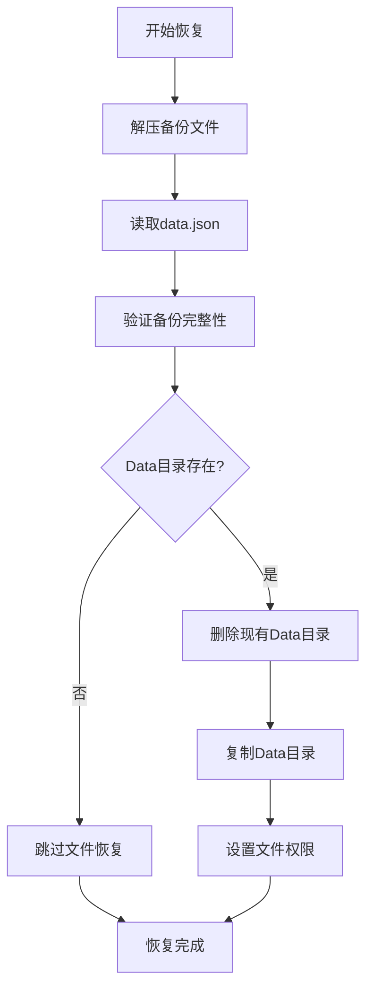
```mermaid
flowchart TD
A[开始恢复] --> B[解压备份文件]
B --> C[读取data.json]
C --> D[验证备份完整性]
D --> E{Data目录存在?}
E --> |是| F[删除现有Data目录]
E --> |否| G[跳过文件恢复]
F --> H[复制Data目录]
H --> I[设置文件权限]
G --> J[恢复完成]
I --> J
```

**图表来源**
- [BackupManager.ts](file://src/main/services/BackupManager.ts#L353-L423)

## 文件存储系统

### FileStorage 架构

FileStorage 提供了完整的文件管理系统，支持文件上传、下载、移动和删除操作。

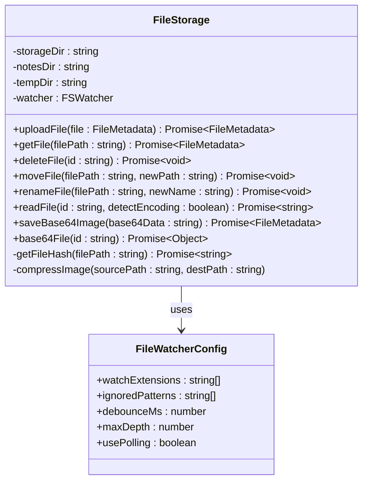
```mermaid
classDiagram
class FileStorage {
-storageDir : string
-notesDir : string
-tempDir : string
-watcher : FSWatcher
+uploadFile(file : FileMetadata) Promise~FileMetadata~
+getFile(filePath : string) Promise~FileMetadata~
+deleteFile(id : string) Promise~void~
+moveFile(filePath : string, newPath : string) Promise~void~
+renameFile(filePath : string, newName : string) Promise~void~
+readFile(id : string, detectEncoding : boolean) Promise~string~
+saveBase64Image(base64Data : string) Promise~FileMetadata~
+base64File(id : string) Promise~Object~
-getFileHash(filePath : string) Promise~string~
-compressImage(sourcePath : string, destPath : string)
}
class FileWatcherConfig {
+watchExtensions : string[]
+ignoredPatterns : string[]
+debounceMs : number
+maxDepth : number
+usePolling : boolean
}
FileStorage --> FileWatcherConfig : uses
```

**图表来源**
- [FileStorage.ts](file://src/main/services/FileStorage.ts#L145-L800)

### 文件处理流程

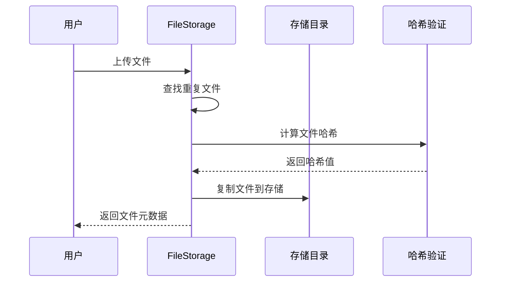
```mermaid
sequenceDiagram
participant U as 用户
participant FS as FileStorage
participant S as 存储目录
participant H as 哈希验证
U->>FS : 上传文件
FS->>FS : 查找重复文件
FS->>H : 计算文件哈希
H-->>FS : 返回哈希值
FS->>S : 复制文件到存储
FS-->>U : 返回文件元数据
```

**图表来源**
- [FileStorage.ts](file://src/main/services/FileStorage.ts#L286-L326)

### 图像处理优化

系统对图像文件进行了专门的优化处理：

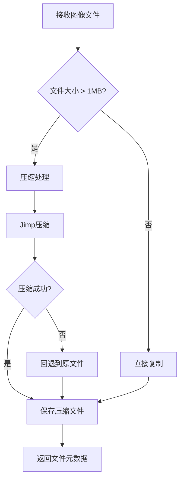
```mermaid
flowchart TD
A[接收图像文件] --> B{文件大小 > 1MB?}
B --> |是| C[压缩处理]
B --> |否| D[直接复制]
C --> E[Jimp压缩]
E --> F{压缩成功?}
F --> |是| G[保存压缩文件]
F --> |否| H[回退到原文件]
D --> G
H --> G
G --> I[返回文件元数据]
```

**图表来源**
- [FileStorage.ts](file://src/main/services/FileStorage.ts#L261-L283)

## 错误处理与安全保障

### 权限管理机制

BackupManager 实现了严格的权限管理：

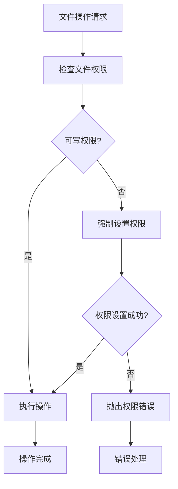
```mermaid
flowchart TD
A[文件操作请求] --> B[检查文件权限]
B --> C{可写权限?}
C --> |否| D[强制设置权限]
C --> |是| E[执行操作]
D --> F{权限设置成功?}
F --> |是| E
F --> |否| G[抛出权限错误]
E --> H[操作完成]
G --> I[错误处理]
```

**图表来源**
- [BackupManager.ts](file://src/main/services/BackupManager.ts#L64-L109)

### 数据完整性验证

系统在多个层面确保数据完整性：

| 验证层级 | 验证内容 | 实现方式 |
|----------|----------|----------|
| 文件系统级 | 文件存在性检查 | fs.existsSync() |
| 哈希校验级 | 文件完整性验证 | MD5哈希计算 |
| 数据库级 | 数据一致性检查 | IndexedDB事务 |
| 配置级 | 配置有效性验证 | 类型检查和默认值 |

### 加密与安全

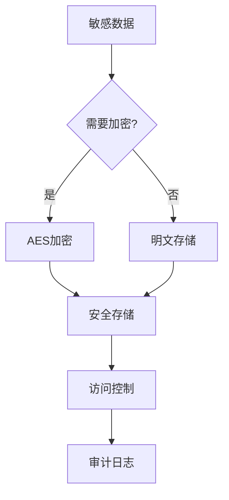
```mermaid
graph TB
A[敏感数据] --> B{需要加密?}
B --> |是| C[AES加密]
B --> |否| D[明文存储]
C --> E[安全存储]
D --> E
E --> F[访问控制]
F --> G[审计日志]
```

**节来源**
- [FileStorage.ts](file://src/main/services/FileStorage.ts#L176-L185)

## 性能优化考虑

### 异步操作优化

系统大量采用异步操作来避免阻塞主线程：

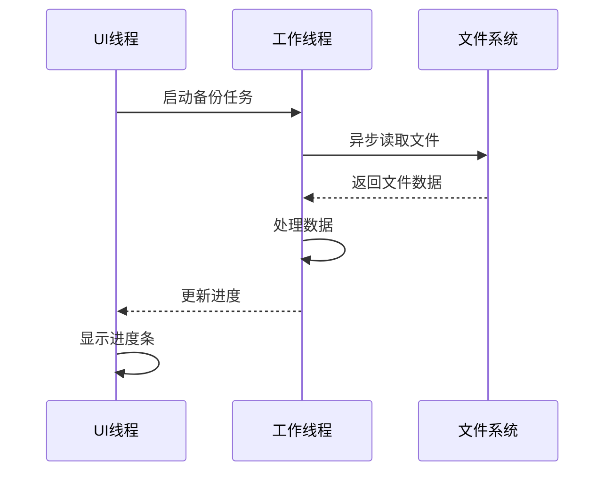
```mermaid
sequenceDiagram
participant UI as UI线程
participant Worker as 工作线程
participant FS as 文件系统
UI->>Worker : 启动备份任务
Worker->>FS : 异步读取文件
FS-->>Worker : 返回文件数据
Worker->>Worker : 处理数据
Worker-->>UI : 更新进度
UI->>UI : 显示进度条
```

### 内存管理

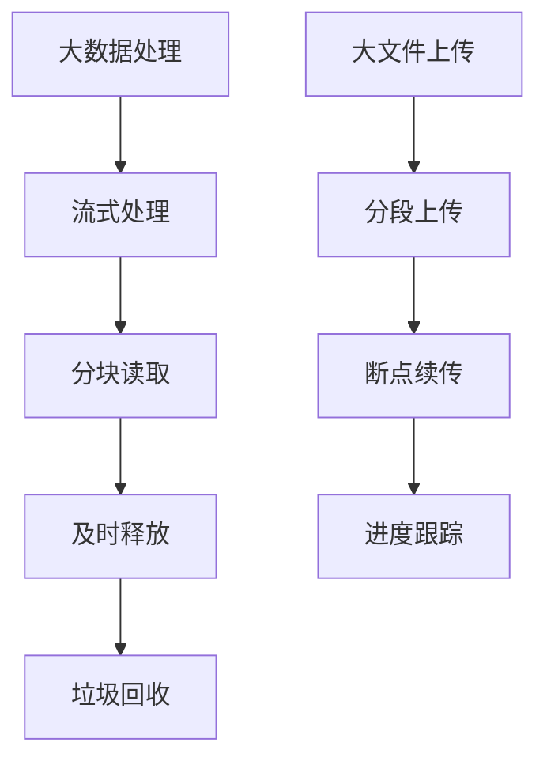
```mermaid
flowchart TD
A[大数据处理] --> B[流式处理]
B --> C[分块读取]
C --> D[及时释放]
D --> E[垃圾回收]
F[大文件上传] --> G[分段上传]
G --> H[断点续传]
H --> I[进度跟踪]
```

### 缓存策略

系统实现了多级缓存机制：

| 缓存层级 | 缓存内容 | 生命周期 | 清理策略 |
|----------|----------|----------|----------|
| 内存缓存 | 频繁访问的配置 | 应用生命周期 | 应用关闭时清理 |
| 文件缓存 | 临时文件和缓存 | 手动清理 | 定期清理策略 |
| 浏览器缓存 | 静态资源 | 浏览器控制 | HTTP缓存头控制 |

## 最佳实践建议

### 配置管理最佳实践

1. **类型安全**：始终使用强类型定义配置项
2. **默认值**：为所有配置项提供合理的默认值
3. **版本兼容**：实现配置迁移机制处理版本升级
4. **验证机制**：对用户输入的配置进行严格验证

### 备份策略建议

1. **定期备份**：设置自动备份计划
2. **多地备份**：同时使用本地和云端备份
3. **版本保留**：保留多个历史版本的备份
4. **测试恢复**：定期测试备份恢复流程

### 性能监控

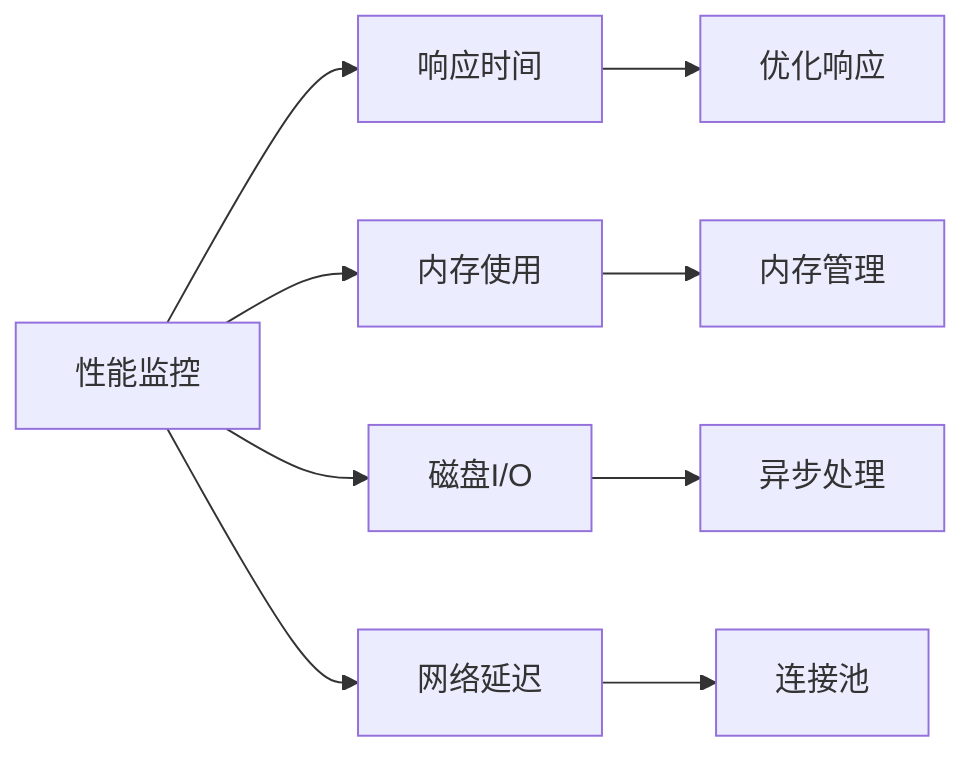
```mermaid
graph LR
A[性能监控] --> B[响应时间]
A --> C[内存使用]
A --> D[磁盘I/O]
A --> E[网络延迟]
B --> F[优化响应]
C --> G[内存管理]
D --> H[异步处理]
E --> I[连接池]
```

### 故障恢复

1. **优雅降级**：在网络不可用时提供离线功能
2. **数据恢复**：实现自动数据恢复机制
3. **错误报告**：收集详细的错误信息用于问题诊断
4. **用户通知**：及时通知用户重要的状态变更

通过以上多层次的状态持久化机制，Cherry Studio 确保了用户数据的安全性、可靠性和可用性，为用户提供稳定可靠的应用体验。