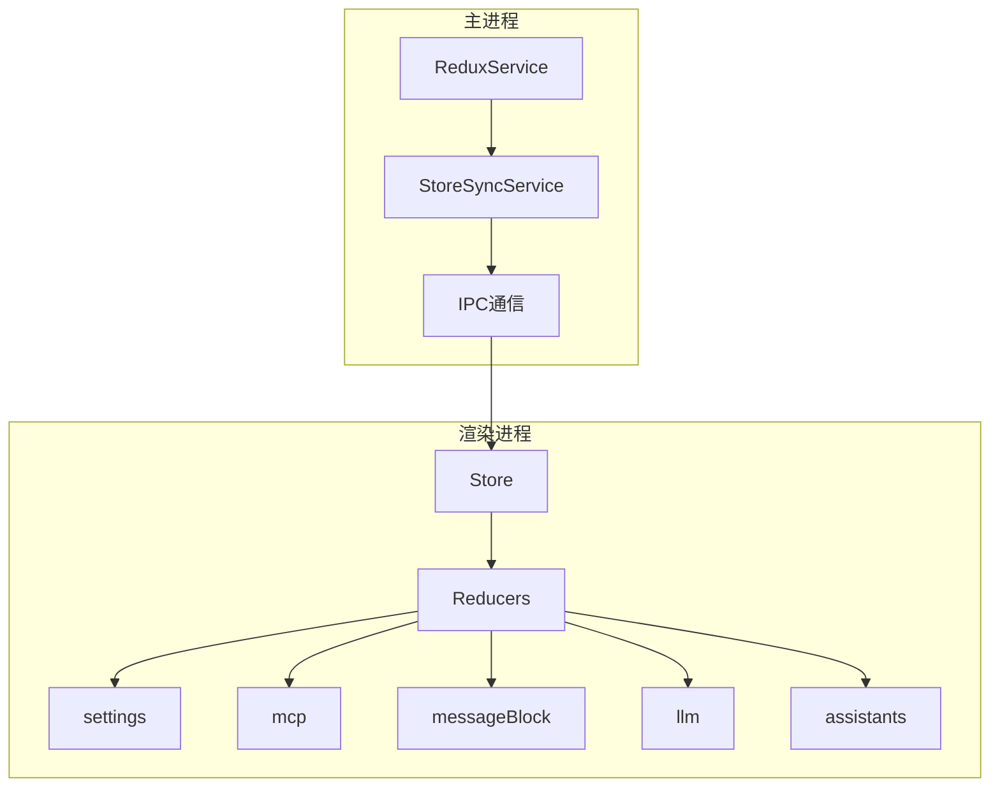
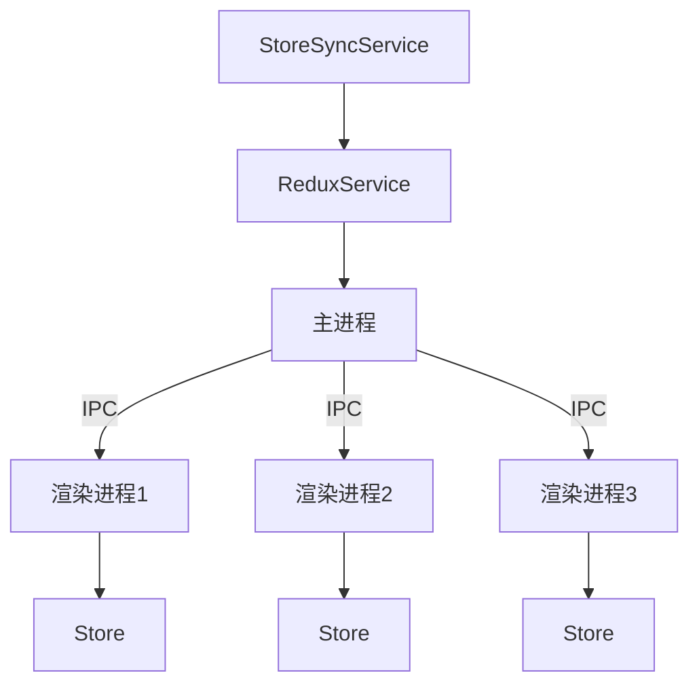
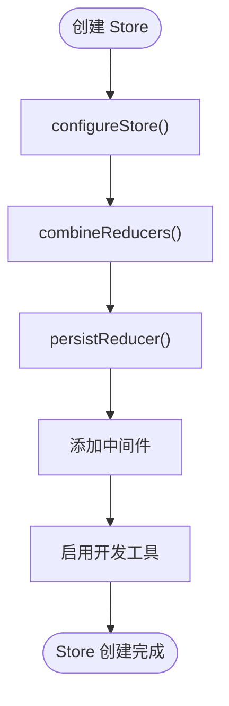
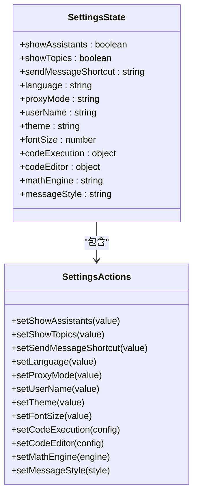
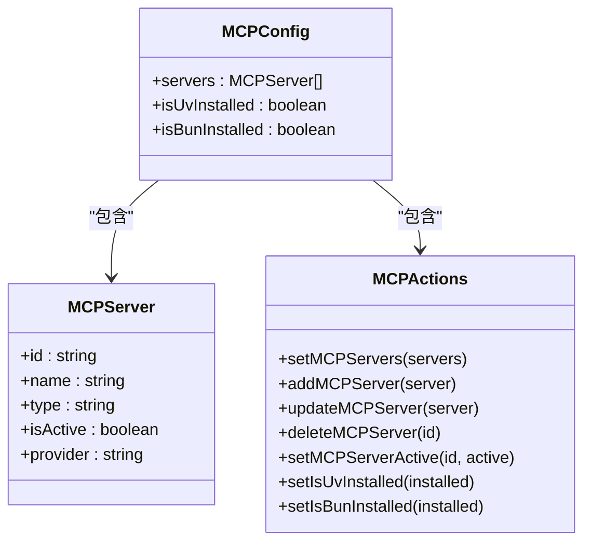
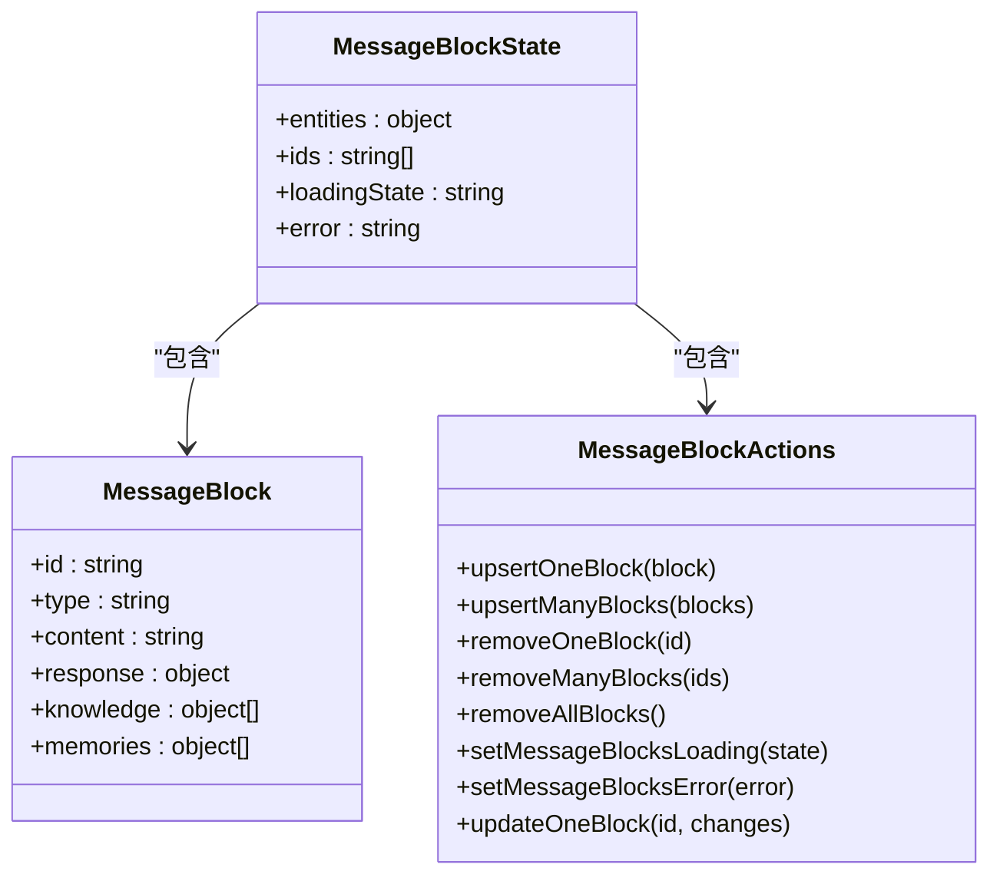
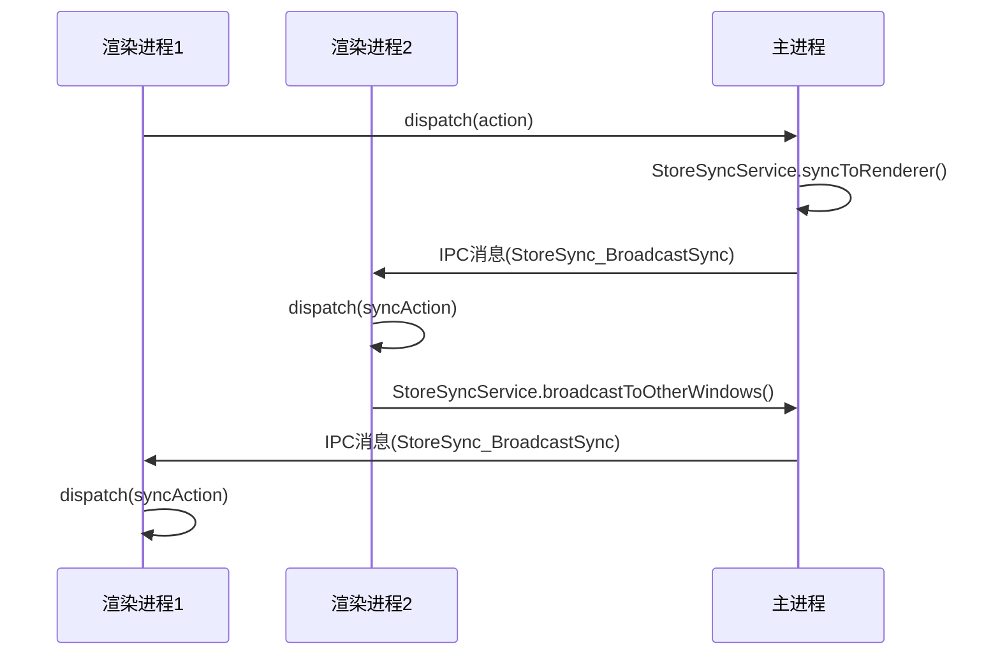
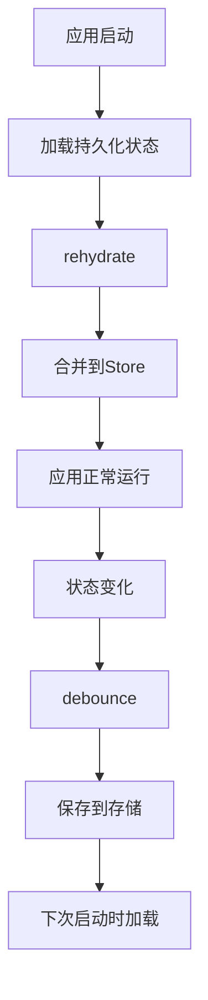
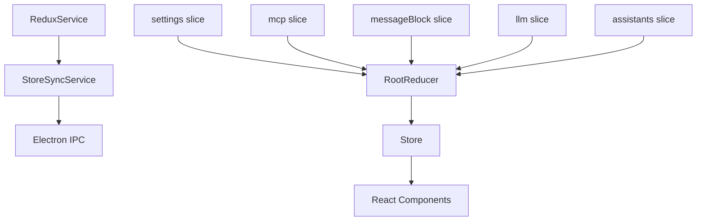
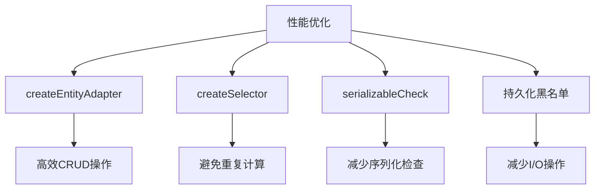

# 状态管理架构

<cite>
**本文档中引用的文件**   
- [index.ts](file://src/renderer/src/store/index.ts)
- [settings.ts](file://src/renderer/src/store/settings.ts)
- [mcp.ts](file://src/renderer/src/store/mcp.ts)
- [messageBlock.ts](file://src/renderer/src/store/messageBlock.ts)
- [StoreSyncService.ts](file://src/main/services/StoreSyncService.ts)
- [ReduxService.ts](file://src/main/services/ReduxService.ts)
</cite>

## 目录
1. [简介](#简介)
2. [项目结构](#项目结构)
3. [核心组件](#核心组件)
4. [架构概述](#架构概述)
5. [详细组件分析](#详细组件分析)
6. [依赖分析](#依赖分析)
7. [性能考虑](#性能考虑)
8. [故障排除指南](#故障排除指南)
9. [结论](#结论)

## 简介
Cherry Studio 采用基于 Redux 的状态管理架构，实现了主进程与渲染进程之间的状态同步。该架构通过 IPC 通信机制确保多窗口间的状态一致性，并采用状态分片设计来组织不同功能模块的状态。文档将详细说明 store 的创建、reducer 的组织、action 的定义，以及异步操作处理和状态持久化策略。

## 项目结构
Cherry Studio 的状态管理主要位于 `src/renderer/src/store` 目录下，采用 Redux Toolkit 进行状态管理。主进程通过 `ReduxService` 和 `StoreSyncService` 与渲染进程进行状态同步。



**Diagram sources**
- [index.ts](file://src/renderer/src/store/index.ts)
- [StoreSyncService.ts](file://src/main/services/StoreSyncService.ts)

**Section sources**
- [index.ts](file://src/renderer/src/store/index.ts)

## 核心组件
状态管理的核心组件包括 store 的创建、reducer 的组织和 action 的定义。通过 Redux Toolkit 的 `createSlice` 方法创建各个功能模块的 reducer，并使用 `configureStore` 方法创建 store。

**Section sources**
- [index.ts](file://src/renderer/src/store/index.ts)
- [settings.ts](file://src/renderer/src/store/settings.ts)

## 架构概述
Cherry Studio 的状态管理架构采用分层设计，将不同功能模块的状态分离到不同的 slice 中。主进程通过 IPC 通信机制与渲染进程同步状态，确保多窗口间的状态一致性。



**Diagram sources**
- [ReduxService.ts](file://src/main/services/ReduxService.ts)
- [StoreSyncService.ts](file://src/main/services/StoreSyncService.ts)

## 详细组件分析

### Store 创建与配置
Store 的创建使用 Redux Toolkit 的 `configureStore` 方法，结合 `redux-persist` 实现状态持久化。通过 `persistReducer` 包装根 reducer，指定需要持久化的状态 slice。



**Diagram sources**
- [index.ts](file://src/renderer/src/store/index.ts)

**Section sources**
- [index.ts](file://src/renderer/src/store/index.ts)

### 状态分片设计
状态分片设计将不同功能模块的状态分离到不同的 slice 中，如 mcp、settings、messageBlock 等。每个 slice 负责管理特定功能模块的状态。

#### settings slice
`settings` slice 负责管理应用的各种设置，包括用户界面、代理、代码执行等配置。



**Diagram sources**
- [settings.ts](file://src/renderer/src/store/settings.ts)

**Section sources**
- [settings.ts](file://src/renderer/src/store/settings.ts)

#### mcp slice
`mcp` slice 负责管理 MCP（Model Context Protocol）服务器的配置和状态。



**Diagram sources**
- [mcp.ts](file://src/renderer/src/store/mcp.ts)

**Section sources**
- [mcp.ts](file://src/renderer/src/store/mcp.ts)

#### messageBlock slice
`messageBlock` slice 使用 Redux Toolkit 的 `createEntityAdapter` 来管理消息块的状态，实现高效的 CRUD 操作。



**Diagram sources**
- [messageBlock.ts](file://src/renderer/src/store/messageBlock.ts)

**Section sources**
- [messageBlock.ts](file://src/renderer/src/store/messageBlock.ts)

### 状态同步机制
主进程与渲染进程之间的状态同步通过 `StoreSyncService` 实现。该服务使用 IPC 通信机制，在多个渲染进程间同步状态变化。



**Diagram sources**
- [StoreSyncService.ts](file://src/main/services/StoreSyncService.ts)
- [ReduxService.ts](file://src/main/services/ReduxService.ts)

**Section sources**
- [StoreSyncService.ts](file://src/main/services/StoreSyncService.ts)

### 异步操作处理
异步操作处理通过 Redux 中间件实现，支持 thunks 和其他异步操作模式。在 Cherry Studio 中，异步操作主要通过 IPC 调用主进程的服务来实现。

```mermaid
flowchart TD
A[组件] --> B[dispatch(asyncAction)]
B --> C[中间件拦截]
C --> D[调用IPC]
D --> E[主进程服务]
E --> F[处理异步操作]
F --> G[返回结果]
G --> H[dispatch(successAction)]
H --> I[更新状态]
I --> J[组件重新渲染]
```

**Section sources**
- [index.ts](file://src/renderer/src/store/index.ts)

### 状态持久化策略
状态持久化使用 `redux-persist` 库实现，将状态保存到本地存储中。通过配置 `persistReducer`，可以指定需要持久化的状态 slice 和存储方式。



**Section sources**
- [index.ts](file://src/renderer/src/store/index.ts)

## 依赖分析
状态管理组件之间的依赖关系清晰，每个 slice 独立管理自己的状态，通过 store 进行通信。主进程的 `ReduxService` 依赖于 Electron 的 IPC 机制与渲染进程通信。



**Diagram sources**
- [index.ts](file://src/renderer/src/store/index.ts)
- [ReduxService.ts](file://src/main/services/ReduxService.ts)

**Section sources**
- [index.ts](file://src/renderer/src/store/index.ts)
- [ReduxService.ts](file://src/main/services/ReduxService.ts)

## 性能考虑
状态管理的性能优化主要体现在以下几个方面：
- 使用 `createEntityAdapter` 提高实体状态管理的性能
- 通过 `createSelector` 实现记忆化选择器，避免不必要的重新计算
- 配置 `serializableCheck` 忽略特定的 Redux Persist action
- 使用黑名单避免不必要的状态持久化



**Section sources**
- [index.ts](file://src/renderer/src/store/index.ts)
- [messageBlock.ts](file://src/renderer/src/store/messageBlock.ts)

## 故障排除指南
状态管理相关的常见问题及解决方案：

1. **状态不同步**：检查 `StoreSyncService` 是否正确注册 IPC 处理程序
2. **持久化失败**：检查 `persistReducer` 配置是否正确，特别是黑名单设置
3. **性能问题**：检查选择器是否使用 `createSelector` 进行记忆化
4. **类型错误**：确保所有 action payload 符合定义的类型

**Section sources**
- [StoreSyncService.ts](file://src/main/services/StoreSyncService.ts)
- [index.ts](file://src/renderer/src/store/index.ts)

## 结论
Cherry Studio 的状态管理架构采用 Redux Toolkit 实现，具有良好的可维护性和扩展性。通过状态分片设计，将不同功能模块的状态分离，提高了代码的组织性和可读性。主进程与渲染进程之间的状态同步机制确保了多窗口间的状态一致性，而 `redux-persist` 的使用则保证了用户设置的持久化。整体架构设计合理，为应用的稳定运行提供了坚实的基础。