# Cherry Studio IPC通信机制详细文档

<cite>
**本文档引用的文件**
- [src/main/ipc.ts](file://src/main/ipc.ts)
- [packages/shared/IpcChannel.ts](file://packages/shared/IpcChannel.ts)
- [src/preload/index.ts](file://src/preload/index.ts)
- [src/main/services/WebSocketService.ts](file://src/main/services/WebSocketService.ts)
- [src/main/services/MCPService.ts](file://src/main/services/MCPService.ts)
- [src/main/services/agents/services/claudecode/tool-permissions.ts](file://src/main/services/agents/services/claudecode/tool-permissions.ts)
- [src/renderer/src/services/StoreSyncService.ts](file://src/renderer/src/services/StoreSyncService.ts)
- [src/renderer/src/hooks/useBridge.ts](file://src/renderer/src/hooks/useBridge.ts)
- [src/main/apiServer/routes/agents/handlers/messages.ts](file://src/main/apiServer/routes/agents/handlers/messages.ts)
- [src/main/services/WebSocketService.ts](file://src/main/services/WebSocketService.ts)
- [src/renderer/src/utils/serialize.ts](file://src/renderer/src/utils/serialize.ts)
- [src/main/services/KnowledgeService.ts](file://src/main/services/KnowledgeService.ts)
- [src/main/mcpServers/memory.ts](file://src/main/mcpServers/memory.ts)
- [src/main/services/NodeTraceService.ts](file://src/main/services/NodeTraceService.ts)
</cite>

## 目录
1. [概述](#概述)
2. [IPC架构设计](#ipc架构设计)
3. [核心通信接口](#核心通信接口)
4. [同步与异步消息处理](#同步与异步消息处理)
5. [主进程请求处理机制](#主进程请求处理机制)
6. [安全通信机制](#安全通信机制)
7. [双向通信模式](#双向通信模式)
8. [典型IPC调用序列](#典型ipc调用序列)
9. [性能优化策略](#性能优化策略)
10. [监控与调试](#监控与调试)
11. [故障诊断](#故障诊断)
12. [最佳实践](#最佳实践)

## 概述

Cherry Studio采用Electron框架构建，实现了完整的进程间通信(IPC)机制，支持主进程与渲染进程之间的高效、安全通信。该系统涵盖了同步和异步消息传递、流式数据传输、长连接会话管理等多种通信模式，为复杂的AI应用提供了可靠的通信基础设施。

## IPC架构设计

### 整体架构图

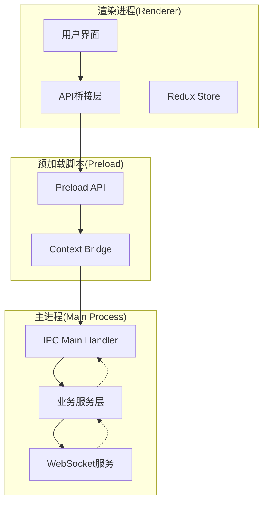
```mermaid
graph TB
subgraph "渲染进程(Renderer)"
UI[用户界面]
Bridge[API桥接层]
Store[Redux Store]
end
subgraph "预加载脚本(Preload)"
PreloadAPI[Preload API]
ContextBridge[Context Bridge]
end
subgraph "主进程(Main Process)"
IPCMain[IPC Main Handler]
Services[业务服务层]
WebSocket[WebSocket服务]
end
UI --> Bridge
Bridge --> PreloadAPI
PreloadAPI --> ContextBridge
ContextBridge --> IPCMain
IPCMain --> Services
Services --> WebSocket
Services -.-> IPCMain
WebSocket -.-> Services
```

**架构图来源**
- [src/main/ipc.ts](file://src/main/ipc.ts#L115-L1083)
- [src/preload/index.ts](file://src/preload/index.ts#L578-L593)

### 核心组件关系

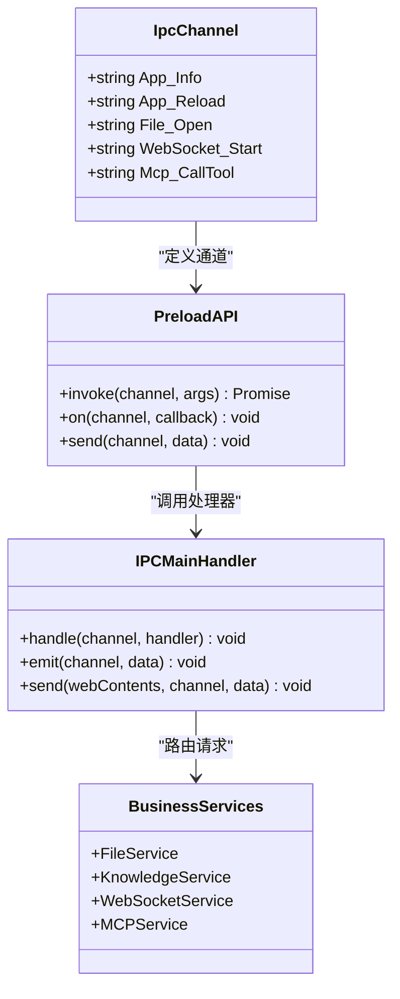
```mermaid
classDiagram
class IpcChannel {
+string App_Info
+string App_Reload
+string File_Open
+string WebSocket_Start
+string Mcp_CallTool
}
class PreloadAPI {
+invoke(channel, args) Promise
+on(channel, callback) void
+send(channel, data) void
}
class IPCMainHandler {
+handle(channel, handler) void
+emit(channel, data) void
+send(webContents, channel, data) void
}
class BusinessServices {
+FileService
+KnowledgeService
+WebSocketService
+MCPService
}
IpcChannel --> PreloadAPI : "定义通道"
PreloadAPI --> IPCMainHandler : "调用处理器"
IPCMainHandler --> BusinessServices : "路由请求"
```

**类图来源**
- [packages/shared/IpcChannel.ts](file://packages/shared/IpcChannel.ts#L1-L379)
- [src/preload/index.ts](file://src/preload/index.ts#L69-L593)

**章节来源**
- [src/main/ipc.ts](file://src/main/ipc.ts#L115-L1083)
- [src/preload/index.ts](file://src/preload/index.ts#L578-L593)

## 核心通信接口

### IPC通道枚举

Cherry Studio定义了丰富的IPC通道常量，涵盖了应用管理、文件操作、知识库、记忆管理、WebSocket通信等多个功能模块。

| 功能分类 | 通道数量 | 主要用途 |
|---------|---------|----------|
| 应用管理 | 40+ | 版本控制、代理设置、主题切换、缓存管理 |
| 文件操作 | 30+ | 文件读写、上传下载、路径管理、备份恢复 |
| 知识库 | 10+ | 知识库创建、搜索、重排、配额检查 |
| 记忆管理 | 10+ | 记忆添加、搜索、列表、删除、配置 |
| WebSocket | 5+ | 连接管理、消息传输、状态查询 |
| MCP服务器 | 15+ | 工具调用、提示获取、资源访问 |
| 实验性功能 | 20+ | 流式传输、追踪、API服务器 |

### 通道命名规范

所有IPC通道遵循统一的命名规范：`功能模块:操作动作`，例如：
- `app:info` - 获取应用信息
- `file:open` - 打开文件
- `knowledge-base:create` - 创建知识库
- `websocket:message` - WebSocket消息传输

**章节来源**
- [packages/shared/IpcChannel.ts](file://packages/shared/IpcChannel.ts#L1-L379)

## 同步与异步消息处理

### 异步消息处理机制

Cherry Studio主要采用异步消息处理模式，通过`ipcMain.handle()`注册处理器函数，支持Promise-based的异步操作。

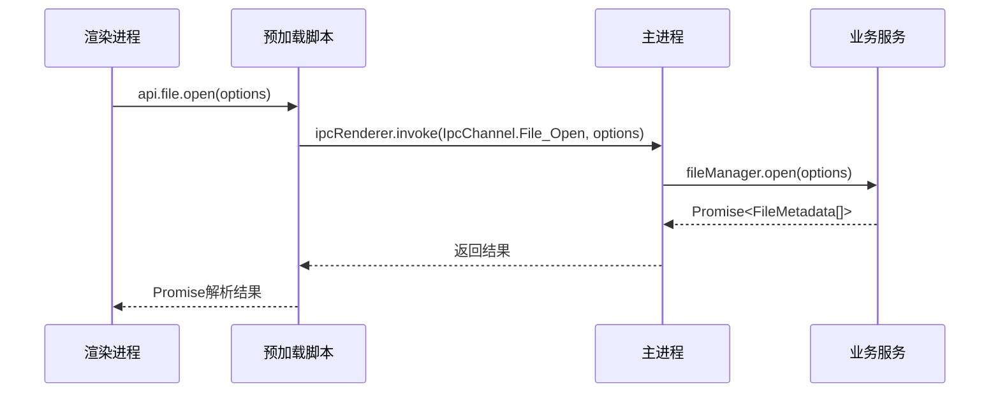
```mermaid
sequenceDiagram
participant Renderer as 渲染进程
participant Preload as 预加载脚本
participant Main as 主进程
participant Service as 业务服务
Renderer->>Preload : api.file.open(options)
Preload->>Main : ipcRenderer.invoke(IpcChannel.File_Open, options)
Main->>Service : fileManager.open(options)
Service-->>Main : Promise<FileMetadata[]>
Main-->>Preload : 返回结果
Preload-->>Renderer : Promise解析结果
```

**序列图来源**
- [src/preload/index.ts](file://src/preload/index.ts#L172-L174)
- [src/main/ipc.ts](file://src/main/ipc.ts#L559-L560)

### 同步消息处理

对于简单的状态查询和配置获取，系统提供同步消息处理：

```typescript
// 同步消息示例
ipcMain.handle(IpcChannel.App_IsFullScreen, (): boolean => {
    return mainWindow.isFullScreen()
})

ipcMain.handle(IpcChannel.Config_Get, (_, key: string) => {
    return configManager.get(key)
})
```

### 错误处理策略

系统实现了完善的错误处理机制：

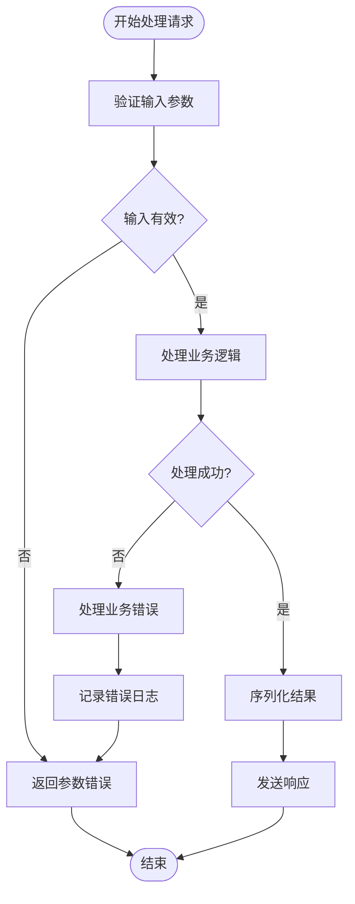
```mermaid
flowchart TD
Start([开始处理请求]) --> ValidateInput["验证输入参数"]
ValidateInput --> InputValid{"输入有效?"}
InputValid --> |否| ReturnError["返回参数错误"]
InputValid --> |是| ProcessRequest["处理业务逻辑"]
ProcessRequest --> ProcessSuccess{"处理成功?"}
ProcessSuccess --> |否| HandleError["处理业务错误"]
ProcessSuccess --> |是| SerializeResult["序列化结果"]
SerializeResult --> SendResponse["发送响应"]
HandleError --> LogError["记录错误日志"]
LogError --> ReturnError
ReturnError --> End([结束])
SendResponse --> End
```

**流程图来源**
- [src/main/ipc.ts](file://src/main/ipc.ts#L104-L113)

**章节来源**
- [src/main/ipc.ts](file://src/main/ipc.ts#L115-L1083)
- [src/preload/index.ts](file://src/preload/index.ts#L69-L593)

## 主进程请求处理机制

### 请求注册与路由

主进程通过`registerIpc`函数统一注册所有IPC处理器：

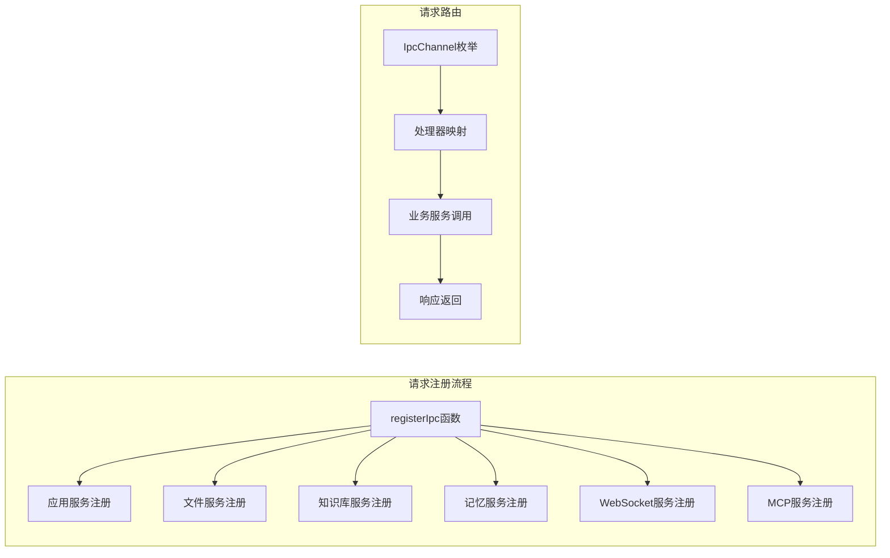
```mermaid
graph LR
subgraph "请求注册流程"
A[registerIpc函数] --> B[应用服务注册]
A --> C[文件服务注册]
A --> D[知识库服务注册]
A --> E[记忆服务注册]
A --> F[WebSocket服务注册]
A --> G[MCP服务注册]
end
subgraph "请求路由"
H[IpcChannel枚举] --> I[处理器映射]
I --> J[业务服务调用]
J --> K[响应返回]
end
```

**图表来源**
- [src/main/ipc.ts](file://src/main/ipc.ts#L115-L1083)

### 事件类型与数据格式

系统支持多种事件类型和数据格式：

| 事件类型 | 数据格式 | 示例用途 |
|---------|---------|----------|
| 单向通知 | `{type: 'notification', data: Notification}` | 通知发送 |
| 双向请求响应 | `{requestId: string, data: any}` | 文件操作 |
| 流式数据 | `{type: 'stream', data: Uint8Array}` | 大文件传输 |
| 状态变更 | `{type: 'state-change', newState: any}` | 窗口状态 |

### 请求生命周期管理

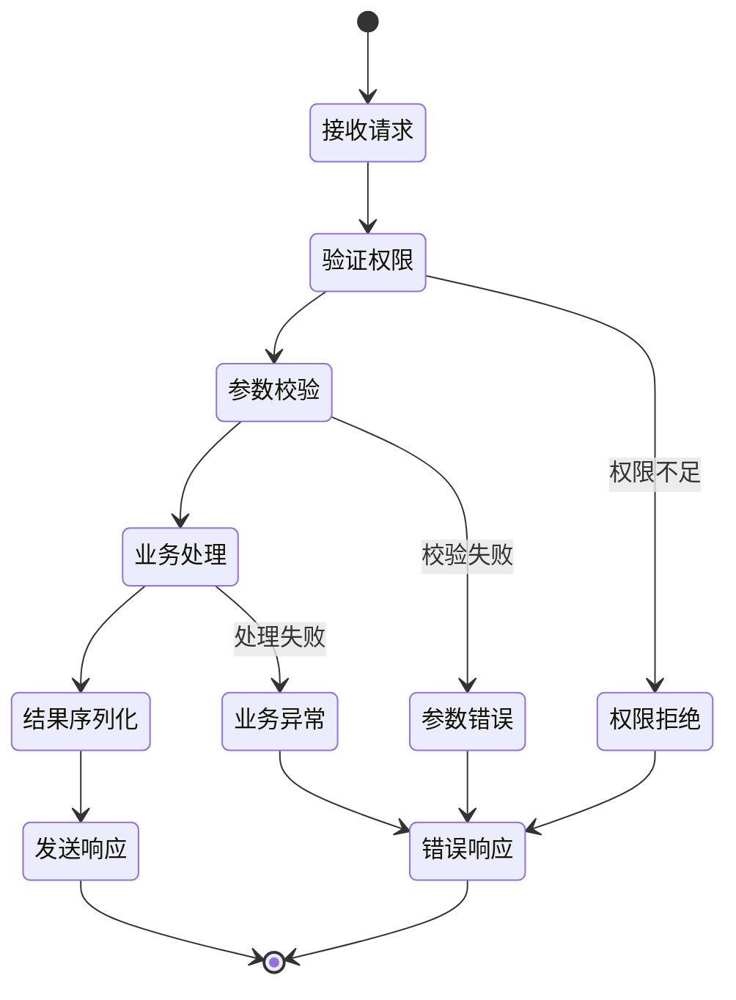
```mermaid
stateDiagram-v2
[*] --> 接收请求
接收请求 --> 验证权限
验证权限 --> 参数校验
参数校验 --> 业务处理
业务处理 --> 结果序列化
结果序列化 --> 发送响应
发送响应 --> [*]
验证权限 --> 权限拒绝 : 权限不足
参数校验 --> 参数错误 : 校验失败
业务处理 --> 业务异常 : 处理失败
权限拒绝 --> 错误响应
参数错误 --> 错误响应
业务异常 --> 错误响应
错误响应 --> [*]
```

**状态图来源**
- [src/main/ipc.ts](file://src/main/ipc.ts#L104-L113)

**章节来源**
- [src/main/ipc.ts](file://src/main/ipc.ts#L115-L1083)

## 安全通信机制

### 输入验证与过滤

系统实现了多层次的安全防护机制：

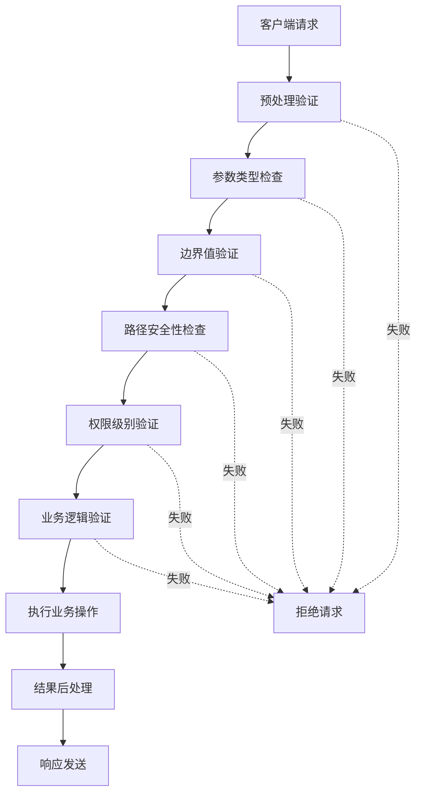
```mermaid
graph TD
A[客户端请求] --> B[预处理验证]
B --> C[参数类型检查]
C --> D[边界值验证]
D --> E[路径安全性检查]
E --> F[权限级别验证]
F --> G[业务逻辑验证]
G --> H[执行业务操作]
H --> I[结果后处理]
I --> J[响应发送]
B -.->|失败| K[拒绝请求]
C -.->|失败| K
D -.->|失败| K
E -.->|失败| K
F -.->|失败| K
G -.->|失败| K
```

**图表来源**
- [src/main/services/agents/services/claudecode/tool-permissions.ts](file://src/main/services/agents/services/claudecode/tool-permissions.ts#L73-L82)

### 权限检查机制

针对敏感操作，系统实施严格的权限检查：

```typescript
// 路径安全性检查示例
ipcMain.handle(IpcChannel.App_IsPathInside, async (_, childPath: string, parentPath: string) => {
    return isPathInside(childPath, parentPath)
})

// 写入权限检查
ipcMain.handle(IpcChannel.App_HasWritePermission, async (_, filePath: string) => {
    const hasPermission = await hasWritePermission(filePath)
    return hasPermission
})
```

### 防注入攻击措施

系统采用多种技术防止注入攻击：

1. **输入序列化**：使用安全的序列化机制
2. **路径规范化**：确保文件路径的安全性
3. **参数白名单**：限制可接受的参数类型
4. **上下文隔离**：渲染进程与主进程严格分离

### 加密通信支持

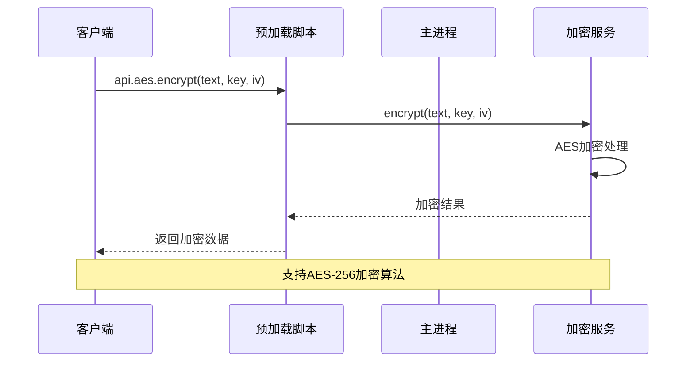
```mermaid
sequenceDiagram
participant Client as 客户端
participant Preload as 预加载脚本
participant Main as 主进程
participant Crypto as 加密服务
Client->>Preload : api.aes.encrypt(text, key, iv)
Preload->>Crypto : encrypt(text, key, iv)
Crypto->>Crypto : AES加密处理
Crypto-->>Preload : 加密结果
Preload-->>Client : 返回加密数据
Note over Client,Crypto : 支持AES-256加密算法
```

**序列图来源**
- [src/preload/index.ts](file://src/preload/index.ts#L342-L347)

**章节来源**
- [src/main/ipc.ts](file://src/main/ipc.ts#L398-L401)
- [src/main/ipc.ts](file://src/main/ipc.ts#L389-L392)
- [src/preload/index.ts](file://src/preload/index.ts#L342-L347)

## 双向通信模式

### 流式数据传输

Cherry Studio支持高效的流式数据传输，特别适用于大文件上传和实时数据流处理：

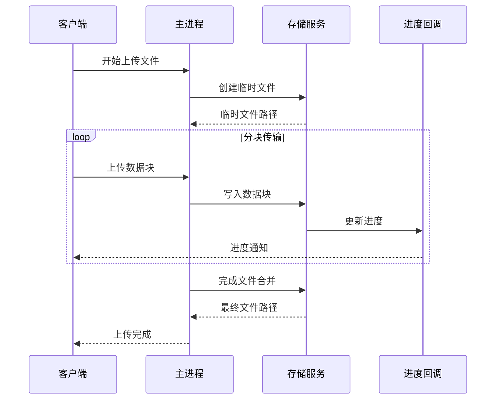
```mermaid
sequenceDiagram
participant Client as 客户端
participant Main as 主进程
participant Storage as 存储服务
participant Progress as 进度回调
Client->>Main : 开始上传文件
Main->>Storage : 创建临时文件
Storage-->>Main : 临时文件路径
loop 分块传输
Client->>Main : 上传数据块
Main->>Storage : 写入数据块
Storage->>Progress : 更新进度
Progress-->>Client : 进度通知
end
Main->>Storage : 完成文件合并
Storage-->>Main : 最终文件路径
Main-->>Client : 上传完成
```

**序列图来源**
- [src/main/ipc.ts](file://src/main/ipc.ts#L784-L799)

### 长连接会话管理

WebSocket服务提供了持久的双向通信连接：

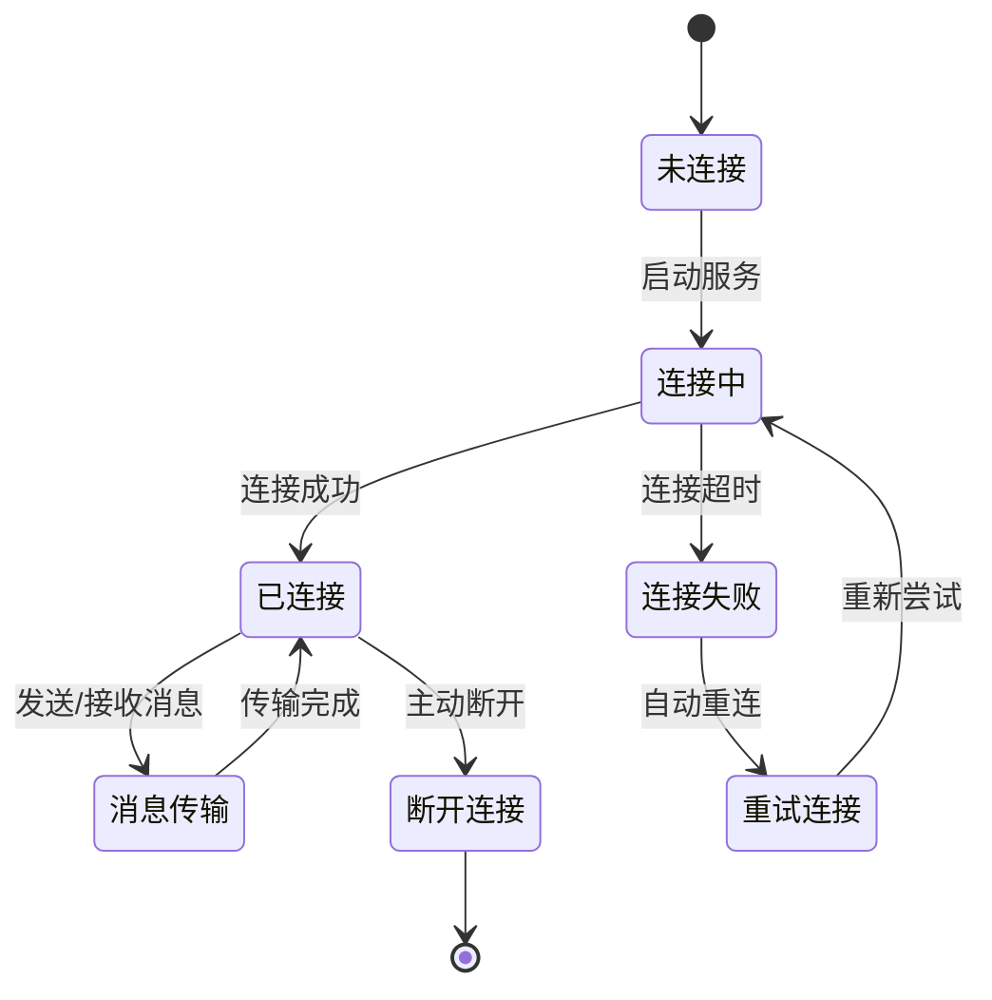
```mermaid
stateDiagram-v2
[*] --> 未连接
未连接 --> 连接中 : 启动服务
连接中 --> 已连接 : 连接成功
连接中 --> 连接失败 : 连接超时
已连接 --> 消息传输 : 发送/接收消息
消息传输 --> 已连接 : 传输完成
已连接 --> 断开连接 : 主动断开
连接失败 --> 重试连接 : 自动重连
重试连接 --> 连接中 : 重新尝试
断开连接 --> [*]
```

**状态图来源**
- [src/main/services/WebSocketService.ts](file://src/main/services/WebSocketService.ts#L84-L200)

### 实时事件广播

系统支持实时事件广播机制：

```typescript
// 实时事件广播示例
ipcMain.handle(IpcChannel.StoreSync_BroadcastSync, (event, action) => {
    // 广播到所有窗口
    BrowserWindow.getAllWindows().forEach(window => {
        window.webContents.send('redux-action', action)
    })
})
```

**章节来源**
- [src/main/services/WebSocketService.ts](file://src/main/services/WebSocketService.ts#L84-L200)
- [src/renderer/src/services/StoreSyncService.ts](file://src/renderer/src/services/StoreSyncService.ts#L43-L97)

## 典型IPC调用序列

### 文件打开操作流程

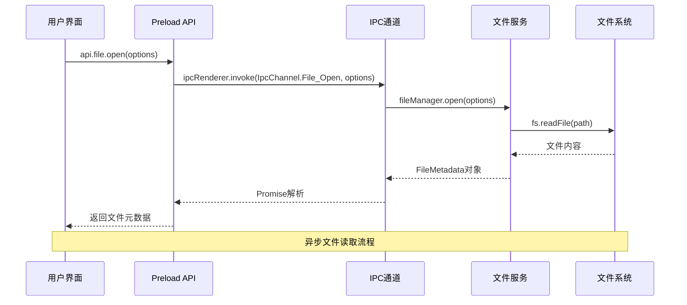
```mermaid
sequenceDiagram
participant UI as 用户界面
participant API as Preload API
participant IPC as IPC通道
participant Service as 文件服务
participant FS as 文件系统
UI->>API : api.file.open(options)
API->>IPC : ipcRenderer.invoke(IpcChannel.File_Open, options)
IPC->>Service : fileManager.open(options)
Service->>FS : fs.readFile(path)
FS-->>Service : 文件内容
Service-->>IPC : FileMetadata对象
IPC-->>API : Promise解析
API-->>UI : 返回文件元数据
Note over UI,FS : 异步文件读取流程
```

**序列图来源**
- [src/preload/index.ts](file://src/preload/index.ts#L172-L174)
- [src/main/ipc.ts](file://src/main/ipc.ts#L559-L560)

### 知识库搜索流程

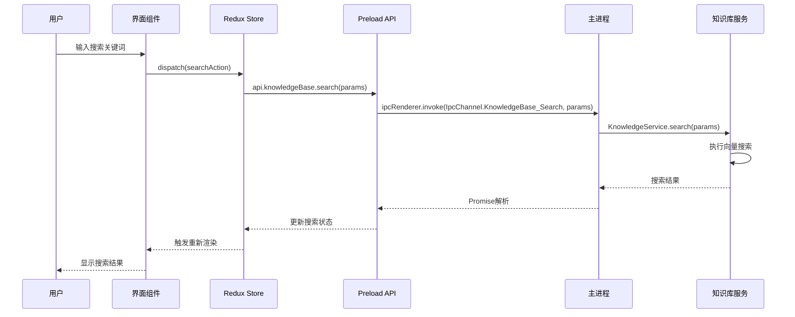
```mermaid
sequenceDiagram
participant User as 用户
participant UI as 界面组件
participant Store as Redux Store
participant API as Preload API
participant Main as 主进程
participant KB as 知识库服务
User->>UI : 输入搜索关键词
UI->>Store : dispatch(searchAction)
Store->>API : api.knowledgeBase.search(params)
API->>Main : ipcRenderer.invoke(IpcChannel.KnowledgeBase_Search, params)
Main->>KB : KnowledgeService.search(params)
KB->>KB : 执行向量搜索
KB-->>Main : 搜索结果
Main-->>API : Promise解析
API-->>Store : 更新搜索状态
Store-->>UI : 触发重新渲染
UI-->>User : 显示搜索结果
```

**序列图来源**
- [src/preload/index.ts](file://src/preload/index.ts#L269-L270)
- [src/main/ipc.ts](file://src/main/ipc.ts#L648-L649)

### WebSocket消息传输流程

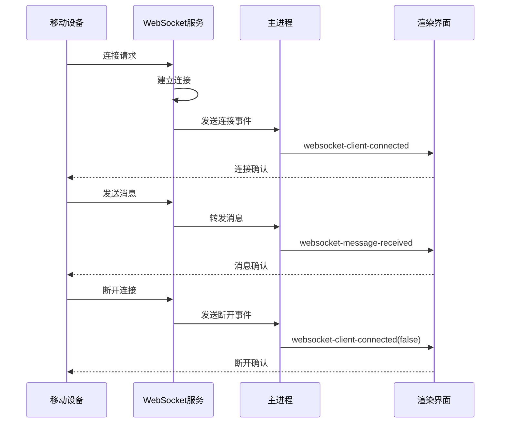
```mermaid
sequenceDiagram
participant Mobile as 移动设备
participant WS as WebSocket服务
participant Main as 主进程
participant UI as 渲染界面
Mobile->>WS : 连接请求
WS->>WS : 建立连接
WS->>Main : 发送连接事件
Main->>UI : websocket-client-connected
UI-->>Mobile : 连接确认
Mobile->>WS : 发送消息
WS->>Main : 转发消息
Main->>UI : websocket-message-received
UI-->>Mobile : 消息确认
Mobile->>WS : 断开连接
WS->>Main : 发送断开事件
Main->>UI : websocket-client-connected(false)
UI-->>Mobile : 断开确认
```

**序列图来源**
- [src/main/services/WebSocketService.ts](file://src/main/services/WebSocketService.ts#L101-L131)

**章节来源**
- [src/preload/index.ts](file://src/preload/index.ts#L172-L174)
- [src/main/ipc.ts](file://src/main/ipc.ts#L559-L560)
- [src/main/services/WebSocketService.ts](file://src/main/services/WebSocketService.ts#L84-L200)

## 性能优化策略

### 消息批处理机制

系统实现了智能的消息批处理机制，减少IPC调用频率：

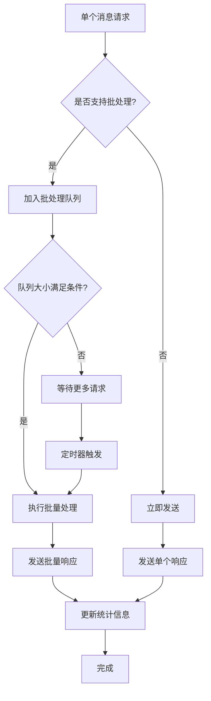
```mermaid
flowchart TD
A[单个消息请求] --> B{是否支持批处理?}
B --> |是| C[加入批处理队列]
B --> |否| D[立即发送]
C --> E{队列大小满足条件?}
E --> |是| F[执行批量处理]
E --> |否| G[等待更多请求]
F --> H[发送批量响应]
D --> I[发送单个响应]
G --> J[定时器触发]
J --> F
H --> K[更新统计信息]
I --> K
K --> L[完成]
```

**流程图来源**
- [src/renderer/src/services/db/AgentMessageDataSource.ts](file://src/renderer/src/services/db/AgentMessageDataSource.ts#L81-L137)

### 序列化优化

系统采用高效的序列化策略：

```typescript
// 安全序列化优化示例
export function safeSerialize(
  value: unknown,
  options: {
    onError?: 'error' | 'omit' | 'serialize'
    pretty?: boolean
  } = {}
): string | null {
  const { onError = 'serialize', pretty = true } = options
  
  // 1. 快速路径：可序列化值直接处理
  if (isSerializable(value)) {
    try {
      return JSON.stringify(value, null, pretty ? 2 : undefined)
    } catch (err) {
      if (onError === 'error') {
        throw new Error(`Failed to stringify serializable value: ${err}`)
      }
      return null
    }
  }
  
  // 2. 宽容模式：尝试安全转换
  return tryLenientSerialize(value, pretty ? 2 : undefined)
}
```

### 内存管理策略

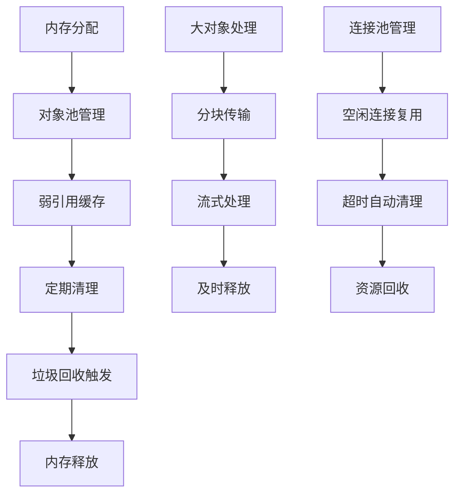
```mermaid
graph TD
A[内存分配] --> B[对象池管理]
B --> C[弱引用缓存]
C --> D[定期清理]
D --> E[垃圾回收触发]
E --> F[内存释放]
G[大对象处理] --> H[分块传输]
H --> I[流式处理]
I --> J[及时释放]
K[连接池管理] --> L[空闲连接复用]
L --> M[超时自动清理]
M --> N[资源回收]
```

**图表来源**
- [src/renderer/src/utils/serialize.ts](file://src/renderer/src/utils/serialize.ts#L1-L94)

### 缓存机制

系统实现了多层缓存机制提升性能：

```typescript
// 缓存装饰器示例
function withCache<T extends unknown[], R>(
  fn: (...args: T) => Promise<R>,
  getCacheKey: (...args: T) => string,
  ttl: number,
  logPrefix: string
): CachedFunction<T, R> {
  return async (...args: T): Promise<R> => {
    const cacheKey = getCacheKey(...args)
    
    if (CacheService.has(cacheKey)) {
      logger.debug(`${logPrefix} loaded from cache`, { cacheKey })
      const cachedData = CacheService.get<R>(cacheKey)
      if (cachedData) {
        return cachedData
      }
    }
    
    // 执行原始函数并缓存结果
    const result = await fn(...args)
    CacheService.set(cacheKey, result, ttl)
    return result
  }
}
```

**章节来源**
- [src/renderer/src/utils/serialize.ts](file://src/renderer/src/utils/serialize.ts#L1-L94)
- [src/main/services/MCPService.ts](file://src/main/services/MCPService.ts#L103-L126)

## 监控与调试

### 通信追踪系统

Cherry Studio集成了完整的通信追踪系统，支持分布式追踪：

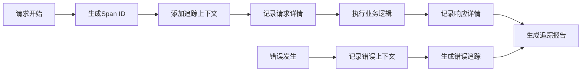
```mermaid
graph LR
A[请求开始] --> B[生成Span ID]
B --> C[添加追踪上下文]
C --> D[记录请求详情]
D --> E[执行业务逻辑]
E --> F[记录响应详情]
F --> G[生成追踪报告]
H[错误发生] --> I[记录错误上下文]
I --> J[生成错误追踪]
J --> G
```

**图表来源**
- [src/main/services/NodeTraceService.ts](file://src/main/services/NodeTraceService.ts#L33-L46)

### 日志记录机制

系统实现了结构化的日志记录：

```typescript
// 日志记录示例
const logger = loggerService.withContext('IPC')

// 请求开始
logger.info('Handling IPC request', {
  channel: IpcChannel.File_Open,
  params: options,
  timestamp: Date.now()
})

// 请求完成
logger.debug('IPC request completed', {
  channel: IpcChannel.File_Open,
  duration: Date.now() - startTime,
  result: result
})

// 错误处理
logger.error('IPC request failed', {
  channel: IpcChannel.File_Open,
  error: error instanceof Error ? error.message : String(error),
  stack: error instanceof Error ? error.stack : undefined
})
```

### 性能指标监控

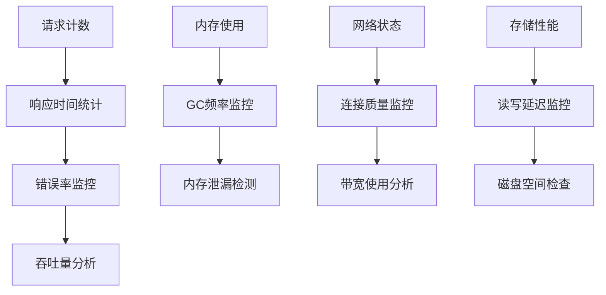
```mermaid
graph TD
A[请求计数] --> B[响应时间统计]
B --> C[错误率监控]
C --> D[吞吐量分析]
E[内存使用] --> F[GC频率监控]
F --> G[内存泄漏检测]
H[网络状态] --> I[连接质量监控]
I --> J[带宽使用分析]
K[存储性能] --> L[读写延迟监控]
L --> M[磁盘空间检查]
```

### 调试工具集成

系统提供了丰富的调试工具：

1. **开发者工具集成**：支持Electron开发者工具
2. **实时日志查看**：可实时查看IPC通信日志
3. **性能分析器**：监控IPC调用性能
4. **断点调试**：支持断点调试IPC流程

**章节来源**
- [src/main/services/NodeTraceService.ts](file://src/main/services/NodeTraceService.ts#L33-L46)
- [src/main/ipc.ts](file://src/main/ipc.ts#L900-L913)

## 故障诊断

### 常见通信故障

| 故障类型 | 症状表现 | 可能原因 | 解决方案 |
|---------|---------|---------|----------|
| 连接超时 | 请求无响应 | 网络问题、服务未启动 | 检查网络连接、重启服务 |
| 序列化错误 | 数据损坏 | 对象包含循环引用 | 使用安全序列化方法 |
| 权限拒绝 | 操作被阻止 | 权限不足、路径不安全 | 检查权限设置、验证路径 |
| 内存泄漏 | 内存持续增长 | 未正确释放资源 | 检查资源释放逻辑 |
| 死锁 | 程序卡死 | 循环依赖、竞态条件 | 重构代码逻辑 |

### 故障诊断流程

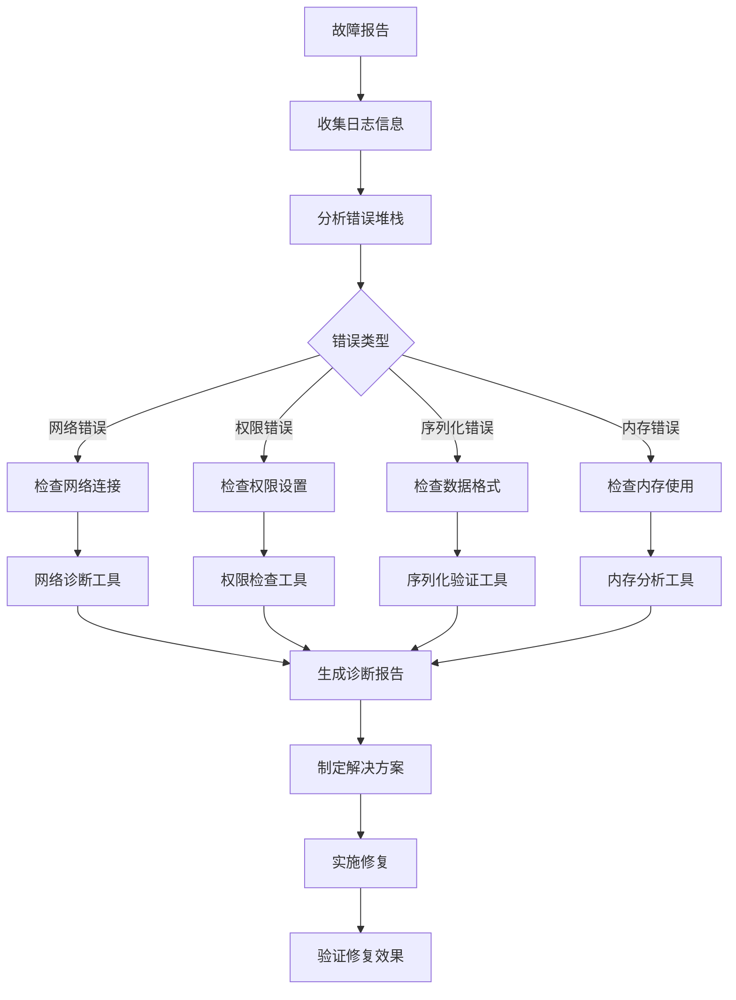
```mermaid
flowchart TD
A[故障报告] --> B[收集日志信息]
B --> C[分析错误堆栈]
C --> D{错误类型}
D --> |网络错误| E[检查网络连接]
D --> |权限错误| F[检查权限设置]
D --> |序列化错误| G[检查数据格式]
D --> |内存错误| H[检查内存使用]
E --> I[网络诊断工具]
F --> J[权限检查工具]
G --> K[序列化验证工具]
H --> L[内存分析工具]
I --> M[生成诊断报告]
J --> M
K --> M
L --> M
M --> N[制定解决方案]
N --> O[实施修复]
O --> P[验证修复效果]
```

### 自动故障恢复

系统实现了自动故障恢复机制：

```typescript
// 自动重试机制示例
async function robustInvoke(channel: string, ...args: any[]): Promise<any> {
  const maxRetries = 3
  const delayMs = 1000
  
  for (let i = 0; i < maxRetries; i++) {
    try {
      return await ipcRenderer.invoke(channel, ...args)
    } catch (error) {
      if (i === maxRetries - 1) throw error
      
      logger.warn('IPC invocation failed, retrying...', {
        channel,
        attempt: i + 1,
        error: error instanceof Error ? error.message : String(error)
      })
      
      await new Promise(resolve => setTimeout(resolve, delayMs * Math.pow(2, i)))
    }
  }
}
```

### 监控告警系统

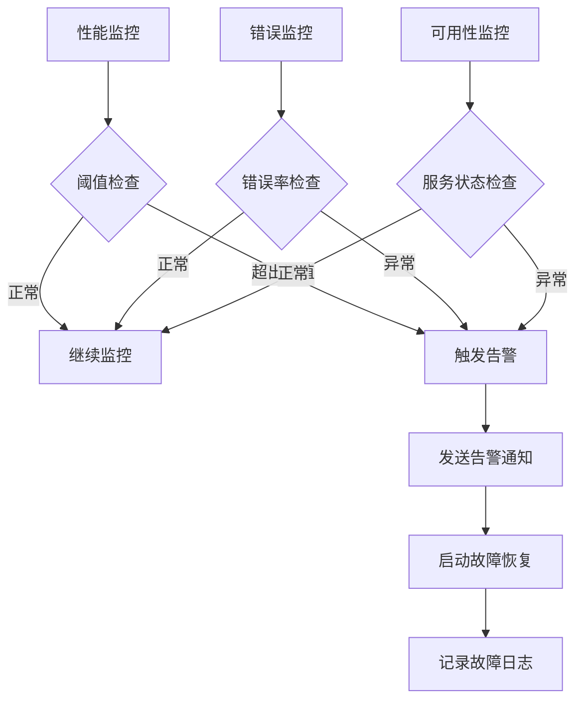
```mermaid
graph TD
A[性能监控] --> B{阈值检查}
B --> |正常| C[继续监控]
B --> |超出阈值| D[触发告警]
E[错误监控] --> F{错误率检查}
F --> |正常| C
F --> |异常| D
G[可用性监控] --> H{服务状态检查}
H --> |正常| C
H --> |异常| D
D --> I[发送告警通知]
I --> J[启动故障恢复]
J --> K[记录故障日志]
```

**章节来源**
- [src/main/ipc.ts](file://src/main/ipc.ts#L900-L913)
- [src/main/services/MCPService.ts](file://src/main/services/MCPService.ts#L592-L612)

## 最佳实践

### 设计原则

1. **单一职责**：每个IPC通道只负责特定功能
2. **幂等性**：确保重复操作的一致性
3. **错误隔离**：避免单个请求影响整体系统
4. **性能优先**：优化高频操作的性能
5. **安全第一**：始终进行输入验证和权限检查

### 代码组织建议

```typescript
// 推荐的IPC处理器组织方式
class FileService {
  static registerIpcHandlers() {
    ipcMain.handle(IpcChannel.File_Open, this.handleOpen.bind(this))
    ipcMain.handle(IpcChannel.File_Save, this.handleSave.bind(this))
    // ... 其他处理器
  }
  
  private static async handleOpen(options: OpenDialogOptions): Promise<FileMetadata[]> {
    // 实现具体的业务逻辑
  }
  
  private static async handleSave(path: string, content: string): Promise<void> {
    // 实现具体的业务逻辑
  }
}
```

### 性能优化建议

1. **合理使用批处理**：对频繁的小请求进行批处理
2. **缓存常用数据**：对计算密集型操作进行结果缓存
3. **流式处理大文件**：避免一次性加载大文件到内存
4. **及时释放资源**：确保不再使用的资源被及时释放
5. **监控关键指标**：定期检查IPC性能指标

### 安全最佳实践

1. **输入验证**：对所有输入参数进行严格验证
2. **权限检查**：在执行敏感操作前进行权限验证
3. **路径安全**：确保文件路径的安全性
4. **数据加密**：对敏感数据进行加密传输
5. **审计日志**：记录所有重要操作的审计日志

### 调试和测试

1. **单元测试**：为每个IPC处理器编写单元测试
2. **集成测试**：测试完整的IPC调用流程
3. **性能测试**：测试高并发场景下的性能表现
4. **错误测试**：模拟各种错误情况的处理
5. **安全测试**：测试各种安全漏洞的防护能力

通过遵循这些最佳实践，可以构建出高性能、安全可靠的IPC通信系统，为Cherry Studio的复杂AI应用提供坚实的通信基础。