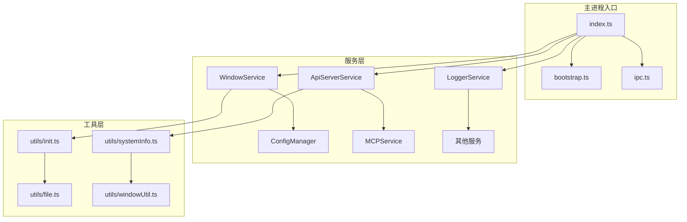
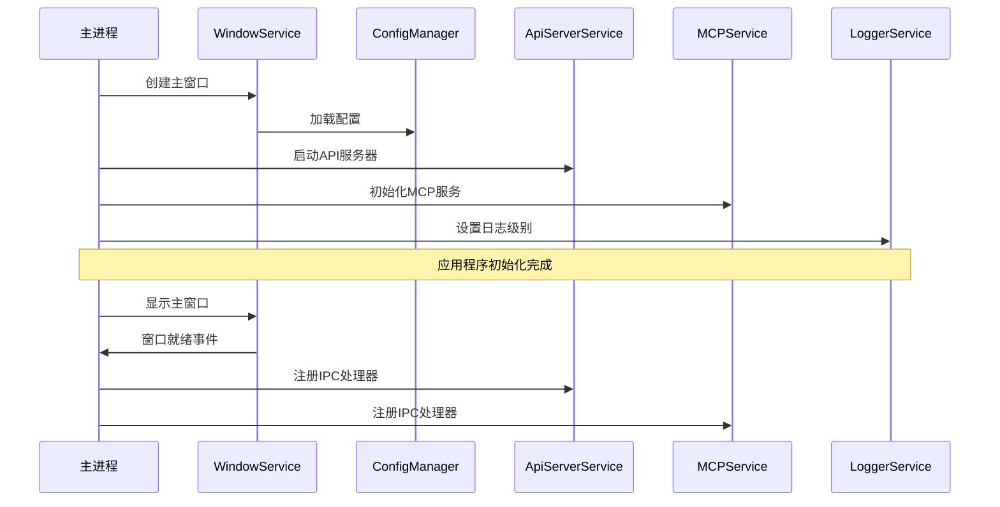
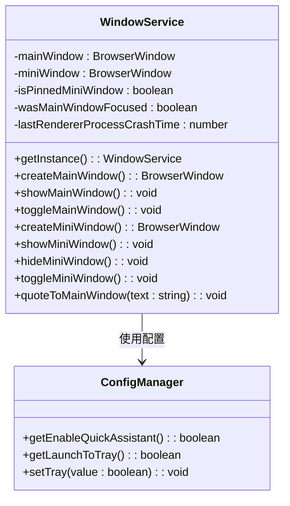
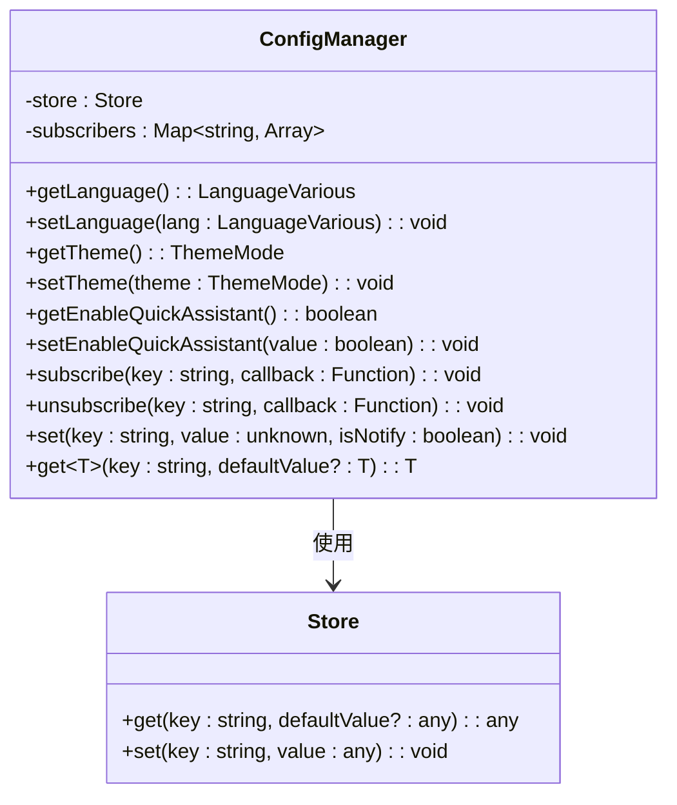
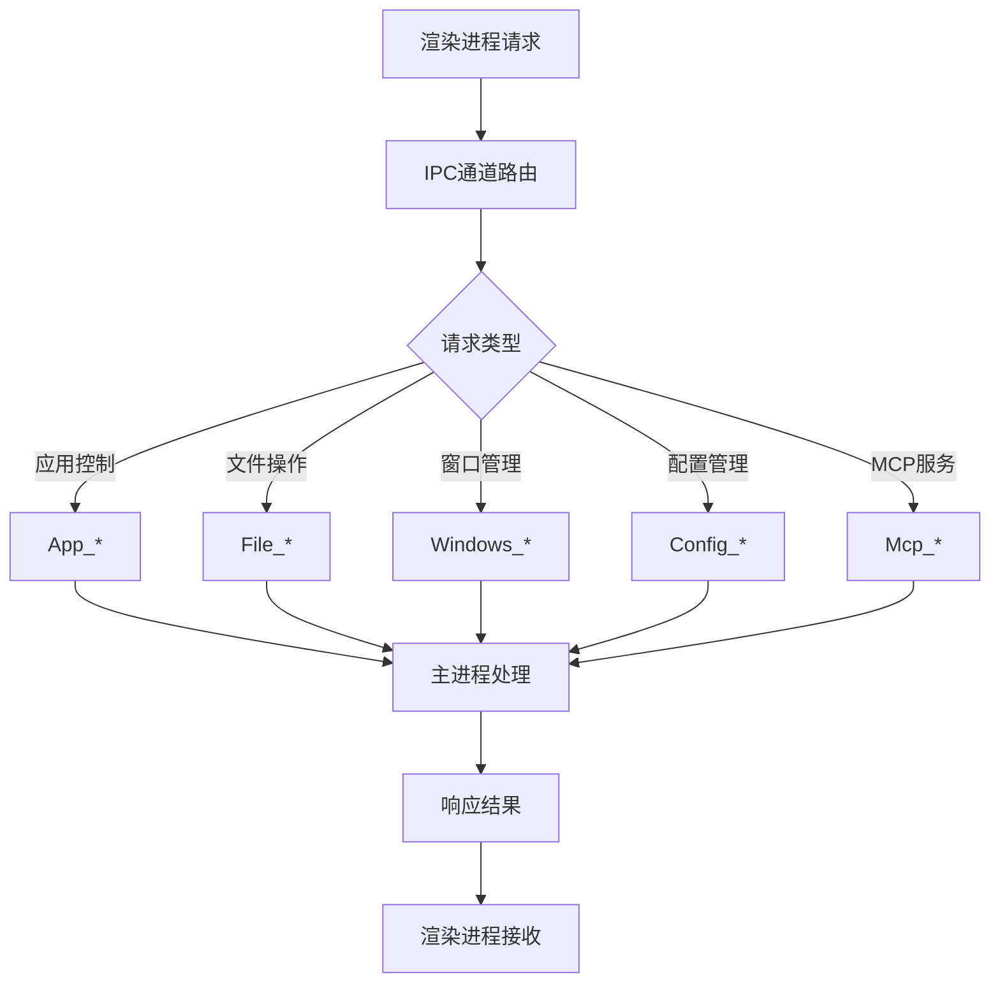
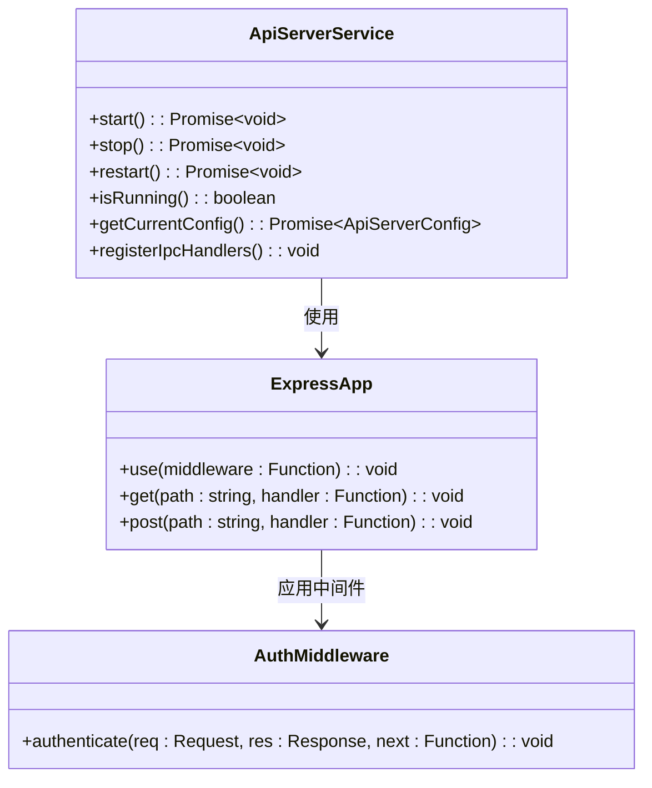
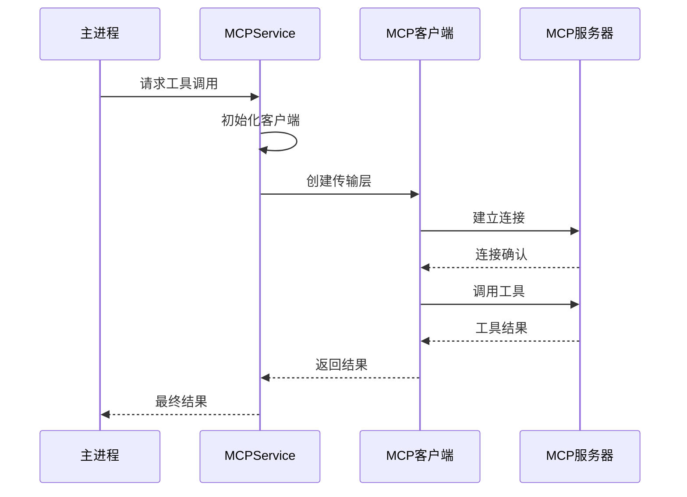
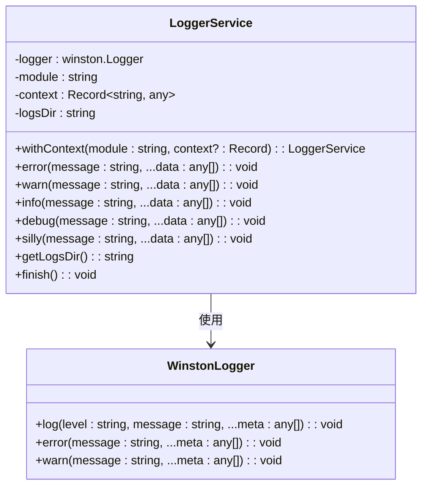
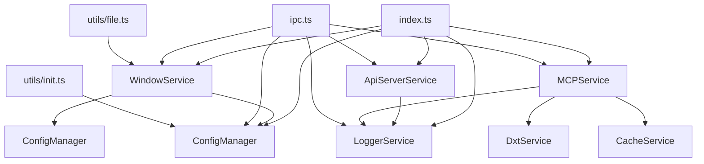

# 主进程

<cite>
**本文档引用的文件**
- [src/main/index.ts](file://src/main/index.ts)
- [src/main/bootstrap.ts](file://src/main/bootstrap.ts)
- [src/main/ipc.ts](file://src/main/ipc.ts)
- [src/main/services/WindowService.ts](file://src/main/services/WindowService.ts)
- [src/main/services/ConfigManager.ts](file://src/main/services/ConfigManager.ts)
- [src/main/services/ApiServerService.ts](file://src/main/services/ApiServerService.ts)
- [src/main/services/MCPService.ts](file://src/main/services/MCPService.ts)
- [src/main/services/LoggerService.ts](file://src/main/services/LoggerService.ts)
- [src/main/constant.ts](file://src/main/constant.ts)
- [src/main/utils/init.ts](file://src/main/utils/init.ts)
- [src/main/apiServer/app.ts](file://src/main/apiServer/app.ts)
</cite>

## 目录
1. [简介](#简介)
2. [项目结构](#项目结构)
3. [核心组件](#核心组件)
4. [架构概览](#架构概览)
5. [详细组件分析](#详细组件分析)
6. [依赖关系分析](#依赖关系分析)
7. [性能考虑](#性能考虑)
8. [故障排除指南](#故障排除指南)
9. [结论](#结论)

## 简介

Cherry Studio主进程是基于Electron框架构建的桌面应用程序的核心部分，负责管理应用程序生命周期、窗口创建与控制、系统资源访问和原生功能集成。主进程作为应用程序的中央协调器，提供了完整的IPC通信机制，确保渲染进程与系统之间的安全交互。

主进程采用了模块化设计，通过多个专门的服务类实现不同功能域的职责分离，包括窗口管理、配置管理、API服务器、MCP服务和日志记录等核心功能。

## 项目结构

Cherry Studio主进程采用分层架构，主要组织结构如下：

**图表来源**
- [src/main/index.ts](file://src/main/index.ts#L1-L257)
- [src/main/bootstrap.ts](file://src/main/bootstrap.ts#L1-L34)

**章节来源**
- [src/main/index.ts](file://src/main/index.ts#L1-L257)
- [src/main/bootstrap.ts](file://src/main/bootstrap.ts#L1-L34)

## 核心组件

### 应用程序入口点

主进程的入口点位于`index.ts`，负责应用程序的完整初始化流程：

- **应用数据目录初始化**：通过`bootstrap.ts`确保应用数据目录的正确设置
- **单实例检查**：防止多个应用程序实例同时运行
- **硬件加速控制**：根据配置动态启用或禁用硬件加速
- **协议客户端注册**：处理自定义协议URL的解析和处理

### 窗口管理系统

`WindowService`是主进程的核心组件之一，负责所有窗口的生命周期管理：

- **主窗口创建**：管理主应用程序窗口的创建、显示和隐藏
- **迷你窗口管理**：提供快速助手功能的浮动窗口
- **窗口状态持久化**：保存和恢复窗口位置、大小等状态信息
- **跨平台窗口特性**：针对不同操作系统优化窗口行为

### 配置管理系统

`ConfigManager`提供全局配置的持久化存储和读取功能：

- **配置项管理**：统一管理应用程序的各种配置选项
- **订阅通知机制**：支持配置变更的实时通知
- **类型安全访问**：提供类型安全的配置访问接口
- **默认值处理**：自动处理配置项的默认值

**章节来源**
- [src/main/index.ts](file://src/main/index.ts#L1-L257)
- [src/main/services/WindowService.ts](file://src/main/services/WindowService.ts#L1-L685)
- [src/main/services/ConfigManager.ts](file://src/main/services/ConfigManager.ts#L1-L270)

## 架构概览

Cherry Studio主进程采用事件驱动的架构模式，通过IPC通道实现进程间通信：

**图表来源**
- [src/main/index.ts](file://src/main/index.ts#L123-L200)
- [src/main/services/WindowService.ts](file://src/main/services/WindowService.ts#L43-L105)

## 详细组件分析

### WindowService - 窗口服务

`WindowService`是主进程的核心服务，负责所有窗口的生命周期管理：

**图表来源**
- [src/main/services/WindowService.ts](file://src/main/services/WindowService.ts#L26-L685)
- [src/main/services/ConfigManager.ts](file://src/main/services/ConfigManager.ts#L37-L270)

#### 窗口创建流程

主窗口的创建遵循严格的初始化顺序：

1. **状态检查**：验证现有窗口状态
2. **窗口状态加载**：从持久化存储恢复窗口位置和大小
3. **窗口配置**：设置窗口属性、WebPreferences和事件监听器
4. **内容加载**：根据环境加载开发或生产版本内容
5. **事件绑定**：注册窗口生命周期事件处理器

#### 渲染进程崩溃处理

主进程实现了智能的渲染进程崩溃恢复机制：

- **崩溃检测**：监控渲染进程的异常终止
- **时间窗口检查**：区分偶发性崩溃和连续崩溃
- **自动重启**：对于偶发性崩溃自动重启渲染进程
- **应用退出**：对于连续崩溃强制退出应用以避免无限循环

**章节来源**
- [src/main/services/WindowService.ts](file://src/main/services/WindowService.ts#L43-L685)

### ConfigManager - 配置管理器

`ConfigManager`提供类型安全的配置管理功能：

**图表来源**
- [src/main/services/ConfigManager.ts](file://src/main/services/ConfigManager.ts#L37-L270)

#### 配置订阅机制

配置管理器实现了观察者模式，支持配置变更的实时通知：

- **订阅注册**：组件可以订阅特定配置项的变更
- **批量通知**：配置变更时批量通知所有订阅者
- **类型安全**：提供类型化的回调函数接口
- **内存管理**：支持取消订阅以避免内存泄漏

**章节来源**
- [src/main/services/ConfigManager.ts](file://src/main/services/ConfigManager.ts#L37-L270)

### IPC通信机制

主进程通过`ipc.ts`文件定义了完整的IPC通信机制：

**图表来源**
- [src/main/ipc.ts](file://src/main/ipc.ts#L115-L800)

#### 安全的IPC处理

主进程实现了多层安全防护机制：

- **参数验证**：严格验证所有IPC调用的输入参数
- **权限检查**：根据用户权限限制敏感操作
- **错误处理**：完善的错误捕获和处理机制
- **资源保护**：防止恶意请求导致的资源耗尽

**章节来源**
- [src/main/ipc.ts](file://src/main/ipc.ts#L115-L800)

### ApiServerService - API服务器服务

`ApiServerService`管理内置的REST API服务器：

**图表来源**
- [src/main/services/ApiServerService.ts](file://src/main/services/ApiServerService.ts#L16-L115)
- [src/main/apiServer/app.ts](file://src/main/apiServer/app.ts#L1-L149)

#### API服务器功能

API服务器提供以下核心功能：

- **聊天接口**：支持多种AI模型的对话功能
- **MCP集成**：与模型上下文协议的集成
- **消息管理**：消息的增删改查操作
- **模型管理**：AI模型的配置和管理
- **代理认证**：支持代理服务器的身份验证

**章节来源**
- [src/main/services/ApiServerService.ts](file://src/main/services/ApiServerService.ts#L16-L115)
- [src/main/apiServer/app.ts](file://src/main/apiServer/app.ts#L1-L149)

### MCPService - MCP服务

`MCPService`管理模型上下文协议的客户端连接：

**图表来源**
- [src/main/services/MCPService.ts](file://src/main/services/MCPService.ts#L136-L923)

#### MCP服务特性

- **多传输协议支持**：支持STDIO、HTTP、SSE等多种传输方式
- **身份验证**：内置OAuth2.0身份验证支持
- **缓存机制**：智能缓存工具列表和资源数据
- **超时管理**：灵活的超时和重试机制
- **进度跟踪**：长时间运行任务的进度监控

**章节来源**
- [src/main/services/MCPService.ts](file://src/main/services/MCPService.ts#L136-L923)

### LoggerService - 日志服务

`LoggerService`提供结构化的日志记录功能：

**图表来源**
- [src/main/services/LoggerService.ts](file://src/main/services/LoggerService.ts#L51-L392)

#### 日志系统特性

- **多级日志**：支持ERROR、WARN、INFO、DEBUG、VERBOSE、SILLY六个级别
- **结构化输出**：JSON格式的日志输出便于分析
- **文件轮转**：自动按日期轮转日志文件
- **上下文追踪**：为每个日志条目添加模块和上下文信息
- **性能监控**：记录API请求的响应时间和状态

**章节来源**
- [src/main/services/LoggerService.ts](file://src/main/services/LoggerService.ts#L51-L392)

## 依赖关系分析

主进程的组件之间存在复杂的依赖关系：

**图表来源**
- [src/main/index.ts](file://src/main/index.ts#L17-L37)
- [src/main/ipc.ts](file://src/main/ipc.ts#L115-L120)

### 关键服务协作模式

主进程中的关键服务通过以下模式协作：

1. **单例模式**：每个服务类都采用单例模式确保全局唯一性
2. **依赖注入**：通过构造函数注入必要的依赖
3. **事件驱动**：服务间通过事件进行松耦合通信
4. **工厂模式**：复杂对象的创建通过工厂方法管理

**章节来源**
- [src/main/index.ts](file://src/main/index.ts#L17-L37)

## 性能考虑

### 内存管理

主进程实现了多项内存优化策略：

- **懒加载**：非关键服务按需加载
- **对象池**：复用频繁创建的对象
- **垃圾回收**：及时释放不再使用的资源
- **内存监控**：定期检查内存使用情况

### 启动性能优化

- **并行初始化**：多个服务可以并行启动
- **异步操作**：避免阻塞主线程的操作
- **预加载**：关键资源的提前加载
- **缓存策略**：重要数据的本地缓存

### 网络性能

- **连接池**：HTTP连接的复用
- **请求限流**：防止网络资源耗尽
- **超时控制**：合理的请求超时设置
- **重试机制**：失败请求的自动重试

## 故障排除指南

### 常见问题及解决方案

#### 应用启动失败

**症状**：应用程序无法正常启动
**可能原因**：
- 配置文件损坏
- 端口被占用
- 权限不足

**解决步骤**：
1. 检查配置文件完整性
2. 查看日志文件定位具体错误
3. 以管理员权限重新启动

#### 窗口显示异常

**症状**：窗口无法正常显示或响应
**可能原因**：
- 显示器配置变化
- 窗口状态损坏
- 硬件加速问题

**解决步骤**：
1. 重置窗口状态配置
2. 禁用硬件加速
3. 重启应用程序

#### API服务器连接失败

**症状**：无法连接到内置API服务器
**可能原因**：
- 端口冲突
- 防火墙阻止
- 服务器未启动

**解决步骤**：
1. 检查端口占用情况
2. 配置防火墙规则
3. 重启API服务器

**章节来源**
- [src/main/services/WindowService.ts](file://src/main/services/WindowService.ts#L133-L146)
- [src/main/services/LoggerService.ts](file://src/main/services/LoggerService.ts#L276-L316)

## 结论

Cherry Studio主进程展现了现代Electron应用程序的最佳实践，通过模块化设计、事件驱动架构和完善的错误处理机制，提供了稳定可靠的桌面应用体验。

### 主要优势

1. **架构清晰**：职责分离明确，易于维护和扩展
2. **性能优化**：多层次的性能优化策略
3. **错误处理**：完善的错误捕获和恢复机制
4. **安全性**：多层安全防护措施
5. **可扩展性**：良好的插件化架构

### 未来发展方向

- **微服务架构**：进一步拆分大型服务为独立的微服务
- **容器化部署**：支持Docker等容器化部署方式
- **云原生特性**：增强云端同步和备份功能
- **AI集成**：更深度的人工智能功能集成

主进程的设计充分体现了现代软件工程的最佳实践，为Cherry Studio提供了坚实的技术基础和优秀的用户体验。