# API服务器服务

<cite>
**本文档中引用的文件**  
- [ApiServerService.ts](file://src/main/services/ApiServerService.ts)
- [server.ts](file://src/main/apiServer/server.ts)
- [app.ts](file://src/main/apiServer/app.ts)
- [config.ts](file://src/main/apiServer/config.ts)
- [auth.ts](file://src/main/apiServer/middleware/auth.ts)
- [error.ts](file://src/main/apiServer/middleware/error.ts)
- [chat.ts](file://src/main/apiServer/routes/chat.ts)
- [mcp.ts](file://src/main/apiServer/routes/mcp.ts)
- [chat-completion.ts](file://src/main/apiServer/services/chat-completion.ts)
- [IpcChannel.ts](file://packages/shared/IpcChannel.ts)
- [LoggerService.ts](file://src/main/services/LoggerService.ts)
- [apiServer.ts](file://src/main/apiServer/index.ts)
- [timeouts.ts](file://src/main/apiServer/config/timeouts.ts)
- [types.ts](file://src/renderer/src/types/apiServer.ts)
</cite>

## 目录
1. [简介](#简介)
2. [项目结构](#项目结构)
3. [核心组件](#核心组件)
4. [架构概述](#架构概述)
5. [详细组件分析](#详细组件分析)
6. [依赖分析](#依赖分析)
7. [性能考虑](#性能考虑)
8. [故障排除指南](#故障排除指南)
9. [结论](#结论)

## 简介
Cherry Studio API服务器服务为本地API服务器功能提供核心支持，实现了启动、停止、重启和状态查询等关键方法。该服务通过IPC通信与主进程的其他组件（如配置管理器和日志服务）紧密协作，为客户端提供稳定可靠的API接口。API服务器基于Express框架构建，支持OpenAI兼容的聊天补全、MCP协议服务器管理等功能，并通过JWT认证确保安全性。服务采用模块化设计，具有良好的可扩展性和错误恢复机制。

## 项目结构
API服务器服务的代码组织遵循清晰的分层架构，主要位于`src/main/apiServer`目录下。该结构将配置、中间件、路由、服务和工具分离，便于维护和扩展。

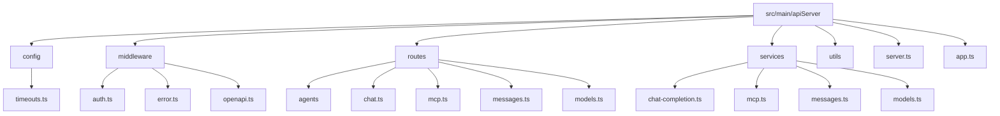

**图表来源**  
- [server.ts](file://src/main/apiServer/server.ts)
- [app.ts](file://src/main/apiServer/app.ts)
- [config.ts](file://src/main/apiServer/config.ts)

**本节来源**  
- [server.ts](file://src/main/apiServer/server.ts)
- [app.ts](file://src/main/apiServer/app.ts)
- [config.ts](file://src/main/apiServer/config.ts)

## 核心组件
API服务器服务的核心组件包括`ApiServerService`、`ApiServer`和`config`管理器。`ApiServerService`作为服务的入口点，负责生命周期管理；`ApiServer`封装了底层HTTP服务器的启动和停止逻辑；`config`管理器则处理API服务器的配置加载和持久化。这些组件通过依赖注入的方式协同工作，确保服务的稳定运行。

**本节来源**  
- [ApiServerService.ts](file://src/main/services/ApiServerService.ts)
- [server.ts](file://src/main/apiServer/server.ts)
- [config.ts](file://src/main/apiServer/config.ts)

## 架构概述
API服务器服务采用分层架构设计，从下到上依次为：HTTP服务器层、应用层、路由层、服务层和数据访问层。这种设计模式确保了各层之间的职责分离，提高了代码的可维护性和可测试性。

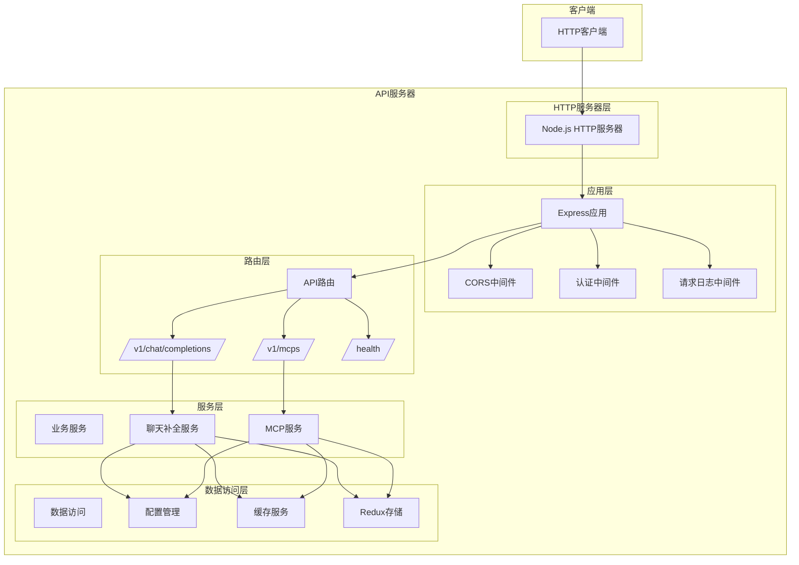

**图表来源**  
- [server.ts](file://src/main/apiServer/server.ts)
- [app.ts](file://src/main/apiServer/app.ts)
- [chat.ts](file://src/main/apiServer/routes/chat.ts)
- [mcp.ts](file://src/main/apiServer/routes/mcp.ts)
- [chat-completion.ts](file://src/main/apiServer/services/chat-completion.ts)
- [config.ts](file://src/main/apiServer/config.ts)

## 详细组件分析

### ApiServerService分析
`ApiServerService`是API服务器服务的主控制器，负责管理服务的生命周期和IPC通信。它通过调用底层`apiServer`实例的方法来实现启动、停止和重启功能，并通过IPC通道向渲染进程暴露这些功能。

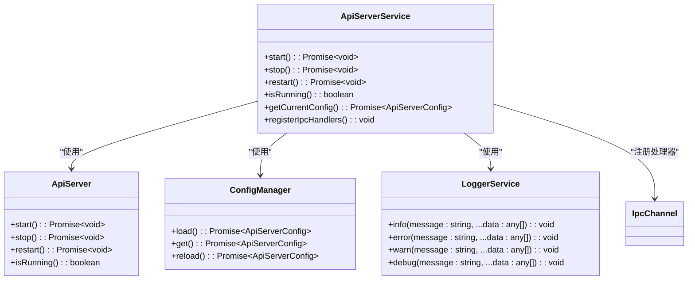

**图表来源**  
- [ApiServerService.ts](file://src/main/services/ApiServerService.ts)
- [server.ts](file://src/main/apiServer/server.ts)
- [config.ts](file://src/main/apiServer/config.ts)
- [LoggerService.ts](file://src/main/services/LoggerService.ts)
- [IpcChannel.ts](file://packages/shared/IpcChannel.ts)

**本节来源**  
- [ApiServerService.ts](file://src/main/services/ApiServerService.ts)

### 服务初始化流程
API服务器服务的初始化流程始于`ApiServerService`的构造函数，随后通过调用`registerIpcHandlers`方法注册IPC处理器，使渲染进程能够控制API服务器的生命周期。

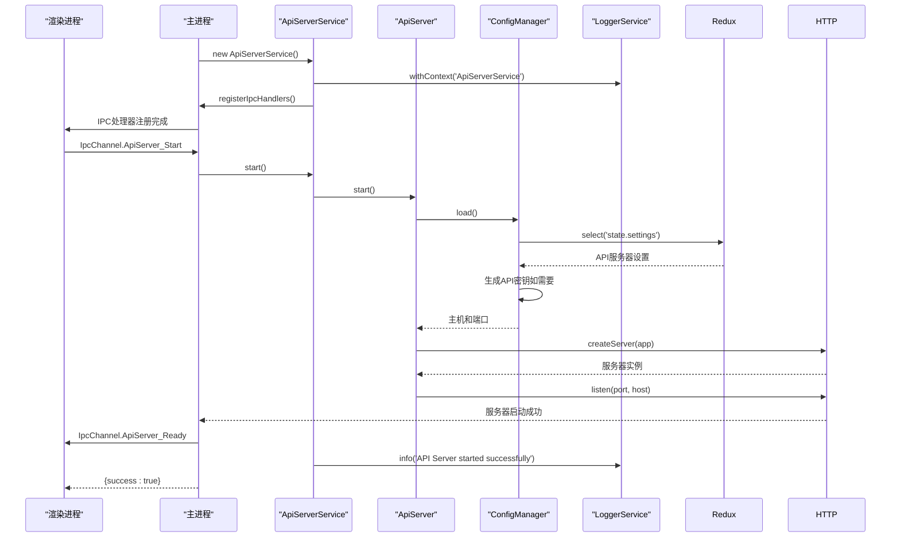

**图表来源**  
- [ApiServerService.ts](file://src/main/services/ApiServerService.ts)
- [server.ts](file://src/main/apiServer/server.ts)
- [config.ts](file://src/main/apiServer/config.ts)
- [LoggerService.ts](file://src/main/services/LoggerService.ts)

**本节来源**  
- [ApiServerService.ts](file://src/main/services/ApiServerService.ts)
- [server.ts](file://src/main/apiServer/server.ts)
- [config.ts](file://src/main/apiServer/config.ts)

### 生命周期管理
API服务器服务提供了完整的生命周期管理功能，包括启动、停止、重启和状态查询。这些操作通过IPC通道暴露给渲染进程，允许用户通过UI界面控制API服务器。

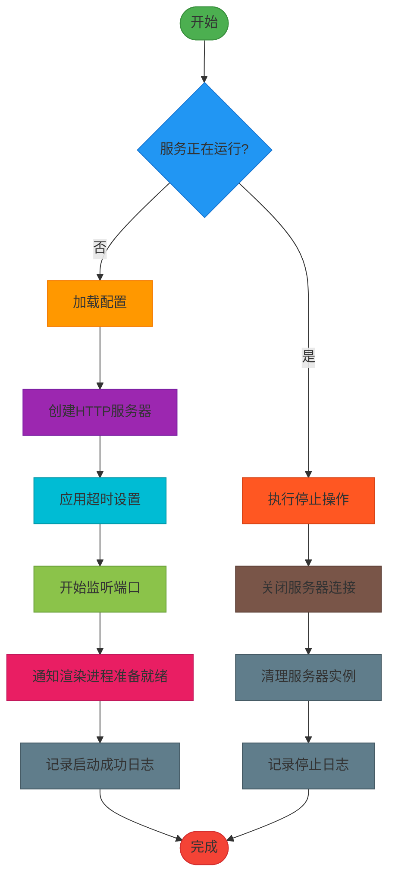

**图表来源**  
- [server.ts](file://src/main/apiServer/server.ts)
- [ApiServerService.ts](file://src/main/services/ApiServerService.ts)

**本节来源**  
- [server.ts](file://src/main/apiServer/server.ts)

### IPC通信集成
API服务器服务通过Electron的IPC机制与渲染进程通信，暴露了启动、停止、重启和状态查询等API。这种设计模式实现了主进程和渲染进程的职责分离，同时确保了API服务器控制的安全性。

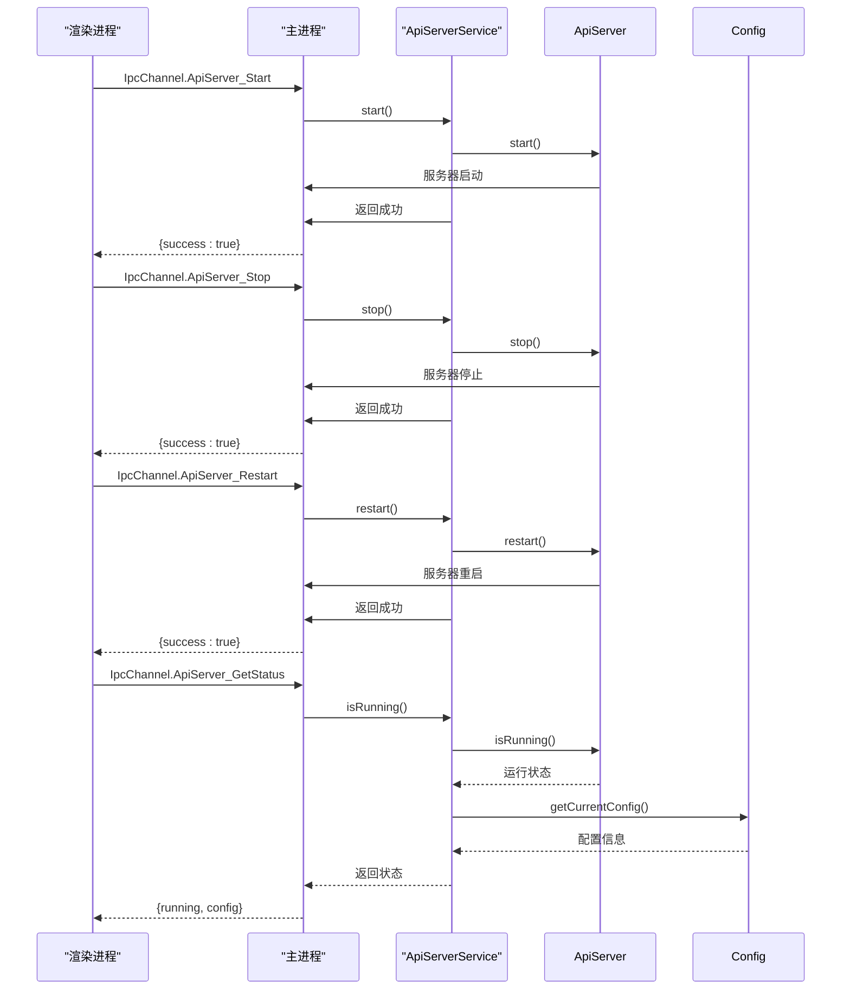

**图表来源**  
- [ApiServerService.ts](file://src/main/services/ApiServerService.ts)
- [IpcChannel.ts](file://packages/shared/IpcChannel.ts)

**本节来源**  
- [ApiServerService.ts](file://src/main/services/ApiServerService.ts)

### 服务配置选项
API服务器服务的配置由`ConfigManager`类管理，配置信息存储在Redux状态中。配置包括启用状态、主机地址、端口和API密钥等关键参数。

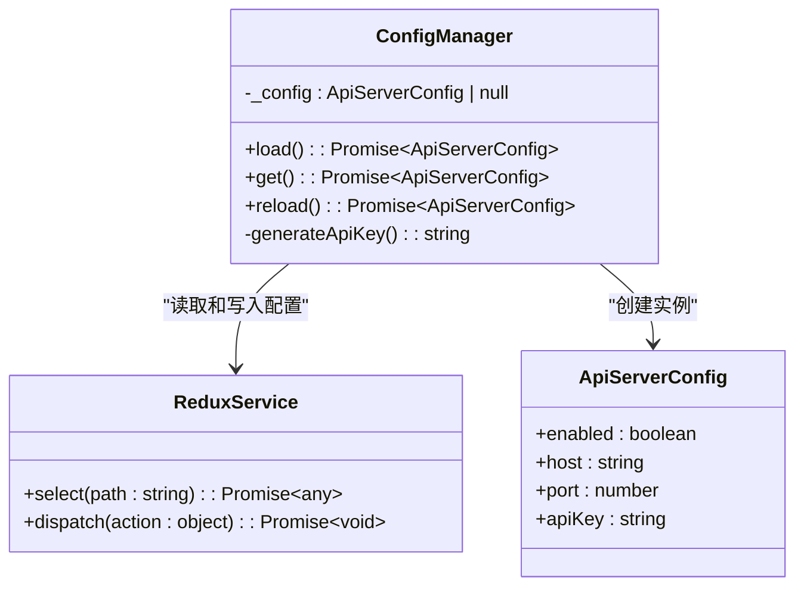

**图表来源**  
- [config.ts](file://src/main/apiServer/config.ts)
- [types.ts](file://src/renderer/src/types/apiServer.ts)
- [ReduxService.ts](file://src/main/services/ReduxService.ts)

**本节来源**  
- [config.ts](file://src/main/apiServer/config.ts)

### 性能监控与资源优化
API服务器服务通过多种机制确保性能和资源使用效率，包括请求超时设置、连接超时管理和长轮询超时配置。

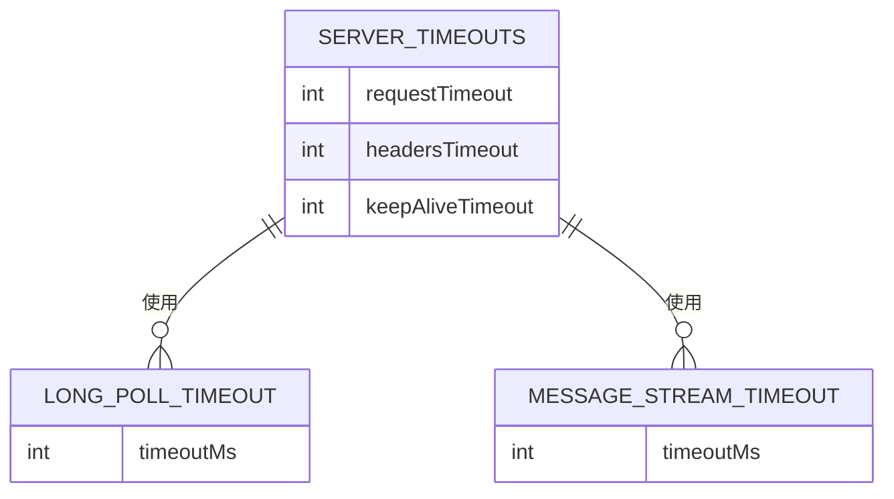

**图表来源**  
- [server.ts](file://src/main/apiServer/server.ts)
- [timeouts.ts](file://src/main/apiServer/config/timeouts.ts)

**本节来源**  
- [server.ts](file://src/main/apiServer/server.ts)
- [timeouts.ts](file://src/main/apiServer/config/timeouts.ts)

### 可扩展性设计
API服务器服务采用模块化设计，通过Express路由和中间件机制支持功能扩展。新的API端点可以通过添加路由文件轻松集成到现有系统中。

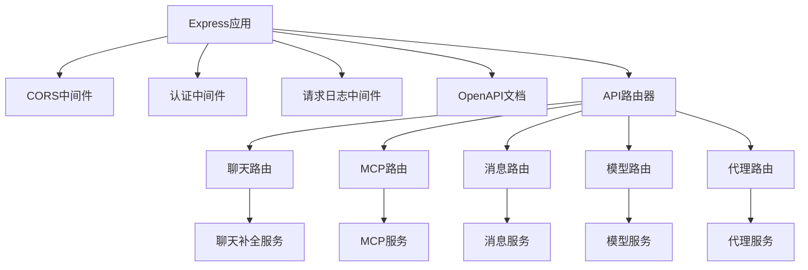

**图表来源**  
- [app.ts](file://src/main/apiServer/app.ts)
- [routes](file://src/main/apiServer/routes/)
- [services](file://src/main/apiServer/services/)

**本节来源**  
- [app.ts](file://src/main/apiServer/app.ts)

### 错误恢复机制
API服务器服务实现了健壮的错误恢复机制，包括启动失败时的实例清理、错误日志记录和IPC通信的异常处理。

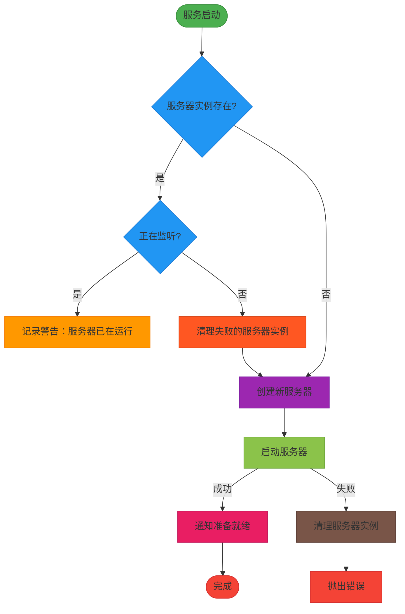

**图表来源**  
- [server.ts](file://src/main/apiServer/server.ts)

**本节来源**  
- [server.ts](file://src/main/apiServer/server.ts)

## 依赖分析
API服务器服务依赖于多个核心组件，包括Express框架、Electron IPC、Redux状态管理和日志服务。这些依赖关系确保了服务的功能完整性和系统集成性。

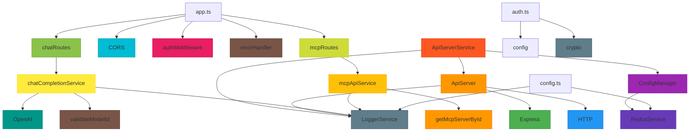

**图表来源**  
- [ApiServerService.ts](file://src/main/services/ApiServerService.ts)
- [server.ts](file://src/main/apiServer/server.ts)
- [app.ts](file://src/main/apiServer/app.ts)
- [config.ts](file://src/main/apiServer/config.ts)
- [auth.ts](file://src/main/apiServer/middleware/auth.ts)
- [error.ts](file://src/main/apiServer/middleware/error.ts)
- [chat.ts](file://src/main/apiServer/routes/chat.ts)
- [mcp.ts](file://src/main/apiServer/routes/mcp.ts)
- [chat-completion.ts](file://src/main/apiServer/services/chat-completion.ts)

**本节来源**  
- [ApiServerService.ts](file://src/main/services/ApiServerService.ts)
- [server.ts](file://src/main/apiServer/server.ts)
- [app.ts](file://src/main/apiServer/app.ts)
- [config.ts](file://src/main/apiServer/config.ts)

## 性能考虑
API服务器服务在性能方面进行了多项优化，包括全局请求超时设置、连接超时管理和长轮询超时配置。这些设置确保了服务器在高负载情况下的稳定性和响应性。

**本节来源**  
- [server.ts](file://src/main/apiServer/server.ts)
- [timeouts.ts](file://src/main/apiServer/config/timeouts.ts)

## 故障排除指南
当API服务器服务出现问题时，可以通过检查日志文件、验证配置设置和确认端口可用性来进行故障排除。日志文件位于用户数据目录的`logs`子目录中，按日期轮转存储。

**本节来源**  
- [LoggerService.ts](file://src/main/services/LoggerService.ts)
- [config.ts](file://src/main/apiServer/config.ts)

## 结论
Cherry Studio API服务器服务是一个功能完整、设计良好的本地API服务器实现。它通过模块化架构、清晰的依赖关系和健壮的错误处理机制，为应用程序提供了可靠的API接口支持。服务的可扩展性设计允许轻松添加新功能，而性能优化措施确保了在各种负载条件下的稳定运行。通过IPC通信与主进程的其他组件紧密集成，API服务器服务在Cherry Studio的整体架构中扮演着关键角色。