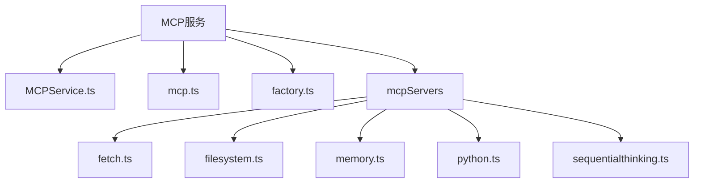
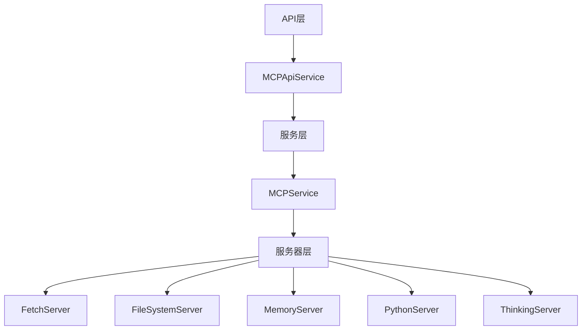
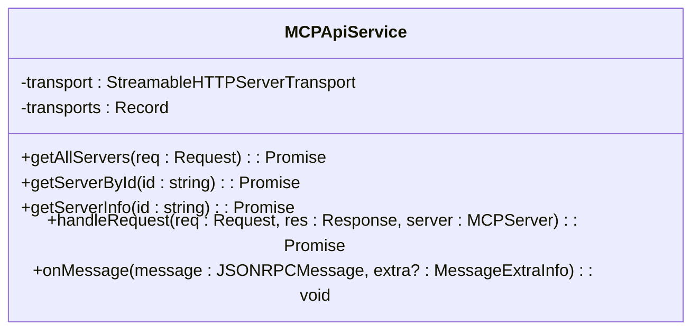
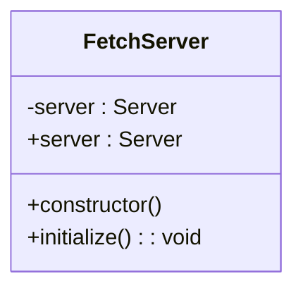
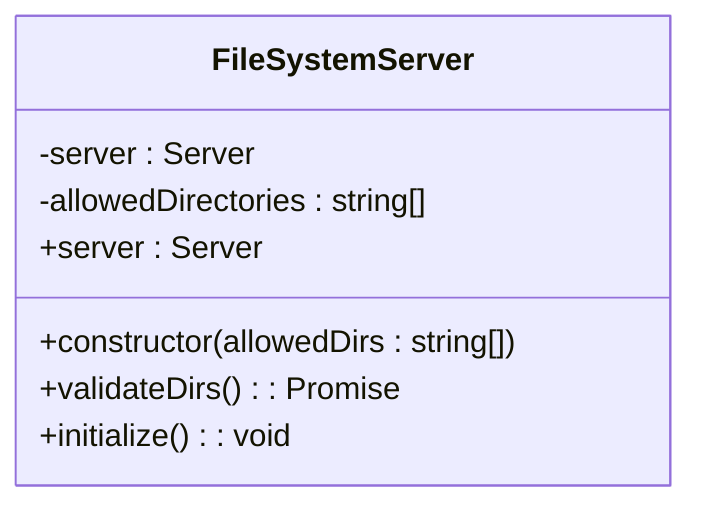
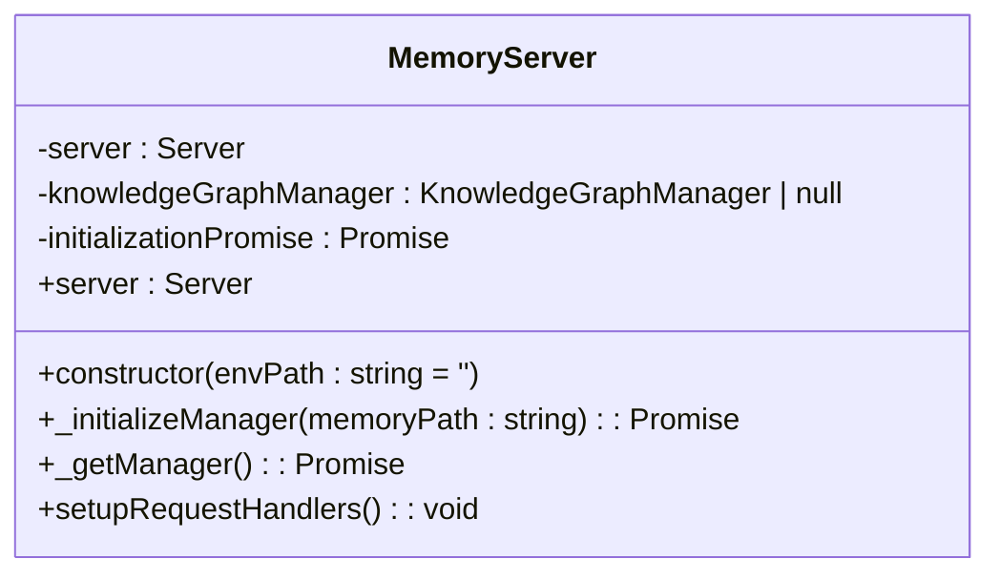
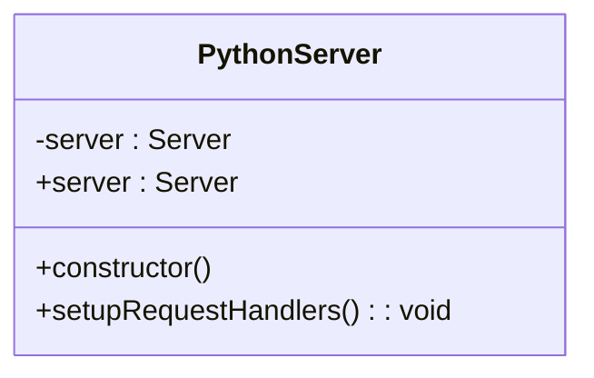
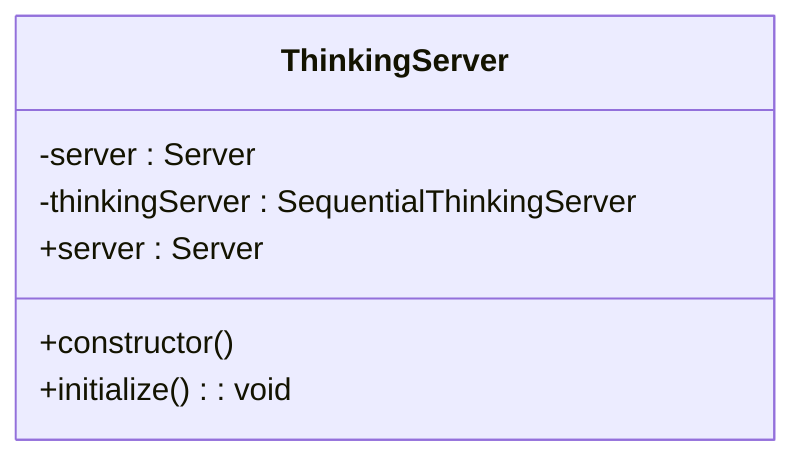

# MCP服务

<cite>
**本文档引用的文件**   
- [MCPService.ts](file://src/main/services/MCPService.ts)
- [mcp.ts](file://src/main/apiServer/services/mcp.ts)
- [factory.ts](file://src/main/mcpServers/factory.ts)
- [fetch.ts](file://src/main/mcpServers/fetch.ts)
- [filesystem.ts](file://src/main/mcpServers/filesystem.ts)
- [memory.ts](file://src/main/mcpServers/memory.ts)
- [python.ts](file://src/main/mcpServers/python.ts)
- [sequentialthinking.ts](file://src/main/mcpServers/sequentialthinking.ts)
- [provider.ts](file://src/main/services/mcp/oauth/provider.ts)
- [callback.ts](file://src/main/services/mcp/oauth/callback.ts)
- [mcp.ts](file://src/main/apiServer/routes/mcp.ts)
- [mcp.ts](file://src/main/utils/mcp.ts)
- [types.ts](file://src/main/services/mcp/oauth/types.ts)
</cite>

## 目录
1. [简介](#简介)
2. [项目结构](#项目结构)
3. [核心组件](#核心组件)
4. [架构概述](#架构概述)
5. [详细组件分析](#详细组件分析)
6. [依赖分析](#依赖分析)
7. [性能考虑](#性能考虑)
8. [故障排除指南](#故障排除指南)
9. [结论](#结论)

## 简介
MCP服务是Cherry Studio的核心组件，负责管理Model Context Protocol（MCP）协议服务。该服务实现了客户端初始化、工具调用、提示词管理、资源访问等核心功能，支持多种传输方式（如stdio、SSE、HTTP流）和OAuth认证流程。服务通过连接管理机制、缓存策略、通知处理和错误恢复机制确保稳定运行，并支持可扩展性设计和插件化架构。

## 项目结构
MCP服务的代码分布在多个目录中，主要位于`src/main/services`和`src/main/mcpServers`目录下。服务通过工厂模式创建不同的MCP服务器实例，并通过API服务暴露REST接口。



**图源**
- [MCPService.ts](file://src/main/services/MCPService.ts#L1-L923)
- [mcp.ts](file://src/main/apiServer/services/mcp.ts#L1-L186)
- [factory.ts](file://src/main/mcpServers/factory.ts#L1-L55)

**章节源**
- [MCPService.ts](file://src/main/services/MCPService.ts#L1-L923)
- [mcp.ts](file://src/main/apiServer/services/mcp.ts#L1-L186)

## 核心组件
MCP服务的核心组件包括MCPService、MCPApiService和各种MCP服务器实现。MCPService负责管理MCP客户端的生命周期，包括初始化、连接、工具调用和资源访问。MCPApiService提供REST API接口，允许外部系统通过HTTP与MCP服务交互。各种MCP服务器实现（如fetch、filesystem、memory等）提供了具体的工具和功能。

**章节源**
- [MCPService.ts](file://src/main/services/MCPService.ts#L136-L923)
- [mcp.ts](file://src/main/apiServer/services/mcp.ts#L40-L185)

## 架构概述
MCP服务采用分层架构，包括API层、服务层和服务器层。API层通过REST接口暴露MCP服务功能，服务层管理MCP客户端的生命周期和状态，服务器层提供具体的工具实现。



**图源**
- [mcp.ts](file://src/main/apiServer/services/mcp.ts#L40-L185)
- [MCPService.ts](file://src/main/services/MCPService.ts#L136-L923)

## 详细组件分析

### MCPService分析
MCPService是MCP服务的核心，负责管理MCP客户端的生命周期。它通过initClient方法初始化客户端，通过listTools、callTool、listPrompts、getPrompt、listResources和getResource方法提供工具调用、提示词管理和资源访问功能。

#### MCPService类图
```mermaid
classDiagram
class McpService {
-clients : Map<string, Client>
-pendingClients : Map<string, Promise<Client>>
-dxtService : DxtService
-activeToolCalls : Map<string, AbortController>
+initClient(server : MCPServer) : Promise<Client>
+listTools(event : Electron.IpcMainInvokeEvent, server : MCPServer) : Promise<MCPTool[]>
+callTool(event : Electron.IpcMainInvokeEvent, args : CallToolArgs) : Promise<MCPCallToolResponse>
+listPrompts(event : Electron.IpcMainInvokeEvent, server : MCPServer) : Promise<MCPPrompt[]>
+getPrompt(event : Electron.IpcMainInvokeEvent, args : { server : MCPServer; name : string; args? : Record<string, any> }) : Promise<GetPromptResult>
+listResources(event : Electron.IpcMainInvokeEvent, server : MCPServer) : Promise<MCPResource[]>
+getResource(event : Electron.IpcMainInvokeEvent, args : { server : MCPServer; name : string }) : Promise<GetResourceResponse>
+closeClient(serverKey : string) : Promise<void>
+stopServer(event : Electron.IpcMainInvokeEvent, server : MCPServer) : Promise<void>
+removeServer(event : Electron.IpcMainInvokeEvent, server : MCPServer) : Promise<void>
+restartServer(event : Electron.IpcMainInvokeEvent, server : MCPServer) : Promise<void>
+cleanup() : Promise<void>
+checkMcpConnectivity(event : Electron.IpcMainInvokeEvent, server : MCPServer) : Promise<boolean>
+getServerVersion(event : Electron.IpcMainInvokeEvent, server : MCPServer) : Promise<string>
}
```

**图源**
- [MCPService.ts](file://src/main/services/MCPService.ts#L136-L923)

**章节源**
- [MCPService.ts](file://src/main/services/MCPService.ts#L136-L923)

### MCPApiService分析
MCPApiService提供REST API接口，允许外部系统通过HTTP与MCP服务交互。它通过getAllServers、getServerById、getServerInfo和handleRequest方法提供服务器列表、服务器信息和请求处理功能。

#### MCPApiService类图


**图源**
- [mcp.ts](file://src/main/apiServer/services/mcp.ts#L40-L185)

**章节源**
- [mcp.ts](file://src/main/apiServer/services/mcp.ts#L40-L185)

### MCP服务器分析
MCP服务器实现提供了具体的工具和功能。每个服务器实现都通过工厂模式创建，并通过MCPService管理。

#### FetchServer分析
FetchServer提供从URL获取内容的功能，支持HTML、JSON、文本和Markdown格式。



**图源**
- [fetch.ts](file://src/main/mcpServers/fetch.ts#L1-L234)

**章节源**
- [fetch.ts](file://src/main/mcpServers/fetch.ts#L1-L234)

#### FileSystemServer分析
FileSystemServer提供文件系统操作功能，支持读取、写入、编辑、创建目录、列出目录、目录树、移动文件、搜索文件和获取文件信息。



**图源**
- [filesystem.ts](file://src/main/mcpServers/filesystem.ts#L283-L653)

**章节源**
- [filesystem.ts](file://src/main/mcpServers/filesystem.ts#L283-L653)

#### MemoryServer分析
MemoryServer提供内存存储功能，支持创建实体、创建关系、添加观察、删除实体、删除观察、删除关系、读取图、搜索节点和打开节点。



**图源**
- [memory.ts](file://src/main/mcpServers/memory.ts#L339-L715)

**章节源**
- [memory.ts](file://src/main/mcpServers/memory.ts#L339-L715)

#### PythonServer分析
PythonServer提供执行Python代码的功能，支持通过Pyodide在沙箱环境中执行代码。



**图源**
- [python.ts](file://src/main/mcpServers/python.ts#L11-L116)

**章节源**
- [python.ts](file://src/main/mcpServers/python.ts#L11-L116)

#### ThinkingServer分析
ThinkingServer提供顺序思考功能，支持动态和反思性问题解决。



**图源**
- [sequentialthinking.ts](file://src/main/mcpServers/sequentialthinking.ts#L251-L295)

**章节源**
- [sequentialthinking.ts](file://src/main/mcpServers/sequentialthinking.ts#L251-L295)

## 依赖分析
MCP服务依赖于多个外部库和内部服务，包括@modelcontextprotocol/sdk、@logger、@main/utils、@shared/config/constant、@shared/IpcChannel、@shared/utils、@types、electron、events、uuid、@reduxjs/toolkit等。

```mermaid
graph TD
A[MCPService] --> B[@modelcontextprotocol/sdk]
A --> C[@logger]
A --> D[@main/utils]
A --> E[@shared/config/constant]
A --> F[@shared/IpcChannel]
A --> G[@shared/utils]
A --> H[@types]
A --> I[electron]
A --> J[events]
A --> K[uuid]
A --> L[@reduxjs/toolkit]
```

**图源**
- [MCPService.ts](file://src/main/services/MCPService.ts#L1-L923)

**章节源**
- [MCPService.ts](file://src/main/services/MCPService.ts#L1-L923)

## 性能考虑
MCP服务通过缓存策略、连接管理和错误恢复机制优化性能。缓存策略通过withCache函数实现，连接管理通过initClient和closeClient方法实现，错误恢复机制通过重试和清理操作实现。

**章节源**
- [MCPService.ts](file://src/main/services/MCPService.ts#L111-L134)
- [MCPService.ts](file://src/main/services/MCPService.ts#L171-L459)
- [MCPService.ts](file://src/main/services/MCPService.ts#L530-L542)

## 故障排除指南
MCP服务通过日志记录、错误处理和通知机制提供故障排除支持。日志记录通过loggerService实现，错误处理通过try-catch块和McpError类实现，通知机制通过notificationHandler实现。

**章节源**
- [MCPService.ts](file://src/main/services/MCPService.ts#L62-L101)
- [MCPService.ts](file://src/main/services/MCPService.ts#L633-L635)
- [MCPService.ts](file://src/main/services/MCPService.ts#L465-L511)

## 结论
MCP服务是Cherry Studio的核心组件，提供了强大的MCP协议服务管理功能。通过分层架构、工厂模式和丰富的工具实现，MCP服务能够高效地管理MCP客户端的生命周期，并提供稳定的工具调用、提示词管理和资源访问功能。服务的可扩展性设计和插件化架构支持使其能够适应不断变化的需求。