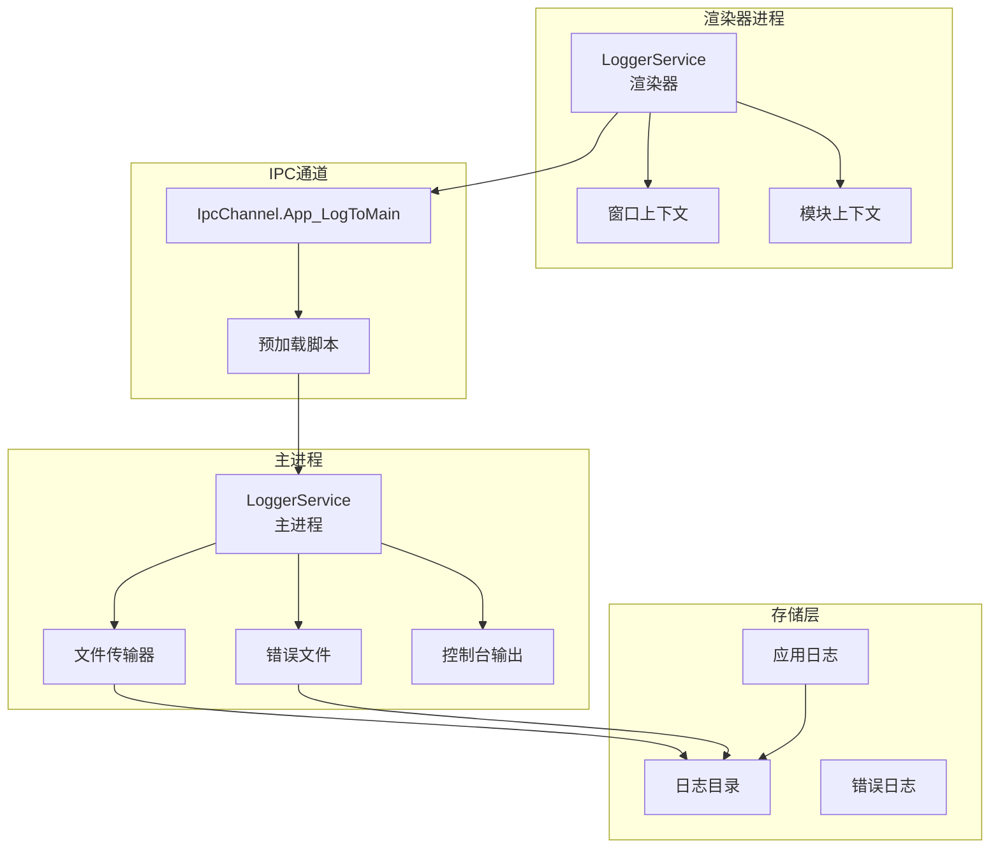
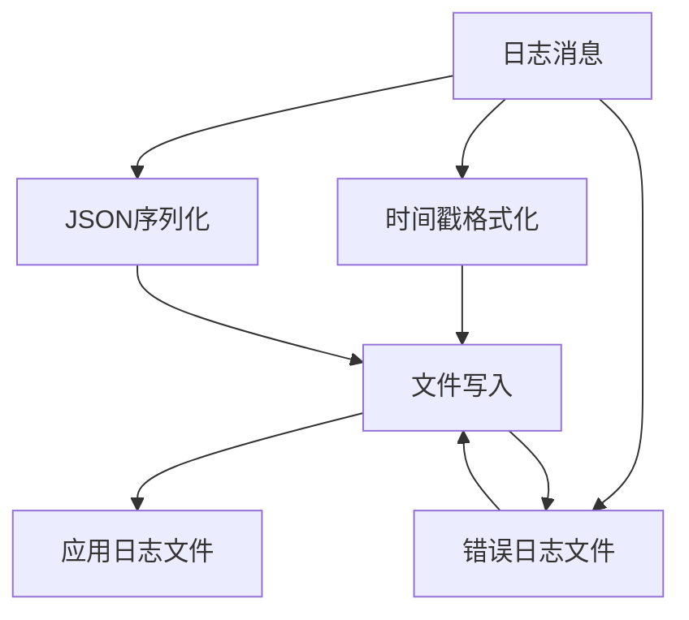
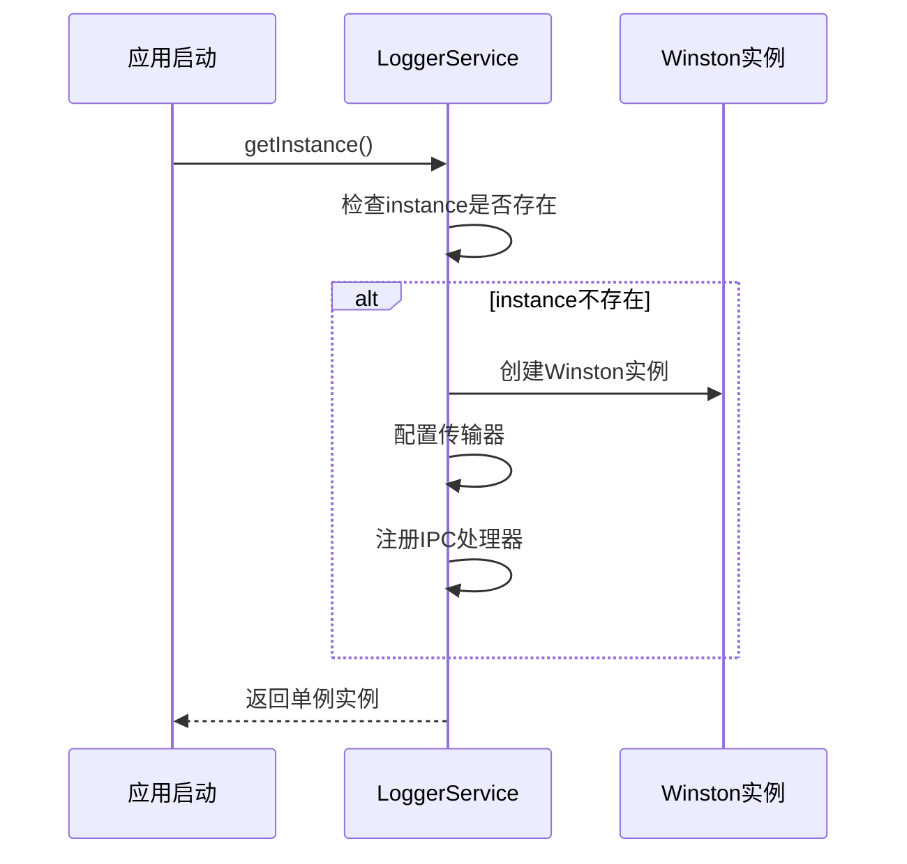
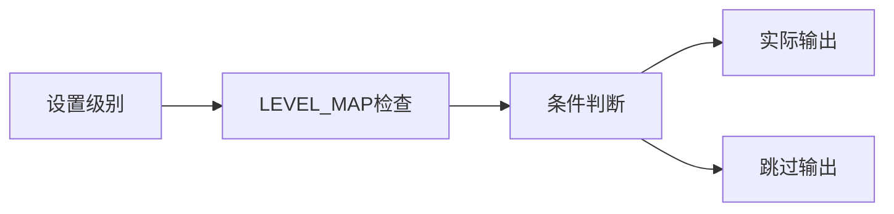
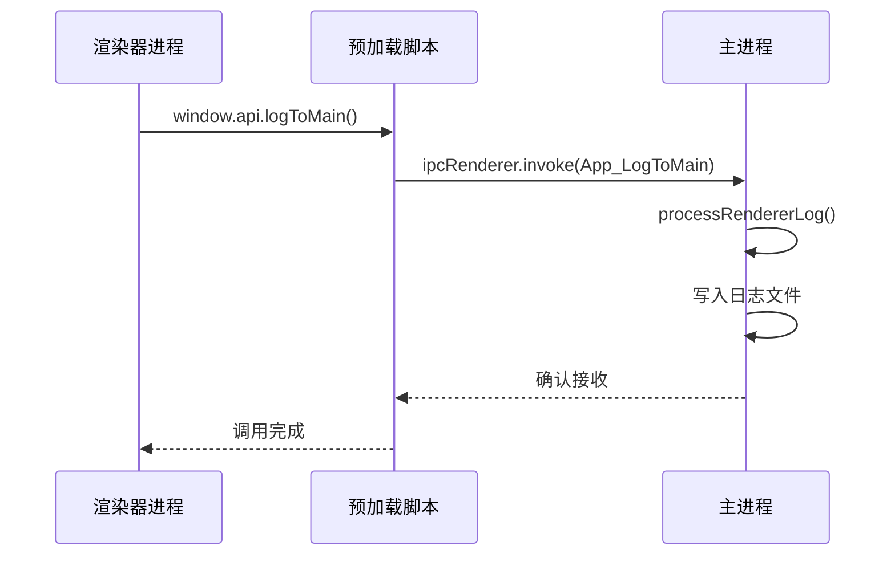
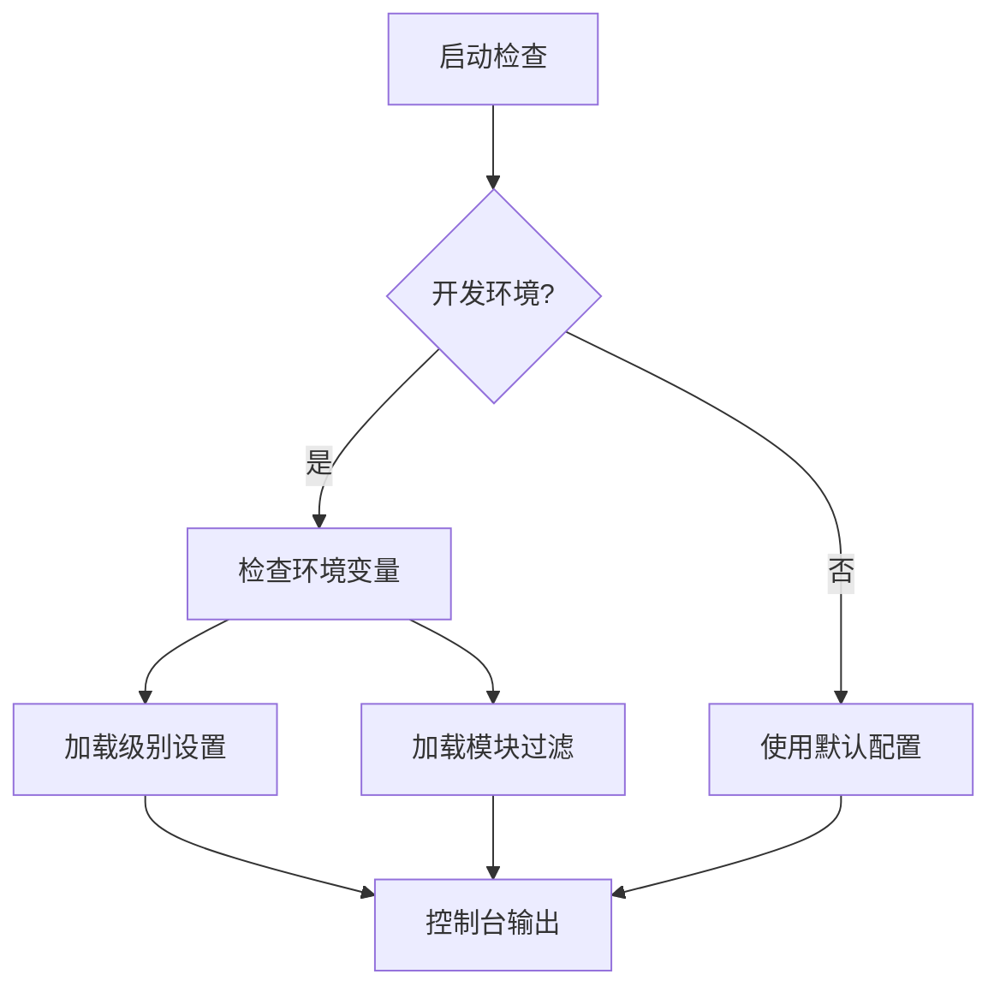
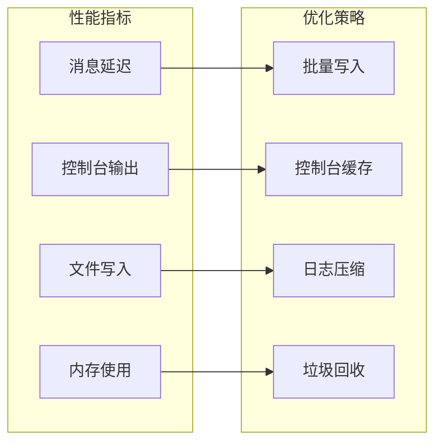

# Cherry Studio日志服务详细文档

<cite>
**本文档引用的文件**
- [LoggerService.ts (主进程)](file://src/main/services/LoggerService.ts)
- [LoggerService.ts (渲染器进程)](file://src/renderer/src/services/LoggerService.ts)
- [logger.ts](file://packages/shared/config/logger.ts)
- [IpcChannel.ts](file://packages/shared/IpcChannel.ts)
- [preload/index.ts](file://src/preload/index.ts)
- [init.ts (渲染器)](file://src/renderer/src/init.ts)
- [shiki-stream.worker.ts](file://src/renderer/src/workers/shiki-stream.worker.ts)
- [bootstrap.ts](file://src/main/bootstrap.ts)
- [init.ts (主进程工具)](file://src/main/utils/init.ts)
</cite>

## 目录
1. [概述](#概述)
2. [系统架构](#系统架构)
3. [核心组件分析](#核心组件分析)
4. [单例模式实现](#单例模式实现)
5. [日志级别管理](#日志级别管理)
6. [跨进程通信机制](#跨进程通信机制)
7. [日志格式化与输出](#日志格式化与输出)
8. [环境配置与优化](#环境配置与优化)
9. [性能监控与资源管理](#性能监控与资源管理)
10. [扩展性设计](#扩展性设计)
11. [最佳实践](#最佳实践)
12. [故障排除](#故障排除)

## 概述

Cherry Studio的日志服务是一个高度结构化的多进程日志记录系统，专门为Electron应用程序设计。该服务实现了统一的日志记录接口，支持主进程和渲染器进程之间的无缝日志传输，提供了丰富的配置选项和性能优化机制。

### 主要特性

- **双进程架构**：主进程负责文件输出和错误处理，渲染器进程负责实时控制台输出
- **结构化日志**：基于Winston的日志框架，支持JSON格式和时间戳
- **智能路由**：根据日志级别自动决定是否发送到主进程
- **环境感知**：开发环境下的增强调试功能
- **模块化设计**：支持上下文和模块级别的日志分类

## 系统架构



**图表来源**
- [LoggerService.ts (主进程)](file://src/main/services/LoggerService.ts#L1-L392)
- [LoggerService.ts (渲染器进程)](file://src/renderer/src/services/LoggerService.ts#L1-L279)
- [IpcChannel.ts](file://packages/shared/IpcChannel.ts#L38)

## 核心组件分析

### 主进程LoggerService

主进程LoggerService是整个日志系统的核心，负责持久化存储和高级日志处理。

#### 关键特性

- **Winston集成**：使用成熟的Winston日志库作为底层引擎
- **文件轮转**：自动管理日志文件大小和保留期限
- **错误处理**：专门的错误级别日志收集和系统信息附加
- **IPC处理器**：接收来自渲染器进程的日志请求

#### 日志格式配置



**图表来源**
- [LoggerService.ts (主进程)](file://src/main/services/LoggerService.ts#L128-L133)

**章节来源**
- [LoggerService.ts (主进程)](file://src/main/services/LoggerService.ts#L124-L146)

### 渲染器进程LoggerService

渲染器进程LoggerService专注于实时输出和轻量级日志处理。

#### 实时输出机制

- **ANSI颜色支持**：彩色控制台输出便于调试
- **模块标识**：清晰的模块名称显示
- **上下文传递**：支持动态上下文信息
- **强制日志**：特殊标记可强制发送到主进程

**章节来源**
- [LoggerService.ts (渲染器进程)](file://src/renderer/src/services/LoggerService.ts#L115-L186)

## 单例模式实现

两个LoggerService都采用了严格的单例模式实现，确保全局唯一性和状态一致性。

### 主进程单例实现



**图表来源**
- [LoggerService.ts (主进程)](file://src/main/services/LoggerService.ts#L151-L156)

### 渲染器进程单例实现

渲染器进程的单例模式更加复杂，需要考虑窗口初始化和上下文管理。

**章节来源**
- [LoggerService.ts (主进程)](file://src/main/services/LoggerService.ts#L151-L156)
- [LoggerService.ts (渲染器进程)](file://src/renderer/src/services/LoggerService.ts#L68-L73)

## 日志级别管理

### 支持的日志级别

| 级别 | 数值 | 描述 | 使用场景 |
|------|------|------|----------|
| ERROR | 10 | 错误级别 | 系统错误、异常处理 |
| WARN | 8 | 警告级别 | 潜在问题、兼容性警告 |
| INFO | 6 | 信息级别 | 正常操作、状态更新 |
| DEBUG | 4 | 调试级别 | 开发调试、流程跟踪 |
| VERBOSE | 2 | 详细级别 | 详细执行过程 |
| SILLY | 0 | 傻屄级别 | 最详细的信息记录 |
| NONE | -1 | 无级别 | 禁用日志 |

### 级别映射机制



**图表来源**
- [logger.ts](file://packages/shared/config/logger.ts#L24-L32)

**章节来源**
- [logger.ts](file://packages/shared/config/logger.ts#L12-L32)

## 跨进程通信机制

### IPC通道设计

日志服务通过专门的IPC通道实现进程间通信，确保渲染器进程能够将日志发送到主进程进行持久化存储。

#### 通信流程



**图表来源**
- [LoggerService.ts (渲染器进程)](file://src/renderer/src/services/LoggerService.ts#L180-L183)
- [preload/index.ts](file://src/preload/index.ts#L109-L110)

### 数据结构设计

日志源上下文包含了完整的进程和模块信息：

```typescript
interface LogSourceWithContext {
  process: 'main' | 'renderer'
  window?: string  // 仅渲染器进程
  module?: string
  context?: Record<string, any>
}
```

**章节来源**
- [LoggerService.ts (主进程)](file://src/main/services/LoggerService.ts#L382-L387)
- [logger.ts](file://packages/shared/config/logger.ts#L1-L6)

## 日志格式化与输出

### 主进程输出格式

主进程采用结构化JSON格式，包含以下信息：

- 时间戳（ISO 8601格式）
- 日志级别
- 模块名称
- 上下文信息
- 系统信息（错误级别）
- 应用版本信息

### 渲染器进程输出格式

渲染器进程提供彩色终端输出，便于开发者快速识别：

- 彩色前缀（红色、黄色、绿色等）
- 时间戳（本地格式）
- 模块标识
- 原始日志消息

**章节来源**
- [LoggerService.ts (主进程)](file://src/main/services/LoggerService.ts#L200-L249)
- [LoggerService.ts (渲染器进程)](file://src/renderer/src/services/LoggerService.ts#L140-L158)

## 环境配置与优化

### 开发环境配置

开发环境下提供了丰富的调试功能：

#### 环境变量支持

| 变量名 | 类型 | 描述 | 示例 |
|--------|------|------|------|
| CSLOGGER_MAIN_LEVEL | LogLevel | 主进程日志级别过滤 | silly, debug, info |
| CSLOGGER_MAIN_SHOW_MODULES | string[] | 显示的模块列表 | "module1,module2,module3" |
| CSLOGGER_RENDERER_LEVEL | LogLevel | 渲染器进程日志级别 | silly, debug, info |
| CSLOGGER_RENDERER_SHOW_MODULES | string[] | 渲染器模块过滤列表 | "ui,api,storage" |

#### 自动配置机制



**图表来源**
- [LoggerService.ts (主进程)](file://src/main/services/LoggerService.ts#L75-L97)
- [LoggerService.ts (渲染器进程)](file://src/renderer/src/services/LoggerService.ts#L36-L61)

**章节来源**
- [LoggerService.ts (主进程)](file://src/main/services/LoggerService.ts#L75-L97)
- [LoggerService.ts (渲染器进程)](file://src/renderer/src/services/LoggerService.ts#L36-L61)

## 性能监控与资源管理

### 文件轮转策略

主进程实现了智能的日志文件轮转机制：

#### 轮转配置

| 参数 | 主进程 | 渲染器进程 | 说明 |
|------|--------|------------|------|
| 文件名模式 | app.%DATE%.log | - | 包含日期的时间戳 |
| 日期格式 | YYYY-MM-DD | - | ISO 8601标准 |
| 单文件大小 | 10MB | - | 超过自动轮转 |
| 保留期限 | 30天 | 60天 | 错误日志保留更久 |
| 最大文件数 | 30个 | 60个 | 防止磁盘空间耗尽 |

### 内存优化

#### 上下文管理

- **浅拷贝策略**：使用`Object.create()`避免深拷贝开销
- **惰性初始化**：只有在需要时才创建新的日志实例
- **LRU缓存**：渲染器进程中的tokenizer使用LRU缓存

#### 性能监控指标



**章节来源**
- [LoggerService.ts (主进程)](file://src/main/services/LoggerService.ts#L103-L122)

## 扩展性设计

### 自定义传输器支持

LoggerService基于Winston构建，天然支持自定义传输器：

```typescript
// 示例：添加自定义传输器
const customTransport = new winston.transports.Http({
  host: 'log-server.example.com',
  port: 8080,
  path: '/logs'
})

logger.add(customTransport)
```

### 上下文扩展

支持动态上下文信息的添加和修改：

```typescript
// 创建带上下文的logger
const logger = loggerService
  .withContext('DatabaseService', { userId: '12345' })
  .withContext('Operation', { operation: 'insert' })
```

### 模块化架构

- **插件接口**：支持第三方日志处理器
- **中间件管道**：可插入的预处理和后处理逻辑
- **配置驱动**：完全可配置的传输器和格式化器

**章节来源**
- [LoggerService.ts (主进程)](file://src/main/services/LoggerService.ts#L164-L172)
- [LoggerService.ts (渲染器进程)](file://src/renderer/src/services/LoggerService.ts#L99-L106)

## 最佳实践

### 使用指南

#### 1. 基本使用模式

```typescript
// 导入loggerService
import { loggerService } from '@logger'

// 初始化渲染器进程（必须在使用前调用）
loggerService.initWindowSource('mainWindow')

// 创建模块级logger
const logger = loggerService.withContext('MyModule')

// 记录不同类型日志
logger.info('操作成功', { result: data })
logger.warn('潜在问题', { warning: 'deprecated API' })
logger.error('操作失败', error)
```

#### 2. 强制主进程日志

```typescript
// 强制发送到主进程（即使低于默认级别）
logger.info('重要信息', { logToMain: true })

// 设置特定级别的强制日志
loggerService.setLogToMainLevel('debug')
```

#### 3. 开发环境调试

```bash
# 设置渲染器进程日志级别
export CSLOGGER_RENDERER_LEVEL=silly

# 只显示特定模块
export CSLOGGER_RENDERER_SHOW_MODULES="ui,api"

# 主进程同样适用
export CSLOGGER_MAIN_LEVEL=debug
```

### 性能优化建议

1. **避免频繁创建logger实例**：使用`withContext()`方法复用基础logger
2. **合理设置日志级别**：生产环境避免使用`silly`级别
3. **控制上下文大小**：不要在上下文中包含大量数据
4. **批量处理**：对于大量日志，考虑批量写入

**章节来源**
- [init.ts (渲染器)](file://src/renderer/src/init.ts#L10)
- [shiki-stream.worker.ts](file://src/renderer/src/workers/shiki-stream.worker.ts#L11)

## 故障排除

### 常见问题及解决方案

#### 1. 渲染器进程日志未显示

**问题**：调用了`loggerService.initWindowSource()`但没有看到日志输出

**解决方案**：
- 确保在调用任何日志方法之前初始化窗口源
- 检查是否在正确的窗口上下文中调用
- 验证环境变量设置是否正确

#### 2. 日志级别过滤不生效

**问题**：设置了环境变量但日志仍然显示过多

**解决方案**：
- 检查环境变量拼写是否正确
- 确认环境变量值是否为有效日志级别
- 验证是否在开发环境中运行

#### 3. 主进程日志文件未生成

**问题**：主进程应该生成的日志文件不存在

**解决方案**：
- 检查应用数据目录权限
- 验证日志目录路径是否正确
- 查看是否有其他进程占用日志文件

#### 4. IPC通信失败

**问题**：渲染器进程日志无法发送到主进程

**解决方案**：
- 检查IPC通道是否正确注册
- 验证预加载脚本是否正确加载
- 查看主进程控制台是否有相关错误

### 调试技巧

1. **启用详细日志**：设置`CSLOGGER_MAIN_LEVEL=silly`和`CSLOGGER_RENDERER_LEVEL=silly`
2. **检查环境变量**：在控制台输出中查找"[LoggerService]"关键字
3. **验证上下文**：检查日志输出中是否包含预期的模块和上下文信息
4. **监控文件**：使用tail命令实时查看日志文件内容

**章节来源**
- [LoggerService.ts (渲染器进程)](file://src/renderer/src/services/LoggerService.ts#L116-L118)
- [LoggerService.ts (主进程)](file://src/main/services/LoggerService.ts#L140-L142)

## 结论

Cherry Studio的日志服务是一个设计精良、功能完备的多进程日志系统。它不仅满足了Electron应用的特殊需求，还提供了出色的开发体验和生产环境稳定性。通过合理的架构设计、丰富的配置选项和完善的错误处理机制，该日志服务为整个应用提供了可靠的日志记录基础设施。

未来的改进方向包括：
- 支持更多自定义传输器类型
- 增强性能监控能力
- 扩展移动端日志支持
- 提供更丰富的日志分析工具