# Cherry Studio核心服务详细文档

<cite>
**本文档引用的文件**
- [ApiServerService.ts](file://src/main/services/ApiServerService.ts)
- [MCPService.ts](file://src/main/services/MCPService.ts)
- [LoggerService.ts](file://src/main/services/LoggerService.ts)
- [NotificationService.ts](file://src/main/services/NotificationService.ts)
- [AppService.ts](file://src/main/services/AppService.ts)
- [ConfigManager.ts](file://src/main/services/ConfigManager.ts)
- [index.ts](file://src/main/index.ts)
- [bootstrap.ts](file://src/main/bootstrap.ts)
- [server.ts](file://src/main/apiServer/server.ts)
- [app.ts](file://src/main/apiServer/app.ts)
- [ipc.ts](file://src/main/ipc.ts)
- [CacheService.ts](file://src/main/services/CacheService.ts)
</cite>

## 目录
1. [概述](#概述)
2. [核心服务架构](#核心服务架构)
3. [ApiServerService - 本地API服务器](#apiserverservice---本地api服务器)
4. [MCPService - MCP协议服务](#mcpservice---mcp协议服务)
5. [LoggerService - 结构化日志记录](#loggerservice---结构化日志记录)
6. [NotificationService - 系统通知](#notificationservice---系统通知)
7. [服务初始化与生命周期](#服务初始化与生命周期)
8. [服务间通信模式](#服务间通信模式)
9. [配置管理](#配置管理)
10. [性能监控与优化](#性能监控与优化)
11. [错误处理与恢复机制](#错误处理与恢复机制)
12. [可扩展性设计](#可扩展性设计)

## 概述

Cherry Studio采用模块化的服务架构，通过多个核心服务协同工作来提供完整的AI助手功能。每个服务都有明确的职责边界，通过标准化的接口进行通信，确保系统的可维护性和可扩展性。

### 核心服务职责

- **ApiServerService**: 提供本地RESTful API服务器，支持聊天完成、模型管理等功能
- **MCPService**: 管理Model Context Protocol (MCP) 服务器连接，提供工具调用和资源访问
- **LoggerService**: 实现结构化日志记录，支持多级别日志输出和性能追踪
- **NotificationService**: 处理系统级通知，支持桌面通知和用户交互

## 核心服务架构

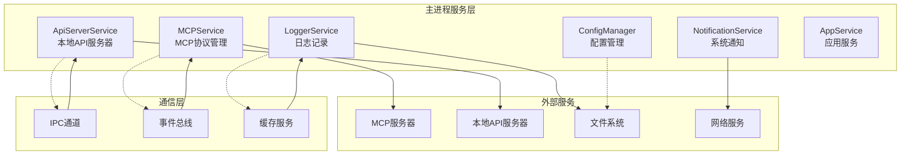

**图表来源**
- [ApiServerService.ts](file://src/main/services/ApiServerService.ts#L16-L115)
- [MCPService.ts](file://src/main/services/MCPService.ts#L136-L200)
- [LoggerService.ts](file://src/main/services/LoggerService.ts#L51-L150)
- [NotificationService.ts](file://src/main/services/NotificationService.ts#L6-L24)

## ApiServerService - 本地API服务器

ApiServerService负责提供Cherry Studio的本地RESTful API服务器，支持与前端应用的通信和各种AI功能的调用。

### 主要功能特性

- **服务器生命周期管理**: 支持启动、停止、重启操作
- **配置管理**: 动态加载和更新服务器配置
- **状态监控**: 提供服务器运行状态查询
- **IPC集成**: 通过IPC通道接收外部控制命令

### 服务架构

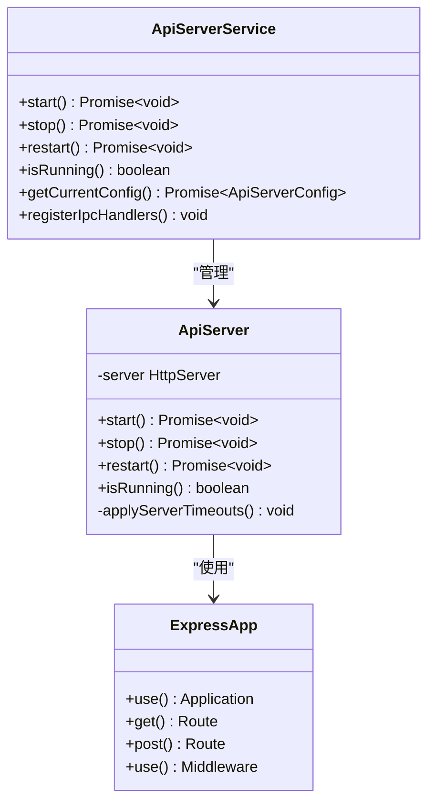

**图表来源**
- [ApiServerService.ts](file://src/main/services/ApiServerService.ts#L16-L115)
- [server.ts](file://src/main/apiServer/server.ts#L16-L97)
- [app.ts](file://src/main/apiServer/app.ts#L24-L149)

### 初始化流程

ApiServerService的初始化遵循以下步骤：

1. **服务实例化**: 创建ApiServerService单例实例
2. **IPC处理器注册**: 注册所有API相关的IPC处理器
3. **配置加载**: 从配置文件加载服务器设置
4. **自动启动决策**: 基于配置和代理数量决定是否自动启动

**章节来源**
- [ApiServerService.ts](file://src/main/services/ApiServerService.ts#L16-L115)
- [index.ts](file://src/main/index.ts#L174-L200)

## MCPService - MCP协议服务

MCPService是Cherry Studio的核心组件之一，负责管理Model Context Protocol (MCP) 服务器的连接和通信，提供强大的工具调用和资源访问能力。

### 核心架构设计

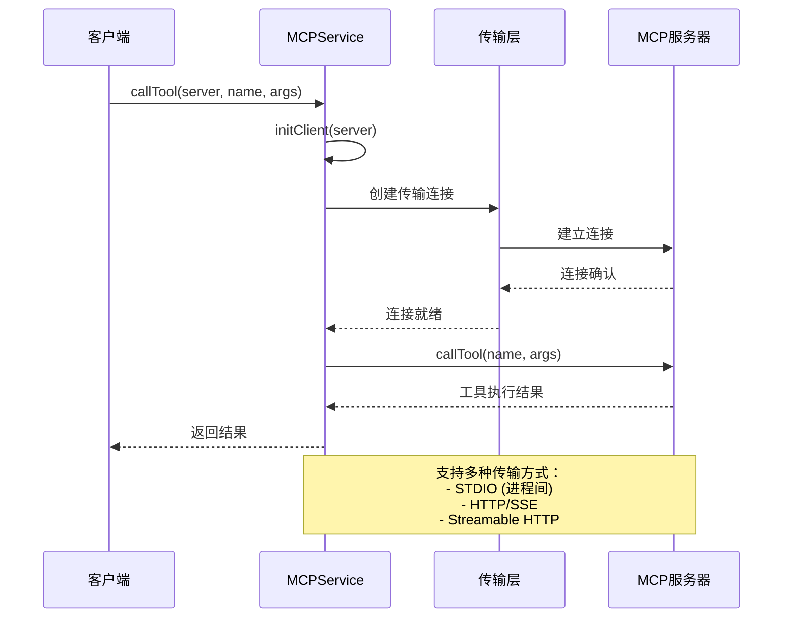

**图表来源**
- [MCPService.ts](file://src/main/services/MCPService.ts#L660-L716)
- [MCPService.ts](file://src/main/services/MCPService.ts#L210-L450)

### 传输层支持

MCPService支持多种传输协议以适应不同的MCP服务器类型：

| 传输类型 | 描述 | 使用场景 |
|---------|------|----------|
| STDIO | 标准输入输出传输 | 本地进程内MCP服务器 |
| HTTP/SSE | 超文本传输协议 | 远程HTTP MCP服务器 |
| Streamable HTTP | 流式HTTP传输 | 高性能流式通信 |
| In-Memory | 内存传输 | 内置MCP服务器 |

### 缓存机制

MCPService实现了智能缓存机制来优化性能：

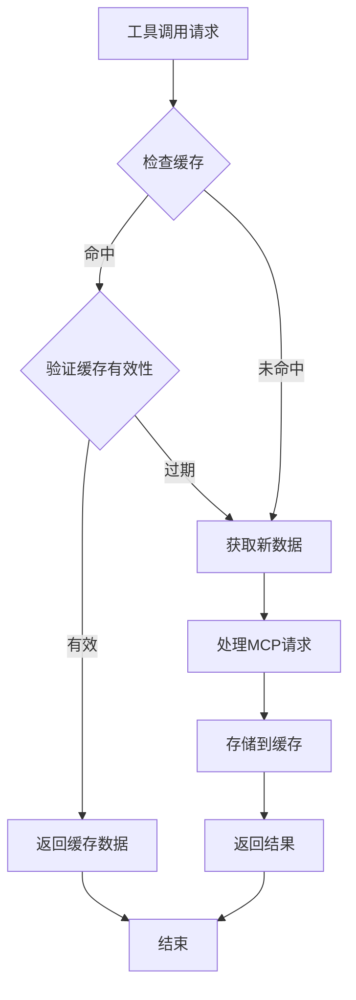

**图表来源**
- [MCPService.ts](file://src/main/services/MCPService.ts#L111-L134)

**章节来源**
- [MCPService.ts](file://src/main/services/MCPService.ts#L136-L923)

## LoggerService - 结构化日志记录

LoggerService提供了完整的结构化日志记录解决方案，支持多级别日志输出、上下文跟踪和性能监控。

### 日志级别体系

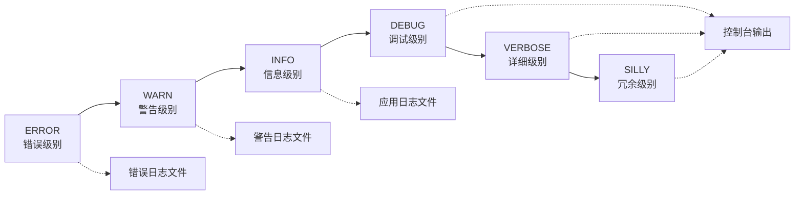

### 上下文日志系统

LoggerService支持上下文感知的日志记录：

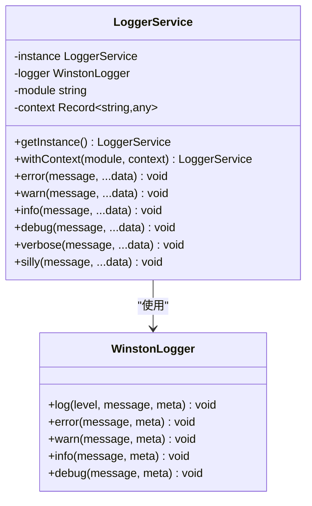

**图表来源**
- [LoggerService.ts](file://src/main/services/LoggerService.ts#L51-L150)

### 日志格式化

LoggerService提供统一的日志格式化机制：

| 字段 | 类型 | 描述 |
|------|------|------|
| timestamp | string | ISO 8601时间戳 |
| level | string | 日志级别 |
| message | string | 日志消息 |
| module | string | 模块名称 |
| context | object | 上下文信息 |
| source | object | 源信息 |
| sys | object | 系统信息 |
| appver | string | 应用版本 |

**章节来源**
- [LoggerService.ts](file://src/main/services/LoggerService.ts#L51-L392)

## NotificationService - 系统通知

NotificationService负责处理Cherry Studio的系统级通知，提供跨平台的通知功能。

### 通知架构

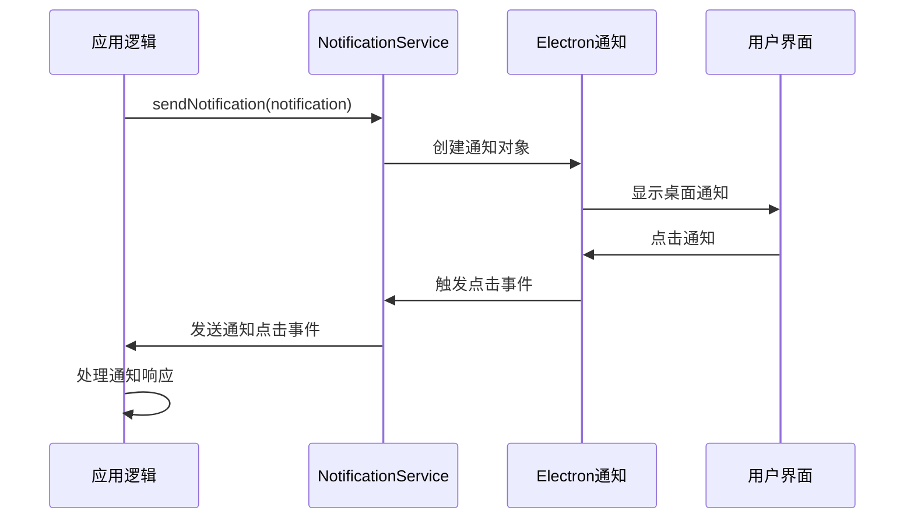

**图表来源**
- [NotificationService.ts](file://src/main/services/NotificationService.ts#L6-L24)

### 通知类型

当前支持的通知类型包括：

- **基础通知**: 简单的消息通知
- **进度通知**: 显示操作进度
- **错误通知**: 错误状态提醒
- **完成通知**: 操作完成提示

**章节来源**
- [NotificationService.ts](file://src/main/services/NotificationService.ts#L6-L24)

## 服务初始化与生命周期

Cherry Studio的服务初始化遵循严格的顺序和依赖关系管理。

### 初始化序列

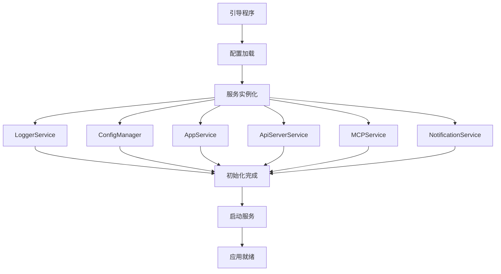

**图表来源**
- [index.ts](file://src/main/index.ts#L123-L257)
- [bootstrap.ts](file://src/main/bootstrap.ts#L1-L34)

### 生命周期管理

每个服务都实现了标准的生命周期方法：

| 方法 | 描述 | 调用时机 |
|------|------|----------|
| `start()` | 启动服务 | 应用启动时 |
| `stop()` | 停止服务 | 应用关闭前 |
| `restart()` | 重启服务 | 配置变更时 |
| `cleanup()` | 清理资源 | 异常处理时 |

**章节来源**
- [index.ts](file://src/main/index.ts#L233-L250)

## 服务间通信模式

Cherry Studio采用多种通信模式来实现服务间的协作。

### IPC通信模式

主要通过Electron的IPC机制进行进程间通信：

```mermaid
graph TB
subgraph "主进程"
MainService[主服务]
IPCMain[IPC主进程]
end
subgraph "渲染进程"
Renderer[渲染器]
IPCRenderer[IPC渲染器]
end
MainService < --> IPCMain
IPCMain < --> IPCRenderer
IPCRenderer < --> Renderer
IPCMain -.->|事件| MainService
IPCRenderer -.->|事件| Renderer
```

**图表来源**
- [ipc.ts](file://src/main/ipc.ts#L115-L800)

### 事件总线模式

部分服务通过事件总线进行松耦合通信：

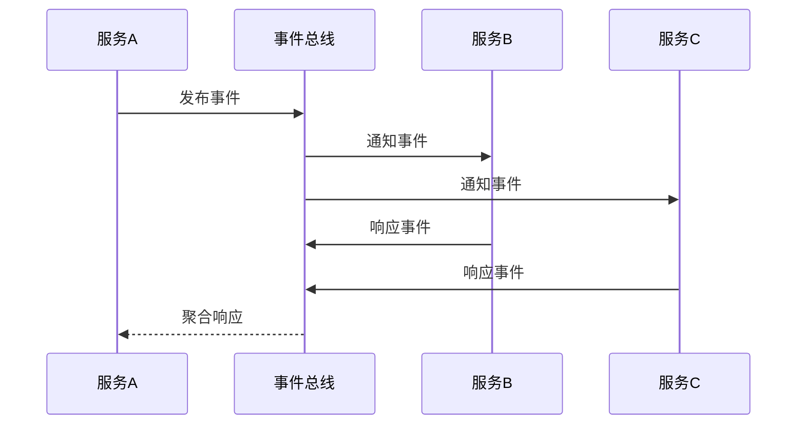

### 直接调用模式

对于紧密耦合的服务，采用直接方法调用：

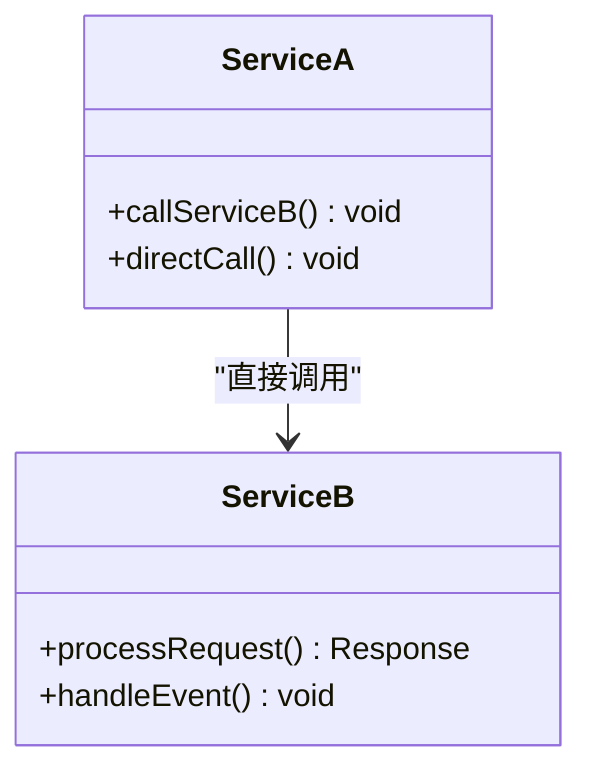

**章节来源**
- [ipc.ts](file://src/main/ipc.ts#L115-L800)

## 配置管理

ConfigManager提供了统一的配置管理服务，支持配置的持久化存储和实时更新。

### 配置键值定义

| 配置项 | 类型 | 默认值 | 描述 |
|--------|------|--------|------|
| language | string | system | 界面语言 |
| theme | ThemeMode | system | 主题模式 |
| launchToTray | boolean | false | 启动到托盘 |
| tray | boolean | true | 显示托盘图标 |
| zoomFactor | number | 1.0 | 缩放因子 |
| autoUpdate | boolean | true | 自动更新 |
| enableDataCollection | boolean | true | 数据收集 |

### 配置订阅机制

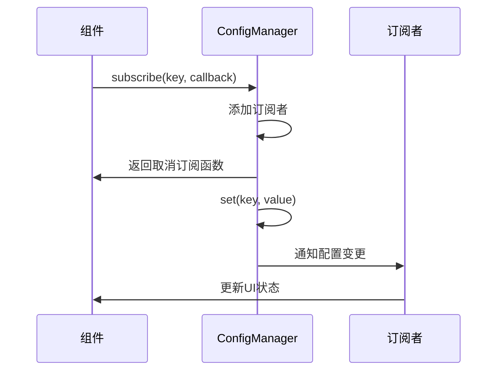

**图表来源**
- [ConfigManager.ts](file://src/main/services/ConfigManager.ts#L37-L270)

**章节来源**
- [ConfigManager.ts](file://src/main/services/ConfigManager.ts#L37-L270)

## 性能监控与优化

### 缓存策略

Cherry Studio实现了多层次的缓存机制：

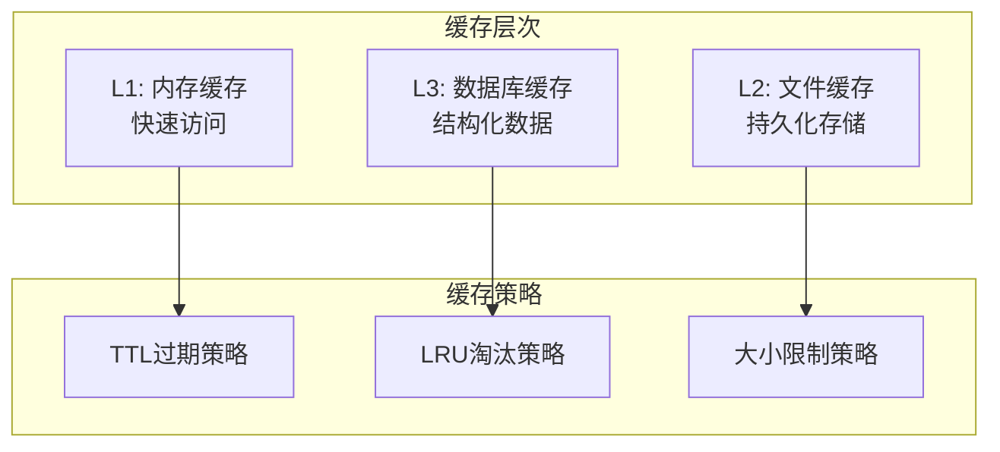

### 性能指标

关键性能指标包括：

| 指标 | 描述 | 监控方式 |
|------|------|----------|
| 启动时间 | 服务启动耗时 | 时间测量 |
| 内存使用 | 服务内存占用 | 内存监控 |
| 响应时间 | API响应延迟 | 请求计时 |
| 错误率 | 服务错误比例 | 错误统计 |

**章节来源**
- [CacheService.ts](file://src/main/services/CacheService.ts#L7-L75)

## 错误处理与恢复机制

### 错误分类

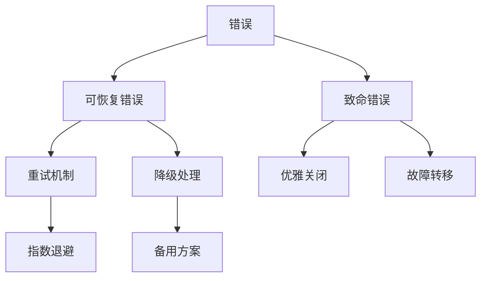

### 恢复策略

| 错误类型 | 恢复策略 | 实现方式 |
|----------|----------|----------|
| 网络超时 | 自动重试 | 指数退避算法 |
| 连接断开 | 重新连接 | 连接池管理 |
| 配置错误 | 使用默认值 | 配置验证 |
| 资源不足 | 清理缓存 | 内存管理 |

## 可扩展性设计

### 插件化架构

Cherry Studio支持插件化扩展：

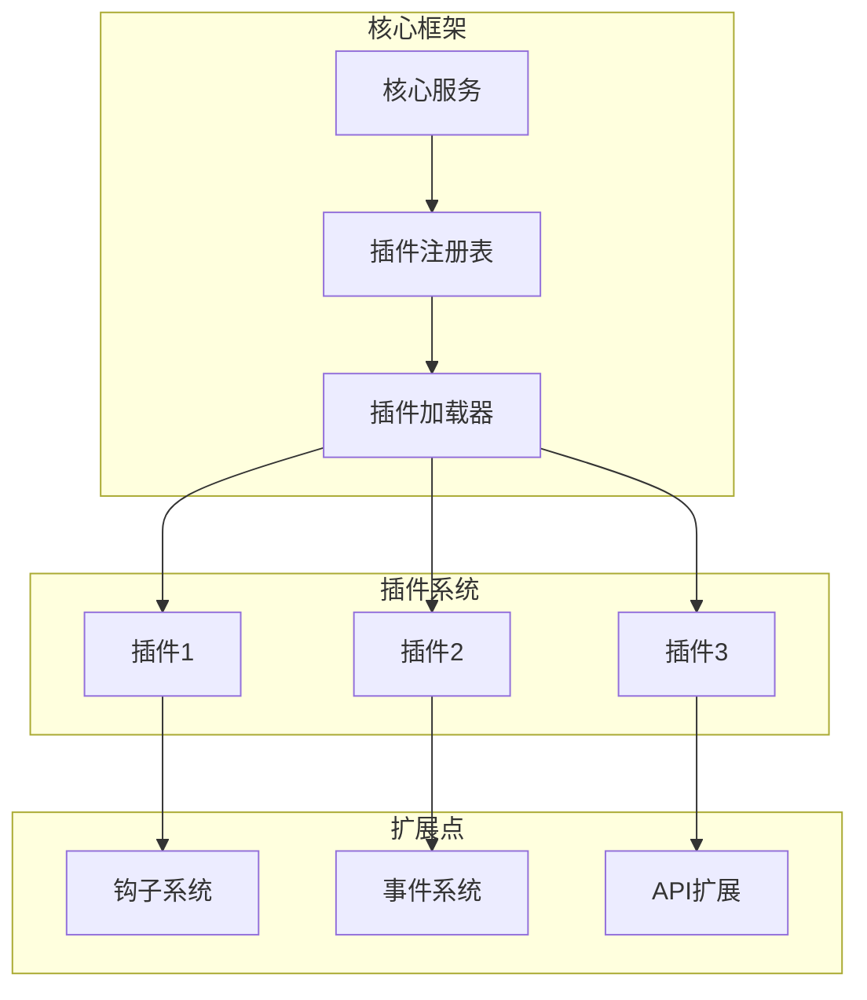

### 服务扩展点

主要的扩展点包括：

- **MCP服务器扩展**: 支持自定义MCP服务器
- **通知渠道扩展**: 支持多种通知方式
- **配置提供者扩展**: 支持不同配置源
- **日志处理器扩展**: 支持多种日志输出

### 插件开发指南

开发者可以通过以下方式扩展Cherry Studio：

1. **继承基类**: 继承相应的服务基类
2. **实现接口**: 实现必需的接口方法
3. **注册服务**: 在服务注册表中注册新服务
4. **配置管理**: 添加配置项和验证逻辑

这种设计使得Cherry Studio具有良好的可扩展性，能够适应不同的使用场景和需求变化。