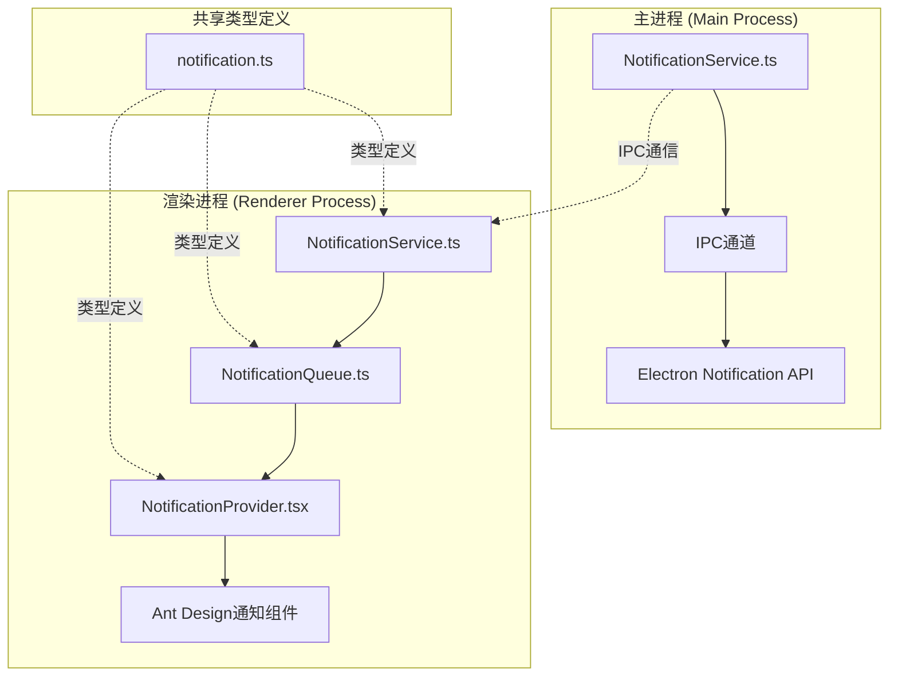
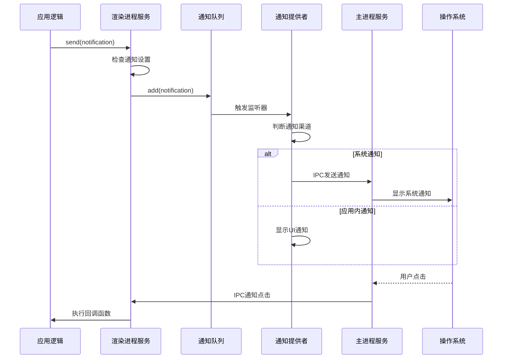
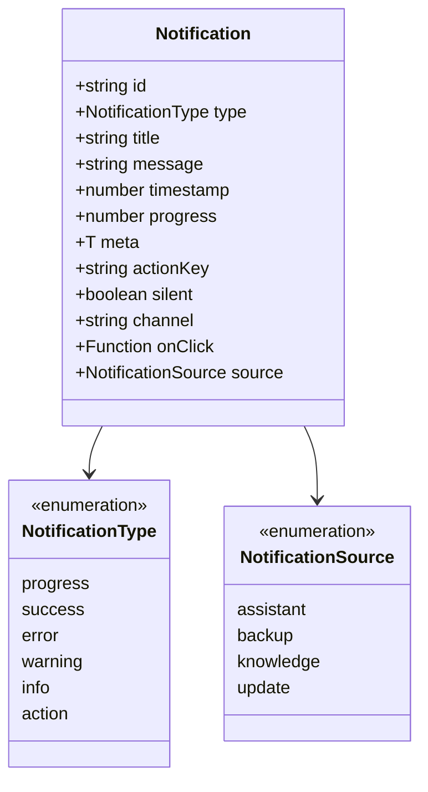
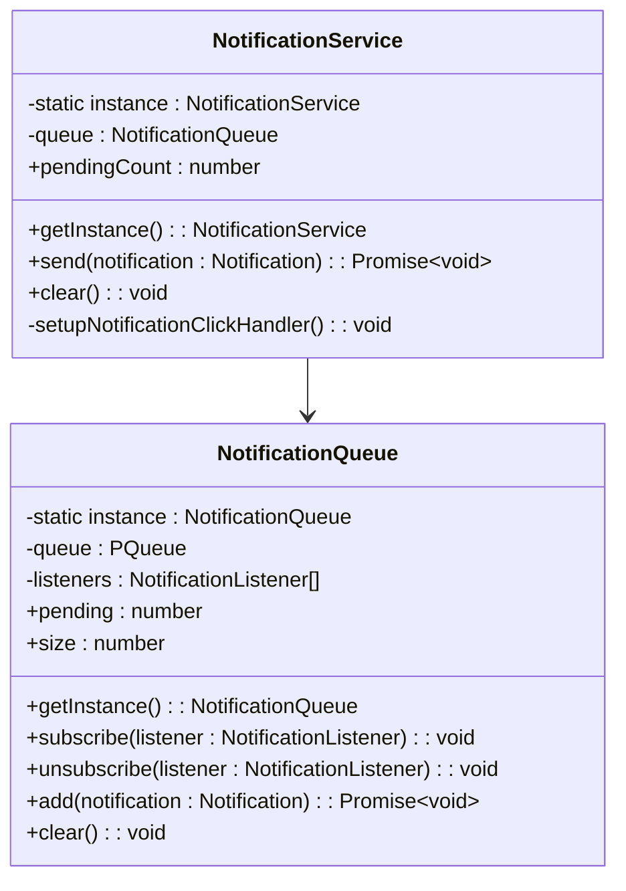
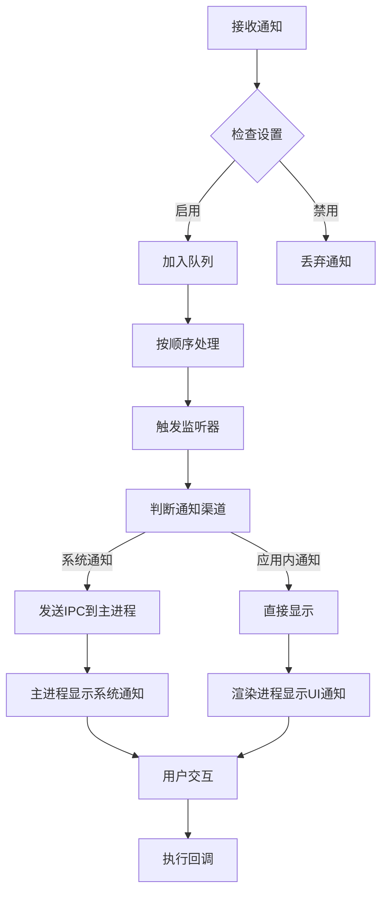
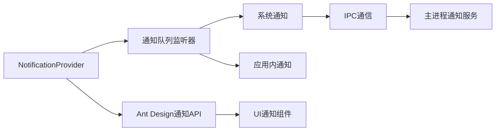
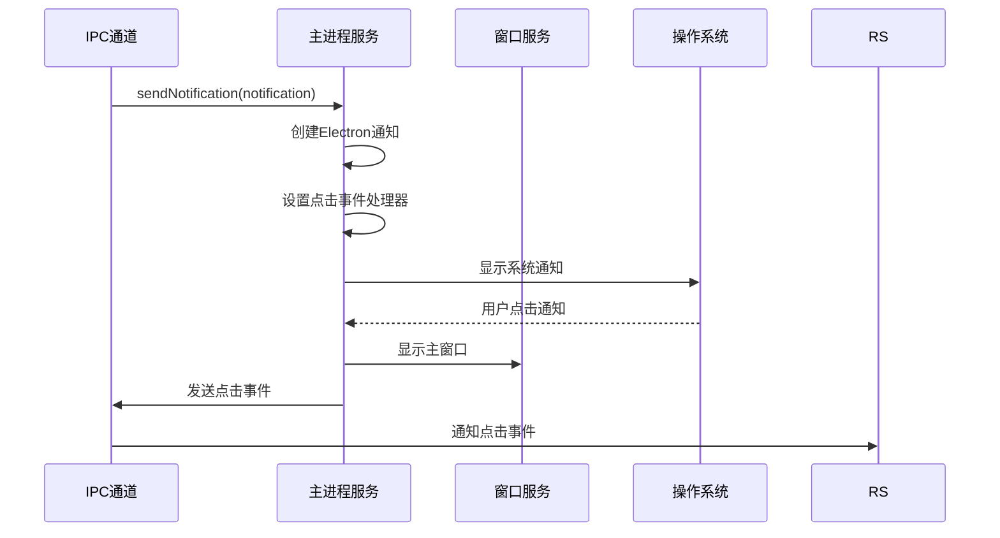
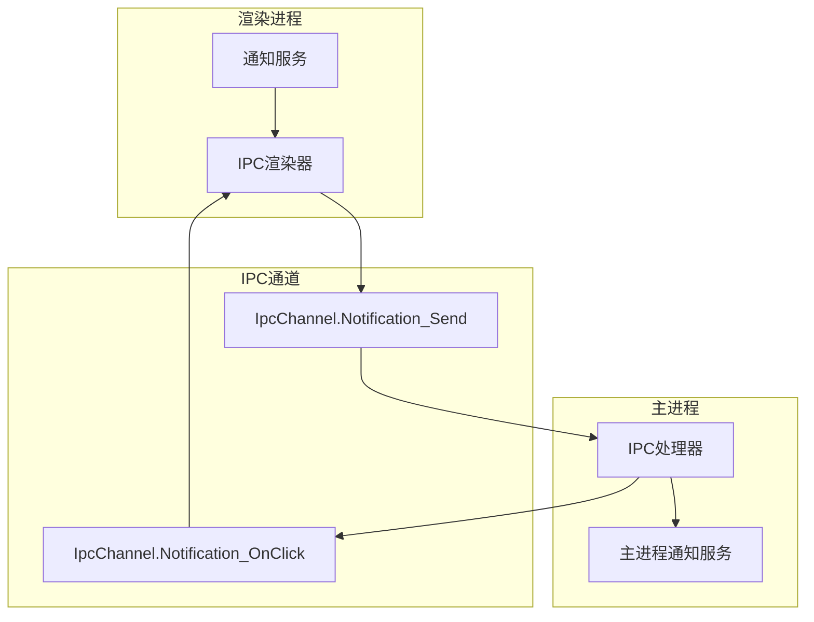
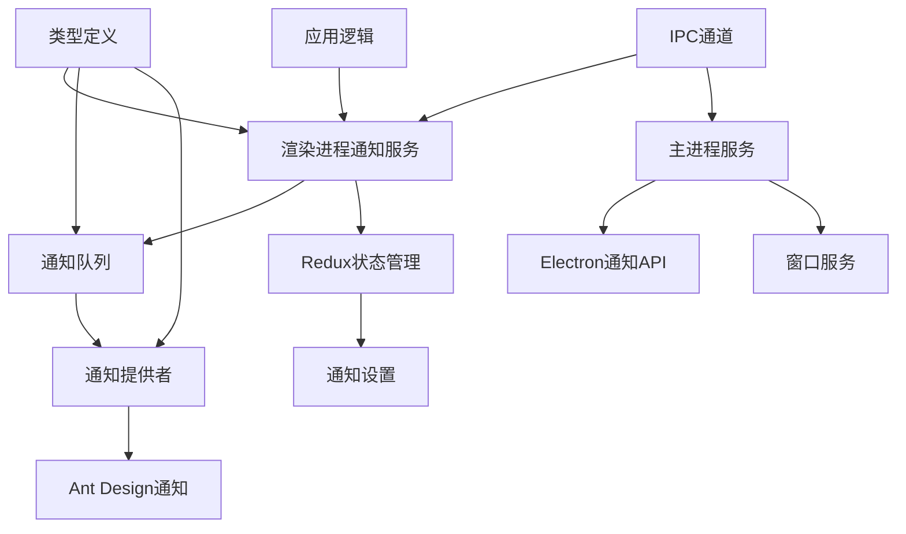

# Cherry Studio通知服务详细文档

<cite>
**本文档引用的文件**
- [NotificationService.ts](file://src/main/services/NotificationService.ts)
- [NotificationService.ts](file://src/renderer/src/services/NotificationService.ts)
- [NotificationQueue.ts](file://src/renderer/src/queue/NotificationQueue.ts)
- [NotificationProvider.tsx](file://src/renderer/src/context/NotificationProvider.tsx)
- [notification.ts](file://src/renderer/src/types/notification.ts)
- [ipc.ts](file://src/main/ipc.ts)
- [settings.ts](file://src/renderer/src/store/settings.ts)
- [GeneralSettings.tsx](file://src/renderer/src/pages/settings/GeneralSettings.tsx)
</cite>

## 目录
1. [简介](#简介)
2. [项目结构](#项目结构)
3. [核心组件](#核心组件)
4. [架构概览](#架构概览)
5. [详细组件分析](#详细组件分析)
6. [依赖关系分析](#依赖关系分析)
7. [性能考虑](#性能考虑)
8. [故障排除指南](#故障排除指南)
9. [结论](#结论)

## 简介

Cherry Studio的通知服务是一个高度模块化和可扩展的系统，负责处理应用程序内的所有通知功能。该服务采用事件驱动架构，支持桌面通知、应用内通知、通知队列管理以及跨进程通信。通知服务的核心目标是为用户提供及时、可靠且个性化的通知体验，同时保持系统的高性能和可维护性。

## 项目结构

通知服务的文件组织遵循清晰的分层架构：

**图表来源**
- [NotificationService.ts](file://src/main/services/NotificationService.ts#L1-L24)
- [NotificationService.ts](file://src/renderer/src/services/NotificationService.ts#L1-L61)
- [NotificationQueue.ts](file://src/renderer/src/queue/NotificationQueue.ts#L1-L53)

**章节来源**
- [NotificationService.ts](file://src/main/services/NotificationService.ts#L1-L24)
- [NotificationService.ts](file://src/renderer/src/services/NotificationService.ts#L1-L61)
- [NotificationQueue.ts](file://src/renderer/src/queue/NotificationQueue.ts#L1-L53)

## 核心组件

### 主进程通知服务

主进程中的通知服务负责与操作系统原生通知API交互，提供系统级通知功能。

### 渲染进程通知服务

渲染进程中的通知服务管理应用内通知，包括通知队列、状态管理和用户界面集成。

### 通知队列系统

基于PQueue的异步队列系统，确保通知按顺序处理并支持并发控制。

### 通知提供者

React上下文提供者，负责将通知状态传递给整个应用组件树。

**章节来源**
- [NotificationService.ts](file://src/main/services/NotificationService.ts#L6-L20)
- [NotificationService.ts](file://src/renderer/src/services/NotificationService.ts#L7-L60)
- [NotificationQueue.ts](file://src/renderer/src/queue/NotificationQueue.ts#L6-L52)

## 架构概览

通知服务采用分层架构设计，实现了清晰的职责分离和高效的跨进程通信：

**图表来源**
- [NotificationService.ts](file://src/renderer/src/services/NotificationService.ts#L27-L32)
- [NotificationQueue.ts](file://src/renderer/src/queue/NotificationQueue.ts#L29-L30)
- [NotificationProvider.tsx](file://src/renderer/src/context/NotificationProvider.tsx#L31-L50)
- [ipc.ts](file://src/main/ipc.ts#L480-L486)

## 详细组件分析

### 通知类型定义

通知服务定义了完整的通知类型系统，支持多种通知类型和来源：

**图表来源**
- [notification.ts](file://src/renderer/src/types/notification.ts#L4-L28)

#### 通知类型详解

| 类型 | 描述 | 使用场景 |
|------|------|----------|
| `progress` | 进度通知 | 长时间运行任务的进度更新 |
| `success` | 成功通知 | 操作成功完成的确认 |
| `error` | 错误通知 | 操作失败或异常情况 |
| `warning` | 警告通知 | 需要注意的重要信息 |
| `info` | 信息通知 | 一般性信息提示 |
| `action` | 动作通知 | 可点击的操作通知 |

#### 通知来源分类

| 来源 | 描述 | 典型用途 |
|------|------|----------|
| `assistant` | 助手相关通知 | AI对话完成、模型响应等 |
| `backup` | 备份相关通知 | 备份开始、完成、失败等 |
| `knowledge` | 知识库相关通知 | 文档嵌入、搜索等 |
| `update` | 更新相关通知 | 应用版本检查、下载等 |

**章节来源**
- [notification.ts](file://src/renderer/src/types/notification.ts#L1-L30)

### 渲染进程通知服务

渲染进程中的通知服务采用单例模式，提供统一的通知管理接口：

**图表来源**
- [NotificationService.ts](file://src/renderer/src/services/NotificationService.ts#L7-L60)
- [NotificationQueue.ts](file://src/renderer/src/queue/NotificationQueue.ts#L6-L52)

#### 服务特性

1. **单例模式**: 确保全局唯一的通知服务实例
2. **设置检查**: 自动检查用户通知设置，过滤不需要的通知
3. **事件处理**: 支持通知点击事件的回调处理
4. **队列管理**: 提供队列状态查询和清空功能

**章节来源**
- [NotificationService.ts](file://src/renderer/src/services/NotificationService.ts#L1-L61)

### 通知队列系统

通知队列系统基于PQueue实现，提供可靠的异步通知处理：

**图表来源**
- [NotificationQueue.ts](file://src/renderer/src/queue/NotificationQueue.ts#L29-L30)
- [NotificationProvider.tsx](file://src/renderer/src/context/NotificationProvider.tsx#L31-L50)

#### 队列特性

1. **并发控制**: 默认单线程并发，确保通知按顺序处理
2. **监听器模式**: 支持多个监听器订阅通知事件
3. **状态查询**: 提供队列状态的实时查询接口
4. **优雅清空**: 支持清空队列而不影响正在处理的通知

**章节来源**
- [NotificationQueue.ts](file://src/renderer/src/queue/NotificationQueue.ts#L1-L53)

### 通知提供者

通知提供者负责将通知状态集成到React应用中：

**图表来源**
- [NotificationProvider.tsx](file://src/renderer/src/context/NotificationProvider.tsx#L23-L76)

#### 提供者功能

1. **自动切换**: 根据应用焦点状态自动选择通知渠道
2. **类型映射**: 将通知类型映射到Ant Design的对应类型
3. **进度条显示**: 支持进度通知的进度条显示
4. **堆叠限制**: 限制同时显示的通知数量

**章节来源**
- [NotificationProvider.tsx](file://src/renderer/src/context/NotificationProvider.tsx#L1-L77)

### 主进程通知服务

主进程中的通知服务直接调用Electron的原生通知API：

**图表来源**
- [NotificationService.ts](file://src/main/services/NotificationService.ts#L7-L19)
- [ipc.ts](file://src/main/ipc.ts#L480-L486)

#### 主进程特性

1. **原生API**: 直接使用Electron的Notification API
2. **窗口管理**: 自动显示隐藏的主窗口
3. **事件转发**: 将用户交互事件转发回渲染进程
4. **跨平台兼容**: 支持不同操作系统的通知特性

**章节来源**
- [NotificationService.ts](file://src/main/services/NotificationService.ts#L1-L24)

### IPC通信机制

通知服务通过IPC通道实现主进程和渲染进程之间的通信：

**图表来源**
- [ipc.ts](file://src/main/ipc.ts#L480-L486)

**章节来源**
- [ipc.ts](file://src/main/ipc.ts#L480-L486)

## 依赖关系分析

通知服务的依赖关系展现了清晰的分层架构：

**图表来源**
- [NotificationService.ts](file://src/renderer/src/services/NotificationService.ts#L1-L5)
- [NotificationQueue.ts](file://src/renderer/src/queue/NotificationQueue.ts#L1-L2)
- [NotificationProvider.tsx](file://src/renderer/src/context/NotificationProvider.tsx#L1-L4)

### 关键依赖

1. **PQueue**: 异步队列管理
2. **Ant Design**: UI通知组件
3. **Redux**: 状态管理
4. **Electron**: 原生通知API
5. **IPC**: 进程间通信

**章节来源**
- [NotificationQueue.ts](file://src/renderer/src/queue/NotificationQueue.ts#L1-L2)
- [NotificationProvider.tsx](file://src/renderer/src/context/NotificationProvider.tsx#L1-L4)

## 性能考虑

### 队列性能优化

1. **单线程并发**: 防止通知乱序，确保用户体验一致性
2. **监听器模式**: 支持多个组件订阅通知，提高复用性
3. **内存管理**: 及时清理已完成的通知，防止内存泄漏

### 通知渠道优化

1. **智能切换**: 根据应用状态自动选择最优通知渠道
2. **批量处理**: 合并相似通知，减少系统资源消耗
3. **延迟加载**: 按需加载通知组件，提高启动性能

### 跨进程通信优化

1. **最小化传输**: 只传输必要的通知数据
2. **事件去重**: 避免重复的IPC消息
3. **错误恢复**: 实现通信失败的重试机制

## 故障排除指南

### 常见问题及解决方案

#### 通知不显示

**可能原因**:
1. 用户通知设置被禁用
2. 应用未获得系统通知权限
3. 通知队列阻塞

**解决步骤**:
1. 检查设置页面的通知配置
2. 验证应用的系统通知权限
3. 清空通知队列并重试

#### 通知点击无响应

**可能原因**:
1. IPC通信中断
2. 回调函数未正确绑定
3. 窗口状态异常

**解决步骤**:
1. 检查主进程和渲染进程的连接状态
2. 验证通知的onClick回调函数
3. 重新初始化窗口服务

#### 性能问题

**可能原因**:
1. 通知队列积压过多
2. 监听器过多导致内存泄漏
3. 频繁的通知发送

**解决步骤**:
1. 定期清理通知队列
2. 移除不再需要的监听器
3. 实现通知节流机制

**章节来源**
- [NotificationService.ts](file://src/renderer/src/services/NotificationService.ts#L30-L32)
- [NotificationQueue.ts](file://src/renderer/src/queue/NotificationQueue.ts#L35-L37)

## 结论

Cherry Studio的通知服务是一个设计精良、功能完备的通知管理系统。它通过分层架构实现了清晰的职责分离，通过事件驱动模式提供了灵活的通知处理能力，通过跨进程通信确保了系统的一致性。

### 主要优势

1. **模块化设计**: 清晰的组件分离，易于维护和扩展
2. **事件驱动**: 响应式架构，适应不同的通知需求
3. **跨平台支持**: 统一的API接口，支持多操作系统
4. **性能优化**: 合理的队列管理和资源控制
5. **用户体验**: 智能的通知渠道选择和状态管理

### 扩展建议

1. **通知模板**: 实现通知内容的模板化管理
2. **个性化配置**: 支持更细粒度的通知样式定制
3. **历史记录**: 添加通知历史查看功能
4. **推送集成**: 支持远程推送通知
5. **无障碍支持**: 增强对辅助技术的支持

通知服务为Cherry Studio提供了坚实的基础，支撑着整个应用的通知生态系统，是提升用户体验的重要组成部分。