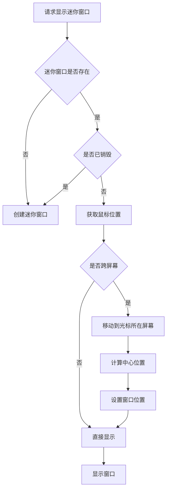
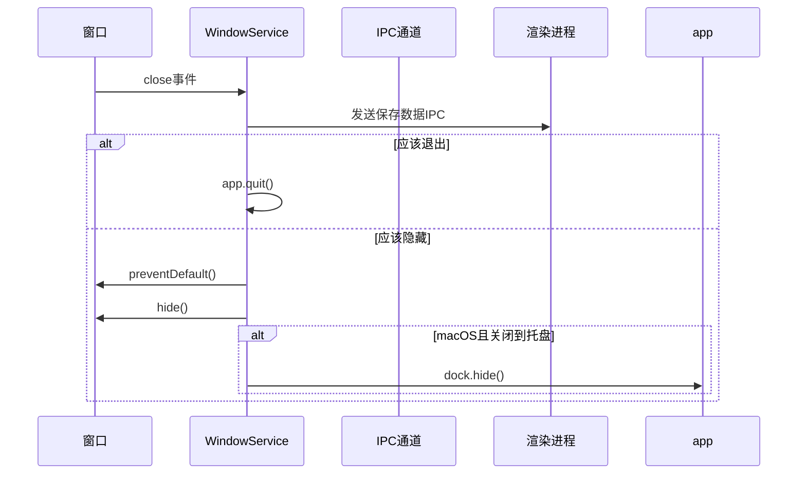
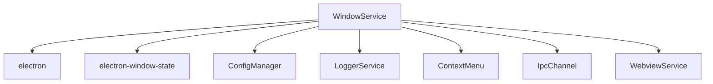

# 窗口管理

<cite>
**本文档引用的文件**
- [WindowService.ts](file://src/main/services/WindowService.ts)
- [windowUtil.ts](file://src/main/utils/windowUtil.ts)
- [miniWindow.html](file://src/renderer/miniWindow.html)
- [selectionToolbar.html](file://src/renderer/selectionToolbar.html)
- [traceWindow.html](file://src/renderer/traceWindow.html)
- [IpcChannel.ts](file://src/shared/IpcChannel.ts)
- [SelectionAssistantSettings.tsx](file://src/renderer/src/pages/settings/SelectionAssistantSettings/SelectionAssistantSettings.tsx)
- [useWindowSize.ts](file://src/renderer/src/hooks/useWindowSize.ts)
</cite>

## 目录
1. [简介](#简介)
2. [项目结构](#项目结构)
3. [核心组件](#核心组件)
4. [架构概述](#架构概述)
5. [详细组件分析](#详细组件分析)
6. [依赖分析](#依赖分析)
7. [性能考虑](#性能考虑)
8. [故障排除指南](#故障排除指南)
9. [结论](#结论)

## 简介
Cherry Studio窗口管理系统是一个基于Electron的复杂窗口管理解决方案，负责管理应用程序的所有窗口生命周期。该系统通过WindowService.ts核心服务类实现，支持主窗口、迷你窗口、选择工具栏窗口和追踪窗口等多种窗口类型。系统实现了跨平台的窗口管理策略，包括多显示器环境下的智能定位、响应式布局处理和内存优化技术。窗口管理系统还提供了丰富的配置选项，允许用户自定义窗口行为，如尺寸、位置、透明度和置顶状态等。

## 项目结构
Cherry Studio的窗口管理相关文件分布在多个目录中，形成了清晰的架构层次。主窗口管理逻辑位于src/main/services/WindowService.ts，而各种特殊窗口的HTML模板则存放在src/renderer/目录下。工具类和辅助函数分布在src/main/utils/和src/renderer/src/utils/目录中。这种分离的设计模式使得窗口管理逻辑与界面表现层解耦，提高了代码的可维护性和可扩展性。

```mermaid
graph TD
subgraph "主进程"
A[WindowService.ts] --> B[windowUtil.ts]
A --> C[ConfigManager]
A --> D[ContextMenu]
end
subgraph "渲染进程"
E[miniWindow.html] --> F[entryPoint.tsx]
G[selectionToolbar.html] --> H[entryPoint.tsx]
I[traceWindow.html] --> J[traceWindow.tsx]
end
A < --> K[IpcChannel]
K < --> L[Renderer]
```

**Diagram sources**
- [WindowService.ts](file://src/main/services/WindowService.ts)
- [miniWindow.html](file://src/renderer/miniWindow.html)
- [selectionToolbar.html](file://src/renderer/selectionToolbar.html)
- [traceWindow.html](file://src/renderer/traceWindow.html)

**Section sources**
- [WindowService.ts](file://src/main/services/WindowService.ts)
- [windowUtil.ts](file://src/main/utils/windowUtil.ts)

## 核心组件
窗口管理系统的核心是WindowService类，它采用单例模式确保全局唯一实例。该服务管理着主窗口、迷你窗口等主要窗口实例，并提供创建、显示、隐藏和销毁窗口的统一接口。系统通过electron-window-state库持久化窗口状态，包括位置、尺寸和最大化状态。对于不同平台，系统实现了差异化的窗口行为：在macOS上使用原生标题栏样式，在Windows和Linux上使用无边框窗口配合自定义控件。

**Section sources**
- [WindowService.ts](file://src/main/services/WindowService.ts#L25-L685)
- [windowUtil.ts](file://src/main/utils/windowUtil.ts#L1-L78)

## 架构概述
Cherry Studio窗口管理系统的架构基于Electron的主进程-渲染进程模型，通过IPC（进程间通信）机制实现双向通信。主进程负责窗口的创建和生命周期管理，而渲染进程负责界面渲染和用户交互。系统采用分层设计，上层为窗口服务接口，中层为窗口管理逻辑，底层为Electron原生API调用。这种架构确保了窗口管理的稳定性和跨平台兼容性。


**Diagram sources**
- [WindowService.ts](file://src/main/services/WindowService.ts)
- [IpcChannel.ts](file://src/shared/IpcChannel.ts)

## 详细组件分析

### 主窗口管理
主窗口是Cherry Studio的核心界面，负责展示应用程序的主要功能。WindowService通过createMainWindow方法创建主窗口，该方法实现了多重检查机制：如果主窗口已存在则直接显示，否则创建新窗口。窗口配置包括最小尺寸限制、透明度设置和振动效果等。系统还实现了窗口状态持久化，使用windowStateKeeper保存和恢复窗口的位置和大小。

**Section sources**
- [WindowService.ts](file://src/main/services/WindowService.ts#L43-L119)

### 迷你窗口管理
迷你窗口是一种轻量级的浮动窗口，用于快速访问助手功能。createMiniWindow方法创建迷你窗口，其特点是始终置顶、无任务栏显示和面板样式。窗口在macOS上使用'panel'类型，在Windows和Linux上使用无边框设计。系统实现了智能定位策略，当显示迷你窗口时，会自动将其定位到鼠标光标所在的屏幕中心，确保在多显示器环境下也能正确显示。

#### 窗口事件处理流程


**Diagram sources**
- [WindowService.ts](file://src/main/services/WindowService.ts#L472-L622)

### 选择工具栏窗口
选择工具栏窗口是一种特殊的浮动窗口，用于在用户选择文本时提供上下文操作。该窗口具有透明背景和无边框设计，通过CSS的user-select:none属性防止自身被选择。窗口尺寸设置为max-content和fit-content，确保只占用必要空间。系统通过selectionToolbar.html模板定义窗口结构，支持动态内容加载和交互。

**Section sources**
- [selectionToolbar.html](file://src/renderer/selectionToolbar.html)
- [SelectionAssistantSettings.tsx](file://src/renderer/src/pages/settings/SelectionAssistantSettings/SelectionAssistantSettings.tsx)

### 追踪窗口
追踪窗口用于展示AI处理过程的详细信息，具有独立的布局和样式。窗口通过traceWindow.html模板定义，包含一个flex布局的主体区域和固定高度的页脚。系统支持动态设置窗口标题，通过IPC通道与主进程通信。窗口设计考虑了可访问性，使用语义化的HTML标签和适当的对比度。

**Section sources**
- [traceWindow.html](file://src/renderer/traceWindow.html)

### 窗口事件监听机制
窗口管理系统实现了全面的事件监听机制，覆盖窗口生命周期的各个阶段。系统监听ready-to-show、enter-full-screen、leave-full-screen等事件，并通过IPC通道通知渲染进程。对于关闭事件，系统实现了优雅关闭逻辑：先保存数据，然后根据平台和配置决定是隐藏到托盘还是完全退出。焦点变化事件通过wasMainWindowFocused变量跟踪，确保在迷你窗口隐藏后能正确恢复主窗口的焦点状态。



**Diagram sources**
- [WindowService.ts](file://src/main/services/WindowService.ts#L339-L388)

## 依赖分析
窗口管理系统依赖于多个Electron核心模块和第三方库。主要依赖包括electron模块提供的BrowserWindow、screen、app等API，electron-window-state用于窗口状态持久化，以及@shared/IpcChannel定义的IPC通信通道。系统还依赖于ConfigManager获取用户配置，LoggerService记录运行日志，ContextMenu提供右键菜单功能。这些依赖关系通过清晰的导入语句管理，确保了代码的模块化和可测试性。



**Diagram sources**
- [WindowService.ts](file://src/main/services/WindowService.ts#L1-L20)

## 性能考虑
窗口管理系统在设计时充分考虑了性能优化。系统实现了渲染进程崩溃恢复机制，当检测到渲染进程崩溃时，会根据崩溃频率决定是重新加载还是退出应用。对于窗口大小调整，系统在Windows和macOS上使用will-resize事件，在Linux上使用resize事件，避免了已知的缩放因子问题。系统还实现了防抖处理，避免频繁的窗口大小变化事件导致性能下降。内存管理方面，系统在窗口关闭时及时清理引用，防止内存泄漏。

## 故障排除指南
常见的窗口管理问题包括窗口定位错误、透明度失效和焦点管理异常。对于多显示器环境下的定位问题，应检查screen.getDisplayNearestPoint的返回值是否正确。透明度问题通常与平台特定的配置有关，macOS需要设置transparent:true，而其他平台则不需要。焦点管理异常可能是由于wasMainWindowFocused变量未正确更新导致，应确保在显示和隐藏迷你窗口时正确维护该状态。渲染进程崩溃时，系统会自动尝试恢复，如果连续崩溃则建议重启应用。

**Section sources**
- [WindowService.ts](file://src/main/services/WindowService.ts#L134-L146)
- [windowUtil.ts](file://src/main/utils/windowUtil.ts#L21-L74)

## 结论
Cherry Studio的窗口管理系统是一个功能完善、设计精良的Electron应用窗口管理解决方案。系统通过WindowService核心类统一管理各种窗口的生命周期，实现了跨平台的兼容性和一致性。丰富的配置选项和智能的定位策略提升了用户体验，而全面的事件处理和错误恢复机制确保了系统的稳定性。未来可以进一步优化窗口动画效果，增加更多的窗口类型支持，并完善窗口间的通信机制。