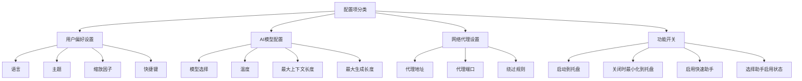
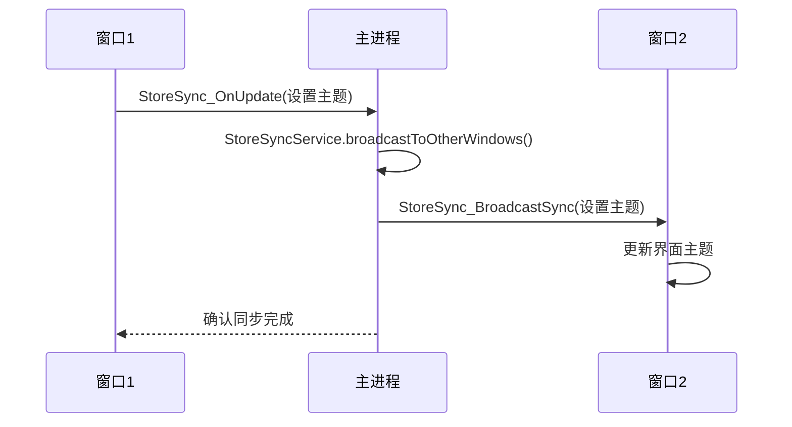
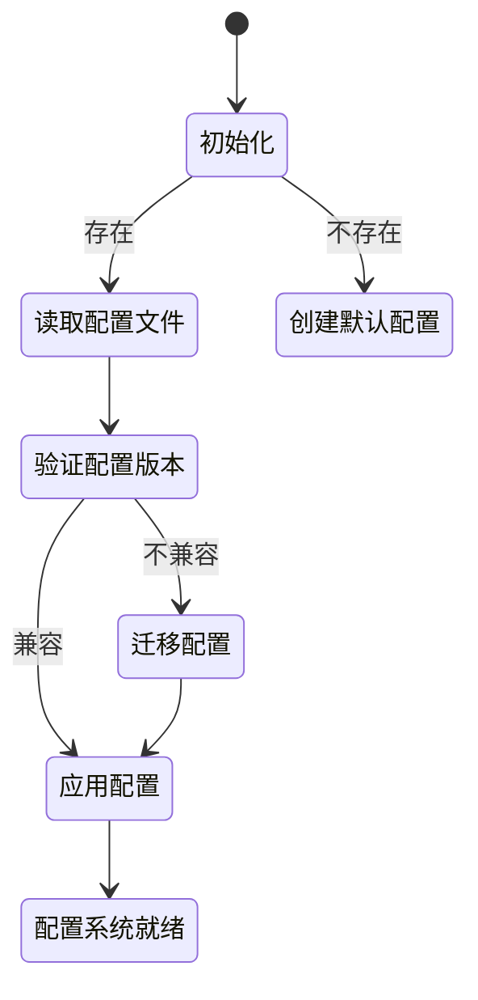
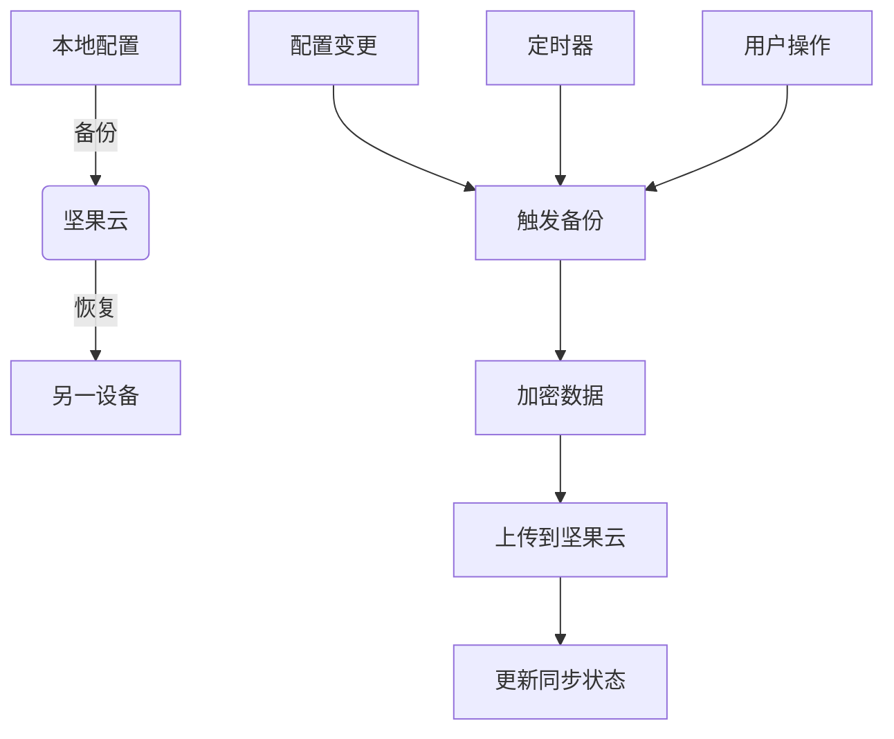
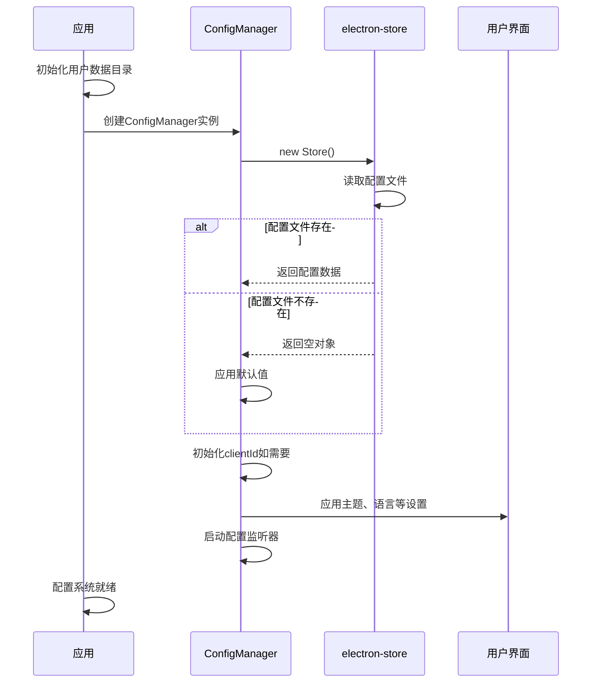

# 配置管理

<cite>
**本文档引用的文件**  
- [ConfigManager.ts](file://src/main/services/ConfigManager.ts)
- [constant.ts](file://packages/shared/config/constant.ts)
- [types.ts](file://packages/shared/config/types.ts)
- [StoreSyncService.ts](file://src/main/services/StoreSyncService.ts)
- [nutstore.ts](file://src/renderer/src/store/nutstore.ts)
- [NutstoreService.ts](file://src/renderer/src/services/NutstoreService.ts)
- [bootstrap.ts](file://src/main/bootstrap.ts)
</cite>

## 目录
1. [简介](#简介)
2. [配置存储与持久化](#配置存储与持久化)
3. [配置项分类管理](#配置项分类管理)
4. [配置变更监听与广播机制](#配置变更监听与广播机制)
5. [默认值管理与版本兼容性](#默认值管理与版本兼容性)
6. [配置数据验证与错误恢复](#配置数据验证与错误恢复)
7. [配置同步与多设备一致性](#配置同步与多设备一致性)
8. [配置加载时序图](#配置加载时序图)
9. [备份与恢复机制](#备份与恢复机制)
10. [结论](#结论)

## 简介

Cherry Studio的配置管理系统是一个基于Electron架构的全局配置管理解决方案，通过`ConfigManager.ts`实现配置的持久化存储、读取和更新。系统采用模块化设计，支持用户偏好设置、AI模型配置、网络代理设置等多种配置类型，并通过事件订阅机制确保渲染进程能够实时响应配置变化。配置数据存储在用户数据目录中，采用JSON格式进行序列化，并通过Redux状态管理实现跨窗口同步。系统还支持配置的默认值管理、迁移策略和版本兼容性处理，确保用户在不同版本间平滑过渡。

**Section sources**
- [ConfigManager.ts](file://src/main/services/ConfigManager.ts#L1-L270)
- [constant.ts](file://packages/shared/config/constant.ts#L1-L486)

## 配置存储与持久化

Cherry Studio的配置管理系统使用`electron-store`库实现配置的持久化存储。`ConfigManager`类封装了对`Store`实例的访问，提供类型安全的get和set方法。配置文件默认存储在操作系统特定的用户数据目录中，如macOS的`~/Library/Application Support/Cherry Studio`或Windows的`%APPDATA%\Cherry Studio`。配置数据以JSON格式存储，支持嵌套对象和复杂数据结构。

配置管理器通过`ConfigKeys`枚举定义了所有可配置项的键名，确保类型安全和代码可维护性。每个配置项都有明确的类型定义，如`LanguageVarious`、`ThemeMode`等，通过泛型方法`get<T>`和`set`实现类型推断。对于布尔类型的配置项，系统提供了默认值处理，如`getLaunchToTray()`方法默认返回`false`。

```mermaid
classDiagram
class ConfigManager {
-store : Store
-subscribers : Map<string, Array<(newValue : any) => void>>
+getLanguage() : LanguageVarious
+setLanguage(lang : LanguageVarious) : void
+getTheme() : ThemeMode
+setTheme(theme : ThemeMode) : void
+getLaunchToTray() : boolean
+setLaunchToTray(value : boolean) : void
+getTray() : boolean
+setTray(value : boolean) : void
+getZoomFactor() : number
+setZoomFactor(factor : number) : void
+subscribe(key : string, callback : (newValue : any) => void) : void
+unsubscribe(key : string, callback : (newValue : any) => void) : void
+set(key : string, value : unknown, isNotify : boolean) : void
+get<T>(key : string, defaultValue? : T) : T
}
class Store {
+set(key : string, value : any) : void
+get(key : string, defaultValue? : any) : any
}
ConfigManager --> Store : "uses"
```

**Diagram sources**
- [ConfigManager.ts](file://src/main/services/ConfigManager.ts#L37-L269)
- [types.ts](file://packages/shared/config/types.ts#L1-L47)

**Section sources**
- [ConfigManager.ts](file://src/main/services/ConfigManager.ts#L1-L270)
- [constant.ts](file://packages/shared/config/constant.ts#L193-L194)

## 配置项分类管理

Cherry Studio的配置系统将配置项分为多个类别进行管理，包括用户偏好设置、AI模型配置、网络代理设置等。用户偏好设置包含语言、主题、缩放因子、快捷键等界面相关配置。AI模型配置管理大语言模型的参数和行为，如模型选择、温度、最大上下文长度等。网络代理设置支持HTTP/HTTPS代理配置，包括代理地址、端口和绕过规则。

配置项通过`ConfigKeys`枚举进行分类组织，如`ConfigKeys.Language`、`ConfigKeys.Theme`、`ConfigKeys.ZoomFactor`等。系统还支持特定功能的配置，如选择助手（Selection Assistant）的触发模式、过滤列表等。对于开发者模式，系统提供了`EnableDeveloperMode`配置项，允许启用调试功能和高级选项。



**Diagram sources**
- [ConfigManager.ts](file://src/main/services/ConfigManager.ts#L11-L35)
- [constant.ts](file://packages/shared/config/constant.ts#L158-L188)

**Section sources**
- [ConfigManager.ts](file://src/main/services/ConfigManager.ts#L45-L234)
- [constant.ts](file://packages/shared/config/constant.ts#L158-L188)

## 配置变更监听与广播机制

Cherry Studio的配置管理系统实现了高效的配置变更监听和广播机制。`ConfigManager`类维护一个`subscribers`映射，存储每个配置键对应的回调函数数组。当配置项发生变化时，系统通过`notifySubscribers`方法通知所有订阅者。`setAndNotify`方法在设置配置值的同时触发通知，确保相关组件能够及时更新。

在渲染进程中，系统通过`StoreSyncService`实现跨窗口的配置同步。该服务使用Redux状态管理，通过IPC通信在主进程和渲染进程之间传递配置变更。当一个窗口修改配置时，变更会通过`StoreSync_OnUpdate` IPC通道广播到其他窗口，确保所有界面保持一致。系统还添加了元数据`fromSync`来防止无限同步循环。



**Diagram sources**
- [ConfigManager.ts](file://src/main/services/ConfigManager.ts#L94-L116)
- [StoreSyncService.ts](file://src/main/services/StoreSyncService.ts#L1-L134)

**Section sources**
- [ConfigManager.ts](file://src/main/services/ConfigManager.ts#L94-L116)
- [StoreSyncService.ts](file://src/main/services/StoreSyncService.ts#L1-L134)

## 默认值管理与版本兼容性

Cherry Studio的配置管理系统内置了完善的默认值管理和版本兼容性处理机制。每个`get`方法都支持提供默认值参数，如`getLanguage()`方法在没有用户设置时返回`app.getLocale()`或`defaultLanguage`。对于布尔类型的配置项，系统提供了明确的默认值，如`getLaunchToTray()`默认返回`false`。

系统通过`UpgradeChannel`枚举管理不同版本通道（最新稳定版、公测版、预览版），确保配置在不同版本间兼容。当应用升级时，系统会检查配置的兼容性，并根据需要进行迁移。`getClientId()`方法在首次运行时生成UUID并存储，确保每个安装实例都有唯一的标识符，同时保持向后兼容。



**Diagram sources**
- [ConfigManager.ts](file://src/main/services/ConfigManager.ts#L45-L48)
- [constant.ts](file://packages/shared/config/constant.ts#L205-L209)

**Section sources**
- [ConfigManager.ts](file://src/main/services/ConfigManager.ts#L45-L257)
- [constant.ts](file://packages/shared/config/constant.ts#L205-L209)

## 配置数据验证与错误恢复

Cherry Studio的配置管理系统实现了配置数据的验证和错误恢复机制。系统通过类型定义和默认值确保配置数据的完整性。当读取配置时，如果配置项不存在或类型不匹配，系统会返回默认值而不是抛出错误。对于关键配置项，如`clientId`，系统在首次运行时生成并存储，确保数据的持久性。

在配置写入过程中，系统依赖`electron-store`的原子写入机制，防止配置文件损坏。如果配置文件损坏或无法读取，系统会创建新的默认配置文件，确保应用能够正常启动。对于网络相关的配置，如代理设置，系统提供了`byPassRules`默认值，确保基本的网络连接功能。

**Section sources**
- [ConfigManager.ts](file://src/main/services/ConfigManager.ts#L259-L266)
- [constant.ts](file://packages/shared/config/constant.ts#L223-L224)

## 配置同步与多设备一致性

Cherry Studio通过坚果云（Nutstore）集成实现多设备间的配置同步。`NutstoreService`提供备份和恢复功能，将本地配置和数据同步到云端。用户可以在设置中配置坚果云令牌、同步路径和自动同步间隔。系统支持手动备份和自动定时备份，确保数据的最新状态。

同步过程中，系统会加密敏感信息，如坚果云令牌，确保数据安全。每次备份都会生成时间戳命名的文件，支持版本管理。用户可以查看最近的同步时间、状态和错误信息。通过`setNutstoreAutoSync`和`setNutstoreSyncInterval`配置项，用户可以控制自动同步的行为。



**Diagram sources**
- [NutstoreService.ts](file://src/renderer/src/services/NutstoreService.ts#L1-L298)
- [nutstore.ts](file://src/renderer/src/store/nutstore.ts#L1-L70)

**Section sources**
- [NutstoreService.ts](file://src/renderer/src/services/NutstoreService.ts#L1-L298)
- [nutstore.ts](file://src/renderer/src/store/nutstore.ts#L1-L70)

## 配置加载时序图

Cherry Studio的配置加载流程在应用启动时自动执行。系统首先初始化用户数据目录，然后创建`ConfigManager`实例。配置管理器读取持久化存储中的配置文件，如果文件不存在则创建默认配置。系统根据配置初始化界面主题、语言等设置，并启动配置监听器。



**Diagram sources**
- [bootstrap.ts](file://src/main/bootstrap.ts#L1-L34)
- [ConfigManager.ts](file://src/main/services/ConfigManager.ts#L41-L43)

**Section sources**
- [bootstrap.ts](file://src/main/bootstrap.ts#L1-L34)
- [ConfigManager.ts](file://src/main/services/ConfigManager.ts#L41-L43)

## 备份与恢复机制

Cherry Studio的备份与恢复机制通过`BackupService`和`NutstoreService`实现。系统支持将应用数据备份到坚果云，包括配置、笔记、知识库等。备份文件采用JSON格式，包含时间戳和版本信息。用户可以手动触发备份，或设置自动定时备份。

恢复过程从坚果云下载指定的备份文件，解密后应用到本地。系统会验证备份文件的完整性，然后逐步恢复各项数据。对于配置数据，系统会合并现有配置和备份配置，确保用户设置不丢失。备份管理器允许用户查看、删除和恢复历史备份，支持最多保留指定数量的备份文件。

**Section sources**
- [NutstoreService.ts](file://src/renderer/src/services/NutstoreService.ts#L89-L130)
- [NutstoreSettings.tsx](file://src/renderer/src/pages/settings/DataSettings/NutstoreSettings.tsx#L36-L397)

## 结论

Cherry Studio的配置管理系统是一个功能完整、设计合理的全局配置解决方案。系统通过`ConfigManager`类提供类型安全的配置访问接口，使用`electron-store`实现持久化存储。配置变更通过事件订阅和Redux同步机制实时传播到所有渲染进程。系统支持多设备同步，通过坚果云集成确保数据一致性。完善的默认值管理、版本兼容性和错误恢复机制保证了系统的稳定性和用户体验。整体架构清晰，易于维护和扩展，为Cherry Studio的功能提供了坚实的基础。