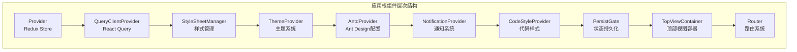
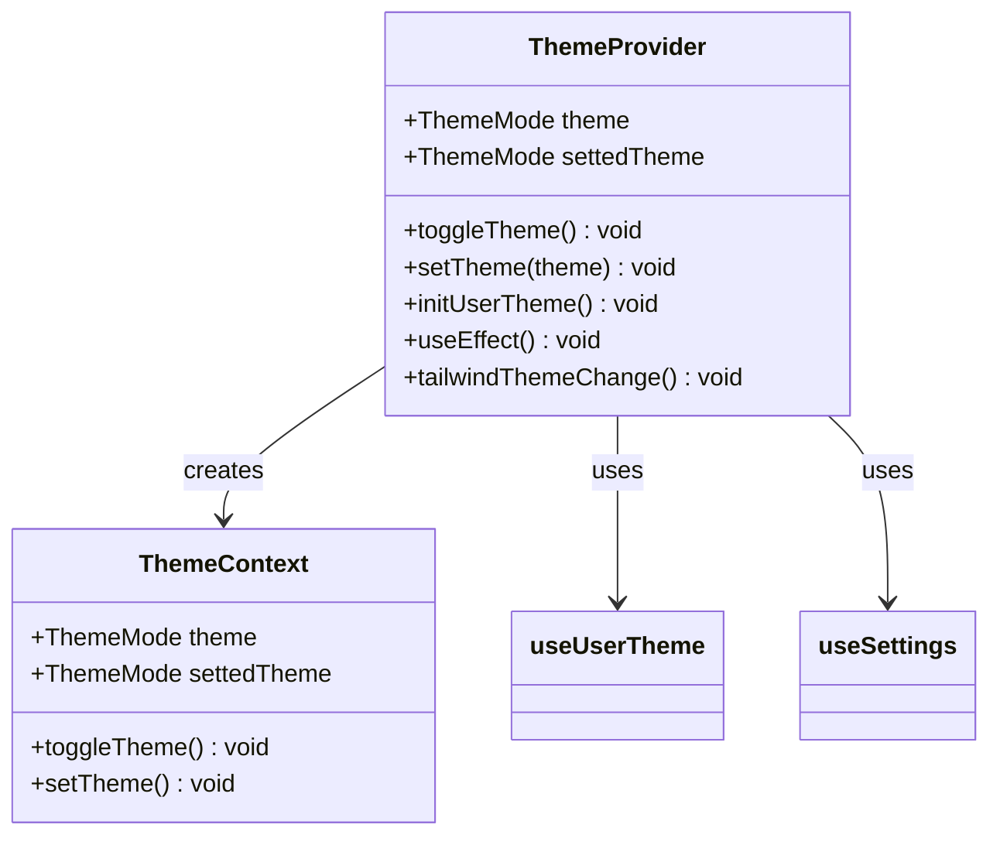
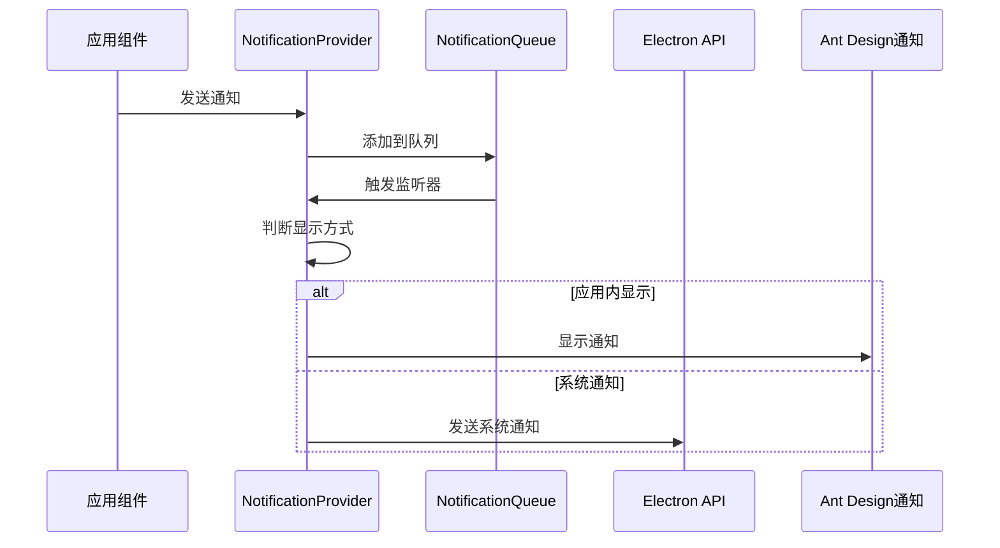
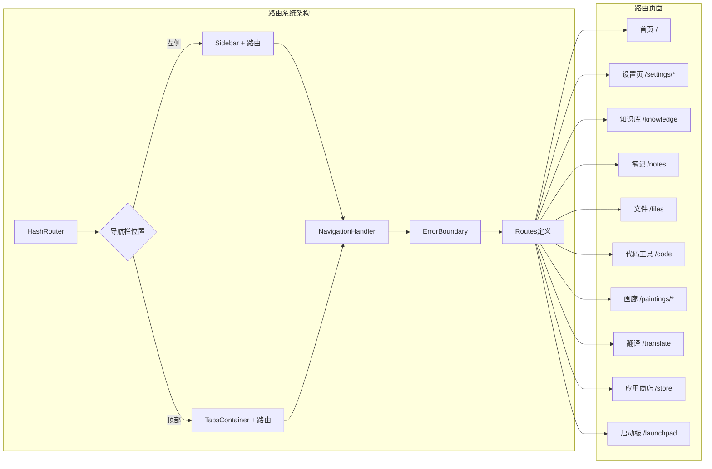
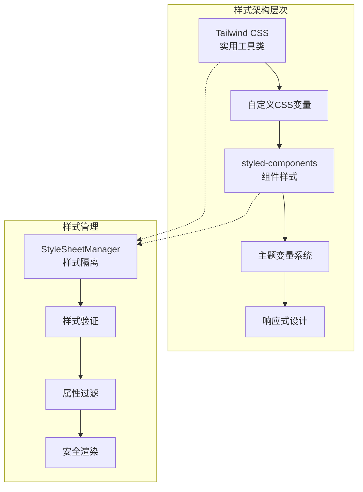
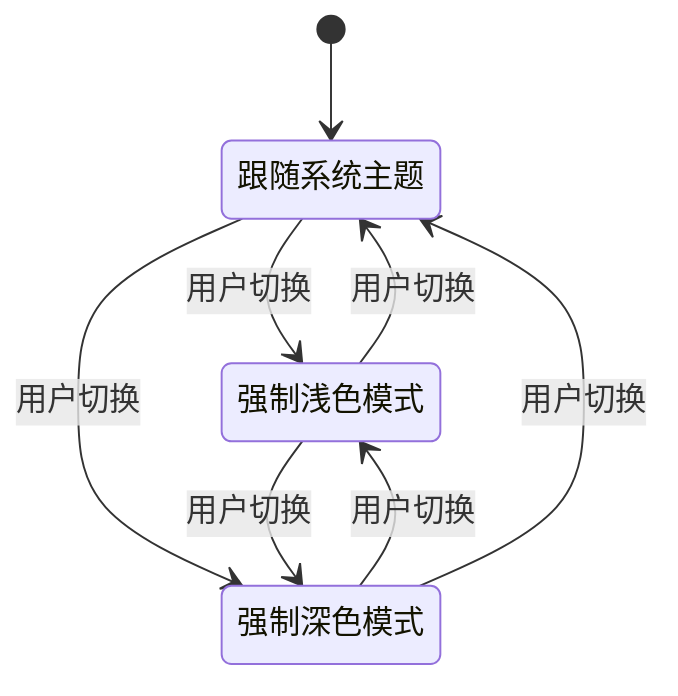
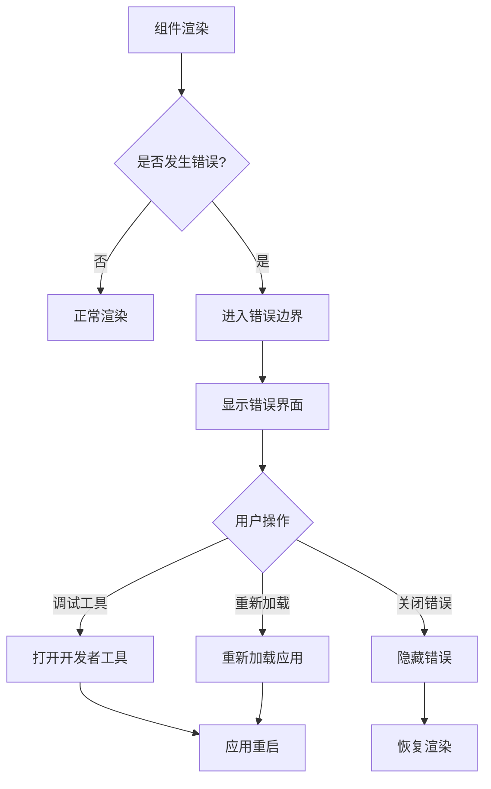

# UI框架与路由

<cite>
**本文档中引用的文件**
- [App.tsx](file://src/renderer/src/App.tsx)
- [Router.tsx](file://src/renderer/src/Router.tsx)
- [ThemeProvider.tsx](file://src/renderer/src/context/ThemeProvider.tsx)
- [NotificationProvider.tsx](file://src/renderer/src/context/NotificationProvider.tsx)
- [AntdProvider.tsx](file://src/renderer/src/context/AntdProvider.tsx)
- [CodeStyleProvider.tsx](file://src/renderer/src/context/CodeStyleProvider.tsx)
- [StyleSheetManager.tsx](file://src/renderer/src/context/StyleSheetManager.tsx)
- [ErrorBoundary.tsx](file://src/renderer/src/components/ErrorBoundary.tsx)
- [HomePage.tsx](file://src/renderer/src/pages/home/HomePage.tsx)
- [SettingsPage.tsx](file://src/renderer/src/pages/settings/SettingsPage.tsx)
- [KnowledgePage.tsx](file://src/renderer/src/pages/knowledge/KnowledgePage.tsx)
- [index.css](file://src/renderer/src/assets/styles/index.css)
- [tailwind.css](file://src/renderer/src/assets/styles/tailwind.css)
</cite>

## 目录
1. [简介](#简介)
2. [应用根组件架构](#应用根组件架构)
3. [全局上下文提供者](#全局上下文提供者)
4. [路由系统设计](#路由系统设计)
5. [CSS-in-JS样式架构](#css-in-js样式架构)
6. [主题系统实现](#主题系统实现)
7. [路由守卫与错误处理](#路由守卫与错误处理)
8. [最佳实践示例](#最佳实践示例)
9. [总结](#总结)

## 简介

Cherry Studio采用现代化的React UI框架架构，基于TypeScript构建，实现了完整的前端应用结构。该框架集成了多种先进的技术栈，包括React Query、Redux、Ant Design、Tailwind CSS等，为开发者提供了强大而灵活的用户界面解决方案。

## 应用根组件架构

### App.tsx核心结构

App.tsx作为整个应用的根组件，采用了多层次的上下文提供者嵌套结构，确保了应用状态的统一管理和组件间的通信。



**图表来源**
- [App.tsx](file://src/renderer/src/App.tsx#L32-L51)

### 核心依赖注入

应用初始化过程中，建立了完整的依赖注入链：

1. **状态管理**：Redux Store与PersistGate确保状态的持久化存储
2. **数据获取**：React Query客户端提供缓存和数据同步功能
3. **样式管理**：StyleSheetManager处理styled-components的样式隔离
4. **主题系统**：ThemeProvider管理全局主题切换
5. **UI组件**：AntdProvider配置Ant Design组件库
6. **通知系统**：NotificationProvider处理应用内和系统通知
7. **代码高亮**：CodeStyleProvider提供代码语法高亮功能

**章节来源**
- [App.tsx](file://src/renderer/src/App.tsx#L1-L56)

## 全局上下文提供者

### ThemeProvider - 主题系统

ThemeProvider是应用的核心主题管理组件，负责维护和切换明暗主题模式。



**图表来源**
- [ThemeProvider.tsx](file://src/renderer/src/context/ThemeProvider.tsx#L9-L21)

#### 主题切换机制

主题系统支持三种模式：浅色模式、深色模式和系统跟随模式。通过状态管理和事件监听实现动态切换：

- **状态管理**：维护实际主题和设置主题两个状态
- **模式切换**：循环切换light → dark → system → light
- **系统集成**：监听操作系统主题变化
- **持久化**：主题设置保存到应用配置

### NotificationProvider - 通知系统

NotificationProvider实现了统一的通知管理系统，支持应用内通知和系统通知。



**图表来源**
- [NotificationProvider.tsx](file://src/renderer/src/context/NotificationProvider.tsx#L32-L54)

#### 通知特性

1. **智能显示**：根据应用焦点状态选择显示方式
2. **队列管理**：支持多个通知的队列处理
3. **进度显示**：支持带进度条的长时间任务通知
4. **分类管理**：按类型（info、success、warning、error）区分通知样式

### AntdProvider - Ant Design配置

AntdProvider为整个应用提供Ant Design组件库的统一配置。

#### 配置特性

- **主题适配**：根据当前主题自动调整组件样式
- **多语言支持**：支持多种语言环境
- **组件定制**：统一配置常用组件的默认属性
- **算法支持**：支持明暗两种主题算法

**章节来源**
- [ThemeProvider.tsx](file://src/renderer/src/context/ThemeProvider.tsx#L1-L96)
- [NotificationProvider.tsx](file://src/renderer/src/context/NotificationProvider.tsx#L1-L77)
- [AntdProvider.tsx](file://src/renderer/src/context/AntdProvider.tsx#L1-L150)

## 路由系统设计

### Router.tsx架构

Router组件实现了基于React Router的路由系统，支持多种导航布局和页面组织方式。



**图表来源**
- [Router.tsx](file://src/renderer/src/Router.tsx#L25-L68)

### 路由配置详解

#### 主要路由页面

| 路由路径 | 页面组件 | 功能描述 |
|---------|----------|----------|
| `/` | HomePage | 主聊天界面，支持多助手和话题切换 |
| `/settings/*` | SettingsPage | 设置中心，包含多个子设置页面 |
| `/knowledge` | KnowledgePage | 知识库管理界面 |
| `/notes` | NotesPage | 笔记管理界面 |
| `/files` | FilesPage | 文件管理界面 |
| `/code` | CodeToolsPage | 代码工具集合 |
| `/paintings/*` | PaintingsRoutePage | 画廊相关功能 |
| `/translate` | TranslatePage | 翻译功能 |
| `/store` | AssistantPresetsPage | 助手预设商店 |
| `/launchpad` | LaunchpadPage | 应用启动板 |

#### 导航栏布局

路由系统支持两种导航布局模式：

1. **左侧导航**：传统的侧边栏布局，适合桌面应用
2. **顶部标签**：标签页式导航，适合触摸设备或紧凑界面

### 路由服务

NavigationService提供了全局的导航能力，支持程序化导航和路由状态管理。

**章节来源**
- [Router.tsx](file://src/renderer/src/Router.tsx#L1-L68)

## CSS-in-JS样式架构

### 样式系统概览

Cherry Studio采用了混合样式架构，结合了Tailwind CSS的实用优先方法和styled-components的组件化样式方案。



**图表来源**
- [StyleSheetManager.tsx](file://src/renderer/src/context/StyleSheetManager.tsx#L9-L25)
- [tailwind.css](file://src/renderer/src/assets/styles/tailwind.css#L1-L160)

### Tailwind CSS集成

#### 配置特点

1. **分层架构**：清晰的base、components、utilities分层
2. **主题变量**：完全集成CSS自定义属性系统
3. **暗色模式**：原生支持的暗色模式变体
4. **动画支持**：内置动画工具类

#### 主题变量系统

Tailwind CSS使用CSS自定义属性作为主题变量：

```css
:root {
  --background: oklch(1 0 0);
  --foreground: oklch(0.141 0.005 285.823);
  --primary: oklch(0.21 0.006 285.885);
  --border: oklch(0.92 0.004 286.32);
}

.dark {
  --background: oklch(0.141 0.005 285.823);
  --foreground: oklch(0.985 0 0);
  --primary: oklch(0.92 0.004 286.32);
}
```

### styled-components配置

#### 样式隔离与安全

StyleSheetManager组件确保styled-components的安全运行：

1. **属性验证**：HTML元素属性使用emotion/is-prop-valid验证
2. **组件属性**：自定义组件允许非特殊属性通过
3. **安全渲染**：防止恶意属性注入

#### 主题系统集成

styled-components与Tailwind CSS完美集成，通过CSS变量实现样式同步：

```typescript
// 在styled-components中使用Tailwind变量
const StyledComponent = styled.div`
  background-color: var(--background);
  color: var(--foreground);
  border-radius: var(--radius);
`;
```

### 自定义CSS模块

#### 样式组织原则

1. **基础层**：全局重置和基础样式
2. **组件层**：可复用的组件样式
3. **工具层**：新的自定义工具类

#### 响应式设计

通过CSS自定义属性和媒体查询实现响应式布局：

```css
@media (max-width: 768px) {
  :root {
    --sidebar-width: 60px;
    --settings-width: 200px;
  }
}

@media (min-width: 769px) {
  :root {
    --sidebar-width: 200px;
    --settings-width: 250px;
  }
}
```

**章节来源**
- [index.css](file://src/renderer/src/assets/styles/index.css#L1-L190)
- [tailwind.css](file://src/renderer/src/assets/styles/tailwind.css#L1-L160)
- [StyleSheetManager.tsx](file://src/renderer/src/context/StyleSheetManager.tsx#L1-L26)

## 主题系统实现

### 动态主题切换

主题系统通过ThemeProvider实现完整的动态切换功能，支持明暗模式和系统跟随模式。



**图表来源**
- [ThemeProvider.tsx](file://src/renderer/src/context/ThemeProvider.tsx#L42-L48)

### 主题状态管理

#### 状态结构

```typescript
interface ThemeContextType {
  theme: ThemeMode;           // 实际主题（运行时）
  settedTheme: ThemeMode;     // 设置主题（用户偏好）
  toggleTheme: () => void;    // 切换主题
  setTheme: (theme: ThemeMode) => void; // 设置主题
}
```

#### 主题切换逻辑

主题切换采用循环模式：light → dark → system → light

1. **获取当前设置**：从用户设置中读取当前主题
2. **计算下一个值**：根据当前值确定下一个主题
3. **更新设置**：保存新主题到用户配置
4. **应用变更**：更新DOM和组件状态

### 系统集成

#### 操作系统主题监听

```typescript
// 监听系统主题变化
useEffect(() => {
  const mediaQuery = window.matchMedia('(prefers-color-scheme: dark)');
  const handleChange = (e: MediaQueryListEvent) => {
    setActualTheme(e.matches ? ThemeMode.dark : ThemeMode.light);
  };
  
  mediaQuery.addEventListener('change', handleChange);
  return () => mediaQuery.removeEventListener('change', handleChange);
}, []);
```

#### Electron集成

通过IPC通道与主进程通信，实现跨平台主题同步：

```typescript
// 监听主进程主题更新
useEffect(() => {
  return window.electron.ipcRenderer.on(IpcChannel.ThemeUpdated, 
    (_, actualTheme: ThemeMode) => {
      document.body.setAttribute('theme-mode', actualTheme);
      setActualTheme(actualTheme);
    });
}, []);
```

### 代码高亮主题

CodeStyleProvider扩展了主题系统，为代码编辑器和预览提供专门的主题支持：

#### 支持的主题类型

1. **Shiki主题**：用于代码预览的语法高亮
2. **CodeMirror主题**：用于代码编辑器的编辑体验
3. **自动切换**：根据当前主题自动选择合适的代码主题

**章节来源**
- [ThemeProvider.tsx](file://src/renderer/src/context/ThemeProvider.tsx#L27-L96)

## 路由守卫与错误处理

### ErrorBoundary组件

ErrorBoundary提供了完整的错误边界处理机制，确保应用在出现错误时不会崩溃。



**图表来源**
- [ErrorBoundary.tsx](file://src/renderer/src/components/ErrorBoundary.tsx#L1-L58)

#### 错误处理特性

1. **自动捕获**：自动捕获子组件树中的JavaScript错误
2. **友好提示**：提供用户友好的错误信息界面
3. **调试支持**：集成开发者工具访问
4. **恢复机制**：支持应用重新加载恢复

### 路由守卫

虽然当前实现中没有显式的路由守卫，但可以通过以下方式实现：

#### 认证守卫示例

```typescript
const AuthGuard: React.FC<{ children: React.ReactNode }> = ({ children }) => {
  const isAuthenticated = useAuth();
  
  if (!isAuthenticated) {
    return <Navigate to="/login" replace />;
  }
  
  return <>{children}</>;
};
```

#### 权限守卫示例

```typescript
const PermissionGuard: React.FC<{
  children: React.ReactNode;
  requiredPermission: string;
}> = ({ children, requiredPermission }) => {
  const hasPermission = useHasPermission(requiredPermission);
  
  if (!hasPermission) {
    return <Navigate to="/unauthorized" replace />;
  }
  
  return <>{children}</>;
};
```

### 懒加载路由

虽然当前路由实现中没有显式的懒加载，但可以轻松添加：

#### 懒加载实现

```typescript
const LazyComponent = React.lazy(() => import('./LazyComponent'));

<Route 
  path="/lazy" 
  element={
    <Suspense fallback={<div>Loading...</div>}>
      <LazyComponent />
    </Suspense>
  } 
/>;
```

### 错误边界最佳实践

#### 组件级错误边界

```typescript
const MyComponent: React.FC = () => {
  return (
    <ErrorBoundary>
      {/* 组件内容 */}
    </ErrorBoundary>
  );
};
```

#### 全局错误边界

```typescript
const App: React.FC = () => {
  return (
    <ErrorBoundary>
      {/* 应用主体 */}
    </ErrorBoundary>
  );
};
```

**章节来源**
- [ErrorBoundary.tsx](file://src/renderer/src/components/ErrorBoundary.tsx#L1-L58)

## 最佳实践示例

### 路由守卫实现

#### 认证保护路由

```typescript
// 在Router.tsx中添加认证保护
const ProtectedRoute: React.FC<{ children: React.ReactNode }> = ({ children }) => {
  const isAuthenticated = useAuth();
  
  if (!isAuthenticated) {
    return <Navigate to="/login" replace />;
  }
  
  return <>{children}</>;
};

// 使用示例
<Route 
  path="/dashboard" 
  element={
    <ProtectedRoute>
      <DashboardPage />
    </ProtectedRoute>
  } 
/>;
```

#### 权限控制

```typescript
// 权限检查钩子
const usePermission = (requiredPermission: string): boolean => {
  const permissions = useUserPermissions();
  return permissions.includes(requiredPermission);
};

// 权限保护组件
const PermissionGuard: React.FC<{
  requiredPermission: string;
  children: React.ReactNode;
}> = ({ requiredPermission, children }) => {
  const hasPermission = usePermission(requiredPermission);
  
  if (!hasPermission) {
    return <Navigate to="/unauthorized" replace />;
  }
  
  return <>{children}</>;
};
```

### 懒加载路由实现

#### 动态导入页面组件

```typescript
// 路由配置中使用懒加载
const routes = useMemo(() => {
  return (
    <Routes>
      <Route path="/" element={<HomePage />} />
      <Route 
        path="/settings/*" 
        element={
          <React.Suspense fallback={<div>Loading...</div>}>
            <SettingsPage />
          </React.Suspense>
        } 
      />
      {/* 其他路由 */}
    </Routes>
  );
}, []);
```

### 错误边界处理

#### 分层错误处理

```typescript
// 应用级错误边界
const AppErrorBoundary: React.FC = ({ children }) => {
  const errorHandler = (error: Error, errorInfo: ErrorInfo) => {
    // 发送错误报告到监控系统
    reportError(error, errorInfo);
  };
  
  return (
    <ErrorBoundary
      FallbackComponent={AppErrorFallback}
      onError={errorHandler}
    >
      {children}
    </ErrorBoundary>
  );
};

// 页面级错误边界
const PageErrorBoundary: React.FC = ({ children }) => {
  return (
    <ErrorBoundary FallbackComponent={PageErrorFallback}>
      {children}
    </ErrorBoundary>
  );
};
```

### 性能优化策略

#### 代码分割

```typescript
// 按路由分割代码
const SettingsPage = React.lazy(() => import('./pages/settings/SettingsPage'));
const KnowledgePage = React.lazy(() => import('./pages/knowledge/KnowledgePage'));

// 在路由中使用
<Route 
  path="/settings" 
  element={
    <React.Suspense fallback={<LoadingSpinner />}>
      <SettingsPage />
    </React.Suspense>
  } 
/>;
```

#### 组件记忆化

```typescript
// 使用useMemo和useCallback优化性能
const memoizedValue = useMemo(() => {
  return expensiveCalculation(data);
}, [data]);

const memoizedCallback = useCallback(() => {
  handleEvent();
}, []);
```

### 国际化支持

#### 路由国际化

```typescript
// 多语言路由配置
const routes = [
  { path: '/home', element: <HomePage />, locales: { en: '/home', zh: '/首页' } },
  { path: '/settings', element: <SettingsPage />, locales: { en: '/settings', zh: '/设置' } }
];

// 路由本地化
const LocalizedRoute: React.FC<{ route: RouteConfig }> = ({ route }) => {
  const { i18n } = useTranslation();
  const localizedPath = route.locales[i18n.language] || route.path;
  
  return <Route path={localizedPath} element={route.element} />;
};
```

## 总结

Cherry Studio的UI框架与路由系统展现了现代React应用开发的最佳实践。通过精心设计的上下文提供者架构、灵活的路由系统、强大的主题系统和完善的错误处理机制，为开发者提供了一个稳定、可扩展且用户体验优秀的前端框架。

### 核心优势

1. **模块化架构**：清晰的组件层次和职责分离
2. **主题系统**：完整的明暗模式和系统跟随支持
3. **样式管理**：混合CSS-in-JS和传统CSS的优势
4. **错误处理**：完善的错误边界和恢复机制
5. **性能优化**：支持懒加载和组件记忆化

### 技术特色

- **React Query集成**：提供高效的数据获取和缓存机制
- **Ant Design生态**：丰富的UI组件和设计系统
- **Tailwind CSS**：实用优先的样式解决方案
- **styled-components**：类型安全的组件化样式
- **Electron集成**：跨平台桌面应用支持

这个框架不仅满足了当前的功能需求，还为未来的功能扩展和技术演进奠定了坚实的基础。通过遵循本文档中的最佳实践，开发者可以构建出高质量、高性能的用户界面应用。