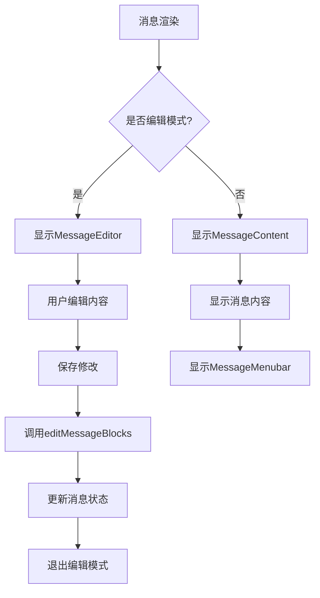
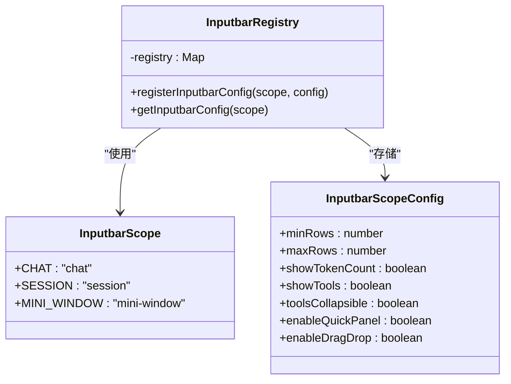
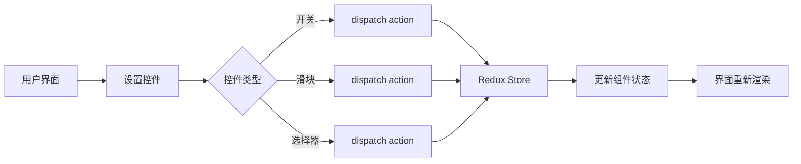
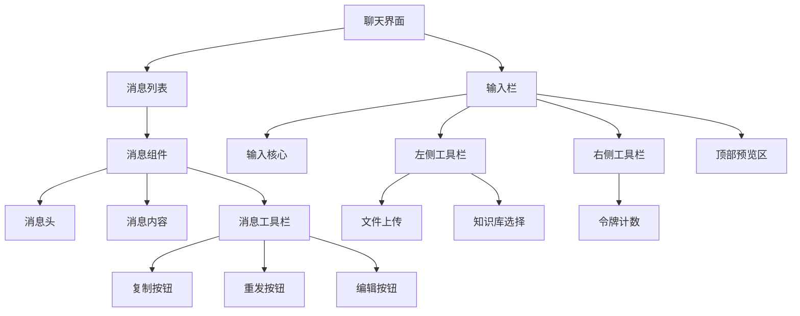

# UI组件库

<cite>
**本文档引用的文件**  
- [Message.tsx](file://src/renderer/src/pages/home/Messages/Message.tsx)
- [Inputbar.tsx](file://src/renderer/src/pages/home/Inputbar/Inputbar.tsx)
- [InputbarCore.tsx](file://src/renderer/src/pages/home/Inputbar/components/InputbarCore.tsx)
- [SettingsTab.tsx](file://src/renderer/src/pages/home/Tabs/SettingsTab.tsx)
- [ActionIconButton.tsx](file://src/renderer/src/components/Buttons/ActionIconButton.tsx)
- [registry.ts](file://src/renderer/src/pages/home/Inputbar/registry.ts)
</cite>

## 目录
1. [简介](#简介)
2. [组件分类](#组件分类)
3. [核心组件实现细节](#核心组件实现细节)
4. [设计原则](#设计原则)
5. [组件组合使用案例](#组件组合使用案例)
6. [结论](#结论)

## 简介
Cherry Studio UI组件库为应用程序提供了一套完整的用户界面构建模块。该组件库遵循现代化的设计原则，支持响应式布局、可访问性标准和主题兼容性。组件库被系统性地组织为基础组件、布局组件、表单组件和复合组件四大类别，为开发者提供了灵活且一致的界面构建方案。

## 组件分类

### 基础组件
基础组件是构建用户界面的最小单元，包括按钮、图标和标签等基本元素。

**按钮组件**
- `ActionIconButton`: 一个简单的图标按钮，用于执行特定操作
- 支持激活状态和自定义CSS类
- 使用Ant Design的Button组件作为基础

**图标组件**
- 提供了多种功能图标，如`CopyIcon`用于复制操作
- 图标基于lucide-react库实现
- 支持统一的尺寸和样式控制

**标签组件**
- 用于显示分类、状态或元数据信息
- 支持多种视觉样式和交互状态

### 布局组件
布局组件负责界面的整体结构和空间分配。

**侧边栏**
- 用于导航和内容组织
- 支持折叠和展开状态
- 可包含多个层级的导航项

**标签页**
- 实现选项卡式界面，用于在不同视图间切换
- 支持动态添加和关闭标签页
- 提供清晰的视觉指示当前激活的标签

### 表单组件
表单组件用于数据输入和用户交互。

**输入栏**
- 核心消息输入组件，支持文本输入、文件拖拽和工具集成
- 包含智能提示和快捷操作功能
- 支持多种输入模式和验证

**选择器**
- 用于从预定义选项中选择值
- 支持搜索和过滤功能
- 提供清晰的视觉反馈

### 复合组件
复合组件由多个基础组件组合而成，实现复杂的功能。

**消息块**
- 显示单条消息及其元数据
- 包含消息头、内容区域和操作工具栏
- 支持编辑、重发和标记等交互功能

**设置面板**
- 集中管理应用程序的各种设置选项
- 采用分组和折叠的方式组织大量设置项
- 提供直观的控件如开关、滑块和下拉选择器

**Section sources**
- [Message.tsx](file://src/renderer/src/pages/home/Messages/Message.tsx)
- [SettingsTab.tsx](file://src/renderer/src/pages/home/Tabs/SettingsTab.tsx)

## 核心组件实现细节

### Message.tsx 组件
`Message.tsx`是消息显示的核心组件，负责渲染聊天界面中的单条消息。

**组件属性**
- `message`: 消息对象，包含内容、角色、时间戳等信息
- `topic`: 所属话题对象
- `assistant`: 关联的助手对象
- `hideMenuBar`: 是否隐藏操作工具栏
- `isGrouped`: 是否为消息组的一部分

**功能特性**
- 支持消息编辑模式，用户可以直接修改已发送的消息
- 集成错误边界，确保单个消息渲染失败不会影响整体界面
- 支持消息高亮定位，便于在长对话中找到特定消息
- 提供消息内容容器，支持滚动和溢出处理

**交互流程**
1. 用户点击编辑按钮进入编辑模式
2. 消息内容替换为可编辑的编辑器组件
3. 用户保存修改后，通过`editMessageBlocks`服务更新消息
4. 编辑完成后返回正常显示模式

**Diagram sources**
- [Message.tsx](file://src/renderer/src/pages/home/Messages/Message.tsx)

**Section sources**
- [Message.tsx](file://src/renderer/src/pages/home/Messages/Message.tsx)

### Inputbar.tsx 组件
`Inputbar.tsx`是消息输入的核心组件，提供了一个功能丰富的输入界面。

**架构设计**
- 采用组合模式，将核心输入功能与工具栏分离
- 使用`InputbarCore`作为基础框架，注入不同的工具和功能
- 通过上下文提供者模式管理输入栏的状态

**关键功能**
- 支持文本输入、文件拖拽和粘贴
- 集成知识库输入和模型提及功能
- 显示令牌计数和上下文信息
- 支持快捷键操作

**配置管理**
通过`registry.ts`文件管理不同场景下的输入栏配置：

**Diagram sources**
- [Inputbar.tsx](file://src/renderer/src/pages/home/Inputbar/Inputbar.tsx)
- [registry.ts](file://src/renderer/src/pages/home/Inputbar/registry.ts)

**Section sources**
- [Inputbar.tsx](file://src/renderer/src/pages/home/Inputbar/Inputbar.tsx)
- [InputbarCore.tsx](file://src/renderer/src/pages/home/Inputbar/components/InputbarCore.tsx)
- [registry.ts](file://src/renderer/src/pages/home/Inputbar/registry.ts)

### SettingsPage.tsx 组件
`SettingsTab.tsx`实现了设置面板功能，提供了一个结构化的配置界面。

**组件结构**
- 使用折叠式设置组组织相关设置项
- 支持多种输入控件：开关、滑块、下拉选择器等
- 提供实时预览和即时保存功能

**主要设置类别**
- **助手设置**: 温度、上下文长度、最大令牌数等模型参数
- **消息设置**: 消息样式、字体、导航方式等显示选项
- **数学公式**: 渲染引擎选择和单美元符号支持
- **代码设置**: 代码样式、行号显示、可折叠性等
- **输入设置**: 快捷键、自动翻译、长文本处理等

**状态管理**
- 使用Redux管理全局设置状态
- 通过`useSettings`钩子访问和更新设置
- 设置变更立即生效，无需手动保存

**Diagram sources**
- [SettingsTab.tsx](file://src/renderer/src/pages/home/Tabs/SettingsTab.tsx)

**Section sources**
- [SettingsTab.tsx](file://src/renderer/src/pages/home/Tabs/SettingsTab.tsx)

## 设计原则

### 可访问性
组件库遵循WCAG 2.1可访问性指南，确保所有用户都能有效使用界面。

**键盘导航**
- 所有交互元素支持键盘焦点
- 提供清晰的焦点指示器
- 支持Tab键顺序导航

**屏幕阅读器支持**
- 为所有控件提供适当的ARIA标签
- 确保动态内容变更能被屏幕阅读器感知
- 使用语义化HTML元素

**对比度和尺寸**
- 文本与背景的对比度符合AA级标准
- 交互元素具有足够的点击区域
- 支持系统级的字体大小缩放

### 响应式设计
组件能够适应不同屏幕尺寸和设备类型。

**断点策略**
- 移动设备: < 768px
- 平板设备: 768px - 1024px
- 桌面设备: > 1024px

**布局适应**
- 使用弹性布局和网格系统
- 导航菜单在小屏幕上转换为抽屉式
- 工具栏在空间不足时自动折叠

### 主题兼容性
支持多种视觉主题，满足不同用户的偏好。

**主题变量**
- 定义了一套CSS自定义属性用于颜色、间距和字体
- 主题切换通过CSS类实现
- 支持浅色和深色模式

**组件适配**
- 所有组件使用主题变量而非硬编码值
- 图标和图像根据主题调整颜色
- 表单控件提供一致的视觉反馈

## 组件组合使用案例

### 聊天界面中的消息组件与工具栏集成
在聊天界面中，消息组件与工具栏的集成展示了组件库的组合能力。

**集成架构**

**工作流程**
1. 用户在输入栏中输入消息
2. 输入栏的左侧工具栏显示可附加的文件和知识库
3. 用户发送消息后，消息出现在消息列表中
4. 每条消息的工具栏提供复制、重发和编辑功能
5. 系统根据消息内容自动调整显示样式

**数据流**
- 输入栏通过Redux与消息列表共享状态
- 消息操作通过事件总线进行通信
- 设置变更实时影响所有相关组件

**Section sources**
- [Message.tsx](file://src/renderer/src/pages/home/Messages/Message.tsx)
- [Inputbar.tsx](file://src/renderer/src/pages/home/Inputbar/Inputbar.tsx)

## 结论
Cherry Studio UI组件库提供了一套完整、一致且可扩展的界面构建方案。通过系统性的组件分类和清晰的实现细节，开发者可以快速构建功能丰富的用户界面。组件库遵循现代化的设计原则，确保了良好的用户体验和可维护性。建议在实际使用中遵循组件库的约定，充分利用其组合能力和配置选项，以创建高质量的应用程序界面。