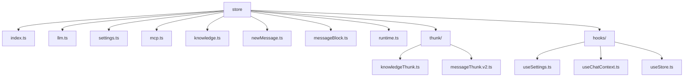
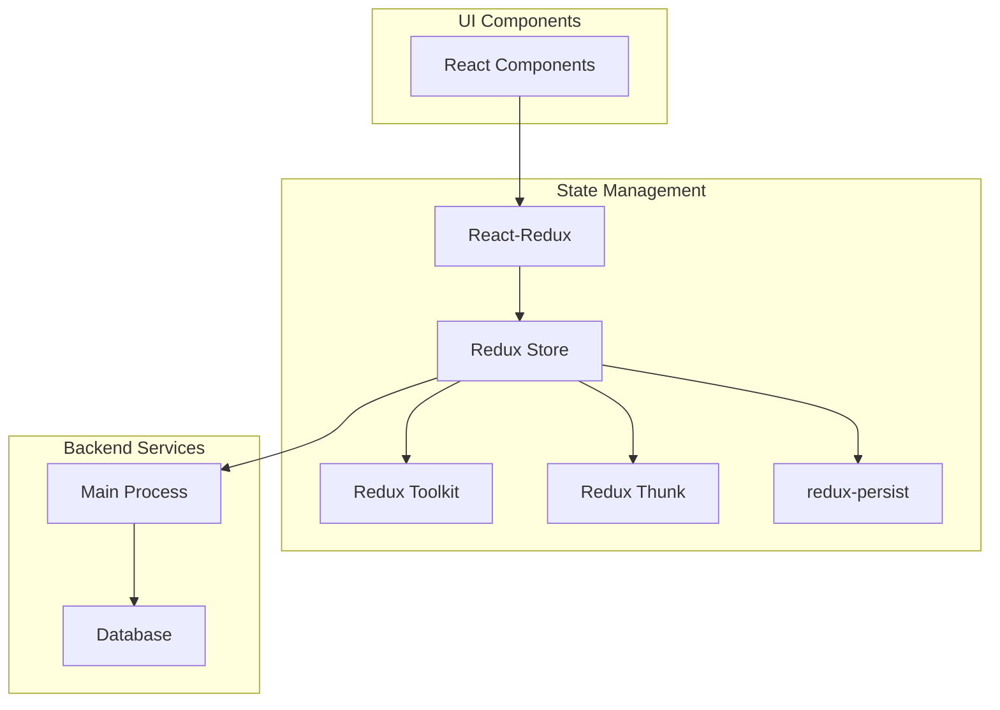
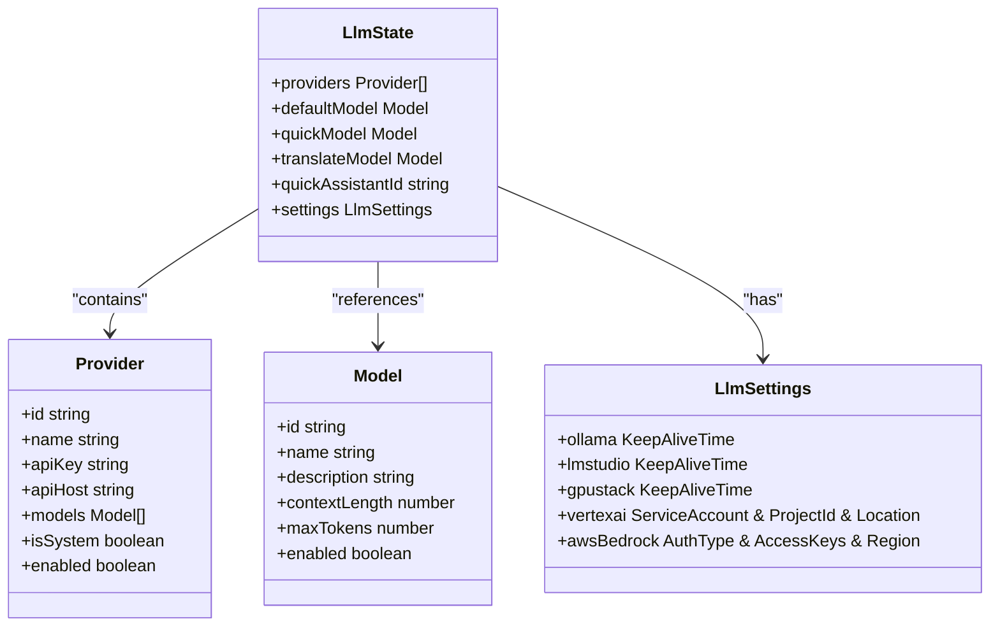
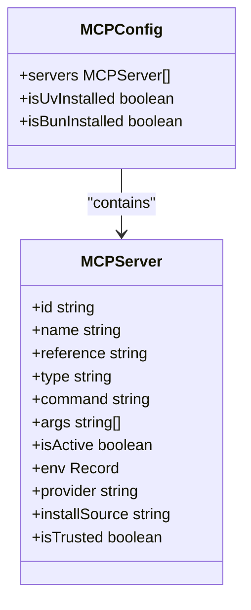
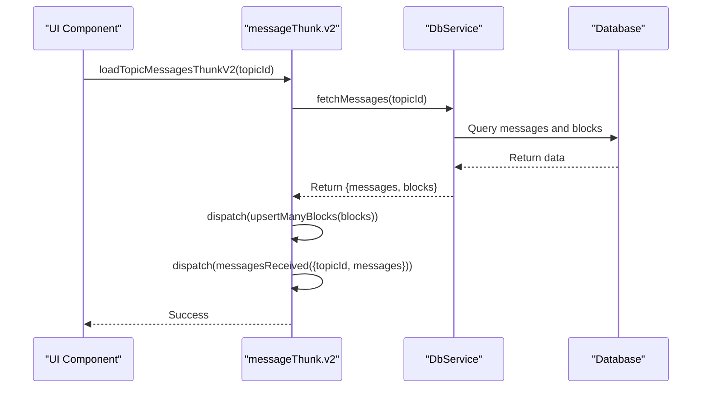
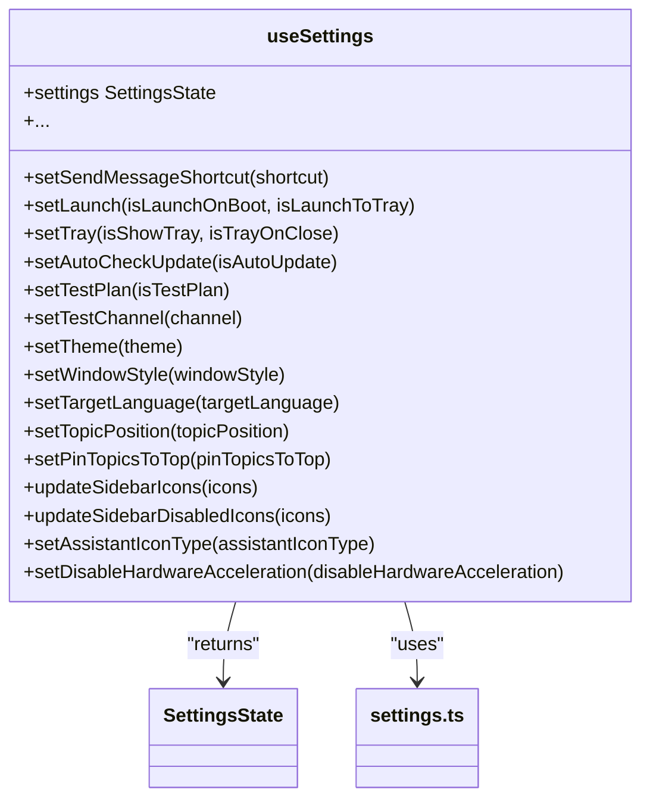
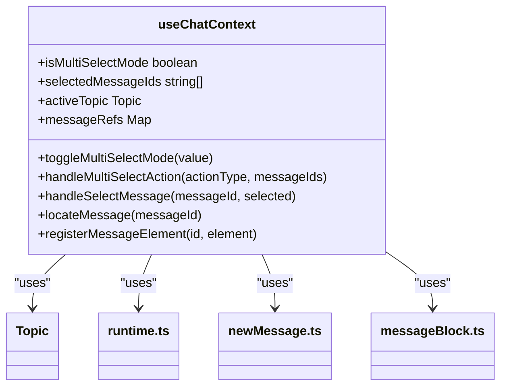

# 前端状态管理

<cite>
**本文档引用的文件**   
- [ReduxService.ts](file://src/main/services/ReduxService.ts)
- [index.ts](file://src/renderer/src/store/index.ts)
- [useStore.ts](file://src/renderer/src/hooks/useStore.ts)
- [useSettings.ts](file://src/renderer/src/hooks/useSettings.ts)
- [useChatContext.ts](file://src/renderer/src/hooks/useChatContext.ts)
- [llm.ts](file://src/renderer/src/store/llm.ts)
- [settings.ts](file://src/renderer/src/store/settings.ts)
- [mcp.ts](file://src/renderer/src/store/mcp.ts)
- [knowledge.ts](file://src/renderer/src/store/knowledge.ts)
- [knowledgeThunk.ts](file://src/renderer/src/store/thunk/knowledgeThunk.ts)
- [messageThunk.v2.ts](file://src/renderer/src/store/thunk/messageThunk.v2.ts)
- [newMessage.ts](file://src/renderer/src/store/newMessage.ts)
- [messageBlock.ts](file://src/renderer/src/store/messageBlock.ts)
- [runtime.ts](file://src/renderer/src/store/runtime.ts)
</cite>

## 目录
1. [简介](#简介)
2. [项目结构](#项目结构)
3. [核心组件](#核心组件)
4. [架构概述](#架构概述)
5. [详细组件分析](#详细组件分析)
6. [依赖分析](#依赖分析)
7. [性能考虑](#性能考虑)
8. [故障排除指南](#故障排除指南)
9. [结论](#结论)

## 简介
本文档深入解析Cherry Studio前端应用的状态管理架构。该架构基于Redux Toolkit构建，采用模块化设计，将全局状态划分为多个独立的slice（如llm、settings、mcp、knowledge等），并通过Redux Thunk中间件处理复杂的异步操作。文档详细阐述了各state slice的数据结构设计、管理逻辑以及自定义Hooks如何封装Redux逻辑以提供简洁的API接口。

## 项目结构
Cherry Studio的前端状态管理主要位于`src/renderer/src/store`目录下，采用Redux Toolkit的标准实践进行组织。



**Diagram sources**
- [index.ts](file://src/renderer/src/store/index.ts)
- [llm.ts](file://src/renderer/src/store/llm.ts)
- [settings.ts](file://src/renderer/src/store/settings.ts)
- [mcp.ts](file://src/renderer/src/store/mcp.ts)
- [knowledge.ts](file://src/renderer/src/store/knowledge.ts)
- [newMessage.ts](file://src/renderer/src/store/newMessage.ts)
- [messageBlock.ts](file://src/renderer/src/store/messageBlock.ts)
- [runtime.ts](file://src/renderer/src/store/runtime.ts)
- [thunk/knowledgeThunk.ts](file://src/renderer/src/store/thunk/knowledgeThunk.ts)
- [thunk/messageThunk.v2.ts](file://src/renderer/src/store/thunk/messageThunk.v2.ts)
- [hooks/useSettings.ts](file://src/renderer/src/hooks/useSettings.ts)
- [hooks/useChatContext.ts](file://src/renderer/src/hooks/useChatContext.ts)
- [hooks/useStore.ts](file://src/renderer/src/hooks/useStore.ts)

**Section sources**
- [index.ts](file://src/renderer/src/store/index.ts)

## 核心组件
Cherry Studio的前端状态管理核心由以下几个部分构成：基于Redux Toolkit的全局状态存储、用于处理异步逻辑的Redux Thunk中间件、以及封装了复杂状态逻辑的自定义React Hooks。这些组件共同协作，实现了应用状态的集中管理、高效更新和便捷访问。

**Section sources**
- [index.ts](file://src/renderer/src/store/index.ts)
- [ReduxService.ts](file://src/main/services/ReduxService.ts)

## 架构概述
Cherry Studio的前端状态管理采用经典的Redux架构模式，并结合了现代最佳实践。其核心是通过`configureStore`创建的全局`store`，该`store`使用`combineReducers`将多个独立的reducer（每个对应一个state slice）合并成一个单一的根reducer。为了实现状态的持久化，应用集成了`redux-persist`库，将关键状态（如用户设置、模型配置等）保存在本地存储中，确保应用重启后状态不丢失。



**Diagram sources**
- [index.ts](file://src/renderer/src/store/index.ts)
- [ReduxService.ts](file://src/main/services/ReduxService.ts)

## 详细组件分析
本节将深入分析Cherry Studio中几个关键的state slice及其相关逻辑，包括llm、settings、mcp和knowledge模块，以及处理异步操作的thunk和封装状态逻辑的自定义Hooks。

### llm模块分析
`llm` slice负责管理与大型语言模型相关的所有配置和状态，包括模型提供商、默认模型、快速模型、翻译模型以及各提供商的特定设置。



**Diagram sources**
- [llm.ts](file://src/renderer/src/store/llm.ts)

**Section sources**
- [llm.ts](file://src/renderer/src/store/llm.ts)

### settings模块分析
`settings` slice是应用中最为复杂的state模块之一，它管理着用户界面、功能、隐私和开发者模式等几乎所有用户可配置的选项。

```mermaid
classDiagram
class SettingsState {
+showAssistants boolean
+showTopics boolean
+sendMessageShortcut string
+language string
+targetLanguage string
+proxyMode string
+userName string
+userId string
+theme ThemeMode
+windowStyle string
+fontSize number
+topicPosition string
+assistantIconType string
+autoCheckUpdate boolean
+codeExecution { enabled : boolean, timeoutMinutes : number }
+codeEditor { enabled : boolean, themeLight : string, themeDark : string, ... }
+codeViewer { themeLight : CodeStyle, themeDark : CodeStyle }
+mathEngine string
+messageStyle string
+foldDisplayMode string
+gridColumns number
+notification { assistant : boolean, backup : boolean, knowledge : boolean }
+s3 S3Config
+apiServer ApiServerConfig
+...
}
class UserTheme {
+colorPrimary string
+userFontFamily string
+userCodeFontFamily string
}
class S3Config {
+endpoint string
+region string
+bucket string
+accessKeyId string
+secretAccessKey string
+root string
+autoSync boolean
+syncInterval number
+maxBackups number
+skipBackupFile boolean
}
class ApiServerConfig {
+enabled boolean
+host string
+port number
+apiKey string
}
SettingsState --> UserTheme : "has"
SettingsState --> S3Config : "has"
SettingsState --> ApiServerConfig : "has"
```

**Diagram sources**
- [settings.ts](file://src/renderer/src/store/settings.ts)

**Section sources**
- [settings.ts](file://src/renderer/src/store/settings.ts)

### mcp模块分析
`mcp` slice用于管理Model Context Protocol (MCP) 服务器的配置和状态，支持内置和自定义的MCP服务。



**Diagram sources**
- [mcp.ts](file://src/renderer/src/store/mcp.ts)

**Section sources**
- [mcp.ts](file://src/renderer/src/store/mcp.ts)

### knowledge模块分析
`knowledge` slice负责管理知识库（Knowledge Base）及其包含的项目（如文件、URL、笔记等），是应用知识增强功能的核心。

```mermaid
classDiagram
class KnowledgeState {
+bases KnowledgeBase[]
}
class KnowledgeBase {
+id string
+name string
+created_at number
+updated_at number
+items KnowledgeItem[]
+preprocessProvider PreprocessProvider
}
class KnowledgeItem {
+id string
+type 'file' | 'directory' | 'url' | 'sitemap' | 'note' | 'video'
+content FileMetadata | string
+created_at number
+updated_at number
+processingStatus ProcessingStatus
+processingProgress number
+processingError string
+retryCount number
+uniqueId string
+uniqueIds string[]
+isPreprocessed boolean
}
class FileMetadata {
+path string
+name string
+size number
+mtime number
+ctime number
}
class PreprocessProvider {
+provider Provider
+config Record<string, any>
}
enum ProcessingStatus {
pending
processing
streaming
completed
failed
}
KnowledgeState --> KnowledgeBase : "contains"
KnowledgeBase --> KnowledgeItem : "contains"
KnowledgeBase --> PreprocessProvider : "uses"
KnowledgeItem --> FileMetadata : "references"
```

**Diagram sources**
- [knowledge.ts](file://src/renderer/src/store/knowledge.ts)

**Section sources**
- [knowledge.ts](file://src/renderer/src/store/knowledge.ts)

### 异步操作处理机制
Cherry Studio使用Redux Thunk中间件来处理复杂的异步操作。`messageThunk.v2.ts`文件中的函数展示了如何通过统一的`DbService`接口与后端数据库进行交互，实现了消息的加载、保存、更新和删除等操作。



**Diagram sources**
- [messageThunk.v2.ts](file://src/renderer/src/store/thunk/messageThunk.v2.ts)
- [newMessage.ts](file://src/renderer/src/store/newMessage.ts)
- [messageBlock.ts](file://src/renderer/src/store/messageBlock.ts)

**Section sources**
- [messageThunk.v2.ts](file://src/renderer/src/store/thunk/messageThunk.v2.ts)

### 自定义Hooks分析
自定义Hooks（如`useSettings`、`useChatContext`）封装了Redux的复杂逻辑，为UI组件提供了简洁、类型安全的API接口。

#### useSettings Hook
`useSettings` Hook将`settings` slice的状态和操作封装成一个易于使用的对象。



**Diagram sources**
- [useSettings.ts](file://src/renderer/src/hooks/useSettings.ts)
- [settings.ts](file://src/renderer/src/store/settings.ts)

**Section sources**
- [useSettings.ts](file://src/renderer/src/hooks/useSettings.ts)

#### useChatContext Hook
`useChatContext` Hook为聊天界面提供了上下文相关的状态和操作，如多选模式、消息选择和定位等。



**Diagram sources**
- [useChatContext.ts](file://src/renderer/src/hooks/useChatContext.ts)
- [runtime.ts](file://src/renderer/src/store/runtime.ts)
- [newMessage.ts](file://src/renderer/src/store/newMessage.ts)
- [messageBlock.ts](file://src/renderer/src/store/messageBlock.ts)

**Section sources**
- [useChatContext.ts](file://src/renderer/src/hooks/useChatContext.ts)

## 依赖分析
Cherry Studio的前端状态管理模块依赖于多个核心库和内部服务。

```mermaid
graph TD
A[Redux Store] --> B[@reduxjs/toolkit]
A --> C[react-redux]
A --> D[redux-persist]
A --> E[redux-thunk]
A --> F[lodash]
A --> G[uuid]
A --> H[storeSyncService]
A --> I[loggerService]
A --> J[window.api]
A --> K[db]
A --> L[dbService]
A --> M[FileManager]
A --> N[EventEmitter]
B --> O[Redux]
D --> P[local storage]
H --> Q[Main Process]
I --> R[Main Process]
J --> S[Main Process]
K --> T[IndexedDB]
L --> U[Main Process]
M --> V[Main Process]
N --> W[Main Process]
```

**Diagram sources**
- [index.ts](file://src/renderer/src/store/index.ts)
- [ReduxService.ts](file://src/main/services/ReduxService.ts)

**Section sources**
- [index.ts](file://src/renderer/src/store/index.ts)
- [ReduxService.ts](file://src/main/services/ReduxService.ts)

## 性能考虑
为了优化前端状态管理的性能，Cherry Studio采用了多种最佳实践：

1.  **状态规范化**：通过`createEntityAdapter`对`newMessage`和`messageBlock`等数据密集型slice进行规范化处理，将数据存储为以ID为键的对象，避免了深层嵌套数组的遍历开销，提高了查找和更新效率。
2.  **选择器优化**：利用`reselect`库的`createSelector`创建记忆化（memoized）选择器，如`selectMessagesForTopic`，确保只有当输入状态真正发生变化时，选择器才会重新计算，避免了不必要的组件重渲染。
3.  **不可变数据处理**：严格遵守Redux的不可变性原则，使用`createSlice`和`createEntityAdapter`生成的reducer，它们内部使用了不可变更新逻辑，确保了状态树的正确更新和时间旅行调试功能的正常工作。
4.  **持久化配置**：通过`redux-persist`的`blacklist`配置，将`runtime`、`messages`等频繁变化的slice排除在持久化之外，减少了序列化和反序列化的开销，提升了应用启动和状态同步的性能。

**Section sources**
- [newMessage.ts](file://src/renderer/src/store/newMessage.ts)
- [messageBlock.ts](file://src/renderer/src/store/messageBlock.ts)
- [index.ts](file://src/renderer/src/store/index.ts)

## 故障排除指南
当遇到状态管理相关的问题时，可以参考以下排查步骤：

1.  **检查状态更新**：确认reducer中的逻辑是否正确，确保`action.payload`的结构与预期一致，并且reducer函数正确地修改了状态。
2.  **验证Action分发**：使用Redux DevTools检查action是否被正确分发，以及分发的action type和payload是否正确。
3.  **审查选择器**：如果组件没有正确响应状态变化，检查所使用的选择器是否正确地从`state`中提取了数据，并且`useSelector`的依赖是否正确。
4.  **调试异步操作**：对于thunk函数，检查其内部的异步逻辑（如API调用、数据库操作）是否成功执行，并确保在成功或失败时都正确地分发了相应的action。
5.  **检查副作用**：某些操作（如`useSettings`中的`setLaunch`）不仅会更新Redux状态，还会调用`window.api`等外部接口。需要确保这些副作用逻辑正确执行。

**Section sources**
- [useSettings.ts](file://src/renderer/src/hooks/useSettings.ts)
- [messageThunk.v2.ts](file://src/renderer/src/store/thunk/messageThunk.v2.ts)

## 结论
Cherry Studio的前端状态管理架构设计精良，通过Redux Toolkit实现了状态的模块化、类型安全和可预测性。`redux-persist`确保了用户配置的持久化，而`redux-thunk`则为复杂的异步流程提供了清晰的解决方案。自定义Hooks极大地简化了UI组件对状态的访问，提高了代码的可维护性和开发效率。整体架构遵循了现代前端开发的最佳实践，在保证功能完整性的同时，也兼顾了性能和可扩展性。