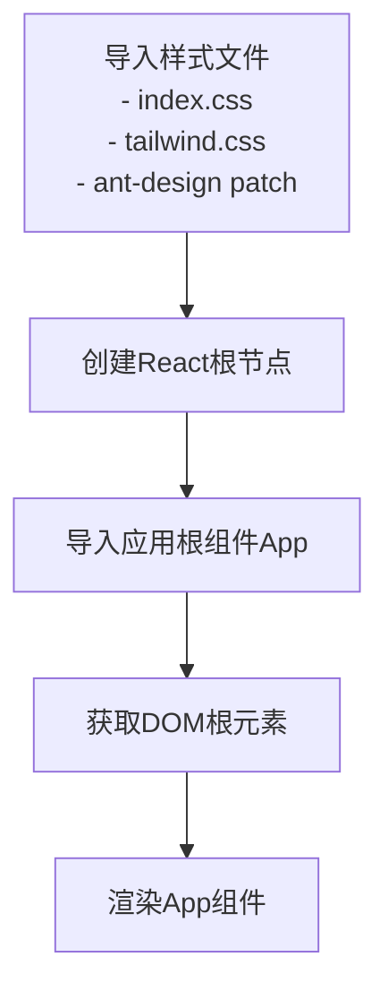
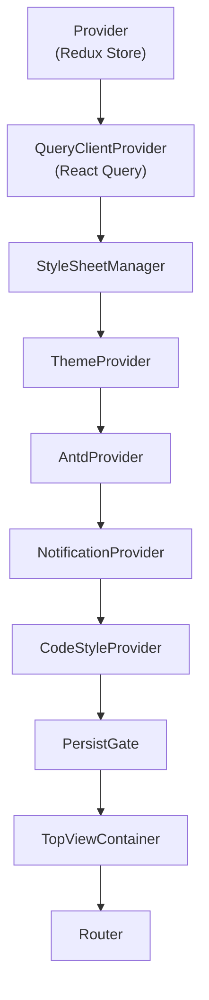
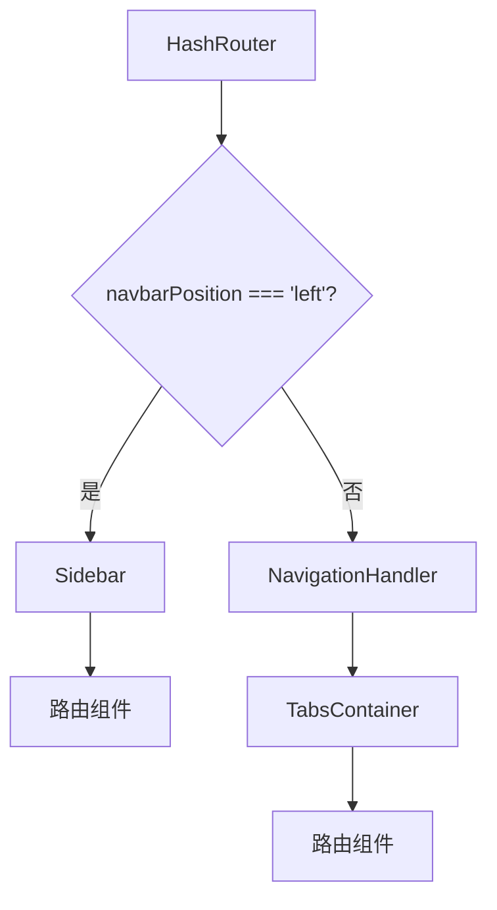
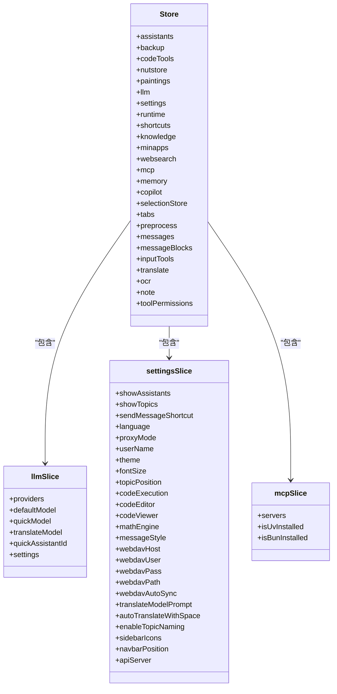
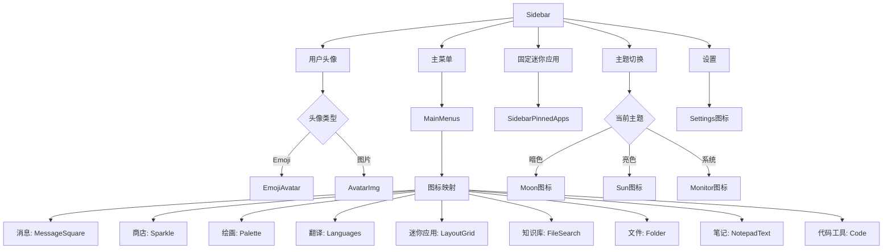
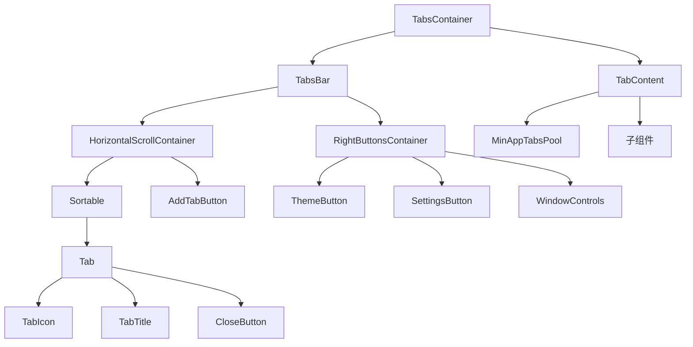
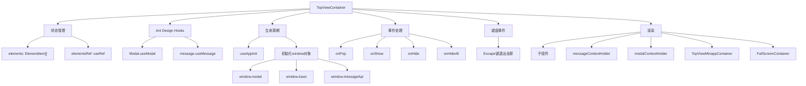
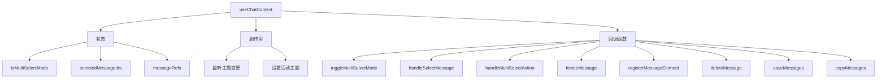
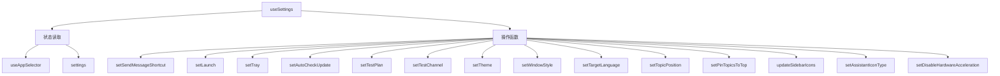
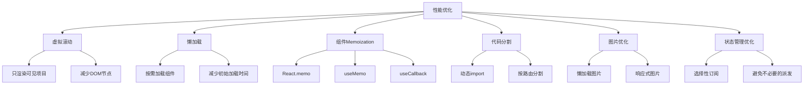

# 渲染进程

<cite>
**本文档引用的文件**   
- [entryPoint.tsx](file://src/renderer/src/entryPoint.tsx)
- [App.tsx](file://src/renderer/src/App.tsx)
- [Router.tsx](file://src/renderer/src/Router.tsx)
- [init.ts](file://src/renderer/src/init.ts)
- [store/index.ts](file://src/renderer/src/store/index.ts)
- [store/llm.ts](file://src/renderer/src/store/llm.ts)
- [store/settings.ts](file://src/renderer/src/store/settings.ts)
- [store/mcp.ts](file://src/renderer/src/store/mcp.ts)
- [hooks/useChatContext.ts](file://src/renderer/src/hooks/useChatContext.ts)
- [hooks/useSettings.ts](file://src/renderer/src/hooks/useSettings.ts)
- [components/TopView/index.tsx](file://src/renderer/src/components/TopView/index.tsx)
- [components/app/Sidebar.tsx](file://src/renderer/src/components/app/Sidebar.tsx)
- [components/Tab/TabContainer.tsx](file://src/renderer/src/components/Tab/TabContainer.tsx)
</cite>

## 目录
1. [简介](#简介)
2. [渲染进程职责](#渲染进程职责)
3. [入口点初始化](#入口点初始化)
4. [应用根组件结构](#应用根组件结构)
5. [页面路由机制](#页面路由机制)
6. [状态管理架构](#状态管理架构)
7. [核心UI组件库](#核心ui组件库)
8. [自定义React Hooks](#自定义react-hooks)
9. [性能优化建议](#性能优化建议)

## 简介

Cherry Studio的渲染进程作为用户界面层，负责UI渲染、用户交互处理和前端状态管理。本文档全面介绍渲染进程的架构和实现细节，包括入口点初始化流程、应用根组件结构、页面路由机制、基于Redux的状态管理架构、核心UI组件库设计原则、自定义React Hooks以及性能优化建议。

**Section sources**
- [entryPoint.tsx](file://src/renderer/src/entryPoint.tsx#L1-L11)
- [App.tsx](file://src/renderer/src/App.tsx#L1-L56)
- [Router.tsx](file://src/renderer/src/Router.tsx#L1-L68)

## 渲染进程职责

渲染进程作为Cherry Studio的用户界面层，承担着关键的职责：

1. **UI渲染**：负责将应用状态转换为可视化的用户界面，包括聊天界面、设置面板、文件管理等各个功能模块的渲染。
2. **用户交互处理**：处理用户的鼠标点击、键盘输入、拖拽等操作，响应用户行为并更新应用状态。
3. **前端状态管理**：通过Redux管理应用的全局状态，包括LLM配置、用户设置、MCP服务器状态等。
4. **与主进程通信**：通过Electron的IPC机制与主进程进行通信，执行文件操作、系统设置等需要原生权限的操作。
5. **性能优化**：实现虚拟滚动、懒加载、组件memoization等技术，确保大型数据集下的流畅用户体验。

渲染进程通过React框架构建用户界面，利用Redux进行状态管理，并通过自定义Hooks封装复杂的业务逻辑，提供简洁的API供组件使用。

**Section sources**
- [App.tsx](file://src/renderer/src/App.tsx#L1-L56)
- [store/index.ts](file://src/renderer/src/store/index.ts#L1-L137)

## 入口点初始化

`entryPoint.tsx`是渲染进程的入口文件，负责初始化React应用并将其挂载到DOM中。

**Diagram sources**
- [entryPoint.tsx](file://src/renderer/src/entryPoint.tsx#L1-L11)

入口点文件首先导入必要的CSS样式文件，包括Tailwind CSS用于样式化，以及Ant Design的React 19兼容补丁。然后使用`createRoot`创建React根节点，并将`App`组件渲染到id为"root"的DOM元素中。这个简单的入口点设计确保了应用的快速启动和渲染。

**Section sources**
- [entryPoint.tsx](file://src/renderer/src/entryPoint.tsx#L1-L11)

## 应用根组件结构

`App.tsx`是应用的根组件，负责组织和配置整个应用的上下文和提供者。

**Diagram sources**
- [App.tsx](file://src/renderer/src/App.tsx#L1-L56)

应用根组件采用了多层嵌套的提供者模式，每个提供者负责特定的功能：

- **Provider**：Redux Store提供者，使整个应用可以访问Redux状态
- **QueryClientProvider**：React Query客户端提供者，用于管理异步数据获取
- **StyleSheetManager**：样式表管理器，处理动态样式
- **ThemeProvider**：主题提供者，管理应用的主题状态
- **AntdProvider**：Ant Design组件库提供者，配置全局组件行为
- **NotificationProvider**：通知提供者，管理应用通知系统
- **CodeStyleProvider**：代码样式提供者，管理代码块的显示样式
- **PersistGate**：Redux Persist门控组件，确保状态在持久化完成后才渲染应用

这种分层的提供者结构确保了各个功能模块的解耦和可维护性。

**Section sources**
- [App.tsx](file://src/renderer/src/App.tsx#L1-L56)

## 页面路由机制

`Router.tsx`实现了应用的页面路由机制，使用`react-router-dom`的`HashRouter`进行路由管理。

**Diagram sources**
- [Router.tsx](file://src/renderer/src/Router.tsx#L1-L68)

路由组件根据`navbarPosition`设置决定UI布局：

- 当`navbarPosition`为'left'时，显示侧边栏导航模式
- 当`navbarPosition`为'top'时，显示顶部标签页导航模式

应用定义了多个路由路径，包括：
- `/`：首页
- `/store`：助手商店
- `/paintings/*`：绘画功能
- `/translate`：翻译功能
- `/files`：文件管理
- `/notes`：笔记功能
- `/knowledge`：知识库
- `/apps/:appId`：迷你应用
- `/apps`：迷你应用列表
- `/code`：代码工具
- `/settings/*`：设置页面
- `/launchpad`：启动台

这种灵活的路由设计支持多种UI布局，满足不同用户的使用习惯。

**Section sources**
- [Router.tsx](file://src/renderer/src/Router.tsx#L1-L68)

## 状态管理架构

Cherry Studio使用Redux Toolkit进行状态管理，构建了一个模块化的状态管理架构。

**Diagram sources**
- [store/index.ts](file://src/renderer/src/store/index.ts#L1-L137)
- [store/llm.ts](file://src/renderer/src/store/llm.ts#L1-L264)
- [store/settings.ts](file://src/renderer/src/store/settings.ts#L1-L800)
- [store/mcp.ts](file://src/renderer/src/store/mcp.ts#L1-L198)

### LLM状态管理

`llm.ts` slice管理LLM相关的状态，包括：

- **providers**：LLM提供商列表，包含Ollama、LM Studio、GPUStack等
- **defaultModel**：默认模型
- **quickModel**：快速模型
- **translateModel**：翻译模型
- **quickAssistantId**：快速助手ID
- **settings**：LLM特定设置，如Ollama、LM Studio、GPUStack的keep-alive时间，Vertex AI和AWS Bedrock的认证信息

该slice提供了丰富的reducer函数，用于更新提供商、添加/删除模型、设置默认模型等操作。

### 设置状态管理

`settings.ts` slice管理用户的各种设置，分为多个功能区域：

- **界面设置**：语言、主题、字体大小、消息样式等
- **代码相关**：代码执行、编辑器设置、代码预览样式
- **数学公式**：数学引擎选择、单美元符号支持
- **同步设置**：WebDAV、本地备份、S3同步配置
- **翻译设置**：翻译模型提示、自动翻译
- **通知设置**：助手、备份、知识库通知开关
- **API服务器**：启用状态、主机、端口、API密钥

### MCP状态管理

`mcp.ts` slice管理MCP（Model Context Protocol）服务器的状态：

- **servers**：MCP服务器列表，包括内存、文件系统、Python等内置服务器
- **isUvInstalled**：UV工具是否已安装
- **isBunInstalled**：Bun工具是否已安装

该slice还提供了selectors来获取激活的服务器列表，并导出了一个`initializeMCPServers`工具函数，用于在应用初始化时添加内置的MCP服务器。

**Section sources**
- [store/index.ts](file://src/renderer/src/store/index.ts#L1-L137)
- [store/llm.ts](file://src/renderer/src/store/llm.ts#L1-L264)
- [store/settings.ts](file://src/renderer/src/store/settings.ts#L1-L800)
- [store/mcp.ts](file://src/renderer/src/store/mcp.ts#L1-L198)

## 核心UI组件库

Cherry Studio构建了一个丰富的UI组件库，支持应用的各种功能需求。

### 侧边栏组件

`Sidebar.tsx`实现了应用的侧边栏导航，根据`navbarPosition`设置显示或隐藏。

**Diagram sources**
- [components/app/Sidebar.tsx](file://src/renderer/src/components/app/Sidebar.tsx#L1-L304)

侧边栏组件包含用户头像、主菜单、固定迷你应用和设置按钮。主菜单根据`sidebarIcons`设置动态显示可用的导航项，并使用Lucide React图标库提供视觉反馈。

### 标签页组件

`TabContainer.tsx`实现了顶部标签页导航模式，支持标签页的创建、关闭和重新排序。

**Diagram sources**
- [components/Tab/TabContainer.tsx](file://src/renderer/src/components/Tab/TabContainer.tsx#L1-L468)

标签页组件支持：
- 水平滚动容器，适应大量标签页
- 可排序的标签页，支持拖拽重新排序
- 标签页图标和标题的动态生成
- 中键点击关闭标签页
- 主题切换和设置按钮
- 窗口控制按钮（最小化、最大化、关闭）
- 迷你应用标签页池，保持已打开的迷你应用活跃

### 顶层视图组件

`TopView/index.tsx`实现了全屏覆盖层的管理，用于显示模态对话框、通知等覆盖层内容。

**Diagram sources**
- [components/TopView/index.tsx](file://src/renderer/src/components/TopView/index.tsx#L1-L122)

顶层视图组件管理全屏覆盖层的显示和隐藏，支持：
- 动态添加和移除覆盖层
- 全屏模式下的键盘事件处理（Escape键退出全屏）
- Ant Design组件的全局实例化（Modal、Message）
- 自定义Toast通知系统
- 迷你应用弹出容器

**Section sources**
- [components/app/Sidebar.tsx](file://src/renderer/src/components/app/Sidebar.tsx#L1-L304)
- [components/Tab/TabContainer.tsx](file://src/renderer/src/components/Tab/TabContainer.tsx#L1-L468)
- [components/TopView/index.tsx](file://src/renderer/src/components/TopView/index.tsx#L1-L122)

## 自定义React Hooks

Cherry Studio通过自定义React Hooks封装复杂的业务逻辑，提供简洁的API供组件使用。

### useChatContext Hook

`useChatContext` Hook为聊天界面提供上下文功能，管理多选模式、消息选择和批量操作。

**Diagram sources**
- [hooks/useChatContext.ts](file://src/renderer/src/hooks/useChatContext.ts#L1-L194)

该Hook提供了以下功能：
- 多选模式的开启/关闭
- 消息的选择和取消选择
- 批量操作（删除、保存、复制）
- 定位特定消息
- 注册消息元素引用

### useSettings Hook

`useSettings` Hook提供对应用设置的访问和更新功能，封装了Redux状态的读取和派发。

**Diagram sources**
- [hooks/useSettings.ts](file://src/renderer/src/hooks/useSettings.ts#L1-L149)

该Hook不仅返回所有设置状态，还提供了多个便捷的更新函数，每个函数都封装了相应的Redux action派发和可能的原生API调用。

### 其他自定义Hooks

除了上述两个主要Hook，Cherry Studio还提供了其他专门的自定义Hooks：

- **useLMStudioSettings**：封装LM Studio设置的读取和更新
- **useGPUStackSettings**：封装GPUStack设置的读取和更新
- **useVertexAISettings**：封装Vertex AI设置的读取和更新
- **useAwsBedrockSettings**：封装AWS Bedrock设置的读取和更新
- **useNotesSettings**：封装笔记设置的读取和更新
- **useWebSearchSettings**：封装网络搜索设置的读取和更新

这些Hooks遵循一致的设计模式：使用`useAppSelector`读取状态，使用`useAppDispatch`派发action，提供类型安全的API。

**Section sources**
- [hooks/useChatContext.ts](file://src/renderer/src/hooks/useChatContext.ts#L1-L194)
- [hooks/useSettings.ts](file://src/renderer/src/hooks/useSettings.ts#L1-L149)
- [hooks/useLMStudio.ts](file://src/renderer/src/hooks/useLMStudio.ts#L1-L9)
- [hooks/useGPUStack.ts](file://src/renderer/src/hooks/useGPUStack.ts#L1-L9)
- [hooks/useVertexAI.ts](file://src/renderer/src/hooks/useVertexAI.ts#L1-L21)
- [hooks/useAwsBedrock.ts](file://src/renderer/src/hooks/useAwsBedrock.ts#L1-L23)
- [hooks/useNotesSettings.ts](file://src/renderer/src/hooks/useNotesSettings.ts#L1-L23)
- [hooks/useWebSearchProviders.ts](file://src/renderer/src/hooks/useWebSearchProviders.ts#L1-L106)

## 性能优化建议

Cherry Studio在设计时考虑了性能优化，以下是一些关键的优化建议：

### 虚拟滚动

对于长列表（如消息列表、文件列表），使用虚拟滚动技术只渲染可见区域的项目，大大减少DOM节点数量，提高渲染性能。

### 懒加载

对于非关键路径的组件和资源，使用懒加载技术按需加载，减少初始加载时间。例如，迷你应用、设置页面的各个子页面等。

### 组件Memoization

使用React.memo、useMemo和useCallback对组件和函数进行记忆化，避免不必要的重新渲染和计算。

**Diagram sources**
- [components/VirtualList](file://src/renderer/src/components/VirtualList)
- [components/TopView/index.tsx](file://src/renderer/src/components/TopView/index.tsx#L1-L122)
- [hooks/useChatContext.ts](file://src/renderer/src/hooks/useChatContext.ts#L1-L194)

### 代码分割

使用动态import实现代码分割，按路由或功能模块分割代码包，实现按需加载。

### 图片优化

对于图片资源，使用懒加载和响应式图片技术，根据设备屏幕大小加载适当尺寸的图片，减少带宽消耗。

### 状态管理优化

在Redux状态管理中，使用选择性订阅（selective subscription）避免组件订阅不必要的状态变化，并优化action派发，避免不必要的状态更新。

这些性能优化措施共同确保了Cherry Studio在处理大量数据和复杂交互时仍能保持流畅的用户体验。

**Section sources**
- [components/VirtualList](file://src/renderer/src/components/VirtualList)
- [components/TopView/index.tsx](file://src/renderer/src/components/TopView/index.tsx#L1-L122)
- [hooks/useChatContext.ts](file://src/renderer/src/hooks/useChatContext.ts#L1-L194)