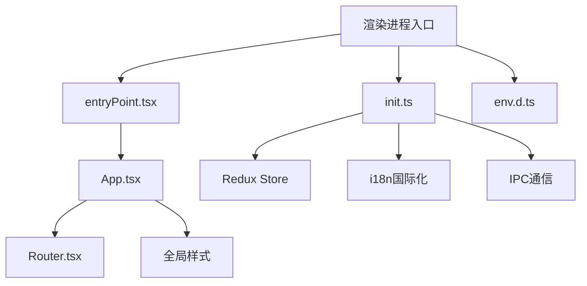
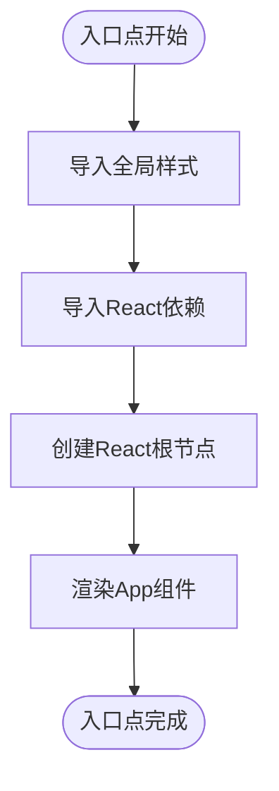
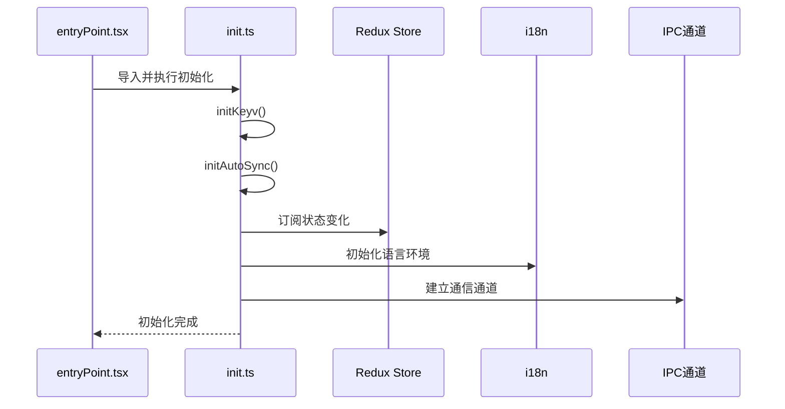
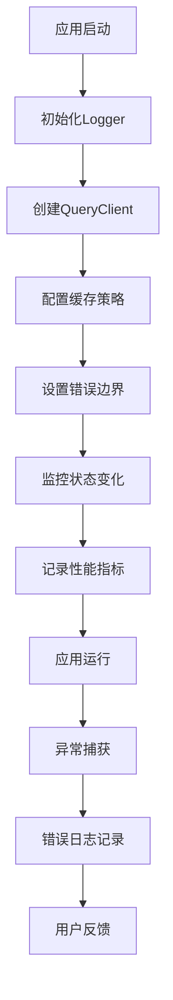
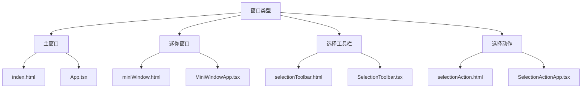

# 渲染进程入口

<cite>
**本文档引用的文件**  
- [entryPoint.tsx](file://src/renderer/src/entryPoint.tsx)
- [init.ts](file://src/renderer/src/init.ts)
- [env.d.ts](file://src/renderer/src/env.d.ts)
- [App.tsx](file://src/renderer/src/App.tsx)
- [Router.tsx](file://src/renderer/src/Router.tsx)
- [index.css](file://src/renderer/src/assets/styles/index.css)
- [tailwind.css](file://src/renderer/src/assets/styles/tailwind.css)
- [MiniWindowApp.tsx](file://src/renderer/src/windows/mini/MiniWindowApp.tsx)
- [SelectionToolbar.tsx](file://src/renderer/src/windows/selection/toolbar/SelectionToolbar.tsx)
- [SelectionActionApp.tsx](file://src/renderer/src/windows/selection/action/SelectionActionApp.tsx)
</cite>

## 目录
1. [项目结构](#项目结构)
2. [入口点初始化流程](#入口点初始化流程)
3. [全局样式注入](#全局样式注入)
4. [应用初始化逻辑](#应用初始化逻辑)
5. [环境类型定义](#环境类型定义)
6. [错误处理与性能监控](#错误处理与性能监控)
7. [窗口类型与组件加载](#窗口类型与组件加载)

## 项目结构

Cherry Studio的渲染进程入口位于`src/renderer/src`目录下，主要包含三个核心文件：`entryPoint.tsx`作为渲染进程的入口点，`init.ts`负责应用初始化逻辑，`env.d.ts`定义环境类型。项目采用React框架构建用户界面，结合Redux进行状态管理，并使用Vite作为构建工具。



**图表来源**  
- [entryPoint.tsx](file://src/renderer/src/entryPoint.tsx#L1-L11)
- [init.ts](file://src/renderer/src/init.ts#L1-L42)
- [env.d.ts](file://src/renderer/src/env.d.ts#L1-L59)

**本节来源**  
- [entryPoint.tsx](file://src/renderer/src/entryPoint.tsx#L1-L11)
- [init.ts](file://src/renderer/src/init.ts#L1-L42)

## 入口点初始化流程

渲染进程的初始化从`entryPoint.tsx`文件开始，该文件是Electron应用渲染进程的入口点。初始化流程首先导入全局样式和依赖，然后创建React根节点并渲染主应用组件。



**图表来源**  
- [entryPoint.tsx](file://src/renderer/src/entryPoint.tsx#L1-L11)

**本节来源**  
- [entryPoint.tsx](file://src/renderer/src/entryPoint.tsx#L1-L11)

## 全局样式注入

全局样式通过`entryPoint.tsx`文件中的import语句注入，包含基础样式、Tailwind CSS和Ant Design补丁。样式系统采用CSS变量和层叠样式表(layer-based CSS)设计，支持深色模式切换。

```mermaid
classDiagram
class GlobalStyles {
+index.css : 基础样式
+tailwind.css : 实用工具类
+ant.css : Ant Design覆盖
+color.css : 颜色变量
+font.css : 字体定义
}
GlobalStyles --> ThemeVariables : "使用"
ThemeVariables : --color-background : 背景颜色
ThemeVariables : --color-foreground : 前景色
ThemeVariables : --color-primary : 主色调
ThemeVariables : --color-secondary : 次要色调
ThemeVariables : --color-border : 边框颜色
```

**图表来源**  
- [index.css](file://src/renderer/src/assets/styles/index.css#L1-L190)
- [tailwind.css](file://src/renderer/src/assets/styles/tailwind.css#L1-L160)

**本节来源**  
- [entryPoint.tsx](file://src/renderer/src/entryPoint.tsx#L1-L3)
- [index.css](file://src/renderer/src/assets/styles/index.css#L1-L190)

## 应用初始化逻辑

`init.ts`文件包含应用的初始化逻辑，负责配置Redux store、设置i18n国际化支持以及建立与主进程的IPC通信通道。初始化过程通过调用一系列函数来完成不同模块的设置。



**图表来源**  
- [init.ts](file://src/renderer/src/init.ts#L1-L42)
- [App.tsx](file://src/renderer/src/App.tsx#L4-L7)

**本节来源**  
- [init.ts](file://src/renderer/src/init.ts#L1-L42)
- [App.tsx](file://src/renderer/src/App.tsx#L4-L7)

## 环境类型定义

`env.d.ts`文件定义了渲染进程的环境类型，通过TypeScript的声明合并机制扩展全局Window对象，确保类型安全。该文件定义了环境变量、全局变量和窗口对象的类型。

```mermaid
classDiagram
class EnvTypes {
+ImportMetaEnv : 环境变量接口
+Window : 全局窗口对象扩展
+VITE_RENDERER_INTEGRATED_MODEL : 集成模型环境变量
}
EnvTypes --> WindowExtensions : "扩展"
WindowExtensions : root : HTMLElement
WindowExtensions : modal : HookAPI
WindowExtensions : keyv : KeyvStorage
WindowExtensions : store : any
WindowExtensions : navigate : NavigateFunction
WindowExtensions : toast : Toast工具
WindowExtensions : agentTools : 代理工具
```

**图表来源**  
- [env.d.ts](file://src/renderer/src/env.d.ts#L1-L59)

**本节来源**  
- [env.d.ts](file://src/renderer/src/env.d.ts#L1-L59)

## 错误处理与性能监控

入口点集成错误处理和性能监控机制，通过loggerService记录应用生命周期事件，并在关键流程中添加错误边界。性能监控主要通过React Query的缓存策略和状态持久化来实现。



**图表来源**  
- [App.tsx](file://src/renderer/src/App.tsx#L3-L27)
- [init.ts](file://src/renderer/src/init.ts#L10-L11)

**本节来源**  
- [App.tsx](file://src/renderer/src/App.tsx#L3-L27)
- [init.ts](file://src/renderer/src/init.ts#L10-L11)

## 窗口类型与组件加载

根据不同的窗口类型（主窗口、迷你窗口、选择工具栏），入口点加载相应的React组件。通过HTML文件和入口点的对应关系来区分不同窗口类型，每个窗口类型有专门的组件和样式。



**图表来源**  
- [MiniWindowApp.tsx](file://src/renderer/src/windows/mini/MiniWindowApp.tsx#L1-L60)
- [SelectionToolbar.tsx](file://src/renderer/src/windows/selection/toolbar/SelectionToolbar.tsx#L1-L481)
- [SelectionActionApp.tsx](file://src/renderer/src/windows/selection/action/SelectionActionApp.tsx#L1-L435)

**本节来源**  
- [MiniWindowApp.tsx](file://src/renderer/src/windows/mini/MiniWindowApp.tsx#L1-L60)
- [SelectionToolbar.tsx](file://src/renderer/src/windows/selection/toolbar/SelectionToolbar.tsx#L1-L481)
- [SelectionActionApp.tsx](file://src/renderer/src/windows/selection/action/SelectionActionApp.tsx#L1-L435)