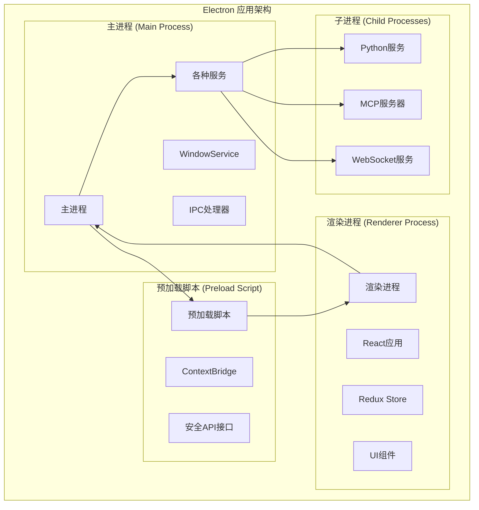
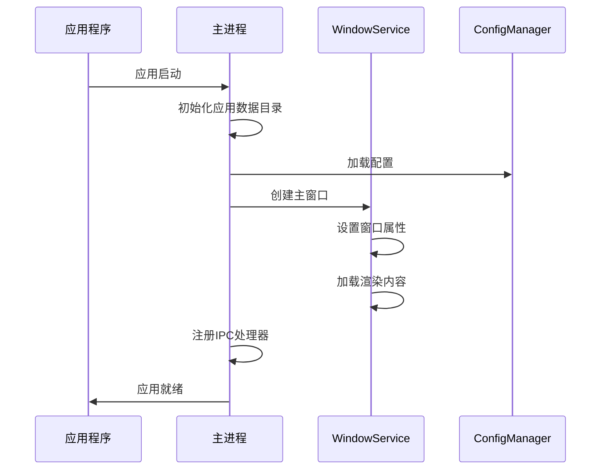
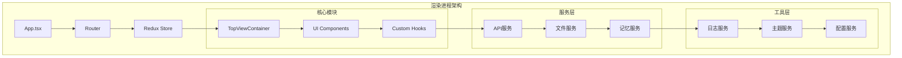
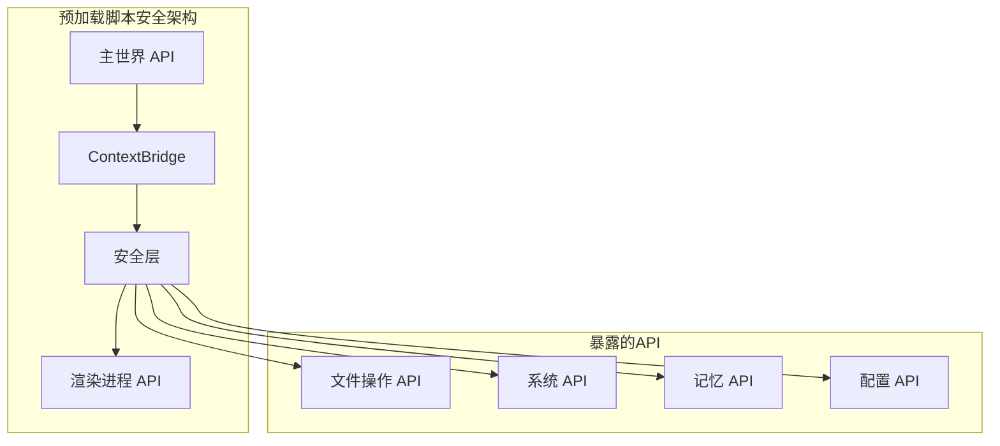
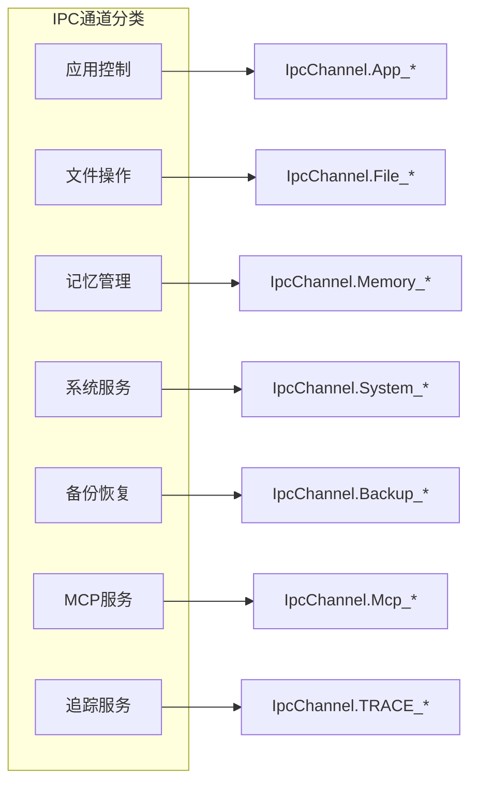
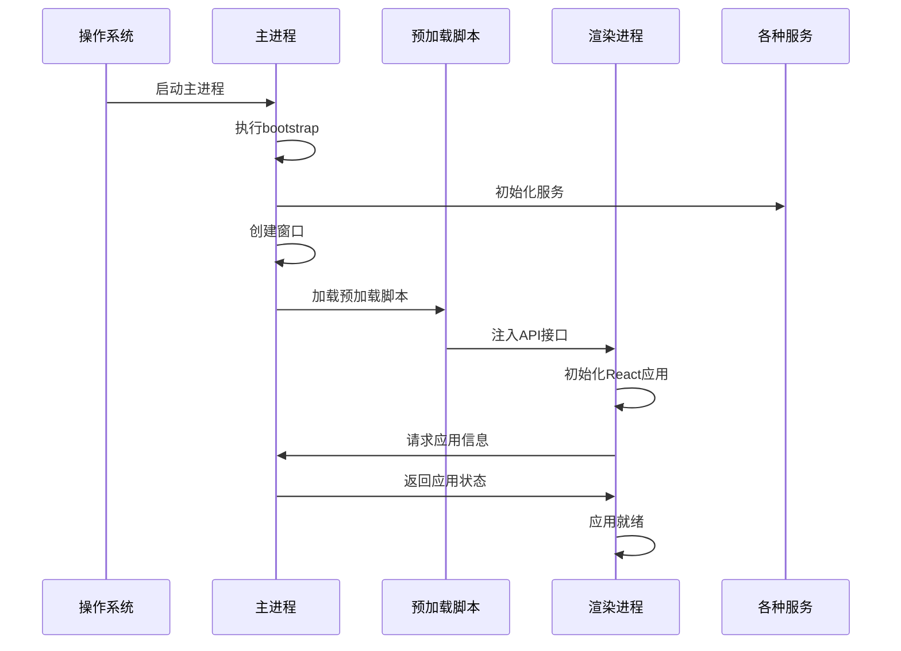
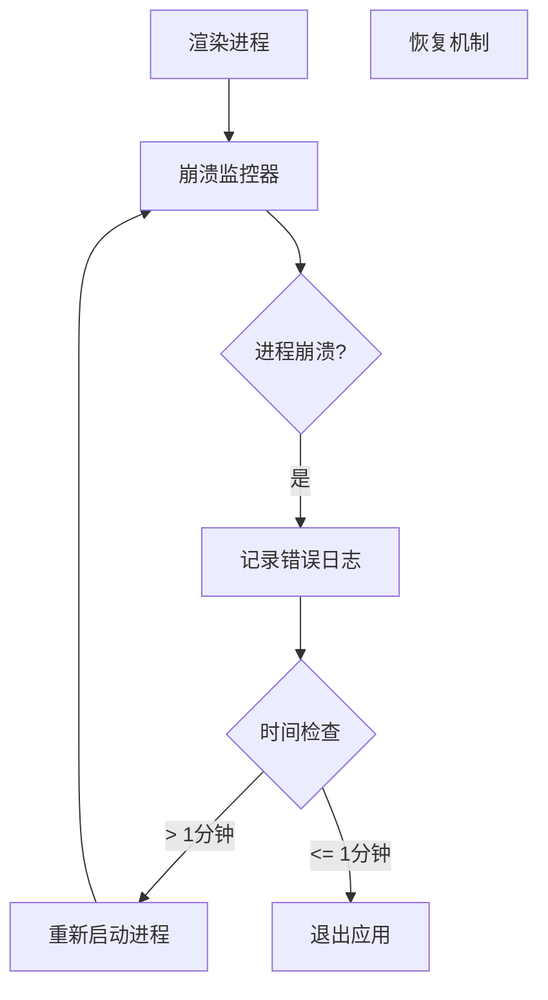

# 进程架构

<cite>
**本文档引用的文件**
- [package.json](file://package.json)
- [electron.vite.config.ts](file://electron.vite.config.ts)
- [src/main/index.ts](file://src/main/index.ts)
- [src/main/bootstrap.ts](file://src/main/bootstrap.ts)
- [src/main/ipc.ts](file://src/main/ipc.ts)
- [src/main/services/WindowService.ts](file://src/main/services/WindowService.ts)
- [src/main/services/NodeTraceService.ts](file://src/main/services/NodeTraceService.ts)
- [src/preload/index.ts](file://src/preload/index.ts)
- [src/renderer/src/entryPoint.tsx](file://src/renderer/src/entryPoint.tsx)
- [src/renderer/src/App.tsx](file://src/renderer/src/App.tsx)
- [packages/shared/IpcChannel.ts](file://packages/shared/IpcChannel.ts)
</cite>

## 目录
1. [概述](#概述)
2. [Electron多进程模型](#electron多进程模型)
3. [主进程架构](#主进程架构)
4. [渲染进程架构](#渲染进程架构)
5. [预加载脚本架构](#预加载脚本架构)
6. [进程间通信机制](#进程间通信机制)
7. [进程生命周期管理](#进程生命周期管理)
8. [错误处理与崩溃恢复](#错误处理与崩溃恢复)
9. [性能优化策略](#性能优化策略)
10. [总结](#总结)

## 概述

Cherry Studio采用标准的Electron多进程架构，通过主进程、渲染进程和预加载脚本的协同工作，实现了稳定、安全且高性能的应用程序体验。该架构充分利用了Electron框架的优势，在保证功能完整性的同时，确保了系统的稳定性和安全性。

## Electron多进程模型

### 架构概览



**图表来源**
- [src/main/index.ts](file://src/main/index.ts#L1-L257)
- [src/preload/index.ts](file://src/preload/index.ts#L1-L594)
- [src/renderer/src/entryPoint.tsx](file://src/renderer/src/entryPoint.tsx#L1-L11)

### 核心设计原则

1. **职责分离**: 主进程负责系统级操作，渲染进程负责用户界面
2. **安全隔离**: 通过预加载脚本建立安全的通信桥梁
3. **稳定性保障**: 进程间独立运行，避免相互影响
4. **性能优化**: 各进程专注特定任务，提高整体效率

## 主进程架构

### 主进程职责

主进程是Cherry Studio的核心控制中心，负责以下关键功能：

#### 1. 应用程序生命周期管理



**图表来源**
- [src/main/index.ts](file://src/main/index.ts#L123-L200)
- [src/main/services/WindowService.ts](file://src/main/services/WindowService.ts#L43-L105)

#### 2. 系统资源管理

主进程负责管理以下系统资源：

- **硬件加速控制**: 根据用户配置决定是否启用硬件加速
- **内存管理**: 监控和管理应用程序内存使用
- **网络代理**: 配置和管理系统网络代理设置
- **文件系统访问**: 管理文件读写权限和路径解析

#### 3. 原生功能集成

主进程提供了对操作系统原生功能的访问：

- **系统通知**: 发送桌面通知
- **快捷键管理**: 注册和管理全局快捷键
- **文件关联**: 处理文件类型关联和协议处理
- **系统托盘**: 管理系统托盘图标和菜单

**章节来源**
- [src/main/index.ts](file://src/main/index.ts#L41-L112)
- [src/main/services/WindowService.ts](file://src/main/services/WindowService.ts#L1-L685)

### 主进程初始化流程

主进程的初始化遵循严格的顺序，确保各个组件能够正确启动：

1. **应用数据目录初始化**: 确保必要的目录结构存在
2. **配置系统加载**: 读取和验证应用程序配置
3. **服务实例化**: 创建各种服务的单例实例
4. **窗口系统初始化**: 设置主窗口和迷你窗口
5. **IPC通道注册**: 建立主进程与渲染进程的通信桥梁
6. **事件监听器设置**: 注册各种系统事件处理器

## 渲染进程架构

### 渲染进程职责

渲染进程承载着Cherry Studio的用户界面和交互逻辑，采用React技术栈构建现代化的用户界面。

#### 1. 用户界面架构



**图表来源**
- [src/renderer/src/App.tsx](file://src/renderer/src/App.tsx#L1-L56)
- [src/renderer/src/entryPoint.tsx](file://src/renderer/src/entryPoint.tsx#L1-L11)

#### 2. 状态管理

渲染进程使用Redux进行全局状态管理，配合React Query处理异步数据：

- **Redux Store**: 管理应用程序的核心状态
- **React Query**: 处理API请求和缓存
- **持久化存储**: 使用redux-persist保存用户偏好设置

#### 3. 组件系统

渲染进程采用模块化的组件架构：

- **布局组件**: 负责页面的整体布局
- **业务组件**: 实现具体的功能逻辑
- **工具组件**: 提供通用的UI功能

**章节来源**
- [src/renderer/src/App.tsx](file://src/renderer/src/App.tsx#L19-L56)
- [src/renderer/src/entryPoint.tsx](file://src/renderer/src/entryPoint.tsx#L1-L11)

### 渲染进程特性

1. **响应式设计**: 支持不同屏幕尺寸和分辨率
2. **主题系统**: 提供深色和浅色主题切换
3. **国际化支持**: 支持多语言界面
4. **无障碍访问**: 遵循Web无障碍标准

## 预加载脚本架构

### 预加载脚本职责

预加载脚本作为主进程和渲染进程之间的桥梁，负责安全地暴露API接口。

#### 1. ContextBridge安全机制



**图表来源**
- [src/preload/index.ts](file://src/preload/index.ts#L578-L593)

#### 2. API分类管理

预加载脚本暴露了丰富的API接口，按功能分为多个模块：

- **应用控制**: 版本信息、代理设置、语言切换等
- **文件系统**: 文件读写、目录操作、文件上传下载
- **系统集成**: 系统字体、设备信息、平台检测
- **备份恢复**: 多种备份方式的统一接口
- **知识库**: 知识库的增删改查操作
- **记忆系统**: 对话记忆的管理
- **MCP服务**: 多模型通信协议的服务

**章节来源**
- [src/preload/index.ts](file://src/preload/index.ts#L1-L594)

### 安全机制

预加载脚本实现了多层次的安全保护：

1. **上下文隔离**: 禁用Node.js集成，防止恶意代码执行
2. **API白名单**: 只暴露必要的API接口
3. **参数验证**: 对所有输入参数进行严格验证
4. **错误处理**: 统一的错误处理和日志记录

## 进程间通信机制

### IPC通道设计

Cherry Studio使用Electron的IPC（Inter-Process Communication）机制实现进程间的高效通信。

#### 1. IPC通道枚举



**图表来源**
- [packages/shared/IpcChannel.ts](file://packages/shared/IpcChannel.ts#L1-L379)

#### 2. 通信模式

IPC通信采用请求-响应模式，支持同步和异步两种方式：

- **同步调用**: 用于简单的查询操作
- **异步调用**: 用于耗时的操作，如文件处理、网络请求
- **事件广播**: 用于状态变更的通知

#### 3. 数据传输优化

为了提高通信效率，IPC系统采用了多种优化策略：

- **序列化优化**: 使用高效的JSON序列化
- **批量操作**: 将多个小操作合并为批量操作
- **缓存机制**: 对频繁访问的数据进行缓存

**章节来源**
- [src/main/ipc.ts](file://src/main/ipc.ts#L107-L800)
- [packages/shared/IpcChannel.ts](file://packages/shared/IpcChannel.ts#L1-L379)

### 具体通信示例

以下是几个典型的IPC通信场景：

#### 应用信息获取
```typescript
// 渲染进程请求
window.api.getAppInfo()

// 主进程响应
ipcMain.handle(IpcChannel.App_Info, () => ({
  version: app.getVersion(),
  isPackaged: app.isPackaged,
  appPath: app.getAppPath(),
  // ... 其他应用信息
}))
```

#### 文件操作
```typescript
// 渲染进程发起文件读取
window.api.file.read(fileId)

// 主进程处理文件读取
ipcMain.handle(IpcChannel.File_Read, async (_, fileId, detectEncoding) => {
  return await fileManager.readFile(fileId, detectEncoding)
})
```

## 进程生命周期管理

### 启动顺序

Cherry Studio的进程启动遵循严格的顺序，确保依赖关系得到正确处理：



**图表来源**
- [src/main/index.ts](file://src/main/index.ts#L123-L200)
- [src/main/bootstrap.ts](file://src/main/bootstrap.ts#L1-L34)

### 关闭流程

应用程序的关闭过程同样需要精心设计，以确保数据安全和资源释放：

1. **数据保存**: 发送保存数据信号给渲染进程
2. **服务清理**: 停止各种后台服务
3. **连接断开**: 关闭网络连接和数据库连接
4. **资源释放**: 释放系统资源和临时文件
5. **进程退出**: 安全退出所有进程

**章节来源**
- [src/main/index.ts](file://src/main/index.ts#L233-L250)
- [src/main/services/WindowService.ts](file://src/main/services/WindowService.ts#L339-L398)

## 错误处理与崩溃恢复

### 崩溃检测机制

Cherry Studio实现了完善的崩溃检测和恢复机制：

#### 1. 渲染进程监控



**图表来源**
- [src/main/services/WindowService.ts](file://src/main/services/WindowService.ts#L133-L146)

#### 2. 错误边界处理

渲染进程实现了React错误边界，防止单个组件的错误影响整个应用：

- **组件级错误**: 捕获组件渲染错误
- **事件处理器错误**: 捕获事件处理中的异常
- **异步操作错误**: 处理Promise拒绝
- **开发者工具**: 提供调试和重载功能

#### 3. 全局异常处理

主进程设置了全局异常处理器，确保未捕获的异常不会导致应用崩溃：

```typescript
// 全局未捕获异常处理
process.on('uncaughtException', (error) => {
  logger.error('Uncaught Exception:', error)
})

// 全局未处理拒绝处理
process.on('unhandledRejection', (reason, promise) => {
  logger.error(`Unhandled Rejection at: ${promise} reason: ${reason}`)
})
```

**章节来源**
- [src/main/index.ts](file://src/main/index.ts#L101-L112)
- [src/renderer/src/components/ErrorBoundary.tsx](file://src/renderer/src/components/ErrorBoundary.tsx#L1-L58)

### 恢复策略

当检测到进程崩溃时，Cherry Studio采用不同的恢复策略：

1. **短期崩溃**: 如果两次崩溃间隔超过1分钟，自动重启渲染进程
2. **长期崩溃**: 如果连续崩溃，提示用户并退出应用
3. **数据恢复**: 在重启过程中保存重要数据
4. **状态重建**: 重新初始化必要的服务和状态

## 性能优化策略

### 进程隔离优势

Electron的多进程架构带来了显著的性能优势：

#### 1. 稳定性隔离

- **进程独立**: 一个进程的崩溃不会影响其他进程
- **资源限制**: 每个进程都有独立的资源配额
- **内存保护**: 防止内存泄漏影响整个应用

#### 2. 安全性保障

- **权限分离**: 不同进程具有不同的权限级别
- **沙箱机制**: 渲染进程运行在受限环境中
- **API限制**: 限制了危险的系统调用

#### 3. 性能优化

- **CPU利用率**: 多进程可以更好地利用多核CPU
- **响应性**: UI操作不会被后台任务阻塞
- **并发处理**: 可以同时处理多个耗时操作

### 具体优化措施

1. **懒加载**: 渲染进程按需加载组件和模块
2. **代码分割**: 使用动态导入减少初始包大小
3. **缓存策略**: 缓存频繁访问的数据和资源
4. **垃圾回收**: 定期清理不需要的对象和资源

**章节来源**
- [electron.vite.config.ts](file://electron.vite.config.ts#L1-L130)

## 总结

Cherry Studio的进程架构充分体现了Electron框架的设计理念，通过合理的职责划分和安全的通信机制，构建了一个稳定、安全且高性能的应用程序。

### 核心优势

1. **架构清晰**: 主进程、渲染进程、预加载脚本职责明确
2. **安全可靠**: 多层次的安全防护机制
3. **易于维护**: 模块化设计便于开发和测试
4. **扩展性强**: 易于添加新功能和服务

### 最佳实践

1. **严格的安全边界**: 通过ContextBridge建立安全的API接口
2. **完善的错误处理**: 多层次的错误检测和恢复机制
3. **高效的通信**: 优化的IPC通信机制
4. **良好的用户体验**: 平滑的进程切换和状态保持

这种架构设计不仅满足了当前的功能需求，也为未来的功能扩展和性能优化奠定了坚实的基础。