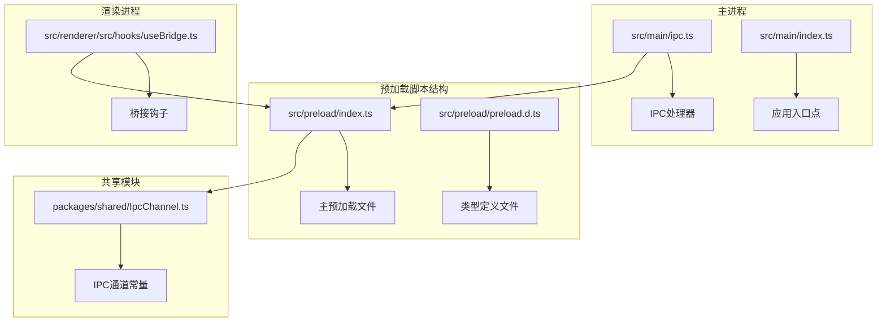
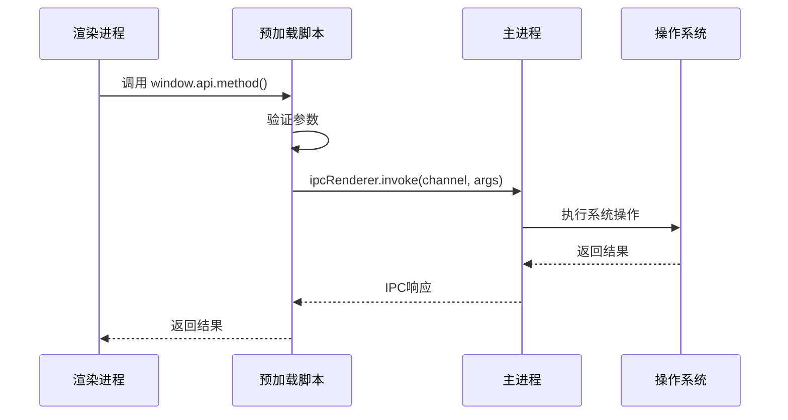
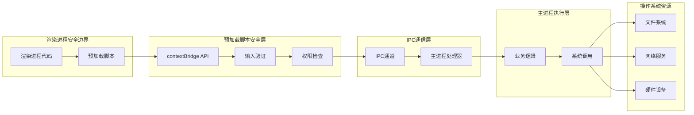
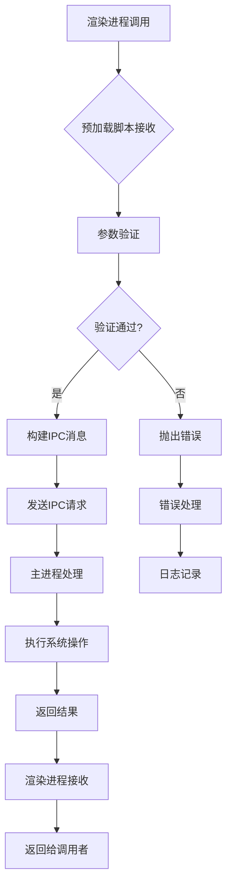
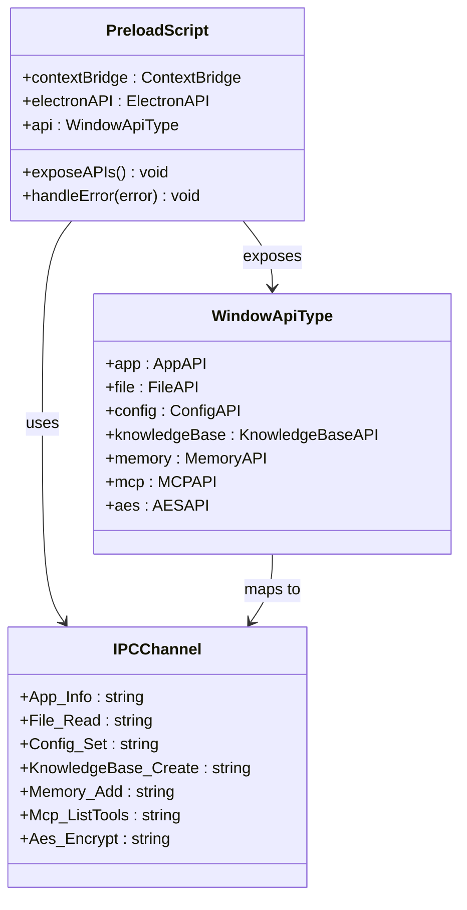
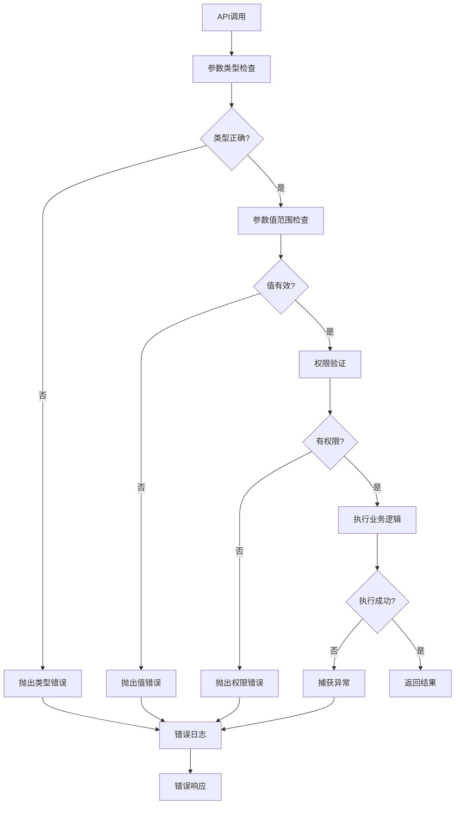
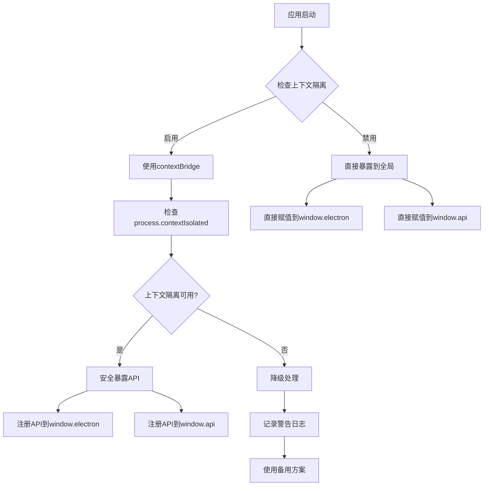
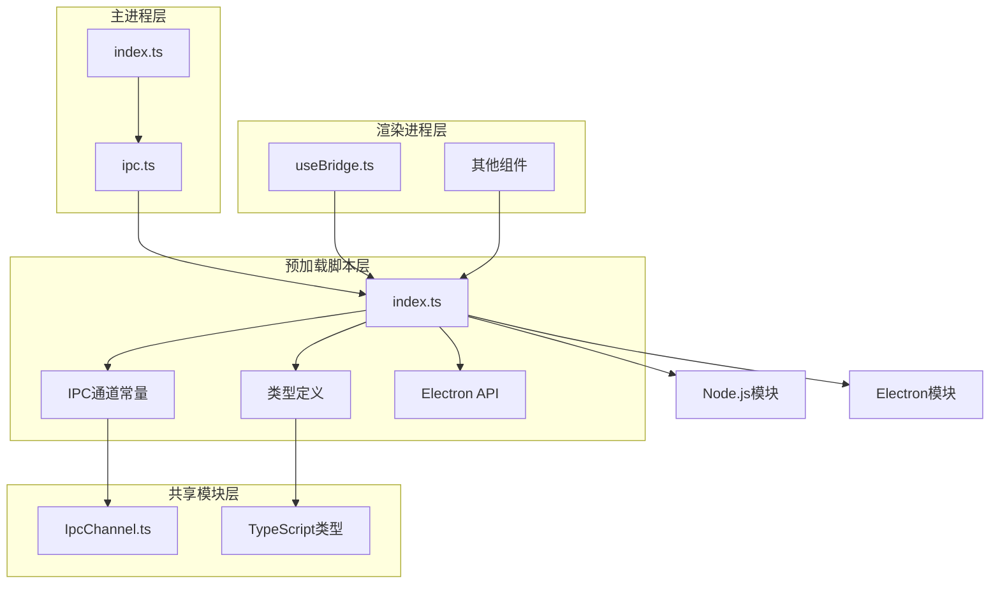
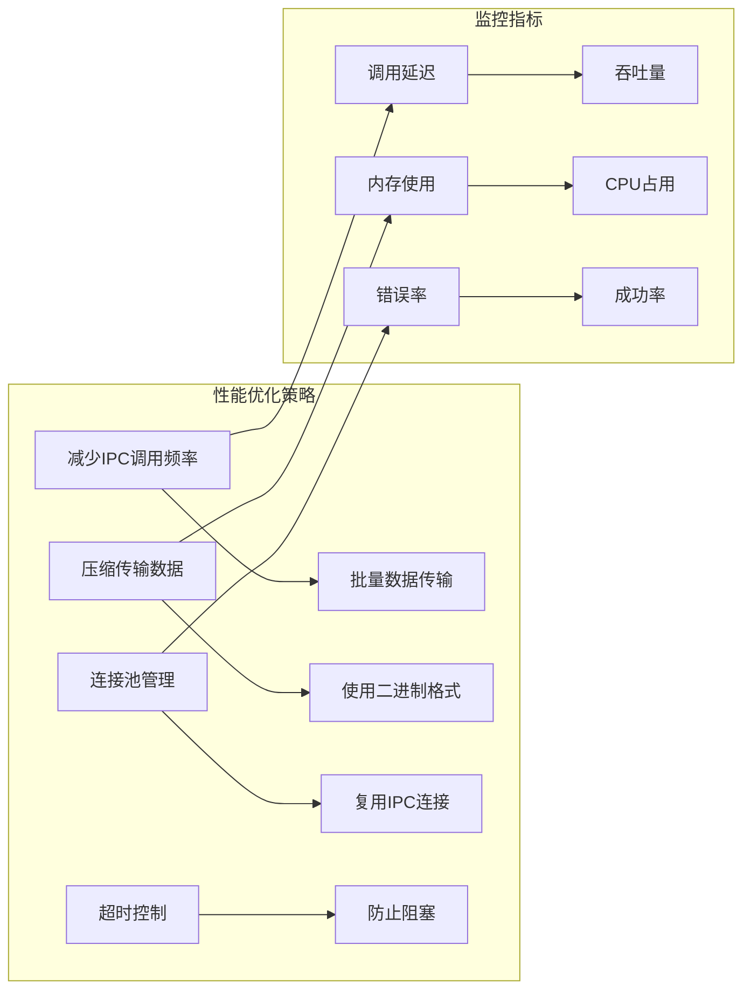

# 预加载脚本

<cite>
**本文档中引用的文件**
- [src/preload/index.ts](file://src/preload/index.ts)
- [src/preload/preload.d.ts](file://src/preload/preload.d.ts)
- [src/main/ipc.ts](file://src/main/ipc.ts)
- [src/main/index.ts](file://src/main/index.ts)
- [packages/shared/IpcChannel.ts](file://packages/shared/IpcChannel.ts)
- [src/renderer/src/hooks/useBridge.ts](file://src/renderer/src/hooks/useBridge.ts)
</cite>

## 目录
1. [简介](#简介)
2. [项目结构](#项目结构)
3. [核心组件](#核心组件)
4. [架构概览](#架构概览)
5. [详细组件分析](#详细组件分析)
6. [依赖关系分析](#依赖关系分析)
7. [性能考虑](#性能考虑)
8. [故障排除指南](#故障排除指南)
9. [结论](#结论)

## 简介

Cherry Studio的预加载脚本是Electron应用程序安全模型的核心组件，它作为主进程和渲染进程之间的安全桥梁，通过`contextBridge` API暴露受控的API给渲染进程，同时保持Node.js环境的隔离。预加载脚本实现了严格的权限控制和输入验证机制，确保渲染进程只能访问经过授权的功能接口。

预加载脚本的主要职责包括：
- 安全地暴露Electron API给渲染进程
- 封装IPC通信，提供统一的API接口
- 实现输入验证和错误处理
- 提供同步和异步方法供前端调用
- 维护开发和生产环境的差异处理

## 项目结构

Cherry Studio的预加载脚本位于`src/preload/`目录下，包含以下关键文件：

**图表来源**
- [src/preload/index.ts](file://src/preload/index.ts#L1-L50)
- [packages/shared/IpcChannel.ts](file://packages/shared/IpcChannel.ts#L1-L50)

**章节来源**
- [src/preload/index.ts](file://src/preload/index.ts#L1-L50)
- [src/preload/preload.d.ts](file://src/preload/preload.d.ts#L1-L12)

## 核心组件

### contextBridge API暴露机制

预加载脚本使用`contextBridge` API来安全地暴露Electron功能给渲染进程。这个机制确保了即使在启用了上下文隔离的情况下，渲染进程也能安全地访问必要的系统功能。

**图表来源**
- [src/preload/index.ts](file://src/preload/index.ts#L578-L593)
- [src/main/ipc.ts](file://src/main/ipc.ts#L115-L120)

### API分类体系

预加载脚本提供了丰富的API分类，涵盖了应用程序的各个方面：

| API类别 | 功能描述 | 示例方法 |
|---------|----------|----------|
| 应用管理 | 应用程序生命周期管理 | `getAppInfo`, `quit`, `reload` |
| 文件操作 | 文件系统交互 | `file.read`, `file.write`, `file.delete` |
| 配置管理 | 应用设置管理 | `config.set`, `config.get` |
| 备份恢复 | 数据备份与恢复 | `backup.backup`, `backup.restore` |
| 知识库 | 知识管理功能 | `knowledgeBase.create`, `knowledgeBase.search` |
| 内存管理 | 对话记忆存储 | `memory.add`, `memory.search` |
| MCP服务 | 多模型通信协议 | `mcp.listTools`, `mcp.callTool` |
| 加密解密 | 数据加密功能 | `aes.encrypt`, `aes.decrypt` |

**章节来源**
- [src/preload/index.ts](file://src/preload/index.ts#L69-L593)

## 架构概览

### 安全模型架构

Cherry Studio采用多层安全防护模型，预加载脚本在其中扮演着关键的安全中介角色：

**图表来源**
- [src/preload/index.ts](file://src/preload/index.ts#L578-L593)
- [src/main/ipc.ts](file://src/main/ipc.ts#L115-L200)

### IPC通信流程

预加载脚本封装了复杂的IPC通信机制，为渲染进程提供简洁的API接口：

**图表来源**
- [src/preload/index.ts](file://src/preload/index.ts#L61-L67)
- [src/main/ipc.ts](file://src/main/ipc.ts#L115-L150)

**章节来源**
- [src/preload/index.ts](file://src/preload/index.ts#L578-L593)
- [src/main/ipc.ts](file://src/main/ipc.ts#L115-L200)

## 详细组件分析

### contextBridge API暴露实现

预加载脚本通过`contextBridge.exposeInMainWorld`方法安全地暴露API：

**图表来源**
- [src/preload/index.ts](file://src/preload/index.ts#L578-L593)
- [packages/shared/IpcChannel.ts](file://packages/shared/IpcChannel.ts#L1-L50)

### 输入验证和错误处理机制

预加载脚本实现了多层次的输入验证和错误处理：

**图表来源**
- [src/preload/index.ts](file://src/preload/index.ts#L69-L110)
- [src/main/ipc.ts](file://src/main/ipc.ts#L104-L113)

### 同步和异步方法支持

预加载脚本提供了统一的API接口，支持同步和异步操作：

| 方法类型 | 实现方式 | 使用场景 | 示例 |
|----------|----------|----------|------|
| 异步方法 | `ipcRenderer.invoke()` | 文件读写、网络请求 | `window.api.file.read(filePath)` |
| 同步方法 | `ipcRenderer.send()` | 快速状态查询 | `window.api.app.getInfo()` |
| 回调方法 | 事件监听器 | 文件变更通知 | `window.api.file.onFileChange()` |
| 流式方法 | 事件流处理 | 大文件传输 | `window.api.file.readStream()` |

**章节来源**
- [src/preload/index.ts](file://src/preload/index.ts#L69-L593)
- [src/main/ipc.ts](file://src/main/ipc.ts#L115-L300)

### 开发和生产环境差异处理

预加载脚本根据运行环境自动调整行为：

**图表来源**
- [src/preload/index.ts](file://src/preload/index.ts#L578-L593)

**章节来源**
- [src/preload/index.ts](file://src/preload/index.ts#L578-L593)

## 依赖关系分析

### 模块依赖图

预加载脚本与整个应用程序的其他模块存在复杂的依赖关系：

**图表来源**
- [src/preload/index.ts](file://src/preload/index.ts#L1-L40)
- [packages/shared/IpcChannel.ts](file://packages/shared/IpcChannel.ts#L1-L30)

### 类型系统集成

预加载脚本与TypeScript类型系统深度集成，提供编译时类型检查：

| 类型文件 | 功能 | 包含内容 |
|----------|------|----------|
| `index.ts` | 主要类型定义 | `WindowApiType` 接口 |
| `preload.d.ts` | 全局声明 | `Window` 接口扩展 |
| `IpcChannel.ts` | IPC通道类型 | `IpcChannel` 枚举 |

**章节来源**
- [src/preload/index.ts](file://src/preload/index.ts#L1-L40)
- [src/preload/preload.d.ts](file://src/preload/preload.d.ts#L1-L12)
- [packages/shared/IpcChannel.ts](file://packages/shared/IpcChannel.ts#L1-L379)

## 性能考虑

### 预加载脚本性能优化策略

预加载脚本采用了多种性能优化技术：

1. **延迟初始化**: 只在需要时才初始化昂贵的操作
2. **缓存机制**: 缓存频繁访问的数据和计算结果
3. **批量操作**: 将多个小操作合并为批量操作
4. **异步处理**: 使用异步模式避免阻塞主线程

### IPC通信性能优化

### 内存管理

预加载脚本注意内存使用效率，避免内存泄漏：

- 及时清理事件监听器
- 避免循环引用
- 合理使用WeakMap等弱引用结构
- 监控内存使用情况

## 故障排除指南

### 常见问题及解决方案

| 问题类型 | 症状 | 可能原因 | 解决方案 |
|----------|------|----------|----------|
| API不可用 | `window.api` 未定义 | 预加载脚本加载失败 | 检查预加载脚本路径和语法 |
| IPC通信失败 | 调用API无响应 | 主进程未注册处理器 | 检查主进程IPC处理器注册 |
| 权限错误 | 访问被拒绝 | 参数验证失败 | 检查输入参数的有效性 |
| 类型错误 | 运行时类型异常 | TypeScript类型不匹配 | 更新类型定义或修正调用 |

### 调试技巧

1. **启用开发者工具**: 在开发环境中启用Electron开发者工具
2. **日志记录**: 在预加载脚本中添加详细的日志输出
3. **断点调试**: 在预加载脚本中设置断点进行调试
4. **单元测试**: 为预加载脚本编写单元测试

**章节来源**
- [src/preload/index.ts](file://src/preload/index.ts#L585-L587)
- [src/main/ipc.ts](file://src/main/ipc.ts#L115-L150)

## 结论

Cherry Studio的预加载脚本是一个精心设计的安全桥梁，它成功地在保证安全性的同时提供了丰富的功能接口。通过`contextBridge` API的安全暴露机制、完善的输入验证和错误处理、以及高效的IPC通信封装，预加载脚本为整个应用程序的安全性和稳定性奠定了坚实的基础。

预加载脚本的设计体现了现代Electron应用程序的最佳实践，包括：
- 严格的安全边界控制
- 清晰的API分类和组织
- 完善的错误处理机制
- 高效的性能优化策略
- 良好的开发体验支持

随着应用程序功能的不断扩展，预加载脚本将继续发挥其关键作用，为用户提供安全、可靠、高性能的应用体验。