# AI助手管理

<cite>
**本文档中引用的文件**
- [AssistantService.ts](file://src/renderer/src/services/AssistantService.ts)
- [assistants.ts](file://src/renderer/src/store/assistants.ts)
- [agent.ts](file://src/renderer/src/types/agent.ts)
- [index.ts](file://src/renderer/src/types/index.ts)
- [AddAssistantPresetPopup.tsx](file://src/renderer/src/pages/store/assistants/presets/components/AddAssistantPresetPopup.tsx)
- [AssistantPresetCard.tsx](file://src/renderer/src/pages/store/assistants/presets/components/AssistantPresetCard.tsx)
- [AssistantPresetsPage.tsx](file://src/renderer/src/pages/store/assistants/presets/AssistantPresetsPage.tsx)
- [useAssistantPresets.ts](file://src/renderer/src/hooks/useAssistantPresets.ts)
- [upgrades.ts](file://src/renderer/src/databases/upgrades.ts)
- [MigrationService.ts](file://src/main/services/agents/database/MigrationService.ts)
- [DatabaseManager.ts](file://src/main/services/agents/database/DatabaseManager.ts)
- [constant.ts](file://src/renderer/src/config/constant.ts)
- [AssistantSettings.tsx](file://src/renderer/src/pages/settings/AssistantSettings/AssistantPromptSettings.tsx)
- [AssistantModelSettings.tsx](file://src/renderer/src/pages/settings/AssistantSettings/AssistantModelSettings.tsx)
- [AssistantMCPSettings.tsx](file://src/renderer/src/pages/settings/AssistantSettings/AssistantMCPSettings.tsx)
- [DefaultAssistantSettings.tsx](file://src/renderer/src/pages/settings/ModelSettings/DefaultAssistantSettings.tsx)
</cite>

## 目录
1. [简介](#简介)
2. [项目结构](#项目结构)
3. [核心组件](#核心组件)
4. [架构概览](#架构概览)
5. [详细组件分析](#详细组件分析)
6. [依赖关系分析](#依赖关系分析)
7. [性能考虑](#性能考虑)
8. [故障排除指南](#故障排除指南)
9. [结论](#结论)

## 简介

Cherry Studio的AI助手管理系统是一个功能完善的智能对话助手解决方案，提供了从预配置助手到自定义助手的完整生命周期管理。该系统支持助手的创建、配置、对话管理和持久化存储，具有强大的插件系统和工具权限管理功能。

系统采用现代化的架构设计，结合Redux进行全局状态管理，使用Drizzle ORM进行数据库操作，并通过分层的服务架构确保代码的可维护性和扩展性。

## 项目结构

AI助手管理功能的核心文件组织如下：

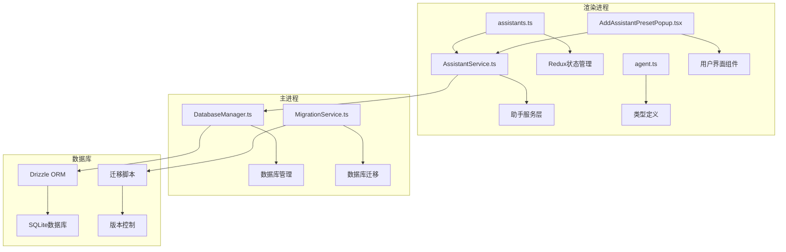

**图表来源**
- [AssistantService.ts](file://src/renderer/src/services/AssistantService.ts#L1-L214)
- [assistants.ts](file://src/renderer/src/store/assistants.ts#L1-L266)
- [DatabaseManager.ts](file://src/main/services/agents/database/DatabaseManager.ts#L49-L95)

## 核心组件

### 助手数据模型

AI助手系统的核心数据模型包含以下关键属性：

| 属性 | 类型 | 描述 | 必需 |
|------|------|------|------|
| id | string | 唯一标识符 | 是 |
| name | string | 助手名称 | 是 |
| prompt | string | 系统提示词 | 是 |
| emoji | string | 表情符号 | 否 |
| knowledge_bases | KnowledgeBase[] | 知识库列表 | 否 |
| topics | Topic[] | 对话主题列表 | 是 |
| type | string | 助手类型（assistant/agent） | 是 |
| model | Model | 默认模型配置 | 否 |
| settings | AssistantSettings | 助手设置 | 否 |
| messages | AssistantMessage[] | 消息历史 | 否 |
| mcpServers | MCPServer[] | MCP服务器列表 | 否 |
| tags | string[] | 助手标签 | 否 |

### 预配置助手模型

预配置助手（AssistantPreset）是系统提供的模板助手，具有以下结构：

| 属性 | 类型 | 描述 |
|------|------|------|
| id | string | 预设唯一标识符 |
| name | string | 预设名称 |
| description | string | 预设描述 |
| prompt | string | 提示词内容 |
| emoji | string | 表情符号 |
| knowledge_base_ids | string[] | 关联的知识库ID |
| defaultModel | Model | 默认模型 |
| type | 'agent' | 固定类型 |
| topics | Topic[] | 主题列表 |
| messages | Message[] | 消息列表 |

**章节来源**
- [index.ts](file://src/renderer/src/types/index.ts#L28-L73)
- [agent.ts](file://src/renderer/src/types/agent.ts#L76-L92)

## 架构概览

AI助手管理系统采用分层架构设计，确保各层职责清晰分离：

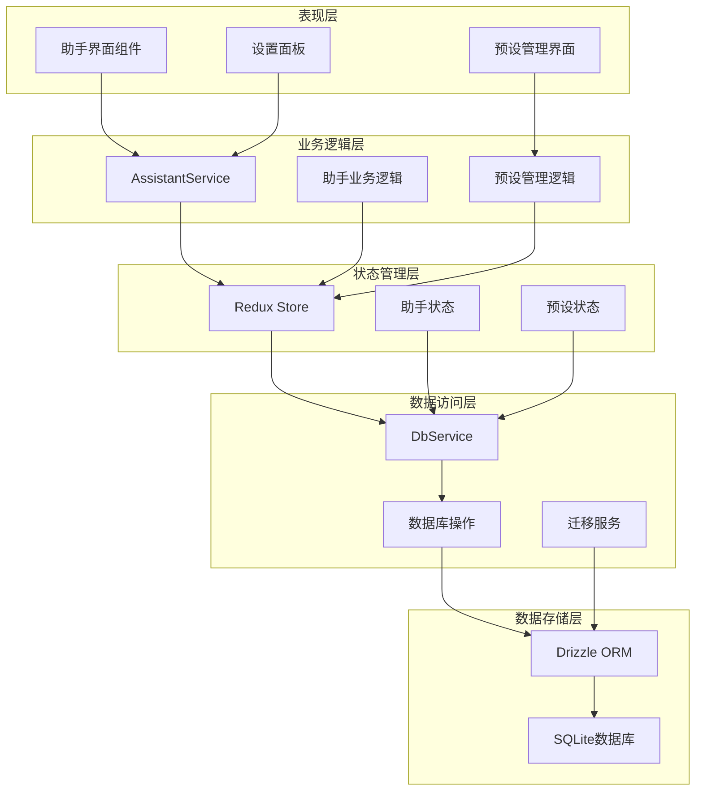

**图表来源**
- [AssistantService.ts](file://src/renderer/src/services/AssistantService.ts#L171-L213)
- [assistants.ts](file://src/renderer/src/store/assistants.ts#L30-L265)

## 详细组件分析

### 助手创建与初始化

#### createAssistantFromAgent函数

`createAssistantFromAgent`函数是助手创建的核心入口，负责将预配置助手转换为可使用的助手实例：

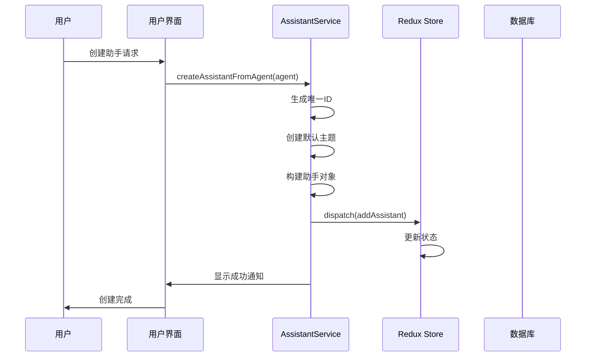

**图表来源**
- [AssistantService.ts](file://src/renderer/src/services/AssistantService.ts#L192-L213)

#### 助手状态管理

Redux状态管理通过专门的slice处理助手相关操作：

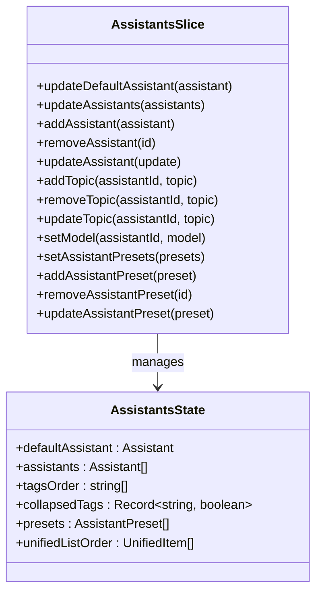

**图表来源**
- [assistants.ts](file://src/renderer/src/store/assistants.ts#L30-L265)

**章节来源**
- [AssistantService.ts](file://src/renderer/src/services/AssistantService.ts#L192-L213)
- [assistants.ts](file://src/renderer/src/store/assistants.ts#L30-L265)

### 预配置助手管理

#### 预设助手界面组件

预设助手管理提供了完整的CRUD操作界面：

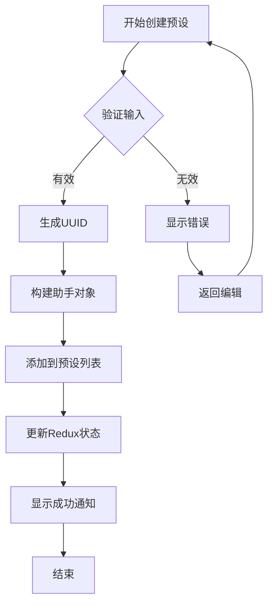

**图表来源**
- [AddAssistantPresetPopup.tsx](file://src/renderer/src/pages/store/assistants/presets/components/AddAssistantPresetPopup.tsx#L72-L130)

#### 预设助手钩子

`useAssistantPresets`钩子提供了预设助手的状态管理功能：

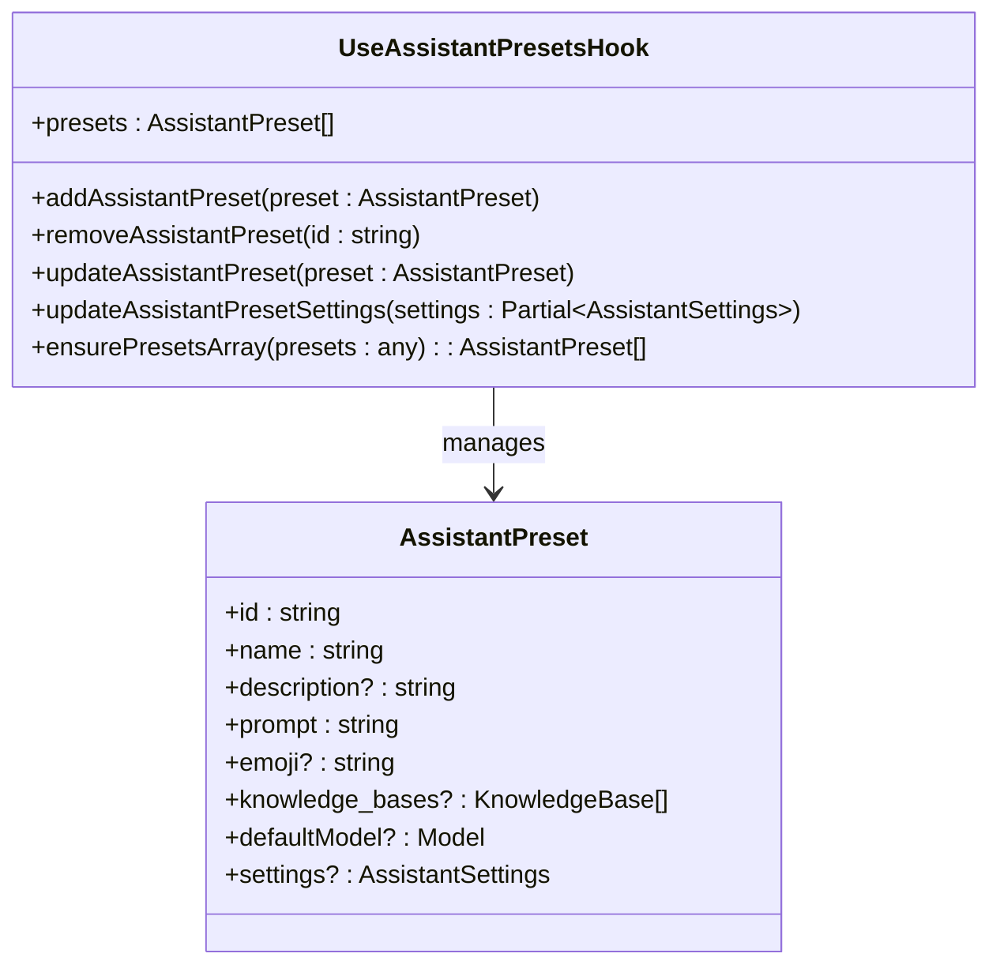

**图表来源**
- [useAssistantPresets.ts](file://src/renderer/src/hooks/useAssistantPresets.ts#L38-L59)

**章节来源**
- [AddAssistantPresetPopup.tsx](file://src/renderer/src/pages/store/assistants/presets/components/AddAssistantPresetPopup.tsx#L72-L130)
- [useAssistantPresets.ts](file://src/renderer/src/hooks/useAssistantPresets.ts#L38-L59)

### 助手设置与配置

#### 助手模型设置

助手模型设置包含了丰富的配置选项：

| 设置项 | 类型 | 默认值 | 描述 |
|--------|------|--------|------|
| temperature | number | 1.0 | 温度参数，控制随机性 |
| contextCount | number | 5 | 上下文窗口大小 |
| enableMaxTokens | boolean | false | 是否启用最大令牌数限制 |
| maxTokens | number | 4096 | 最大令牌数 |
| streamOutput | boolean | true | 是否流式输出 |
| topP | number | 1.0 | Top-P采样参数 |
| toolUseMode | string | 'function' | 工具使用模式 |
| customParameters | object[] | [] | 自定义参数 |

#### 助手提示词设置

提示词设置允许用户自定义助手的行为和响应风格：

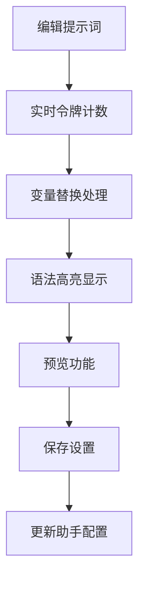

**图表来源**
- [AssistantPromptSettings.tsx](file://src/renderer/src/pages/settings/AssistantSettings/AssistantPromptSettings.tsx#L28-L68)

**章节来源**
- [constant.ts](file://src/renderer/src/config/constant.ts#L1-L44)
- [AssistantModelSettings.tsx](file://src/renderer/src/pages/settings/AssistantSettings/AssistantModelSettings.tsx#L29-L51)

### 数据库迁移与持久化

#### 数据库迁移系统

系统使用Drizzle ORM进行数据库操作，并实现了完整的迁移机制：

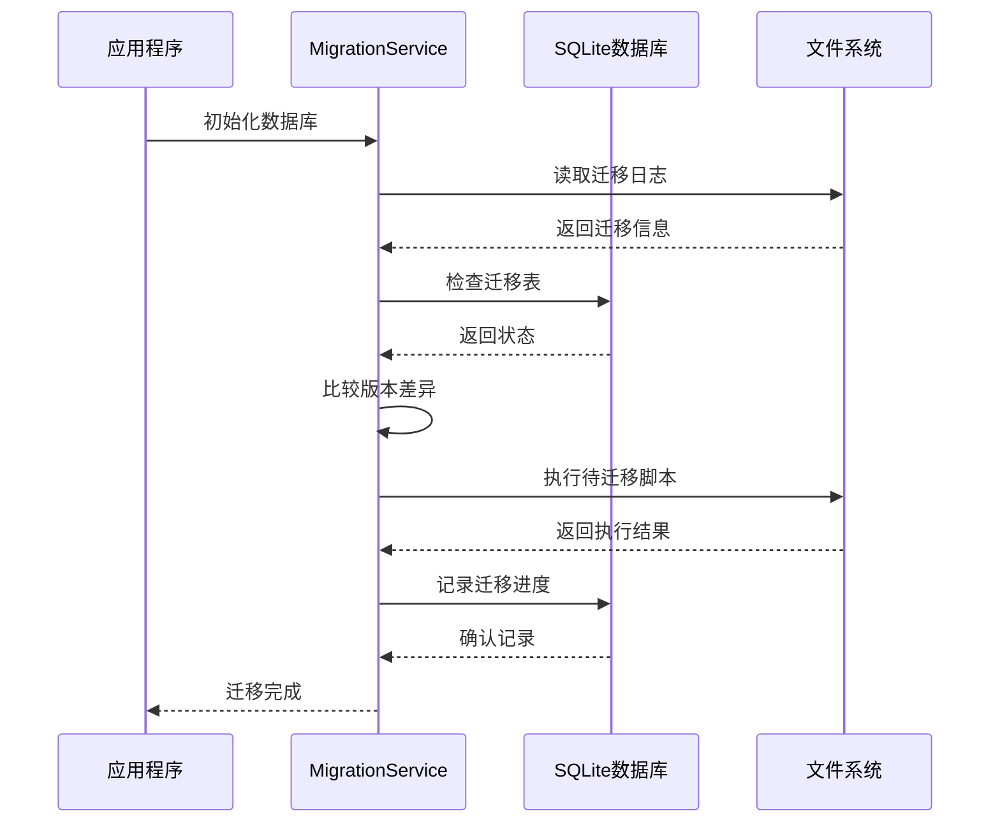

**图表来源**
- [MigrationService.ts](file://src/main/services/agents/database/MigrationService.ts#L36-L82)

#### 数据升级处理

系统支持复杂的数据结构升级，特别是消息块的规范化处理：

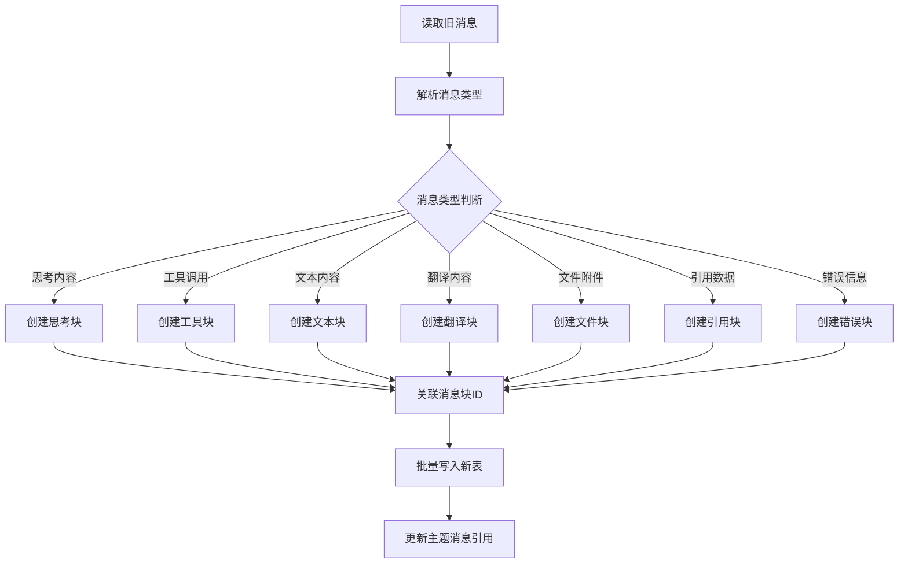

**图表来源**
- [upgrades.ts](file://src/renderer/src/databases/upgrades.ts#L95-L318)

**章节来源**
- [MigrationService.ts](file://src/main/services/agents/database/MigrationService.ts#L36-L82)
- [upgrades.ts](file://src/renderer/src/databases/upgrades.ts#L95-L318)

### MCP服务器集成

#### MCP服务器管理

MCP（Model Context Protocol）服务器集成了外部工具和服务：

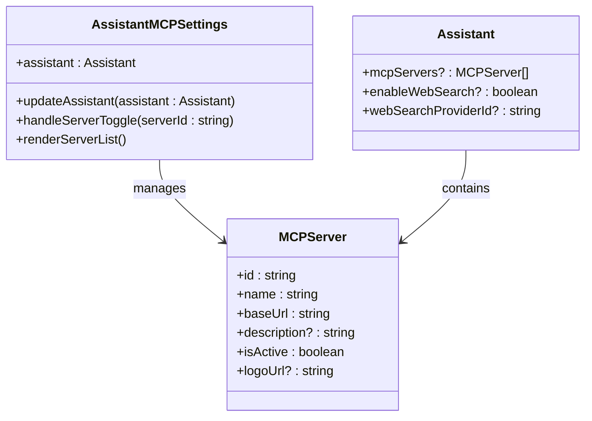

**图表来源**
- [AssistantMCPSettings.tsx](file://src/renderer/src/pages/settings/AssistantSettings/AssistantMCPSettings.tsx#L38-L121)

**章节来源**
- [AssistantMCPSettings.tsx](file://src/renderer/src/pages/settings/AssistantSettings/AssistantMCPSettings.tsx#L38-L121)

## 依赖关系分析

### 组件依赖图

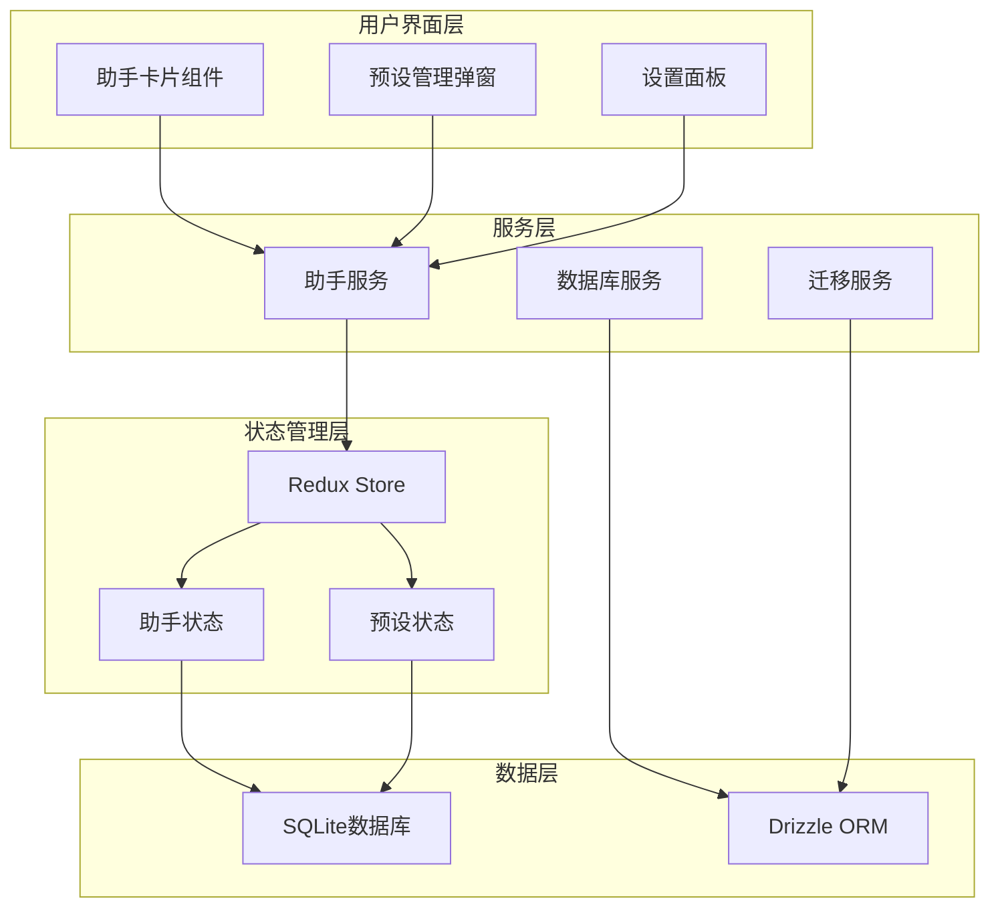

**图表来源**
- [AssistantService.ts](file://src/renderer/src/services/AssistantService.ts#L1-L214)
- [assistants.ts](file://src/renderer/src/store/assistants.ts#L1-L266)

### 外部依赖

系统的主要外部依赖包括：

| 依赖包 | 版本 | 用途 |
|--------|------|------|
| @reduxjs/toolkit | ^2.0.0 | Redux状态管理 |
| drizzle-orm | ^0.29.0 | 数据库ORM |
| libsql/client | ^0.3.0 | SQLite客户端 |
| zod | ^3.22.0 | 类型验证 |
| lodash | ^4.17.0 | 工具函数 |

**章节来源**
- [AssistantService.ts](file://src/renderer/src/services/AssistantService.ts#L1-L214)
- [assistants.ts](file://src/renderer/src/store/assistants.ts#L1-L266)

## 性能考虑

### 状态管理优化

系统采用了多种性能优化策略：

1. **选择器缓存**：使用`createSelector`避免重复计算
2. **状态分片**：将助手状态独立管理，减少不必要的重渲染
3. **批量操作**：支持批量更新助手和预设
4. **懒加载**：按需加载助手数据

### 数据库优化

1. **事务处理**：使用数据库事务确保数据一致性
2. **索引优化**：为常用查询字段建立索引
3. **连接池**：管理数据库连接资源
4. **迁移优化**：增量迁移减少数据传输量

### 内存管理

1. **对象池**：复用助手对象减少GC压力
2. **弱引用**：避免循环引用导致的内存泄漏
3. **及时清理**：主动清理不再使用的资源

## 故障排除指南

### 常见问题及解决方案

#### 助手创建失败

**问题症状**：创建助手时出现错误提示

**可能原因**：
1. 网络连接问题
2. 数据库连接失败
3. 输入验证失败

**解决步骤**：
1. 检查网络连接状态
2. 重启应用程序
3. 清理应用缓存
4. 查看错误日志获取详细信息

#### 预设助手丢失

**问题症状**：已保存的预设助手无法显示

**可能原因**：
1. 数据库损坏
2. 迁移失败
3. 权限问题

**解决步骤**：
1. 检查数据库完整性
2. 执行数据库修复
3. 重新导入预设
4. 联系技术支持

#### 设置不生效

**问题症状**：修改助手设置后没有预期效果

**可能原因**：
1. 状态同步延迟
2. 缓存问题
3. 配置冲突

**解决步骤**：
1. 刷新页面
2. 清除浏览器缓存
3. 重新登录账户
4. 检查配置文件

**章节来源**
- [MigrationService.ts](file://src/main/services/agents/database/MigrationService.ts#L36-L82)
- [upgrades.ts](file://src/renderer/src/databases/upgrades.ts#L95-L318)

## 结论

Cherry Studio的AI助手管理系统是一个功能完善、架构合理的智能对话助手解决方案。系统通过模块化的架构设计、完善的状态管理和强大的数据库迁移机制，为用户提供了稳定可靠的助手管理体验。

### 主要优势

1. **完整的生命周期管理**：从创建到删除的全流程支持
2. **灵活的配置系统**：丰富的设置选项满足不同需求
3. **强大的扩展能力**：MCP服务器集成支持第三方工具
4. **可靠的数据持久化**：完善的数据库迁移和备份机制
5. **优秀的用户体验**：直观的界面和流畅的操作体验

### 技术特色

1. **现代化架构**：采用Redux + TypeScript + React的组合
2. **类型安全**：完整的TypeScript类型定义
3. **异步处理**：良好的异步操作和错误处理机制
4. **性能优化**：多层次的性能优化策略
5. **可维护性**：清晰的代码结构和文档

该系统为AI助手的开发和使用提供了坚实的基础，具备良好的扩展性和稳定性，能够满足从个人用户到企业级应用的各种需求。