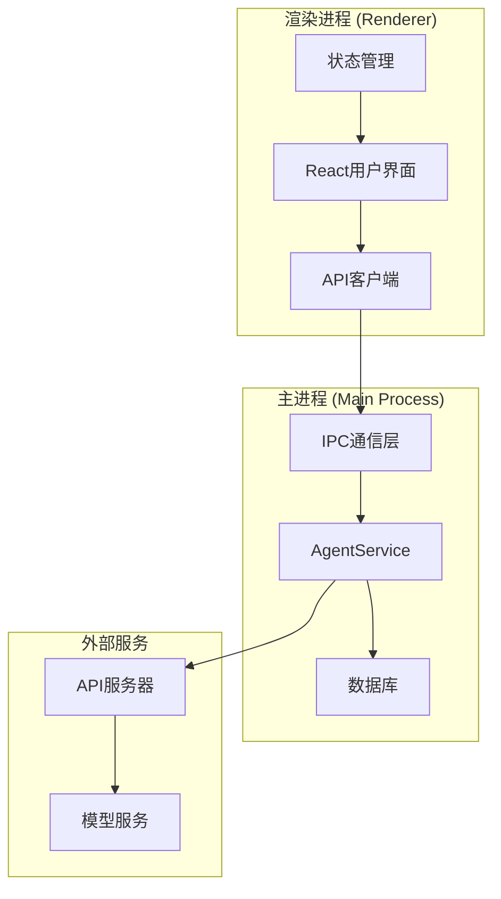
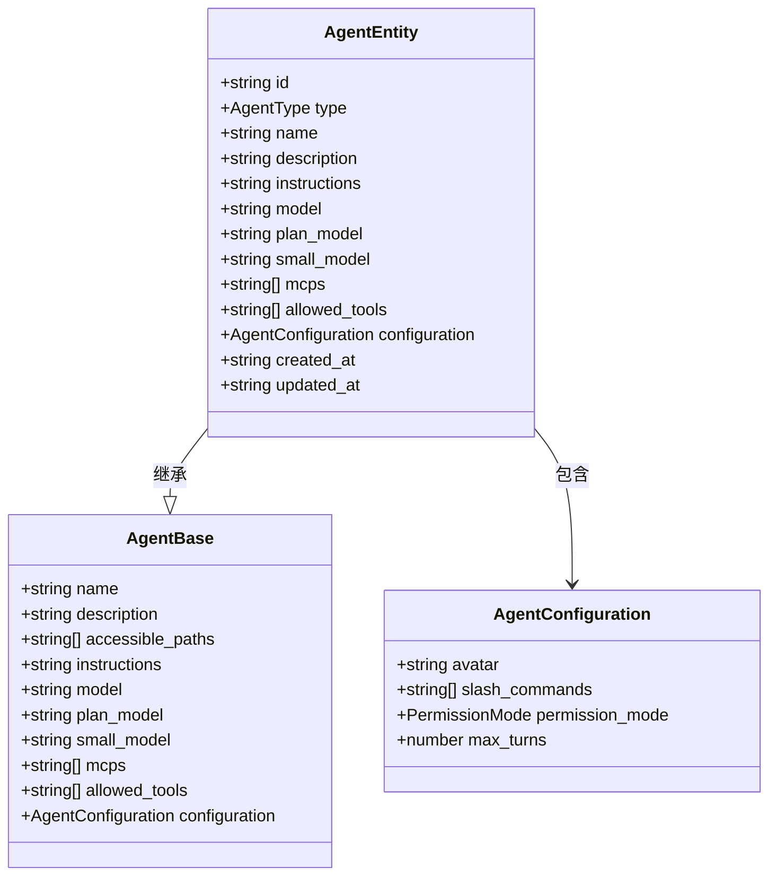
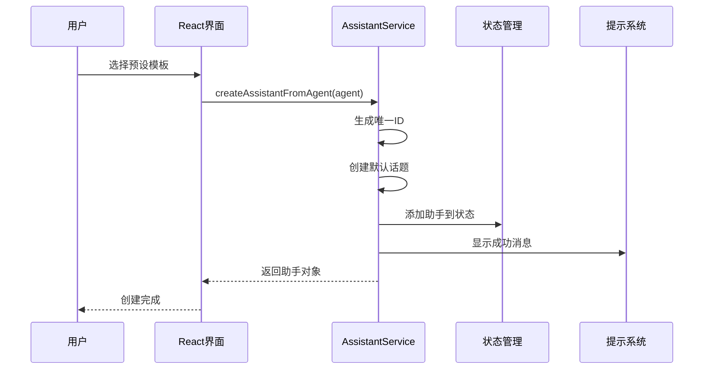
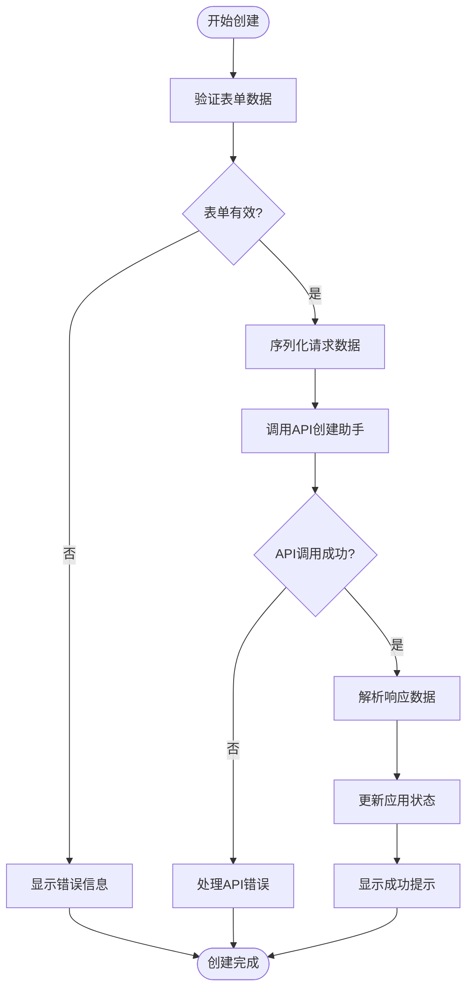
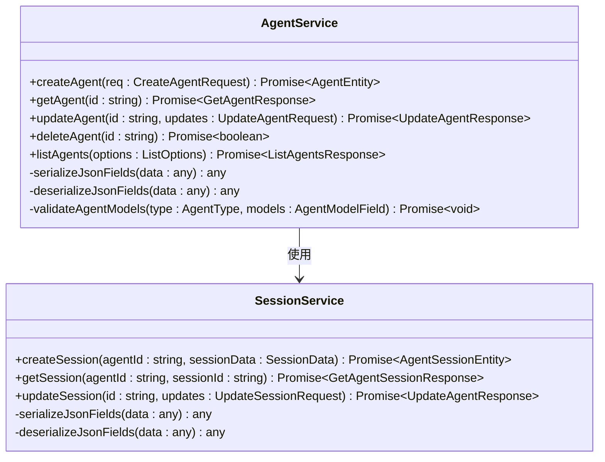
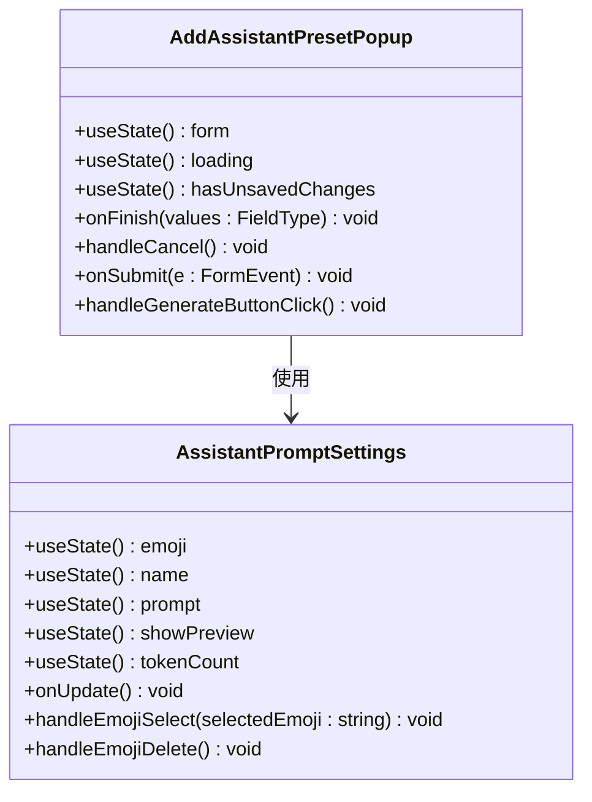
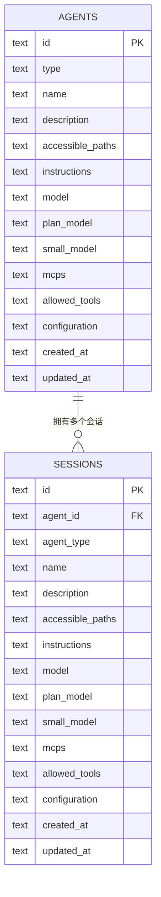
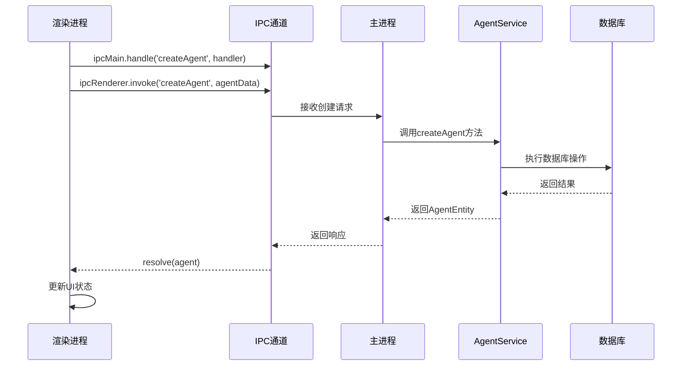
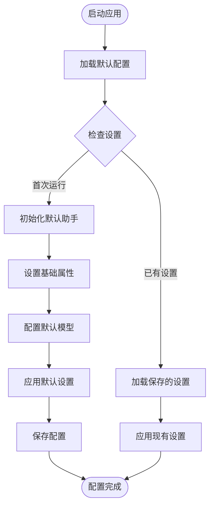

# 助手创建功能详细文档

<cite>
**本文档中引用的文件**
- [AgentService.ts](file://src/main/services/agents/services/AgentService.ts)
- [agents.schema.ts](file://src/main/services/agents/database/schema/agents.schema.ts)
- [index.ts](file://src/main/apiServer/routes/agents/index.ts)
- [agent.ts](file://src/renderer/src/api/agent.ts)
- [AssistantService.ts](file://src/renderer/src/services/AssistantService.ts)
- [AddAssistantPresetPopup.tsx](file://src/renderer/src/pages/store/assistants/presets/components/AddAssistantPresetPopup.tsx)
- [agent.ts](file://src/renderer/src/types/agent.ts)
- [AssistantPromptSettings.tsx](file://src/renderer/src/pages/settings/AssistantSettings/AssistantPromptSettings.tsx)
- [DefaultAssistantSettings.tsx](file://src/renderer/src/pages/settings/ModelSettings/DefaultAssistantSettings.tsx)
- [SessionService.ts](file://src/main/services/agents/services/SessionService.ts)
</cite>

## 目录
1. [简介](#简介)
2. [系统架构概览](#系统架构概览)
3. [核心数据模型](#核心数据模型)
4. [助手创建流程](#助手创建流程)
5. [服务层实现](#服务层实现)
6. [用户界面组件](#用户界面组件)
7. [数据库架构](#数据库架构)
8. [IPC通信机制](#ipc通信机制)
9. [默认助手配置](#默认助手配置)
10. [扩展与定制](#扩展与定制)
11. [故障排除指南](#故障排除指南)
12. [总结](#总结)

## 简介

Cherry Studio的助手创建功能是一个复杂而强大的系统，支持从预配置模板创建助手和完全自定义创建助手两种方式。该系统采用前后端分离架构，通过React前端界面与Electron主进程进行通信，实现了完整的助手生命周期管理。

本文档详细阐述了助手创建功能的技术实现，包括数据模型设计、服务层架构、用户界面交互以及数据库持久化等各个方面。

## 系统架构概览

Cherry Studio助手创建系统采用多层架构设计，确保了良好的可维护性和扩展性：



**图表来源**
- [AgentService.ts](file://src/main/services/agents/services/AgentService.ts)
- [agent.ts](file://src/renderer/src/api/agent.ts)
- [index.ts](file://src/main/apiServer/routes/agents/index.ts)

**章节来源**
- [AgentService.ts](file://src/main/services/agents/services/AgentService.ts#L45-L214)
- [agent.ts](file://src/renderer/src/api/agent.ts#L58-L261)

## 核心数据模型

### Agent实体模型

助手系统的核心数据模型基于Zod验证器构建，确保数据的一致性和完整性：



**图表来源**
- [agent.ts](file://src/renderer/src/types/agent.ts#L68-L118)

### 关键属性详解

| 属性名 | 类型 | 必填 | 描述 | 默认值 |
|--------|------|------|------|--------|
| id | string | 是 | 唯一标识符 | 自动生成 |
| type | AgentType | 是 | 助手类型 | 'claude-code' |
| name | string | 是 | 助手名称 | 'New Agent' |
| description | string | 否 | 助手描述 | null |
| instructions | string | 否 | 系统提示词 | 'You are a helpful assistant.' |
| model | string | 是 | 主要模型ID | 必填 |
| plan_model | string | 否 | 规划模型ID | null |
| small_model | string | 否 | 小模型ID | null |
| mcps | string[] | 否 | MCP工具列表 | [] |
| allowed_tools | string[] | 否 | 允许工具列表 | [] |
| configuration | AgentConfiguration | 否 | 配置选项 | {} |
| created_at | string | 是 | 创建时间戳 | 当前时间 |
| updated_at | string | 是 | 更新时间戳 | 当前时间 |

**章节来源**
- [agent.ts](file://src/renderer/src/types/agent.ts#L68-L118)
- [agents.schema.ts](file://src/main/services/agents/database/schema/agents.schema.ts#L7-L36)

## 助手创建流程

### 预配置模板创建流程

预配置模板创建是最简单的助手创建方式，用户从系统提供的预设模板中选择：



**图表来源**
- [AssistantService.ts](file://src/renderer/src/services/AssistantService.ts#L192-L213)

### 自定义创建流程

自定义创建允许用户完全控制助手的配置：



**图表来源**
- [AddAssistantPresetPopup.tsx](file://src/renderer/src/pages/store/assistants/presets/components/AddAssistantPresetPopup.tsx#L72-L130)

**章节来源**
- [AddAssistantPresetPopup.tsx](file://src/renderer/src/pages/store/assistants/presets/components/AddAssistantPresetPopup.tsx#L72-L130)
- [AssistantService.ts](file://src/renderer/src/services/AssistantService.ts#L192-L213)

## 服务层实现

### AgentService核心方法

AgentService是助手创建功能的核心服务，提供了完整的CRUD操作：



**图表来源**
- [AgentService.ts](file://src/main/services/agents/services/AgentService.ts#L45-L214)
- [SessionService.ts](file://src/main/services/agents/services/SessionService.ts#L113-L152)

### createAgent方法实现

createAgent方法是助手创建的核心入口点：

```typescript
// 核心创建逻辑路径
async createAgent(req: CreateAgentRequest): Promise<AgentEntity> {
    // 1. 数据验证和清理
    if (req.accessible_paths !== undefined) {
        req.accessible_paths = this.ensurePathsExist(req.accessible_paths)
    }
    
    // 2. 模型验证
    await this.validateAgentModels(req.type, {
        model: req.model,
        plan_model: req.plan_model,
        small_model: req.small_model
    })
    
    // 3. 序列化JSON字段
    const serializedReq = this.serializeJsonFields(req)
    
    // 4. 构建插入数据
    const insertData: InsertAgentRow = {
        id,
        type: req.type,
        name: req.name || 'New Agent',
        description: req.description,
        instructions: req.instructions || 'You are a helpful assistant.',
        model: req.model,
        plan_model: req.plan_model,
        small_model: req.small_model,
        configuration: serializedReq.configuration,
        accessible_paths: serializedReq.accessible_paths,
        created_at: now,
        updated_at: now
    }
    
    // 5. 数据库操作
    const database = await this.getDatabase()
    await database.insert(agentsTable).values(insertData)
    
    // 6. 查询确认
    const result = await database.select().from(agentsTable).where(eq(agentsTable.id, id)).limit(1)
    
    // 7. 反序列化返回
    const agent = this.deserializeJsonFields(result[0]) as AgentEntity
    return agent
}
```

**章节来源**
- [AgentService.ts](file://src/main/services/agents/services/AgentService.ts#L45-L80)

## 用户界面组件

### 助手创建弹窗组件

助手创建界面采用现代化的React组件设计：



**图表来源**
- [AddAssistantPresetPopup.tsx](file://src/renderer/src/pages/store/assistants/presets/components/AddAssistantPresetPopup.tsx#L72-L130)
- [AssistantPromptSettings.tsx](file://src/renderer/src/pages/settings/AssistantSettings/AssistantPromptSettings.tsx#L28-L68)

### 表单验证和状态管理

界面组件实现了完整的表单验证和状态管理：

| 字段 | 验证规则 | 错误处理 | 用户反馈 |
|------|----------|----------|----------|
| name | 非空字符串 | 实时验证 | 即时错误提示 |
| prompt | 非空内容 | 实时字数统计 | Token计数显示 |
| model | 必选模型 | 下拉选择验证 | 模型可用性检查 |
| accessible_paths | 路径数组 | 文件系统验证 | 路径有效性提示 |
| instructions | 文本内容 | 编辑器集成 | 实时预览功能 |

**章节来源**
- [AddAssistantPresetPopup.tsx](file://src/renderer/src/pages/store/assistants/presets/components/AddAssistantPresetPopup.tsx#L72-L130)
- [AssistantPromptSettings.tsx](file://src/renderer/src/pages/settings/AssistantSettings/AssistantPromptSettings.tsx#L28-L68)

## 数据库架构

### SQLite数据库设计

助手系统使用SQLite作为主要存储引擎，采用Drizzle ORM进行数据访问：



**图表来源**
- [agents.schema.ts](file://src/main/services/agents/database/schema/agents.schema.ts#L7-L36)

### 数据库迁移和版本控制

系统采用Drizzle Kit进行数据库迁移管理：

| 迁移文件 | 版本号 | 修改内容 | 影响范围 |
|----------|--------|----------|----------|
| 0000_confused_wendigo.sql | v1 | 初始表结构 | agents |
| 0001_woozy_captain_flint.sql | v2 | 添加索引优化 | agents |
| 0002_wealthy_naoko.sql | v3 | 性能优化调整 | agents |

**章节来源**
- [agents.schema.ts](file://src/main/services/agents/database/schema/agents.schema.ts#L7-L36)
- [drizzle.config.ts](file://src/main/services/agents/drizzle.config.ts#L1-L31)

## IPC通信机制

### 渲染进程与主进程通信

Cherry Studio使用Electron的IPC机制实现前后端通信：



**图表来源**
- [index.ts](file://src/main/apiServer/routes/agents/index.ts#L391-L391)
- [agent.ts](file://src/renderer/src/api/agent.ts#L125-L135)

### API客户端封装

渲染进程中的AgentApiClient提供了统一的API访问接口：

```typescript
// API客户端核心方法
export class AgentApiClient {
    // 获取所有助手
    public async listAgents(options?: ListOptions): Promise<ListAgentsResponse>
    
    // 创建新助手
    public async createAgent(form: AddAgentForm): Promise<CreateAgentResponse>
    
    // 获取指定助手
    public async getAgent(id: string): Promise<GetAgentResponse>
    
    // 更新助手
    public async updateAgent(form: UpdateAgentForm): Promise<UpdateAgentResponse>
    
    // 删除助手
    public async deleteAgent(id: string): Promise<void>
}
```

**章节来源**
- [agent.ts](file://src/renderer/src/api/agent.ts#L125-L172)
- [index.ts](file://src/main/apiServer/routes/agents/index.ts#L391-L391)

## 默认助手配置

### 默认配置机制

系统提供了完整的默认助手配置机制，确保新用户能够快速上手：



**图表来源**
- [AssistantService.ts](file://src/renderer/src/services/AssistantService.ts#L44-L85)

### 默认设置参数

| 设置项 | 默认值 | 描述 | 可配置范围 |
|--------|--------|------|------------|
| temperature | 0.7 | 生成随机性 | 0.0 - 2.0 |
| contextCount | 10 | 上下文轮次 | 1 - 100 |
| enableMaxTokens | false | 启用最大令牌数 | true/false |
| maxTokens | 0 | 最大令牌数 | 0 - 无限 |
| streamOutput | true | 流式输出 | true/false |
| topP | 1.0 | 核采样参数 | 0.0 - 1.0 |
| toolUseMode | 'function' | 工具使用模式 | 'function'/'tool' |

**章节来源**
- [AssistantService.ts](file://src/renderer/src/services/AssistantService.ts#L30-L42)
- [DefaultAssistantSettings.tsx](file://src/renderer/src/pages/settings/ModelSettings/DefaultAssistantSettings.tsx#L20-L66)

## 扩展与定制

### 助手类型扩展

系统支持多种助手类型的扩展，目前主要支持`claude-code`类型：

```typescript
// 支持的助手类型
export const AgentTypeSchema = z.enum(['claude-code'])

// 扩展新类型的方法
export const ExtendedAgentTypeSchema = z.union([
    AgentTypeSchema,
    z.literal('custom-type'),
    z.literal('specialized-type')
])
```

### 自定义创建逻辑

开发者可以通过以下方式扩展创建逻辑：

1. **添加新的配置选项**
2. **实现自定义验证规则**
3. **集成第三方工具**
4. **扩展权限控制**

**章节来源**
- [agent.ts](file://src/renderer/src/types/agent.ts#L28-L33)

## 故障排除指南

### 常见问题及解决方案

| 问题类型 | 症状 | 可能原因 | 解决方案 |
|----------|------|----------|----------|
| 创建失败 | API调用返回错误 | 数据验证失败 | 检查必填字段和格式 |
| 数据丢失 | 重启后助手消失 | 数据库连接问题 | 检查数据库文件权限 |
| 性能问题 | 创建过程缓慢 | 网络延迟或资源不足 | 优化网络环境或升级硬件 |
| 权限错误 | 访问受限 | 路径权限配置不当 | 检查accessible_paths设置 |

### 调试和监控

系统提供了完整的日志记录和错误处理机制：

```typescript
// 错误处理示例
const processError = (error: unknown, fallbackMessage: string) => {
    logger.error(fallbackMessage, error as Error)
    if (isAxiosError(error)) {
        const result = AgentServerErrorSchema.safeParse(error.response?.data)
        if (result.success) {
            return new Error(formatAgentServerError(result.data))
        }
    }
    return new Error(fallbackMessage, { cause: error })
}
```

**章节来源**
- [agent.ts](file://src/renderer/src/api/agent.ts#L45-L56)

## 总结

Cherry Studio的助手创建功能是一个设计精良、功能完备的系统，具有以下特点：

1. **模块化架构**：清晰的前后端分离，便于维护和扩展
2. **数据安全**：完善的验证机制和错误处理
3. **用户体验**：直观的界面设计和实时反馈
4. **性能优化**：高效的数据库查询和缓存机制
5. **可扩展性**：灵活的插件系统和配置选项

该系统为用户提供了从简单模板到完全自定义的全方位助手创建能力，同时为开发者提供了良好的扩展接口和定制空间。通过合理的架构设计和完善的错误处理机制，确保了系统的稳定性和可靠性。