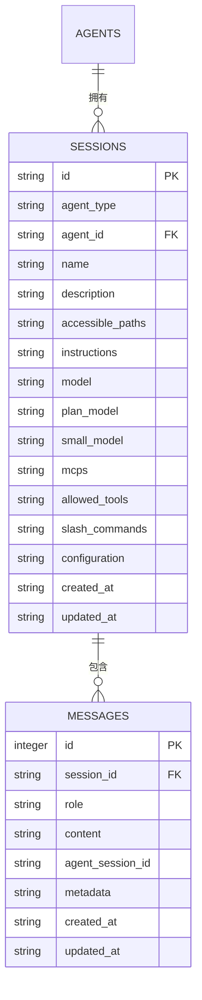
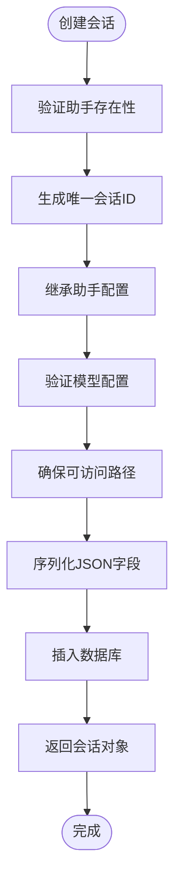
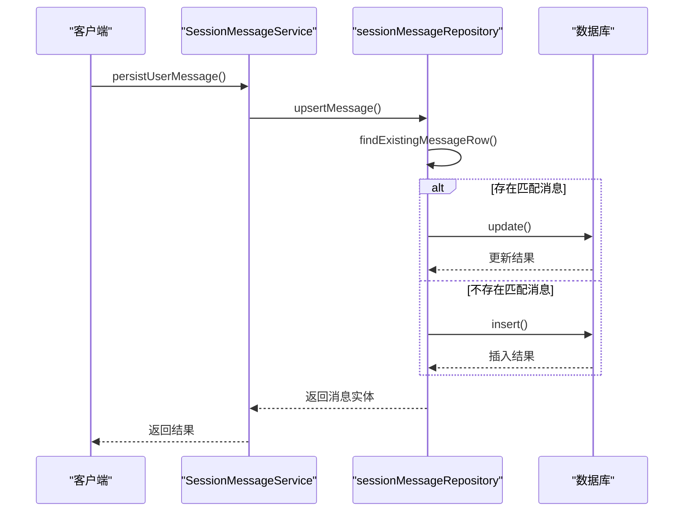
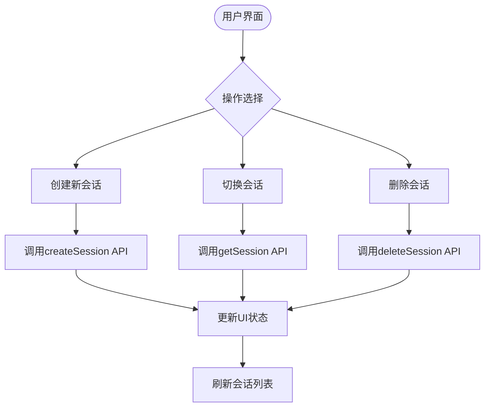
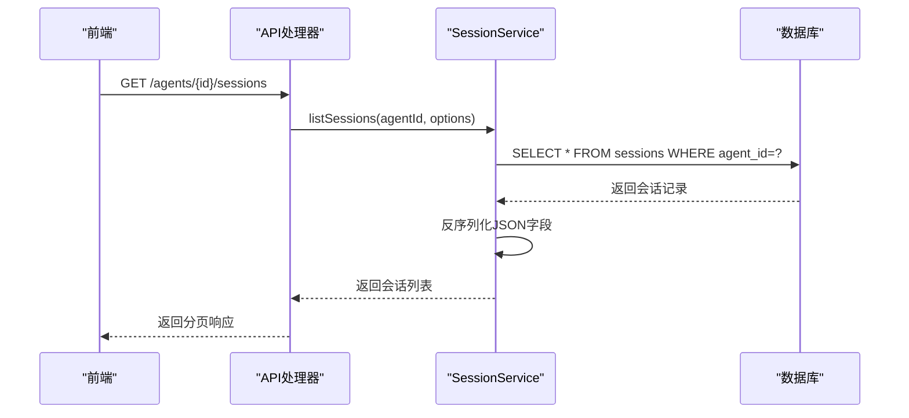

# 对话管理

<cite>
**本文档引用的文件**   
- [sessions.schema.ts](file://src/main/services/agents/database/schema/sessions.schema.ts)
- [messages.schema.ts](file://src/main/services/agents/database/schema/messages.schema.ts)
- [SessionService.ts](file://src/main/services/agents/services/SessionService.ts)
- [SessionMessageService.ts](file://src/main/services/agents/services/SessionMessageService.ts)
- [sessionMessageRepository.ts](file://src/main/services/agents/database/sessionMessageRepository.ts)
- [sessions.ts](file://src/main/apiServer/routes/agents/handlers/sessions.ts)
- [messages.ts](file://src/main/apiServer/routes/agents/handlers/messages.ts)
- [Sessions.tsx](file://src/renderer/src/pages/home/Tabs/components/Sessions.tsx)
</cite>

## 目录
1. [简介](#简介)
2. [会话与消息数据模型](#会话与消息数据模型)
3. [数据库Schema设计](#数据库schema设计)
4. [会话服务实现](#会话服务实现)
5. [消息服务实现](#消息服务实现)
6. [API接口说明](#api接口说明)
7. [用户界面操作](#用户界面操作)
8. [开发者指南](#开发者指南)

## 简介
Cherry Studio的对话管理功能为用户提供了一个强大的会话系统，用于组织和管理与AI助手的交互。该系统基于会话（Session）和消息（Message）两个核心概念构建，支持会话的创建、加载、切换和持久化存储。每个会话都与特定的助手（Agent）相关联，并包含一系列按时间顺序排列的消息记录。

会话系统不仅记录用户和助手之间的对话内容，还保存了会话的配置信息，如使用的模型、可访问的路径、工具权限等。消息系统则以结构化的方式存储每次交互的内容，支持不同类型的角色（用户、助手、系统、工具）和丰富的元数据。通过RESTful API和前端界面，用户可以方便地管理多个会话，开发者可以集成和扩展对话功能。

## 会话与消息数据模型

Cherry Studio的对话管理系统基于两个核心实体：会话（Session）和消息（Message）。会话代表与特定助手的一次交互会话，而消息则记录了会话中的具体交互内容。每个会话可以包含多个消息，形成一个有序的对话历史。

会话与助手之间存在明确的关系模型。每个会话都关联到一个特定的助手实例，通过`agent_id`字段建立连接。这种设计允许多个会话共享同一个助手配置，同时保持各自的对话状态和历史记录。会话还包含了助手的类型信息（`agent_type`），用于确定会话的行为和功能。

消息在会话中按照时间顺序组织，通过`created_at`字段进行排序。每条消息都有一个角色属性（`role`），标识消息的发送方，如用户、助手、系统或工具。消息内容以JSON格式存储在`content`字段中，支持复杂的结构化数据。此外，消息还可以包含元数据（`metadata`），用于存储额外的信息，如消息状态、引用信息等。

**Diagram sources**
- [sessions.schema.ts](file://src/main/services/agents/database/schema/sessions.schema.ts)
- [messages.schema.ts](file://src/main/services/agents/database/schema/messages.schema.ts)

**Section sources**
- [sessions.schema.ts](file://src/main/services/agents/database/schema/sessions.schema.ts)
- [messages.schema.ts](file://src/main/services/agents/database/schema/messages.schema.ts)

## 数据库Schema设计

### 会话表（sessions）
会话表存储了所有会话的核心信息，其字段定义如下：

| 字段名 | 类型 | 是否必填 | 描述 |
|-------|------|---------|------|
| id | text | 是 | 会话唯一标识符，主键 |
| agent_type | text | 是 | 助手类型（如claude-code） |
| agent_id | text | 是 | 关联的助手ID，外键 |
| name | text | 是 | 会话名称 |
| description | text | 否 | 会话描述 |
| accessible_paths | text | 否 | 可访问路径列表（JSON数组） |
| instructions | text | 否 | 会话指令 |
| model | text | 是 | 主要使用的模型ID |
| plan_model | text | 否 | 规划/思考模型ID |
| small_model | text | 否 | 小型/快速模型ID |
| mcps | text | 否 | MCP工具ID列表（JSON数组） |
| allowed_tools | text | 否 | 允许使用的工具列表（JSON数组） |
| slash_commands | text | 否 | 斜杠命令列表（JSON数组） |
| configuration | text | 否 | 扩展配置（JSON对象） |
| created_at | text | 是 | 创建时间 |
| updated_at | text | 是 | 更新时间 |

会话表建立了与助手表的外键关系，当助手被删除时，关联的会话也会被级联删除。同时，表中定义了多个索引以优化查询性能：
- `idx_sessions_created_at`：按创建时间索引
- `idx_sessions_agent_id`：按助手ID索引
- `idx_sessions_model`：按模型ID索引

### 消息表（session_messages）
消息表存储了会话中的所有消息记录，其字段定义如下：

| 字段名 | 类型 | 是否必填 | 描述 |
|-------|------|---------|------|
| id | integer | 是 | 消息唯一标识符，自增主键 |
| session_id | text | 是 | 关联的会话ID，外键 |
| role | text | 是 | 消息角色（user, agent, system, tool） |
| content | text | 是 | 消息内容（JSON结构化数据） |
| agent_session_id | text | 否 | 助手会话ID，默认为空字符串 |
| metadata | text | 否 | 消息元数据（JSON对象） |
| created_at | text | 是 | 创建时间 |
| updated_at | text | 是 | 更新时间 |

消息表与会话表建立了外键关系，当会话被删除时，关联的所有消息也会被级联删除。表中定义了多个索引以支持高效的查询：
- `idx_session_messages_session_id`：按会话ID索引
- `idx_session_messages_created_at`：按创建时间索引
- `idx_session_messages_updated_at`：按更新时间索引

数据库迁移历史显示，系统经历了多个版本的演进：
1. 初始版本（0000_confused_wendigo.sql）创建了基本的会话和消息表结构
2. 第一次迁移（0001_woozy_captain_flint.sql）为消息表添加了`agent_session_id`字段
3. 第二次迁移（0002_wealthy_naoko.sql）为会话表添加了`slash_commands`字段

**Section sources**
- [sessions.schema.ts](file://src/main/services/agents/database/schema/sessions.schema.ts)
- [messages.schema.ts](file://src/main/services/agents/database/schema/messages.schema.ts)
- [0000_confused_wendigo.sql](file://resources/database/drizzle/0000_confused_wendigo.sql)
- [0001_woozy_captain_flint.sql](file://resources/database/drizzle/0001_woozy_captain_flint.sql)
- [0002_wealthy_naoko.sql](file://resources/database/drizzle/0002_wealthy_naoko.sql)

## 会话服务实现

会话服务（SessionService）是对话管理系统的核心组件，负责会话的全生命周期管理。该服务实现了单例模式，确保在整个应用程序中只有一个实例存在，通过`getInstance()`方法获取服务实例。

### 会话创建
会话创建过程通过`createSession`方法实现。该方法首先验证指定的助手是否存在，然后生成唯一的会话ID，通常格式为`session_时间戳_随机字符串`。创建时，会话会继承助手的默认配置，但允许通过请求参数进行覆盖。关键步骤包括：
1. 验证助手存在性
2. 生成唯一会话ID
3. 继承并合并助手配置
4. 验证模型配置的有效性
5. 确保可访问路径的存在性
6. 序列化JSON字段并插入数据库

**Diagram sources**
- [SessionService.ts](file://src/main/services/agents/services/SessionService.ts#L79-L144)

### 会话查询
会话服务提供了多种查询方法：
- `getSession`：根据会话ID和助手ID获取单个会话
- `listSessions`：列出指定助手的所有会话，支持分页
- `sessionExists`：检查会话是否存在

查询操作都包含了权限验证，确保用户只能访问属于指定助手的会话。`listSessions`方法支持分页参数（limit和offset），并按更新时间倒序排列，确保最新的会话优先显示。

### 会话更新与删除
会话更新通过`updateSession`方法实现，支持部分更新。更新前会检查会话是否存在并验证权限。更新操作会自动更新`updated_at`字段，并重新验证模型配置的有效性。

会话删除通过`deleteSession`方法实现。删除操作具有保护机制：当删除最后一个会话时，系统会自动创建一个新的默认会话，确保用户始终至少有一个可用的会话。

**Section sources**
- [SessionService.ts](file://src/main/services/agents/services/SessionService.ts)

## 消息服务实现

消息服务（SessionMessageService）负责管理会话中的消息记录，提供了消息的持久化、查询和流式处理功能。

### 消息持久化
消息持久化通过`sessionMessageRepository`实现，采用上插（upsert）策略。当保存消息时，系统会先查找是否存在具有相同会话ID、角色和消息ID的现有记录。如果存在，则更新该记录；否则，创建新记录。

消息内容和元数据都以JSON字符串形式存储。服务提供了序列化和反序列化方法，确保数据在存储和检索时的正确性。对于内容为空或解析失败的情况，系统会记录警告日志但不会中断操作。

**Diagram sources**
- [sessionMessageRepository.ts](file://src/main/services/agents/database/sessionMessageRepository.ts#L108-L164)

### 消息查询与分页
消息查询通过`listSessionMessages`方法实现，支持分页加载。查询时，系统会按`created_at`字段升序排列消息，确保按时间顺序返回。分页参数包括：
- `limit`：每页消息数量
- `offset`：偏移量

对于大型会话，分页加载可以有效减少内存占用和网络传输量。查询结果会自动反序列化JSON字段，返回结构化的消息对象。

### 状态同步
消息服务与会话状态保持同步。当创建新的消息流时，系统会获取会话的最后`agent_session_id`，确保连续性。`getLastAgentSessionId`方法通过查询消息表中最近的非空`agent_session_id`来实现这一功能。

**Section sources**
- [SessionMessageService.ts](file://src/main/services/agents/services/SessionMessageService.ts)
- [sessionMessageRepository.ts](file://src/main/services/agents/database/sessionMessageRepository.ts)

## API接口说明

### 会话API
会话API提供了对会话的完整CRUD操作，所有接口都位于`/agents/{agentId}/sessions`路径下。

#### 创建会话
- **方法**: POST
- **路径**: `/agents/{agentId}/sessions`
- **请求体**: 会话配置参数
- **响应**: 201 Created，返回创建的会话对象

#### 查询会话列表
- **方法**: GET
- **路径**: `/agents/{agentId}/sessions`
- **查询参数**: 
  - `limit`: 每页数量（默认20）
  - `offset`: 偏移量（默认0）
- **响应**: 200 OK，返回会话列表和总数

#### 获取单个会话
- **方法**: GET
- **路径**: `/agents/{agentId}/sessions/{sessionId}`
- **响应**: 200 OK，返回会话对象及关联的消息列表

#### 更新会话
- **方法**: PUT/PATCH
- **路径**: `/agents/{agentId}/sessions/{sessionId}`
- **请求体**: 更新的会话字段
- **响应**: 200 OK，返回更新后的会话对象

#### 删除会话
- **方法**: DELETE
- **路径**: `/agents/{agentId}/sessions/{sessionId}`
- **响应**: 204 No Content

### 消息API
消息API提供了对会话消息的操作，位于`/agents/{agentId}/sessions/{sessionId}/messages`路径下。

#### 创建消息
- **方法**: POST
- **路径**: `/agents/{agentId}/sessions/{sessionId}/messages`
- **响应**: 200 OK，返回SSE流，实时传输助手响应

#### 删除消息
- **方法**: DELETE
- **路径**: `/agents/{agentId}/sessions/{sessionId}/messages/{messageId}`
- **响应**: 204 No Content

**Section sources**
- [sessions.ts](file://src/main/apiServer/routes/agents/handlers/sessions.ts)
- [messages.ts](file://src/main/apiServer/routes/agents/handlers/messages.ts)

## 用户界面操作

### 会话列表管理
在用户界面中，会话列表显示在主界面的侧边栏中。用户可以通过以下操作管理会话：

1. **创建新会话**：点击"新建会话"按钮，系统会创建一个新的会话并自动切换到该会话。
2. **切换会话**：点击会话列表中的会话项，即可切换到该会话，显示其对话历史。
3. **删除会话**：右键点击会话项或使用删除按钮，可以删除会话。系统会提示确认，并在删除最后一个会话时阻止操作。

**Diagram sources**
- [Sessions.tsx](file://src/renderer/src/pages/home/Tabs/components/Sessions.tsx)

### 会话保护机制
用户界面实现了会话保护机制，防止意外删除最后一个会话。当会话列表中只剩一个会话时，删除操作会被阻止，并显示提示信息"无法删除最后一个会话"。这种设计确保用户始终有一个可用的会话进行交互。

### 活跃会话管理
系统维护一个活跃会话的状态。当加载会话列表时，如果当前没有活跃会话，系统会自动将第一个会话设置为活跃会话。这确保了用户界面始终显示有效的对话内容。

**Section sources**
- [Sessions.tsx](file://src/renderer/src/pages/home/Tabs/components/Sessions.tsx)

## 开发者指南

### 会话列表加载流程
会话列表的加载流程涉及多个组件的协作：

1. 前端调用`listSessions` API
2. API处理器调用`SessionService.listSessions`方法
3. 服务层构建数据库查询，按更新时间倒序排列
4. 数据库返回结果，服务层反序列化JSON字段
5. API处理器返回分页结果，包含会话列表和总数

**Diagram sources**
- [sessions.ts](file://src/main/apiServer/routes/agents/handlers/sessions.ts#L54-L87)
- [SessionService.ts](file://src/main/services/agents/services/SessionService.ts#L170-L206)

### 消息发送处理逻辑
消息发送处理是一个流式过程，涉及实时响应：

1. 前端发送消息请求，建立SSE连接
2. API处理器验证会话权限
3. `SessionMessageService`启动流式处理
4. 助手服务生成响应流
5. 响应通过SSE实时传输给前端
6. 消息在后台持久化存储

关键特性包括：
- 超时控制：设置消息流超时时间
- 客户端断开检测：监控连接状态，及时清理资源
- 错误处理：捕获并传输错误信息

**Section sources**
- [messages.ts](file://src/main/apiServer/routes/agents/handlers/messages.ts)
- [SessionMessageService.ts](file://src/main/services/agents/services/SessionMessageService.ts)