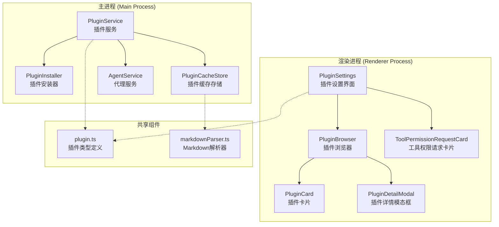
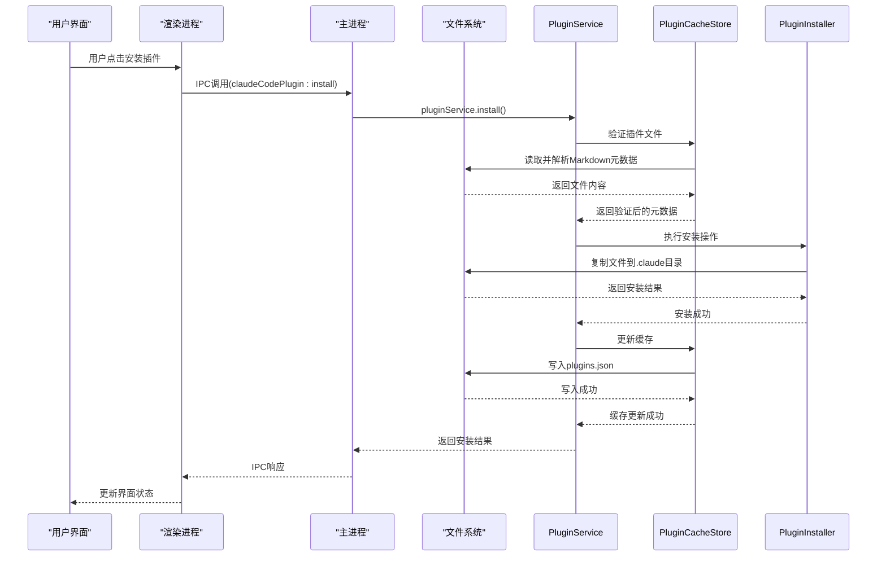
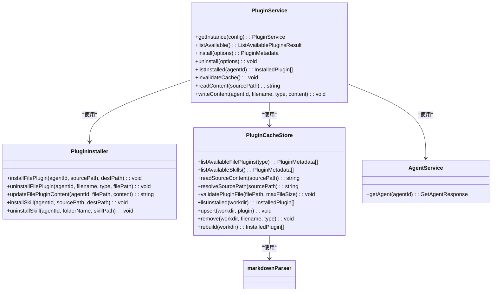
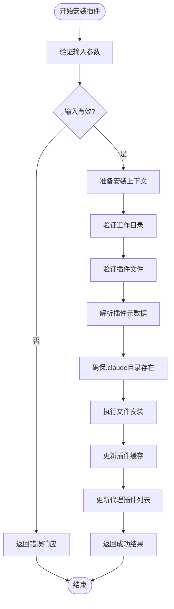
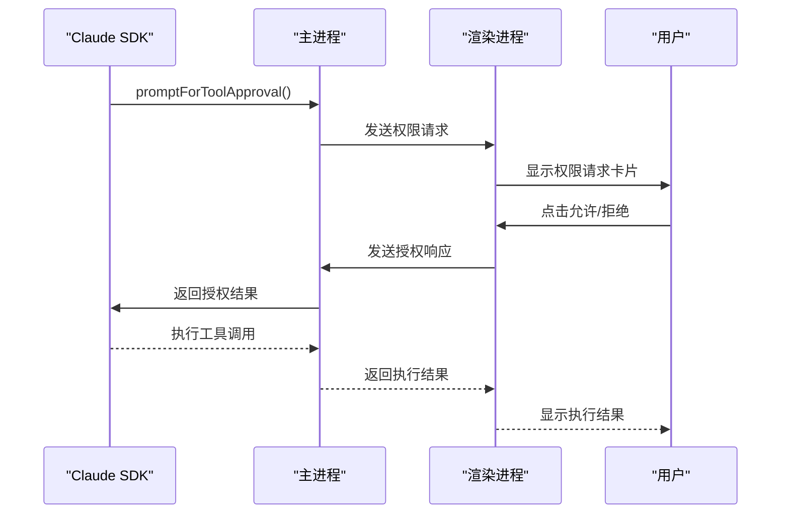
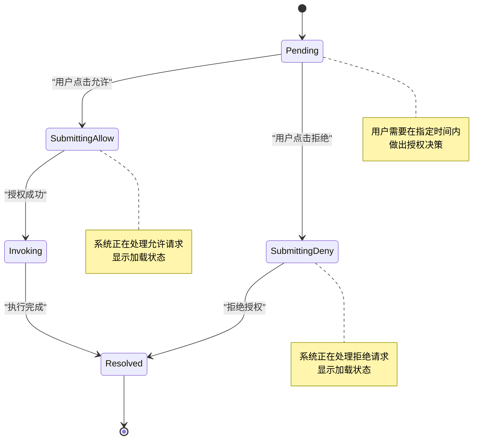
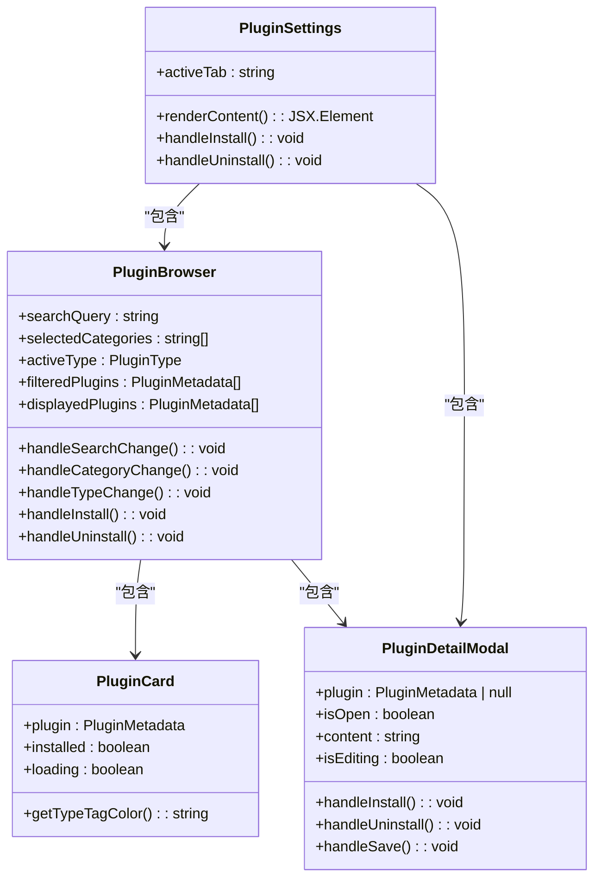
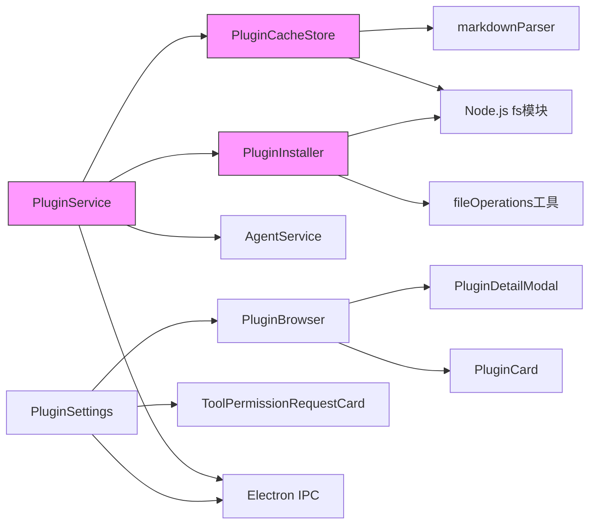

# 插件系统

<cite>
**本文档引用的文件**   
- [PluginService.ts](file://src/main/services/agents/plugins/PluginService.ts)
- [PluginInstaller.ts](file://src/main/services/agents/plugins/PluginInstaller.ts)
- [PluginCacheStore.ts](file://src/main/services/agents/plugins/PluginCacheStore.ts)
- [plugin.ts](file://src/renderer/src/types/plugin.ts)
- [PluginSettings.tsx](file://src/renderer/src/pages/settings/AgentSettings/PluginSettings.tsx)
- [PluginBrowser.tsx](file://src/renderer/src/pages/settings/AgentSettings/components/PluginBrowser.tsx)
- [ToolPermissionRequestCard.tsx](file://src/renderer/src/pages/home/Messages/Tools/ToolPermissionRequestCard.tsx)
- [tool-permissions.ts](file://src/main/services/agents/services/claudecode/tool-permissions.ts)
- [markdownParser.ts](file://src/main/utils/markdownParser.ts)
- [ipc.ts](file://src/main/ipc.ts)
</cite>

## 目录
1. [简介](#简介)
2. [项目结构](#项目结构)
3. [核心组件](#核心组件)
4. [架构概述](#架构概述)
5. [详细组件分析](#详细组件分析)
6. [依赖分析](#依赖分析)
7. [性能考虑](#性能考虑)
8. [故障排除指南](#故障排除指南)
9. [结论](#结论)

## 简介
本文档详细介绍了Cherry Studio的插件系统，重点阐述了AI助手插件的架构设计、生命周期管理、权限控制机制以及开发者指南。文档深入分析了插件服务的核心功能，包括插件的注册、加载、缓存和执行流程，同时详细说明了插件安装器的实现细节和权限模型。通过本指南，开发者可以全面了解如何创建和管理自定义插件。

## 项目结构
Cherry Studio的插件系统主要由以下几个核心模块构成，这些模块协同工作以实现完整的插件管理功能：

**图源**
- [PluginService.ts](file://src/main/services/agents/plugins/PluginService.ts)
- [PluginInstaller.ts](file://src/main/services/agents/plugins/PluginInstaller.ts)
- [PluginCacheStore.ts](file://src/main/services/agents/plugins/PluginCacheStore.ts)
- [PluginSettings.tsx](file://src/renderer/src/pages/settings/AgentSettings/PluginSettings.tsx)
- [PluginBrowser.tsx](file://src/renderer/src/pages/settings/AgentSettings/components/PluginBrowser.tsx)
- [plugin.ts](file://src/renderer/src/types/plugin.ts)
- [markdownParser.ts](file://src/main/utils/markdownParser.ts)

**章节来源**
- [PluginService.ts](file://src/main/services/agents/plugins/PluginService.ts)
- [PluginInstaller.ts](file://src/main/services/agents/plugins/PluginInstaller.ts)
- [PluginCacheStore.ts](file://src/main/services/agents/plugins/PluginCacheStore.ts)
- [PluginSettings.tsx](file://src/renderer/src/pages/settings/AgentSettings/PluginSettings.tsx)

## 核心组件
Cherry Studio的插件系统由三个核心服务类构成：`PluginService`、`PluginInstaller`和`PluginCacheStore`。`PluginService`作为插件管理的主入口，采用单例模式确保状态一致性，负责插件的安装、卸载、列表查询等核心操作。`PluginInstaller`专注于插件文件的物理安装和卸载操作，通过原子性操作确保事务安全。`PluginCacheStore`则负责插件元数据的缓存管理，通过`.claude/plugins.json`文件实现持久化存储，显著提升插件列表的加载性能。

**章节来源**
- [PluginService.ts](file://src/main/services/agents/plugins/PluginService.ts)
- [PluginInstaller.ts](file://src/main/services/agents/plugins/PluginInstaller.ts)
- [PluginCacheStore.ts](file://src/main/services/agents/plugins/PluginCacheStore.ts)

## 架构概述
Cherry Studio的插件系统采用分层架构设计，将插件管理功能划分为不同的职责层次。系统通过Electron的IPC机制在主进程和渲染进程之间进行通信，确保了安全性和稳定性。

**图源**
- [PluginService.ts](file://src/main/services/agents/plugins/PluginService.ts)
- [PluginInstaller.ts](file://src/main/services/agents/plugins/PluginInstaller.ts)
- [PluginCacheStore.ts](file://src/main/services/agents/plugins/PluginCacheStore.ts)
- [ipc.ts](file://src/main/ipc.ts)

## 详细组件分析

### PluginService分析
`PluginService`是插件系统的核心管理类，负责协调插件的整个生命周期。它通过单例模式保证全局状态的一致性，并提供了丰富的API来管理插件。

#### PluginService类图

**图源**
- [PluginService.ts](file://src/main/services/agents/plugins/PluginService.ts)
- [PluginInstaller.ts](file://src/main/services/agents/plugins/PluginInstaller.ts)
- [PluginCacheStore.ts](file://src/main/services/agents/plugins/PluginCacheStore.ts)
- [AgentService.ts](file://src/main/services/agents/services/AgentService.ts)

#### 插件安装流程

**图源**
- [PluginService.ts](file://src/main/services/agents/plugins/PluginService.ts#L128-L259)
- [PluginInstaller.ts](file://src/main/services/agents/plugins/PluginInstaller.ts#L10-L27)
- [PluginCacheStore.ts](file://src/main/services/agents/plugins/PluginCacheStore.ts#L179-L223)

**章节来源**
- [PluginService.ts](file://src/main/services/agents/plugins/PluginService.ts)
- [PluginInstaller.ts](file://src/main/services/agents/plugins/PluginInstaller.ts)
- [PluginCacheStore.ts](file://src/main/services/agents/plugins/PluginCacheStore.ts)

### 插件权限模型分析
Cherry Studio的插件系统实现了精细的权限控制机制，确保AI助手在执行操作时能够安全地请求和获得用户授权。

#### 权限请求流程

**图源**
- [tool-permissions.ts](file://src/main/services/agents/services/claudecode/tool-permissions.ts)
- [ToolPermissionRequestCard.tsx](file://src/renderer/src/pages/home/Messages/Tools/ToolPermissionRequestCard.tsx)
- [ipc.ts](file://src/main/ipc.ts)

#### 权限状态管理

**图源**
- [tool-permissions.ts](file://src/main/services/agents/services/claudecode/tool-permissions.ts#L224-L310)
- [toolPermissions.ts](file://src/renderer/src/store/toolPermissions.ts)

### 插件配置界面分析
Cherry Studio提供了直观的插件管理界面，使用户能够轻松地浏览、安装和管理插件。

#### 插件设置界面组件

**图源**
- [PluginSettings.tsx](file://src/renderer/src/pages/settings/AgentSettings/PluginSettings.tsx)
- [PluginBrowser.tsx](file://src/renderer/src/pages/settings/AgentSettings/components/PluginBrowser.tsx)
- [PluginCard.tsx](file://src/renderer/src/pages/settings/AgentSettings/components/PluginCard.tsx)
- [PluginDetailModal.tsx](file://src/renderer/src/pages/settings/AgentSettings/components/PluginDetailModal.tsx)

**章节来源**
- [PluginSettings.tsx](file://src/renderer/src/pages/settings/AgentSettings/PluginSettings.tsx)
- [PluginBrowser.tsx](file://src/renderer/src/pages/settings/AgentSettings/components/PluginBrowser.tsx)

## 依赖分析
Cherry Studio的插件系统依赖于多个内部和外部组件，形成了一个复杂的依赖网络。

**图源**
- [PluginService.ts](file://src/main/services/agents/plugins/PluginService.ts)
- [PluginInstaller.ts](file://src/main/services/agents/plugins/PluginInstaller.ts)
- [PluginCacheStore.ts](file://src/main/services/agents/plugins/PluginCacheStore.ts)
- [PluginSettings.tsx](file://src/renderer/src/pages/settings/AgentSettings/PluginSettings.tsx)
- [ipc.ts](file://src/main/ipc.ts)

## 性能考虑
插件系统在设计时充分考虑了性能优化，主要体现在以下几个方面：

1. **缓存机制**：`PluginService`实现了插件列表的缓存，通过`cacheTimeout`配置（默认5分钟）避免频繁的文件系统扫描，显著提升了`listAvailable`接口的响应速度。

2. **原子操作**：`PluginInstaller`在执行文件操作时采用临时文件和重命名的策略，确保安装过程的原子性，避免了因操作中断导致的文件系统不一致问题。

3. **异步处理**：所有文件I/O操作均采用异步方式执行，避免阻塞主线程，保证了应用的响应性。

4. **批量操作**：在扫描可用插件时，系统使用`Promise.all`并行处理不同类型的插件扫描，减少了总的等待时间。

5. **内存优化**：`PluginCacheStore`通过`.claude/plugins.json`文件缓存已安装插件的元数据，避免了每次都需要重新扫描整个`.claude`目录的开销。

**章节来源**
- [PluginService.ts](file://src/main/services/agents/plugins/PluginService.ts#L23-L26)
- [PluginInstaller.ts](file://src/main/services/agents/plugins/PluginInstaller.ts)
- [PluginCacheStore.ts](file://src/main/services/agents/plugins/PluginCacheStore.ts)

## 故障排除指南
在使用Cherry Studio插件系统时，可能会遇到一些常见问题，以下是相应的解决方案：

| 问题现象 | 可能原因 | 解决方案 |
|--------|--------|--------|
| 插件无法安装 | 路径遍历攻击检测 | 检查插件路径是否包含`..`等非法字符 |
| 插件无法卸载 | 文件被占用或权限不足 | 关闭相关应用，检查文件权限 |
| 插件列表加载缓慢 | 缓存失效或插件数量过多 | 调用`invalidateCache()`方法重建缓存 |
| 插件元数据解析失败 | Markdown文件格式错误 | 检查文件frontmatter格式是否正确 |
| 权限请求无响应 | 用户未在超时时间内做出决策 | 检查`TOOL_APPROVAL_TIMEOUT_MS`配置 |

**章节来源**
- [PluginService.ts](file://src/main/services/agents/plugins/PluginService.ts)
- [PluginInstaller.ts](file://src/main/services/agents/plugins/PluginInstaller.ts)
- [tool-permissions.ts](file://src/main/services/agents/services/claudecode/tool-permissions.ts)

## 结论
Cherry Studio的插件系统通过精心设计的架构和严谨的实现，为AI助手提供了强大而安全的扩展能力。系统采用分层设计，将插件管理的各个职责清晰地分离，确保了代码的可维护性和可扩展性。通过单例模式、缓存机制和原子操作等技术手段，系统在保证功能完整性的同时，也兼顾了性能和稳定性。权限控制模型的引入，使得AI助手能够在执行敏感操作时获得用户的明确授权，增强了系统的安全性和用户信任度。对于开发者而言，清晰的接口定义和完善的文档支持，使得创建自定义插件变得简单高效。