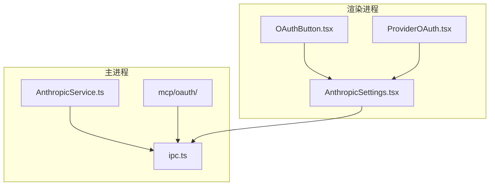
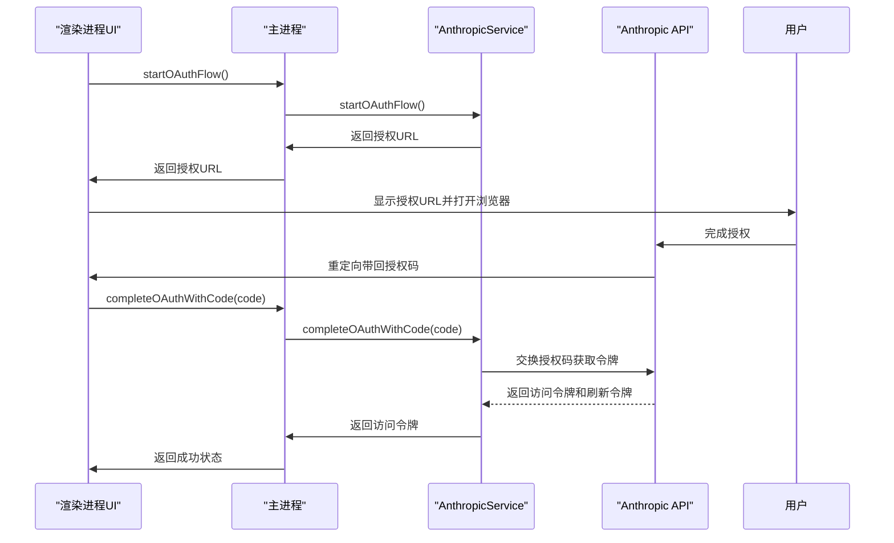
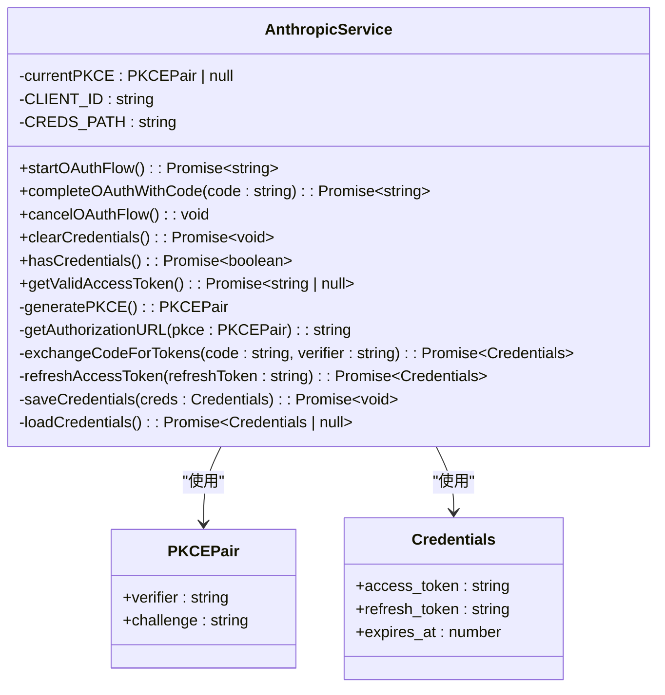
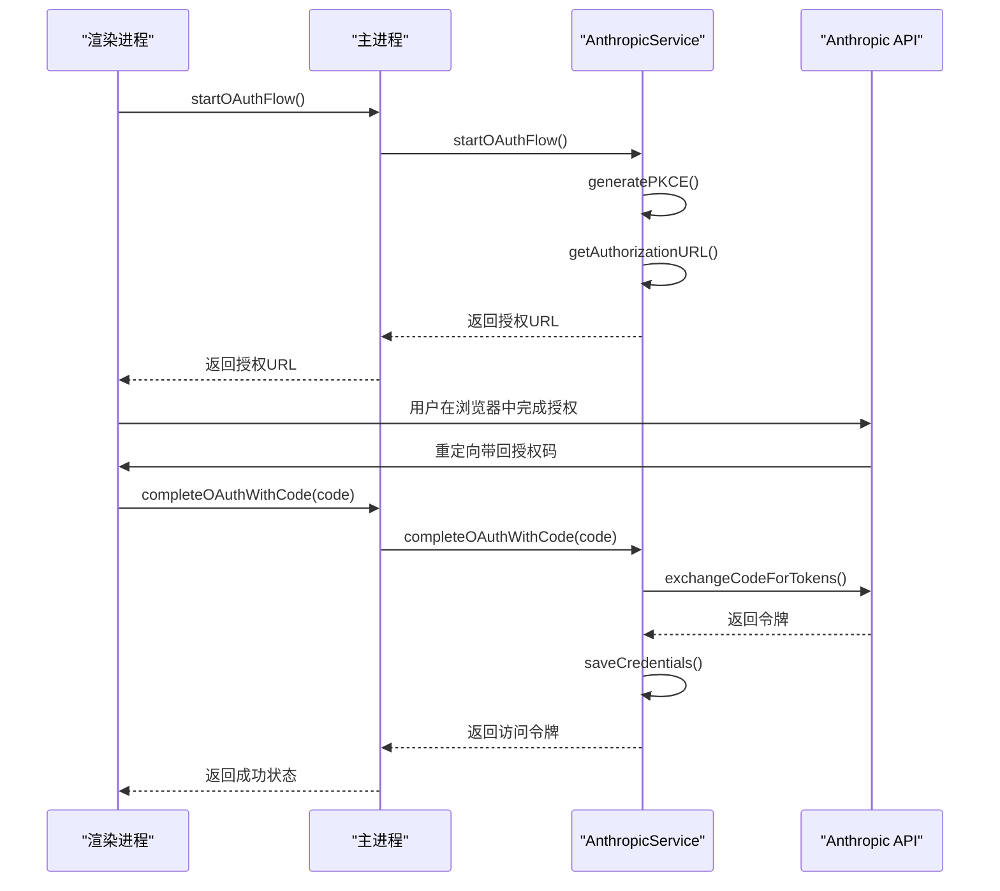
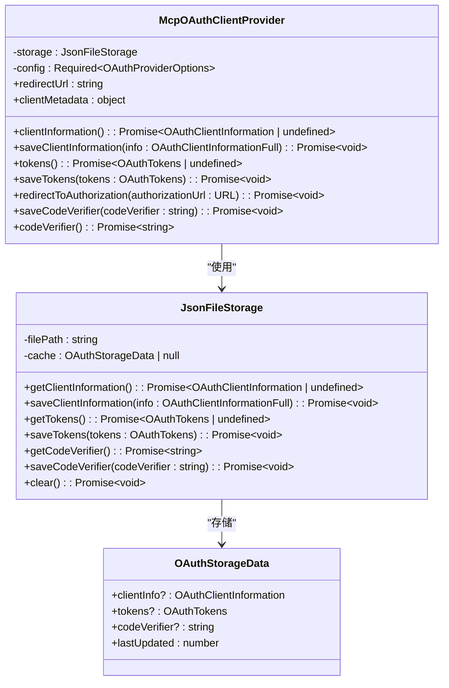
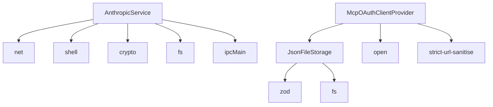

# Anthropic

<cite>
**本文档引用的文件**   
- [AnthropicService.ts](file://src/main/services/AnthropicService.ts)
- [ipc.ts](file://src/main/ipc.ts)
- [AnthropicSettings.tsx](file://src/renderer/src/pages/settings/ProviderSettings/AnthropicSettings.tsx)
- [OAuthButton.tsx](file://src/renderer/src/components/OAuth/OAuthButton.tsx)
- [ProviderOAuth.tsx](file://src/renderer/src/pages/settings/ProviderSettings/ProviderOAuth.tsx)
- [callback.ts](file://src/main/services/mcp/oauth/callback.ts)
- [provider.ts](file://src/main/services/mcp/oauth/provider.ts)
- [storage.ts](file://src/main/services/mcp/oauth/storage.ts)
- [types.ts](file://src/main/services/mcp/oauth/types.ts)
</cite>

## 目录
1. [简介](#简介)
2. [项目结构](#项目结构)
3. [核心组件](#核心组件)
4. [架构概述](#架构概述)
5. [详细组件分析](#详细组件分析)
6. [依赖分析](#依赖分析)
7. [性能考虑](#性能考虑)
8. [故障排除指南](#故障排除指南)
9. [结论](#结论)
10. [附录](#附录)（如有必要）

## 简介
本文档详细阐述了Cherry Studio中Anthropic云服务提供商的集成，重点介绍其基于PKCE的OAuth 2.0认证流程。文档涵盖了生成PKCE配对、获取授权URL、交换授权码获取令牌、刷新访问令牌等核心步骤。同时解释了访问令牌的获取、存储和验证机制，以及如何通过`getValidAccessToken`方法确保令牌的有效性。文档还描述了服务初始化、凭证管理（保存、加载、清除）和OAuth流程控制（启动、完成、取消）的实现细节。通过实际代码库的具体示例，说明了主进程服务与渲染进程UI的交互方式。为初学者提供配置向导，为有经验的开发者提供安全存储和错误处理的高级技术细节。

## 项目结构
Cherry Studio项目采用分层架构，主要分为`packages`、`src`、`resources`等目录。`src`目录下包含`main`（主进程）、`renderer`（渲染进程）和`preload`（预加载脚本）三个子目录，实现了Electron应用的多进程架构。Anthropic服务相关的代码主要分布在`src/main/services/AnthropicService.ts`中，而UI组件则位于`src/renderer/src/pages/settings/ProviderSettings/AnthropicSettings.tsx`。OAuth通用组件位于`src/main/services/mcp/oauth/`目录下，提供了可复用的OAuth认证框架。

**图表来源**
- [AnthropicService.ts](file://src/main/services/AnthropicService.ts)
- [ipc.ts](file://src/main/ipc.ts)
- [AnthropicSettings.tsx](file://src/renderer/src/pages/settings/ProviderSettings/AnthropicSettings.tsx)

**章节来源**
- [AnthropicService.ts](file://src/main/services/AnthropicService.ts)
- [ipc.ts](file://src/main/ipc.ts)
- [AnthropicSettings.tsx](file://src/renderer/src/pages/settings/ProviderSettings/AnthropicSettings.tsx)

## 核心组件
Anthropic服务的核心组件包括`AnthropicService`类，它负责处理所有与Anthropic API的交互。该服务实现了完整的PKCE OAuth 2.0流程，包括生成PKCE配对、获取授权URL、交换授权码获取令牌、刷新访问令牌等。服务还提供了凭证管理功能，如保存、加载和清除凭证。`getValidAccessToken`方法确保了令牌的有效性，通过检查令牌是否过期并自动刷新。主进程通过IPC机制与渲染进程通信，实现了安全的认证流程。

**章节来源**
- [AnthropicService.ts](file://src/main/services/AnthropicService.ts)
- [ipc.ts](file://src/main/ipc.ts)

## 架构概述
Cherry Studio的Anthropic集成采用主从架构，主进程负责处理敏感的认证逻辑和令牌管理，渲染进程负责用户界面展示和交互。这种架构确保了敏感信息（如访问令牌）不会暴露在可能被攻击的渲染进程中。认证流程通过IPC通道进行通信，主进程执行实际的OAuth操作，渲染进程仅负责引导用户完成认证步骤。

**图表来源**
- [AnthropicService.ts](file://src/main/services/AnthropicService.ts)
- [ipc.ts](file://src/main/ipc.ts)
- [AnthropicSettings.tsx](file://src/renderer/src/pages/settings/ProviderSettings/AnthropicSettings.tsx)

## 详细组件分析

### Anthropic服务分析
`AnthropicService`类是Anthropic集成的核心，实现了完整的PKCE OAuth 2.0流程。服务通过`generatePKCE`方法生成PKCE配对，使用`getAuthorizationURL`方法构建授权URL，并通过`exchangeCodeForTokens`方法交换授权码获取令牌。`refreshAccessToken`方法用于在令牌过期时刷新访问令牌。`getValidAccessToken`方法是关键，它检查现有令牌的有效性，如果即将过期则自动刷新。

#### 对象导向组件：

**图表来源**
- [AnthropicService.ts](file://src/main/services/AnthropicService.ts)

#### API/服务组件：

**图表来源**
- [AnthropicService.ts](file://src/main/services/AnthropicService.ts)
- [ipc.ts](file://src/main/ipc.ts)

### OAuth通用框架分析
Cherry Studio还提供了一个通用的OAuth框架，位于`src/main/services/mcp/oauth/`目录下。这个框架包括`provider.ts`、`storage.ts`、`types.ts`和`callback.ts`等文件，为不同服务提供商的OAuth集成提供了统一的接口和实现。

#### 对象导向组件：

**图表来源**
- [provider.ts](file://src/main/services/mcp/oauth/provider.ts)
- [storage.ts](file://src/main/services/mcp/oauth/storage.ts)
- [types.ts](file://src/main/services/mcp/oauth/types.ts)

## 依赖分析
Anthropic服务依赖于多个核心模块，包括Electron的`net`和`shell`模块用于网络请求和打开外部浏览器，`crypto`模块用于生成PKCE配对，`fs`模块用于持久化存储凭证。服务通过IPC机制与渲染进程通信，依赖于`ipcMain`和`ipcRenderer`。OAuth通用框架依赖于`zod`进行数据验证，`open`用于打开外部浏览器，`strict-url-sanitise`用于URL清理。

**图表来源**
- [AnthropicService.ts](file://src/main/services/AnthropicService.ts)
- [provider.ts](file://src/main/services/mcp/oauth/provider.ts)
- [storage.ts](file://src/main/services/mcp/oauth/storage.ts)

**章节来源**
- [AnthropicService.ts](file://src/main/services/AnthropicService.ts)
- [provider.ts](file://src/main/services/mcp/oauth/provider.ts)
- [storage.ts](file://src/main/services/mcp/oauth/storage.ts)

## 性能考虑
Anthropic服务的性能主要受网络请求和文件I/O操作的影响。令牌交换和刷新操作涉及网络请求，应考虑网络延迟。凭证的读写操作涉及文件I/O，虽然频率较低，但应确保原子性以避免数据损坏。`getValidAccessToken`方法通过缓存和预刷新机制优化了性能，避免了频繁的网络请求。建议在应用启动时预加载凭证，减少首次调用API的延迟。

## 故障排除指南
常见问题包括授权流程中断、令牌刷新失败、凭证存储错误等。对于授权流程中断，应检查`currentPKCE`是否正确存储和清除。对于令牌刷新失败，应检查刷新令牌是否有效，并处理API返回的错误。对于凭证存储错误，应确保配置目录有写权限，并处理文件系统异常。日志记录在`loggerService`中，可用于调试认证流程。

**章节来源**
- [AnthropicService.ts](file://src/main/services/AnthropicService.ts)
- [ipc.ts](file://src/main/ipc.ts)

## 结论
Cherry Studio的Anthropic集成通过PKCE OAuth 2.0协议实现了安全的认证流程。服务设计考虑了安全性、可用性和可维护性，通过主从架构隔离了敏感信息，通过通用OAuth框架提高了代码复用性。文档为开发者提供了从配置到高级技术细节的全面指导，有助于快速集成和维护Anthropic服务。