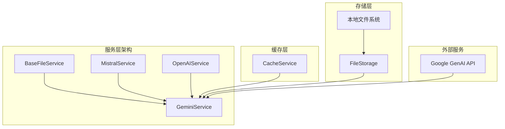
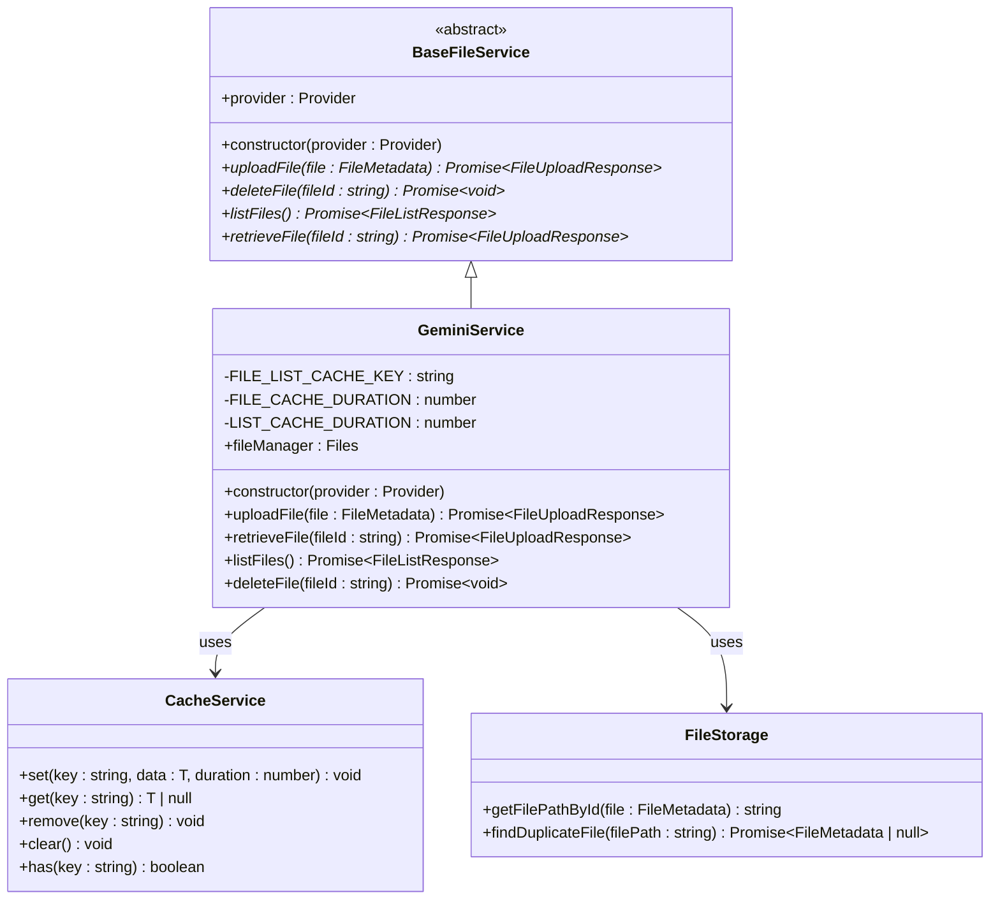
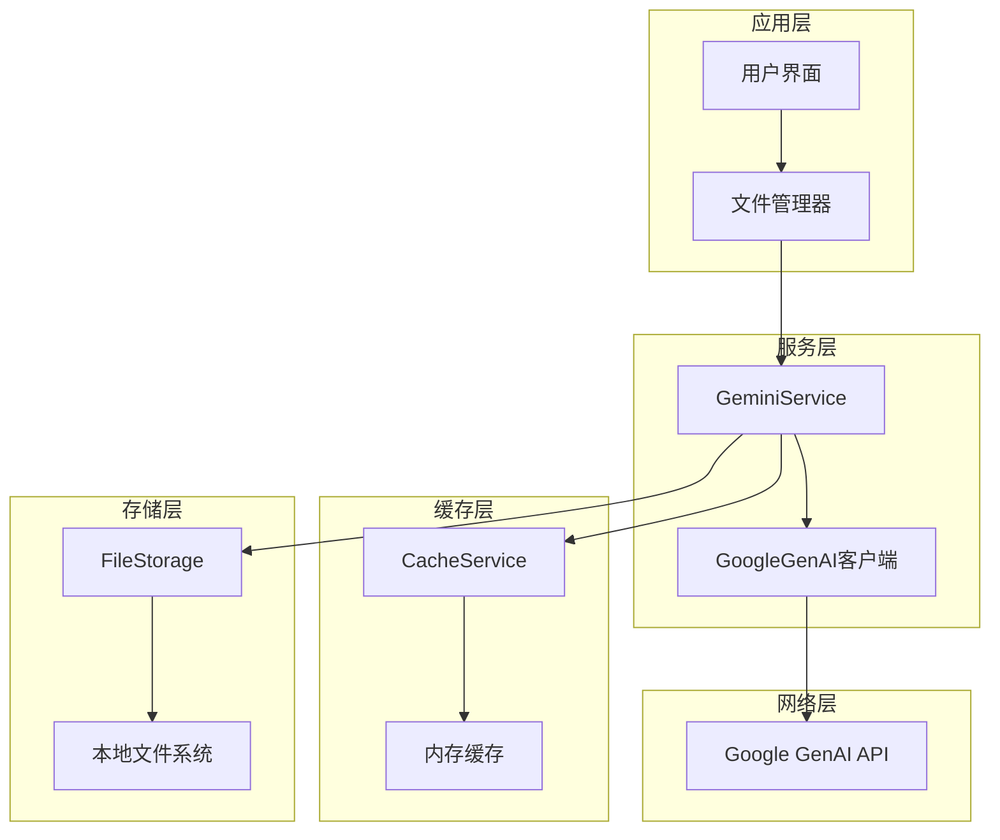
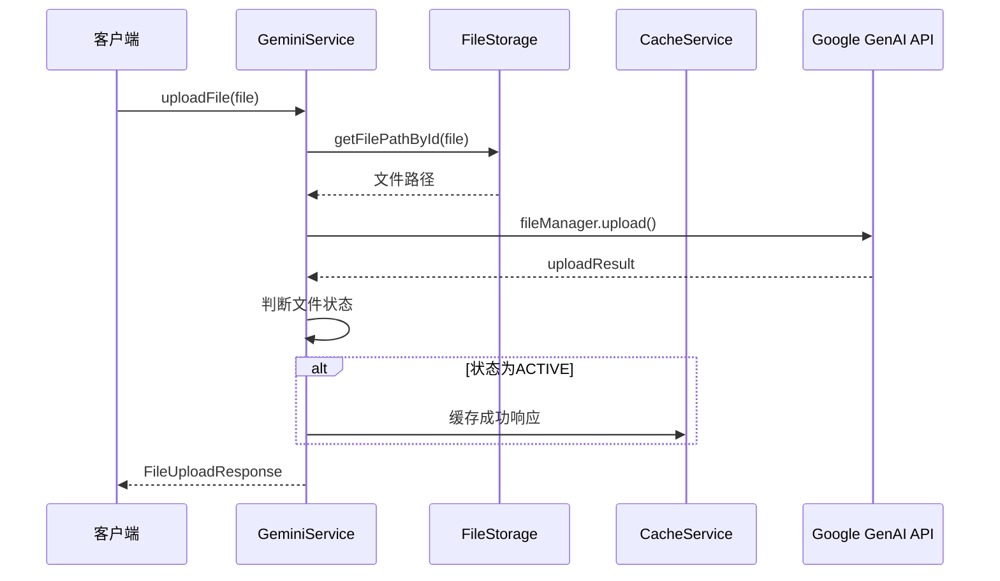
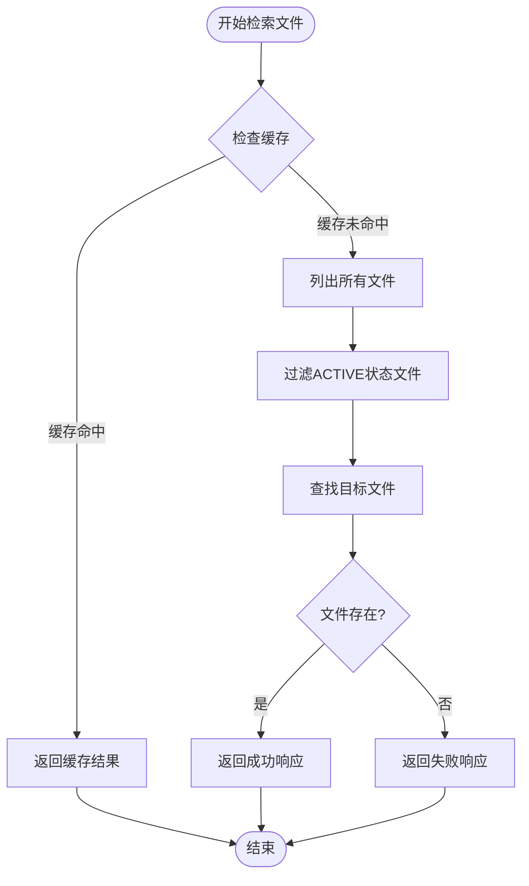
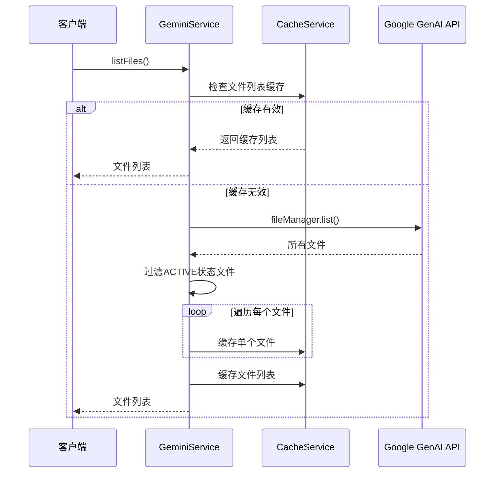
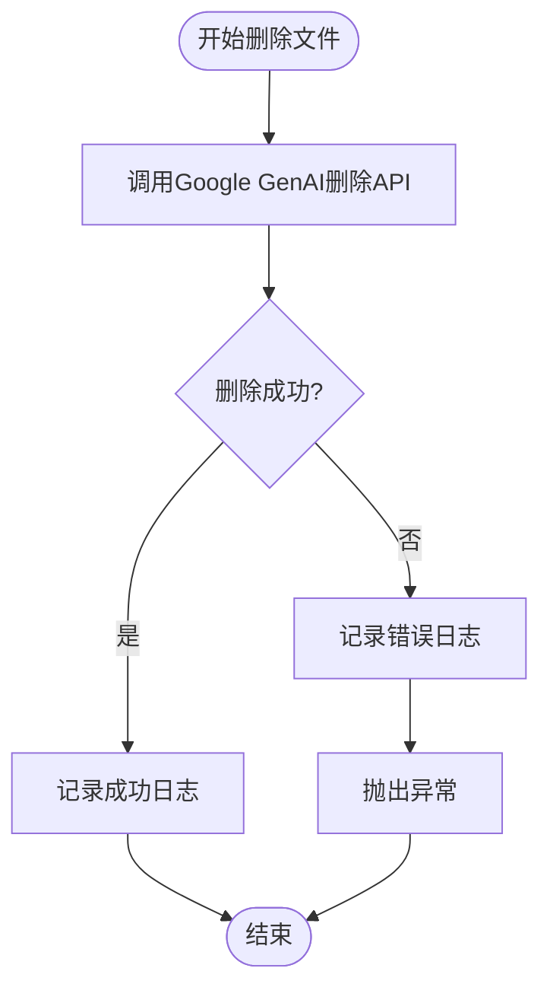
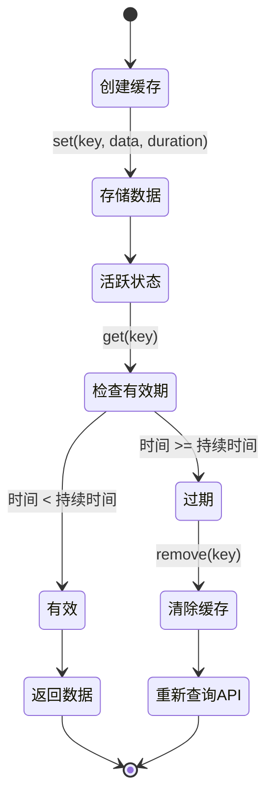
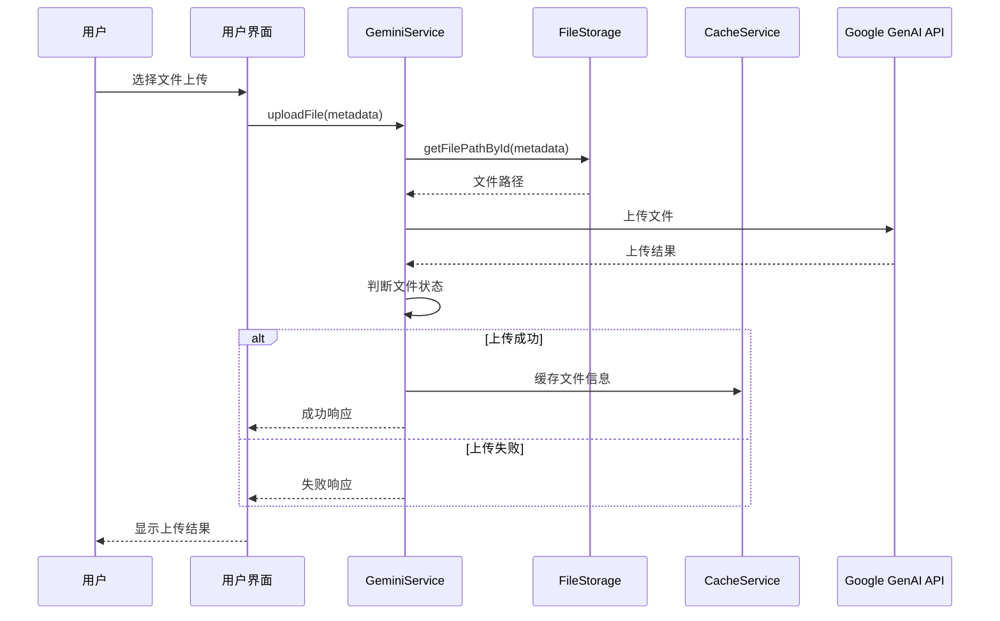
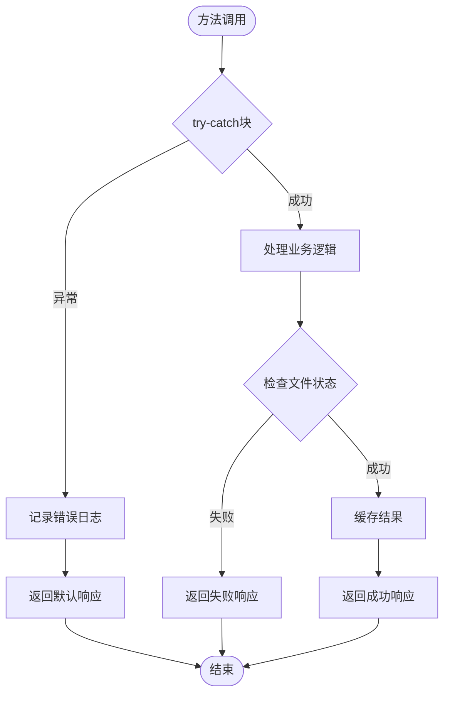

# Cherry Studio中Google Gemini云服务提供商集成文档

<cite>
**本文档中引用的文件**
- [GeminiService.ts](file://src/main/services/remotefile/GeminiService.ts)
- [BaseFileService.ts](file://src/main/services/remotefile/BaseFileService.ts)
- [CacheService.ts](file://src/main/services/CacheService.ts)
- [FileStorage.ts](file://src/main/services/FileStorage.ts)
- [file.ts](file://src/renderer/src/types/file.ts)
</cite>

## 目录
1. [简介](#简介)
2. [项目结构概览](#项目结构概览)
3. [核心组件分析](#核心组件分析)
4. [架构概览](#架构概览)
5. [详细组件分析](#详细组件分析)
6. [缓存策略详解](#缓存策略详解)
7. [文件管理流程](#文件管理流程)
8. [错误处理与故障排除](#错误处理与故障排除)
9. [总结](#总结)

## 简介

Cherry Studio通过`GeminiService`类实现了对Google Gemini云服务提供商的深度集成，提供了完整的文件管理功能，包括文件上传、列表、检索和删除操作。该服务基于GoogleGenAI库构建，采用多层级缓存策略优化性能，并提供了robust的错误处理机制。

## 项目结构概览

GeminiService位于Cherry Studio的服务架构中，作为远程文件服务的一部分，与其他AI提供商服务协同工作：



**图表来源**
- [GeminiService.ts](file://src/main/services/remotefile/GeminiService.ts#L12-L193)
- [BaseFileService.ts](file://src/main/services/remotefile/BaseFileService.ts#L2-L12)

**章节来源**
- [GeminiService.ts](file://src/main/services/remotefile/GeminiService.ts#L1-L195)

## 核心组件分析

### GeminiService类结构

`GeminiService`继承自`BaseFileService`抽象类，实现了标准化的文件服务接口：



**图表来源**
- [GeminiService.ts](file://src/main/services/remotefile/GeminiService.ts#L12-L193)
- [BaseFileService.ts](file://src/main/services/remotefile/BaseFileService.ts#L2-L12)
- [CacheService.ts](file://src/main/services/CacheService.ts#L6-L73)

**章节来源**
- [GeminiService.ts](file://src/main/services/remotefile/GeminiService.ts#L12-L193)
- [BaseFileService.ts](file://src/main/services/remotefile/BaseFileService.ts#L2-L12)

## 架构概览

GeminiService采用分层架构设计，确保了良好的可维护性和扩展性：



**图表来源**
- [GeminiService.ts](file://src/main/services/remotefile/GeminiService.ts#L18-L28)
- [CacheService.ts](file://src/main/services/CacheService.ts#L7-L8)

## 详细组件分析

### 文件上传机制 (`uploadFile` 方法)

`uploadFile`方法实现了完整的文件上传流程，包括状态管理和缓存策略：



**图表来源**
- [GeminiService.ts](file://src/main/services/remotefile/GeminiService.ts#L31-L83)
- [FileStorage.ts](file://src/main/services/FileStorage.ts#L1564-L1566)

#### 文件状态处理逻辑

`uploadFile`方法根据Google GenAI返回的文件状态返回不同的响应：

| GenAI状态 | Cherry Studio状态 | 描述 |
|-----------|-------------------|------|
| `FileState.ACTIVE` | `'success'` | 文件处理完成，可以正常使用 |
| `FileState.PROCESSING` | `'processing'` | 文件正在处理中 |
| `FileState.FAILED` | `'failed'` | 文件处理失败 |
| 其他状态 | `'unknown'` | 未知状态 |

**章节来源**
- [GeminiService.ts](file://src/main/services/remotefile/GeminiService.ts#L31-L83)

### 文件检索机制 (`retrieveFile` 方法)

`retrieveFile`方法实现了智能缓存优先的文件检索策略：



**图表来源**
- [GeminiService.ts](file://src/main/services/remotefile/GeminiService.ts#L86-L129)

**章节来源**
- [GeminiService.ts](file://src/main/services/remotefile/GeminiService.ts#L86-L129)

### 文件列表管理 (`listFiles` 方法)

`listFiles`方法实现了高效的文件列表缓存策略：



**图表来源**
- [GeminiService.ts](file://src/main/services/remotefile/GeminiService.ts#L132-L178)

**章节来源**
- [GeminiService.ts](file://src/main/services/remotefile/GeminiService.ts#L132-L178)

### 文件删除功能 (`deleteFile` 方法)

`deleteFile`方法提供了安全的文件删除功能：



**图表来源**
- [GeminiService.ts](file://src/main/services/remotefile/GeminiService.ts#L185-L193)

**章节来源**
- [GeminiService.ts](file://src/main/services/remotefile/GeminiService.ts#L185-L193)

## 缓存策略详解

### 多层级缓存架构

GeminiService实现了两层缓存策略，分别针对不同类型的文件操作：

```mermaid
graph TB
subgraph "缓存层次结构"
A[文件列表缓存<br/>FILE_LIST_CACHE_KEY] --> B[单个文件缓存<br/>FILE_LIST_CACHE_KEY_{fileId}]
end
subgraph "缓存配置"
C[LIST_CACHE_DURATION<br/>3秒] --> A
D[FILE_CACHE_DURATION<br/>48小时] --> B
end
subgraph "缓存操作"
E[读取缓存] --> F[检查有效期]
F --> G{缓存有效?}
G --> |是| H[返回缓存数据]
G --> |否| I[清除过期缓存]
I --> J[重新查询API]
end
```

**图表来源**
- [GeminiService.ts](file://src/main/services/remotefile/GeminiService.ts#L14-L16)
- [CacheService.ts](file://src/main/services/CacheService.ts#L28-L40)

### 缓存配置参数

| 缓存类型 | 键值 | 持续时间 | 用途 |
|----------|------|----------|------|
| 文件列表缓存 | `gemini_file_list` | 3秒 | 减少频繁的API调用 |
| 单个文件缓存 | `gemini_file_list_{fileId}` | 48小时 | 提高文件检索速度 |

**章节来源**
- [GeminiService.ts](file://src/main/services/remotefile/GeminiService.ts#L14-L16)

### 缓存生命周期管理



**图表来源**
- [CacheService.ts](file://src/main/services/CacheService.ts#L28-L40)

**章节来源**
- [CacheService.ts](file://src/main/services/CacheService.ts#L6-L73)

## 文件管理流程

### 完整文件上传流程



**图表来源**
- [GeminiService.ts](file://src/main/services/remotefile/GeminiService.ts#L31-L83)
- [FileStorage.ts](file://src/main/services/FileStorage.ts#L1564-L1566)

### 文件名前缀映射机制

GeminiService正确处理了Google GenAI API的文件名前缀问题：

```mermaid
flowchart LR
subgraph "Google GenAI文件名"
A["files/abc123-def4-5678-abcd1234"]
end
subgraph "Cherry Studio内部ID"
B["abc123-def4-5678-abcd1234"]
end
A --> C[substring(6)操作]
C --> B
subgraph "映射关系"
D[files/前缀] --> E[去除前缀]
E --> F[内部文件ID]
end
```

**图表来源**
- [GeminiService.ts](file://src/main/services/remotefile/GeminiService.ts#L100-L101)

**章节来源**
- [GeminiService.ts](file://src/main/services/remotefile/GeminiService.ts#L100-L101)

## 错误处理与故障排除

### 异常处理策略

GeminiService实现了全面的错误处理机制：



**图表来源**
- [GeminiService.ts](file://src/main/services/remotefile/GeminiService.ts#L31-L83)
- [GeminiService.ts](file://src/main/services/remotefile/GeminiService.ts#L86-L129)

### 常见错误场景

| 错误类型 | 可能原因 | 处理方式 |
|----------|----------|----------|
| API调用失败 | 网络连接问题、认证失败 | 记录日志，返回失败响应 |
| 文件不存在 | 文件ID错误、文件已删除 | 返回空结果，允许重试 |
| 缓存失效 | 缓存过期、内存不足 | 自动重新查询API |
| 文件状态异常 | 处理中断、系统错误 | 根据具体状态返回相应响应 |

**章节来源**
- [GeminiService.ts](file://src/main/services/remotefile/GeminiService.ts#L31-L83)
- [GeminiService.ts](file://src/main/services/remotefile/GeminiService.ts#L86-L129)

## 总结

Cherry Studio的GeminiService通过以下关键特性实现了高效的Google Gemini云服务集成：

1. **标准化接口设计**：继承BaseFileService确保了一致的API接口
2. **智能缓存策略**：多层级缓存显著提升了文件操作性能
3. **robust错误处理**：完善的异常捕获和降级机制
4. **文件名映射**：正确处理Google GenAI的文件名前缀问题
5. **状态管理**：精确的文件状态跟踪和响应

该实现不仅满足了当前的功能需求，还为未来的扩展和优化奠定了坚实的基础。通过合理的架构设计和缓存策略，GeminiService在保证功能完整性的同时，也确保了系统的高性能和稳定性。