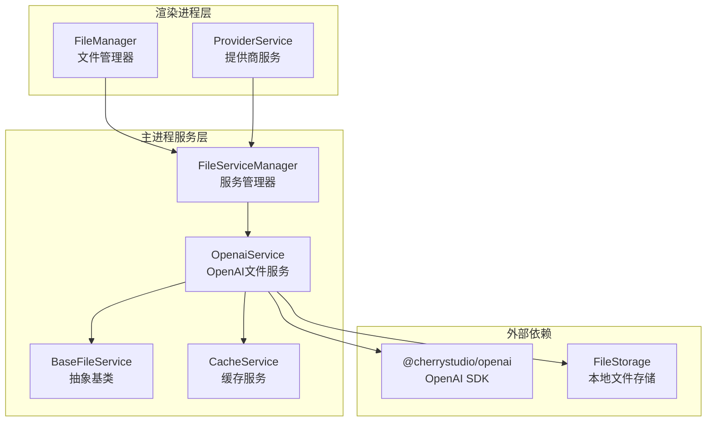
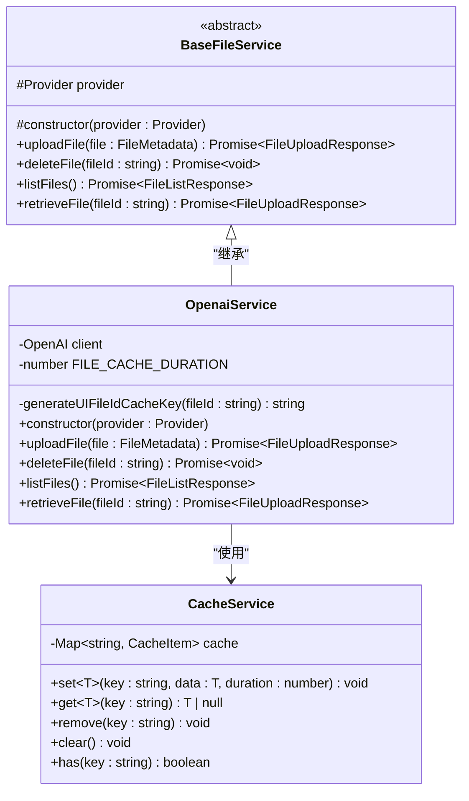
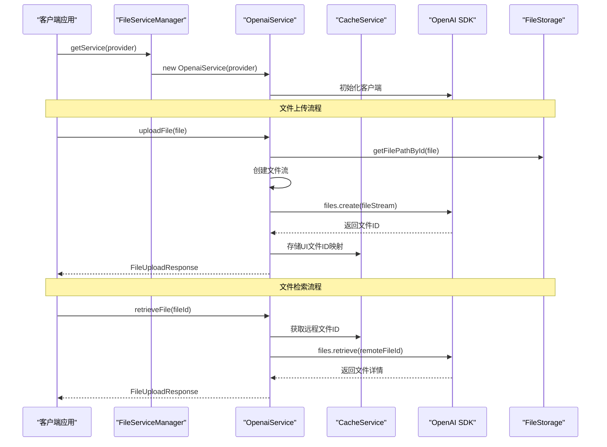
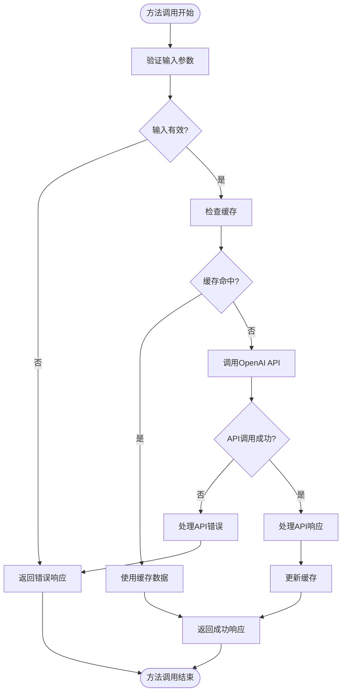
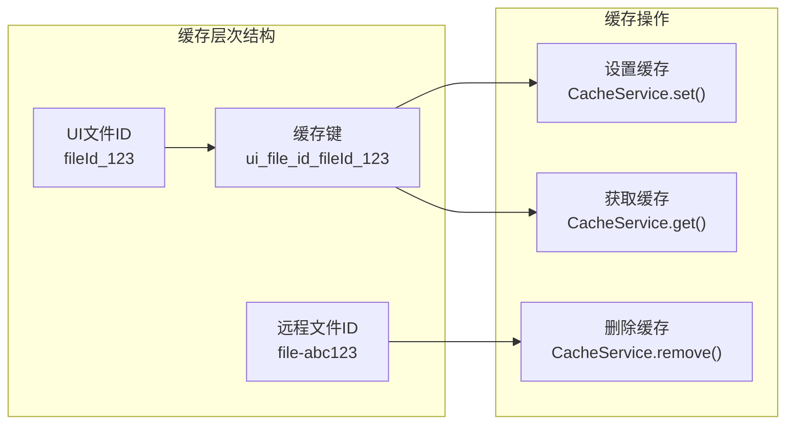
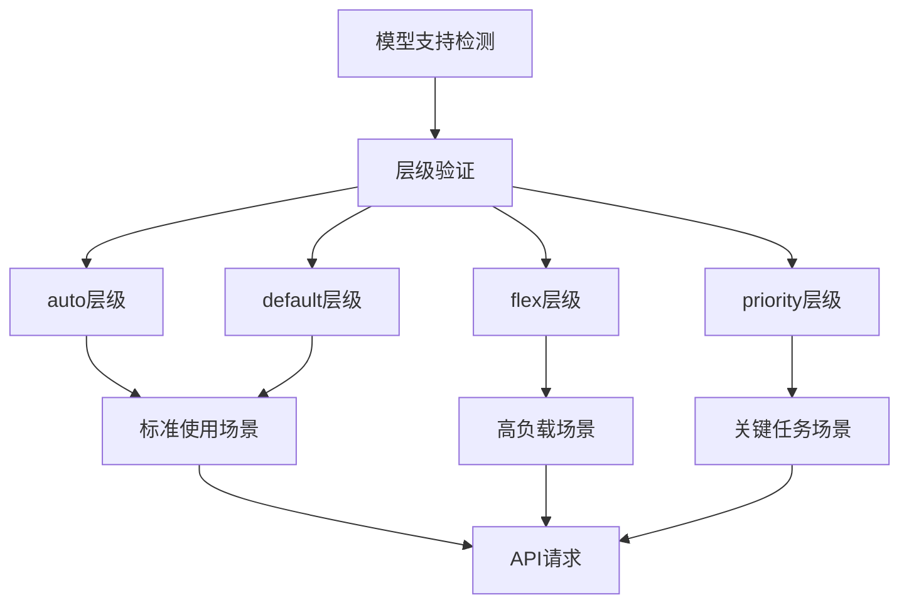
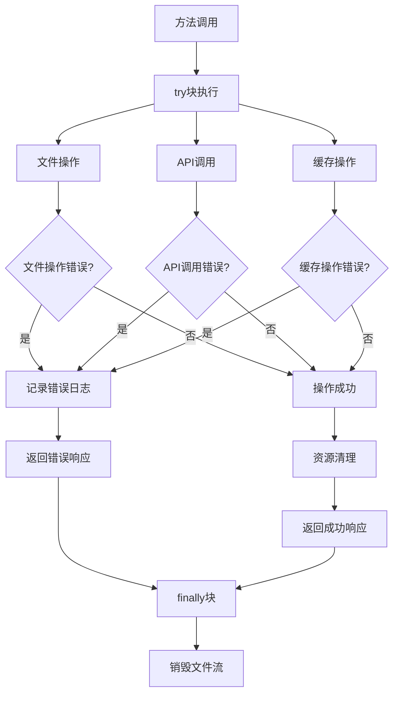

# Cherry Studio中OpenAI云服务提供商集成文档

<cite>
**本文档引用的文件**
- [OpenAIService.ts](file://src/main/services/remotefile/OpenAIService.ts)
- [BaseFileService.ts](file://src/main/services/remotefile/BaseFileService.ts)
- [CacheService.ts](file://src/main/services/CacheService.ts)
- [FileServiceManager.ts](file://src/main/services/remotefile/FileServiceManager.ts)
- [provider.ts](file://src/renderer/src/types/provider.ts)
- [file.ts](file://src/renderer/src/types/file.ts)
- [FileStorage.ts](file://src/main/services/FileStorage.ts)
</cite>

## 目录
1. [简介](#简介)
2. [项目结构概览](#项目结构概览)
3. [核心组件分析](#核心组件分析)
4. [架构设计](#架构设计)
5. [详细组件分析](#详细组件分析)
6. [缓存策略详解](#缓存策略详解)
7. [服务层级支持](#服务层级支持)
8. [错误处理机制](#错误处理机制)
9. [性能优化考虑](#性能优化考虑)
10. [故障排除指南](#故障排除指南)
11. [总结](#总结)

## 简介

Cherry Studio的OpenAI云服务提供商集成是一个基于面向对象设计模式的文件管理解决方案，通过继承`BaseFileService`抽象类实现了与OpenAI官方SDK的无缝集成。该系统提供了完整的文件生命周期管理功能，包括上传、列表、删除和检索操作，同时采用了智能缓存策略来提升性能，并支持OpenAI的不同服务层级（auto、default、flex、priority）。

## 项目结构概览

OpenAI服务集成在Cherry Studio中的组织结构体现了清晰的分层架构设计：

**图表来源**
- [OpenAIService.ts](file://src/main/services/remotefile/OpenAIService.ts#L12-L126)
- [BaseFileService.ts](file://src/main/services/remotefile/BaseFileService.ts#L3-L13)
- [FileServiceManager.ts](file://src/main/services/remotefile/FileServiceManager.ts#L8-L45)

**章节来源**
- [OpenAIService.ts](file://src/main/services/remotefile/OpenAIService.ts#L1-L126)
- [BaseFileService.ts](file://src/main/services/remotefile/BaseFileService.ts#L1-L14)

## 核心组件分析

### OpenaiService类的核心特性

`OpenaiService`类作为OpenAI文件服务的主要实现，具有以下关键特性：

| 特性 | 描述 | 实现位置 |
|------|------|----------|
| 继承关系 | 继承自BaseFileService抽象类 | [OpenAIService.ts](file://src/main/services/remotefile/OpenAIService.ts#L12-L126) |
| 缓存策略 | 使用FILE_CACHE_DURATION常量控制缓存时长 | [OpenAIService.ts](file://src/main/services/remotefile/OpenAIService.ts#L13-L14) |
| 错误处理 | 完整的try-catch-finally异常处理机制 | [OpenAIService.ts](file://src/main/services/remotefile/OpenAIService.ts#L25-L65) |
| 文件流管理 | 智能的文件流创建和销毁 | [OpenAIService.ts](file://src/main/services/remotefile/OpenAIService.ts#L26-L65) |

### 基础服务架构

**图表来源**
- [BaseFileService.ts](file://src/main/services/remotefile/BaseFileService.ts#L3-L13)
- [OpenAIService.ts](file://src/main/services/remotefile/OpenAIService.ts#L12-L126)
- [CacheService.ts](file://src/main/services/CacheService.ts#L7-L74)

**章节来源**
- [BaseFileService.ts](file://src/main/services/remotefile/BaseFileService.ts#L1-L14)
- [OpenAIService.ts](file://src/main/services/remotefile/OpenAIService.ts#L1-L126)

## 架构设计

### 整体架构流程

OpenAI服务集成采用分层架构设计，确保了良好的可维护性和扩展性：

**图表来源**
- [FileServiceManager.ts](file://src/main/services/remotefile/FileServiceManager.ts#L22-L44)
- [OpenAIService.ts](file://src/main/services/remotefile/OpenAIService.ts#L25-L124)
- [CacheService.ts](file://src/main/services/CacheService.ts#L16-L40)

### 核心方法执行流程

每个核心方法都有其特定的执行流程和错误处理机制：

**图表来源**
- [OpenAIService.ts](file://src/main/services/remotefile/OpenAIService.ts#L25-L124)

**章节来源**
- [OpenAIService.ts](file://src/main/services/remotefile/OpenAIService.ts#L25-L124)
- [FileServiceManager.ts](file://src/main/services/remotefile/FileServiceManager.ts#L22-L44)

## 详细组件分析

### uploadFile方法实现

`uploadFile`方法是OpenAI服务的核心功能之一，负责将本地文件上传到OpenAI平台：

#### 方法签名和参数处理
- 接收`FileMetadata`类型的文件元数据对象
- 从`FileStorage`获取文件的实际存储路径
- 设置文件的原始名称以提高模型理解能力

#### 文件流创建和处理
- 使用`fs.createReadStream`创建文件读取流
- 通过`Object.assign`为文件流添加元数据属性
- 确保文件名正确传递给OpenAI API

#### API调用和响应处理
- 调用`client.files.create()`方法上传文件
- 验证响应中包含有效的文件ID
- 将UI文件ID与远程文件ID建立映射关系

#### 错误处理和资源清理
- 完整的异常捕获机制
- 确保文件流在finally块中被正确销毁
- 提供详细的错误日志记录

**章节来源**
- [OpenAIService.ts](file://src/main/services/remotefile/OpenAIService.ts#L25-L65)

### listFiles方法实现

`listFiles`方法提供获取所有已上传文件的功能：

#### API调用流程
- 调用`client.files.list()`获取文件列表
- 将OpenAI API响应转换为统一的格式
- 为每个文件创建标准化的文件对象

#### 数据转换和格式化
- 提取文件的基本信息（ID、名称、大小）
- 设置文件状态为'success'
- 包装原始API响应以便后续使用

#### 错误处理机制
- 捕获API调用过程中的异常
- 返回空数组作为降级方案
- 记录详细的错误信息用于调试

**章节来源**
- [OpenAIService.ts](file://src/main/services/remotefile/OpenAIService.ts#L68-L86)

### deleteFile方法实现

`deleteFile`方法负责删除指定的文件：

#### 缓存查询和回退机制
- 首先尝试从缓存中获取远程文件ID
- 如果缓存未命中，则直接使用传入的文件ID
- 这种设计提高了删除操作的成功率

#### 删除操作和错误处理
- 调用`client.files.delete()`执行删除
- 记录删除操作的日志信息
- 抛出异常以便上层处理

**章节来源**
- [OpenAIService.ts](file://src/main/services/remotefile/OpenAIService.ts#L89-L98)

### retrieveFile方法实现

`retrieveFile`方法用于获取单个文件的详细信息：

#### 双重缓存策略
- 优先从缓存中查找远程文件ID
- 如果缓存未命中，直接使用传入的文件ID
- 这种策略平衡了性能和准确性

#### 响应构建和错误恢复
- 成功时构建完整的文件响应对象
- 失败时提供降级的错误响应
- 确保即使失败也能返回有意义的信息

**章节来源**
- [OpenAIService.ts](file://src/main/services/remotefile/OpenAIService.ts#L100-L124)

## 缓存策略详解

### 缓存架构设计

OpenAI服务集成了智能缓存机制来提升性能和用户体验：

**图表来源**
- [OpenAIService.ts](file://src/main/services/remotefile/OpenAIService.ts#L13-L14)
- [CacheService.ts](file://src/main/services/CacheService.ts#L16-L40)

### generateUIFileIdCacheKey方法

该静态方法负责生成缓存键：

#### 键命名规范
- 使用前缀`ui_file_id_`确保键的唯一性
- 将UI文件ID直接附加到键名中
- 提供一致且可预测的键生成规则

#### 缓存键的作用
- 建立UI文件ID与远程文件ID之间的映射关系
- 支持快速的反向查找操作
- 简化缓存管理和维护

**章节来源**
- [OpenAIService.ts](file://src/main/services/remotefile/OpenAIService.ts#L13-L14)

### FILE_CACHE_DURATION常量

该常量定义了缓存的有效期：

#### 时间配置
- 默认值：7天（7 × 24 × 60 × 60 × 1000毫秒）
- 单位：毫秒
- 有效期：一周

#### 性能影响
- 减少不必要的API调用
- 提高重复操作的响应速度
- 平衡内存使用和性能需求

#### 缓存过期处理
- 自动清理过期的缓存项
- 避免内存泄漏问题
- 确保数据的及时更新

**章节来源**
- [OpenAIService.ts](file://src/main/services/remotefile/OpenAIService.ts#L13)

### CacheService集成

缓存服务提供了完整的缓存管理功能：

#### 核心方法
| 方法 | 功能 | 参数 | 返回值 |
|------|------|------|--------|
| `set<T>` | 设置缓存 | key, data, duration | void |
| `get<T>` | 获取缓存 | key | T \| null |
| `remove` | 删除缓存 | key | void |
| `clear` | 清空缓存 | 无 | void |
| `has` | 检查存在 | key | boolean |

#### 缓存项结构
- `data`: 缓存的数据内容
- `timestamp`: 创建时间戳
- `duration`: 缓存持续时间（毫秒）

**章节来源**
- [CacheService.ts](file://src/main/services/CacheService.ts#L1-L74)

## 服务层级支持

### OpenAIServiceTier类型定义

Cherry Studio支持OpenAI的多种服务层级，通过类型安全的方式进行管理：

#### 支持的服务层级
| 层级 | 描述 | 适用场景 |
|------|------|----------|
| `auto` | 自动选择最优层级 | 通用场景，无需特殊配置 |
| `default` | 默认服务层级 | 标准性能要求 |
| `flex` | 弹性服务层级 | 高并发、大负载场景 |
| `priority` | 优先服务层级 | 关键任务、低延迟需求 |

#### 类型验证机制
- 使用`isOpenAIServiceTier`函数进行运行时验证
- 确保传入的服务层级值在有效范围内
- 支持`null`和`undefined`作为特殊值处理

**章节来源**
- [provider.ts](file://src/renderer/src/types/provider.ts#L54-L63)

### 服务层级的应用场景

**图表来源**
- [provider.ts](file://src/renderer/src/types/provider.ts#L54-L63)

### 不同服务层级的特点

#### auto层级
- OpenAI自动选择最优的可用层级
- 适用于大多数通用场景
- 无需用户干预

#### default层级
- 使用OpenAI的标准服务级别
- 提供稳定的性能保证
- 适合常规工作负载

#### flex层级
- 提供更高的并发能力和弹性
- 适用于大规模数据处理
- 可能产生额外费用

#### priority层级
- 优先获得计算资源
- 最低延迟的响应时间
- 适合实时应用场景

**章节来源**
- [provider.ts](file://src/renderer/src/types/provider.ts#L54-L63)

## 错误处理机制

### 分层错误处理策略

OpenAI服务实现了多层次的错误处理机制：

**图表来源**
- [OpenAIService.ts](file://src/main/services/remotefile/OpenAIService.ts#L25-L124)

### 具体错误处理实现

#### uploadFile方法的错误处理
- 文件读取失败时的安全处理
- API响应验证和错误检查
- 文件流的强制销毁机制

#### listFiles方法的错误处理
- API调用异常的优雅降级
- 空数组作为默认响应
- 详细的错误日志记录

#### deleteFile方法的错误处理
- 删除操作失败时的异常抛出
- 缓存清理的错误处理
- 日志记录和调试信息

#### retrieveFile方法的错误处理
- 缓存查询失败的回退机制
- API调用异常的降级处理
- 完整的错误响应构建

**章节来源**
- [OpenAIService.ts](file://src/main/services/remotefile/OpenAIService.ts#L25-L124)

## 性能优化考虑

### 缓存优化策略

#### 缓存命中率优化
- 合理的缓存时长设置（7天）
- 有效的键命名策略
- 及时的缓存清理机制

#### 内存使用优化
- 基于时间的自动过期机制
- 支持缓存的动态清理
- 避免内存泄漏的设计

### 文件流管理优化

#### 资源管理
- 使用`finally`块确保资源释放
- 文件流的及时销毁
- 避免文件句柄泄漏

#### 性能监控
- 操作耗时的记录
- 错误率的统计
- 缓存效率的跟踪

### API调用优化

#### 批量操作支持
- 支持多个文件的同时处理
- 减少网络往返次数
- 提高整体吞吐量

#### 连接池管理
- 复用HTTP连接
- 减少连接建立开销
- 提高并发处理能力

## 故障排除指南

### 常见问题及解决方案

#### 文件上传失败
**症状**: `uploadFile`方法返回失败状态
**可能原因**:
- 文件路径无效或文件不存在
- API密钥权限不足
- 网络连接问题
- 文件大小超出限制

**解决步骤**:
1. 验证文件路径的正确性
2. 检查API密钥的有效性
3. 确认网络连接状态
4. 查看OpenAI API的配额限制

#### 缓存失效问题
**症状**: 文件ID映射丢失，导致操作失败
**可能原因**:
- 缓存过期时间设置不当
- 缓存服务异常
- 应用程序重启导致缓存清空

**解决步骤**:
1. 检查缓存配置参数
2. 验证CacheService的正常运行
3. 实现缓存重建机制

#### API调用超时
**症状**: 文件操作长时间无响应
**可能原因**:
- 网络延迟过高
- OpenAI服务器负载过高
- 请求参数配置错误

**解决步骤**:
1. 增加超时时间设置
2. 实现重试机制
3. 监控API响应时间

### 调试和监控

#### 日志记录策略
- 关键操作的详细日志
- 错误信息的完整记录
- 性能指标的收集

#### 监控指标
- API调用成功率
- 平均响应时间
- 缓存命中率
- 错误分类统计

**章节来源**
- [OpenAIService.ts](file://src/main/services/remotefile/OpenAIService.ts#L25-L124)

## 总结

Cherry Studio的OpenAI云服务提供商集成展现了优秀的软件架构设计：

### 设计优势
- **模块化架构**: 清晰的分层设计和职责分离
- **类型安全**: 完整的TypeScript类型定义
- **性能优化**: 智能缓存和资源管理
- **错误处理**: 完善的异常处理机制

### 技术特色
- **继承设计**: 基于抽象类的扩展性
- **缓存策略**: 智能的UI文件ID映射
- **服务层级**: 对OpenAI多层级的支持
- **资源管理**: 完善的文件流处理

### 扩展性考虑
- 支持新的文件操作方法
- 可配置的缓存策略
- 灵活的服务层级配置
- 丰富的错误处理选项

该集成方案为Cherry Studio提供了稳定、高效的OpenAI文件管理能力，同时保持了良好的可维护性和扩展性，为开发者提供了可靠的基础服务。